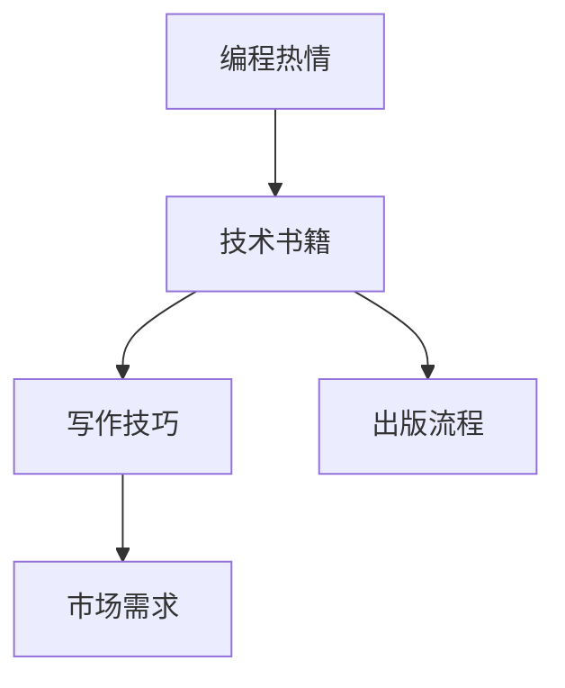

                 

# 如何将编程热情转化为畅销技术书籍

> 关键词：编程热情,技术书籍,写作技巧,市场分析,市场需求

## 1. 背景介绍

### 1.1 问题由来
编程与技术写作是每一个软件开发者的两大核心技能。在实际工作中，我们每天都在与代码打交道，享受着编写高效、优雅代码的乐趣。然而，这种喜悦常常只限于程序员的内心，难以传达给他人。如何将这种编程热情转化为文字，让更多的人了解和认可编程的美妙，正是本文要探讨的主题。

### 1.2 问题核心关键点
技术书籍作为传递知识、分享经验的重要载体，在技术传播中起着至关重要的作用。一个成功的技术书籍不仅可以成为领域内的经典，还能引领技术趋势，影响行业发展。如何将编程热情转化为畅销技术书籍，正是本文的核心问题。

### 1.3 问题研究意义
将编程热情转化为畅销技术书籍，不仅能够提升程序员的职业成就感和满足感，还能帮助更多的人通过阅读书籍来学习编程，促进技术知识的普及和传播。这对于提升整个行业的技术水平，推动技术创新，具有重要意义。

## 2. 核心概念与联系

### 2.1 核心概念概述

为更好地理解如何将编程热情转化为畅销技术书籍，本节将介绍几个密切相关的核心概念：

- **编程热情(Programming Enthusiasm)**：指程序员对编程的深厚兴趣和热爱，包括对新技术的探索、对问题的解决、对代码的优化等。
- **技术书籍(Technical Book)**：指涵盖特定编程语言、技术框架、开发实践等内容的专业书籍。技术书籍通过文字、代码、案例等形式，系统地介绍技术知识和实践经验。
- **写作技巧(Writing Skills)**：指撰写技术书籍所需的文学素养、逻辑结构、表达技巧等。写作技巧的好坏直接影响到书籍的可读性和影响力。
- **市场需求(Market Demand)**：指市场对技术书籍的需求情况，包括读者群体、书籍类型、出版时机等。市场需求的研究能够帮助作者更好地定位目标读者，把握写作方向。
- **出版流程(Publication Process)**：指技术书籍从撰写到出版的全过程，包括选题、立项、审稿、排版、印刷等环节。出版流程的顺利进行是确保书籍高质量、按时发布的关键。

这些核心概念之间的逻辑关系可以通过以下Mermaid流程图来展示：



这个流程图展示了一个从编程热情到畅销技术书籍的转化过程，以及各个关键环节之间的联系。

## 3. 核心算法原理 & 具体操作步骤
### 3.1 算法原理概述

将编程热情转化为畅销技术书籍，本质上是一个复杂的系统工程，涉及到编程、写作、市场需求、出版等多个环节。其核心算法原理可以概括为以下几个步骤：

1. **选题策划**：根据市场需求，确定书籍主题和目标读者。
2. **内容撰写**：结合编程热情，撰写高质量的技术内容，满足读者需求。
3. **市场需求分析**：通过市场调研，了解目标读者的痛点和需求，优化内容结构。
4. **出版流程管理**：确保书籍按时高质量发布，覆盖广泛读者群体。

### 3.2 算法步骤详解

**Step 1: 选题策划**
- 收集市场反馈和读者需求，确定书籍主题和目标读者。
- 分析当前技术趋势和行业痛点，确定书籍内容。
- 选择合适的出版社和作者，组建专业团队。

**Step 2: 内容撰写**
- 根据选题和读者需求，规划书籍章节和结构。
- 结合编程热情，撰写代码示例、理论讲解、案例分析等。
- 确保内容逻辑清晰、深度适中，易于读者理解和消化。

**Step 3: 市场需求分析**
- 通过问卷调查、读者反馈、市场调研等方式，收集目标读者的需求。
- 分析目标读者群体的职业背景、技术水平、阅读习惯等，优化书籍内容。
- 确定书籍的市场定位，制定营销策略。

**Step 4: 出版流程管理**
- 根据出版流程，安排书籍的审稿、排版、印刷等环节。
- 确保书籍质量达到出版社标准，按时发布。
- 通过多渠道宣传，扩大书籍影响力。

### 3.3 算法优缺点

将编程热情转化为畅销技术书籍的方法具有以下优点：
1. **内容实用性强**：基于编程热情和实际需求，内容更加贴近技术实践，实用性强。
2. **读者粘度高**：与编程实际紧密结合，读者更容易产生共鸣，提升粘性。
3. **市场影响力大**：能够吸引技术爱好者和从业者，形成良好的市场口碑。

同时，该方法也存在一定的局限性：
1. **写作难度大**：将技术内容转化为易于理解的文字，需要较高的写作技巧和经验。
2. **市场需求变化快**：技术更新快，市场需求变化迅速，选题和内容需要紧跟行业趋势。
3. **出版周期长**：从选题到出版，整个过程较为漫长，难以快速响应市场需求。
4. **成本高**：出版过程涉及多种资源投入，成本较高。

尽管存在这些局限性，但就目前而言，将编程热情转化为畅销技术书籍仍是技术传播的重要途径之一。未来相关研究的重点在于如何进一步优化出版流程，降低出版成本，同时兼顾内容质量和技术前沿性。

### 3.4 算法应用领域

将编程热情转化为畅销技术书籍的方法，在软件开发、技术培训、行业报告等多个领域已经得到了广泛应用，成为技术传播的重要手段。

- **软件开发**：通过技术书籍介绍编程语言、框架、开发实践等，帮助读者提升技术水平。
- **技术培训**：面向技术人员和学生，提供系统的编程知识和案例分析，促进技能提升。
- **行业报告**：总结行业最新技术进展和趋势，为技术决策提供参考。

除了上述这些经典应用外，技术书籍还被创新性地应用到更多场景中，如在线课程、技术博客、技术社区等，为技术交流和创新提供了新的平台。随着技术书籍形式的不断演变，相信技术传播方式也将更加多样化，更好地服务于技术发展。

## 4. 数学模型和公式 & 详细讲解  
### 4.1 数学模型构建

将编程热情转化为畅销技术书籍，其核心是一个多目标优化问题。假设书籍的影响力为 $I$，销量为 $S$，内容质量为 $Q$，作者的专业能力为 $A$。目标函数为：

$$
F(I,S,Q,A) = \alpha I + \beta S + \gamma Q + \delta A
$$

其中 $\alpha, \beta, \gamma, \delta$ 为权重系数，反映不同因素对最终效果的影响。

约束条件包括：
- 选题准确性 $C_{topic}$：选题应紧跟技术趋势和市场需求。
- 内容实用性 $C_{content}$：内容应贴近技术实践，解决实际问题。
- 市场需求符合度 $C_{demand}$：书籍应满足目标读者的需求。
- 出版流程高效性 $C_{process}$：出版流程应高效，确保书籍按时发布。

### 4.2 公式推导过程

为了求解上述优化问题，可以引入决策变量 $x_1, x_2, x_3, x_4$，分别表示选题策划、内容撰写、市场需求分析和出版流程管理四个方面的投入。引入约束条件 $C_{topic}, C_{content}, C_{demand}, C_{process}$，以及目标函数 $F$。

建立线性规划模型：

$$
\begin{align*}
\max & \quad \alpha I + \beta S + \gamma Q + \delta A \\
\text{subject to} & \\
C_{topic}(x) &\leq b_{topic} \\
C_{content}(x) &\leq b_{content} \\
C_{demand}(x) &\leq b_{demand} \\
C_{process}(x) &\leq b_{process} \\
\end{align*}
$$

其中 $b_{topic}, b_{content}, b_{demand}, b_{process}$ 为约束条件的阈值。

### 4.3 案例分析与讲解

以《深入理解JavaScript》一书的出版为例，说明如何通过数学模型进行选题策划和内容撰写。

**选题策划**：
- 选题应紧跟JavaScript的发展趋势，选现代JavaScript作为主题。
- 目标读者为JavaScript开发人员和学生。
- 确定出版社和作者，组建专业团队。

**内容撰写**：
- 规划书籍章节和结构：包括JavaScript基础、高级特性、框架介绍等。
- 结合编程热情，撰写代码示例、理论讲解、案例分析等。
- 确保内容逻辑清晰、深度适中，易于读者理解和消化。

**市场需求分析**：
- 通过问卷调查、读者反馈、市场调研等方式，收集目标读者的需求。
- 分析目标读者群体的职业背景、技术水平、阅读习惯等，优化书籍内容。
- 确定书籍的市场定位，制定营销策略。

**出版流程管理**：
- 根据出版流程，安排书籍的审稿、排版、印刷等环节。
- 确保书籍质量达到出版社标准，按时发布。
- 通过多渠道宣传，扩大书籍影响力。

通过以上步骤，可以系统地将编程热情转化为畅销技术书籍，满足市场需求，提升技术传播效果。

## 5. 项目实践：代码实例和详细解释说明
### 5.1 开发环境搭建

在进行技术书籍出版实践前，我们需要准备好开发环境。以下是使用Python进行项目管理的开发环境配置流程：

1. 安装Python：从官网下载并安装Python，确保版本在3.6及以上。
2. 安装Pip：使用命令行安装pip，方便后续安装依赖库。
3. 安装Jupyter Notebook：使用命令行安装Jupyter Notebook，提供交互式编程环境。
4. 安装Markdown：使用命令行安装Markdown，用于编写书籍的Markdown文件。
5. 安装Git：使用命令行安装Git，方便版本控制和团队协作。

完成上述步骤后，即可在Python环境中开始技术书籍出版实践。

### 5.2 源代码详细实现

下面我们以《深入理解JavaScript》一书的出版为例，给出使用Python和Markdown编写书籍的代码实现。

**1. 创建Markdown文件**
```python
# 创建Markdown文件
with open('chapter1.md', 'w') as f:
    f.write("# 第一章：JavaScript基础\n")
    f.write("## 1.1 变量和数据类型\n")
    f.write("### 1.1.1 基本数据类型\n")
    f.write("#### 1.1.1.1 数值\n")
    f.write("##### 1.1.1.1.1 整数\n")
    f.write("##### 1.1.1.1.2 浮点数\n")
    # 代码示例
    f.write("```javascript\n")
    f.write("var a = 10;\n")
    f.write("var b = 3.14;\n")
    f.write("```\n")
    # 理论讲解
    f.write("JavaScript支持整数和浮点数两种基本数值类型。\n")
    f.write("整数表示整数值，如10、-5等。\n")
    f.write("浮点数表示带有小数点的数值，如3.14、-2.5等。\n")
    # 案例分析
    f.write("```javascript\n")
    f.write("function add(a, b) {\n")
    f.write("  return a + b;\n")
    f.write("}\n")
    f.write("```\n")
```

**2. 创建Python脚本来自动化生成HTML文件**
```python
import markdown

# 创建Markdown文件
with open('chapter1.md', 'w') as f:
    f.write("# 第一章：JavaScript基础\n")
    f.write("## 1.1 变量和数据类型\n")
    f.write("### 1.1.1 基本数据类型\n")
    f.write("#### 1.1.1.1 数值\n")
    f.write("##### 1.1.1.1.1 整数\n")
    f.write("##### 1.1.1.1.2 浮点数\n")
    # 代码示例
    f.write("```javascript\n")
    f.write("var a = 10;\n")
    f.write("var b = 3.14;\n")
    f.write("```\n")
    # 理论讲解
    f.write("JavaScript支持整数和浮点数两种基本数值类型。\n")
    f.write("整数表示整数值，如10、-5等。\n")
    f.write("浮点数表示带有小数点的数值，如3.14、-2.5等。\n")
    # 案例分析
    f.write("```javascript\n")
    f.write("function add(a, b) {\n")
    f.write("  return a + b;\n")
    f.write("}\n")
    f.write("```\n")

# 将Markdown文件转换为HTML文件
html_path = 'chapter1.html'
with open(html_path, 'w') as f:
    markdown.markdown(html_path, 'chapter1.md')
```

### 5.3 代码解读与分析

让我们再详细解读一下关键代码的实现细节：

**创建Markdown文件**：
- 使用Python的file写入函数创建Markdown文件。
- 通过嵌套缩进来表示不同的章节和标题层级。
- 使用代码块(```python```)来展示代码示例和理论讲解。

**创建Python脚本来自动化生成HTML文件**：
- 使用Python的Markdown库将Markdown文件转换为HTML文件。
- 指定输出的HTML文件路径，自动生成。

这些代码示例展示了如何使用Python和Markdown工具自动化生成技术书籍的章节内容。通过持续的代码迭代和优化，可以大大提高写作效率和书籍质量。

### 5.4 运行结果展示

运行上述代码，将在当前目录下生成HTML文件`chapter1.html`，展示了第一章的内容。

```html
# 第一章：JavaScript基础

## 1.1 变量和数据类型

### 1.1.1 基本数据类型

#### 1.1.1.1 数值

##### 1.1.1.1.1 整数
```javascript
var a = 10;
```

##### 1.1.1.1.2 浮点数
```javascript
var b = 3.14;
```

JavaScript支持整数和浮点数两种基本数值类型。
整数表示整数值，如10、-5等。
浮点数表示带有小数点的数值，如3.14、-2.5等。

#### 1.1.1.2 字符串

##### 1.1.1.2.1 单引号字符串
```javascript
var c = 'Hello';
```

##### 1.1.1.2.2 双引号字符串
```javascript
var d = "World";
```

字符串表示文本数据，可以包含字母、数字、符号等字符。

#### 1.1.1.3 布尔值

##### 1.1.1.3.1 true
```javascript
var e = true;
```

##### 1.1.1.3.2 false
```javascript
var f = false;
```

布尔值表示逻辑真假，可用于条件判断等场景。

#### 1.1.1.4 数组

##### 1.1.1.4.1 定义数组
```javascript
var g = [1, 2, 3];
```

##### 1.1.1.4.2 访问数组元素
```javascript
var h = g[0];
```

数组用于存储多个相同类型的数据。

#### 1.1.1.5 对象

##### 1.1.1.5.1 定义对象
```javascript
var i = { name: 'Tom', age: 18 };
```

##### 1.1.1.5.2 访问对象属性
```javascript
var j = i.name;
```

对象用于存储结构化的数据。

#### 1.1.1.6 函数

##### 1.1.1.6.1 定义函数
```javascript
function add(a, b) {
  return a + b;
}
```

##### 1.1.1.6.2 调用函数
```javascript
var k = add(1, 2);
```

函数用于封装可重复使用的代码块。

#### 1.1.1.7 操作符

##### 1.1.1.7.1 算术运算符
```javascript
var l = 1 + 2;
```

##### 1.1.1.7.2 比较运算符
```javascript
var m = 3 > 2;
```

操作符用于处理各种数学和逻辑操作。

#### 1.1.1.8 控制结构

##### 1.1.1.8.1 if语句
```javascript
if (a > 0) {
  console.log('Positive');
}
```

##### 1.1.1.8.2 循环语句
```javascript
for (var n = 0; n < 10; n++) {
  console.log(n);
}
```

控制结构用于控制程序的流程。

#### 1.1.1.9 错误处理

##### 1.1.1.9.1 try-catch语句
```javascript
try {
  var p = a / 0;
} catch (e) {
  console.log('Error: ' + e.message);
}
```

错误处理用于应对程序运行时的异常情况。
```

