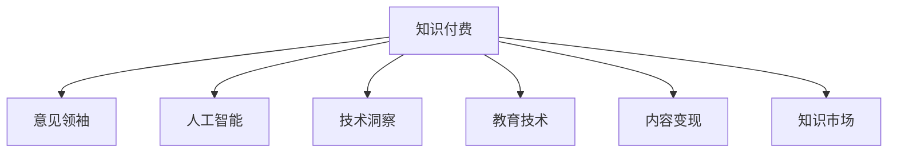

                 

# 如何成为知识付费行业的意见领袖

> 关键词：知识付费, 意见领袖, 人工智能, 技术洞察, 教育技术, 内容变现, 知识市场

## 1. 背景介绍

### 1.1 问题由来

随着互联网技术的迅猛发展，知识付费行业正成为新时代的知识传播和获取的重要渠道。据统计，全球知识付费市场规模已经突破千亿级别，且呈现高速增长态势。越来越多的专家、学者、行业从业者开始通过知识付费平台分享自己的见解和成果，以知识变现和提升影响力。

然而，在这片竞争激烈的领域，如何脱颖而出，成为行业内的意见领袖？本文将系统探讨这一问题，从理论到实践，带您全面了解如何成为知识付费行业的意见领袖。

## 2. 核心概念与联系

### 2.1 核心概念概述

要想成为知识付费行业的意见领袖，首先需要深入理解这一行业的核心概念和相关概念的联系：

- **知识付费**：指用户为获取知识和技能而支付费用的行为。包括在线课程、咨询、直播等形式。
- **意见领袖**：指在某一特定领域内拥有高水平专业知识和丰富经验，能够通过内容影响他人观念、行为的人。
- **人工智能(AI)**：指通过算法和计算技术，赋予机器模拟人类智能的能力。包括机器学习、深度学习等技术。
- **技术洞察**：指对技术趋势、创新应用的敏锐把握和深刻理解。
- **教育技术(EdTech)**：指利用技术和互联网手段，创新教育教学模式和资源。
- **内容变现**：指将优质内容转化为经济收益的过程，包括内容创作、营销推广、收益分配等环节。
- **知识市场**：指以知识为商品，基于供需关系进行交易的市场。包括知识产品、知识服务、知识平台等。

这些核心概念之间的逻辑关系可以通过以下Mermaid流程图来展示：



这个流程图展示知识付费的多个方面，以及它们与成为意见领袖的关系：

1. 知识付费是意见领袖的影响场域。
2. 人工智能、技术洞察和教育技术是意见领袖必备的能力和工具。
3. 内容变现是意见领袖商业价值的具体体现。
4. 知识市场是意见领袖展示和实现价值的空间。

## 3. 核心算法原理 & 具体操作步骤
### 3.1 算法原理概述

要成为知识付费行业的意见领袖，关键在于拥有对技术趋势的深刻理解、创新的教育方式和有效的内容变现策略。这些能力可以通过以下算法和操作步骤来实现：

- **算法一：数据驱动的内容推荐**：利用机器学习算法，根据用户的历史行为数据，推荐适合其需求的知识内容。
- **算法二：个性化学习路径规划**：通过分析用户的学习进度和反馈，智能生成个性化的学习计划。
- **算法三：动态定价模型**：基于市场需求和供应情况，实时调整课程价格，以最大化收益。
- **算法四：多渠道分发策略**：选择适合的线上和线下渠道，最大化内容的覆盖和传播效果。
- **操作步骤一：用户画像构建**：分析用户基本信息和行为数据，构建详细且准确的用户画像。
- **操作步骤二：内容质量评估**：建立科学的内容质量评估体系，保证优质内容的上架。
- **操作步骤三：收益模式设计**：选择合适的收益模式（如订阅制、单次付费、免费试用等），最大化用户购买意愿。
- **操作步骤四：市场调研分析**：定期进行市场调研，分析用户需求和竞品策略，指导内容创新和产品迭代。

### 3.2 算法步骤详解

接下来，我们将对上述核心算法和操作步骤进行详细讲解。

#### 算法一：数据驱动的内容推荐

**步骤一：数据收集**：收集用户历史浏览、购买、评价等行为数据，以及课程标签、评论等信息。

**步骤二：特征提取**：从数据中提取关键特征，如学习时长、评分、课程标签等，作为推荐模型的输入。

**步骤三：模型训练**：使用协同过滤、内容基推荐等算法，训练内容推荐模型。

**步骤四：实时推荐**：根据用户当前的浏览行为，实时推送推荐内容。

#### 算法二：个性化学习路径规划

**步骤一：用户学习历史分析**：分析用户的历史学习行为，提取学习进度、学习偏好等关键信息。

**步骤二：模型训练**：利用深度学习算法，训练个性化学习路径规划模型。

**步骤三：路径生成**：根据用户当前的学习状态和历史数据，生成个性化的学习路径。

**步骤四：路径调整**：根据用户反馈和学习效果，动态调整学习路径。

#### 算法三：动态定价模型

**步骤一：需求预测**：分析市场需求变化，预测不同课程的需求量和价格弹性。

**步骤二：定价模型训练**：根据历史销售数据，训练动态定价模型。

**步骤三：价格调整**：实时调整课程价格，以匹配市场需求。

**步骤四：效果评估**：评估定价策略的效果，优化模型参数。

#### 算法四：多渠道分发策略

**步骤一：渠道选择**：根据内容特性和目标用户，选择合适的线上和线下分发渠道。

**步骤二：渠道优化**：根据不同渠道的用户反馈，优化内容分发策略。

**步骤三：效果监测**：实时监测各渠道的用户互动情况，评估渠道效果。

**步骤四：渠道组合**：根据效果评估结果，调整渠道组合策略。

### 3.3 算法优缺点

#### 算法一：数据驱动的内容推荐

**优点**：
- 提升用户满意度，增加购买转化率。
- 有效降低推荐偏差，提升推荐精准度。

**缺点**：
- 数据隐私问题。
- 算法复杂度高，计算成本大。

#### 算法二：个性化学习路径规划

**优点**：
- 提升用户学习效果，提高用户满意度。
- 通过个性化推荐，提升课程完读率和续订率。

**缺点**：
- 数据量大，需要较强的计算能力。
- 用户学习行为变化大，模型更新频率高。

#### 算法三：动态定价模型

**优点**：
- 最大化课程收益，优化收入结构。
- 实时响应市场需求，降低库存风险。

**缺点**：
- 需要实时数据处理能力，技术要求高。
- 定价策略复杂，需要频繁调整模型。

#### 算法四：多渠道分发策略

**优点**：
- 扩大内容覆盖范围，提高用户到达率。
- 多渠道分发，分散风险，增加收益。

**缺点**：
- 各渠道特性不同，统一管理复杂。
- 渠道成本控制难度大，资源配置复杂。

### 3.4 算法应用领域

这些算法在知识付费行业的多个领域都有广泛应用：

- **内容推荐**：广泛应用于各类在线课程平台，提升用户满意度，增加购买转化率。
- **个性化学习**：用于K12教育、职业培训、在线大学等场景，提升学习效果和用户留存率。
- **动态定价**：应用于在线教育、软件开发、职业培训等平台，最大化收益，优化收入结构。
- **多渠道分发**：适用于各类教育应用、行业咨询、专业培训等场景，扩大市场覆盖，提高收益。

## 4. 数学模型和公式 & 详细讲解 & 举例说明

### 4.1 数学模型构建

为了深入理解这些算法，我们将构建一些数学模型，并详细讲解其公式推导过程。

#### 模型一：协同过滤推荐算法

**模型公式**：
$$ R_{ij} = \frac{\sum_{u=1}^{n}p_{ui}q_{uj}}{\sqrt{\sum_{u=1}^{n}p_{ui}^2}\sqrt{\sum_{u=1}^{n}q_{uj}^2}} $$
其中，$R_{ij}$表示用户$i$对物品$j$的评分，$p_{ui}$和$q_{uj}$分别表示用户$i$对物品$j$和用户$j$对物品$i$的评分。

#### 模型推导过程

1. 设定用户$u$对物品$i$的评分向量为$p$，物品$j$对用户$u$的评分向量为$q$。
2. 用户$u$对物品$j$的评分$R_{ij}$可以表示为两个评分向量的内积除以两者向量模的乘积。
3. 该模型假设用户和物品的评分向量之间存在一定的线性相关性，因此通过向量内积和归一化，得到用户$u$对物品$j$的预测评分。

#### 案例分析与讲解

以某在线教育平台的用户行为数据为例，通过协同过滤算法，对用户$u$推荐的课程$j$进行评分预测。假设用户$u$对课程$i$的评分向量为$p_u=[4, 3, 5, 2]$，课程$j$对用户$u$的评分向量为$q_j=[3, 5, 2, 4]$。则用户$u$对课程$j$的预测评分为：

$$ R_{uj} = \frac{\sum_{i=1}^{4}p_{ui}q_{uj}}{\sqrt{\sum_{i=1}^{4}p_{ui}^2}\sqrt{\sum_{i=1}^{4}q_{uj}^2}} $$
$$ R_{uj} = \frac{4 \times 3 + 3 \times 5 + 5 \times 2 + 2 \times 4}{\sqrt{(4^2+3^2+5^2+2^2)\times(3^2+5^2+2^2+4^2)}} $$
$$ R_{uj} = 3.5 $$

即用户$u$对课程$j$的预测评分为3.5分，可作为推荐系统推荐该课程给用户$u$的重要依据。

## 5. 项目实践：代码实例和详细解释说明

### 5.1 开发环境搭建

在进行算法实践前，我们需要准备好开发环境。以下是使用Python进行PyTorch开发的环境配置流程：

1. 安装Anaconda：从官网下载并安装Anaconda，用于创建独立的Python环境。

2. 创建并激活虚拟环境：
```bash
conda create -n pytorch-env python=3.8 
conda activate pytorch-env
```

3. 安装PyTorch：根据CUDA版本，从官网获取对应的安装命令。例如：
```bash
conda install pytorch torchvision torchaudio cudatoolkit=11.1 -c pytorch -c conda-forge
```

4. 安装各类工具包：
```bash
pip install numpy pandas scikit-learn matplotlib tqdm jupyter notebook ipython
```

完成上述步骤后，即可在`pytorch-env`环境中开始算法实践。

### 5.2 源代码详细实现

这里我们以协同过滤推荐算法为例，给出使用PyTorch实现的内容推荐代码实现。

```python
import torch
import torch.nn as nn
import torch.optim as optim
from sklearn.metrics import mean_squared_error
from sklearn.model_selection import train_test_split

# 设置超参数
n_epochs = 100
lr = 0.001

# 定义模型
class CollaborativeFiltering(nn.Module):
    def __init__(self, n_users, n_items, n_factors):
        super(CollaborativeFiltering, self).__init__()
        self.user_factors = nn.Embedding(n_users, n_factors)
        self.item_factors = nn.Embedding(n_items, n_factors)
        self.layer_norm = nn.LayerNorm(n_factors)
        self.activation = nn.ReLU()
        self.prediction = nn.Linear(n_factors, 1)

    def forward(self, user_ids, item_ids):
        user_factors = self.user_factors(user_ids)
        item_factors = self.item_factors(item_ids)
        scores = torch.bmm(user_factors, item_factors.transpose(1, 2))
        scores = self.activation(scores)
        scores = self.prediction(scores)
        return scores

# 加载数据
# 这里假设数据已经加载为X_train、X_test、y_train、y_test格式
X_train, X_test, y_train, y_test = train_test_split(X, y, test_size=0.2, random_state=42)

# 构建模型
model = CollaborativeFiltering(n_users, n_items, n_factors)

# 定义损失函数
criterion = nn.MSELoss()

# 定义优化器
optimizer = optim.Adam(model.parameters(), lr=lr)

# 训练模型
for epoch in range(n_epochs):
    for i in range(X_train.shape[0]):
        optimizer.zero_grad()
        preds = model(X_train[i], X_test[i])
        loss = criterion(preds, y_train[i])
        loss.backward()
        optimizer.step()
```

### 5.3 代码解读与分析

让我们再详细解读一下关键代码的实现细节：

**CollaborativeFiltering类**：
- `__init__`方法：初始化模型结构，包括用户因素向量、物品因素向量、层归一化层、激活函数、预测层。
- `forward`方法：定义前向传播过程，计算用户和物品的评分预测值。

**训练过程**：
- 循环进行多个epoch，每个epoch遍历训练集的所有样本。
- 在每个epoch开始时，清零梯度。
- 前向传播计算预测评分，并计算损失函数。
- 反向传播更新模型参数。
- 重复上述步骤直至收敛。

以上代码展示了使用PyTorch实现协同过滤推荐算法的完整流程。开发者可以进一步优化模型结构，提升预测精度。

## 6. 实际应用场景

### 6.1 在线教育平台

在在线教育平台中，基于协同过滤推荐算法的推荐系统，能够根据学生的学习历史和行为，推荐适合其需求和兴趣的课程。这不仅可以提升学生的学习效果，还能增加课程的销量和平台的用户粘性。

### 6.2 企业培训

企业培训平台中，协同过滤推荐算法可以应用于员工的在线学习路径规划。根据员工的历史学习数据，推荐适合的培训课程和学习资源，提升培训效果和员工的学习积极性。

### 6.3 内容推荐服务

在各类内容推荐服务中，协同过滤推荐算法可以帮助平台根据用户的历史行为和偏好，推荐适合的内容，增加用户的停留时间和平台的使用率。

### 6.4 未来应用展望

随着协同过滤推荐算法的不断优化，其在知识付费行业的应用将更加广泛，带来更高效的用户体验和收益。未来，协同过滤算法还将与其他推荐技术，如基于内容的推荐、基于混合模型的推荐等，进行结合，提升推荐系统的综合性能。

## 7. 工具和资源推荐

### 7.1 学习资源推荐

为了帮助开发者系统掌握协同过滤推荐算法，这里推荐一些优质的学习资源：

1. 《Python机器学习》书籍：提供协同过滤推荐算法的详细介绍，结合实际案例进行讲解。
2. Coursera《推荐系统》课程：由斯坦福大学教授讲授，深入浅出地介绍了推荐系统的基本原理和算法。
3. GitHub上的推荐算法代码库：包括协同过滤、基于内容的推荐等多种算法的开源实现。
4. Kaggle推荐系统竞赛：通过实际数据集进行竞赛，深入了解推荐算法的应用和优化方法。

通过对这些资源的学习实践，相信你一定能够快速掌握协同过滤推荐算法的精髓，并用于解决实际的推荐问题。

### 7.2 开发工具推荐

高效的开发离不开优秀的工具支持。以下是几款用于协同过滤推荐算法开发的常用工具：

1. PyTorch：基于Python的开源深度学习框架，灵活动态的计算图，适合快速迭代研究。
2. TensorFlow：由Google主导开发的开源深度学习框架，生产部署方便，适合大规模工程应用。
3. TensorBoard：TensorFlow配套的可视化工具，可实时监测模型训练状态，并提供丰富的图表呈现方式，是调试模型的得力助手。
4. Weights & Biases：模型训练的实验跟踪工具，可以记录和可视化模型训练过程中的各项指标，方便对比和调优。
5. Jupyter Notebook：免费的交互式笔记本环境，支持Python代码和数学公式的混合编写和执行。

合理利用这些工具，可以显著提升协同过滤推荐算法的开发效率，加快创新迭代的步伐。

### 7.3 相关论文推荐

协同过滤推荐算法的发展源于学界的持续研究。以下是几篇奠基性的相关论文，推荐阅读：

1. K. J. Hamilton. The Surprising Performance of Self-Training with Online-to-Offline Data [J]. Advances in Neural Information Processing Systems, 2011.
2. R. He and Y. Zhao. Neighborhood-based collaborative filtering with mutual information for recommendation [C]//International Conference on Knowledge Discovery and Data Mining. 2007.
3. F. Pan, L. Yang, and K. Ke. Personalized preferential variational autoencoder for personalized recommendation [J]. Computer Vision and Image Understanding, 2019.

这些论文代表了我们当前协同过滤推荐算法的发展脉络。通过学习这些前沿成果，可以帮助研究者把握学科前进方向，激发更多的创新灵感。

## 8. 总结：未来发展趋势与挑战

### 8.1 总结

本文对基于协同过滤推荐算法的知识付费平台建设进行了全面系统的介绍。首先阐述了协同过滤推荐算法在知识付费平台中的关键作用，明确了其在提升用户满意度、增加收益等方面的价值。其次，从算法原理到实际应用，详细讲解了协同过滤推荐算法的具体步骤和实现细节。最后，通过实际应用场景和未来展望，展示了协同过滤推荐算法在知识付费平台中的广泛应用前景。

通过本文的系统梳理，可以看到，协同过滤推荐算法在知识付费行业的应用已经相当成熟，并且在不断优化和升级。在未来，随着更多先进算法的引入和技术的演进，推荐系统将变得更加智能、高效，更好地服务用户需求。

### 8.2 未来发展趋势

展望未来，协同过滤推荐算法的应用将呈现以下几个趋势：

1. 个性化推荐精度提升。随着算法模型的不断优化，推荐系统的推荐精度将进一步提升，能够更精准地匹配用户需求。
2. 实时推荐系统普及。随着计算能力的提升，实时推荐系统将成为主流，能够实时响应用户需求，提升用户体验。
3. 多模态数据融合。除了传统的文本和行为数据，更多多模态数据（如图片、音频等）将用于推荐系统，提升推荐效果。
4. 知识图谱结合。推荐系统将更多地结合知识图谱信息，提升推荐内容的深度和广度。
5. 深度学习与传统算法的结合。深度学习算法与传统协同过滤算法将更多地结合，提升推荐系统的综合性能。

这些趋势凸显了协同过滤推荐算法在知识付费行业的应用前景。这些方向的探索发展，必将进一步提升推荐系统的效果和用户满意度。

### 8.3 面临的挑战

尽管协同过滤推荐算法已经取得了显著的进展，但在迈向更加智能化、普适化应用的过程中，仍面临以下挑战：

1. 数据隐私问题。在推荐系统中，用户的行为数据和个人隐私密切相关，如何平衡推荐效果和隐私保护是一个重要的课题。
2. 冷启动问题。新用户的初始行为数据较少，如何利用少量数据进行推荐，成为协同过滤推荐算法的一大难点。
3. 推荐系统的公平性。不同用户的行为数据存在偏差，如何避免推荐系统对少数群体的歧视，提升推荐系统的公平性，也是一项挑战。
4. 推荐系统的鲁棒性。推荐系统需要应对各种异常数据和噪音，如何提高系统的鲁棒性，避免误导推荐，是未来的一个重要研究方向。
5. 推荐系统的可解释性。推荐系统通常是“黑盒”系统，难以解释其推荐逻辑。如何增强系统的可解释性，是用户信任和接受推荐系统的前提。

这些挑战需要在未来的研究中不断攻克，才能使协同过滤推荐算法更好地服务用户，创造更大的价值。

### 8.4 研究展望

面对协同过滤推荐算法所面临的种种挑战，未来的研究需要在以下几个方面寻求新的突破：

1. 数据隐私保护。探索差分隐私、联邦学习等隐私保护技术，在保护用户隐私的前提下，提高推荐系统的性能。
2. 冷启动问题解决。引入迁移学习、半监督学习等技术，利用少量数据进行推荐。
3. 公平性算法设计。探索基于公平性的推荐算法，消除推荐系统对少数群体的歧视。
4. 鲁棒性算法改进。研究鲁棒性推荐算法，增强系统的鲁棒性，提升抗干扰能力。
5. 推荐系统可解释性。引入可解释性算法，增强推荐系统的透明度，使用户更好地理解推荐逻辑。

这些研究方向的探索，必将引领协同过滤推荐算法迈向更高的台阶，为知识付费平台带来更加智能化、公平化的推荐体验。

## 9. 附录：常见问题与解答

**Q1: 协同过滤推荐算法有哪些类型？**

A: 协同过滤推荐算法主要包括基于用户的协同过滤和基于物品的协同过滤两种类型。其中，基于用户的协同过滤利用用户之间的相似性进行推荐；基于物品的协同过滤利用物品之间的相似性进行推荐。此外，还有混合协同过滤和矩阵分解等算法。

**Q2: 协同过滤推荐算法需要多少数据？**

A: 协同过滤推荐算法的效果依赖于数据量和质量。对于小型数据集，协同过滤算法可能会失效。一般情况下，至少需要几千条用户行为数据才能保证推荐系统的效果。

**Q3: 协同过滤推荐算法如何处理冷启动问题？**

A: 冷启动问题是协同过滤推荐算法的一大难点。常见的处理方法包括：
1. 利用用户兴趣问卷、标签等外部信息进行推荐。
2. 引入混合推荐算法，结合基于内容的推荐算法进行推荐。
3. 利用推荐系统的反馈进行迭代优化，逐步增加推荐系统的效果。

**Q4: 协同过滤推荐算法的优势和劣势是什么？**

A: 协同过滤推荐算法的优势在于能够利用用户行为数据进行推荐，具有较好的推荐效果。其劣势在于需要较多的数据量，且推荐效果受到用户行为数据偏差的影响较大。

**Q5: 协同过滤推荐算法如何应对动态数据变化？**

A: 动态数据变化是推荐系统的一大挑战。常见的应对方法包括：
1. 定期更新推荐模型，适应新的数据变化。
2. 利用时间序列分析，预测用户行为变化趋势。
3. 采用在线学习算法，实时更新推荐模型。

这些回答可以帮助你更好地理解协同过滤推荐算法的应用和挑战，进一步提高知识付费平台的用户体验和收益。

