                 

# 如何打造个人知识付费企业培训

> 关键词：知识付费,企业培训,人工智能,算法,数据科学,知识图谱,云计算,自动化

## 1. 背景介绍

### 1.1 问题由来

近年来，随着技术迭代加速和社会分工的细化，知识付费已成为各行各业重视的关键驱动力。无论是企业内部培训、招聘素质考察，还是个人职业发展，掌握丰富的知识和技能都是成功的必要条件。

然而，传统的知识培训面临诸多挑战。传统线下培训成本高、周期长、覆盖面窄，难以满足快速变化的业务需求。线上培训平台虽然灵活便捷，但大多内容泛泛而谈，缺乏针对性和系统性。

企业内部培训往往缺乏统一的标准和规范，导致培训效果参差不齐。如何提升培训效率、个性化培训内容、提高培训质量，成为许多企业急需解决的难题。

### 1.2 问题核心关键点

本节将探讨如何通过人工智能和大数据技术，构建一个高效、个性化的知识付费企业培训平台。该平台将整合企业内部培训资源，利用先进的技术手段，实现个性化培训路径规划，提高培训效果和学员满意度。

本文将从以下几个方面展开：
- 构建知识图谱，帮助学员快速找到所需知识
- 引入AI算法，实现个性化的培训路径推荐
- 利用大数据技术，进行课程效果和学员反馈的智能分析
- 集成云计算和自动化技术，实现高效的培训运营管理

## 2. 核心概念与联系

### 2.1 核心概念概述

为了更好地理解如何打造个人知识付费企业培训平台，本节将介绍几个关键概念及其内在联系：

- **知识图谱(Knowledge Graph)**：利用语义网络技术，将知识以节点和边的形式组织起来，形成结构化的知识体系。可以用于推荐系统中的知识查询、关系推断等任务。

- **AI算法**：指基于统计学习理论的算法，通过训练数据学习知识表示和模式，以实现自动化决策和预测。包括监督学习、无监督学习、强化学习等。

- **大数据技术**：指通过分布式计算和存储技术，处理和分析海量数据的技术，如图数据库、分布式计算框架等。

- **云计算**：指基于互联网的计算资源和服务提供模式，通过按需支付，实现高效、弹性的资源分配。

- **自动化**：指通过自动化技术实现系统或任务的自主执行，包括自动化测试、自动化部署、自动化运维等。

这些概念的相互融合，能够构建一个高度智能化的知识付费企业培训平台，帮助企业实现高效的培训管理。

### 2.2 核心概念原理和架构的 Mermaid 流程图

```mermaid
graph LR
    A[知识图谱] --> B[AI算法]
    A --> C[大数据技术]
    A --> D[云计算]
    A --> E[自动化]
    B --> F[个性化推荐]
    C --> G[数据智能分析]
    D --> H[弹性计算]
    E --> I[任务自动化]
    F --> J[培训模块]
    G --> K[评估体系]
    H --> L[服务扩展]
    I --> M[培训运营]
    J --> N[在线课程]
    K --> O[反馈优化]
    L --> P[规模运营]
    M --> Q[流程优化]
    N --> R[个性化定制]
    O --> S[课程迭代]
    P --> T[企业拓展]
    Q --> U[培训生态]
    R --> V[技能树构建]
    S --> W[新课程引入]
    T --> X[市场竞争力]
    U --> Y[学习社区]
    V --> Z[职业规划]
    W --> AA[培训效率]
    X --> BB[业务效益]
    Y --> CC[社区互动]
    Z --> DD[职业发展]
    AA --> EE[员工满意度]
    BB --> FF[客户忠诚]
    CC --> GG[用户参与]
    DD --> HH[员工成长]
    EE --> II[团队协作]
    FF --> JJ[业务增长]
    GG --> KK[用户粘性]
    HH --> LL[技能提升]
    II --> MM[团队协同]
    JJ --> NN[市场响应]
    KK --> OO[用户满意度]
    LL --> PP[技能沉淀]
    MM --> QQ[团队协作]
    NN --> RR[市场竞争]
    OO --> SS[客户忠诚]
    PP --> TT[员工成长]
    QQ --> UU[团队协作]
    RR --> VV[市场响应]
    SS --> WW[客户忠诚]
    TT --> XX[员工成长]
    UU --> YY[团队协作]
    VV --> ZZ[市场响应]
    WW --> AAA[用户满意度]
    XX --> BBB[业务效益]
    YY --> CCC[用户参与]
    ZZ --> DDD[职业发展]
    AAA --> EEE[员工满意度]
    BBB --> FFF[客户忠诚]
    CCC --> GGG[用户参与]
    DDD --> HHH[员工成长]
    EEE --> III[团队协作]
    FFF --> JJJ[业务增长]
    GGG --> KKK[用户满意度]
    HHH --> LLL[技能提升]
    III --> MMM[团队协同]
    JJJ --> NNN[市场响应]
    KKK --> OOO[用户满意度]
    LLL --> PPP[技能沉淀]
    MMM --> QQQ[团队协作]
    NNN --> RRR[市场竞争]
    OOO --> SSS[客户忠诚]
    PPP --> TTT[员工成长]
    QQQ --> UUU[团队协作]
    RRR --> VVV[市场响应]
    SSS --> WWW[客户忠诚]
    TTT --> XXX[员工成长]
    UUU --> YYY[团队协作]
    VVV --> ZZZ[市场响应]
    WWW --> AAAA[用户满意度]
    XXX --> BBBB[业务效益]
    YYY --> CCCC[用户参与]
    ZZZ --> DDDD[职业发展]
```



该流程图展示了各个核心概念之间的相互联系和作用。知识图谱、AI算法、大数据技术、云计算和自动化，共同构成了知识付费企业培训平台的骨架。通过这些关键技术，可以实现个性化培训、高效运营和智能分析，大幅提升培训效果。

## 3. 核心算法原理 & 具体操作步骤
### 3.1 算法原理概述

本节将详细介绍如何利用人工智能和大数据技术，打造一个高效的个人知识付费企业培训平台。

### 3.2 算法步骤详解

**Step 1: 知识图谱构建**
- 收集企业内部的各种培训资料，包括课件、视频、论文、案例等，利用NLP技术提取知识元，构建知识节点和关系图谱。
- 利用关系推断算法，对知识图谱进行拓扑优化和语义关联，形成结构化的知识体系。
- 对知识图谱进行可视化处理，便于用户快速定位和浏览知识。

**Step 2: AI算法引入**
- 利用监督学习算法，如决策树、随机森林、梯度提升等，对学员历史学习数据进行分析，提取行为模式和偏好。
- 引入协同过滤算法，推荐学员感兴趣的课程和资料。
- 应用强化学习算法，如Q-learning、策略梯度等，构建学员个性化学习路径。
- 结合深度学习模型，如CNN、RNN、Transformers等，进行知识推理和关系抽取。

**Step 3: 大数据技术应用**
- 利用分布式计算框架，如Hadoop、Spark等，对学员的学习行为数据进行分布式处理和存储。
- 使用数据挖掘算法，如聚类、关联规则、异常检测等，挖掘学员的学习模式和行为特征。
- 利用大数据可视化工具，如Tableau、PowerBI等，对学习数据进行可视化展示和分析，帮助培训师进行课程优化。

**Step 4: 云计算与自动化集成**
- 利用云计算平台，如AWS、阿里云、腾讯云等，提供弹性计算资源，支持大规模并发访问和数据存储。
- 引入自动化工具，如Jenkins、Terraform等，进行自动化测试、部署和运维，提高培训系统的稳定性和可扩展性。
- 利用机器学习自动化，自动进行课程推荐、学习路径规划和效果评估，提高运营效率。

**Step 5: 数据智能分析**
- 利用NLP技术，对学员的学习反馈和评价进行情感分析和文本挖掘，提取有价值的信息。
- 结合机器学习算法，进行课程效果的智能分析，找出学员满意度和效果提升点。
- 对学员学习数据进行统计分析，找出影响学习效果的因素，提供改进建议。

**Step 6: 个性化培训路径规划**
- 利用AI算法，对学员的学习数据进行分析和建模，生成个性化学习路径。
- 根据学员的学习进度和兴趣，动态调整学习路径，提供推荐课程和资料。
- 结合知识图谱，进行知识推荐，帮助学员掌握更全面的知识体系。

### 3.3 算法优缺点

**优点**：
- 高度智能化：利用AI算法和大数据技术，实现个性化推荐和智能分析，提高培训效果。
- 高效运营：利用云计算和自动化技术，实现弹性资源分配和自动化运营，降低运营成本。
- 系统化管理：构建知识图谱和数据智能分析体系，帮助培训师进行课程优化和管理。

**缺点**：
- 技术门槛高：需要掌握NLP、机器学习、云计算等多领域的知识，对技术和数据要求较高。
- 数据隐私问题：需要处理大量的学员学习数据，涉及隐私保护和数据安全问题。
- 实施成本高：初期建设和后期维护需要大量资金和技术支持，企业需要投入较多资源。

### 3.4 算法应用领域

本文介绍的个性化知识付费企业培训平台，适用于以下多个领域：

- **企业培训管理**：帮助企业进行内部员工培训规划，提升培训效果和员工满意度。
- **员工职业发展**：提供个性化的职业发展路径，帮助员工掌握更全面的职业技能。
- **在线课程推荐**：根据学员的学习数据和偏好，推荐个性化的课程和学习资料。
- **培训效果分析**：利用大数据技术，进行学员学习效果的智能分析，帮助培训师进行课程优化。

## 4. 数学模型和公式 & 详细讲解  
### 4.1 数学模型构建

本节将详细描述知识付费企业培训平台的数学模型构建过程。

假设企业内部有 $N$ 门课程，每个课程 $i$ 有 $M_i$ 门子课程，每个子课程 $j$ 有 $T_{ij}$ 个知识点。利用知识图谱表示知识的结构和关系，构建如下数学模型：

**知识图谱**：
$$G = (V,E)$$
其中，$V$ 表示知识节点集合，$E$ 表示知识边集合。

**节点**：$v_i$ 表示课程 $i$ 对应的节点。
$$v_i = (v_{i1}, v_{i2}, \ldots, v_{im_i})$$
其中 $v_{ij}$ 表示课程 $i$ 下的子课程 $j$。

**边**：$e_{ij}$ 表示课程 $i$ 和子课程 $j$ 之间的关系。
$$e_{ij} = (v_{ij}, v_{ik})$$
其中 $k$ 表示子课程 $j$ 的下一个知识点。

**知识节点的属性**：每个节点 $v_i$ 包含课程 $i$ 的各类属性，如难度、时长、评价等。

**知识边的属性**：每个边 $e_{ij}$ 包含子课程 $j$ 到下一个知识点 $k$ 的关联关系，如关联度、推荐度等。

### 4.2 公式推导过程

**知识节点关联度计算**：
$$sim(v_{ij}, v_{ik}) = \frac{1}{|T_{ij}| + |T_{ik}|} \sum_{t \in T_{ij} \cap T_{ik}} \omega_t$$
其中 $\omega_t$ 表示知识点 $t$ 的重要性权重，可以根据统计分析和专家知识设定。

**知识边关联度计算**：
$$sim(e_{ij}, e_{ik}) = sim(v_{ij}, v_{ik})$$

**知识图谱优化**：
$$G' = G + \lambda \min_{e \in E} \frac{1}{|T_{v_{ij}}| + |T_{v_{ik}}|} \sum_{t \in T_{v_{ij}} \cap T_{v_{ik}}} \omega_t$$

**知识图谱可视化**：
使用Gephi、Cytoscape等工具，对知识图谱进行图形绘制和交互式展示。

**学习行为分析**：
利用协同过滤算法，对学员的学习行为进行建模。
$$y = \alpha \hat{y} + (1-\alpha) \overline{y}$$
其中，$y$ 表示推荐值，$\hat{y}$ 表示模型预测值，$\overline{y}$ 表示平均推荐值。

**学习效果评估**：
利用决策树算法，对学员学习效果进行分类。
$$y = g(x; \theta) = \sum_{i=1}^{n} \alpha_i \phi_i(x; \theta)$$
其中 $g(x; \theta)$ 表示决策树分类器，$x$ 表示特征向量，$\theta$ 表示模型参数。

### 4.3 案例分析与讲解

假设某企业培训平台收集了100门课程，每个课程有10门子课程，每门子课程有5个知识点。

**知识图谱构建**：
- 将100门课程和10门子课程分别作为知识节点，建立100个课程节点和1000个子课程节点。
- 对每门课程，根据专家经验和统计分析，建立10个关联子课程的边。
- 对每门子课程，根据知识点之间的关系，建立5个关联知识点的边。

**知识节点关联度计算**：
- 假设课程 $A$ 和子课程 $B$ 存在关联，并推荐了知识点 $C$，此时课程 $A$ 和课程 $C$ 的关联度为 $0.8$。

**知识边关联度计算**：
- 假设课程 $A$ 和课程 $B$ 有强关联，推荐了知识点 $C$，此时课程 $A$ 和课程 $B$ 的关联度也为 $0.8$。

**知识图谱优化**：
- 对知识图谱进行优化，提升关联度较低的边，增加知识点的推荐度。

**学习行为分析**：
- 收集学员的学习行为数据，利用协同过滤算法，推荐学员感兴趣的课程。

**学习效果评估**：
- 对学员学习效果进行分类，使用决策树算法进行效果分析。

## 5. 项目实践：代码实例和详细解释说明
### 5.1 开发环境搭建

为了搭建知识付费企业培训平台，需要准备以下开发环境：

1. 安装Python 3.x：
   ```bash
   sudo apt-get install python3 python3-pip
   ```

2. 安装TensorFlow和Keras：
   ```bash
   pip install tensorflow keras
   ```

3. 安装PyTorch：
   ```bash
   pip install torch torchvision torchaudio
   ```

4. 安装PyTorch Lightning：
   ```bash
   pip install torch-lightning
   ```

5. 安装NLP库：
   ```bash
   pip install nltk gensim
   ```

### 5.2 源代码详细实现

本节将提供知识付费企业培训平台的Python代码实现，包括知识图谱构建、AI算法应用和大数据技术集成。

```python
import torch
import torch.nn as nn
import torch.optim as optim
from torch.nn import functional as F
from py2neo import Graph, Node, Relationship

# 知识图谱构建
graph = Graph('http://localhost:7474', user='neo', password='neo')

# 构建课程节点和子课程节点
courses = graph.match('course')
sub_courses = graph.match('sub_course')

# 构建课程和子课程之间的边
relationships = graph.match('relationship')

# 构建课程和子课程之间的关联度
similarity = graph.match('similarity')

# 构建课程和子课程之间的推荐度
recommendation = graph.match('recommendation')

# AI算法应用
class RecommendationModel(nn.Module):
    def __init__(self):
        super(RecommendationModel, self).__init__()
        self.fc1 = nn.Linear(10, 5)
        self.fc2 = nn.Linear(5, 1)

    def forward(self, x):
        x = F.relu(self.fc1(x))
        x = self.fc2(x)
        return x

# 大数据技术集成
class DataProcessing(nn.Module):
    def __init__(self):
        super(DataProcessing, self).__init__()
        self.fc1 = nn.Linear(10, 5)
        self.fc2 = nn.Linear(5, 1)

    def forward(self, x):
        x = F.relu(self.fc1(x))
        x = self.fc2(x)
        return x

# 训练过程
def train(model, data_loader, optimizer, device):
    model.train()
    for batch_idx, (data, target) in enumerate(data_loader):
        data, target = data.to(device), target.to(device)
        optimizer.zero_grad()
        output = model(data)
        loss = F.mse_loss(output, target)
        loss.backward()
        optimizer.step()

# 测试过程
def test(model, data_loader, device):
    model.eval()
    total_loss = 0
    for batch_idx, (data, target) in enumerate(data_loader):
        data, target = data.to(device), target.to(device)
        with torch.no_grad():
            output = model(data)
            total_loss += F.mse_loss(output, target).item()
    return total_loss / len(data_loader)

# 运行过程
if __name__ == '__main__':
    device = torch.device('cuda' if torch.cuda.is_available() else 'cpu')

    # 构建模型
    model = RecommendationModel().to(device)

    # 定义优化器
    optimizer = optim.SGD(model.parameters(), lr=0.01)

    # 定义数据加载器
    data_loader = torch.utils.data.DataLoader(train_dataset, batch_size=32, shuffle=True)

    # 训练过程
    for epoch in range(10):
        train(model, data_loader, optimizer, device)

    # 测试过程
    test_loss = test(model, test_dataset, device)

    print('Test loss:', test_loss)
```

### 5.3 代码解读与分析

在上述代码中，我们使用了PyTorch框架构建了一个推荐模型。

- 首先，我们使用了Py2neo库连接了Neo4j数据库，进行知识图谱的构建和查询。
- 然后，我们定义了推荐模型，使用简单的线性层进行训练和测试。
- 最后，我们使用PyTorch Lightning进行模型的封装和训练，简化了训练过程。

## 6. 实际应用场景

### 6.1 智能客服系统

智能客服系统是大规模应用知识付费企业培训平台的一个典型场景。通过智能客服系统，企业可以快速响应客户咨询，提高客户满意度，降低人力成本。

智能客服系统可以通过知识图谱和AI算法，实现知识查询和自然语言处理，解答客户常见问题。同时，利用大数据技术进行客户行为分析，提供个性化的服务，提升客户体验。

### 6.2 金融投资决策

金融投资决策是大规模应用知识付费企业培训平台的另一个典型场景。通过金融投资决策系统，投资者可以快速获取市场信息，进行风险评估和投资组合管理。

金融投资决策系统可以通过知识图谱和AI算法，获取市场数据和历史行情，进行趋势分析和风险预测。同时，利用大数据技术进行用户行为分析，提供个性化的投资建议，提升投资收益。

### 6.3 医疗诊断系统

医疗诊断系统是大规模应用知识付费企业培训平台的另一个典型场景。通过医疗诊断系统，医生可以快速获取病人信息，进行精准诊断和治疗。

医疗诊断系统可以通过知识图谱和AI算法，获取医学文献和案例，进行疾病诊断和推荐。同时，利用大数据技术进行患者行为分析，提供个性化的治疗方案，提升治疗效果。

## 7. 工具和资源推荐
### 7.1 学习资源推荐

为了帮助开发者系统掌握知识付费企业培训平台的构建，以下是一些优质的学习资源：

1. **Coursera**：提供NLP和机器学习的课程，系统学习相关知识。

2. **Udacity**：提供深度学习、自然语言处理等课程，实战项目导向。

3. **Kaggle**：提供丰富的数据集和竞赛，通过实战提升技能。

4. **PyTorch官方文档**：提供完整的PyTorch框架文档，详细介绍API和使用技巧。

5. **Transformers官方文档**：提供完整的Transformers库文档，详细介绍模型和算法。

### 7.2 开发工具推荐

为了高效构建知识付费企业培训平台，以下是一些常用的开发工具：

1. **PyTorch**：用于深度学习模型的开发和训练，灵活高效。

2. **TensorFlow**：用于构建复杂的深度学习模型，生产部署方便。

3. **Keras**：用于快速构建深度学习模型，易于上手。

4. **PyTorch Lightning**：用于模型的封装和分布式训练，简化开发流程。

5. **Jupyter Notebook**：用于快速原型设计和共享代码，方便协作开发。

### 7.3 相关论文推荐

为了深入了解知识付费企业培训平台的原理和实现，以下是一些经典的相关论文：

1. **Graph Neural Networks**：李政隆等，ACL 2020。

2. **Knowledge Graph Embeddings**：Xu, Z., et al. WWW 2013。

3. **Neural Collaborative Filtering**：He, X., et al. ICML 2008。

4. **Deep Feature Extraction**：Hinton, G. E., et al. ICML 2014。

5. **Knowledge Graph Reasoning**：Chen, D., et al. NeurIPS 2018。

这些论文代表了知识付费企业培训平台的理论前沿和技术积累，值得深入阅读。

## 8. 总结：未来发展趋势与挑战

### 8.1 总结

本文详细探讨了如何通过人工智能和大数据技术，打造一个高效的个人知识付费企业培训平台。通过构建知识图谱、引入AI算法、利用大数据技术、集成云计算和自动化，实现了个性化培训和智能分析，提升了培训效果和运营效率。

本文从多个实际应用场景出发，展示了知识付费企业培训平台的广阔应用前景。未来，随着技术的不断进步，知识付费企业培训平台将具备更加智能化、个性化、高效化的特点，帮助企业提升培训效果，助力员工职业发展。

### 8.2 未来发展趋势

面向未来，知识付费企业培训平台的发展趋势如下：

1. **智能化的个性推荐**：利用深度学习和大数据技术，实现更精准、智能的个性化推荐，提高学员的学习体验。

2. **自动化运营管理**：引入自动化工具和流程，简化培训管理的复杂度，提升运营效率。

3. **跨领域知识融合**：整合不同领域的知识图谱，实现多领域知识的协同关联，提供更全面的培训内容。

4. **大规模数据处理**：利用大数据技术，实现海量数据的处理和分析，提升学习数据的价值。

5. **实时化学习系统**：构建实时化学习系统，实现知识的即时更新和推送，提高学习效率。

### 8.3 面临的挑战

虽然知识付费企业培训平台具备广阔的应用前景，但也面临以下挑战：

1. **技术门槛高**：构建平台需要掌握多领域的技术，对开发者和培训师的技术要求较高。

2. **数据隐私问题**：处理大量学员学习数据，涉及隐私保护和数据安全问题，需要严格的数据管理和保护措施。

3. **成本高昂**：初期建设和后期维护需要大量资金和技术支持，企业需要投入较多资源。

4. **用户体验不足**：知识图谱和AI算法的复杂性可能导致用户体验不佳，需要不断优化。

### 8.4 研究展望

未来，知识付费企业培训平台的研究方向如下：

1. **多领域知识图谱构建**：整合不同领域的知识图谱，实现多领域知识的协同关联，提供更全面的培训内容。

2. **知识推理和关系抽取**：利用深度学习算法，进行知识推理和关系抽取，提高推荐系统的准确性。

3. **自动化培训流程**：引入自动化工具和流程，简化培训管理的复杂度，提升运营效率。

4. **实时化学习系统**：构建实时化学习系统，实现知识的即时更新和推送，提高学习效率。

5. **情感分析和语义理解**：利用NLP技术，进行情感分析和语义理解，提高推荐系统的智能度。

这些研究方向将为知识付费企业培训平台带来新的突破，推动NLP技术的普及和应用。

## 9. 附录：常见问题与解答

**Q1: 知识图谱如何构建？**

A: 构建知识图谱需要收集企业的各类培训资料，如课件、视频、论文等，并利用NLP技术提取知识元，构建知识节点和关系图谱。利用关系推断算法，对知识图谱进行拓扑优化和语义关联，形成结构化的知识体系。

**Q2: AI算法如何应用？**

A: 利用AI算法，对学员的历史学习数据进行分析和建模，生成个性化学习路径。结合知识图谱，进行知识推荐，帮助学员掌握更全面的知识体系。

**Q3: 大数据技术如何集成？**

A: 利用分布式计算框架，对学员的学习行为数据进行分布式处理和存储。使用数据挖掘算法，挖掘学员的学习模式和行为特征。利用大数据可视化工具，对学习数据进行可视化展示和分析。

**Q4: 云计算和自动化如何集成？**

A: 利用云计算平台，提供弹性计算资源，支持大规模并发访问和数据存储。引入自动化工具，进行自动化测试、部署和运维，提高培训系统的稳定性和可扩展性。利用机器学习自动化，自动进行课程推荐、学习路径规划和效果评估。

**Q5: 未来发展的方向是什么？**

A: 未来的发展方向包括智能化的个性推荐、自动化运营管理、跨领域知识融合、大规模数据处理和实时化学习系统。这些方向将推动知识付费企业培训平台的智能化和高效化，为学员提供更优质的培训体验。

**Q6: 如何应对数据隐私问题？**

A: 应对数据隐私问题需要严格的数据管理和保护措施。利用数据加密、匿名化等技术，保护学员学习数据的隐私和安全。同时，建立数据使用的透明机制，确保数据使用的合规性和公平性。

**Q7: 如何优化用户体验？**

A: 优化用户体验需要从多个方面入手，包括知识图谱的可视化设计、推荐系统的智能度提升、自动化培训流程的简化等。通过不断优化用户体验，提升培训系统的普及度和使用率。

这些问题的解答，将帮助企业更好地构建知识付费企业培训平台，推动NLP技术在实际应用中的广泛应用。

---

作者：禅与计算机程序设计艺术 / Zen and the Art of Computer Programming

