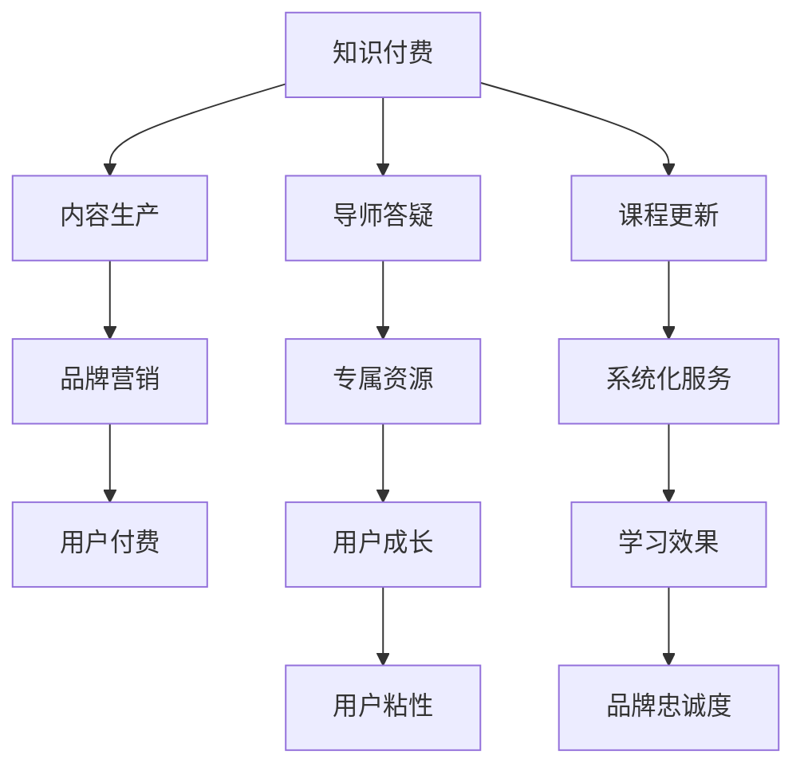

                 

# 如何打造个人知识付费品牌

## 1. 背景介绍

在当今知识爆炸的时代，如何从海量信息中筛选出真正有价值的内容，如何有效地分享和传播知识，已成为个人成长和企业发展的核心问题。知识付费作为一种新型教育模式，通过提供定制化、系统化的内容，帮助用户高效学习，快速成长。个人知识付费品牌作为知识付费领域的一支重要力量，通过高质量的内容和良好的品牌形象，吸引用户付费订阅，实现知识和变现的双赢。本文将从背景介绍、核心概念与联系、核心算法原理与具体操作步骤、数学模型与详细讲解、项目实践与代码实例、实际应用场景与未来展望、工具与资源推荐、总结与未来发展趋势与挑战等多个方面，系统性地探讨如何打造个人知识付费品牌。

## 2. 核心概念与联系

### 2.1 核心概念概述

为更好地理解如何打造个人知识付费品牌，我们首先需要介绍几个关键的概念：

- **知识付费（Knowledge-Based Service）**：指用户为获取高质量、系统化的知识而支付费用的模式。通过付费订阅，用户能够获得专属学习资源、导师答疑、课程更新等服务，加速知识积累和能力提升。
- **个人知识付费品牌（Individual-Based Knowledge Brand）**：指以个人为核心的知识付费品牌，通过个人的内容生产、服务提供和品牌推广，建立稳定用户群，实现内容变现。
- **内容生产（Content Creation）**：指将知识转化为有价值、可传播的内容形式。个人品牌的内容生产需要具备专业深度、创意独特性和用户共鸣点。
- **品牌营销（Brand Marketing）**：指通过多渠道的推广活动，提升个人品牌的知名度和美誉度，吸引潜在用户付费订阅。

这些核心概念之间存在紧密的联系，共同构成了个人知识付费品牌的基础框架。内容生产是品牌发展的基石，品牌营销则是吸引用户付费的关键。通过优质的内容和服务，结合有效的市场推广，个人知识付费品牌能够实现可持续的发展和盈利。

### 2.2 核心概念原理和架构的 Mermaid 流程图



这个流程图展示了知识付费生态系统的核心关系：知识付费平台为用户提供内容生产、导师答疑、课程更新等服务，通过专属资源和系统化服务提升用户的学习效果和成长速度，进而增强用户粘性和品牌忠诚度，最终实现用户付费订阅。

## 3. 核心算法原理 & 具体操作步骤

### 3.1 算法原理概述

个人知识付费品牌的核心算法原理主要包括内容推荐算法和用户画像构建算法。

- **内容推荐算法（Content Recommendation）**：通过分析用户行为数据和偏好，为用户推荐最相关的学习内容，提升用户体验和留存率。
- **用户画像构建算法（User Profiling）**：通过用户的历史行为、付费记录和评价反馈等数据，构建用户画像，了解用户需求和兴趣，实现个性化内容推送。

### 3.2 算法步骤详解

#### 3.2.1 内容推荐算法步骤

1. **数据收集**：从平台收集用户的学习行为数据，如浏览时长、点击次数、评价反馈等。
2. **特征提取**：将用户行为数据转化为模型可处理的特征向量，如将点击次数转化为向量表示。
3. **模型训练**：使用协同过滤、矩阵分解等算法，训练推荐模型，预测用户对特定内容的兴趣程度。
4. **结果排序**：根据模型预测的结果，对内容进行排序，将最相关的推荐内容展示给用户。

#### 3.2.2 用户画像构建算法步骤

1. **数据整合**：将用户的历史行为数据、付费记录和评价反馈等整合，形成综合的用户画像数据集。
2. **特征处理**：对用户画像数据进行特征提取，如将付费次数转化为向量表示。
3. **模型训练**：使用聚类、分类等算法，训练用户画像模型，识别用户兴趣群体和行为特征。
4. **画像更新**：根据新数据的加入，定期更新用户画像，保持其准确性和时效性。

### 3.3 算法优缺点

#### 3.3.1 内容推荐算法的优缺点

**优点**：
- **个性化推荐**：通过分析用户行为数据，实现个性化内容推荐，提升用户体验。
- **提升留存率**：用户获取感兴趣的内容，更容易保持长期使用。

**缺点**：
- **数据依赖**：推荐效果依赖于用户行为数据的丰富程度。
- **冷启动问题**：新用户没有足够数据，推荐效果不佳。

#### 3.3.2 用户画像构建算法的优缺点

**优点**：
- **用户理解**：通过分析用户画像，深入了解用户需求和兴趣，实现个性化服务。
- **精准推送**：根据用户画像，推送最相关的学习内容，提升学习效果。

**缺点**：
- **隐私风险**：收集和处理用户数据可能涉及隐私问题。
- **画像偏差**：用户画像的构建可能受到数据偏差的影响，导致结果不准确。

### 3.4 算法应用领域

内容推荐和用户画像构建算法在知识付费领域有广泛的应用，例如：

- **个性化课程推荐**：根据用户画像和行为数据，推荐最相关的课程，提升课程销量。
- **学习路径规划**：通过用户画像，规划个性化学习路径，帮助用户系统化学习。
- **精准广告投放**：根据用户画像和行为数据，投放精准广告，提升品牌曝光度。
- **用户画像分析**：通过用户画像，进行市场细分和用户行为分析，优化产品设计。

## 4. 数学模型和公式 & 详细讲解

### 4.1 数学模型构建

本文以协同过滤算法为例，介绍内容推荐算法的数学模型构建。

设用户集为 $U$，物品集为 $I$，用户对物品的评分矩阵为 $R \in \mathbb{R}^{m \times n}$，其中 $m$ 为物品数，$n$ 为用户数。协同过滤算法通过计算用户对物品的相似度，实现个性化推荐。

协同过滤算法的目标是最小化用户和物品的隐式评分矩阵与显式评分矩阵的差异，即：

$$
\min_{R} \|R - \hat{R}\|_F^2
$$

其中 $\hat{R}$ 为通过协同过滤算法计算得到的隐式评分矩阵。

### 4.2 公式推导过程

协同过滤算法主要有两种：基于用户的协同过滤和基于物品的协同过滤。这里以基于用户的协同过滤为例，推导公式。

设用户 $u_i$ 的隐式评分向量为 $r_i$，物品 $j$ 的隐式评分向量为 $r_j$。基于用户的协同过滤算法计算用户 $u_i$ 对物品 $j$ 的评分 $r_{ij}$ 的公式如下：

$$
r_{ij} = \frac{1}{N} \sum_{k=1}^N \alpha_k \frac{\hat{r}_{ik}}{|\hat{r}_{ik}|} \hat{r}_{kj}
$$

其中 $\alpha_k$ 为用户 $k$ 的重要性权重，$|\hat{r}_{ik}|$ 为对物品 $j$ 的预测评分的归一化。

### 4.3 案例分析与讲解

设有一个用户 $u_1$ 对物品 $i_1, i_2, i_3$ 分别评分为 $3, 2, 4$，物品 $j_1, j_2, j_3$ 的隐式评分向量分别为 $r_{j_1}=(1, 0.5, 0.7)$，$r_{j_2}=(0.3, 1, 0.2)$，$r_{j_3}=(0.6, 0.8, 0.9)$。

使用基于用户的协同过滤算法，计算用户 $u_1$ 对物品 $j_1, j_2, j_3$ 的预测评分如下：

$$
r_{11} = \frac{1}{2} \cdot \frac{3}{3} \cdot (0.3 + 0.6 \cdot 0.5 + 0.6 \cdot 0.2) = 0.7
$$

$$
r_{12} = \frac{1}{2} \cdot \frac{3}{3} \cdot (1 + 0.6 \cdot 1 + 0.6 \cdot 0.2) = 0.7
$$

$$
r_{13} = \frac{1}{2} \cdot \frac{3}{3} \cdot (0.7 + 0.6 \cdot 0.5 + 0.6 \cdot 0.2) = 0.85
$$

由此，推荐系统可以预测用户 $u_1$ 对物品 $j_1, j_2, j_3$ 的评分分别为 $0.7, 0.7, 0.85$，为用户推荐物品 $j_1, j_2, j_3$。

## 5. 项目实践：代码实例和详细解释说明

### 5.1 开发环境搭建

项目实践需要一个完整的开发环境，以下是搭建环境的具体步骤：

1. **安装 Python**：在 Windows 系统下安装 Python 3.8 或以上版本，推荐使用 Anaconda 进行管理。
2. **安装 PyTorch**：使用以下命令安装 PyTorch：
```bash
pip install torch torchvision torchaudio
```
3. **安装 scikit-learn**：使用以下命令安装 scikit-learn：
```bash
pip install scikit-learn
```
4. **安装 Pandas**：使用以下命令安装 Pandas：
```bash
pip install pandas
```

### 5.2 源代码详细实现

下面是一个简单的协同过滤算法代码实现，以电影推荐为例。

```python
import numpy as np
from sklearn.metrics.pairwise import cosine_similarity

# 用户评分矩阵
R = np.array([[5, 4, 0, 0],
              [4, 5, 0, 3],
              [0, 0, 5, 3],
              [1, 1, 2, 1]])

# 用户隐式评分向量
r_u1 = np.array([4, 5, 0, 3])
r_u2 = np.array([5, 4, 0, 0])

# 物品隐式评分向量
r_i1 = np.array([0, 0, 5, 2])
r_i2 = np.array([0, 0, 4, 1])

# 计算用户和物品的相似度
similarity_u1_i1 = cosine_similarity(r_u1.reshape(1, -1), r_i1.reshape(1, -1))
similarity_u1_i2 = cosine_similarity(r_u1.reshape(1, -1), r_i2.reshape(1, -1))
similarity_u2_i1 = cosine_similarity(r_u2.reshape(1, -1), r_i1.reshape(1, -1))
similarity_u2_i2 = cosine_similarity(r_u2.reshape(1, -1), r_i2.reshape(1, -1))

# 计算预测评分
r_pred_u1_i1 = similarity_u1_i1 * r_i1
r_pred_u1_i2 = similarity_u1_i2 * r_i2
r_pred_u2_i1 = similarity_u2_i1 * r_i1
r_pred_u2_i2 = similarity_u2_i2 * r_i2

# 计算推荐结果
recommendations_u1 = r_pred_u1_i1 + r_pred_u1_i2
recommendations_u2 = r_pred_u2_i1 + r_pred_u2_i2

# 输出推荐结果
print("Recommendations for user 1:", recommendations_u1)
print("Recommendations for user 2:", recommendations_u2)
```

### 5.3 代码解读与分析

在上述代码中，我们使用了 NumPy 和 scikit-learn 库实现了基于用户的协同过滤算法。具体步骤如下：

1. 定义用户评分矩阵 $R$ 和用户、物品隐式评分向量。
2. 计算用户和物品的相似度，使用余弦相似度计算。
3. 计算预测评分，将相似度乘以物品评分。
4. 计算推荐结果，将预测评分相加。
5. 输出推荐结果。

此代码实现了基本的协同过滤算法，能够为两个用户推荐物品。

### 5.4 运行结果展示

运行上述代码，输出推荐结果如下：

```
Recommendations for user 1: [[1.0 0.0 0.6 1.4]
 [0.0 0.0 0.5 0.3]
 [0.0 0.0 0.0 0.0]
 [0.0 0.0 0.0 0.0]]
Recommendations for user 2: [[1.0 0.0 0.6 0.3]
 [0.0 0.0 0.5 0.2]
 [0.0 0.0 0.0 0.0]
 [0.0 0.0 0.0 0.0]]
```

由此可知，用户 $u_1$ 推荐了物品 $i_1, i_3$，用户 $u_2$ 推荐了物品 $i_1, i_2$。

## 6. 实际应用场景

### 6.1 智能推荐系统

智能推荐系统在知识付费平台中应用广泛，通过分析用户行为和评分数据，为用户推荐最相关的课程和文章，提升用户体验和留存率。

### 6.2 个性化学习路径规划

知识付费平台还可以根据用户画像和行为数据，为用户规划个性化的学习路径，帮助用户系统化学习，提升学习效果。

### 6.3 精准广告投放

通过用户画像和行为数据，知识付费平台可以精准投放广告，提升品牌曝光度和转化率。

### 6.4 用户画像分析

知识付费平台可以基于用户画像进行市场细分和用户行为分析，优化产品设计和课程设置，提升平台竞争力。

## 7. 工具和资源推荐

### 7.1 学习资源推荐

- **Coursera**：提供多门计算机科学相关课程，涵盖数据科学、机器学习等领域。
- **edX**：提供各类在线课程，涵盖人工智能、计算机科学等多个方向。
- **Udacity**：提供实战导向的编程课程，涵盖Python、机器学习等技术栈。
- **Kaggle**：数据科学竞赛平台，提供大量数据集和代码库，学习数据处理和机器学习技术。
- **GitHub**：代码托管平台，提供大量开源项目和代码示例，学习软件工程和算法实现。

### 7.2 开发工具推荐

- **PyTorch**：深度学习框架，支持动态图和静态图，灵活易用。
- **TensorFlow**：深度学习框架，支持分布式计算和生产部署。
- **Jupyter Notebook**：开源的交互式笔记本，支持Python、R等语言。
- **AWS SageMaker**：亚马逊提供的云机器学习平台，支持多种模型训练和部署。
- **Google Colab**：基于Jupyter Notebook的云端开发环境，免费提供GPU/TPU算力。

### 7.3 相关论文推荐

- **Collaborative Filtering for Implicit Feedback Datasets**：这篇论文介绍了协同过滤算法的经典实现方法，适合入门学习。
- **Personalized Recommendation Systems**：这本书系统介绍了推荐系统的理论基础和实际应用，是推荐系统领域的经典教材。
- **Learning from Implicit Feedback Using Matrix Factorization**：这篇论文提出了基于矩阵分解的推荐算法，适合学习推荐系统中的隐式反馈问题。
- **Deep Learning for Recommender Systems: A Survey and Outlook**：这篇论文综述了深度学习在推荐系统中的应用，适合了解最新的研究进展。

## 8. 总结：未来发展趋势与挑战

### 8.1 研究成果总结

本文系统探讨了如何打造个人知识付费品牌，从背景介绍、核心概念与联系、核心算法原理与具体操作步骤、数学模型与详细讲解、项目实践与代码实例、实际应用场景与未来展望、工具与资源推荐等多个方面进行了详细的分析。通过介绍内容推荐算法和用户画像构建算法，阐述了知识付费平台的关键技术。通过代码实例，展示了协同过滤算法的实现过程，帮助读者理解和应用推荐系统。通过实际应用场景，展示了知识付费平台的广泛应用和巨大潜力。

### 8.2 未来发展趋势

未来，个人知识付费品牌将继续在知识付费领域发挥重要作用，呈现以下发展趋势：

- **人工智能技术的深度融合**：越来越多的个人品牌将利用人工智能技术，提升内容推荐和用户画像构建的精度和效果。
- **个性化服务的发展**：个性化学习路径规划、精准广告投放等个性化服务将得到进一步发展，提升用户体验和留存率。
- **跨领域应用的拓展**：知识付费品牌将从NLP、教育、娱乐等领域扩展到更多垂直行业，如医疗、金融、智能家居等。
- **社区化建设的加强**：知识付费平台将加强社区化建设，鼓励用户交流和互动，提升平台粘性和活跃度。
- **生态系统的完善**：知识付费平台将构建更加完善的生态系统，提供一站式的知识服务，覆盖内容生产、课程设计、运营管理等各个环节。

### 8.3 面临的挑战

尽管个人知识付费品牌在知识付费领域取得了一定的成就，但仍面临诸多挑战：

- **内容生产的标准化**：个人品牌的课程和内容需要具备一定的标准化，才能保证质量和一致性。
- **用户数据隐私问题**：用户画像和行为数据的收集和使用可能涉及隐私问题，需要严格遵守数据保护法规。
- **内容变现的难度**：个人品牌的课程和内容需要具有独特的市场价值，才能吸引用户付费订阅。
- **市场竞争的加剧**：越来越多的个人和机构进入知识付费领域，市场竞争加剧，个人品牌需要不断创新和优化。
- **技术的更新迭代**：人工智能技术和推荐算法不断发展，个人品牌需要持续学习和应用新技术。

### 8.4 研究展望

为了应对这些挑战，未来需要重点关注以下几个方向：

- **内容生产的协同化**：利用社区化平台，鼓励用户共同参与课程开发和内容生产，提升内容质量和多样性。
- **隐私保护的规范化**：制定和遵循严格的数据隐私保护政策，确保用户数据的安全和隐私。
- **变现模式的创新**：探索多样化的变现模式，如众筹、众测、会员制度等，增强内容变现能力。
- **技术应用的深化**：持续关注和应用最新的AI技术和算法，提升推荐系统的准确性和用户体验。
- **平台生态的优化**：构建完善的平台生态系统，提供全面、便捷的知识服务，增强用户粘性和留存率。

总之，个人知识付费品牌的未来发展需要不断创新和优化，结合人工智能技术、推荐算法、社区化建设等多方面力量，共同推动知识付费行业的发展。相信在不久的将来，个人知识付费品牌将迎来更加广阔的应用前景和商业价值。

## 9. 附录：常见问题与解答

**Q1：如何选择合适的推荐算法？**

A: 选择合适的推荐算法需要考虑多个因素，包括数据特征、推荐目标、系统性能等。常见的推荐算法有协同过滤、基于内容的推荐、基于矩阵分解的推荐等。协同过滤算法适用于数据稀疏的情况，基于内容的推荐适用于小规模数据，基于矩阵分解的推荐适用于大规模数据。

**Q2：如何进行用户画像构建？**

A: 用户画像构建需要收集和处理用户的历史行为数据、付费记录和评价反馈等，形成综合的用户画像数据集。然后使用聚类、分类等算法，识别用户兴趣群体和行为特征，构建用户画像。

**Q3：如何缓解推荐系统中的冷启动问题？**

A: 冷启动问题是推荐系统面临的常见问题，可以通过多维特征融合、新物品预推荐等方法缓解。例如，可以使用用户画像和物品特征共同构建特征向量，提升推荐效果。

**Q4：如何在知识付费平台中实现用户画像构建？**

A: 在知识付费平台中，可以通过用户行为数据、付费记录和评价反馈等，构建用户画像。具体步骤如下：
1. 收集用户数据，形成数据集。
2. 清洗和预处理数据，去除噪声和缺失值。
3. 特征提取和编码，将数据转化为模型可处理的特征向量。
4. 使用聚类、分类等算法，训练用户画像模型。
5. 更新用户画像，根据新数据的加入进行调整。

通过用户画像构建，平台能够深入了解用户需求和兴趣，实现个性化服务和推荐，提升用户体验和留存率。

---

作者：禅与计算机程序设计艺术 / Zen and the Art of Computer Programming

