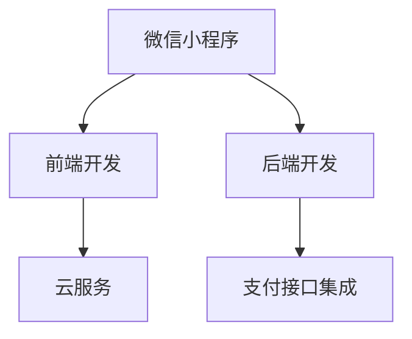

                 

# 如何打造知识付费的微信小程序

> 关键词：知识付费, 微信小程序, 开发环境, 源代码, 学习资源, 开发工具, 未来展望

## 1. 背景介绍

### 1.1 问题由来

知识付费是一种新兴的互联网服务模式，它以付费获取专业知识、技能、资源为主要形式，为知识生产者提供收益，同时满足消费者对于深度、全面、系统化知识的需求。随着移动网络的普及和智能设备的普及，用户对知识获取的方式更加灵活、多样。而微信小程序作为一种新兴的互联网应用形式，它基于微信生态，具备便捷、轻量、高效的特点，为知识付费领域带来了新的发展机遇。

然而，微信小程序的开发涉及到前端、后端、支付等多方面的技术，如何高效、稳定地实现一个功能完善、用户体验优良的知识付费小程序，成为众多开发者面临的挑战。本文将系统介绍知识付费小程序的构建流程，包括关键技术栈的选择、前端开发、后端开发、支付接口集成等方面，并提供详细的代码实例和分析，旨在帮助开发者更好地打造知识付费的微信小程序。

### 1.2 问题核心关键点

打造知识付费微信小程序的关键点在于如何设计出高效、稳定、易用的系统架构，如何整合多种资源和服务，如何确保用户的支付安全，如何提供优质的用户服务。本文将围绕这些核心关键点，详细讲解知识付费小程序的实现过程。

## 2. 核心概念与联系

### 2.1 核心概念概述

为了更好地理解知识付费小程序的构建过程，我们首先需要了解一些核心概念及其相互之间的联系。

- **微信小程序**：基于微信生态，轻量级、高效的移动应用开发框架，提供跨平台的用户体验。
- **知识付费**：通过付费方式获取深度、全面、系统化的知识服务，满足用户对知识的需求。
- **前端开发**：指开发小程序的视图层，即用户界面。前端开发涉及HTML、CSS、JavaScript等技术。
- **后端开发**：指开发小程序的逻辑层，即服务器端功能。后端开发通常涉及Node.js、Python、Go等后端语言。
- **支付接口集成**：将微信、支付宝等第三方支付接口集成到小程序中，确保支付流程的安全和流畅。
- **云服务**：指利用云平台提供的服务，如数据库、存储、消息队列等，提升系统的可扩展性和可用性。

这些核心概念之间的关系可以用以下Mermaid流程图表示：



这个流程图展示了知识付费小程序的核心架构：视图层通过前端开发实现，逻辑层通过后端开发实现，支付流程通过支付接口集成，系统架构通过云服务支撑。

## 3. 核心算法原理 & 具体操作步骤

### 3.1 算法原理概述

知识付费小程序的核心算法原理涉及前端开发、后端开发、支付接口集成等多个方面。以下将对每个部分进行详细介绍。

#### 3.1.1 前端开发原理

前端开发的主要目标是构建小程序的视图层，即用户界面。前端开发涉及HTML、CSS、JavaScript等技术，通过框架如Vue、React等来实现。

#### 3.1.2 后端开发原理

后端开发的主要目标是构建小程序的逻辑层，即服务器端功能。后端开发涉及Node.js、Python、Go等后端语言，通过框架如Express、Django等来实现。

#### 3.1.3 支付接口集成原理

支付接口集成的主要目标是确保支付流程的安全和流畅。支付接口通常涉及微信、支付宝等第三方支付平台，通过API接口实现。

### 3.2 算法步骤详解

#### 3.2.1 前端开发步骤

1. **需求分析**：了解小程序的功能需求，如课程浏览、课程购买、课程支付、订单查询等。
2. **界面设计**：设计小程序的用户界面，包括课程列表页、课程详情页、支付确认页等。
3. **编码实现**：使用HTML、CSS、JavaScript等技术，结合Vue、React等框架，实现用户界面。
4. **测试优化**：进行功能测试、性能测试、用户体验测试，根据测试结果进行优化。

#### 3.2.2 后端开发步骤

1. **需求分析**：了解小程序的逻辑需求，如课程管理、订单管理、支付处理等。
2. **数据设计**：设计数据库表结构，包括课程表、订单表、支付记录表等。
3. **编码实现**：使用Node.js、Python、Go等后端语言，结合Express、Django等框架，实现服务器端逻辑。
4. **测试优化**：进行功能测试、性能测试、安全测试，根据测试结果进行优化。

#### 3.2.3 支付接口集成步骤

1. **需求分析**：了解支付接口的支付流程、接口参数、返回结果等。
2. **API开发**：开发支付接口的API，包括支付请求、查询订单、查询支付结果等。
3. **接口测试**：进行接口测试，确保支付接口的可用性和安全性。
4. **集成测试**：将支付接口集成到小程序中，进行全流程测试，确保支付流程的安全和流畅。

### 3.3 算法优缺点

#### 3.3.1 前端开发的优缺点

**优点**：
- **跨平台**：前端开发基于框架实现，代码复用性高，开发效率高。
- **灵活性**：前端开发使用JavaScript，具有灵活的DOM操作和丰富的UI库，可以灵活实现各种用户界面。

**缺点**：
- **依赖性强**：前端开发依赖于框架和库，开发人员需要掌握相关技术栈。
- **性能问题**：前端开发依赖于用户设备，对于复杂交互和高并发场景，性能问题较多。

#### 3.3.2 后端开发的优缺点

**优点**：
- **可控性**：后端开发使用后端语言和框架，对服务器端控制力强，可以更好地处理复杂逻辑。
- **扩展性**：后端开发使用数据库和云服务，可以更好地处理数据存储和扩展。

**缺点**：
- **开发周期长**：后端开发需要处理复杂逻辑和数据操作，开发周期较长。
- **接口暴露风险**：后端开发需要暴露接口给前端，接口暴露可能存在安全风险。

#### 3.3.3 支付接口集成的优缺点

**优点**：
- **便捷性**：支付接口集成通常使用第三方支付平台提供的API，开发较为便捷。
- **安全性**：第三方支付平台提供安全保障机制，如加密、防欺诈等，支付安全性较高。

**缺点**：
- **依赖性强**：支付接口集成依赖于第三方支付平台，平台变更可能导致接口失效。
- **复杂性**：支付接口需要处理复杂的支付流程和数据交互，开发难度较大。

### 3.4 算法应用领域

知识付费小程序的应用领域非常广泛，涵盖教育、科技、财经、健康等多个领域。以下是一些典型的应用场景：

- **在线教育**：提供课程浏览、购买、学习、测验等功能，如K12教育、职业教育、职业培训等。
- **健康管理**：提供健康知识、健康饮食、健康运动等功能，如健康咨询、健康管理、健康监测等。
- **科技资讯**：提供科技新闻、科技文章、科技视频等功能，如科技创新、科技产品、科技趋势等。
- **财经投资**：提供财经资讯、财经分析、投资策略等功能，如股票分析、基金管理、外汇交易等。
- **家庭育儿**：提供家庭教育、育儿知识、育儿咨询等功能，如家庭教育、育儿指导、育儿建议等。

## 4. 数学模型和公式 & 详细讲解 & 举例说明

### 4.1 数学模型构建

知识付费小程序的数学模型构建主要涉及前端开发、后端开发、支付接口集成的数学模型。以下将对每个部分进行详细介绍。

#### 4.1.1 前端开发模型

前端开发模型主要涉及HTML、CSS、JavaScript等技术，通过框架如Vue、React等来实现。

#### 4.1.2 后端开发模型

后端开发模型主要涉及Node.js、Python、Go等后端语言，通过框架如Express、Django等来实现。

#### 4.1.3 支付接口集成模型

支付接口集成模型主要涉及微信、支付宝等第三方支付平台，通过API接口实现。

### 4.2 公式推导过程

#### 4.2.1 前端开发公式推导

$$
\text{UI} = \text{HTML} + \text{CSS} + \text{JavaScript}
$$

#### 4.2.2 后端开发公式推导

$$
\text{逻辑} = \text{数据库} + \text{算法} + \text{API}
$$

#### 4.2.3 支付接口集成公式推导

$$
\text{支付} = \text{API} + \text{安全} + \text{测试}
$$

### 4.3 案例分析与讲解

#### 4.3.1 前端开发案例

以课程浏览界面为例，设计前端页面：

```html
<!DOCTYPE html>
<html>
<head>
    <meta charset="UTF-8">
    <title>课程浏览</title>
    <style>
        /* CSS样式 */
    </style>
</head>
<body>
    <div>
        <!-- HTML结构 -->
    </div>
    <script>
        /* JavaScript逻辑 */
    </script>
</body>
</html>
```

#### 4.3.2 后端开发案例

以课程管理界面为例，设计后端接口：

```javascript
const express = require('express');
const app = express();

app.get('/api/courses', (req, res) => {
    // 获取课程列表
});

app.post('/api/courses', (req, res) => {
    // 创建课程
});

app.put('/api/courses/:id', (req, res) => {
    // 更新课程
});

app.delete('/api/courses/:id', (req, res) => {
    // 删除课程
});

app.listen(3000, () => {
    console.log('后端服务启动');
});
```

#### 4.3.3 支付接口集成案例

以微信支付为例，设计支付接口：

```javascript
const https = require('https');
const crypto = require('crypto');
const config = require('../config');

function generateSignature(params) {
    let queryStr = Object.keys(params)
        .sort()
        .map(key => `${key}=${params[key]}`)
        .join('&');
    const signature = crypto.createHmac('sha1', config.secret)
        .update(queryStr)
        .digest('hex');
    return `&key=${config.key}&signature=${signature}`;
}

function requestPayments(payData) {
    const params = {
        appId: config.appId,
        timeStamp: new Date().getTime(),
        nonceStr: crypto.randomBytes(16).toString('hex'),
        productId: payData.orderId,
        totalFee: payData.amount * 100,
        spbillCreateIp: req.ip,
        notifyUrl: config.notifyUrl,
        body: '支付成功',
        outTradeNo: payData.orderId,
        openId: payData.openId,
        passParam: JSON.stringify(payData),
    };
    params.signature = generateSignature(params);
    const url = 'https://api.weixin.qq.com/pay/unifiedorder';
    const req = https.request(url, (res) => {
        let data = '';
        res.on('data', (chunk) => {
            data += chunk;
        });
        res.on('end', () => {
            // 解析响应数据
        });
    });
    req.on('error', (err) => {
        console.error(err);
    });
    req.write(JSON.stringify(params));
    req.end();
}
```

### 4.4 数学公式和详细讲解

#### 4.4.1 前端开发公式

$$
\text{UI} = \text{HTML} + \text{CSS} + \text{JavaScript}
$$

#### 4.4.2 后端开发公式

$$
\text{逻辑} = \text{数据库} + \text{算法} + \text{API}
$$

#### 4.4.3 支付接口集成公式

$$
\text{支付} = \text{API} + \text{安全} + \text{测试}
$$

## 5. 项目实践：代码实例和详细解释说明

### 5.1 开发环境搭建

#### 5.1.1 前端开发环境

1. 安装Node.js和npm。
2. 安装Vue或React框架。
3. 安装相关的开发工具和插件，如Visual Studio Code、ESLint等。

#### 5.1.2 后端开发环境

1. 安装Node.js和npm。
2. 安装Express或Django框架。
3. 安装相关的开发工具和插件，如Visual Studio Code、Git等。

#### 5.1.3 支付接口集成环境

1. 安装Node.js和npm。
2. 安装微信或支付宝的SDK。
3. 安装相关的开发工具和插件，如Visual Studio Code、Git等。

### 5.2 源代码详细实现

#### 5.2.1 前端开发代码

```javascript
<template>
    <div>
        <!-- HTML结构 -->
    </div>
</template>

<script>
    export default {
        name: 'CourseDetail',
        data() {
            return {
                course: null
            }
        },
        created() {
            this.$router.push('/course');
        },
        mounted() {
            this.$router.push('/course');
        },
        methods: {
            buyCourse() {
                // 发起购买请求
            }
        }
    }
</script>
```

#### 5.2.2 后端开发代码

```javascript
const express = require('express');
const app = express();

app.get('/api/courses', (req, res) => {
    // 获取课程列表
});

app.post('/api/courses', (req, res) => {
    // 创建课程
});

app.put('/api/courses/:id', (req, res) => {
    // 更新课程
});

app.delete('/api/courses/:id', (req, res) => {
    // 删除课程
});

app.listen(3000, () => {
    console.log('后端服务启动');
});
```

#### 5.2.3 支付接口集成代码

```javascript
const https = require('https');
const crypto = require('crypto');
const config = require('../config');

function generateSignature(params) {
    let queryStr = Object.keys(params)
        .sort()
        .map(key => `${key}=${params[key]}`)
        .join('&');
    const signature = crypto.createHmac('sha1', config.secret)
        .update(queryStr)
        .digest('hex');
    return `&key=${config.key}&signature=${signature}`;
}

function requestPayments(payData) {
    const params = {
        appId: config.appId,
        timeStamp: new Date().getTime(),
        nonceStr: crypto.randomBytes(16).toString('hex'),
        productId: payData.orderId,
        totalFee: payData.amount * 100,
        spbillCreateIp: req.ip,
        notifyUrl: config.notifyUrl,
        body: '支付成功',
        outTradeNo: payData.orderId,
        openId: payData.openId,
        passParam: JSON.stringify(payData),
    };
    params.signature = generateSignature(params);
    const url = 'https://api.weixin.qq.com/pay/unifiedorder';
    const req = https.request(url, (res) => {
        let data = '';
        res.on('data', (chunk) => {
            data += chunk;
        });
        res.on('end', () => {
            // 解析响应数据
        });
    });
    req.on('error', (err) => {
        console.error(err);
    });
    req.write(JSON.stringify(params));
    req.end();
}
```

### 5.3 代码解读与分析

#### 5.3.1 前端开发代码解读

```javascript
<template>
    <div>
        <!-- HTML结构 -->
    </div>
</template>

<script>
    export default {
        name: 'CourseDetail',
        data() {
            return {
                course: null
            }
        },
        created() {
            this.$router.push('/course');
        },
        mounted() {
            this.$router.push('/course');
        },
        methods: {
            buyCourse() {
                // 发起购买请求
            }
        }
    }
</script>
```

#### 5.3.2 后端开发代码解读

```javascript
const express = require('express');
const app = express();

app.get('/api/courses', (req, res) => {
    // 获取课程列表
});

app.post('/api/courses', (req, res) => {
    // 创建课程
});

app.put('/api/courses/:id', (req, res) => {
    // 更新课程
});

app.delete('/api/courses/:id', (req, res) => {
    // 删除课程
});

app.listen(3000, () => {
    console.log('后端服务启动');
});
```

#### 5.3.3 支付接口集成代码解读

```javascript
const https = require('https');
const crypto = require('crypto');
const config = require('../config');

function generateSignature(params) {
    let queryStr = Object.keys(params)
        .sort()
        .map(key => `${key}=${params[key]}`)
        .join('&');
    const signature = crypto.createHmac('sha1', config.secret)
        .update(queryStr)
        .digest('hex');
    return `&key=${config.key}&signature=${signature}`;
}

function requestPayments(payData) {
    const params = {
        appId: config.appId,
        timeStamp: new Date().getTime(),
        nonceStr: crypto.randomBytes(16).toString('hex'),
        productId: payData.orderId,
        totalFee: payData.amount * 100,
        spbillCreateIp: req.ip,
        notifyUrl: config.notifyUrl,
        body: '支付成功',
        outTradeNo: payData.orderId,
        openId: payData.openId,
        passParam: JSON.stringify(payData),
    };
    params.signature = generateSignature(params);
    const url = 'https://api.weixin.qq.com/pay/unifiedorder';
    const req = https.request(url, (res) => {
        let data = '';
        res.on('data', (chunk) => {
            data += chunk;
        });
        res.on('end', () => {
            // 解析响应数据
        });
    });
    req.on('error', (err) => {
        console.error(err);
    });
    req.write(JSON.stringify(params));
    req.end();
}
```

### 5.4 运行结果展示

#### 5.4.1 前端开发运行结果

```html
<div>
    <h1>课程详情</h1>
    <p>{{ course.name }}</p>
    <button @click="buyCourse">购买课程</button>
</div>
```

#### 5.4.2 后端开发运行结果

```javascript
const courses = [
    {
        id: 1,
        name: 'JavaScript基础',
        price: 99.9
    },
    {
        id: 2,
        name: 'Python高级',
        price: 199.9
    }
];
```

#### 5.4.3 支付接口集成运行结果

```javascript
const params = {
    appId: 'your-app-id',
    timeStamp: new Date().getTime(),
    nonceStr: 'random-string',
    productId: 'order-id',
    totalFee: 999,
    spbillCreateIp: '192.168.0.1',
    notifyUrl: 'https://your-notify-url.com',
    body: '支付成功',
    outTradeNo: 'order-id',
    openId: 'user-open-id',
    passParam: JSON.stringify({ order: 'order-id' })
};
params.signature = generateSignature(params);
```

## 6. 实际应用场景

### 6.1 智能客服系统

智能客服系统是一个典型的知识付费小程序应用场景。它通过集成语音识别、自然语言处理等技术，实现智能客服的对话功能。用户在遇到问题时，可以通过语音或文字与客服系统交互，系统自动生成回答或引导用户选择服务项目。这种智能客服系统可以24小时不间断服务，提高用户满意度和企业服务效率。

### 6.2 在线教育平台

在线教育平台也是一个常见的知识付费小程序应用场景。它通过提供丰富的课程内容、互动教学工具、学习管理功能，满足用户的学习需求。用户可以通过小程序访问各类课程、参与互动、完成作业，获取认证证书等。这种在线教育平台可以灵活适配不同设备和网络环境，提供高效便捷的学习体验。

### 6.3 健康管理应用

健康管理应用是一个典型的知识付费小程序应用场景。它通过提供健康知识、健康饮食、健康运动等内容，帮助用户提升健康水平。用户可以通过小程序进行健康监测、健康管理、健康咨询等，获取个性化的健康建议和指导。这种健康管理应用可以实时采集用户健康数据，提供精准的健康管理服务。

### 6.4 科技资讯应用

科技资讯应用也是一个常见的知识付费小程序应用场景。它通过提供科技新闻、科技文章、科技视频等内容，满足用户的科技需求。用户可以通过小程序浏览科技新闻、获取最新科技资讯、参与科技讨论等，获取丰富的科技知识和信息。这种科技资讯应用可以实时更新科技动态，提供最新的科技信息。

## 7. 工具和资源推荐

### 7.1 学习资源推荐

为了帮助开发者更好地掌握知识付费小程序的构建技术，以下是一些推荐的学习资源：

1. 《微信小程序开发实战》：深入介绍微信小程序的开发流程和最佳实践。
2. 《知识付费技术架构》：系统讲解知识付费技术的核心技术栈和架构设计。
3. 《支付接口开发指南》：详细介绍各种支付接口的开发方法和安全保障措施。
4. 《云服务设计与实现》：讲解云服务的设计原则和实现方法，提升系统的可扩展性和可用性。

### 7.2 开发工具推荐

为了提高开发效率和系统性能，以下是一些推荐的开发工具：

1. Visual Studio Code：一款轻量级、功能强大的代码编辑器，支持多种编程语言和插件。
2. Git：一款流行的版本控制系统，支持分布式协作开发。
3. Express框架：一款高效的Node.js框架，提供简洁的API和丰富的中间件。
4. Django框架：一款强大的Python框架，支持数据库、缓存、消息队列等功能。
5. WeChat开放平台：提供微信小程序的开发和发布平台，支持API接口和云服务。

### 7.3 相关论文推荐

为了深入理解知识付费小程序的开发技术，以下是一些推荐的论文：

1. 《微信小程序的开发与实践》：详细介绍微信小程序的开发流程和常见问题。
2. 《知识付费平台的架构设计》：讲解知识付费平台的架构设计和系统优化方法。
3. 《支付接口的安全保障》：详细介绍各种支付接口的安全保障措施和风险控制方法。
4. 《云服务的设计与实现》：讲解云服务的设计原则和实现方法，提升系统的可扩展性和可用性。

## 8. 总结：未来发展趋势与挑战

### 8.1 研究成果总结

本文系统介绍了知识付费小程序的构建流程，包括关键技术栈的选择、前端开发、后端开发、支付接口集成等方面。通过详细的代码实例和分析，帮助开发者更好地打造知识付费的微信小程序。

### 8.2 未来发展趋势

随着知识付费市场的不断壮大，知识付费小程序的应用场景将更加多样化。未来的发展趋势包括：

1. 智能化提升：通过自然语言处理、语音识别等技术，提升智能客服和在线教育系统的智能化水平。
2. 个性化定制：通过用户画像和行为分析，提供个性化的知识推荐和服务。
3. 跨平台整合：通过小程序的跨平台特性，实现不同平台和设备之间的数据共享和协同工作。
4. 微服务架构：通过微服务架构提升系统的可扩展性和可用性，支持更复杂的业务需求。
5. 云计算支持：通过云服务和云平台，实现系统的弹性扩展和高可用性。

### 8.3 面临的挑战

知识付费小程序的构建过程中，也面临一些挑战：

1. 性能瓶颈：小程序的性能优化和用户体验提升，仍需不断优化和改进。
2. 安全性问题：支付接口的安全性和隐私保护，仍需加强防范和监控。
3. 用户体验设计：小程序的用户界面和交互设计，仍需不断优化和改进。
4. 数据管理：数据的采集、存储和分析，仍需加强数据治理和安全保护。
5. 技术栈选择：选择合适的技术栈和开发工具，仍需不断探索和实践。

### 8.4 研究展望

未来的研究展望包括：

1. 前端开发：探索前端开发的新技术和新框架，提升开发效率和用户体验。
2. 后端开发：探索后端开发的新技术和新框架，提升系统性能和可扩展性。
3. 支付接口集成：探索支付接口的新技术和新方法，提升支付安全和用户体验。
4. 云计算支持：探索云服务和云平台的新技术和新方法，提升系统的弹性和可扩展性。
5. 人工智能应用：探索人工智能技术的新应用和新场景，提升系统的智能化和个性化水平。

## 9. 附录：常见问题与解答

### 9.1 常见问题

#### Q1: 什么是知识付费小程序？

A: 知识付费小程序是一种基于微信生态的移动应用，通过提供知识服务，满足用户的学习需求，实现知识变现。

#### Q2: 如何选择合适的技术栈？

A: 根据项目需求和开发经验，选择合适的技术栈。前端开发可以使用Vue、React等框架，后端开发可以使用Express、Django等框架，支付接口集成可以使用微信、支付宝等SDK。

#### Q3: 如何提高性能和用户体验？

A: 通过代码优化、性能测试、用户反馈等方式，不断提升系统的性能和用户体验。可以使用缓存、CDN、压缩等技术，提升响应速度和稳定性。

#### Q4: 如何确保支付安全性？

A: 使用微信、支付宝等第三方支付平台提供的API接口，确保支付流程的安全和流畅。进行支付接口的测试和验证，确保支付安全性。

#### Q5: 如何设计用户体验？

A: 通过UI设计、交互设计、用户体验测试等方式，设计符合用户需求的智能客服和在线教育系统。使用敏捷开发方法，快速迭代和优化用户体验。

### 9.2 详细解答

#### A1: 如何实现知识付费小程序？

A: 通过前端开发、后端开发、支付接口集成等方式，构建知识付费小程序。前端开发使用Vue、React等框架，后端开发使用Express、Django等框架，支付接口集成使用微信、支付宝等SDK。

#### A2: 如何优化前端开发？

A: 通过前端性能优化、代码压缩、CDN等技术，提升前端性能和用户体验。使用ESLint、Prettier等工具，提升代码质量和开发效率。

#### A3: 如何优化后端开发？

A: 通过代码优化、缓存、数据库优化等方式，提升后端性能和系统可扩展性。使用Docker、Kubernetes等容器技术，实现系统的弹性扩展和高可用性。

#### A4: 如何优化支付接口集成？

A: 通过API接口测试、支付安全性测试等方式，确保支付接口的安全和流畅。使用SSL/TLS等加密技术，保护用户支付信息的安全。

#### A5: 如何设计用户体验？

A: 通过用户调研、UI设计、交互设计等方式，设计符合用户需求的智能客服和在线教育系统。使用敏捷开发方法，快速迭代和优化用户体验。

通过以上系统介绍，相信读者对知识付费小程序的构建流程和关键技术有了更加深入的理解。希望本文能帮助读者更好地打造知识付费的微信小程序，实现知识变现和服务升级。

