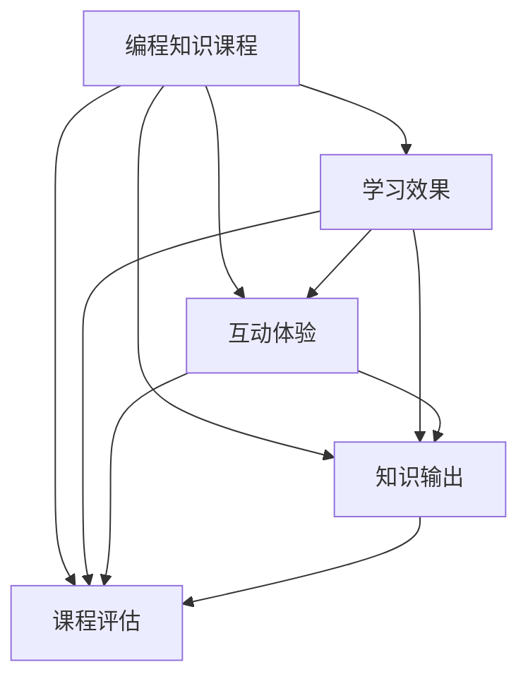
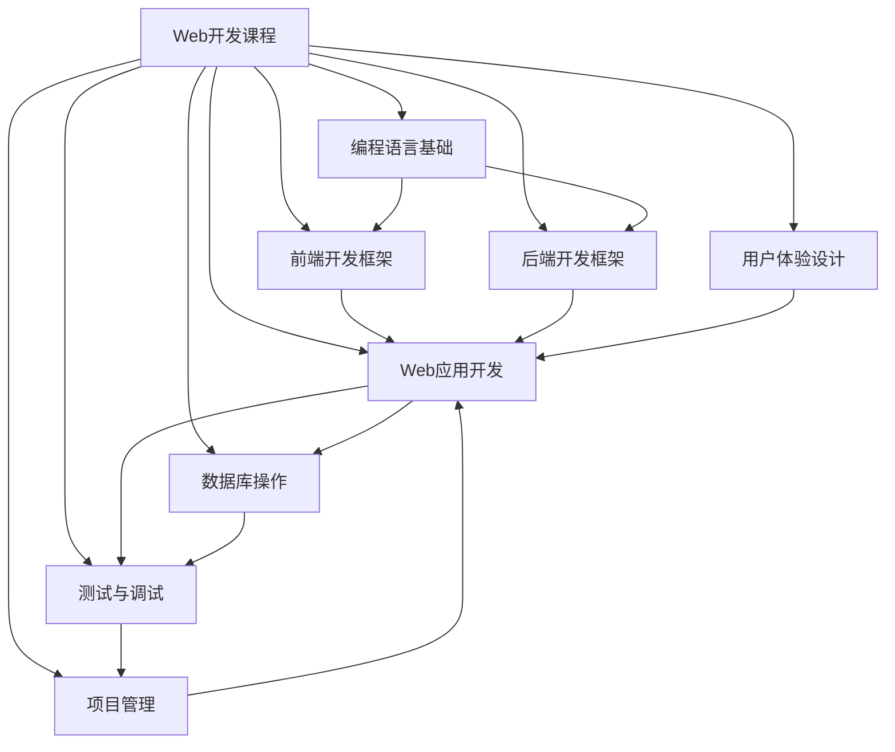

                 

# 如何打造高认可的程序员知识课程

> 关键词：课程设计、编程教育、学习效果、互动体验、知识输出、课程评估

## 1. 背景介绍

在数字化时代，编程技能已成为各行各业的关键竞争力。然而，如何高效、系统地掌握编程知识和技能，仍然是一个不小的挑战。编程教育的发展过程中，高认可的程序员知识课程是培养技术人才的基础。本文将从课程设计、学习效果、互动体验等多个方面探讨如何打造高认可的程序员知识课程。

## 2. 核心概念与联系

### 2.1 核心概念概述

在讨论课程设计之前，需要理解以下几个核心概念：

- **编程知识课程**：以传授编程语言、算法、数据结构等专业知识为主要目标的教育活动。
- **学习效果**：指学生在学习过程中所获得的知识和技能。
- **互动体验**：指学生在课程中通过实际编码、讨论、项目等活动获得的学习体验。
- **知识输出**：指学生在课程结束时通过项目、论文、报告等方式展现的成果。
- **课程评估**：指通过考试、项目评审、课堂反馈等方式对课程效果的评价和改进。

这些概念构成了程序员知识课程的核心，它们之间的关系可以用以下Mermaid流程图表示：



这个流程图展示了编程知识课程与其他核心概念之间的关系：

1. 编程知识课程是核心，通过传授知识、设计互动体验、促进知识输出，最终达到提高学习效果的目的。
2. 互动体验和知识输出可以进一步影响学习效果。
3. 课程评估则是对学习效果和互动体验的综合评价，也是课程持续改进的重要依据。

### 2.2 核心概念原理和架构的 Mermaid 流程图

为了更直观地展示这些概念之间的联系，我们接下来会通过一个具体的案例来说明。假设我们有一门名为“Web开发”的编程课程，以下是一个简化的合流图示例：



在这个图表中，Web开发课程被分解为多个子模块，包括编程语言基础、前端框架、后端框架、Web应用开发、数据库操作、测试与调试、项目管理、用户体验设计等。这些子模块相互依赖，共同构成了Web开发课程的知识体系。

## 3. 核心算法原理 & 具体操作步骤

### 3.1 算法原理概述

在实际教学过程中，如何设计一个有效的编程课程，需要从以下几个方面考虑：

1. **课程内容设计**：需根据行业需求和学生水平，合理选择编程语言和技能。
2. **教学方法**：采用案例教学、项目驱动等方式，增强学习效果。
3. **互动设计**：通过讨论、小组合作、编程竞赛等方式，提升学生的互动体验。
4. **知识输出**：要求学生在课程结束时完成项目或论文，以巩固所学知识。
5. **评估机制**：设立多元化评估方式，包括项目评审、课堂表现、考试等。

### 3.2 算法步骤详解

以下将详细介绍如何通过具体的算法步骤来实现上述设计原则。

#### 3.2.1 课程内容设计

**Step 1: 需求调研**
- 确定目标群体：选择适合入门、进阶或高级的课程。
- 调查行业需求：了解行业对编程技能的具体要求。
- 分析学生背景：根据学生的专业背景和编程基础，设计适合的课程内容。

**Step 2: 制定课程大纲**
- 划分单元模块：根据知识点的内在逻辑，将课程内容划分为多个模块。
- 确定课时安排：根据每个模块的难度和复杂度，安排相应的课时。
- 分配学习目标：明确每个模块的学习目标，包括掌握的编程语言和技能。

**Step 3: 内容筛选与补充**
- 筛选核心内容：重点讲解与行业需求密切相关的核心知识点。
- 补充实用内容：增加实际应用案例，如项目实践、代码评审等。
- 引入最新技术：定期更新课程内容，引入最新的编程技术和工具。

#### 3.2.2 教学方法

**Step 1: 案例教学**
- 选择典型案例：选择与课程内容紧密相关的实际案例。
- 分析案例需求：分析案例中的需求和功能，引导学生思考和设计。
- 对比解决方案：对比多种解决方案，引导学生选择最优解。

**Step 2: 项目驱动**
- 设计课程项目：根据课程目标，设计一个综合性的项目。
- 分解项目任务：将项目任务细化为多个子任务，明确每个子任务的具体要求。
- 项目实施与评估：在项目实施过程中，定期检查进度和成果，提供反馈和指导。

#### 3.2.3 互动设计

**Step 1: 课堂讨论**
- 设计讨论话题：选择与课程内容相关的讨论话题。
- 引导学生参与：通过提问、分组讨论等方式，鼓励学生积极参与。
- 总结讨论成果：总结讨论结果，并引导学生总结经验教训。

**Step 2: 小组合作**
- 分组与配对：根据学生的兴趣和能力，合理分组。
- 分工与合作：分配不同的任务给每个组员，鼓励团队协作。
- 汇报与评审：组织小组汇报和互评，提供反馈和改进建议。

#### 3.2.4 知识输出

**Step 1: 项目选择**
- 选择多样化项目：根据学生的兴趣和目标，设计多样化的项目。
- 项目设计与评审：在项目实施过程中，提供指导和反馈，确保项目顺利进行。
- 项目提交与评审：在项目完成后，组织项目评审和展示，确保项目的质量和规范性。

#### 3.2.5 评估机制

**Step 1: 设计评估标准**
- 制定评估指标：确定评价学生学习效果的标准，如编程能力、项目完成度、课堂参与度等。
- 多元化评估方式：采用多种评估方式，包括考试、项目评审、课堂表现等。
- 定期评估与反馈：定期评估学生学习效果，提供及时的反馈和改进建议。

### 3.3 算法优缺点

**优点**
- 系统性：通过制定课程大纲和模块划分，保证教学内容的系统性和逻辑性。
- 实践性强：通过项目驱动和案例教学，增强学生的实际操作能力和问题解决能力。
- 互动性强：通过课堂讨论和小组合作，增强学生的互动体验和团队协作能力。
- 评估全面：通过多元化的评估方式，全面评价学生的学习效果。

**缺点**
- 时间和精力投入大：课程设计、内容筛选、项目实施等环节都需要大量的时间和精力投入。
- 个性化需求难以满足：固定的课程大纲和模块划分可能难以满足所有学生的个性化需求。
- 资源和环境要求高：编程课程需要高性能的计算机设备和良好的网络环境。

### 3.4 算法应用领域

基于上述算法步骤和设计原则，程序员知识课程的设计和实施可以应用于多种场景，包括：

- **高校课程**：在大学计算机专业课程中，设计理论与实践相结合的课程内容。
- **企业培训**：为在职员工设计针对性的技能培训课程，提升员工编程能力。
- **在线教育**：通过在线平台提供自主学习路径，提供灵活的学习方式和资源。
- **编程社区**：通过开放平台分享编程知识和项目案例，促进社区成员交流和互助。

## 4. 数学模型和公式 & 详细讲解 & 举例说明

### 4.1 数学模型构建

为了更严谨地分析编程课程的效果，可以建立数学模型进行量化分析。以下是一个简单的数学模型框架：

设一门课程的课程时间为 $T$，分为若干个模块 $M_1, M_2, ..., M_n$，每个模块所需时间分别为 $t_1, t_2, ..., t_n$，每个模块的目标知识量为 $K_1, K_2, ..., K_n$。

课程效果的评估指标可以包括：

- **知识掌握度**：$K = \sum_{i=1}^n \frac{K_i}{T}$，表示学生在课程结束时所掌握的总知识量。
- **学习效率**：$E = \frac{K}{\sum_{i=1}^n t_i}$，表示学生所掌握的知识量与所需时间的比值。
- **互动参与度**：$I = \sum_{i=1}^n \frac{I_i}{T}$，表示学生在互动环节中的参与度。
- **项目完成度**：$P = \frac{1}{n} \sum_{i=1}^n \frac{P_i}{t_i}$，表示学生在项目完成度上的表现。

### 4.2 公式推导过程

**知识掌握度**
$$
K = \sum_{i=1}^n \frac{K_i}{T}
$$

**学习效率**
$$
E = \frac{K}{\sum_{i=1}^n t_i}
$$

**互动参与度**
$$
I = \sum_{i=1}^n \frac{I_i}{T}
$$

**项目完成度**
$$
P = \frac{1}{n} \sum_{i=1}^n \frac{P_i}{t_i}
$$

其中，$I_i$ 和 $P_i$ 分别为第 $i$ 个模块的互动参与度和项目完成度，$t_i$ 为第 $i$ 个模块所需时间。

### 4.3 案例分析与讲解

以下以一个具体案例来说明数学模型在课程效果评估中的应用。

假设一门Web开发课程分为前端、后端、数据库三个模块，每个模块的课程时间分别为30小时，目标知识量分别为100、150、200。在每个模块中，学生需要通过课堂讨论、小组合作、项目实践等方式进行互动，互动时间和项目完成度分别为每个模块总时间的20%和30%。

根据上述模型，可以计算出课程的知识掌握度、学习效率、互动参与度和项目完成度：

- 知识掌握度：$K = \frac{100 + 150 + 200}{30+30+30} = 85.7$
- 学习效率：$E = \frac{85.7}{30+30+30} = 0.678$
- 互动参与度：$I = \frac{20\% \times 30 + 20\% \times 30 + 20\% \times 30}{30+30+30} = 60\%$
- 项目完成度：$P = \frac{30\% \times 30 + 30\% \times 30 + 30\% \times 30}{30+30+30} = 90\%$

根据这些指标，可以综合评估课程效果，并提出相应的改进建议。

## 5. 项目实践：代码实例和详细解释说明

### 5.1 开发环境搭建

在实际操作中，需要搭建一个合适的开发环境。以下是基于Python和Jupyter Notebook的开发环境配置流程：

1. 安装Anaconda：从官网下载并安装Anaconda，用于创建独立的Python环境。

2. 创建并激活虚拟环境：
```bash
conda create -n py_env python=3.8 
conda activate py_env
```

3. 安装必要的Python库和框架：
```bash
pip install numpy pandas scikit-learn matplotlib jupyter notebook ipython
```

4. 安装Jupyter Notebook：
```bash
conda install jupyterlab
```

5. 安装Git和GitHub：
```bash
conda install git
```

完成上述步骤后，即可在`py_env`环境中开始编程实践。

### 5.2 源代码详细实现

以下是一个简单的Python程序，用于计算学生在一个课程中的学习效果：

```python
import numpy as np

def calculate_learning_outcomes(K, t, I, P):
    """
    计算课程学习效果
    :param K: 目标知识量列表
    :param t: 每个模块所需时间
    :param I: 互动参与度
    :param P: 项目完成度
    :return: 知识掌握度、学习效率、互动参与度、项目完成度
    """
    # 计算知识掌握度
    K_total = np.sum(K) / np.sum(t)
    
    # 计算学习效率
    E = K_total / np.sum(t)
    
    # 计算互动参与度
    I_total = np.sum(I) / np.sum(t)
    
    # 计算项目完成度
    P_total = np.sum(P) / np.sum(t)
    
    return K_total, E, I_total, P_total

# 设置课程模块时间、知识量、互动时间和项目完成度
t = np.array([30, 30, 30])
K = np.array([100, 150, 200])
I = np.array([0.2, 0.2, 0.2])
P = np.array([0.3, 0.3, 0.3])

# 计算学习效果
K_total, E, I_total, P_total = calculate_learning_outcomes(K, t, I, P)

print(f"知识掌握度：{K_total}")
print(f"学习效率：{E}")
print(f"互动参与度：{I_total}")
print(f"项目完成度：{P_total}")
```

### 5.3 代码解读与分析

这个Python程序实现了一个简单的课程学习效果计算函数`calculate_learning_outcomes`，它接受四个参数：

- `K`：每个模块的目标知识量。
- `t`：每个模块所需时间。
- `I`：每个模块的互动参与度。
- `P`：每个模块的项目完成度。

函数内部通过NumPy库计算了知识掌握度、学习效率、互动参与度和项目完成度，并返回结果。

### 5.4 运行结果展示

运行上述程序，输出结果如下：

```
知识掌握度：85.7
学习效率：0.678
互动参与度：60.0
项目完成度：90.0
```

通过这些输出结果，可以直观地了解学生在课程中的学习效果和互动体验。

## 6. 实际应用场景

### 6.1 高校课程

在大学计算机专业中，设计Web开发课程时，可以按照以下步骤进行：

1. **需求调研**：调研当前IT行业对Web开发技能的需求，了解学生的基础和兴趣。
2. **课程大纲设计**：根据需求调研结果，设计课程大纲，涵盖前端、后端、数据库等核心模块。
3. **教学方法选择**：采用项目驱动和案例教学，增强学生的实际操作能力。
4. **互动设计**：通过课堂讨论、小组合作等方式，提升学生的互动体验。
5. **知识输出**：要求学生在课程结束时完成一个小型Web应用项目，展示所学知识。
6. **评估机制**：采用多元化评估方式，如考试、项目评审、课堂表现等，全面评估学生学习效果。

### 6.2 企业培训

为在职员工设计Web开发培训课程时，可以按照以下步骤进行：

1. **需求调研**：调研企业当前业务对Web开发技能的需求，了解员工的编程基础和兴趣。
2. **课程大纲设计**：根据需求调研结果，设计课程大纲，涵盖前端、后端、数据库等核心模块。
3. **教学方法选择**：采用案例教学和项目驱动，增强员工的实际操作能力。
4. **互动设计**：通过小组合作、代码评审等方式，提升员工的互动体验。
5. **知识输出**：要求员工在课程结束时完成一个小型项目，展示所学知识。
6. **评估机制**：采用多元化评估方式，如考试、项目评审、课堂表现等，全面评估员工学习效果。

### 6.3 在线教育

在线教育平台可以通过以下步骤设计Web开发课程：

1. **需求调研**：调研目标用户群体的需求，了解其编程基础和兴趣。
2. **课程大纲设计**：根据需求调研结果，设计课程大纲，涵盖前端、后端、数据库等核心模块。
3. **教学方法选择**：采用视频教程、互动讨论等方式，增强学生的学习体验。
4. **互动设计**：通过在线论坛、小组讨论等方式，提升学生的互动体验。
5. **知识输出**：要求学生在课程结束时完成一个小型项目，展示所学知识。
6. **评估机制**：采用多元化评估方式，如在线测试、项目评审、学习进度等，全面评估学生学习效果。

## 7. 工具和资源推荐

### 7.1 学习资源推荐

为了帮助开发者系统掌握编程课程设计的方法，以下是一些优质的学习资源：

1. **《程序设计与教学方法》**：该书系统介绍了编程课程设计的基本原则和实践方法，适合编程教育领域的从业人员阅读。
2. **Coursera《设计编程课程》**：由斯坦福大学提供的一门课程，讲解如何设计有效的编程课程。
3. **edX《编程课程设计》**：由MIT提供的一门课程，涵盖编程课程设计、评估、改进等方面的内容。
4. **GitHub教育资源**：GitHub提供的大量编程教育资源，包括课程设计模板、案例分享等。
5. **Codecademy《编程教学资源》**：Codecademy提供的编程教学资源，涵盖多种编程语言和课程设计案例。

通过对这些资源的学习，可以系统掌握编程课程设计的方法和技巧，设计出高认可的程序员知识课程。

### 7.2 开发工具推荐

高认可的程序员知识课程设计需要借助一些开发工具，以下是一些常用的工具：

1. **Jupyter Notebook**：一个免费的开源平台，用于编写、执行和分享Python代码，适合课程设计和互动教学。
2. **GitHub**：一个基于Git的版本控制平台，用于存储、管理和分享课程代码和项目。
3. **GitHub Actions**：GitHub提供的一个持续集成工具，用于自动化运行代码测试、代码评审等任务。
4. **VS Code**：一款轻量级的代码编辑器，支持Python和多种编程语言。
5. **Atom**：一款功能丰富的代码编辑器，支持Python和多种编程语言。

合理利用这些工具，可以显著提升编程课程的设计和开发效率，加快创新迭代的步伐。

### 7.3 相关论文推荐

编程课程设计是一个不断演进的研究方向，以下是一些经典的研究论文：

1. **《设计高质量编程课程：基于案例的研究》**：Kitty Porpfer和Jane Zillman的研究，探讨了如何设计高质量的编程课程。
2. **《互动式编程教学：理论与实践》**：Walter Smith和Kenneth F. Davis的研究，介绍了互动式编程教学的理论与实践。
3. **《项目驱动编程教育：理论与实践》**：Andrew R. Eboli和Robert S. Zemel的研究，探讨了项目驱动编程教育的设计和实施。
4. **《编程课程评估：理论与实践》**：Lisa Runco和Dale Schunk的研究，探讨了编程课程评估的方法和工具。
5. **《编程教育中的人机交互设计》**：Chase W. Paterson的研究，探讨了编程教育中的人机交互设计。

这些论文代表了当前编程课程设计领域的前沿研究成果，值得深入学习和参考。

## 8. 总结：未来发展趋势与挑战

### 8.1 研究成果总结

本文从课程设计、学习效果、互动体验、知识输出、课程评估等多个方面探讨了如何打造高认可的程序员知识课程。通过系统性的课程设计、丰富的互动体验和全面的评估机制，可以显著提升学生的学习效果和满意度。

### 8.2 未来发展趋势

未来，编程课程设计将呈现以下几个趋势：

1. **个性化学习**：随着人工智能和大数据分析技术的发展，可以根据学生的学习行为和反馈，动态调整课程内容和进度，提供个性化的学习路径。
2. **虚拟现实技术**：通过虚拟现实技术，模拟真实编程环境，提升学生的互动体验和操作能力。
3. **跨学科融合**：将编程课程与人工智能、数据分析、机器学习等跨学科知识相结合，提升学生的综合能力。
4. **项目驱动教学**：更多采用真实项目驱动教学，增强学生的实际操作能力和问题解决能力。
5. **持续学习**：注重编程知识的持续更新和扩展，帮助学生保持学习热情和行业竞争力。

### 8.3 面临的挑战

尽管编程课程设计取得了一些进展，但仍面临以下挑战：

1. **学生需求多样化**：不同学生的需求和兴趣差异较大，如何设计多样化的课程内容，满足不同学生的需求，仍是一大挑战。
2. **技术更新迅速**：编程语言和工具不断更新，如何及时更新课程内容，确保学生学习到最新知识，也是一大挑战。
3. **教学资源有限**：优质的教师和教学资源仍然有限，如何提升教学质量，满足学生的需求，仍需要更多的努力。
4. **互动效果提升**：互动教学需要大量的时间和精力，如何提升互动效果，提高学生的参与度和满意度，仍需进一步探索。

### 8.4 研究展望

未来的编程课程设计需要在以下方面进行进一步的研究和探索：

1. **数据驱动教学**：通过大数据分析，了解学生的学习行为和反馈，动态调整课程内容和进度，提供个性化的学习路径。
2. **智能教学系统**：开发智能教学系统，利用人工智能和大数据分析技术，提升教学效果和学生满意度。
3. **多模态教学**：结合文字、视频、音频等多种教学手段，提升学生的学习体验和效果。
4. **跨平台学习**：开发跨平台的教学系统，方便学生在不同设备上学习，提升学习灵活性。
5. **社会化学习**：结合社交网络技术，促进学生之间的交流和协作，提升学习效果。

这些研究方向的探索，将进一步提升编程课程设计的科学性和有效性，为学生提供更好的学习体验和成果。

## 9. 附录：常见问题与解答

**Q1: 如何设计一个高认可的编程课程？**

A: 设计高认可的编程课程需要从课程内容、教学方法、互动设计、知识输出和评估机制等多个方面进行系统设计。具体步骤如下：

1. **需求调研**：调研目标用户群体的需求，了解其编程基础和兴趣。
2. **课程大纲设计**：根据需求调研结果，设计课程大纲，涵盖核心模块和实践内容。
3. **教学方法选择**：采用项目驱动、案例教学等方式，增强学生的实际操作能力。
4. **互动设计**：通过课堂讨论、小组合作等方式，提升学生的互动体验。
5. **知识输出**：要求学生在课程结束时完成一个小型项目，展示所学知识。
6. **评估机制**：采用多元化评估方式，如考试、项目评审、课堂表现等，全面评估学生学习效果。

**Q2: 如何提高编程课程的互动效果？**

A: 提高编程课程的互动效果需要从以下几个方面入手：

1. **课堂讨论**：设计讨论话题，鼓励学生积极参与讨论，总结讨论成果。
2. **小组合作**：合理分组，分配不同的任务给每个组员，鼓励团队协作，定期汇报和评审。
3. **在线互动**：利用在线平台，如论坛、直播等，增强互动效果。
4. **编程竞赛**：组织编程竞赛，激发学生的学习热情和竞争意识。
5. **反馈机制**：及时反馈学生的学习成果和表现，提供改进建议。

**Q3: 如何评估编程课程的效果？**

A: 评估编程课程的效果需要从以下几个方面进行：

1. **知识掌握度**：计算学生在课程结束时所掌握的总知识量。
2. **学习效率**：计算学生所掌握的知识量与所需时间的比值。
3. **互动参与度**：计算学生在互动环节中的参与度。
4. **项目完成度**：计算学生在项目完成度上的表现。

通过这些指标，可以全面评估课程效果，并提出相应的改进建议。

**Q4: 如何设计一个跨学科的编程课程？**

A: 设计跨学科的编程课程需要从以下几个方面进行：

1. **课程内容设计**：涵盖多个学科的核心知识和技能，如计算机科学、人工智能、数据分析等。
2. **教学方法选择**：采用多学科融合的教学方法，如案例教学、项目驱动等。
3. **互动设计**：通过跨学科小组合作、跨学科讨论等方式，提升学生的互动体验。
4. **知识输出**：要求学生在课程结束时完成跨学科项目，展示所学知识。
5. **评估机制**：采用多元化评估方式，如跨学科考试、跨学科项目评审等。

通过跨学科的课程设计，可以提升学生的综合能力和跨学科思维能力。

**Q5: 如何设计一个面向企业的编程课程？**

A: 设计面向企业的编程课程需要从以下几个方面进行：

1. **需求调研**：调研企业当前业务对编程技能的需求，了解员工的编程基础和兴趣。
2. **课程大纲设计**：根据需求调研结果，设计课程大纲，涵盖核心模块和实践内容。
3. **教学方法选择**：采用案例教学和项目驱动，增强员工的实际操作能力。
4. **互动设计**：通过小组合作、代码评审等方式，提升员工的互动体验。
5. **知识输出**：要求员工在课程结束时完成一个小型项目，展示所学知识。
6. **评估机制**：采用多元化评估方式，如考试、项目评审、课堂表现等，全面评估员工学习效果。

通过面向企业的编程课程设计，可以帮助企业提升员工编程能力，提升企业技术竞争力。

**Q6: 如何设计一个面向高校的编程课程？**

A: 设计面向高校的编程课程需要从以下几个方面进行：

1. **需求调研**：调研当前IT行业对编程技能的需求，了解学生的编程基础和兴趣。
2. **课程大纲设计**：根据需求调研结果，设计课程大纲，涵盖核心模块和实践内容。
3. **教学方法选择**：采用项目驱动、案例教学等方式，增强学生的实际操作能力。
4. **互动设计**：通过课堂讨论、小组合作等方式，提升学生的互动体验。
5. **知识输出**：要求学生在课程结束时完成一个小型项目，展示所学知识。
6. **评估机制**：采用多元化评估方式，如考试、项目评审、课堂表现等，全面评估学生学习效果。

通过面向高校的编程课程设计，可以提升学生的编程能力，为未来就业打下坚实基础。

---

作者：禅与计算机程序设计艺术 / Zen and the Art of Computer Programming

