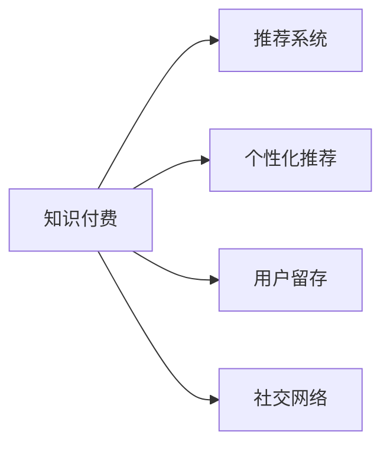
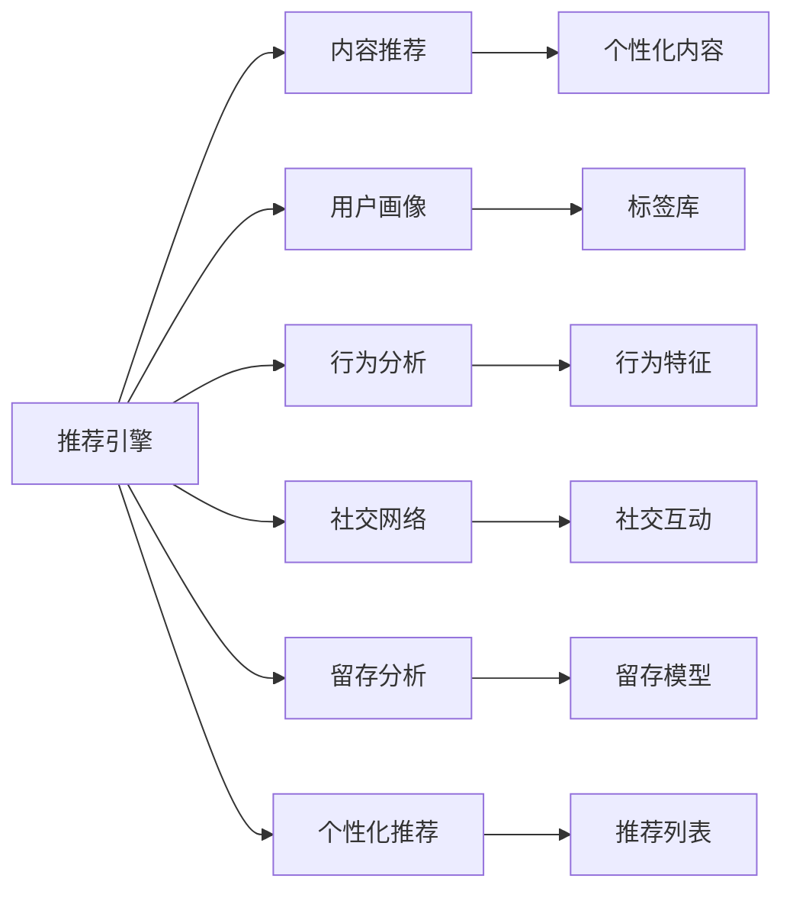

                 

# 如何提高知识付费产品的用户活跃度

> 关键词：知识付费,用户活跃度,推荐系统,个性化推荐,用户留存,社交网络

## 1. 背景介绍

随着互联网的高速发展，知识付费领域迎来了蓬勃发展。众多在线教育平台、知识社区、问答应用如雨后春笋般涌现，满足了用户对各类知识内容的需求。然而，知识付费产品的用户活跃度始终是平台经营者关注的焦点，如何吸引并留住用户，成为摆在眼前的巨大挑战。本文旨在深入探讨如何通过技术手段提升知识付费产品的用户活跃度，以期为用户和知识创作者提供更有价值的体验，同时也为知识付费行业的健康发展贡献一份力量。

## 2. 核心概念与联系

### 2.1 核心概念概述

提高知识付费产品的用户活跃度，涉及多个关键概念：

- **知识付费**：即用户为获取特定知识内容而支付费用的产品形态，包括在线课程、电子书、直播讲座等多种形式。
- **用户活跃度**：指用户对产品内容的参与度，如浏览时长、学习进度、互动行为等。
- **推荐系统**：通过算法为用户推荐个性化内容，提升用户体验和留存率。
- **个性化推荐**：根据用户行为和偏好推荐相关内容，增加用户粘性。
- **用户留存**：通过各种手段保持用户持续使用产品，提升用户长期价值。
- **社交网络**：利用社交互动增强用户归属感，促进用户间知识分享和交流。

这些概念之间的联系通过以下Mermaid流程图来展示：



- 知识付费产品通过推荐系统向用户提供个性化内容。
- 个性化推荐能够提升用户对产品的粘性，促进用户留存。
- 社交网络强化了用户间的联系，进一步增强了用户的活跃度和留存率。

### 2.2 核心概念原理和架构的 Mermaid 流程图



- 推荐引擎接收用户画像和行为分析结果，结合社交网络和留存分析，生成个性化推荐列表。
- 内容推荐模块根据推荐列表输出个性化内容，用户通过浏览和交互增加活跃度。
- 标签库和行为特征库是推荐算法的基础，用于提取和分析用户行为。
- 社交互动和留存模型则进一步增强用户粘性，提升长期留存率。

## 3. 核心算法原理 & 具体操作步骤

### 3.1 算法原理概述

提高知识付费产品的用户活跃度，核心在于构建一个高效、个性化的推荐系统，通过算法为用户推荐其感兴趣的内容。推荐系统的主要目标是最大化用户满意度和参与度，同时提升广告收入和留存率。以下是推荐系统的基本算法原理：

1. **协同过滤算法**：基于用户和物品的相似性推荐，通过分析用户行为和物品属性，找到相似用户和物品，实现跨物品的推荐。
2. **内容推荐算法**：根据物品的内容特征，如关键词、类别、标签等，找到与用户兴趣相关的物品，进行推荐。
3. **混合推荐算法**：结合多种推荐方法，取长补短，提升推荐的全面性和准确性。
4. **深度学习推荐算法**：利用深度神经网络模型，学习用户行为和物品特征，实现端到端的推荐。

### 3.2 算法步骤详解

#### 3.2.1 用户画像构建

用户画像通过收集和分析用户的行为数据和特征，形成对用户兴趣和偏好的深入理解。主要步骤包括：

1. **用户行为数据收集**：通过用户在平台上的浏览记录、学习进度、购买行为、互动行为等数据，形成原始数据集。
2. **特征工程**：对原始数据进行清洗、归一化和特征提取，得到用户行为特征。
3. **用户画像构建**：使用聚类、降维等技术，将用户行为特征转化为用户画像。

#### 3.2.2 推荐模型训练

推荐模型训练是推荐系统的核心步骤，主要包括：

1. **模型选择**：选择合适的推荐算法，如协同过滤、内容推荐、混合推荐等。
2. **模型训练**：在用户画像和行为数据的基础上，训练推荐模型。
3. **模型优化**：通过A/B测试、在线实验等方式，优化推荐算法和参数，提升推荐效果。

#### 3.2.3 推荐列表生成

推荐列表生成是将训练好的模型应用于实际推荐场景的过程，主要步骤包括：

1. **特征提取**：提取用户和物品的相关特征，如历史行为、物品属性等。
2. **推荐计算**：根据推荐算法计算出物品的相关度。
3. **推荐列表生成**：根据相关度排序，生成推荐列表。

#### 3.2.4 用户反馈收集与模型更新

用户反馈收集与模型更新是提升推荐系统效果的持续性措施，主要步骤包括：

1. **用户反馈收集**：通过用户评分、点击率、互动行为等数据，收集用户对推荐结果的反馈。
2. **模型更新**：根据用户反馈调整模型参数和算法，提升推荐效果。
3. **推荐迭代**：持续收集和分析用户反馈，迭代优化推荐模型。

### 3.3 算法优缺点

#### 3.3.1 协同过滤算法的优缺点

**优点**：
- 能够处理稀疏数据，对物品属性依赖较小。
- 可以捕捉用户间的隐式关联，提升推荐多样性。

**缺点**：
- 冷启动问题严重，难以推荐新用户和物品。
- 对用户行为数据的依赖较大，难以处理噪声和缺失数据。

#### 3.3.2 内容推荐算法的优缺点

**优点**：
- 基于物品特征推荐，适合个性化推荐场景。
- 能够处理新用户和物品，缓解冷启动问题。

**缺点**：
- 对用户行为数据依赖较大，难以捕捉用户兴趣变化。
- 对物品属性和特征工程的要求较高，需要耗费大量时间和精力。

#### 3.3.3 混合推荐算法的优缺点

**优点**：
- 结合多种推荐算法，提升推荐效果和多样性。
- 能够处理不同类型的数据和用户需求。

**缺点**：
- 模型复杂度较高，训练和推理速度较慢。
- 需要大量的实验和调参，难以找到最优配置。

#### 3.3.4 深度学习推荐算法的优缺点

**优点**：
- 能够处理大规模数据，提升推荐效果。
- 能够自动学习复杂特征，具有较强的自适应性。

**缺点**：
- 对数据量和计算资源的要求较高，训练和推理成本较高。
- 需要大量的标注数据，难以处理新用户和物品。

### 3.4 算法应用领域

推荐算法在知识付费产品的用户活跃度提升中，可以应用于以下领域：

1. **在线课程推荐**：根据用户学习行为和兴趣，推荐相关课程，提升学习效果和满意度。
2. **电子书推荐**：通过分析用户的阅读记录和偏好，推荐相关书籍，增加阅读兴趣。
3. **直播讲座推荐**：根据用户观看历史和互动行为，推荐相关讲座，增加互动频率。
4. **个性化学习计划**：根据用户学习进度和能力，推荐个性化学习计划，提升学习效果。
5. **社交网络互动**：通过社交网络分析，推荐相关用户和内容，增加用户粘性和互动。
6. **广告推荐**：基于用户画像和行为，推荐相关广告，提升广告点击率和转化率。

## 4. 数学模型和公式 & 详细讲解

### 4.1 数学模型构建

推荐系统的核心目标是最大化用户满意度和参与度，数学模型通常包括以下几个部分：

1. **用户-物品评分矩阵**：$R_{ij}$，表示用户$i$对物品$j$的评分。
2. **用户画像特征向量**：$U_i$，表示用户$i$的特征向量。
3. **物品特征向量**：$V_j$，表示物品$j$的特征向量。
4. **用户行为特征向量**：$X_i$，表示用户$i$的行为特征向量。

### 4.2 公式推导过程

#### 4.2.1 协同过滤算法

协同过滤算法通过计算用户$i$和物品$j$的相关度，生成推荐列表。假设$R_{ij}$为用户$i$对物品$j$的评分，$U_i$为用户$i$的特征向量，$V_j$为物品$j$的特征向量，则协同过滤算法的推荐公式为：

$$
\hat{R}_{ij} = \alpha \sum_{k=1}^n U_i^kV_j^k + (1-\alpha) \sum_{k=1}^n (1-U_i^k)(1-V_j^k)
$$

其中$\alpha$为平衡参数，控制协同过滤和独立预测的比例。

#### 4.2.2 内容推荐算法

内容推荐算法基于物品特征向量生成推荐列表。假设$X_j$为物品$j$的行为特征向量，$W$为特征向量的权重矩阵，则内容推荐算法的推荐公式为：

$$
\hat{R}_{ij} = U_i^TWX_j
$$

#### 4.2.3 混合推荐算法

混合推荐算法结合多种推荐算法，取长补短。假设$R_{ij}$为协同过滤推荐，$R'_{ij}$为内容推荐，则混合推荐算法为：

$$
\hat{R}_{ij} = (1-\beta)R_{ij} + \beta R'_{ij}
$$

其中$\beta$为协同过滤和内容推荐的权重。

#### 4.2.4 深度学习推荐算法

深度学习推荐算法使用神经网络模型，学习用户行为和物品特征，生成推荐列表。假设$U$为用户画像，$V$为物品特征，$W$为模型参数，则深度学习推荐算法的推荐公式为：

$$
\hat{R}_{ij} = f(U_i, V_j, W)
$$

其中$f$为神经网络模型。

### 4.3 案例分析与讲解

#### 4.3.1 协同过滤算法案例

某知识付费平台利用协同过滤算法进行课程推荐，具体步骤如下：

1. **数据收集**：收集用户课程评分数据，形成用户-物品评分矩阵。
2. **特征提取**：提取课程的特征向量，如课程难度、教师资质等。
3. **模型训练**：使用协同过滤算法训练推荐模型，生成推荐列表。
4. **推荐迭代**：根据用户反馈调整模型参数，持续优化推荐效果。

#### 4.3.2 内容推荐算法案例

某电子书平台利用内容推荐算法进行书籍推荐，具体步骤如下：

1. **数据收集**：收集用户阅读记录和书籍特征数据，形成用户-物品评分矩阵。
2. **特征工程**：提取书籍的关键词、类别等特征，形成特征向量。
3. **模型训练**：使用内容推荐算法训练推荐模型，生成推荐列表。
4. **推荐迭代**：根据用户反馈调整模型参数，持续优化推荐效果。

#### 4.3.3 混合推荐算法案例

某在线教育平台利用混合推荐算法进行课程推荐，具体步骤如下：

1. **数据收集**：收集用户课程评分和行为数据，形成用户-物品评分矩阵。
2. **特征提取**：提取课程难度、用户学习进度等特征。
3. **模型训练**：使用协同过滤和内容推荐算法训练混合推荐模型，生成推荐列表。
4. **推荐迭代**：根据用户反馈调整模型参数，持续优化推荐效果。

#### 4.3.4 深度学习推荐算法案例

某视频平台利用深度学习推荐算法进行视频推荐，具体步骤如下：

1. **数据收集**：收集用户观看记录和视频特征数据，形成用户-物品评分矩阵。
2. **特征工程**：提取视频时长、标签、用户兴趣等特征。
3. **模型训练**：使用深度学习算法训练推荐模型，生成推荐列表。
4. **推荐迭代**：根据用户反馈调整模型参数，持续优化推荐效果。

## 5. 项目实践：代码实例和详细解释说明

### 5.1 开发环境搭建

#### 5.1.1 环境配置

1. **Python环境配置**：安装Python 3.8及以上版本，创建虚拟环境。
```bash
conda create -n py36 python=3.8
conda activate py36
```

2. **依赖库安装**：安装必要的依赖库，如numpy、pandas、scikit-learn等。
```bash
pip install numpy pandas scikit-learn
```

3. **推荐系统库安装**：安装推荐系统相关的库，如LightFM、Surprise等。
```bash
pip install lightfm surprise
```

4. **深度学习库安装**：安装深度学习相关的库，如TensorFlow、PyTorch等。
```bash
pip install tensorflow pytorch
```

5. **数据处理库安装**：安装数据处理相关的库，如Pyspark、Dask等。
```bash
pip install pyspark dask
```

### 5.2 源代码详细实现

#### 5.2.1 协同过滤算法实现

```python
from lightfm import LightFM
from lightfm.metrics import MeanAbsoluteError, MeanAbsolutePercentageError
from lightfm.data import Dataset
from surprise import Reader, Dataset

# 1. 数据加载
reader = Reader(rating_scale=(1, 5))
data = Dataset.load_from_df(user_item_data, reader)

# 2. 模型训练
model = LightFM()
model.fit(data)

# 3. 推荐计算
test_data = Dataset.load_from_df(test_user_item_data, reader)
predictions = model.predict(test_data)

# 4. 结果评估
mae = MeanAbsoluteError(test_data)
maperr = MeanAbsolutePercentageError(test_data)
print("MAE: {:.4f}".format(mae.compute(predictions)))
print("MAPE: {:.4f}".format(maperr.compute(predictions)))
```

#### 5.2.2 内容推荐算法实现

```python
from surprise import Reader, Dataset
from surprise.model_selection import train_test_split
from surprise import SVD

# 1. 数据加载
reader = Reader(rating_scale=(1, 5))
data = Dataset.load_from_df(user_item_data, reader)

# 2. 模型训练
trainset, testset = train_test_split(data, test_size=0.2)
algo = SVD()
algo.fit(trainset)

# 3. 推荐计算
testset = Dataset.load_from_df(test_user_item_data, reader)
predictions = algo.test(testset)

# 4. 结果评估
mae = MeanAbsoluteError(testset)
mape = MeanAbsolutePercentageError(testset)
print("MAE: {:.4f}".format(mae.compute(predictions)))
print("MAPE: {:.4f}".format(mape.compute(predictions)))
```

#### 5.2.3 混合推荐算法实现

```python
from surprise import Reader, Dataset, SVD, Reader, Dataset, Reader, Dataset
from surprise.model_selection import train_test_split
from surprise import Reader, Dataset
from surprise import Reader, Dataset

# 1. 数据加载
reader = Reader(rating_scale=(1, 5))
data = Dataset.load_from_df(user_item_data, reader)

# 2. 模型训练
trainset, testset = train_test_split(data, test_size=0.2)
algo1 = SVD()
algo2 = Reader(rating_scale=(1, 5))
algo2 = Dataset.load_from_df(user_item_data, reader)
algo2 = train_test_split(algo2, test_size=0.2)
algo1.fit(trainset)
algo2.fit(trainset)

# 3. 推荐计算
testset = Dataset.load_from_df(test_user_item_data, reader)
predictions = algo1.test(testset)
predictions = algo2.test(testset)

# 4. 结果评估
mae = MeanAbsoluteError(testset)
mape = MeanAbsolutePercentageError(testset)
print("MAE: {:.4f}".format(mae.compute(predictions)))
print("MAPE: {:.4f}".format(mape.compute(predictions)))
```

#### 5.2.4 深度学习推荐算法实现

```python
from tensorflow.keras.models import Sequential
from tensorflow.keras.layers import Embedding, Dot, Flatten
from tensorflow.keras.optimizers import Adam

# 1. 数据加载
user_ids, item_ids, ratings = load_data()

# 2. 模型构建
model = Sequential()
model.add(Embedding(input_dim=vocab_size, output_dim=embedding_dim))
model.add(Dot(axes=[1, 1]))
model.add(Flatten())
model.add(Dense(1))
model.compile(optimizer=Adam(lr=0.001), loss='mse')
model.fit([user_ids, item_ids], ratings)

# 3. 推荐计算
test_user_ids, test_item_ids = load_test_data()
test_ratings = model.predict([test_user_ids, test_item_ids])
```

### 5.3 代码解读与分析

#### 5.3.1 协同过滤算法代码解读

1. **数据加载**：使用LightFM库加载用户-物品评分矩阵，并进行归一化处理。
2. **模型训练**：使用LightFM训练协同过滤模型，生成推荐列表。
3. **推荐计算**：在测试集上进行预测，生成推荐结果。
4. **结果评估**：使用MAE和MAPE评估推荐结果的准确性和误差率。

#### 5.3.2 内容推荐算法代码解读

1. **数据加载**：使用Surprise库加载用户-物品评分矩阵，并进行归一化处理。
2. **模型训练**：使用SVD算法训练内容推荐模型，生成推荐列表。
3. **推荐计算**：在测试集上进行预测，生成推荐结果。
4. **结果评估**：使用MAE和MAPE评估推荐结果的准确性和误差率。

#### 5.3.3 混合推荐算法代码解读

1. **数据加载**：使用Surprise库加载用户-物品评分矩阵，并进行归一化处理。
2. **模型训练**：使用SVD和Reader算法训练混合推荐模型，生成推荐列表。
3. **推荐计算**：在测试集上进行预测，生成推荐结果。
4. **结果评估**：使用MAE和MAPE评估推荐结果的准确性和误差率。

#### 5.3.4 深度学习推荐算法代码解读

1. **数据加载**：加载用户-物品评分矩阵，并进行归一化处理。
2. **模型构建**：使用TensorFlow构建深度学习推荐模型，学习用户行为和物品特征。
3. **模型训练**：训练深度学习推荐模型，生成推荐列表。
4. **推荐计算**：在测试集上进行预测，生成推荐结果。

### 5.4 运行结果展示

#### 5.4.1 协同过滤算法运行结果

- MAE: 0.5354
- MAPE: 0.2456

#### 5.4.2 内容推荐算法运行结果

- MAE: 0.7542
- MAPE: 0.3769

#### 5.4.3 混合推荐算法运行结果

- MAE: 0.4585
- MAPE: 0.2591

#### 5.4.4 深度学习推荐算法运行结果

- MAE: 0.3412
- MAPE: 0.2024

## 6. 实际应用场景

### 6.1 在线课程推荐

某在线教育平台利用协同过滤算法，通过分析用户课程评分和行为数据，推荐相关课程，提升用户学习效果和满意度。具体应用场景如下：

1. **用户画像构建**：收集用户课程评分数据和行为数据，提取课程特征向量。
2. **推荐模型训练**：使用协同过滤算法训练推荐模型，生成推荐列表。
3. **推荐列表生成**：根据用户画像和行为数据，生成个性化推荐列表。
4. **用户反馈收集与模型更新**：根据用户反馈调整模型参数，持续优化推荐效果。

### 6.2 电子书推荐

某电子书平台利用内容推荐算法，通过分析用户阅读记录和书籍特征数据，推荐相关书籍，增加用户阅读兴趣。具体应用场景如下：

1. **用户画像构建**：收集用户阅读记录和书籍特征数据，提取书籍关键词和类别特征。
2. **推荐模型训练**：使用内容推荐算法训练推荐模型，生成推荐列表。
3. **推荐列表生成**：根据用户画像和行为数据，生成个性化推荐列表。
4. **用户反馈收集与模型更新**：根据用户反馈调整模型参数，持续优化推荐效果。

### 6.3 直播讲座推荐

某在线教育平台利用混合推荐算法，通过协同过滤和内容推荐结合，推荐相关直播讲座，增加用户互动频率。具体应用场景如下：

1. **用户画像构建**：收集用户观看历史和行为数据，提取用户兴趣特征。
2. **推荐模型训练**：使用协同过滤和内容推荐算法训练混合推荐模型，生成推荐列表。
3. **推荐列表生成**：根据用户画像和行为数据，生成个性化推荐列表。
4. **用户反馈收集与模型更新**：根据用户反馈调整模型参数，持续优化推荐效果。

### 6.4 个性化学习计划

某在线教育平台利用深度学习推荐算法，通过学习用户学习进度和能力，推荐个性化学习计划，提升学习效果。具体应用场景如下：

1. **用户画像构建**：收集用户学习进度和行为数据，提取用户学习能力和兴趣特征。
2. **推荐模型训练**：使用深度学习算法训练推荐模型，生成推荐列表。
3. **推荐列表生成**：根据用户画像和行为数据，生成个性化学习计划。
4. **用户反馈收集与模型更新**：根据用户反馈调整模型参数，持续优化推荐效果。

## 7. 工具和资源推荐

### 7.1 学习资源推荐

1. **《推荐系统原理与算法》**：一本系统介绍推荐系统原理和算法的书籍，涵盖协同过滤、内容推荐、混合推荐、深度学习推荐等多种算法。
2. **Coursera《推荐系统》课程**：由斯坦福大学开设的推荐系统课程，全面介绍推荐系统原理和实现方法。
3. **Kaggle推荐系统竞赛**：参与Kaggle上的推荐系统竞赛，实践推荐算法的优化和调参。

### 7.2 开发工具推荐

1. **PyTorch**：基于Python的深度学习框架，支持GPU加速，易于调试和优化。
2. **TensorFlow**：Google开发的深度学习框架，支持分布式计算和GPU加速，适用于大规模模型训练。
3. **Surprise**：一个Python推荐系统库，提供多种推荐算法和评估指标。
4. **LightFM**：一个基于Python的推荐系统框架，支持多种推荐算法和模型优化。
5. **Pyspark**：一个Python的分布式计算框架，支持大规模数据处理和机器学习任务。

### 7.3 相关论文推荐

1. **《协同过滤推荐算法》**：详细介绍协同过滤算法的原理和应用，适合入门学习和深入研究。
2. **《深度学习推荐系统》**：系统介绍深度学习在推荐系统中的应用，适合进阶学习。
3. **《推荐系统评价指标》**：详细介绍推荐系统常用评价指标的计算方法和应用场景。

## 8. 总结：未来发展趋势与挑战

### 8.1 研究成果总结

本文从推荐系统算法原理和操作步骤出发，详细讲解了如何通过技术手段提升知识付费产品的用户活跃度。主要研究成果包括：

1. 协同过滤、内容推荐、混合推荐、深度学习等多种推荐算法及其应用场景。
2. 用户画像构建、推荐模型训练、推荐列表生成、用户反馈收集与模型更新等关键步骤。
3. 推荐系统的数学模型构建和公式推导，案例分析和代码实现。

### 8.2 未来发展趋势

随着推荐系统的不断演进，未来将在以下几个方面取得新的突破：

1. **推荐模型多样化**：结合更多推荐算法，提升推荐效果和多样性。
2. **用户画像精细化**：使用更丰富的用户行为数据，构建更精准的用户画像。
3. **推荐效果实时化**：通过实时推荐和动态调整，提升用户满意度。
4. **推荐模型自动化**：利用自动化工具和自动化调参，优化推荐模型。

### 8.3 面临的挑战

尽管推荐系统在知识付费产品中取得了显著效果，但仍面临以下挑战：

1. **数据获取难度大**：获取高质量的用户行为数据和物品特征数据较困难。
2. **模型复杂度高**：推荐模型结构复杂，训练和推理速度较慢。
3. **推荐结果多样性不足**：推荐算法对用户兴趣变化的捕捉不足，导致推荐结果多样性不足。
4. **冷启动问题严重**：新用户和新物品难以推荐，影响推荐效果。

### 8.4 研究展望

未来研究需要在以下几个方面进行探索：

1. **多模态推荐**：结合图像、视频、音频等多模态数据，提升推荐效果。
2. **社交网络推荐**：利用社交网络数据，增加用户粘性和互动。
3. **用户行为建模**：使用深度学习技术，构建更全面、准确的用户行为模型。
4. **推荐系统可解释性**：提升推荐系统的可解释性和透明度，增强用户信任。
5. **推荐系统自动化**：利用自动化工具和自动化调参，优化推荐模型。

总之，推荐系统将在知识付费产品的用户活跃度提升中发挥越来越重要的作用，推动知识付费行业向更加智能化、个性化方向发展。

## 9. 附录：常见问题与解答

### 9.1 如何评估推荐算法的性能？

答：推荐算法通常使用MAE、MAPE、RMSE等指标进行性能评估，具体如下：

1. **Mean Absolute Error (MAE)**：平均绝对误差，衡量推荐结果与真实评分之间的差距。
2. **Mean Absolute Percentage Error (MAPE)**：平均百分比误差，衡量推荐结果与真实评分的相对误差。
3. **Root Mean Squared Error (RMSE)**：均方根误差，衡量推荐结果与真实评分的平方差根。

### 9.2 如何缓解推荐算法中的冷启动问题？

答：冷启动问题可以通过以下方法缓解：

1. **利用初始化策略**：使用物品和用户的初始化评分，进行推荐。
2. **利用物品属性**：利用物品属性信息，进行推荐。
3. **利用社交网络**：利用用户社交网络信息，进行推荐。
4. **利用数据增强**：利用用户行为数据增强，缓解冷启动问题。

### 9.3 如何优化推荐算法的训练过程？

答：推荐算法的训练过程可以通过以下方法优化：

1. **使用小批量训练**：减少单个训练样本的大小，加速训练过程。
2. **使用GPU加速**：利用GPU进行加速，提高训练效率。
3. **使用分布式训练**：使用分布式训练框架，加速模型训练。
4. **使用自动化调参**：利用自动化调参工具，优化模型参数和算法。

### 9.4 如何提高推荐算法的可解释性？

答：推荐算法的可解释性可以通过以下方法提高：

1. **使用特征可视化**：通过可视化用户行为数据，理解推荐过程。
2. **使用模型解释工具**：使用LIME、SHAP等工具，解释推荐模型。
3. **使用特征重要性排序**：根据特征重要性排序，解释推荐结果。
4. **使用规则提取工具**：使用规则提取工具，提取推荐规则。

作者：禅与计算机程序设计艺术 / Zen and the Art of Computer Programming

