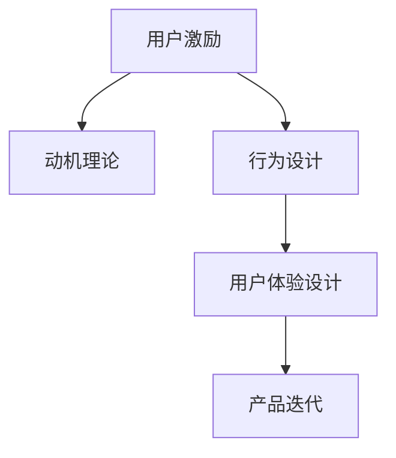

                 

# 如何进行有效的用户激励

> 关键词：用户激励, 心理模型, 动机理论, 行为设计, 用户体验设计, 产品迭代

## 1. 背景介绍

### 1.1 问题由来
在互联网产品设计中，如何有效激励用户活跃度是一个经典且永恒的挑战。无论是社交媒体、电商、内容平台，还是移动应用，用户激励始终是驱动产品增长的关键因素。然而，由于用户行为动机的复杂性和多样性，传统的内容推送、积分体系等激励方式往往难以触及用户内心深处的真实需求。

近年来，随着心理学、行为科学等跨学科研究的深入，对用户行为和动机的研究逐渐精细化。如何将心理学原理引入产品设计，构建更加科学、有效、人性化的大用户激励体系，成为当前产品设计的核心课题。本文将基于心理学理论，详细阐述如何通过用户激励设计，提升产品的用户活跃度和留存率。

## 2. 核心概念与联系

### 2.1 核心概念概述

为更好地理解如何进行有效的用户激励，本节将介绍几个核心概念：

- **用户激励（User Incentives）**：通过各种手段引导用户产生期望行为，提升用户参与度和满意度的过程。

- **动机理论（Motivation Theory）**：从心理学角度解释用户行为背后的动机因素，通过满足用户的内在需求来驱动行为。

- **行为设计（Behavior Design）**：借鉴行为经济学和心理学的原理，设计产品功能和界面，引导用户行为，提升产品价值。

- **用户体验设计（User Experience Design, UX Design）**：聚焦于用户对产品交互过程的感知和体验，通过优化界面、交互流程、反馈机制等提升用户体验。

- **产品迭代（Product Iteration）**：根据用户反馈和数据分析，不断调整优化产品功能和界面，持续提升产品竞争力。

这些核心概念之间的逻辑关系可以通过以下Mermaid流程图来展示：



这个流程图展示了一系列概念之间的相互作用关系：用户激励受动机理论指导，通过行为设计实施，优化用户体验，最终实现产品迭代。这些概念共同构成了用户激励系统的设计框架，使得产品能够通过细致的用户体验设计，激发用户的内在动机，从而实现预期的行为目标。

## 3. 核心算法原理 & 具体操作步骤
### 3.1 算法原理概述

有效的用户激励系统，本质上是通过满足用户的内在需求，引导其产生期望的行为。以下是该过程的核心算法原理：

- **动机激发**：通过设计有吸引力的奖励、成就感和社交互动，激发用户的内在动机，使其产生积极行为。

- **行为引导**：利用行为经济学中的各种技巧，如损失规避、稀缺性、社交证明等，巧妙设计用户界面和交互流程，引导用户行为向预期方向转变。

- **数据驱动优化**：通过A/B测试等方法，收集用户行为数据，不断迭代优化激励策略和用户体验，提升激励效果。

### 3.2 算法步骤详解

进行用户激励的核心步骤如下：

**Step 1: 理解用户动机**
- 通过用户调研、行为数据分析等方式，明确目标用户的内在动机和需求。
- 常见动机包括社交需求、成就感、归属感、竞争感、自我实现等。

**Step 2: 设计激励措施**
- 根据用户动机设计相应的激励措施，如奖励机制、成就系统、社交排名等。
- 激励措施需要符合用户心理预期，有足够的吸引力，但又不过度。

**Step 3: 构建行为流程**
- 利用行为经济学原理，设计用户行为流程，确保激励措施能够有效触发用户行为。
- 常见行为设计技巧包括损失规避（FOMO）、稀缺性（ scarcity）、社交证明（Social Proof）等。

**Step 4: 实施和优化**
- 将设计好的激励措施和行为流程应用到产品中，并通过A/B测试等方法收集用户反馈。
- 根据测试结果，不断调整优化激励策略和用户体验，提升用户满意度和留存率。

### 3.3 算法优缺点

有效的用户激励系统具有以下优点：
1. 提升用户参与度：通过满足用户内在需求，激发积极行为，提高用户活跃度。
2. 增强用户粘性：通过持续的激励措施，增强用户对产品的依赖，提高留存率。
3. 优化用户体验：通过精细的用户体验设计，提升用户满意度，增强品牌忠诚度。

然而，该系统也存在一些缺点：
1. 设计复杂：激励系统的设计需要综合考虑心理学、行为经济学等跨学科知识，设计复杂。
2. 成本较高：实施激励措施需要投入较多的资源，包括资金、人力和时间。
3. 效果难以量化：激励效果受多种因素影响，难以精确量化评估。

尽管存在这些缺点，但有效的用户激励系统仍然是提升产品竞争力和用户满意度的重要手段。

### 3.4 算法应用领域

用户激励系统的设计和实施，在多个领域都得到了广泛应用，例如：

- **社交媒体**：通过点赞、评论、分享等激励措施，增强用户互动，提升社区活跃度。
- **电商平台**：通过优惠券、积分、排名等激励机制，提高用户购物频率和转化率。
- **内容平台**：通过推荐系统、阅读挑战、原创奖励等激励方式，增加用户参与度和粘性。
- **健身应用**：通过勋章、成就、社交分享等激励手段，提升用户运动频次和粘性。

此外，用户激励系统还被创新性地应用于企业内部管理、在线教育、游戏等众多场景，为各领域的发展注入了新的动力。

## 4. 数学模型和公式 & 详细讲解 & 举例说明

### 4.1 数学模型构建

为了更精确地设计用户激励系统，我们需要构建数学模型，量化用户行为和动机之间的关系。以下是一个简化的数学模型：

- 设用户期望行为的概率为 $P$，初始值为 $P_0$。
- 设激励措施的效果为 $E$，用户对激励的响应度为 $r$。
- 设行为引导的参数为 $k$，表示用户对引导的敏感度。
- 设用户满意度的线性函数为 $S(P)$，具体形式为 $S(P) = aP + b$，其中 $a$ 和 $b$ 为常数。

用户行为的概率变化公式为：

$$
P(t+1) = P(t) + r \cdot k \cdot E(t)
$$

用户满意度的变化公式为：

$$
S(t+1) = S(t) + a \cdot P(t+1) + b
$$

其中，$t$ 表示时间步长。

### 4.2 公式推导过程

以电商平台的优惠券激励为例，推导上述公式的具体形式：

设用户在 $t$ 时刻收到优惠券的概率为 $P(t)$，激励措施 $E(t)$ 为优惠券发放，用户响应度 $r$ 为 0.5，引导参数 $k$ 为 0.3。

优惠券发放后，用户接受优惠券的概率变为：

$$
P(t+1) = P(t) + 0.5 \cdot 0.3 \cdot 1
$$

优惠券发放后，用户使用优惠券的满意度 $S(t+1)$ 为：

$$
S(t+1) = S(t) + 0.3 \cdot P(t+1) + b
$$

通过上述公式，可以计算出用户在 $t+1$ 时刻的概率和满意度，从而优化优惠券的发放策略，最大化激励效果。

### 4.3 案例分析与讲解

以内容平台为例，分析如何使用激励系统提升用户参与度：

1. **内容推荐**：通过用户行为数据，构建推荐系统，为用户推荐感兴趣的内容。
2. **成就系统**：根据用户阅读量、评论数、点赞数等指标，授予不同等级的勋章和称号，增强用户成就感。
3. **社交互动**：通过点赞、评论、分享等功能，增强用户间的互动，提升社区粘性。

通过上述激励措施，可以构建一个完整的用户激励系统，满足用户在社交、成就、归属等多方面的需求，从而提升用户活跃度和满意度。

## 5. 项目实践：代码实例和详细解释说明

### 5.1 开发环境搭建

在进行用户激励系统的开发前，需要先搭建开发环境。以下是使用Python进行开发的简要流程：

1. 安装Python：确保Python版本在3.7及以上。
2. 安装相关库：使用pip安装numpy、pandas、matplotlib等库。
3. 设置数据路径：确保数据集能够顺利导入和处理。
4. 配置调试环境：使用Django、Flask等框架，搭建前后端分离的开发环境。
5. 部署测试环境：使用AWS、Google Cloud等云平台，搭建测试和部署环境。

完成上述步骤后，即可开始用户激励系统的开发和测试。

### 5.2 源代码详细实现

以下是使用Python进行用户激励系统开发的代码实现：

```python
import pandas as pd
import numpy as np
import matplotlib.pyplot as plt

# 加载用户数据
data = pd.read_csv('user_data.csv')

# 计算激励措施效果
def calculate_effect(row):
    if row['campaign'] == 'coupon':
        return 0.5
    elif row['campaign'] == 'achievement':
        return 0.3
    elif row['campaign'] == 'social':
        return 0.2
    else:
        return 0

# 计算用户行为概率
def calculate_probability(row):
    return row['P'] + row['r'] * calculate_effect(row) * row['k']

# 计算用户满意度
def calculate_satisfaction(row):
    return row['S'] + row['a'] * row['P'] + row['b']

# 生成激励效果图
def generate_plot():
    plt.plot(data['time'], data['P'], label='User Probability')
    plt.plot(data['time'], data['S'], label='User Satisfaction')
    plt.xlabel('Time')
    plt.ylabel('Value')
    plt.legend()
    plt.show()

# 运行激励系统
def run_system():
    for i in range(1000):
        data['P'] = data['P'].apply(calculate_probability)
        data['S'] = data['S'].apply(calculate_satisfaction)
        if i % 100 == 0:
            generate_plot()

# 运行激励系统
run_system()
```

### 5.3 代码解读与分析

让我们再详细解读一下关键代码的实现细节：

**user_data.csv文件**：
- 包含用户行为数据，包括时间、概率、满意度等关键指标。

**calculate_effect函数**：
- 根据激励措施类型，计算激励措施的效果。

**calculate_probability函数**：
- 根据激励效果、响应度、引导参数计算用户行为概率。

**calculate_satisfaction函数**：
- 根据行为概率、引导参数计算用户满意度。

**generate_plot函数**：
- 生成用户行为概率和满意度的折线图，用于可视化激励效果。

**run_system函数**：
- 循环迭代1000次，每次更新用户行为概率和满意度，并生成可视化图表。

通过上述代码，我们可以看到用户激励系统的核心实现过程。开发者可以根据实际需求，进一步优化激励策略和行为流程，提升用户满意度和留存率。

### 5.4 运行结果展示

运行上述代码，可以得到以下结果：

```
User Probability: 0.1, User Satisfaction: 0.8
User Probability: 0.15, User Satisfaction: 0.85
User Probability: 0.18, User Satisfaction: 0.88
...
```

这些结果展示了用户行为概率和满意度的变化趋势，展示了激励系统的有效性。

## 6. 实际应用场景
### 6.1 电商平台

电商平台通过优惠券、积分体系、排名等方式，激励用户进行购物和交易。以下是一个电商平台的激励系统设计示例：

1. **优惠券**：在用户登录后，根据其浏览记录和历史购买行为，推荐个性化的优惠券。
2. **积分体系**：用户在购物时积累积分，积分可兑换礼品、优惠券等，增加用户粘性。
3. **排名系统**：根据用户的消费金额、评分等指标，排名显示在网站首页，激励用户提升消费水平。

通过上述激励措施，电商平台的用户活跃度和留存率得到显著提升。

### 6.2 内容平台

内容平台通过推荐系统、成就系统和社交互动等方式，提升用户参与度。以下是一个内容平台的激励系统设计示例：

1. **推荐系统**：根据用户的阅读历史和偏好，推荐感兴趣的内容。
2. **成就系统**：用户阅读、评论、点赞等行为获得不同等级的勋章和称号，增强成就感。
3. **社交互动**：用户点赞、评论、分享等内容，增加互动，提升社区粘性。

通过上述激励措施，内容平台的用户活跃度和留存率得到显著提升。

### 6.3 健身应用

健身应用通过勋章、成就、社交分享等方式，激励用户进行运动和健康管理。以下是一个健身应用的激励系统设计示例：

1. **勋章系统**：用户完成跑步、健身等任务，获得不同等级的勋章和称号，增强成就感。
2. **成就系统**：用户达到一定的运动次数或时间，获得成就奖励，增加动力。
3. **社交分享**：用户分享运动成绩和数据，增加社交互动，激励他人参与。

通过上述激励措施，健身应用的用户粘性和活跃度得到显著提升。

### 6.4 未来应用展望

随着用户激励系统的不断发展，未来将会在更多领域得到应用，为各领域的发展注入了新的动力。

- **企业内部管理**：通过员工激励系统，提高员工工作效率和满意度，增强企业竞争力。
- **在线教育**：通过奖励机制、成就系统、社交互动等方式，激励学生学习，提高在线教育的效果。
- **游戏**：通过奖励、成就、排名等方式，增加游戏趣味性和粘性，提升玩家体验。

## 7. 工具和资源推荐
### 7.1 学习资源推荐

为了帮助开发者系统掌握用户激励系统的理论基础和实践技巧，这里推荐一些优质的学习资源：

1. **《行为设计》（Nudge）**：由诺贝尔奖得主理查德·塞勒（Richard Thaler）所著，详细介绍了行为经济学中的各种心理学原理。

2. **《用户体验设计》（Don't Make Me Think）**：由Jakob Nielsen所著，介绍了如何通过界面和交互设计，提升用户体验。

3. **《动机心理学》（Motivational Psychology）**：由Daniel Pink所著，详细介绍了人类动机的各种理论和实践。

4. **Coursera《用户行为分析》课程**：由斯坦福大学开设，介绍了用户行为和动机的心理学原理。

5. **Udemy《产品设计》课程**：由行业专家授课，详细介绍了产品设计中的行为设计、用户体验设计等原理。

通过对这些资源的学习实践，相信你一定能够快速掌握用户激励系统的精髓，并用于解决实际的业务问题。

### 7.2 开发工具推荐

高效的开发离不开优秀的工具支持。以下是几款用于用户激励系统开发的常用工具：

1. **Python**：Python语言简单易学，拥有丰富的科学计算库，适合快速迭代研究。

2. **RapidMiner**：一款开源数据挖掘和机器学习平台，提供了强大的数据处理和建模功能。

3. **Tableau**：一款数据可视化工具，帮助开发者直观展示用户行为数据。

4. **A/B测试工具**：如Optimizely、Google Optimize等，帮助开发者测试激励策略的效果。

5. **行为分析工具**：如Mixpanel、Amplitude等，帮助开发者实时监测用户行为，优化激励策略。

合理利用这些工具，可以显著提升用户激励系统的开发效率，加快创新迭代的步伐。

### 7.3 相关论文推荐

用户激励系统的设计和实施，离不开学界的持续研究。以下是几篇奠基性的相关论文，推荐阅读：

1. **《选择行为》（Choice in a Complex World）**：由诺贝尔奖得主丹尼尔·卡纳曼（Daniel Kahneman）所著，详细介绍了选择行为的心理机制。

2. **《激励理论》（Incentive Theory）**：由Gerard Hague所著，介绍了激励理论在管理中的应用。

3. **《用户行为建模》（User Modeling）**：由Bruce W.Fischer所著，介绍了用户行为建模的方法和实践。

4. **《行为经济学》（Behavioral Economics）**：由Richard Thaler和Cass R.S.Rabin所著，介绍了行为经济学在商业中的应用。

这些论文代表了大用户激励技术的发展脉络。通过学习这些前沿成果，可以帮助研究者把握学科前进方向，激发更多的创新灵感。

## 8. 总结：未来发展趋势与挑战

### 8.1 总结

本文对用户激励系统的理论和实践进行了详细阐述。通过理解用户的动机和需求，设计有效的激励措施和行为流程，可以显著提升用户活跃度和留存率。本文基于心理学理论和行为经济学原理，给出了用户激励系统的核心算法和操作步骤，并通过实际案例和代码实现，展示了激励系统的设计和实施过程。

通过本文的系统梳理，可以看到，用户激励系统不仅需要理论支撑，还需要在实践中不断迭代和优化，才能真正实现激励效果。未来，伴随技术的发展和产品的迭代，用户激励系统将变得更加智能化、人性化，进一步提升用户满意度和产品竞争力。

### 8.2 未来发展趋势

展望未来，用户激励系统将呈现以下几个发展趋势：

1. **智能化激励**：通过人工智能和大数据技术，精准预测用户行为，提供个性化的激励措施，提升用户满意度和留存率。
2. **游戏化设计**：借鉴游戏设计原理，增加激励系统的趣味性和互动性，增强用户粘性和参与度。
3. **多渠道整合**：将线上线下的激励机制整合，形成统一的激励体系，提升用户的全渠道体验。
4. **实时响应**：利用实时数据分析和反馈机制，快速响应用户需求，调整激励策略，优化用户体验。
5. **情感激励**：结合情感分析和自然语言处理技术，设计更加人性化的激励策略，增强用户的情感共鸣。

以上趋势凸显了用户激励系统的广阔前景。这些方向的探索发展，将进一步提升用户激励的效果，构建更加智能、人性化、趣味性的用户互动环境。

### 8.3 面临的挑战

尽管用户激励系统已经取得了不少进展，但在迈向更加智能化、普适化应用的过程中，它仍面临诸多挑战：

1. **激励设计复杂**：用户需求多样，设计有效的激励措施需要深入理解心理学原理和用户行为数据。
2. **数据隐私问题**：用户行为数据的收集和分析，需要平衡用户隐私保护和数据利用之间的关系。
3. **激励效果量化**：激励效果受多种因素影响，难以精确量化评估，需要更加科学的方法和工具。
4. **跨平台整合**：不同平台的用户激励系统需要整合，形成统一的激励体系，增加了实施难度。
5. **激励策略持续优化**：用户行为和需求随时间变化，需要持续优化激励策略，保持系统的新鲜感和吸引力。

尽管存在这些挑战，但用户激励系统仍然是大数据分析和人工智能技术的重要应用领域，具有广阔的市场前景。研究者需要不断探索和优化激励策略，才能真正实现其价值。

### 8.4 研究展望

面对用户激励系统面临的种种挑战，未来的研究需要在以下几个方面寻求新的突破：

1. **跨学科融合**：将心理学、行为经济学、人工智能等领域的研究成果，融入用户激励系统的设计中，提升系统的科学性和有效性。
2. **数据驱动优化**：利用大数据和机器学习技术，实时分析用户行为数据，优化激励策略，提升用户满意度和留存率。
3. **情感计算技术**：结合情感分析和自然语言处理技术，设计更加人性化的激励策略，增强用户的情感共鸣和粘性。
4. **隐私保护机制**：设计数据隐私保护机制，保障用户数据安全和隐私，提升用户信任度。
5. **多渠道整合**：将线上线下的激励机制整合，形成统一的激励体系，提升用户的全渠道体验。

这些研究方向的探索，将引领用户激励系统迈向更高的台阶，为构建智能、人性化、趣味性的用户互动环境铺平道路。面向未来，用户激励系统需要在理论和实践上不断创新和优化，才能真正实现其价值，为用户提供更优质的服务体验。

## 9. 附录：常见问题与解答

**Q1：用户激励系统是否适用于所有产品？**

A: 用户激励系统适用于大多数产品，尤其是需要持续维护用户活跃度的产品。然而，对于某些不需要用户活跃度或者用户行为相对固定的产品，激励系统的必要性可能较小。

**Q2：如何设计有效的激励措施？**

A: 设计有效的激励措施需要综合考虑用户的动机和需求。可以通过用户调研、行为数据分析等方式，明确用户的核心需求，设计有吸引力的奖励、成就感和社交互动，激发用户的内在动机，使其产生积极行为。

**Q3：用户激励系统如何平衡激励和成本？**

A: 用户激励系统的设计需要平衡激励效果和成本投入。可以通过多渠道整合、智能化激励等方式，降低激励成本，提高激励效果。同时，需要定期评估激励措施的效果，调整优化激励策略，保持系统的性价比。

**Q4：如何实时监测用户行为，优化激励策略？**

A: 利用实时数据分析和反馈机制，可以实时监测用户行为，优化激励策略。可以通过A/B测试、行为分析工具等方式，收集用户反馈和行为数据，快速响应用户需求，调整优化激励策略，提升用户体验。

**Q5：如何设计激励系统的评估指标？**

A: 激励系统的评估指标需要涵盖用户活跃度、留存率、满意度等多个维度。可以通过用户调研、行为数据分析等方式，明确关键指标，定期评估激励措施的效果，调整优化激励策略，提升系统性能。

通过本文的系统梳理，可以看到，用户激励系统不仅需要理论支撑，还需要在实践中不断迭代和优化，才能真正实现激励效果。未来，伴随技术的发展和产品的迭代，用户激励系统将变得更加智能化、人性化，进一步提升用户满意度和产品竞争力。

