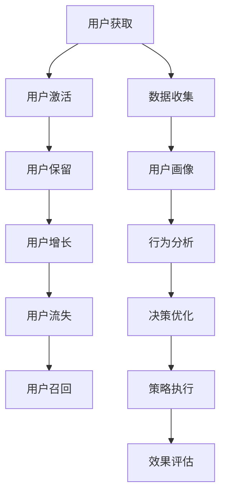

                 

# 如何进行有效的用户生命周期管理

> 关键词：用户生命周期管理, 用户行为分析, 数据驱动决策, 个性化营销, 用户保留策略

## 1. 背景介绍

在当今数字化时代，企业面临着前所未有的竞争压力。如何更好地理解用户、吸引用户、留住用户并提高用户价值，是所有企业面临的共同挑战。用户生命周期管理（Customer Lifecycle Management, CLM）就是在这种背景下应运而生的。

### 1.1 用户生命周期管理简介

用户生命周期管理是指通过系统化的方式来管理用户从首次接触到最终流失的全生命周期。其目标是最大化用户终身价值（Lifetime Value, LTV），并尽可能延长用户的活跃周期（Active User Life, AUL）。这一过程通常包括用户获取（Acquisition）、用户激活（Activation）、用户保留（Retention）、用户增长（Growth）、用户流失（Churn）和用户召回（Reactivation）等多个阶段。通过精细化的管理策略，企业可以在每一个阶段都有针对性地采取措施，优化用户体验，从而提升用户忠诚度和企业收益。

### 1.2 用户生命周期管理的必要性

1. **成本效益**：通过精确的用户生命周期管理，企业可以更加精准地分配营销资源，避免不必要的浪费，提高投资回报率（Return on Investment, ROI）。
2. **用户价值最大化**：了解用户的不同阶段，针对性地提供个性化的服务，能够有效提升用户满意度和忠诚度，从而提高用户的终身价值。
3. **数据驱动的决策**：通过数据分析，企业可以识别出影响用户行为的关键因素，制定有效的策略，提升整体业务表现。

## 2. 核心概念与联系

### 2.1 核心概念概述

用户生命周期管理涉及多个核心概念，包括但不限于：

- **用户获取（Acquisition）**：指吸引新用户的过程，包括广告投放、SEO优化、内容营销等。
- **用户激活（Activation）**：用户首次使用产品或服务并完成某一关键行为，如注册、下单等。
- **用户保留（Retention）**：用户持续使用产品或服务的过程，包括定期推送内容、提供会员权益等。
- **用户增长（Growth）**：通过推广、优惠活动等方式，促进用户数量和活跃度的提升。
- **用户流失（Churn）**：用户停止使用产品或服务的过程，需分析原因并采取措施进行召回。
- **用户召回（Reactivation）**：将流失用户重新吸引回产品或服务，提升用户终身价值。

这些概念之间相互联系，共同构成了完整的用户生命周期管理框架。

### 2.2 核心概念原理和架构的 Mermaid 流程图



通过这个流程图，我们可以看到用户生命周期管理的各个环节是相互关联的，并且都依赖于数据收集、用户画像、行为分析、决策优化、策略执行和效果评估等关键步骤。

## 3. 核心算法原理 & 具体操作步骤

### 3.1 算法原理概述

用户生命周期管理的核心在于通过数据分析和机器学习算法，对用户行为进行建模和预测，从而制定出有效的策略。常见的算法包括：

- **用户分群（Segmentation）**：基于用户特征、行为等数据，将用户分为不同的群体，以便更精细化地进行管理。
- **预测建模（Prediction Modeling）**：使用历史数据训练模型，预测用户行为，如流失概率、购买概率等，指导企业制定相应的策略。
- **个性化推荐（Personalized Recommendation）**：根据用户的历史行为和偏好，推荐个性化的产品或服务，提升用户满意度。
- **行为分析（Behavior Analysis）**：分析用户的行为模式，识别出影响用户行为的关键因素，如购买动机、用户触点等。

### 3.2 算法步骤详解

#### 3.2.1 数据收集

用户生命周期管理的数据来源非常广泛，包括：

- **交易数据**：如购买记录、交易金额等。
- **用户行为数据**：如页面浏览、点击次数、使用时长等。
- **客户服务数据**：如客服咨询记录、投诉情况等。
- **社交媒体数据**：如用户评论、分享、点赞等。

数据的收集需要遵循用户隐私保护的原则，确保数据的合法性和安全性。

#### 3.2.2 数据预处理

收集到的数据可能包含噪声和不一致性，需要进行清洗和预处理：

- **数据清洗**：处理缺失值、异常值和重复记录。
- **数据转换**：将不同格式的数据转换为统一的格式。
- **特征工程**：提取有用的特征，如用户活跃度、购买频率等。

#### 3.2.3 用户分群

通过聚类算法（如K-means、层次聚类等）或分类算法（如决策树、随机森林等）对用户进行分群，常见维度包括：

- **人口统计学特征**：如年龄、性别、职业等。
- **行为特征**：如访问频率、购买金额、点击路径等。
- **心理特征**：如兴趣、价值观、消费习惯等。

#### 3.2.4 预测建模

使用机器学习算法（如逻辑回归、随机森林、神经网络等）对用户行为进行预测：

- **流失预测**：预测用户流失概率，提前采取措施。
- **购买预测**：预测用户的购买概率，进行精准营销。
- **转化预测**：预测用户完成某项关键行为的概率。

#### 3.2.5 个性化推荐

根据用户的兴趣和行为，推荐个性化的产品或服务：

- **协同过滤**：基于用户的历史行为和相似用户的行为，推荐相关内容。
- **基于内容的推荐**：根据用户的历史行为，推荐与其偏好相似的产品。
- **混合推荐**：结合多种推荐算法，提高推荐效果。

#### 3.2.6 行为分析

分析用户的行为模式，识别出关键驱动因素：

- **用户路径分析**：分析用户在平台上的行为路径，识别出关键触点和转化路径。
- **A/B测试**：通过对比不同策略的效果，优化用户体验和转化率。
- **用户情感分析**：分析用户在社交媒体上的评论和反馈，了解用户情感变化。

#### 3.2.7 策略优化和执行

根据分析结果，制定和优化用户管理策略：

- **个性化营销**：根据用户画像和行为特征，定制化推送内容和优惠活动。
- **用户触点优化**：优化用户触点设计，提高用户转化率。
- **流失预警和召回**：通过流失预测模型，及时发现流失用户并采取召回措施。

#### 3.2.8 效果评估

对策略执行效果进行评估，确保策略的有效性：

- **KPI指标**：如用户留存率、回购率、用户满意度等。
- **A/B测试效果**：比较不同策略的性能表现。
- **用户反馈**：收集用户反馈，不断优化策略。

### 3.3 算法优缺点

#### 3.3.1 优点

- **数据驱动**：通过数据分析和模型预测，能够制定更为科学和有效的策略。
- **精细化管理**：根据用户特征和行为，进行精细化管理，提升用户满意度。
- **持续优化**：通过不断的A/B测试和效果评估，持续优化策略，提升整体表现。

#### 3.3.2 缺点

- **数据依赖**：需要大量的高质量数据支持，数据质量不佳会影响结果准确性。
- **模型复杂性**：模型构建和优化过程复杂，需要专业知识和技术支持。
- **隐私风险**：在数据收集和处理过程中，需注意用户隐私保护，避免数据泄露。

### 3.4 算法应用领域

用户生命周期管理在多个领域都有广泛的应用：

- **电子商务**：通过个性化推荐和流失预测，提升用户转化率和留存率。
- **金融服务**：通过用户行为分析，识别潜在风险客户，进行风险控制。
- **移动应用**：通过用户路径分析和行为预测，优化应用体验，提升用户活跃度。
- **旅游行业**：通过用户画像和情感分析，提供个性化的旅行建议和客户服务。
- **在线教育**：通过学习行为分析，提供个性化的学习内容和推荐，提升学习效果。

## 4. 数学模型和公式 & 详细讲解 & 举例说明

### 4.1 数学模型构建

用户生命周期管理的数学模型主要包括以下几个关键部分：

- **用户分群模型**：使用聚类算法（如K-means）将用户分为不同群体。
- **预测模型**：使用回归算法（如线性回归、决策树等）预测用户行为，如流失概率、购买概率等。
- **个性化推荐模型**：使用协同过滤或基于内容的推荐算法（如ALS、SVD等），推荐个性化产品或服务。
- **行为分析模型**：使用分类算法（如逻辑回归、随机森林等）分析用户行为，识别关键驱动因素。

### 4.2 公式推导过程

#### 4.2.1 用户分群模型的推导

假设我们有一个包含N个用户的数据集，每个用户有M个特征。使用K-means算法将用户分为K个群体，其目标是最大化群体内部的相似度，同时最大化不同群体之间的差异。假设第i个用户的特征向量为$x_i$，其所属群体为$z_i$，则K-means的目标函数为：

$$
\min \sum_{i=1}^N \sum_{k=1}^K ||x_i - \mu_k||^2, \quad \text{subject to } \sum_{i=1}^N I(z_i=k) = n_k
$$

其中，$\mu_k$是第k个群体的中心，$n_k$是第k个群体的用户数量。

#### 4.2.2 预测模型的推导

假设我们使用逻辑回归模型来预测用户流失概率$p$，模型为：

$$
p = \sigma(w^T x + b)
$$

其中，$x$是用户特征向量，$w$是模型参数，$b$是偏置项，$\sigma$是sigmoid函数。假设已有一组训练数据$(x_i, y_i)$，其中$y_i$是流失标签（0表示未流失，1表示流失），则逻辑回归模型的目标函数为：

$$
\min \sum_{i=1}^N -y_i \log p_i - (1-y_i) \log (1-p_i)
$$

使用梯度下降算法求解目标函数最小化问题。

#### 4.2.3 个性化推荐模型的推导

假设我们使用ALS算法来构建个性化推荐模型，假设用户和物品的隐向量分别为$u_i$和$i_j$，推荐矩阵为$R_{ij}$，则ALS的目标函数为：

$$
\min \sum_{i=1}^N \sum_{j=1}^M (r_{ij} - u_i^T i_j)^2
$$

其中，$r_{ij}$是用户i对物品j的评分，$u_i$和$i_j$是用户i和物品j的隐向量。

#### 4.2.4 行为分析模型的推导

假设我们使用随机森林算法来分析用户行为，假设每个用户有n个行为数据，每个行为有一个特征向量$x_i$和一个标签$y_i$，则随机森林的目标函数为：

$$
\min \sum_{i=1}^N \sum_{k=1}^K L(y_i, \hat{y}_i)
$$

其中，$L$是损失函数，$\hat{y}_i$是随机森林对用户i的第k个行为的预测。

### 4.3 案例分析与讲解

#### 4.3.1 用户分群案例

某电商公司通过K-means算法，将用户分为高价值用户、中价值用户和低价值用户三类。对高价值用户进行个性化推荐，提升其购买率；对中价值用户进行流失预警，防止其流失；对低价值用户进行重新触点设计，提升其活跃度。

#### 4.3.2 预测模型案例

某金融公司使用逻辑回归模型，预测用户的流失概率。根据流失概率，对高风险用户进行主动关怀，提供个性化的服务和优惠，减少用户流失。

#### 4.3.3 个性化推荐案例

某在线教育平台使用ALS算法，为用户推荐个性化的学习内容和课程。根据用户的历史学习行为和偏好，推荐与其兴趣相符的课程，提高学习效果和平台粘性。

#### 4.3.4 行为分析案例

某旅游公司使用随机森林算法，分析用户的出行行为。通过行为分析，识别出用户的出行偏好和风险行为，提供个性化的旅行建议和风险控制措施。

## 5. 项目实践：代码实例和详细解释说明

### 5.1 开发环境搭建

在进行用户生命周期管理项目的开发前，我们需要准备好开发环境。以下是使用Python进行PyTorch和Pandas开发的环境配置流程：

1. 安装Anaconda：从官网下载并安装Anaconda，用于创建独立的Python环境。

2. 创建并激活虚拟环境：
```bash
conda create -n clm-env python=3.8 
conda activate clm-env
```

3. 安装PyTorch和Pandas：
```bash
conda install pytorch pandas
```

4. 安装其他工具包：
```bash
pip install numpy matplotlib sklearn joblib jupyter notebook ipython
```

完成上述步骤后，即可在`clm-env`环境中开始开发。

### 5.2 源代码详细实现

这里我们以用户流失预测为例，给出使用PyTorch和Pandas进行用户生命周期管理的PyTorch代码实现。

首先，准备用户数据：

```python
import pandas as pd

# 准备数据集
data = pd.read_csv('user_data.csv')
# 特征工程
features = ['age', 'income', 'purchase_frequency', 'last_login_time']
target = 'churn'
X = data[features]
y = data[target]
```

然后，进行数据预处理和模型训练：

```python
from sklearn.model_selection import train_test_split
from sklearn.preprocessing import StandardScaler
from sklearn.linear_model import LogisticRegression
from sklearn.metrics import roc_auc_score

# 数据预处理
scaler = StandardScaler()
X_scaled = scaler.fit_transform(X)

# 划分数据集
X_train, X_test, y_train, y_test = train_test_split(X_scaled, y, test_size=0.2, random_state=42)

# 训练模型
model = LogisticRegression()
model.fit(X_train, y_train)

# 评估模型
y_pred = model.predict_proba(X_test)[:, 1]
auc = roc_auc_score(y_test, y_pred)
print(f"AUC: {auc}")
```

最后，使用模型进行预测：

```python
# 预测新用户流失概率
new_user = pd.DataFrame([[30, 5000, 3, '2023-01-01']], columns=features)
new_user_scaled = scaler.transform(new_user)
y_pred = model.predict_proba(new_user_scaled)[:, 1]
print(f"New user churn probability: {y_pred[0]}")
```

以上就是使用PyTorch和Pandas进行用户流失预测的完整代码实现。可以看到，通过预处理和模型训练，我们可以对新用户进行流失概率的预测，从而采取相应的策略。

### 5.3 代码解读与分析

让我们再详细解读一下关键代码的实现细节：

**数据准备**：
- 使用`pandas`库读取数据集，并进行特征工程的初步处理。

**模型训练**：
- 使用`sklearn`库的`train_test_split`函数划分训练集和测试集。
- 使用`StandardScaler`对特征进行标准化处理，以便更好地训练模型。
- 使用`LogisticRegression`模型进行二分类预测，计算AUC指标评估模型性能。

**预测应用**：
- 使用训练好的模型对新用户进行流失概率预测，生成预测结果。

代码中，我们使用了`pandas`和`sklearn`库对用户数据进行预处理和模型训练，使用`pytorch`库进行模型的构建和评估。通过这个示例，可以清晰地看到用户生命周期管理模型的开发流程和实现细节。

## 6. 实际应用场景

### 6.1 电子商务

在电子商务领域，用户生命周期管理的应用非常广泛。电商平台可以通过用户行为分析，识别出高价值用户和流失用户，进行个性化推荐和流失预警，从而提升用户留存率和购买率。

### 6.2 金融服务

金融服务行业需要对用户进行风险控制和个性化服务。通过用户行为分析和流失预测，金融公司可以及时发现高风险用户，采取主动关怀和风险控制措施，降低用户流失率。

### 6.3 移动应用

移动应用平台可以通过用户行为分析，优化应用体验和触点设计，提升用户活跃度和留存率。例如，通过分析用户在应用中的行为路径，优化用户界面和交互设计，提高用户满意度。

### 6.4 在线教育

在线教育平台可以通过用户行为分析和个性化推荐，提升学习效果和平台粘性。例如，根据学生的学习行为和偏好，推荐个性化的学习内容和课程，提供更有针对性的学习支持。

### 6.5 旅游行业

旅游公司可以通过用户行为分析和情感分析，提供个性化的旅行建议和服务，提升用户满意度和忠诚度。例如，根据用户的出行偏好和历史行为，推荐个性化的旅行路线和酒店。

## 7. 工具和资源推荐

### 7.1 学习资源推荐

为了帮助开发者系统掌握用户生命周期管理的理论基础和实践技巧，这里推荐一些优质的学习资源：

1. 《用户行为分析与数据驱动营销》系列博文：由数据驱动营销专家撰写，深入浅出地介绍了用户行为分析的基本概念和实践方法。

2. Coursera《数据科学与机器学习》课程：由斯坦福大学开设的顶级课程，涵盖了数据科学与机器学习的基础知识和经典模型。

3. 《深度学习在自然语言处理中的应用》书籍：介绍了深度学习在自然语言处理领域的应用，包括用户行为分析和情感分析。

4. 《用户生命周期管理：从理论到实践》课程：详细讲解了用户生命周期管理的基本概念、理论框架和实践方法，涵盖多个实际应用场景。

5. Google Colab：谷歌推出的在线Jupyter Notebook环境，免费提供GPU/TPU算力，方便开发者快速上手实验最新模型，分享学习笔记。

通过对这些资源的学习实践，相信你一定能够快速掌握用户生命周期管理的精髓，并用于解决实际的NLP问题。

### 7.2 开发工具推荐

高效的开发离不开优秀的工具支持。以下是几款用于用户生命周期管理开发的常用工具：

1. PyTorch：基于Python的开源深度学习框架，灵活动态的计算图，适合快速迭代研究。

2. TensorFlow：由Google主导开发的开源深度学习框架，生产部署方便，适合大规模工程应用。

3. Pandas：强大的数据分析库，提供高效的数据处理和分析功能，适用于数据预处理和模型训练。

4. Scikit-learn：常用的机器学习库，提供多种经典的机器学习算法和模型评估工具。

5. Jupyter Notebook：开源的交互式编程环境，支持代码编写、数据可视化和结果展示。

6. Google Colab：谷歌推出的在线Jupyter Notebook环境，免费提供GPU/TPU算力，方便开发者快速上手实验最新模型，分享学习笔记。

合理利用这些工具，可以显著提升用户生命周期管理任务的开发效率，加快创新迭代的步伐。

### 7.3 相关论文推荐

用户生命周期管理的研究涉及多个领域，以下是几篇奠基性的相关论文，推荐阅读：

1. Wu, X., Hu, M., & He, D. (2019). Customer Lifetime Value Prediction Based on Ensemble Methods. International Journal of Data Science and Analytics.

2. Berger, J. O., & Eramian, M. G. (2014). Predicting Customer Churn: Exploring the Impact of Customer Relationship Marketing Strategies. Journal of Interactive Marketing.

3. Rajagopalan, S., & Subramanian, S. (2012). Customer Lifetime Value: A Critical Review of Theory and Research. Journal of the Academy of Marketing Science.

4. Gupta, S., & Dhull, A. (2015). Customer Lifetime Value: Empirical Analysis of Its Application in the Indian Telecommunications Sector. Global Business Review.

5. Deccinswamy, V. A., Hajivassiliou, V., & Thomas, L. (2010). Customer Lifetime Value in The Information Age: Time Has Come, Time Is Now. Journal of Marketing Management.

这些论文代表了大用户生命周期管理的研究进展，通过学习这些前沿成果，可以帮助研究者把握学科前进方向，激发更多的创新灵感。

## 8. 总结：未来发展趋势与挑战

### 8.1 总结

本文对用户生命周期管理的核心概念和实践方法进行了全面系统的介绍。首先阐述了用户生命周期管理在当前数字化时代的必要性，明确了用户获取、激活、保留、增长、流失和召回等多个环节的管理目标。其次，从算法原理到实际操作，详细讲解了用户分群、预测建模、个性化推荐和行为分析等关键步骤，并给出了代码实例和详细解释说明。同时，本文还广泛探讨了用户生命周期管理在电子商务、金融服务、移动应用、在线教育、旅游等行业的应用前景，展示了其巨大的应用潜力。

通过本文的系统梳理，可以看到，用户生命周期管理是提升企业竞争力的重要手段，通过精细化管理，可以显著提升用户满意度和忠诚度，从而提高企业的收益和市场份额。未来，伴随数据驱动的决策优化和大规模深度学习的不断发展，用户生命周期管理必将在更多领域得到应用，为企业的智能化和数字化转型提供新的技术路径。

### 8.2 未来发展趋势

展望未来，用户生命周期管理将呈现以下几个发展趋势：

1. **数据驱动的智能化决策**：随着数据量的不断积累和算法的不断进步，用户生命周期管理将更加依赖于数据驱动的决策，通过智能化的预测和推荐，提升用户满意度和忠诚度。

2. **个性化服务的极致化**：通过更加精细化的用户画像和行为分析，提供更加个性化的服务和体验，提升用户粘性和品牌忠诚度。

3. **多渠道协同管理**：将用户行为数据整合到多渠道协同管理平台中，实现跨平台的用户行为跟踪和分析，提升整体用户体验。

4. **实时化的动态调整**：通过实时数据监控和反馈，动态调整策略，及时响应用户需求和市场变化，保持竞争优势。

5. **跨领域的知识融合**：将用户生命周期管理与AI、心理学、社会学等多领域的知识进行融合，提升模型的全面性和准确性。

6. **隐私保护的强化**：随着隐私保护意识的增强，用户生命周期管理将更加注重数据安全和隐私保护，确保用户数据的安全和合规使用。

以上趋势凸显了用户生命周期管理技术的广阔前景。这些方向的探索发展，必将进一步提升用户体验和平台价值，为企业的智能化和数字化转型提供新的技术路径。

### 8.3 面临的挑战

尽管用户生命周期管理技术已经取得了显著的进展，但在迈向更加智能化、普适化应用的过程中，它仍面临着诸多挑战：

1. **数据质量与多样性**：高质量、多样化的用户数据是用户生命周期管理的基础，但实际应用中，数据质量参差不齐，存在缺失、噪声和不一致性。

2. **模型复杂性**：用户生命周期管理的模型通常涉及多种算法和模型，需要专业知识和技能进行设计和优化，增加了开发和维护的复杂度。

3. **隐私与伦理**：在数据收集和处理过程中，需注意用户隐私保护，避免数据泄露和滥用，同时确保数据使用的公平性和伦理性。

4. **实时性要求高**：用户生命周期管理需要实时监控和反馈，数据处理和模型计算需要高效、准确，以支持动态调整策略。

5. **跨领域协同难度大**：用户生命周期管理涉及多个领域和系统，跨领域的知识整合和协同管理需要较高的技术水平和管理能力。

6. **用户教育与接受**：用户生命周期管理需要与用户进行互动，用户需理解并接受相关的个性化推荐和服务，这对企业的用户体验和品牌形象提出了挑战。

正视用户生命周期管理面临的这些挑战，积极应对并寻求突破，将是大数据和人工智能技术不断成熟的重要标志。相信随着学界和产业界的共同努力，这些挑战终将一一被克服，用户生命周期管理必将在构建人机协同的智能时代中扮演越来越重要的角色。

### 8.4 研究展望

面对用户生命周期管理所面临的种种挑战，未来的研究需要在以下几个方面寻求新的突破：

1. **数据融合与质量提升**：探索更高效的数据融合方法，提升数据质量，减少噪声和不一致性。

2. **模型简化与优化**：研究和开发更加简单、高效的模型，降低开发和维护成本，提高模型的稳定性和可解释性。

3. **隐私保护与伦理设计**：设计和实施更加严格的隐私保护机制，确保用户数据的安全和合规使用，同时优化数据治理流程。

4. **实时处理与高效计算**：开发更加高效的算法和计算框架，支持实时数据处理和模型计算，提高用户生命周期管理的响应速度。

5. **跨领域协同与知识整合**：探索跨领域的知识整合方法，提升模型的全面性和准确性，同时实现跨系统的协同管理。

6. **用户教育与互动优化**：设计更加人性化的用户界面和交互方式，提升用户体验，同时提供清晰透明的服务解释，增强用户的信任和接受度。

这些研究方向将推动用户生命周期管理技术迈向更高的台阶，为构建安全、可靠、可解释、可控的智能系统铺平道路。面向未来，用户生命周期管理技术还需要与其他人工智能技术进行更深入的融合，如知识表示、因果推理、强化学习等，多路径协同发力，共同推动用户行为管理和智能交互系统的进步。只有勇于创新、敢于突破，才能不断拓展用户生命周期管理的边界，让智能化技术更好地造福用户和社会。

## 9. 附录：常见问题与解答

**Q1：用户生命周期管理是否适用于所有企业？**

A: 用户生命周期管理适用于大多数企业，特别是那些用户数量庞大、业务流程复杂的企业。通过精细化管理，可以有效提升用户满意度和忠诚度，从而提高企业的收益和市场竞争力。但对于一些特定领域的企业，如B2B、政府、非营利组织等，可能需要根据实际情况进行调整和优化。

**Q2：用户生命周期管理的主要挑战是什么？**

A: 用户生命周期管理的主要挑战包括数据质量与多样性、模型复杂性、隐私与伦理、实时性要求高、跨领域协同难度大等。这些挑战需要在实际应用中逐步克服，通过不断优化和创新，实现更高效、更智能的用户管理。

**Q3：如何进行用户行为分析？**

A: 用户行为分析通常涉及以下步骤：

1. **数据收集**：通过日志、点击流、交易记录等收集用户行为数据。
2. **数据预处理**：清洗和处理数据，消除噪声和不一致性。
3. **特征工程**：提取有用的特征，如访问频率、购买金额、点击路径等。
4. **模型训练**：使用机器学习算法（如聚类、分类、回归等）对用户行为进行建模和预测。
5. **行为分析**：通过可视化工具和统计分析，识别出关键驱动因素，如购买动机、用户触点等。

**Q4：如何提升用户生命周期管理的效率？**

A: 提升用户生命周期管理的效率需要以下几个方面的努力：

1. **自动化流程**：通过自动化工具和平台，提升数据处理和模型训练的效率。
2. **数据优化**：优化数据处理流程，提高数据质量，减少冗余和不一致性。
3. **模型简化**：开发更加简单、高效的模型，降低开发和维护成本。
4. **实时监控**：通过实时数据监控和反馈，快速响应市场变化和用户需求。
5. **跨领域协同**：建立跨部门的协同机制，提升知识整合和资源共享的效率。

**Q5：用户生命周期管理有哪些实际应用场景？**

A: 用户生命周期管理在多个领域都有广泛的应用，例如：

1. **电子商务**：通过个性化推荐和流失预警，提升用户留存率和购买率。
2. **金融服务**：通过用户行为分析和流失预测，进行个性化服务和风险控制。
3. **移动应用**：通过用户路径分析和行为预测，优化应用体验和触点设计。
4. **在线教育**：通过学习行为分析和个性化推荐，提升学习效果和平台粘性。
5. **旅游行业**：通过用户行为分析和情感分析，提供个性化的旅行建议和服务。

总之，用户生命周期管理是提升企业竞争力的重要手段，通过精细化管理，可以显著提升用户满意度和忠诚度，从而提高企业的收益和市场份额。

---

作者：禅与计算机程序设计艺术 / Zen and the Art of Computer Programming

