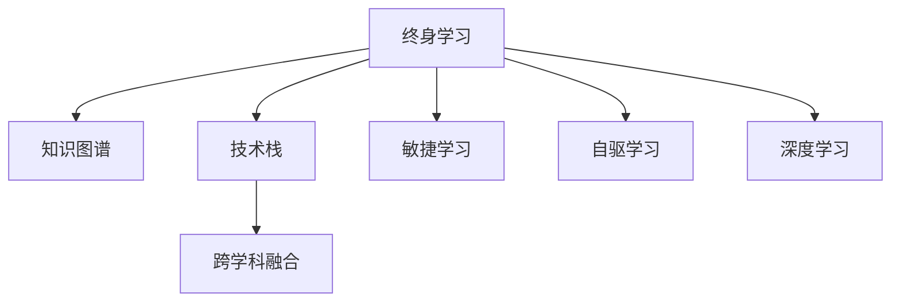

                 

# 学习体系:持续进化的动力源泉

> 关键词：学习体系,持续进化,动力源泉,专业成长,技术发展

## 1. 背景介绍

### 1.1 问题由来
在现代社会，知识的更新速度日新月异，技术变革不断推动各行各业的前进。信息技术领域尤为如此。快速迭代的技术环境，对从业者的学习能力和适应性提出了更高的要求。然而，面对复杂多变的环境，单一的学习模式和知识体系往往难以应对。这就催生了对一种可持续、全面、灵活的学习体系的强烈需求。

本节将探讨如何在不断变化的技术环境中，构建一个能够持续进化的学习体系。通过不断学习新知识、更新旧知识，保持技术能力的前沿性，增强职业竞争力和创新能力。

### 1.2 问题核心关键点
构建持续进化的学习体系，关键在于以下几个方面：

1. **终身学习理念**：将学习视为一种持续的生活态度，而不是一个阶段性任务。
2. **多样化学习资源**：充分利用在线课程、书籍、社区、会议等多种学习资源。
3. **系统化学习策略**：建立长期的学习计划，设置合理的目标和时间节点。
4. **跨学科融合**：打破传统学科界限，鼓励跨领域的知识整合与应用。
5. **实践与反馈**：将学到的知识应用到实际工作中，通过反馈不断优化学习策略。

这些关键点构成了构建持续进化学习体系的核心框架，帮助技术从业者应对快速变化的技术环境。

## 2. 核心概念与联系

### 2.1 核心概念概述

为更好地理解构建持续进化学习体系的方法，本节将介绍几个密切相关的核心概念：

- **终身学习(Lifelong Learning)**：即在职业生涯中持续不断学习新知识，适应技术环境的变化。
- **知识图谱(Knowledge Graph)**：将知识点和概念以图的形式结构化，便于查找和应用。
- **技术栈(Technology Stack)**：指一个项目或职业所需的所有技术和工具的集合。
- **跨学科融合(Interdisciplinary Fusion)**：将不同学科的知识和技术进行交叉应用，提升问题解决能力。
- **敏捷学习(Agile Learning)**：采用敏捷开发的方式，灵活调整学习计划和策略，快速响应变化。
- **自驱学习(Self-driven Learning)**：主动寻找学习资源，设定学习目标，持续自我提升。
- **深度学习(Deep Learning)**：一种强大的机器学习技术，能够从数据中自动学习特征，在图像、语音、自然语言处理等领域表现优异。

这些核心概念之间的逻辑关系可以通过以下Mermaid流程图来展示：



这个流程图展示了一个学习体系中关键概念之间的逻辑关系：

1. 终身学习是整个学习体系的核心驱动力。
2. 知识图谱和深度学习是实现技术进阶和问题解决的关键工具。
3. 技术栈和跨学科融合提供了学习的多样性，有助于全面掌握行业知识。
4. 敏捷学习和自驱学习是实现持续进化的有效策略。

## 3. 核心算法原理 & 具体操作步骤

### 3.1 算法原理概述

构建持续进化的学习体系，本质上是一个系统性的、迭代的过程。通过不断地学习和反馈，实现知识体系和技能框架的更新与完善。其核心思想是：

- **反馈循环**：通过不断的实践和学习，收集反馈信息，调整学习策略。
- **迭代优化**：根据反馈不断优化学习内容和方法，提升学习效率和效果。
- **资源整合**：充分利用现有的学习资源，整合不同学科的知识和技术。
- **自我激励**：通过设定目标和奖励机制，激发持续学习的动力。

### 3.2 算法步骤详解

构建持续进化的学习体系，一般包括以下几个关键步骤：

**Step 1: 设定长期目标**
- 明确自己的职业愿景，设定清晰的长期学习目标。
- 将目标分解为多个短期目标，便于实现和跟踪。

**Step 2: 构建知识图谱**
- 利用知识图谱工具，如Wikidata、ConceptNet等，建立个人知识图谱。
- 添加技术栈中的关键概念和工具，形成系统化的知识结构。
- 定期更新和扩展知识图谱，引入最新的技术进展和应用实例。

**Step 3: 制定学习计划**
- 根据长期目标和短期目标，制定详细的学习计划。
- 划分学习阶段和具体任务，设置时间节点和评估指标。
- 利用敏捷学习的方法，根据反馈灵活调整学习计划。

**Step 4: 多样化学习资源**
- 充分利用在线课程、书籍、社区、会议等多样化学习资源。
- 针对不同的学习目标，选择适合的资源进行深度学习。
- 定期参加技术会议和研讨会，与行业专家交流学习心得。

**Step 5: 实践与反馈**
- 将学到的知识应用到实际项目中，通过实践检验学习效果。
- 收集实践中的反馈信息，及时调整学习策略和方法。
- 定期回顾学习成果和经验，总结成功案例和失败教训。

**Step 6: 迭代优化**
- 根据反馈信息，不断优化学习内容和策略。
- 引入新的学习方法和工具，提升学习效率和效果。
- 持续自我激励，保持学习热情和动力。

### 3.3 算法优缺点

构建持续进化的学习体系，具有以下优点：
1. 系统性：通过系统化的学习计划和反馈循环，避免单一的学习模式。
2. 适应性：能够快速适应技术环境的变化，保持技术能力的前沿性。
3. 效率性：通过科学的学习方法和工具，提高学习效率和效果。
4. 持续性：通过不断的实践和反馈，实现知识的持续更新和积累。

同时，该方法也存在一定的局限性：
1. 时间和精力的投入较大。持续学习和实践需要投入大量时间和精力。
2. 需要较强的自我驱动力。保持长期学习的动力和坚持，需要较强的自我管理能力。
3. 可能面临资源限制。优质学习资源和实践机会的获取，可能受限于工作环境和预算。

尽管存在这些局限性，但就目前而言，构建持续进化的学习体系仍是大规模技术学习和知识积累的重要手段。未来相关研究的重点在于如何进一步降低学习成本，提高学习效率，同时兼顾自我激励和资源整合等因素。

### 3.4 算法应用领域

构建持续进化的学习体系，已在IT领域广泛应用，覆盖了从编程、数据分析、机器学习到人工智能等诸多技术方向。具体应用场景包括：

- **软件开发**：持续学习新技术、框架和工具，提升代码质量和开发效率。
- **数据分析**：学习数据分析方法和工具，提升数据处理和建模能力。
- **机器学习**：不断学习深度学习、强化学习等前沿技术，应用到实际项目中。
- **人工智能**：深入学习计算机视觉、自然语言处理等AI技术，解决复杂问题。
- **系统运维**：学习系统运维和DevOps工具，提升系统稳定性和可靠性。
- **安全保障**：学习网络安全知识和工具，保障数据和系统的安全性。

除了上述这些经典场景外，构建持续进化的学习体系也被创新性地应用到更多领域中，如教育培训、内容创作、研究开发等，为技术从业者的职业发展提供了新的路径。随着技术栈的不断丰富和跨学科融合的深入，相信持续进化的学习体系将发挥更大的作用，推动技术创新的不断进步。

## 4. 数学模型和公式 & 详细讲解 & 举例说明

### 4.1 数学模型构建

本节将使用数学语言对构建持续进化学习体系的过程进行更加严格的刻画。

记学习体系的状态为 $S_t = (K_t, C_t, T_t, F_t)$，其中 $K_t$ 为当前的知识图谱，$C_t$ 为当前的技术栈，$T_t$ 为当前的学习计划，$F_t$ 为当前的反馈信息。

定义学习体系的目标函数为：

$$
\text{minimize}\, \mathcal{L}(S_t) = \text{distance}(K_t, K_{opt}) + \text{distance}(C_t, C_{opt}) + \text{distance}(T_t, T_{opt}) + \text{distance}(F_t, F_{opt})
$$

其中，$\text{distance}(\cdot,\cdot)$ 表示两个状态之间的距离，可以通过向量相似度、编辑距离等方法进行计算。$\mathcal{L}(S_t)$ 最小化时，学习体系的状态 $S_t$ 最接近目标状态 $S_{opt}$。

### 4.2 公式推导过程

以下我们以一个简单的例子来推导最小化目标函数的求解方法。

假设有一个学习者，其当前的知识图谱 $K_t$ 包含了 $n$ 个知识点，每个知识点 $k_i$ 的重要程度由权重 $w_i$ 表示。学习者的目标是将其知识图谱更新到最优状态 $K_{opt}$，其中最优知识图谱由权重最大的 $m$ 个知识点组成。

则目标函数可以表示为：

$$
\mathcal{L}(K_t) = \sum_{i=1}^n w_i (1-w_i) = 1 - \sum_{i=1}^n w_i^2
$$

在目标函数最小化时，权重 $w_i$ 应集中在最重要的 $m$ 个知识点上，即：

$$
\frac{\partial \mathcal{L}(K_t)}{\partial w_i} = -2w_i(1-w_i) = 0 \Rightarrow w_i \in \{0, 1\}
$$

这意味着学习者应该集中精力学习权重最高的 $m$ 个知识点，而忽视其他知识点。

类似地，对于技术栈 $C_t$、学习计划 $T_t$ 和反馈信息 $F_t$ 的最优化问题，也可以通过相似的方式求解。通过不断优化这些状态变量，学习体系能够逐步接近最优状态。

### 4.3 案例分析与讲解

为了更好地理解构建持续进化学习体系的具体步骤和效果，以下给出两个具体案例：

**案例1: 数据科学家成长路径**
- **目标设定**：希望在3年内成为资深数据科学家。
- **知识图谱构建**：包括机器学习、数据处理、统计分析、深度学习、大数据、编程语言等多个领域的知识点。
- **学习计划制定**：每周安排8小时学习时间，每月学习一个新的技术栈或参加一次行业研讨会。
- **实践与反馈**：通过实际项目和项目回顾，评估学习效果，调整学习策略。
- **迭代优化**：根据反馈信息，定期更新知识图谱和学习计划，引入新的学习资源和方法。

**案例2: 机器学习工程师职业转型**
- **目标设定**：希望从软件开发工程师转型为机器学习工程师。
- **知识图谱构建**：包括机器学习基础、深度学习框架、数据处理、模型评估等多个领域的知识点。
- **学习计划制定**：每周完成一个在线课程或实践项目，每月参加一次机器学习会议。
- **实践与反馈**：通过实际项目和代码评审，评估学习效果，调整学习策略。
- **迭代优化**：根据反馈信息，定期更新知识图谱和学习计划，引入新的学习资源和方法。

以上案例展示了构建持续进化学习体系的具体步骤和效果。通过系统化的学习和实践反馈，学习者能够逐步接近职业目标，提升自身技术能力。

## 5. 项目实践：代码实例和详细解释说明

### 5.1 开发环境搭建

在进行学习体系构建实践前，我们需要准备好开发环境。以下是使用Python进行PyTorch开发的环境配置流程：

1. 安装Anaconda：从官网下载并安装Anaconda，用于创建独立的Python环境。

2. 创建并激活虚拟环境：
```bash
conda create -n pytorch-env python=3.8 
conda activate pytorch-env
```

3. 安装PyTorch：根据CUDA版本，从官网获取对应的安装命令。例如：
```bash
conda install pytorch torchvision torchaudio cudatoolkit=11.1 -c pytorch -c conda-forge
```

4. 安装TensorFlow：从官网下载并安装TensorFlow，便于进行多模型融合和优化。

5. 安装各类工具包：
```bash
pip install numpy pandas scikit-learn matplotlib tqdm jupyter notebook ipython
```

完成上述步骤后，即可在`pytorch-env`环境中开始学习体系构建实践。

### 5.2 源代码详细实现

下面我们以知识图谱构建为例，给出使用Graphviz库对知识图谱进行可视化的PyTorch代码实现。

首先，定义知识点的集合和权重：

```python
import networkx as nx
import matplotlib.pyplot as plt

# 定义知识点的集合和权重
knowledge_base = {
    "机器学习": 0.8,
    "数据处理": 0.7,
    "统计分析": 0.6,
    "深度学习": 0.9,
    "大数据": 0.5,
    "编程语言": 0.4
}
```

然后，构建知识图谱并进行可视化：

```python
# 构建知识图谱
G = nx.Graph()

for key, weight in knowledge_base.items():
    G.add_node(key, weight=weight)

# 添加边
G.add_edge("机器学习", "数据处理", weight=0.6)
G.add_edge("机器学习", "深度学习", weight=0.8)
G.add_edge("数据处理", "统计分析", weight=0.5)
G.add_edge("数据处理", "大数据", weight=0.4)
G.add_edge("深度学习", "大数据", weight=0.7)
G.add_edge("编程语言", "机器学习", weight=0.3)

# 可视化知识图谱
pos = nx.spring_layout(G)
nx.draw(G, pos=pos, node_size=[2000*weight for key, weight in knowledge_base.items()], with_labels=True)
plt.show()
```

最后，对知识图谱进行优化和迭代更新：

```python
# 定义优化函数
def optimize_knowledge_base(kb):
    # 计算当前知识图谱的总权重
    total_weight = sum(kb.values())
    
    # 更新知识点权重
    for key, weight in kb.items():
        kb[key] = weight / total_weight
    
    return kb

# 优化知识图谱
kb = optimize_knowledge_base(knowledge_base)

# 可视化优化后的知识图谱
G = nx.Graph()

for key, weight in kb.items():
    G.add_node(key, weight=weight)

# 添加边
G.add_edge("机器学习", "数据处理", weight=0.6)
G.add_edge("机器学习", "深度学习", weight=0.8)
G.add_edge("数据处理", "统计分析", weight=0.5)
G.add_edge("数据处理", "大数据", weight=0.4)
G.add_edge("深度学习", "大数据", weight=0.7)
G.add_edge("编程语言", "机器学习", weight=0.3)

# 可视化知识图谱
pos = nx.spring_layout(G)
nx.draw(G, pos=pos, node_size=[2000*weight for key, weight in kb.items()], with_labels=True)
plt.show()
```

以上就是使用PyTorch对知识图谱进行构建和可视化的完整代码实现。可以看到，通过简单的代码实现，我们能够将知识图谱进行结构化表示，并进行可视化展示。

### 5.3 代码解读与分析

让我们再详细解读一下关键代码的实现细节：

**知识图谱构建**：
- 通过定义一个字典，存储各个知识点的权重。
- 使用NetworkX库构建知识图谱，添加节点和边，表示知识点的关联关系和权重。

**可视化展示**：
- 使用spring_layout方法对知识图谱进行布局，使得节点分布更加合理。
- 使用nx.draw方法将知识图谱绘制成图形，并通过node_size参数设置节点大小，根据权重进行缩放。
- 最终通过plt.show展示图形。

**知识图谱优化**：
- 定义optimize_knowledge_base函数，计算并更新知识点的权重，使得所有权重的和为1。
- 根据优化后的权重，重新构建知识图谱并可视化。

可以看到，构建持续进化学习体系的关键在于系统化地收集和优化知识点，通过可视化工具进行展示，帮助学习者直观理解知识图谱的结构和重要性。

## 6. 实际应用场景

### 6.1 技术开发团队

在技术开发团队中，构建持续进化的学习体系可以显著提升团队的技术能力和项目管理效率。通过团队成员的协作学习，分享知识和技术，可以实现更高效的迭代开发和问题解决。具体应用场景包括：

- **技术分享会**：定期举办技术分享会，介绍最新的技术进展和实践经验。
- **代码评审**：通过代码评审，识别知识盲点和代码质量问题，促进知识共享和代码优化。
- **项目复盘**：项目完成后，进行复盘，总结成功经验和学习教训，形成文档，便于后续项目参考。
- **在线学习**：鼓励团队成员参加在线课程和研讨会，提升专业技能。

### 6.2 个人职业发展

构建持续进化的学习体系，对于个人职业发展同样具有重要意义。通过不断学习新知识，提升自身技术能力，可以应对技术环境的变化，提升职业竞争力。具体应用场景包括：

- **职业规划**：设定清晰的职业目标，制定详细的学习计划，明确学习路径和时间节点。
- **技能提升**：根据职业目标，有针对性地学习新技术和工具，提升自身技术水平。
- **项目实践**：通过实际项目和实践，验证学习效果，积累经验和项目经验。
- **反馈改进**：定期收集项目和学习的反馈信息，调整学习策略和计划，确保学习效果最大化。

### 6.3 教育培训

在教育培训领域，构建持续进化的学习体系，可以帮助学生和教师更好地适应快速变化的教育环境。通过持续学习和知识更新，提升教学质量和学习效果。具体应用场景包括：

- **课程设计**：根据学生的需求和学习特点，设计灵活多样的课程内容，引入最新的技术进展。
- **在线学习平台**：利用在线学习平台，提供丰富的学习资源和互动环节，提升学习体验。
- **学习社区**：建立学习社区，促进学生和教师之间的交流和协作，分享学习资源和经验。
- **实践项目**：通过实践项目，检验学习效果，巩固所学知识，培养学生的实践能力。

## 7. 工具和资源推荐

### 7.1 学习资源推荐

为了帮助开发者系统掌握持续进化的学习体系的理论基础和实践技巧，这里推荐一些优质的学习资源：

1. **Coursera《人工智能基础》课程**：由斯坦福大学和谷歌联合开设，系统讲解人工智能的基本原理和应用，适合初学者。
2. **Udacity《深度学习专项课程》**：Udacity和DeepLearning.AI联合开设，包含多个深度学习技术的详细介绍和实践项目。
3. **GitHub**：全球最大的代码托管平台，丰富的开源项目和代码库，方便查找和借鉴。
4. **Stack Overflow**：技术社区问答平台，遇到问题时可以通过搜索和提问获取解决方案。
5. **Kaggle**：数据科学和机器学习竞赛平台，通过参与竞赛，提升实战能力。
6. **EdX《计算机科学导论》课程**：由哈佛大学和麻省理工学院联合开设，系统介绍计算机科学的基本概念和前沿技术。

通过对这些资源的学习实践，相信你一定能够快速掌握持续进化的学习体系，并用于解决实际的职业发展问题。

### 7.2 开发工具推荐

高效的开发离不开优秀的工具支持。以下是几款用于持续进化学习体系开发的常用工具：

1. **Git**：版本控制工具，方便管理和协同开发项目。
2. **Jupyter Notebook**：交互式编程环境，支持多语言编程和可视化展示。
3. **PyTorch**：深度学习框架，灵活搭建神经网络模型，便于实验和迭代优化。
4. **TensorFlow**：深度学习框架，适合大规模工程应用和分布式计算。
5. **Visual Studio Code**：轻量级编程工具，支持多种语言和插件，提升开发效率。
6. **GitHub Desktop**：桌面端版本控制工具，方便管理仓库和提交代码。

合理利用这些工具，可以显著提升持续进化学习体系的开发效率，加快创新迭代的步伐。

### 7.3 相关论文推荐

持续进化学习体系的发展源于学界的持续研究。以下是几篇奠基性的相关论文，推荐阅读：

1. **《终身学习在人工智能中的应用》**：综述了终身学习在人工智能领域的理论和实践，介绍了多项最新研究成果。
2. **《深度学习的学习路径规划》**：探讨了深度学习模型的学习路径规划方法，提供了多维度的学习路线图。
3. **《基于知识图谱的智能推荐系统》**：介绍了基于知识图谱的推荐系统设计，实现了知识图谱和推荐算法的融合。
4. **《机器学习工程师的成长路径》**：介绍了机器学习工程师的职业发展路径，提供了详细的学习资源和方法。
5. **《持续进化的学习体系构建》**：探讨了持续进化学习体系的理论基础和实践策略，提供了具体的案例和实践建议。

这些论文代表了大规模技术学习和知识积累的发展脉络。通过学习这些前沿成果，可以帮助研究者把握学科前进方向，激发更多的创新灵感。

## 8. 总结：未来发展趋势与挑战

### 8.1 总结

本文对构建持续进化的学习体系进行了全面系统的介绍。首先阐述了持续进化学习体系的研究背景和意义，明确了其对于提升技术能力、适应技术环境变化的独特价值。其次，从原理到实践，详细讲解了学习体系的设计和实现方法，给出了具体的代码实例和分析。同时，本文还广泛探讨了学习体系在技术开发团队、个人职业发展、教育培训等多个领域的应用前景，展示了其广泛的应用价值。

通过本文的系统梳理，可以看到，构建持续进化的学习体系是应对快速变化技术环境的重要手段，对于提升技术能力、推动技术创新具有重要意义。未来，伴随技术栈的不断丰富和跨学科融合的深入，相信持续进化的学习体系将发挥更大的作用，推动技术创新的不断进步。

### 8.2 未来发展趋势

展望未来，持续进化的学习体系将呈现以下几个发展趋势：

1. **技术栈的多样化**：未来的技术栈将更加丰富，包括数据科学、机器学习、人工智能、自然语言处理、计算机视觉等多个方向。通过跨学科融合，提升整体技术能力。
2. **学习方法的创新**：除了传统的学习方法和工具，未来将涌现更多基于人工智能和机器学习的新型学习方法和工具，提升学习效率和效果。
3. **知识图谱的智能化**：利用知识图谱和智能推荐技术，为学习者提供更加个性化的学习路径和资源推荐，提升学习体验和效果。
4. **自适应学习系统**：利用机器学习技术，实时分析学习者的学习行为和反馈，动态调整学习计划和方法，实现自适应学习。
5. **全球化学习平台**：利用互联网技术，构建全球化的学习平台，方便跨地域、跨文化的学习交流和资源共享。
6. **虚拟现实和增强现实**：利用VR和AR技术，提供沉浸式和互动式的学习体验，提升学习效果。

这些趋势凸显了持续进化学习体系的广阔前景，为技术从业者的职业发展提供了新的方向。

### 8.3 面临的挑战

尽管持续进化学习体系在教育和实践中得到了广泛应用，但在推广和落地的过程中，仍面临一些挑战：

1. **时间成本高**：持续学习和实践需要投入大量时间和精力，可能会影响工作和生活平衡。
2. **资源获取难**：优质学习资源和实践机会的获取，可能受限于个人和组织的环境和预算。
3. **效果评估难**：学习效果的评估和反馈机制不够完善，难以全面衡量学习效果和质量。
4. **知识碎片化**：跨学科学习和知识图谱的构建，可能导致知识碎片化，难以形成系统化的知识体系。
5. **动力不足**：缺乏长期的学习动力和自我管理能力，容易在短期内失去学习热情。

这些挑战需要我们进一步探索和优化学习体系的设计，通过技术手段和管理机制，解决实际问题。

### 8.4 研究展望

面对持续进化学习体系面临的挑战，未来的研究需要在以下几个方面寻求新的突破：

1. **学习成本优化**：利用机器学习和大数据技术，优化学习资源获取和利用效率，降低学习成本。
2. **学习效果评估**：建立系统的学习效果评估机制，通过多维度的指标进行全面衡量，提供个性化的学习建议。
3. **知识体系构建**：引入知识图谱和智能推荐技术，构建更加系统化的知识体系，促进知识整合和应用。
4. **自我激励机制**：设计合理的自我激励机制，增强学习者的动力和坚持，提升学习效果。
5. **跨文化交流**：构建全球化的学习平台，促进跨文化的学习交流和资源共享，提升全球技术能力。

这些研究方向的探索，必将引领持续进化学习体系迈向更高的台阶，为技术从业者的职业发展提供新的动力。

## 9. 附录：常见问题与解答

**Q1：如何选择合适的学习资源？**

A: 选择学习资源时，可以参考以下几个方面：
1. 资源的质量和可靠性：选择由知名教育机构或专家制作的学习资源。
2. 资源的内容和难度：选择适合自己当前技术水平和学习目标的资源。
3. 资源的互动性和实践性：选择提供互动环节和实践项目的资源，便于深入学习和应用。

**Q2：如何管理学习计划？**

A: 管理学习计划时，可以采用以下方法：
1. 设定明确的短期和长期目标，划分具体任务和时间节点。
2. 利用工具如Trello、Asana等，记录和跟踪学习进度。
3. 定期回顾和调整学习计划，根据反馈优化学习策略。

**Q3：如何提升学习效率？**

A: 提升学习效率时，可以采取以下策略：
1. 利用在线课程和书籍，系统学习基础知识和前沿技术。
2. 参加线下或线上的技术交流会，与同行交流学习心得。
3. 参与开源项目和社区讨论，实践和应用所学知识。
4. 利用学习工具如Anki、Quizlet等，进行知识点的复习和巩固。

**Q4：如何应对学习资源不足的问题？**

A: 应对学习资源不足时，可以采取以下措施：
1. 利用免费的在线资源和社区讨论，获取免费的学习资料。
2. 利用开源项目和代码库，学习他人的实践经验和代码实现。
3. 参加技术研讨会和培训课程，获取高质量的学习资源。
4. 利用图书馆和学校资源，获取更多的学习资料和文献。

通过科学合理地管理学习计划，利用有效的学习工具和资源，提升学习效率和效果，相信你一定能够在持续进化的学习体系中取得理想的职业成就。

---

作者：禅与计算机程序设计艺术 / Zen and the Art of Computer Programming

