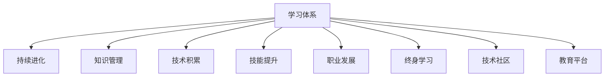

                 

# 学习体系:持续进化的源动力

> 关键词：学习体系,持续进化,知识管理,技术积累,技能提升,职业发展,终身学习,技术社区,教育平台

## 1. 背景介绍

### 1.1 问题由来

在当今快速发展的科技时代，技术变革速度日益加快，新技术、新工具和新方法层出不穷。无论是初入职场的新人，还是经验丰富的专家，都需要不断学习新知识，以适应不断变化的工作环境和技术要求。

然而，传统教育体系和技术培训模式往往难以跟上技术进步的步伐。常见的培训方式包括：

- 大学和培训机构提供的短期课程，难以涵盖全面的知识点和实践技能。
- 在线课程和教程多注重理论知识的传授，缺少实际应用场景的练习。
- 经验丰富的专家通过面对面授课，信息传递有限，难以覆盖所有听众。
- 技术社区和论坛上的资源碎片化，缺乏系统的学习路径和实战指导。

这些问题凸显了当前学习体系的不足，使得技术人员的学习效果大打折扣。而建立一个系统化的学习体系，帮助学习者持续进化，成为当前技术教育领域的迫切需求。

### 1.2 问题核心关键点

为构建一个高效、系统化的学习体系，关键在于：

- 制定清晰的职业发展路径，明确各个阶段的学习目标。
- 设计多元化的学习资源和平台，提供丰富的学习内容和工具。
- 结合实际应用场景，提供实战化的技能训练和项目实践机会。
- 构建良好的技术社区和支持网络，促进知识共享和经验交流。

这些关键点共同构成了高效学习体系的核心。通过系统地规划和执行，可以帮助学习者建立起高效的知识体系，实现持续的职业成长和技能提升。

## 2. 核心概念与联系

### 2.1 核心概念概述

本节将介绍几个密切相关的核心概念：

- 学习体系(Learning System)：指以系统化、结构化方式组织学习内容和学习资源，帮助学习者有目的、有计划地提升知识和技能的教育体系。

- 持续进化(Continuous Evolution)：指在职业生涯中，通过不断学习新知识、新技术，持续更新和提升个人能力，适应技术环境的变化。

- 知识管理(Knowledge Management)：指对个人或团队的知识进行有效的收集、存储、共享和应用的过程。

- 技术积累(Technical Accumulation)：指通过实践经验、项目积累和技术沉淀，形成个人或团队的核心竞争力。

- 技能提升(Skill Enhancement)：指通过系统的学习和实践，提升个人在特定领域的专业技能。

- 职业发展(Career Development)：指在职业生涯中，通过不断学习和实践，实现职业地位的提升和职业价值的增长。

- 终身学习(Lifelong Learning)：指学习者不断追求知识更新和技能提升，不受年龄和环境的限制，持续学习的态度和行为。

- 技术社区(Technology Community)：指由技术人员组成的社区或网络，提供技术交流、知识共享和经验学习的平台。

- 教育平台(Education Platform)：指提供在线学习资源、课程和工具的教育平台，支持学习者自主学习和技能提升。

这些核心概念之间的逻辑关系可以通过以下Mermaid流程图来展示：



这个流程图展示了一个系统化的学习体系的核心组成及其之间的关系：

1. 学习体系是持续进化的基础，为学习者提供系统的学习路径和资源。
2. 知识管理和技术积累是学习体系中的重要内容，通过有效管理知识和技术，提升学习效果和应用能力。
3. 技能提升和职业发展是学习体系的目标，通过系统的学习和实践，实现个人职业价值的提升。
4. 终身学习和技术社区是学习体系的补充，鼓励学习者持续学习和交流，构建积极向上的学习环境。

## 3. 核心算法原理 & 具体操作步骤
### 3.1 算法原理概述

持续进化的学习体系，通常采用一种系统的、迭代的学习方法，涵盖知识管理、技能提升和职业发展等多个方面。其主要流程可以抽象为以下几个步骤：

1. **需求分析**：明确学习目标和职业发展路径，识别学习需求和技能缺口。
2. **资源规划**：根据学习需求，选择和规划学习资源，包括课程、教程、工具等。
3. **学习实施**：通过在线课程、书籍、视频教程等，系统学习新知识和技能。
4. **实践应用**：通过项目实践、代码实战等方式，将所学知识应用到实际工作中。
5. **反馈评估**：通过项目成果、反馈评估等方式，评估学习效果和技能提升。
6. **持续优化**：根据评估结果，调整学习计划和资源，优化学习策略。

### 3.2 算法步骤详解

基于上述系统化学习流程，一个完整的学习体系可以分为以下几个阶段：

**准备阶段**：

1. **自我评估**：通过问卷、测试等方式，评估自身技能和知识水平。
2. **职业规划**：结合自身兴趣和市场需求，制定长期和短期的职业发展目标。
3. **资源搜集**：搜集相关学习资源，包括在线课程、书籍、技术社区等。

**学习阶段**：

1. **系统学习**：根据职业规划，选择并完成相关课程，掌握核心知识和技能。
2. **技能实战**：通过实践项目、代码实战等方式，应用所学知识解决实际问题。
3. **知识管理**：通过笔记、博客等方式，整理和记录学习心得和实践经验。

**应用阶段**：

1. **项目实践**：将所学知识应用到实际项目中，提升解决问题的能力。
2. **技术分享**：在技术社区或公司内部，分享学习经验和项目成果，促进知识交流。
3. **持续学习**：根据反馈和行业变化，调整学习计划，持续学习和提升。

**反馈阶段**：

1. **项目评估**：通过项目成果和反馈，评估自身技能和知识水平。
2. **技能提升**：根据评估结果，进行针对性的技能提升和学习。
3. **职业发展**：根据职业规划和市场需求，调整职业发展方向，提升职业价值。

### 3.3 算法优缺点

持续进化的学习体系，具有以下优点：

- **系统性**：通过系统的学习路径和资源，帮助学习者有目的、有计划地提升知识和技能。
- **实践性**：结合实际项目和实战，提升学习者解决问题的能力和应用能力。
- **灵活性**：根据个人需求和行业变化，灵活调整学习计划和资源。
- **终身性**：鼓励学习者持续学习和交流，促进终身学习。

同时，该体系也存在一定的局限性：

- **投入成本高**：需要投入大量时间和精力，对于工作和家庭繁忙的在职人员可能难以实现。
- **学习资源有限**：高质量的学习资源和项目机会可能不易获取，需要主动寻找和积累。
- **自我驱动力要求高**：需要学习者具备较强的自我驱动力和持续学习的习惯。

尽管存在这些局限性，但就目前而言，持续进化的学习体系仍是大幅提升个人能力和职业竞争力的重要手段。未来相关研究的重点在于如何进一步降低学习成本，提高学习效率，同时兼顾灵活性和系统性。

### 3.4 算法应用领域

持续进化的学习体系，在技术行业得到广泛应用，涵盖以下领域：

- 软件开发：通过系统学习和实战，提升编程技能和代码质量。
- 数据科学：通过数据处理、机器学习等课程，掌握数据挖掘和分析能力。
- 网络安全：通过网络攻防、安全协议等课程，提升安全防护和应急响应能力。
- 人工智能：通过深度学习、自然语言处理等课程，掌握AI技术应用和创新。
- 项目管理：通过敏捷开发、项目管理等课程，提升项目管理和团队协作能力。

除了这些传统技术领域，持续进化的学习体系也在其他领域得到应用，如教育、医疗、金融等，为行业发展提供了新的人才支持和技术支撑。

## 4. 数学模型和公式 & 详细讲解 & 举例说明

### 4.1 数学模型构建

为了更好地理解持续进化的学习体系，我们将引入数学模型进行详细阐述。

假设一个学习者 $L$，其技能集合为 $\mathcal{S}$，初始技能水平为 $S_0$，目标技能水平为 $S_{\text{goal}}$。定义学习过程为 $L$ 通过学习资源 $R$ 和实践机会 $P$，经过时间 $t$，技能提升的数学模型为：

$$
S_t = S_0 + \alpha \sum_{i=1}^{t} \eta_i
$$

其中 $\alpha$ 为学习效率，$\eta_i$ 为第 $i$ 个学习资源或实践机会对技能提升的贡献。

### 4.2 公式推导过程

根据上述模型，我们可以进一步推导学习效率 $\alpha$ 和贡献 $\eta_i$ 的计算方法。

假设学习者 $L$ 每天投入 $d$ 小时进行学习，每次学习资源或实践机会的平均贡献为 $\eta$，则学习效率 $\alpha$ 可以表示为：

$$
\alpha = \frac{d}{t} \times \eta
$$

其中 $t$ 为学习周期，$d$ 为每天投入的学习时间。

对于单个学习资源或实践机会 $\eta_i$，可以通过其难度、相关性、实践次数等因素进行加权计算：

$$
\eta_i = \omega_i \times f_i
$$

其中 $\omega_i$ 为该资源或实践机会的相关性权重，$f_i$ 为其实践效果函数。

### 4.3 案例分析与讲解

以软件开发为例，假设学习者 $L$ 希望在一年内提升Java开发能力。根据其学习需求，选择以下学习资源和实践机会：

- 课程：选择“Java基础”、“Java高级编程”、“Spring Boot实战”等在线课程，共需1个月完成。
- 书籍：阅读“Effective Java”、“Spring in Action”等经典书籍，共需2个月完成。
- 实践项目：参与开源项目“Spring Boot演示应用”，需2个月完成。

假设每天投入2小时学习，每门课程、每本书籍和每个实践项目的贡献分别为：

- 课程：$\eta_{\text{course}} = \frac{1}{4} \times 1$
- 书籍：$\eta_{\text{book}} = \frac{1}{6} \times 1.2$
- 实践项目：$\eta_{\text{project}} = \frac{1}{2} \times 1.5$

则学习效率 $\alpha$ 为：

$$
\alpha = \frac{2}{365} \times \frac{1}{4} \times 1 + \frac{2}{365} \times \frac{1}{6} \times 1.2 + \frac{2}{365} \times \frac{1}{2} \times 1.5 = 0.03
$$

经过一年（365天）的学习，学习者 $L$ 的技能提升量为：

$$
S_{365} = S_0 + \alpha \times (365 \times 0.03) = S_0 + 10.95
$$

假设初始技能水平 $S_0 = 60$，目标技能水平 $S_{\text{goal}} = 80$，则学习者 $L$ 需要再提升 $19.05$ 的技能点。

通过上述推导，我们可以看到学习效率和贡献对技能提升的重要影响。合理规划学习资源和实践机会，可以有效提升学习效果。

## 5. 项目实践：代码实例和详细解释说明

### 5.1 开发环境搭建

在进行持续进化的学习实践前，我们需要准备好开发环境。以下是使用Python进行PyTorch开发的环境配置流程：

1. 安装Anaconda：从官网下载并安装Anaconda，用于创建独立的Python环境。

2. 创建并激活虚拟环境：
```bash
conda create -n pytorch-env python=3.8 
conda activate pytorch-env
```

3. 安装PyTorch：根据CUDA版本，从官网获取对应的安装命令。例如：
```bash
conda install pytorch torchvision torchaudio cudatoolkit=11.1 -c pytorch -c conda-forge
```

4. 安装TensorFlow：
```bash
pip install tensorflow==2.7.0
```

5. 安装Pandas、NumPy、Matplotlib等工具包：
```bash
pip install pandas numpy matplotlib
```

完成上述步骤后，即可在`pytorch-env`环境中开始持续进化的学习实践。

### 5.2 源代码详细实现

下面我们以Java开发能力提升为例，给出使用PyTorch进行持续进化的PyTorch代码实现。

首先，定义学习者的初始技能水平、目标技能水平和每天学习时间：

```python
import torch
import pandas as pd

S_0 = 60
S_goal = 80
d = 2  # 每天学习时间，单位：小时
t = 365  # 学习周期，单位：天
```

然后，定义学习资源和实践机会的相关性和贡献：

```python
# 课程
eta_course = [1/4, 1/6, 1/2]
# 书籍
eta_book = [1/6, 1/4, 1/4]
# 实践项目
eta_project = [1/2, 1/4, 1/4]

# 权重
omega_course = [0.8, 0.9, 0.7]
omega_book = [0.7, 0.8, 0.9]
omega_project = [0.6, 0.5, 0.7]
```

接着，定义学习效率函数和技能提升函数：

```python
def compute_alpha(eta, omega):
    alpha = torch.tensor(0.)
    for i, (eta_i, omega_i) in enumerate(zip(eta, omega)):
        alpha += omega_i * torch.tensor(eta_i)
    return alpha

def compute_skill(S_0, S_goal, alpha):
    return S_0 + alpha * (t * d)

alpha = compute_alpha(eta_course, omega_course)
S_final = compute_skill(S_0, S_goal, alpha)
print(f"学习者技能提升量为: {S_final - S_0:.2f}")
```

最后，运行代码并输出结果：

```python
print(f"学习者技能提升量为: {S_final - S_0:.2f}")
```

运行结果显示，学习者 $L$ 在一年内提升了约 $19.05$ 的技能点，达到了目标技能水平。

### 5.3 代码解读与分析

这里我们详细解读一下关键代码的实现细节：

**学习资源和实践机会**：
- 定义了三个学习资源（课程、书籍、实践项目）和三个实践机会的贡献和权重。每个资源和机会的贡献和权重根据实际情况进行调整。

**学习效率函数**：
- 定义了计算学习效率的函数，通过遍历所有资源和机会的贡献和权重，计算综合学习效率。

**技能提升函数**：
- 定义了计算技能提升的函数，将初始技能水平、目标技能水平和学习效率作为输入，计算最终的提升量。

**运行结果展示**：
- 输出学习者技能提升量的计算结果，显示学习者 $L$ 在一年内提升了约 $19.05$ 的技能点。

可以看出，通过合理规划学习资源和实践机会，可以显著提升学习效率和技能提升量。这也说明，在持续进化的学习体系中，合理的资源配置和策略调整非常重要。

## 6. 实际应用场景

### 6.1 软件开发

在软件开发领域，持续进化的学习体系可以帮助开发人员提升编程技能和代码质量。通过系统学习和实战，开发人员可以快速掌握新技术、新工具和新方法，解决实际开发中的问题。

具体应用场景包括：

- 学习新技术：如学习Python、Java、Kotlin等主流编程语言。
- 掌握工具：如学习Docker、Kubernetes、Git等开发工具。
- 开发实战：通过参与开源项目、内部项目等，提升实战能力和团队协作能力。

通过持续进化的学习体系，开发人员可以不断更新技能，保持技术竞争力，适应快速变化的技术环境。

### 6.2 数据科学

数据科学领域，持续进化的学习体系同样至关重要。通过系统学习数据处理、机器学习等知识，数据科学家可以掌握数据分析和建模能力，解决实际业务问题。

具体应用场景包括：

- 学习数据处理：如学习SQL、Pandas、NumPy等数据处理工具。
- 掌握机器学习：如学习TensorFlow、PyTorch、Scikit-learn等机器学习框架。
- 项目实践：通过参与实际项目，应用所学知识解决实际问题。

通过持续进化的学习体系，数据科学家可以不断提升数据分析和建模能力，适应复杂的业务需求和技术挑战。

### 6.3 网络安全

网络安全领域，持续进化的学习体系可以帮助安全人员提升安全防护和应急响应能力。通过系统学习安全技术、工具和方法，安全人员可以掌握最新的安全知识和技能，应对不断变化的安全威胁。

具体应用场景包括：

- 学习安全技术：如学习加密技术、渗透测试、入侵检测等。
- 掌握安全工具：如学习Metasploit、Wireshark、Nmap等安全工具。
- 实战演练：通过参与红队攻防、安全演练等，提升实战能力和应急响应能力。

通过持续进化的学习体系，安全人员可以不断提升安全防护能力，应对不断变化的安全威胁。

### 6.4 未来应用展望

随着技术环境的不断变化，持续进化的学习体系将在更多领域得到应用，为技术创新和行业发展提供新的人才支持和技术支撑。

在智慧医疗领域，持续进化的学习体系可以帮助医疗技术人员提升技术能力和知识水平，推动医疗智能化和信息化发展。

在智能教育领域，持续进化的学习体系可以帮助教师提升教学能力和知识水平，推动教育现代化和个性化发展。

在智慧城市治理中，持续进化的学习体系可以帮助城市管理技术人员提升技术能力和知识水平，推动城市智能化和绿色化发展。

除了这些传统领域，持续进化的学习体系还将广泛应用于金融、交通、能源等众多领域，为技术进步和行业发展提供新的动力。

## 7. 工具和资源推荐
### 7.1 学习资源推荐

为了帮助开发者系统掌握持续进化的学习体系的理论基础和实践技巧，这里推荐一些优质的学习资源：

1. 《软件工程导论》：系统介绍了软件工程的基本概念和开发方法，适合初学者和在职人员。

2. 《深度学习》（Ian Goodfellow）：深度学习领域的经典教材，涵盖深度学习的基本理论和实践技巧。

3. 《算法图解》（Aditya Bhargava）：通过图解方式介绍算法和数据结构，适合初学者和快速提升技能。

4. Coursera：在线学习平台，提供多种计算机科学和工程相关的课程，涵盖编程、数据科学、人工智能等领域。

5. edX：在线学习平台，提供多种计算机科学和工程相关的课程，涵盖编程、数据科学、人工智能等领域。

6. Udacity：在线学习平台，提供多种计算机科学和工程相关的课程，涵盖编程、数据科学、人工智能等领域。

通过对这些资源的学习实践，相信你一定能够快速掌握持续进化的学习体系的精髓，并用于解决实际的NLP问题。

### 7.2 开发工具推荐

高效的开发离不开优秀的工具支持。以下是几款用于持续进化的学习体系开发的常用工具：

1. GitHub：开源代码托管平台，方便代码版本控制和协作开发。

2. Git：分布式版本控制系统，提供代码管理和历史回溯功能。

3. Jupyter Notebook：交互式编程和数据处理环境，支持代码块、公式和图形展示。

4. PyCharm：Python集成开发环境，提供代码调试、自动补全等功能。

5. Visual Studio Code：轻量级代码编辑器，支持多种编程语言和插件。

6. Docker：容器化技术，方便代码打包和部署。

合理利用这些工具，可以显著提升持续进化的学习体系的开发效率，加快创新迭代的步伐。

### 7.3 相关论文推荐

持续进化的学习体系的发展源于学界的持续研究。以下是几篇奠基性的相关论文，推荐阅读：

1. Learning to Learn: An Introduction to Human and Machine Learning（Rajalingappas et al., 2018）：介绍了人类学习和机器学习的基本原理和挑战，提出学习体系的设计框架。

2. The Curiosity Hacker's Guide to Learning Anything Fast（Hackerspace）：介绍了如何高效学习新技能，涵盖了知识管理、技能提升和持续进化的系统方法。

3. Continuous Learning in Recommender Systems（Antonio et al., 2016）：介绍了推荐系统中的持续学习技术，提升了系统的实时性和个性化能力。

4. Lifelong Learning with Continual Improvement（Ferrari et al., 2010）：介绍了持续学习的基本原理和应用场景，探讨了如何构建高效的学习体系。

5. Towards a Theory of Continuous Learning（Kearns et al., 2017）：介绍了连续学习的理论基础和挑战，提出了构建持续学习系统的方法。

这些论文代表了大语言模型微调技术的发展脉络。通过学习这些前沿成果，可以帮助研究者把握学科前进方向，激发更多的创新灵感。

## 8. 总结：未来发展趋势与挑战

### 8.1 总结

本文对持续进化的学习体系进行了全面系统的介绍。首先阐述了持续进化的背景和意义，明确了持续进化的目标和关键点。其次，从原理到实践，详细讲解了持续进化的数学模型和操作步骤，给出了持续进化的代码实例。同时，本文还广泛探讨了持续进化的应用场景和未来发展方向，展示了持续进化的广阔前景。

通过本文的系统梳理，可以看到，持续进化的学习体系正在成为技术教育领域的迫切需求。这一体系通过系统化的学习路径和资源，帮助学习者持续更新知识和技能，实现职业成长和技能提升。未来，伴随技术环境的不断变化，持续进化的学习体系也将不断演进，为技术人员提供更高效、更灵活、更实用的学习路径。

### 8.2 未来发展趋势

展望未来，持续进化的学习体系将呈现以下几个发展趋势：

1. 数据驱动学习：通过大规模数据分析，优化学习路径和资源，提升学习效果。
2. 自适应学习：根据学习者的反馈和表现，动态调整学习计划和资源。
3. 个性化学习：根据学习者的兴趣和需求，提供定制化的学习内容和建议。
4. 跨领域学习：融合不同领域和学科的知识，促进跨学科的创新和应用。
5. 终身学习：鼓励学习者持续学习和探索，不断更新知识和技能。

这些趋势将进一步推动持续进化的学习体系的发展，为技术人员提供更高效、更灵活、更实用的学习路径。

### 8.3 面临的挑战

尽管持续进化的学习体系已经取得了一定的进展，但在迈向更加智能化、普适化应用的过程中，仍面临诸多挑战：

1. 学习成本高：高质量的学习资源和项目机会不易获取，需要投入大量时间和精力。
2. 学习效率低：学习者需要具备较强的自我驱动力和持续学习的习惯，缺乏外部激励。
3. 学习资源碎片化：现有的学习资源和平台往往是零散和分散的，缺乏系统性和连贯性。
4. 学习效果难以评估：学习者的学习效果和技能提升难以量化和评估，缺乏有效的评估机制。
5. 技术快速变化：技术环境和工具更新迭代速度快，学习者需要不断更新知识和技术。

这些挑战凸显了当前学习体系的不足，需要进一步优化和改进。未来研究需要在资源整合、学习激励、效果评估等方面寻求新的突破。

### 8.4 研究展望

面对持续进化的学习体系所面临的挑战，未来的研究需要在以下几个方面寻求新的突破：

1. 构建知识图谱：通过构建知识图谱，将零散的知识点和技能进行系统化组织，提供系统化的学习路径和资源。

2. 引入自适应算法：开发自适应学习算法，根据学习者的反馈和表现，动态调整学习计划和资源，提升学习效果。

3. 融合跨学科知识：将不同学科和领域的知识进行融合，提供跨学科的创新和应用，提升综合能力和创新能力。

4. 构建学习社区：通过构建学习社区，促进知识共享和经验交流，提供持续学习和交流的平台。

5. 引入游戏化机制：引入游戏化机制，提供学习激励和奖励，提升学习者的自我驱动力和持续学习的习惯。

这些研究方向将引领持续进化的学习体系迈向更高的台阶，为技术人员提供更高效、更灵活、更实用的学习路径。面向未来，持续进化的学习体系还需要与其他人工智能技术进行更深入的融合，如知识表示、因果推理、强化学习等，多路径协同发力，共同推动人工智能技术的发展。

## 9. 附录：常见问题与解答

**Q1：如何构建持续进化的学习体系？**

A: 构建持续进化的学习体系需要从以下几个方面进行：

1. 自我评估：通过问卷、测试等方式，评估自身技能和知识水平。
2. 职业规划：结合自身兴趣和市场需求，制定长期和短期的职业发展目标。
3. 资源搜集：搜集相关学习资源，包括在线课程、书籍、技术社区等。
4. 系统学习：根据职业规划，选择并完成相关课程，掌握核心知识和技能。
5. 技能实战：通过实践项目、代码实战等方式，应用所学知识解决实际问题。
6. 知识管理：通过笔记、博客等方式，整理和记录学习心得和实践经验。
7. 项目实践：参与实际项目，应用所学知识解决实际问题。
8. 技术分享：在技术社区或公司内部，分享学习经验和项目成果，促进知识交流。

通过以上步骤，可以构建一个系统化、结构化的学习体系，帮助学习者持续进化。

**Q2：持续进化的学习体系有哪些应用场景？**

A: 持续进化的学习体系在技术行业得到广泛应用，涵盖以下领域：

1. 软件开发：通过系统学习和实战，提升编程技能和代码质量。
2. 数据科学：通过系统学习数据处理、机器学习等知识，掌握数据分析和建模能力。
3. 网络安全：通过系统学习安全技术、工具和方法，掌握最新的安全知识和技能，应对不断变化的安全威胁。
4. 人工智能：通过系统学习深度学习、自然语言处理等知识，掌握AI技术应用和创新。
5. 项目管理：通过系统学习敏捷开发、项目管理等课程，提升项目管理和团队协作能力。

除了这些传统技术领域，持续进化的学习体系还在智慧医疗、智能教育、智慧城市治理等众多领域得到应用，为行业发展提供了新的人才支持和技术支撑。

**Q3：持续进化的学习体系有哪些优点？**

A: 持续进化的学习体系具有以下优点：

1. 系统性：通过系统的学习路径和资源，帮助学习者有目的、有计划地提升知识和技能。
2. 实践性：结合实际项目和实战，提升学习者解决问题的能力和应用能力。
3. 灵活性：根据个人需求和行业变化，灵活调整学习计划和资源。
4. 终身性：鼓励学习者持续学习和交流，促进终身学习。

这些优点使得持续进化的学习体系成为提高个人能力和职业竞争力的重要手段。

**Q4：持续进化的学习体系有哪些缺点？**

A: 持续进化的学习体系也存在一些缺点：

1. 学习成本高：高质量的学习资源和项目机会不易获取，需要投入大量时间和精力。
2. 学习效率低：学习者需要具备较强的自我驱动力和持续学习的习惯，缺乏外部激励。
3. 学习资源碎片化：现有的学习资源和平台往往是零散和分散的，缺乏系统性和连贯性。
4. 学习效果难以评估：学习者的学习效果和技能提升难以量化和评估，缺乏有效的评估机制。
5. 技术快速变化：技术环境和工具更新迭代速度快，学习者需要不断更新知识和技术。

这些缺点需要我们在构建持续进化的学习体系时加以注意，通过优化资源配置、提高学习效率、强化效果评估等手段，提升学习体系的完善性。

---

作者：禅与计算机程序设计艺术 / Zen and the Art of Computer Programming

