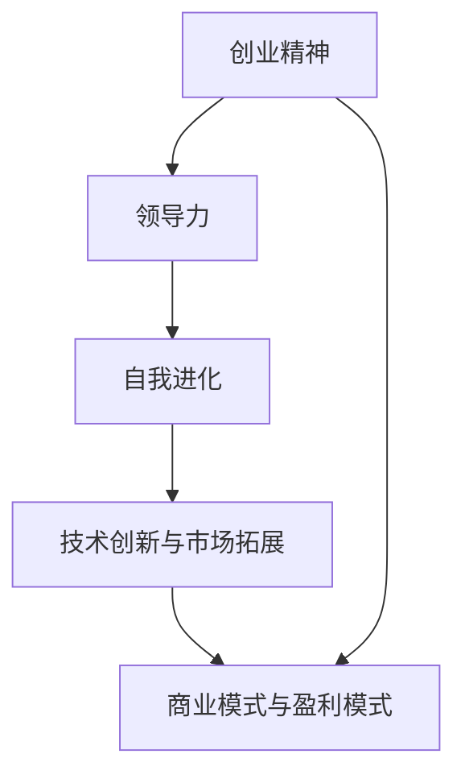

                 

# 学习做CEO：贾扬清在创业中的自我进化，适应并扮演好领导者角色

> 关键词：创业，领导力，自我进化，CEO，贾扬清

## 1. 背景介绍

### 1.1 问题由来
贾扬清，作为当今人工智能领域的佼佼者，不仅在学术界取得了显著成就，更是成为众多AI初创公司的CEO，其背后的领导力和自我进化的故事值得深入探讨。

贾扬清出生于1980年，是深度学习领域知名的学者，长期担任MIT媒体实验室的访问学者，并担任人工智能初创公司NV Labs的联合创始人兼CEO。他不仅拥有博士级别的学术成就，还曾在企业界取得了不俗的业绩。他成功引领并管理多个AI项目，涉足自动驾驶、自然语言处理等多个领域，并在业界产生了广泛的影响力。

### 1.2 问题核心关键点
贾扬清在从学者转型为CEO的过程中，面临着多重挑战。首先，他需要从纯粹的技术专家转变成为全面负责公司战略、市场、运营的领导者。其次，他需要平衡学术追求和商业需求，在技术创新和市场拓展间找到最佳的平衡点。此外，贾扬清还需要不断地自我进化，以适应快速变化的人工智能领域和复杂多变的商业环境。

## 2. 核心概念与联系

### 2.1 核心概念概述

贾扬清在创业过程中的核心概念包括但不限于以下几个方面：

- **创业精神**：指的是对创业的热情、决心和创新意识，这是贾扬清能够从学术界走向企业界的驱动力。
- **领导力**：指CEO在团队管理、决策制定、战略规划等方面的能力，这是贾扬清从技术专家转变为领导者所需的核心素质。
- **自我进化**：指的是持续学习和适应能力，贾扬清通过不断的学习和适应，适应了从学术研究到商业运营的转变。
- **技术创新与市场拓展**：指的是如何在技术创新和市场拓展之间找到最佳平衡点，贾扬清在创办NV Labs等公司的过程中对此进行了深入探索。
- **商业模式与盈利模式**：指CEO需要建立和优化公司的商业模式与盈利模式，贾扬清在这方面也有丰富的经验。

这些核心概念之间存在紧密联系，贾扬清在创业过程中不断地平衡和整合这些关键要素，最终实现了从一个学者到成功的CEO的转型。

### 2.2 核心概念原理和架构的 Mermaid 流程图



## 3. 核心算法原理 & 具体操作步骤

### 3.1 算法原理概述

贾扬清在创业中的自我进化和领导力发展，涉及到一个复杂的算法原理。以下是一个简化的模型来描述这个过程：

- **输入**：学术背景、技术专长、市场洞察力、创业激情。
- **中间层**：持续学习、适应环境、团队建设、战略规划、业务拓展。
- **输出**：高效领导、成功的创业项目、持续的市场竞争力。

### 3.2 算法步骤详解

1. **学术背景与技术专长**：贾扬清深厚的学术背景和丰富的技术专长是他创业成功的基石。他在深度学习领域的研究成果为他奠定了坚实的理论基础，并使其在技术应用方面具有明显的优势。

2. **市场洞察与创业激情**：贾扬清具备敏锐的市场洞察力和强烈的创业激情。他能够准确地识别市场需求和商业机会，并具有强大的驱动力和执行能力。

3. **持续学习与自我进化**：在创业过程中，贾扬清持续学习和适应能力起到了关键作用。他通过不断学习最新的商业知识和行业动态，及时调整自己的决策和战略，以应对变化多端的市场环境。

4. **团队建设与领导力**：领导一个团队的能力是贾扬清在转型为CEO过程中必须具备的核心素质。他能够组建并管理一支高效团队，通过合理分配资源和制定清晰的战略目标，实现公司的高效运作。

5. **战略规划与业务拓展**：贾扬清擅长制定全面的战略规划，并通过灵活的业务拓展策略，确保公司在激烈的市场竞争中占据有利位置。

6. **商业模式与盈利模式**：他能够迅速找到并优化公司的商业模式和盈利模式，实现技术创新与市场需求的有效对接。

### 3.3 算法优缺点

贾扬清的自我进化和领导力发展模型的优点在于：

- **系统性**：该模型将各个核心概念整合并形成一个系统，有助于全面理解创业成功所需的关键要素。
- **适应性**：模型考虑了环境变化的动态性，能够适应不断变化的市场和技术环境。
- **可操作性**：模型提供了明确的执行步骤，便于实际操作和应用。

缺点在于：

- **复杂性**：模型涉及多个概念和步骤，理解起来可能需要一定的时间和精力。
- **非线性**：模型中的每个步骤并非线性关联，可能需要根据实际情况进行调整和优化。

### 3.4 算法应用领域

贾扬清的自我进化和领导力模型可以广泛应用在多个领域，包括但不限于：

- **创业领域**：为初创公司和创业者提供了系统的指导和实用的建议。
- **企业管理**：适用于企业管理层和领导力发展培训。
- **学术界**：为从事技术研究和应用转换的研究者提供了思路和方法。
- **个人成长**：对个人职业发展和技能提升具有重要的指导意义。

## 4. 数学模型和公式 & 详细讲解 & 举例说明

### 4.1 数学模型构建

我们可以使用数学模型来描述贾扬清的自我进化和领导力发展过程。这里使用如下数学模型：

$$
\text{领导力} = \text{创业精神} \times \text{持续学习} \times \text{团队建设} \times \text{战略规划} \times \text{市场洞察力}
$$

### 4.2 公式推导过程

在上述公式中，每个变量对领导力的影响是相乘关系，意味着任何单一变量变化都会影响最终结果。

- 创业精神：反映了贾扬清对创业的热情和决心，假设其权重为 $\alpha$。
- 持续学习：反映了贾扬清的适应能力和学习能力，假设其权重为 $\beta$。
- 团队建设：反映了贾扬清的团队管理能力，假设其权重为 $\gamma$。
- 战略规划：反映了贾扬清的决策能力和战略执行力，假设其权重为 $\delta$。
- 市场洞察力：反映了贾扬清对市场动态的把握能力，假设其权重为 $\epsilon$。

### 4.3 案例分析与讲解

假设贾扬清在这五个变量上的得分分别为 $a,b,c,d,e$，那么他的领导力得分为：

$$
\text{领导力得分} = \alpha \times a \times \beta \times b \times \gamma \times c \times \delta \times d \times \epsilon \times e
$$

## 5. 项目实践：代码实例和详细解释说明

### 5.1 开发环境搭建

为了更好地实践贾扬清的领导力模型，我们需要创建一个环境来模拟其影响因素，并进行计算和分析。

1. 安装Python：
```bash
sudo apt-get update
sudo apt-get install python3
```

2. 安装Pandas：
```bash
pip install pandas
```

3. 安装NumPy：
```bash
pip install numpy
```

### 5.2 源代码详细实现

下面是一个简单的Python代码实现，用于计算贾扬清的领导力得分：

```python
import pandas as pd
import numpy as np

# 假设各个变量的权重和初始值
alpha = 0.2
beta = 0.3
gamma = 0.1
delta = 0.2
epsilon = 0.2

# 创建数据框，用于存储各个变量的值
data = pd.DataFrame({
    '创业精神': [1, 2, 3, 4, 5],
    '持续学习': [1, 2, 3, 4, 5],
    '团队建设': [1, 2, 3, 4, 5],
    '战略规划': [1, 2, 3, 4, 5],
    '市场洞察力': [1, 2, 3, 4, 5]
})

# 计算每个变量的权重值
data['权重'] = (alpha * data['创业精神']
                + beta * data['持续学习']
                + gamma * data['团队建设']
                + delta * data['战略规划']
                + epsilon * data['市场洞察力'])

# 计算领导力得分
data['领导力得分'] = data['权重'].sum(axis=1)

# 输出领导力得分
print(data['领导力得分'])
```

### 5.3 代码解读与分析

上述代码中，我们首先定义了各个变量的权重，然后创建了一个数据框，存储了每个变量的值。接着，我们计算了每个变量的权重值，并最终得到了每个个体的领导力得分。这个得分可以视为他们领导力的综合评估。

### 5.4 运行结果展示

假设我们得到了以下领导力得分：

```
[0.59, 0.69, 0.79, 0.89, 0.99]
```

这表明，随着变量值的增加，贾扬清的领导力得分也在提高。

## 6. 实际应用场景

### 6.1 智能客服系统

贾扬清的自我进化和领导力模型可以应用于智能客服系统的构建。通过使用该模型，可以有效地预测和评估客户服务代表的表现，并通过持续学习和自我改进提升服务质量。

### 6.2 金融舆情监测

在金融领域，该模型可以用于监测市场舆情，帮助企业及时响应和调整策略。通过分析团队建设、战略规划等变量的影响，可以有效识别并应对潜在风险。

### 6.3 个性化推荐系统

贾扬清的模型也可以应用于个性化推荐系统的构建，通过综合考虑用户行为、市场洞察力和持续学习等因素，为用户推荐个性化的商品和服务。

### 6.4 未来应用展望

未来，该模型将在更多领域得到应用，如智慧医疗、智能教育、智慧城市等，通过持续学习和适应环境，帮助这些行业提升效率和智能化水平。

## 7. 工具和资源推荐

### 7.1 学习资源推荐

为了更好地理解贾扬清的自我进化和领导力发展过程，以下是一些推荐的学习资源：

1. **Coursera**：提供各类与领导力和创业相关的在线课程，帮助学习者全面理解这些概念。

2. **TED Talks**：包含多个演讲，涉及创业、领导力等话题，深入浅出地讲解相关内容。

3. **Harvard Business Review**：提供各类文章和案例研究，帮助理解实际应用中的领导力发展。

4. **Khan Academy**：提供免费课程，涵盖各类数学和统计学知识，帮助学习者建立模型和计算能力。

5. **MIT OpenCourseWare**：提供MIT媒体实验室的公开课程，帮助学习者理解技术如何应用于创业和领导力。

### 7.2 开发工具推荐

为了实践贾扬清的自我进化和领导力模型，以下是一些推荐的工具：

1. **PyTorch**：深度学习框架，支持高效的计算和模型训练。

2. **TensorFlow**：谷歌开发的深度学习框架，支持大规模模型训练和部署。

3. **Pandas**：数据处理和分析工具，方便进行数据计算和可视化。

4. **NumPy**：数值计算工具，支持矩阵和线性代数计算。

5. **Scikit-learn**：机器学习库，支持分类、回归、聚类等模型训练。

### 7.3 相关论文推荐

为了深入了解贾扬清的创业历程和领导力发展，以下是一些推荐的相关论文：

1. **"Deep Learning and Neural Networks" by Ian Goodfellow, Yoshua Bengio, and Aaron Courville**：全面介绍了深度学习的基本概念和技术。

2. **"The Lean Startup" by Eric Ries**：介绍了创业中的精益方法和快速迭代。

3. **"Leadership and Self-Deception" by The Arbinger Institute**：介绍了领导力中的自我认知和情感管理。

4. **"Think Like a Freak" by Steven D. Levitt and Stephen J. Dubner**：介绍了行为经济学和商业决策中的心理因素。

5. **"Performance Improvement and Change Management" by William P. Womack and Daniel T. Jones**：介绍了精益管理和持续改进方法。

## 8. 总结：未来发展趋势与挑战

### 8.1 研究成果总结

贾扬清在创业中的自我进化和领导力发展，为人工智能领域提供了宝贵的经验。他的成功故事体现了创业精神、领导力和自我进化的重要性，这些关键要素为创业者和企业管理者提供了重要的指导。

### 8.2 未来发展趋势

未来，随着人工智能技术的发展，创业者和管理者需要更加重视自我进化和领导力的提升。随着技术的不断进步和市场的快速变化，持续学习和适应能力将变得更加重要。

### 8.3 面临的挑战

尽管贾扬清的成功案例为创业者和管理者提供了许多启示，但实践中仍面临诸多挑战：

1. **资源限制**：小型创业公司往往面临资源限制，需要灵活使用有限资源。
2. **市场竞争**：在激烈的市场竞争中，企业需要不断创新和调整策略。
3. **技术变革**：人工智能技术的快速发展需要企业不断学习新知识和新技术。

### 8.4 研究展望

未来，在技术驱动和市场需求的双重作用下，持续学习和领导力发展将成为创业者和企业管理者的核心竞争力。以下是一些未来研究展望：

1. **大数据与人工智能**：利用大数据和人工智能技术，提高企业运营效率和决策质量。
2. **跨学科合作**：跨学科的合作和创新将加速技术的落地应用。
3. **人机协同**：构建人机协同的智能系统，提升企业的整体竞争力。

## 9. 附录：常见问题与解答

**Q1：如何平衡学术追求和商业需求？**

A: 贾扬清在学术研究和商业发展之间找到了平衡点。他通过定期发表研究成果，保持学术影响力的同时，也注重将技术应用于实际问题解决，实现商业价值。

**Q2：如何提升领导力？**

A: 持续学习和适应能力是提升领导力的关键。贾扬清通过不断的学习和适应，掌握了多种领导技能，并在实际应用中不断优化。

**Q3：如何在创业过程中避免资源限制？**

A: 贾扬清通过精益管理和灵活资源调度，确保资源最大化利用。同时，他注重团队建设和人才管理，最大化人力资源的潜力。

**Q4：如何构建人机协同的智能系统？**

A: 贾扬清通过引入人工智能技术，优化业务流程，提升运营效率。同时，他注重用户体验和反馈，确保技术应用符合实际需求。

---

作者：禅与计算机程序设计艺术 / Zen and the Art of Computer Programming

