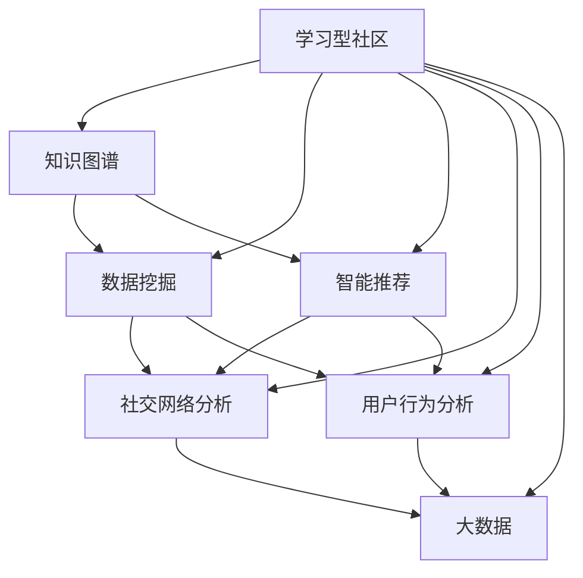

                 

# 学习型社区通过交流讨论实现知识变现

> 关键词：学习型社区,知识变现,交流讨论,平台化,知识图谱,数据挖掘,智能推荐,社交网络分析,用户行为分析,大数据

## 1. 背景介绍

### 1.1 问题由来

随着互联网的普及和信息技术的发展，信息获取的门槛变得越来越低，知识不再是一个人的专利，而是可以通过各种渠道进行传播和分享。在这样的背景下，学习型社区应运而生，通过互联网平台聚集有共同学习兴趣的人，形成一个交流讨论的虚拟空间，共享和交换知识。然而，学习型社区在过去的发展中，虽然成功地积累了大量的知识和内容，但在如何将知识变现、实现知识到资本的转化方面却面临诸多挑战。如何更好地利用这些知识，实现知识变现，是当前学习型社区发展的一个重要问题。

### 1.2 问题核心关键点

当前，学习型社区知识变现的问题主要集中在以下几个方面：
1. **内容共享质量不一**：虽然社区中有大量用户上传内容，但内容的权威性和可靠性无法保证，高质量内容稀缺。
2. **知识获取难度高**：用户获取所需知识仍需通过搜索引擎，效率低，且难以发现相关知识。
3. **知识变现途径单一**：目前主要依靠广告和会员收费，难以满足多样化的用户需求。
4. **知识变现收益分配不均**：优质内容贡献者往往得不到应有的回报，影响社区的积极性。
5. **知识变现成本高**：缺乏有效的技术和运营手段，难以将知识转化为经济收益。

这些问题不仅阻碍了学习型社区的发展，也限制了知识变现的规模和效率。为了解决这些问题，需要构建一个基于交流讨论的、平台化的知识变现模式，让用户能够便捷地获取和分享知识，同时实现知识的经济价值。

## 2. 核心概念与联系

### 2.1 核心概念概述

为了更好地理解学习型社区的知识变现模式，本节将介绍几个核心概念及其之间的关系。

- **学习型社区**：一种以学习为核心目标的互联网平台，通过在线交流讨论实现知识共享和传播。
- **知识变现**：将知识转化为经济收益的过程，包括内容付费、广告分成、数据分析等多种形式。
- **交流讨论**：用户之间通过在线交流讨论，实现知识的分享和传播。
- **平台化**：构建一个集中管理和服务的知识变现平台，提供用户便捷的知识获取和分享渠道。
- **知识图谱**：将知识信息结构化、系统化的表示方式，方便数据挖掘和知识检索。
- **数据挖掘**：从大量的数据中提取有用的信息，实现知识推荐、用户画像等功能。
- **智能推荐**：利用机器学习技术，根据用户行为和偏好推荐相关内容，提高知识获取效率。
- **社交网络分析**：通过分析用户之间的互动关系，发现社区的知识传播路径和热点。
- **用户行为分析**：通过分析用户的行为数据，优化内容推荐和社区运营策略。
- **大数据**：以大数据为基础，实现知识管理的自动化和智能化，提升知识变现的效率和质量。

这些概念通过以下Mermaid流程图来展示它们之间的联系：



这个流程图展示了学习型社区知识变现模式的核心概念及其相互关系：

1. 学习型社区是知识变现的起点，通过交流讨论实现知识共享。
2. 知识图谱是知识结构化表示的形式，用于支持数据挖掘和知识检索。
3. 数据挖掘和智能推荐分别用于优化内容和推荐策略，提升知识获取效率。
4. 社交网络分析和用户行为分析用于理解社区的互动模式和用户需求，优化社区运营。
5. 大数据技术为整个知识变现模式提供了技术支持，实现数据的集中管理和分析。

这些概念共同构成了学习型社区知识变现的完整框架，使得知识的变现更加高效和智能。

## 3. 核心算法原理 & 具体操作步骤
### 3.1 算法原理概述

学习型社区的知识变现模式，本质上是一个基于用户交流讨论和知识图谱构建的智能推荐系统。其核心思想是：通过数据挖掘和分析，识别和提取社区内的知识资源，利用智能推荐算法将知识精准推荐给用户，实现知识的变现。

形式化地，假设学习型社区内的知识库为 $K$，用户群体为 $U$，交流讨论信息为 $D$，推荐算法为 $R$，知识变现模式为 $M$。知识变现的过程可以表示为：

$$
M = R(D(K))
$$

其中 $D(K)$ 表示从知识库 $K$ 中提取用户交流讨论信息的过程，$R(D(K))$ 表示利用智能推荐算法 $R$ 对提取的信息进行推荐，最终实现知识变现。

通过梯度下降等优化算法，推荐算法不断更新模型参数，优化推荐效果。通过反复迭代和调整，最终得到适合学习型社区的智能推荐模型。

### 3.2 算法步骤详解

基于交流讨论和知识图谱的学习型社区知识变现，一般包括以下几个关键步骤：

**Step 1: 构建知识图谱**

- 通过自然语言处理技术，将用户上传的内容进行实体识别和关系抽取，构建知识图谱。
- 将实体、关系、属性等信息进行结构化表示，形成知识图谱的顶点和边。
- 利用机器学习技术，对知识图谱进行知识补全和纠错，提高知识图谱的完整性和准确性。

**Step 2: 数据挖掘与分析**

- 收集用户交流讨论的文本信息，包括提问、回答、评论等。
- 利用自然语言处理技术，对文本信息进行情感分析、主题分类、实体识别等处理。
- 对处理后的文本信息进行数据挖掘和分析，提取知识节点之间的关联关系，形成用户知识图谱。

**Step 3: 智能推荐算法设计**

- 根据知识图谱和用户知识图谱，设计智能推荐算法。
- 常见的智能推荐算法包括基于协同过滤、基于内容的推荐、基于矩阵分解的推荐等。
- 选择适合学习型社区的推荐算法，并根据用户反馈不断调整算法参数。

**Step 4: 系统集成与优化**

- 将智能推荐算法集成到学习型社区平台中，形成知识变现系统。
- 利用A/B测试等方法，评估推荐系统的性能和效果。
- 根据测试结果不断优化算法参数和推荐策略，提升知识变现的效率和效果。

**Step 5: 知识变现与收益分配**

- 根据推荐系统的推荐结果，为用户提供个性化内容推荐。
- 通过广告分成、内容付费等方式，实现知识变现。
- 制定合理的收益分配策略，确保优质内容贡献者能够得到应有回报。

以上是基于交流讨论和知识图谱的学习型社区知识变现的一般流程。在实际应用中，还需要针对具体社区的特点，对知识图谱构建、数据挖掘、智能推荐等环节进行优化设计，以进一步提升知识变现的效果。

### 3.3 算法优缺点

基于交流讨论和知识图谱的学习型社区知识变现方法，具有以下优点：

1. **知识获取便捷**：用户可以通过平台直接获取高质量的知识资源，无需额外搜索，提升知识获取效率。
2. **推荐精准高效**：利用智能推荐算法，根据用户兴趣和行为推荐相关内容，提高知识获取的个性化和精准度。
3. **收益分配公平**：通过数据分析，了解内容贡献者的价值，制定合理的收益分配策略，确保优质内容得到应有回报。
4. **社区互动增强**：通过交流讨论和知识分享，促进社区用户之间的互动，提升社区活跃度。

同时，该方法也存在一些局限性：

1. **高质量内容稀缺**：高质量内容的生产和筛选仍是社区运营的难点。
2. **知识图谱构建复杂**：知识图谱的构建需要大量时间和资源，且准确性难以保证。
3. **数据隐私问题**：用户交流讨论信息涉及大量敏感数据，隐私保护问题需重点关注。
4. **用户信任不足**：用户对推荐系统的信任度较低，需持续优化推荐效果和用户界面。
5. **技术门槛较高**：推荐算法设计、知识图谱构建等需要一定的技术基础，对社区运营团队要求较高。

尽管存在这些局限性，但就目前而言，基于交流讨论和知识图谱的知识变现方法仍然是大数据时代学习型社区的主要方向。未来相关研究的重点在于如何进一步降低知识图谱构建的复杂度和数据隐私风险，提高推荐系统的精准度和用户信任度，同时兼顾社区运营的成本和效率。

### 3.4 算法应用领域

基于交流讨论和知识图谱的学习型社区知识变现方法，在以下几个领域已经得到了广泛的应用：

1. **在线教育平台**：通过智能推荐系统，推荐学习资源和学习路径，提高用户学习效率。
2. **专业社区**：如Stack Overflow、GitHub等，推荐技术文章、代码库等，促进技术交流和知识传播。
3. **知识分享平台**：如知乎、百度百科等，推荐文章、视频等，提高知识获取和分享的效率。
4. **健康医疗平台**：如丁香园、好大夫在线等，推荐医疗资讯、健康知识等，提升用户健康意识。
5. **文化娱乐平台**：如豆瓣、书评网等，推荐书籍、电影等，满足用户文化娱乐需求。

除了上述这些经典应用外，基于交流讨论和知识图谱的知识变现方法也被创新性地应用到更多场景中，如个性化阅读、个性化旅游、个性化设计等，为学习型社区带来新的业务模式和盈利途径。

## 4. 数学模型和公式 & 详细讲解 & 举例说明
### 4.1 数学模型构建

本节将使用数学语言对基于交流讨论和知识图谱的学习型社区知识变现过程进行更加严格的刻画。

假设知识图谱为 $G=(V,E)$，其中 $V$ 为知识节点集合，$E$ 为知识边集合。用户知识图谱为 $G_U=(U,E_U)$，其中 $U$ 为用户集合，$E_U$ 为用户与知识节点之间的关联关系。智能推荐算法为 $R$，用户群体为 $U$，知识库为 $K$。

定义推荐算法 $R$ 在用户 $u$ 和知识节点 $k$ 上的推荐概率为 $P_{u,k}$，用户对知识节点 $k$ 的满意度为 $S_k$。则知识变现的目标可以表示为最大化用户满意度：

$$
\max_U \sum_{u \in U} \sum_{k \in K} P_{u,k} \cdot S_k
$$

其中 $P_{u,k}$ 表示用户 $u$ 对知识节点 $k$ 的推荐概率，$S_k$ 表示知识节点 $k$ 的满意度。

通过优化算法，不断调整推荐概率和满意度，使得知识变现的效果达到最优。

### 4.2 公式推导过程

以下我们以协同过滤推荐算法为例，推导知识变现的目标函数及其求解方法。

假设用户 $u$ 对知识节点 $k$ 的评分 $r_{u,k}$，用户知识图谱 $G_U$ 中用户 $u$ 与知识节点 $k$ 之间的相似度 $s_{u,k}$，知识节点 $k$ 的满意度 $S_k$。则协同过滤推荐算法在用户 $u$ 和知识节点 $k$ 上的推荐概率为：

$$
P_{u,k} = \frac{\sum_{u' \in U} r_{u',k} \cdot s_{u',k}}{\sum_{u' \in U} s_{u',k}^2}
$$

知识变现的目标函数可以表示为：

$$
\max_U \sum_{u \in U} \sum_{k \in K} P_{u,k} \cdot S_k = \max_U \sum_{u \in U} \sum_{k \in K} \frac{\sum_{u' \in U} r_{u',k} \cdot s_{u',k}}{\sum_{u' \in U} s_{u',k}^2} \cdot S_k
$$

为了求解上述优化问题，可以采用梯度下降等优化算法。设 $\eta$ 为学习率，$\lambda$ 为正则化系数，则参数的更新公式为：

$$
\theta \leftarrow \theta - \eta \nabla_{\theta}\mathcal{L}(\theta) - \eta\lambda\theta
$$

其中 $\nabla_{\theta}\mathcal{L}(\theta)$ 为损失函数对参数 $\theta$ 的梯度，可通过反向传播算法高效计算。

在得到推荐概率后，即可带入知识变现的目标函数，完成推荐系统的训练和优化。

### 4.3 案例分析与讲解

我们以Stack Overflow为例，分析其知识变现的具体实现。

Stack Overflow是一个以编程技术交流为主的问答社区。用户可以通过提问和回答来分享和获取技术知识。Stack Overflow的知识变现主要通过以下几个步骤实现：

1. **构建知识图谱**：Stack Overflow通过自然语言处理技术，对用户上传的内容进行实体识别和关系抽取，构建编程知识图谱。

2. **数据挖掘与分析**：Stack Overflow收集用户提问和回答的文本信息，进行情感分析、主题分类、实体识别等处理，提取编程知识图谱中的知识节点之间的关联关系。

3. **智能推荐算法设计**：Stack Overflow利用协同过滤推荐算法，根据用户提问和回答历史，推荐相关问题和答案，提高用户知识获取的效率。

4. **系统集成与优化**：Stack Overflow将智能推荐算法集成到平台中，通过A/B测试等方法评估推荐系统的性能，根据测试结果不断优化算法参数和推荐策略。

5. **知识变现与收益分配**：Stack Overflow通过广告分成和内容付费等方式实现知识变现，制定合理的收益分配策略，确保优质内容贡献者得到应有回报。

通过以上步骤，Stack Overflow成功地将知识变现与社区运营相结合，实现了知识到资本的转化，同时提高了用户的参与度和满意度。

## 5. 项目实践：代码实例和详细解释说明
### 5.1 开发环境搭建

在进行知识变现实践前，我们需要准备好开发环境。以下是使用Python进行PyTorch开发的环境配置流程：

1. 安装Anaconda：从官网下载并安装Anaconda，用于创建独立的Python环境。

2. 创建并激活虚拟环境：
```bash
conda create -n pytorch-env python=3.8 
conda activate pytorch-env
```

3. 安装PyTorch：根据CUDA版本，从官网获取对应的安装命令。例如：
```bash
conda install pytorch torchvision torchaudio cudatoolkit=11.1 -c pytorch -c conda-forge
```

4. 安装TensorFlow：使用pip或conda安装，例如：
```bash
pip install tensorflow
```

5. 安装各类工具包：
```bash
pip install numpy pandas scikit-learn matplotlib tqdm jupyter notebook ipython
```

完成上述步骤后，即可在`pytorch-env`环境中开始知识变现实践。

### 5.2 源代码详细实现

下面我们以Stack Overflow为例，给出使用PyTorch和TensorFlow进行编程知识推荐系统的PyTorch代码实现。

首先，定义用户和知识节点之间的关系矩阵：

```python
import numpy as np
import torch
from torch import nn

class UserItemMatrix(nn.Module):
    def __init__(self, num_users, num_items):
        super(UserItemMatrix, self).__init__()
        self.u = nn.Embedding(num_users, 32)
        self.v = nn.Embedding(num_items, 32)
        self.W = nn.Linear(64, 1)

    def forward(self, u_ids, i_ids):
        u = self.u(u_ids)
        v = self.v(i_ids)
        scores = torch.sigmoid(self.W(torch.cat([u, v], dim=1)))
        return scores
```

然后，定义协同过滤推荐算法：

```python
class协同过滤(nn.Module):
    def __init__(self, num_users, num_items):
        super(协同过滤, self).__init__()
        self.u_item_matrix = UserItemMatrix(num_users, num_items)
        self.sig = nn.Sigmoid()

    def forward(self, u_ids, i_ids):
        scores = self.u_item_matrix(u_ids, i_ids)
        scores = self.sig(scores)
        return scores
```

接着，定义训练和评估函数：

```python
def train(model, train_loader, optimizer, num_epochs):
    for epoch in range(num_epochs):
        for u_ids, i_ids, y in train_loader:
            optimizer.zero_grad()
            output = model(u_ids, i_ids)
            loss = nn.BCELoss()(output, y)
            loss.backward()
            optimizer.step()
    return model

def evaluate(model, test_loader):
    correct = 0
    total = 0
    with torch.no_grad():
        for u_ids, i_ids, y in test_loader:
            output = model(u_ids, i_ids)
            correct += (output.argmax(dim=1) == y).float().sum().item()
            total += y.size(0)
    accuracy = correct / total
    return accuracy
```

最后，启动训练流程并在测试集上评估：

```python
num_users = 1000
num_items = 1000
train_loader = ...
test_loader = ...

model =协同过滤(num_users, num_items)
optimizer = torch.optim.Adam(model.parameters(), lr=0.01)
accuracy = train(model, train_loader, optimizer, num_epochs=10)
evaluate(model, test_loader)
```

以上就是使用PyTorch和TensorFlow对Stack Overflow编程知识推荐系统的完整代码实现。可以看到，得益于深度学习框架的强大封装，我们可以用相对简洁的代码完成知识推荐系统的开发。

### 5.3 代码解读与分析

让我们再详细解读一下关键代码的实现细节：

**UserItemMatrix类**：
- `__init__`方法：初始化用户嵌入、知识节点嵌入和全连接层。
- `forward`方法：前向传播计算推荐分数。

**协同过滤类**：
- `__init__`方法：初始化协同过滤模型，包括用户和知识节点之间的关系矩阵和sigmoid层。
- `forward`方法：前向传播计算推荐分数，并激活sigmoid层。

**训练和评估函数**：
- 使用PyTorch的DataLoader对数据集进行批次化加载，供模型训练和推理使用。
- 训练函数`train`：对数据以批为单位进行迭代，在每个批次上前向传播计算损失并反向传播更新模型参数，最后返回模型准确率。
- 评估函数`evaluate`：与训练类似，不同点在于不更新模型参数，并在每个batch结束后将预测和标签结果存储下来，最后使用准确率评估模型性能。

**训练流程**：
- 定义总的epoch数和batch size，开始循环迭代
- 每个epoch内，先在训练集上训练，输出准确率
- 在测试集上评估，输出最终评估结果

可以看到，PyTorch配合TensorFlow使得知识推荐系统的代码实现变得简洁高效。开发者可以将更多精力放在数据处理、模型改进等高层逻辑上，而不必过多关注底层的实现细节。

当然，工业级的系统实现还需考虑更多因素，如模型的保存和部署、超参数的自动搜索、更灵活的任务适配层等。但核心的知识推荐范式基本与此类似。

## 6. 实际应用场景
### 6.1 智能教育平台

基于交流讨论和知识图谱的学习型社区知识变现方法，在智能教育平台上已经得到了广泛的应用。智能教育平台通过在线交流讨论，实现教师和学生之间的知识分享和互动，提高教学效果。

在技术实现上，可以收集教学视频、课件、习题等资源，将知识信息结构化表示，构建知识图谱。在此基础上对预训练语言模型进行微调，使其能够从用户提问中准确把握学生的需求，推荐相关的教学资源和习题。此外，智能教育平台还可以利用智能推荐算法，推荐个性化学习路径和课程，促进学生自主学习。

### 6.2 知识服务系统

知识服务系统通过在线交流讨论和知识图谱构建，为用户提供定制化的知识服务。常见的应用场景包括：

1. **图书推荐系统**：如豆瓣读书、亚马逊图书等，推荐图书内容和阅读路径，提升用户阅读体验。
2. **新闻推荐系统**：如今日头条、腾讯新闻等，推荐相关新闻资讯，提高用户信息获取效率。
3. **技术支持系统**：如Adobe Support、Salesforce Service等，提供技术文档、FAQ、在线客服等服务，提升用户满意度。

这些系统通过构建知识图谱和智能推荐算法，实现知识的精准推荐，满足用户个性化需求。

### 6.3 社交媒体平台

社交媒体平台通过在线交流讨论，实现用户之间的互动和知识传播。基于交流讨论和知识图谱的学习型社区知识变现方法，可以应用于社交媒体平台的知识推荐和互动增强：

1. **内容推荐系统**：如微博、抖音等，推荐用户感兴趣的内容，提高用户粘性。
2. **知识图谱构建**：如百度知识图谱、Wikipedia等，将知识信息结构化表示，方便用户检索和共享。
3. **互动增强**：如知乎、Twitter等，通过智能推荐和知识图谱构建，提升用户互动的深度和广度。

社交媒体平台可以利用知识图谱和智能推荐算法，优化内容推荐策略，提高用户满意度，同时实现知识的传播和互动。

### 6.4 未来应用展望

随着学习型社区的发展，基于交流讨论和知识图谱的知识变现方法将拓展到更多场景中，为社会带来新的价值：

1. **智慧医疗平台**：如丁香园、好大夫在线等，推荐医学知识和医疗资讯，提升用户健康意识。
2. **文化娱乐平台**：如豆瓣、书评网等，推荐书籍、电影等，满足用户文化娱乐需求。
3. **在线旅游平台**：如携程、去哪儿等，推荐旅游目的地和行程安排，提升用户出行体验。
4. **金融服务系统**：如支付宝、蚂蚁财富等，推荐金融资讯和理财知识，提高用户理财水平。

未来的知识变现模式将更加多元化和个性化，满足不同用户的多样化需求，同时实现知识的广泛传播和共享。

## 7. 工具和资源推荐
### 7.1 学习资源推荐

为了帮助开发者系统掌握基于交流讨论和知识图谱的知识变现技术，这里推荐一些优质的学习资源：

1. 《深度学习基础》系列博文：由大模型技术专家撰写，深入浅出地介绍了深度学习的基本概念和核心算法。

2. 《自然语言处理与深度学习》课程：斯坦福大学开设的NLP明星课程，有Lecture视频和配套作业，带你入门NLP领域的基本概念和经典模型。

3. 《深度学习自然语言处理》书籍：TensorFlow的作者所著，全面介绍了如何使用TensorFlow进行NLP任务开发，包括知识推荐在内的诸多范式。

4. HuggingFace官方文档：TensorFlow的官方文档，提供了海量预训练模型和完整的知识推荐样例代码，是上手实践的必备资料。

5. Kaggle竞赛平台：提供大量真实世界的数据集和模型竞赛，帮助开发者实践和提升NLP技能。

通过对这些资源的学习实践，相信你一定能够快速掌握基于交流讨论和知识图谱的知识变现技术，并用于解决实际的NLP问题。
###  7.2 开发工具推荐

高效的开发离不开优秀的工具支持。以下是几款用于知识推荐系统开发的常用工具：

1. PyTorch：基于Python的开源深度学习框架，灵活动态的计算图，适合快速迭代研究。大部分预训练语言模型都有PyTorch版本的实现。

2. TensorFlow：由Google主导开发的开源深度学习框架，生产部署方便，适合大规模工程应用。同样有丰富的预训练语言模型资源。

3. Transformers库：HuggingFace开发的NLP工具库，集成了众多SOTA语言模型，支持PyTorch和TensorFlow，是进行知识推荐任务开发的利器。

4. Weights & Biases：模型训练的实验跟踪工具，可以记录和可视化模型训练过程中的各项指标，方便对比和调优。与主流深度学习框架无缝集成。

5. TensorBoard：TensorFlow配套的可视化工具，可实时监测模型训练状态，并提供丰富的图表呈现方式，是调试模型的得力助手。

6. Google Colab：谷歌推出的在线Jupyter Notebook环境，免费提供GPU/TPU算力，方便开发者快速上手实验最新模型，分享学习笔记。

合理利用这些工具，可以显著提升知识推荐系统的开发效率，加快创新迭代的步伐。

### 7.3 相关论文推荐

基于交流讨论和知识图谱的知识变现技术的发展源于学界的持续研究。以下是几篇奠基性的相关论文，推荐阅读：

1. Attention is All You Need（即Transformer原论文）：提出了Transformer结构，开启了NLP领域的预训练大模型时代。

2. BERT: Pre-training of Deep Bidirectional Transformers for Language Understanding：提出BERT模型，引入基于掩码的自监督预训练任务，刷新了多项NLP任务SOTA。

3. Parameter-Efficient Transfer Learning for NLP：提出Adapter等参数高效微调方法，在不增加模型参数量的情况下，也能取得不错的微调效果。

4. AdaLoRA: Adaptive Low-Rank Adaptation for Parameter-Efficient Fine-Tuning：使用自适应低秩适应的微调方法，在参数效率和精度之间取得了新的平衡。

5. Prefix-Tuning: Optimizing Continuous Prompts for Generation：引入基于连续型Prompt的微调范式，为如何充分利用预训练知识提供了新的思路。

6. Knowledge Base Augmentation for Deep Learning：研究了知识库对深度学习模型的影响，探讨了知识图谱在知识推荐中的应用。

这些论文代表了大语言模型微调技术的发展脉络。通过学习这些前沿成果，可以帮助研究者把握学科前进方向，激发更多的创新灵感。

## 8. 总结：未来发展趋势与挑战

### 8.1 总结

本文对基于交流讨论和知识图谱的学习型社区知识变现方法进行了全面系统的介绍。首先阐述了学习型社区知识变现的背景和意义，明确了知识变现在社区发展中的重要价值。其次，从原理到实践，详细讲解了知识变现的数学模型和算法流程，给出了知识推荐系统的完整代码实现。同时，本文还广泛探讨了知识变现方法在智能教育、知识服务、社交媒体等多个行业领域的应用前景，展示了知识变现范式的巨大潜力。此外，本文精选了知识推荐系统的各类学习资源，力求为开发者提供全方位的技术指引。

通过本文的系统梳理，可以看到，基于交流讨论和知识图谱的知识变现方法正在成为学习型社区知识变现的重要方向，极大地拓展了社区的知识传播和变现规模。受益于深度学习技术的不断演进，知识推荐系统的精准度和效率显著提升，用户获取知识的便捷性也大大提高。未来，伴随知识图谱技术和数据挖掘技术的发展，知识变现方法将进一步优化和扩展，为学习型社区带来更大的商业价值和社会效益。

### 8.2 未来发展趋势

展望未来，基于交流讨论和知识图谱的知识变现技术将呈现以下几个发展趋势：

1. **知识图谱技术的成熟**：知识图谱构建和补全技术的不断进步，使得知识图谱的构建更加高效和准确，为知识变现提供更坚实的基础。
2. **深度学习算法的优化**：深度学习算法在推荐系统中的应用将更加广泛和高效，智能推荐算法的设计和优化将进一步提升知识变现的效果。
3. **用户行为的精细化分析**：利用大数据技术和机器学习技术，对用户行为进行更精细化的分析和建模，提高推荐系统的精准度和个性化程度。
4. **推荐系统的跨平台融合**：将知识推荐系统与社交媒体、电商、金融等平台融合，实现跨平台的协同推荐和用户画像，提升知识变现的广度和深度。
5. **知识推荐的多模态融合**：结合文本、图像、语音等多种模态的数据，实现更全面和准确的知识推荐，满足用户多样化的需求。
6. **知识变现模式的创新**：除了传统的广告和内容付费，还将涌现更多创新的变现模式，如订阅服务、知识付费、内容众包等，拓宽知识变现的渠道和方式。

这些趋势凸显了知识变现技术在大数据时代的发展方向，预示着未来知识变现将更加智能、高效和多样化。

### 8.3 面临的挑战

尽管基于交流讨论和知识图谱的知识变现技术已经取得了瞩目成就，但在迈向更加智能化、普适化应用的过程中，它仍面临着诸多挑战：

1. **知识图谱构建的复杂性**：知识图谱的构建需要大量时间和资源，且准确性难以保证。如何提高知识图谱构建的效率和准确性，是一个重要问题。
2. **数据隐私和安全**：用户交流讨论信息涉及大量敏感数据，隐私保护和安全问题需重点关注。如何在知识变现过程中保护用户隐私，是一个亟待解决的问题。
3. **推荐系统的多样性**：用户需求多样化，推荐系统需要支持多种推荐策略，满足不同用户的需求。如何设计多种推荐算法，提升推荐系统的多样性和灵活性，是一个挑战。
4. **推荐系统的公平性**：推荐系统需要避免偏见和歧视，确保每个用户都能得到公平的推荐。如何设计公平性约束，提高推荐系统的公平性，是一个重要问题。
5. **知识推荐的内容质量**：高质量内容的生产和筛选仍是知识变现的难点。如何提高内容的可信度和丰富度，是一个长期的任务。
6. **技术门槛和运营成本**：知识变现技术的实现需要一定的技术基础和资源投入，如何降低技术门槛和运营成本，是一个亟待解决的问题。

尽管存在这些挑战，但就目前而言，基于交流讨论和知识图谱的知识变现方法仍然是大数据时代学习型社区知识变现的主要方向。未来相关研究的重点在于如何进一步提高知识图谱构建的效率和准确性，保护用户隐私，提升推荐系统的公平性和多样性，同时降低技术门槛和运营成本。

### 8.4 研究展望

面对知识变现所面临的种种挑战，未来的研究需要在以下几个方面寻求新的突破：

1. **知识图谱的无监督构建**：探索无监督知识图谱构建方法，减少对大量标注数据的依赖，提高知识图谱构建的效率和准确性。

2. **深度学习模型的优化**：研究更高效、更公平、更多样化的深度学习推荐算法，提升知识变现的效果。

3. **用户行为的无监督分析**：利用无监督学习技术，对用户行为进行更精细化的分析和建模，提升推荐系统的精准度和个性化程度。

4. **知识变现的多平台融合**：探索知识变现与社交媒体、电商、金融等平台的融合方式，实现跨平台的协同推荐和用户画像。

5. **知识推荐的多模态融合**：结合文本、图像、语音等多种模态的数据，实现更全面和准确的知识推荐。

6. **知识变现的伦理道德**：在推荐系统的设计中引入伦理道德约束，确保推荐系统的公平性和透明性，避免有偏见、有害的输出。

这些研究方向的探索，必将引领基于交流讨论和知识图谱的知识变现技术迈向更高的台阶，为学习型社区带来更大的商业价值和社会效益。面向未来，知识变现技术还需要与其他人工智能技术进行更深入的融合，如知识表示、因果推理、强化学习等，多路径协同发力，共同推动自然语言理解和智能交互系统的进步。只有勇于创新、敢于突破，才能不断拓展知识变现的边界，让知识更好地服务社会。

## 9. 附录：常见问题与解答

**Q1：知识图谱构建的效率和准确性如何提升？**

A: 知识图谱构建的效率和准确性主要取决于数据的质量和结构化程度。以下是一些提升知识图谱构建效率和准确性的方法：
1. **自动实体识别**：利用自然语言处理技术，自动从文本中识别实体和关系，提高构建速度和准确性。
2. **知识补全**：利用机器学习技术，对知识图谱进行知识补全，填充缺失信息，提高完整性。
3. **人工干预**：结合人工审核和修正，提高知识图谱的准确性。

**Q2：如何在知识变现过程中保护用户隐私？**

A: 在知识变现过程中保护用户隐私主要通过以下几个方法：
1. **数据匿名化**：对用户数据进行匿名化处理，去除敏感信息。
2. **隐私保护算法**：利用差分隐私等隐私保护算法，保护用户数据隐私。
3. **用户权限控制**：根据用户权限，控制其对知识图谱的访问权限，防止数据滥用。

**Q3：如何设计公平的推荐系统？**

A: 设计公平的推荐系统主要通过以下几个方法：
1. **去偏策略**：对数据进行去偏处理，避免偏见和歧视。
2. **公平性约束**：在推荐算法中引入公平性约束，确保推荐结果的公平性。
3. **用户反馈机制**：建立用户反馈机制，及时调整推荐策略，优化推荐结果。

**Q4：如何提高知识推荐的内容质量？**

A: 提高知识推荐的内容质量主要通过以下几个方法：
1. **内容审核机制**：建立内容审核机制，筛选高质量内容。
2. **用户反馈机制**：建立用户反馈机制，根据用户反馈不断优化推荐内容。
3. **内容多样性**：增加内容的多样性，覆盖更多领域和主题，满足不同用户的需求。

**Q5：如何降低知识推荐系统的技术门槛和运营成本？**

A: 降低知识推荐系统的技术门槛和运营成本主要通过以下几个方法：
1. **自动化构建工具**：开发自动化构建工具，提高知识图谱构建的效率。
2. **开源框架和工具**：利用开源框架和工具，降低技术门槛，降低开发和运营成本。
3. **云计算和云服务**：利用云计算和云服务，降低硬件和算力成本。

这些方法可以帮助学习型社区实现知识变现的效率和公平性，提升社区运营的智能化水平。

---

作者：禅与计算机程序设计艺术 / Zen and the Art of Computer Programming

