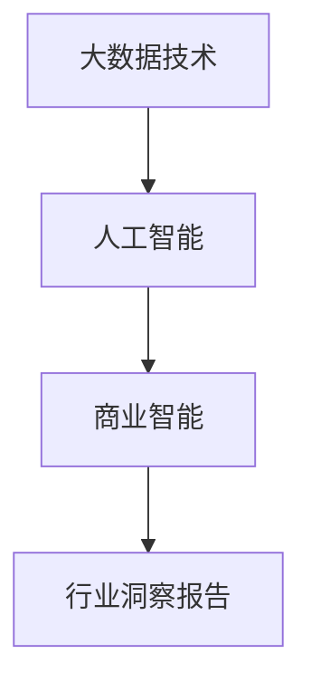

                 

# 定期发布行业洞察报告：展示你的专业度

> 关键词：行业洞察, 数据分析, 数据科学, 大数据, 人工智能, 商业智能, 市场趋势

## 1. 背景介绍

在当今快速变化的市场环境中，企业要想保持竞争优势，就必须能够及时、准确地获取和分析行业数据。定期发布行业洞察报告，不仅能够帮助企业了解市场动态，还能展示其数据分析能力，增强市场信心。因此，本文将深入探讨如何通过技术手段，特别是人工智能和大数据技术，高效、准确地生成行业洞察报告。

### 1.1 行业洞察报告的重要性

行业洞察报告通常包含对行业趋势、市场变化、竞争态势、技术进步等方面的分析。它是企业决策过程中的重要参考，帮助企业预见未来，制定战略，抢占市场先机。通过行业洞察报告，企业能够：

1. **识别机会**：发现新市场、新需求和新客户群体，抓住商业机会。
2. **优化决策**：基于数据分析进行更科学的决策，避免决策失误。
3. **提升竞争力**：及时调整产品和服务，保持市场领先地位。
4. **提升透明度**：向股东和公众展示公司的市场洞察力和战略规划，提升品牌形象。

### 1.2 行业洞察的挑战

尽管行业洞察报告对于企业至关重要，但在实际操作中，也面临诸多挑战，主要包括：

1. **数据获取困难**：高质量、完整的数据源获取难度大，尤其是非公开数据。
2. **数据处理复杂**：数据量大、结构复杂，需要高效的分析和处理技术。
3. **分析深度不足**：缺乏高级分析方法，难以从数据中挖掘出有价值的洞察。
4. **报告生成繁琐**：传统报告生成流程冗长，耗时耗力，且容易出错。

为了解决这些挑战，本文将探讨利用人工智能和大数据技术生成行业洞察报告的解决方案。

## 2. 核心概念与联系

### 2.1 核心概念概述

- **行业洞察报告**：基于市场数据、经济数据、社会数据等多方面信息，对行业趋势、市场变化、竞争态势等进行分析的报告。
- **大数据技术**：指从大量、高速、多样化的数据中快速提取有价值信息的技术，包括数据存储、数据处理、数据挖掘等。
- **人工智能**：通过模拟人类智能，进行数据分析、预测、决策等任务的智能系统。
- **商业智能**：利用数据分析支持企业决策、提升运营效率、优化资源配置的管理技术。

这些概念之间相互关联，构成了生成行业洞察报告的技术基础。

### 2.2 核心概念的联系

这些概念通过以下方式相互关联：

- **大数据技术**为**人工智能**提供了数据基础，使得**商业智能**能够实现。
- **人工智能**通过对数据的高级分析和处理，提升了**商业智能**的决策能力。
- **商业智能**的决策支持，帮助企业生成**行业洞察报告**。

以下是一个简化的Mermaid流程图，展示了这些概念之间的联系：



## 3. 核心算法原理 & 具体操作步骤

### 3.1 算法原理概述

生成行业洞察报告的核心算法原理包括数据预处理、特征工程、模型训练、结果解读等。这些步骤通常使用机器学习和深度学习技术来实现，具体流程如下：

1. **数据预处理**：清洗、整合、标准化数据，使其适合后续分析。
2. **特征工程**：从原始数据中提取有意义的特征，提升模型性能。
3. **模型训练**：使用机器学习或深度学习模型，对数据进行训练，预测行业趋势等。
4. **结果解读**：将模型输出转化为易于理解的语言，形成洞察报告。

### 3.2 算法步骤详解

以下将详细介绍各步骤的操作细节。

#### 3.2.1 数据预处理

1. **数据清洗**：去除重复数据、缺失值、异常值，确保数据质量。
2. **数据整合**：将不同来源、不同格式的数据整合到一个统一的数据集中。
3. **数据标准化**：将数据转化为标准格式，便于后续分析。

#### 3.2.2 特征工程

1. **特征选择**：选择对目标变量影响最大的特征。
2. **特征提取**：从原始数据中提取新的特征，如文本数据的TF-IDF、词向量等。
3. **特征变换**：对特征进行归一化、标准化等处理，提升模型性能。

#### 3.2.3 模型训练

1. **选择模型**：根据任务选择合适的机器学习或深度学习模型，如线性回归、随机森林、卷积神经网络等。
2. **训练模型**：使用训练数据集训练模型，调整模型参数，使其能够拟合数据。
3. **模型评估**：使用测试数据集评估模型性能，调整模型参数，提升模型精度。

#### 3.2.4 结果解读

1. **结果可视化**：使用图表、仪表盘等工具展示模型结果。
2. **报告撰写**：将模型结果转化为文字报告，形成行业洞察报告。

### 3.3 算法优缺点

**优点**：

- **自动化程度高**：能够快速处理大量数据，生成洞察报告，减少人工工作量。
- **分析深度大**：能够发现数据中的复杂关系和隐藏规律。
- **决策支持强**：提供基于数据的决策支持，减少决策失误。

**缺点**：

- **数据依赖性强**：高质量数据源获取难度大，依赖于数据质量。
- **模型复杂度高**：需要较高级的机器学习和深度学习技术，对技术要求高。
- **解释性不足**：模型输出结果难以直接解释，需要专业知识。

### 3.4 算法应用领域

生成行业洞察报告的算法可以应用于多个领域，包括但不限于：

- **金融行业**：分析市场趋势、预测股市变化、评估信贷风险等。
- **零售行业**：了解消费者行为、优化库存管理、提升销售策略等。
- **医疗行业**：分析疾病趋势、预测疫情发展、优化诊疗流程等。
- **制造行业**：监测设备状态、优化生产流程、预测供应链风险等。

## 4. 数学模型和公式 & 详细讲解 & 举例说明

### 4.1 数学模型构建

行业洞察报告的生成通常涉及多种数学模型，如线性回归、决策树、神经网络等。这里以线性回归为例，介绍其数学模型构建。

假设我们有 $N$ 个样本数据 $(x_1, y_1), (x_2, y_2), ..., (x_N, y_N)$，其中 $x_i$ 为特征向量，$y_i$ 为目标变量。线性回归模型的目标是找到最优的参数 $\theta$，使得模型能够最小化预测误差：

$$
\theta = \mathop{\arg\min}_{\theta} \frac{1}{N} \sum_{i=1}^N (y_i - \theta^T x_i)^2
$$

其中 $\theta^T x_i$ 表示特征向量 $x_i$ 通过参数 $\theta$ 的线性组合预测得到的值。

### 4.2 公式推导过程

线性回归的推导过程如下：

1. **最小二乘法**：将误差平方和最小化，得到参数 $\theta$ 的估计值。
2. **正则化**：通过引入正则项，避免过拟合，提升模型泛化能力。
3. **梯度下降**：使用梯度下降算法求解最优参数 $\theta$。

### 4.3 案例分析与讲解

以金融行业为例，假设我们想预测某只股票的股价变化，可以使用线性回归模型。步骤如下：

1. **数据准备**：收集历史股价数据和相关市场数据。
2. **特征工程**：提取对股价有影响的特征，如公司财务数据、市场指数等。
3. **模型训练**：使用历史数据训练线性回归模型，预测未来股价。
4. **结果解读**：将模型输出转化为图表，展示股价变化趋势，生成行业洞察报告。

## 5. 项目实践：代码实例和详细解释说明

### 5.1 开发环境搭建

生成行业洞察报告的开发通常使用Python语言，搭配Pandas、NumPy、Scikit-learn等数据科学库。以下是一个简单的Python环境搭建流程：

1. **安装Anaconda**：从官网下载并安装Anaconda，创建虚拟环境。
2. **安装依赖库**：使用pip安装Pandas、NumPy、Scikit-learn等库。
3. **数据准备**：准备数据集，进行数据清洗、整合等预处理。

### 5.2 源代码详细实现

以下是一个简单的线性回归代码实现示例：

```python
import pandas as pd
from sklearn.linear_model import LinearRegression
import numpy as np

# 准备数据
data = pd.read_csv('stock_data.csv')
X = data[['feature1', 'feature2', 'feature3']]  # 特征向量
y = data['sales']  # 目标变量

# 数据预处理
X = X.dropna().values
y = y.dropna().values

# 特征工程
X = (X - X.mean()) / X.std()  # 标准化处理

# 模型训练
model = LinearRegression()
model.fit(X, y)

# 结果评估
y_pred = model.predict(X)
mse = np.mean((y_pred - y) ** 2)
print('Mean Squared Error:', mse)

# 结果可视化
import matplotlib.pyplot as plt
plt.scatter(X[:, 0], y)
plt.plot(X[:, 0], y_pred, color='red')
plt.show()
```

### 5.3 代码解读与分析

以上代码实现了线性回归模型的训练和评估过程。具体分析如下：

1. **数据准备**：使用Pandas库读取数据集，并进行初步数据清洗。
2. **特征工程**：使用标准化处理，将特征向量进行归一化。
3. **模型训练**：使用Scikit-learn库中的LinearRegression模型训练模型。
4. **结果评估**：计算模型预测误差的均方误差，并绘制预测结果和实际结果的散点图。

## 6. 实际应用场景

### 6.1 金融行业

在金融行业，生成行业洞察报告可以帮助分析师预测股市趋势、评估信贷风险、优化投资组合等。例如，通过线性回归模型，分析师可以预测某只股票的股价变化，生成相应的行业洞察报告，为投资决策提供数据支持。

### 6.2 零售行业

在零售行业，生成行业洞察报告可以帮助商家了解消费者行为、优化库存管理、提升销售策略等。例如，通过数据挖掘，商家可以发现高需求的商品类别，生成相应的洞察报告，优化库存和促销策略。

### 6.3 医疗行业

在医疗行业，生成行业洞察报告可以帮助医院了解疾病趋势、优化诊疗流程、预测疫情发展等。例如，通过回归分析，医院可以预测某种疾病的患病率，生成相应的洞察报告，提前准备医疗资源。

### 6.4 制造行业

在制造行业，生成行业洞察报告可以帮助企业监测设备状态、优化生产流程、预测供应链风险等。例如，通过机器学习模型，企业可以预测设备故障，生成相应的洞察报告，提前进行维护和调整。

## 7. 工具和资源推荐

### 7.1 学习资源推荐

为了帮助读者深入理解行业洞察报告的生成过程，以下是一些推荐的学习资源：

1. **《Python数据分析与可视化》**：介绍如何使用Python进行数据清洗、数据可视化、特征工程等。
2. **《机器学习实战》**：介绍各种机器学习算法的实现和应用，包括线性回归、决策树等。
3. **Kaggle平台**：提供大量开源数据集和竞赛，帮助读者实践和提升数据处理和分析能力。
4. **Coursera和Udacity**：提供高质量的在线课程，涵盖数据科学和机器学习的各个方面。

### 7.2 开发工具推荐

以下是一些常用的行业洞察报告生成工具：

1. **Python**：数据处理和机器学习的核心语言，高效便捷。
2. **Pandas**：数据处理和分析的Python库，提供强大的数据操作能力。
3. **Scikit-learn**：机器学习库，包含各种常用算法和工具。
4. **TensorFlow和PyTorch**：深度学习框架，支持复杂的神经网络模型。

### 7.3 相关论文推荐

以下是几篇相关的经典论文，推荐阅读：

1. **《金融数据挖掘与分析》**：介绍如何使用机器学习技术进行金融数据分析。
2. **《商业智能技术与应用》**：介绍商业智能技术的基本原理和应用场景。
3. **《大数据与机器学习》**：介绍大数据技术和机器学习的最新进展，涵盖数据预处理、特征工程、模型训练等方面。

## 8. 总结：未来发展趋势与挑战

### 8.1 研究成果总结

本文详细介绍了如何利用人工智能和大数据技术生成行业洞察报告。通过数据预处理、特征工程、模型训练、结果解读等步骤，可以高效、准确地生成行业洞察报告。

### 8.2 未来发展趋势

行业洞察报告的生成将呈现以下发展趋势：

1. **自动化程度提升**：随着技术进步，行业洞察报告的生成将更加自动化，减少人工工作量。
2. **分析深度增强**：利用高级算法和大数据技术，从数据中挖掘出更深层次的洞察。
3. **多模态融合**：结合文本、图像、视频等多模态数据，提升洞察报告的全面性和准确性。
4. **实时分析能力**：实时处理和分析数据，提供即时的洞察报告，帮助企业快速决策。

### 8.3 面临的挑战

尽管行业洞察报告的生成技术日益成熟，但仍面临以下挑战：

1. **数据获取困难**：高质量数据源获取难度大，依赖于数据质量。
2. **技术门槛高**：需要掌握高级机器学习和深度学习技术。
3. **解释性不足**：模型输出难以直接解释，需要专业知识。

### 8.4 研究展望

未来需要在以下几个方面进行研究：

1. **数据增强技术**：通过数据增强技术，扩大数据集规模，提高模型泛化能力。
2. **自适应算法**：开发自适应算法，根据数据特点自动调整模型参数，提高模型性能。
3. **多模态融合**：研究多模态数据的融合方法，提升洞察报告的全面性和准确性。
4. **模型解释性**：提升模型输出的可解释性，帮助用户理解模型的决策过程。

## 9. 附录：常见问题与解答

**Q1：如何获取高质量的数据源？**

A: 高质量的数据源获取可以采取以下方法：
1. **公开数据集**：使用Kaggle等平台上的公开数据集，如金融、零售、医疗等行业数据集。
2. **数据合作**：与合作伙伴或行业协会进行数据共享，获取内部数据。
3. **爬虫技术**：使用爬虫技术从公开网站获取数据。

**Q2：数据预处理有哪些常用方法？**

A: 数据预处理通常包括以下步骤：
1. **数据清洗**：去除重复数据、缺失值、异常值，确保数据质量。
2. **数据整合**：将不同来源、不同格式的数据整合到一个统一的数据集中。
3. **数据标准化**：将数据转化为标准格式，便于后续分析。

**Q3：如何选择合适的机器学习模型？**

A: 选择合适的机器学习模型需要考虑以下几个方面：
1. **任务类型**：根据任务类型选择合适的模型，如回归、分类、聚类等。
2. **数据特点**：根据数据的特点选择合适的模型，如线性回归、随机森林、卷积神经网络等。
3. **模型复杂度**：根据模型复杂度和可解释性需求选择合适的模型。

**Q4：如何评估机器学习模型的性能？**

A: 评估机器学习模型的性能通常使用以下指标：
1. **均方误差**：衡量模型预测误差的大小。
2. **准确率**：衡量模型分类的准确性。
3. **F1分数**：衡量模型分类的精度和召回率。

---

作者：禅与计算机程序设计艺术 / Zen and the Art of Computer Programming

