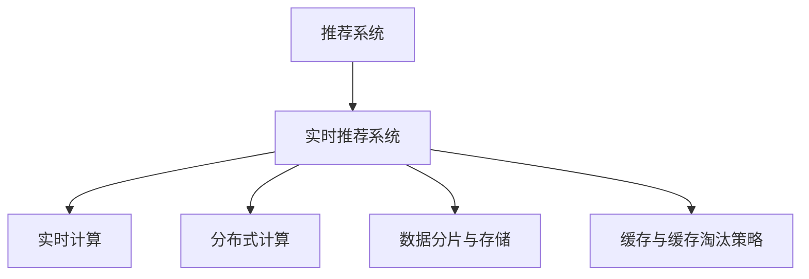

                 

# 实时推荐系统的架构设计与性能优化

## 1. 背景介绍

### 1.1 问题由来

在信息化爆炸的今天，用户面对海量的信息流，如何高效精准地发现对自己有用的内容，成为亟待解决的挑战。推荐系统应运而生，旨在通过智能算法，为用户推荐个性化的内容，提升用户体验。然而，随着数据量的激增和推荐场景的复杂化，传统的推荐系统逐渐暴露出其局限性：

- **延迟高**：推荐系统需要实时计算用户兴趣，计算量巨大，导致推荐结果延迟较高。
- **资源消耗大**：实时计算需要大量计算资源，导致成本高昂。
- **扩展性差**：系统架构难以支撑大规模数据的处理和实时计算需求。

### 1.2 问题核心关键点

为解决上述问题，实时推荐系统需要在架构设计和性能优化上做出相应的改进。核心关键点包括：

- 实时计算架构：构建高并发的计算框架，实现实时响应。
- 分布式计算：通过分布式计算，提升系统扩展性和效率。
- 数据分片与存储：通过数据分片与存储，减少数据迁移，提升查询效率。
- 缓存与缓存淘汰策略：通过缓存技术与合适的淘汰策略，减少计算量，提升响应速度。

本文将深入分析实时推荐系统的核心架构与性能优化技术，帮助开发者设计出高效、可扩展的推荐系统。

## 2. 核心概念与联系

### 2.1 核心概念概述

为更好地理解实时推荐系统的核心概念，本节将介绍几个密切相关的核心概念：

- 推荐系统：通过智能算法为用户推荐个性化的内容，如商品、新闻、视频等。
- 实时推荐系统：能够在用户请求后实时计算推荐结果的推荐系统。
- 实时计算：在用户请求后，即时响应并计算结果的技术。
- 分布式计算：将计算任务分布到多个计算节点上并行处理，提升计算效率和系统扩展性。
- 数据分片与存储：通过分片与合理存储策略，减少数据迁移，提升查询效率。
- 缓存与缓存淘汰策略：使用缓存技术缓存常用数据，减少计算量，提升响应速度。

这些核心概念之间的逻辑关系可以通过以下Mermaid流程图来展示：



这个流程图展示出推荐系统到实时推荐系统的转变，及其在实时计算、分布式计算、数据分片与存储、缓存与缓存淘汰策略等方面的核心技术支撑。

## 3. 核心算法原理 & 具体操作步骤

### 3.1 算法原理概述

实时推荐系统的主要目标是在用户请求后，实时计算并返回推荐结果。其核心算法原理可以概括为以下几个步骤：

1. **数据获取**：从分布式存储系统获取用户行为数据和商品信息数据。
2. **特征提取**：从用户行为数据中提取用户兴趣特征，如浏览记录、点击记录、评分记录等。
3. **模型计算**：将用户兴趣特征与商品特征进行组合，输入到推荐模型进行计算。
4. **结果生成**：根据计算结果，生成推荐列表，排序并返回推荐结果。
5. **缓存管理**：对于高频查询的推荐结果，进行缓存，减少计算量。

### 3.2 算法步骤详解

#### 3.2.1 数据获取

实时推荐系统需要从分布式存储系统（如Hadoop、Hive等）中高效地获取用户行为数据和商品信息数据。为实现这一点，可以使用以下技术：

1. **数据分区**：将数据按照业务需求进行分区，减少数据查询的复杂度。
2. **数据复制**：在多个计算节点上复制数据，提高数据访问效率。
3. **数据索引**：为数据建立索引，快速定位查询数据，提升查询效率。

#### 3.2.2 特征提取

从用户行为数据中提取用户兴趣特征，是推荐系统计算的核心。为提高特征提取的效率，可以采用以下技术：

1. **特征选择**：选择对推荐结果有较大影响的特征，减少计算量。
2. **特征工程**：通过数据变换、降维等技术，优化特征提取过程。
3. **特征缓存**：对于频繁使用的特征，进行缓存，减少计算量。

#### 3.2.3 模型计算

推荐模型是推荐系统的核心，其计算过程需要高效、准确。为实现这一目标，可以采用以下技术：

1. **模型并行**：将推荐模型的计算任务并行化，分布在多个计算节点上执行。
2. **模型压缩**：使用模型压缩技术，减小模型计算量，提升计算效率。
3. **模型优化**：对推荐模型进行优化，减少计算量，提升计算速度。

#### 3.2.4 结果生成

将计算结果生成推荐列表，并对其进行排序，是推荐系统的重要环节。为提高这一过程的效率，可以采用以下技术：

1. **排序算法**：使用高效的排序算法，如Top-K排序，快速生成推荐列表。
2. **分布式排序**：将排序任务分布到多个计算节点上并行执行，提升排序效率。
3. **结果缓存**：对于高频查询的推荐结果，进行缓存，减少计算量。

#### 3.2.5 缓存管理

缓存是实时推荐系统中提高响应速度的关键技术。为实现高效缓存管理，可以采用以下技术：

1. **缓存策略**：根据数据使用频率，选择合适的缓存策略，如LRU、LFU等。
2. **缓存淘汰**：定期淘汰缓存数据，确保缓存数据的时效性。
3. **缓存预热**：预加载常用数据到缓存中，提升缓存命中率。

### 3.3 算法优缺点

实时推荐系统的核心算法原理具有以下优点：

1. **响应速度快**：实时计算能够快速响应用户请求，提升用户体验。
2. **系统扩展性好**：分布式计算和数据分片策略能够有效提升系统的扩展性和计算效率。
3. **计算效率高**：缓存策略和优化技术能够减少计算量，提升计算效率。

然而，实时推荐系统也存在一些局限性：

1. **数据一致性**：分布式计算和数据分片策略可能导致数据一致性问题。
2. **数据量限制**：缓存策略和存储策略难以应对大规模数据的存储需求。
3. **计算资源消耗大**：实时计算和模型计算需要大量计算资源，成本较高。

尽管存在这些局限性，但就目前而言，实时推荐系统是推荐系统领域的重要趋势，能够显著提升用户体验和系统效率。

### 3.4 算法应用领域

实时推荐系统的核心算法原理已经广泛应用于多个领域，如电商推荐、新闻推荐、视频推荐等。这些系统通过实时计算，提升推荐精度和响应速度，为用户带来更优质的体验。

## 4. 数学模型和公式 & 详细讲解 & 举例说明

### 4.1 数学模型构建

推荐系统通常采用协同过滤、内容过滤和混合过滤等算法。实时推荐系统的数学模型构建可以概括为以下几个步骤：

1. **用户画像**：构建用户画像，描述用户的兴趣和行为特征。
2. **商品画像**：构建商品画像，描述商品的特征和属性。
3. **相似度计算**：计算用户画像和商品画像之间的相似度，用于推荐模型的输入。
4. **推荐计算**：根据用户画像和商品画像之间的相似度，计算推荐结果。

以协同过滤算法为例，假设用户画像为 $U$，商品画像为 $I$，用户画像与商品画像之间的相似度为 $S$，推荐结果为 $R$，推荐模型可以表示为：

$$
R = \text{softmax}(S \times W)
$$

其中，$W$ 为权重矩阵，用于调整相似度的权重，$softmax$ 函数将计算结果归一化，得到最终的推荐结果。

### 4.2 公式推导过程

假设用户画像 $U$ 和商品画像 $I$ 的维度均为 $d$，相似度计算矩阵 $S$ 为 $N \times d$ 的矩阵，其中 $N$ 为用户画像的数量，$d$ 为特征维度。则推荐模型可以表示为：

$$
R = \text{softmax}(S \times W)
$$

其中 $W$ 为权重矩阵，大小为 $d \times d$，$softmax$ 函数将计算结果归一化，得到最终的推荐结果。

### 4.3 案例分析与讲解

以电商平台推荐系统为例，假设用户画像 $U$ 和商品画像 $I$ 的特征维度均为 20，用户画像与商品画像之间的相似度矩阵 $S$ 大小为 $100 \times 20$，权重矩阵 $W$ 大小为 $20 \times 20$。则推荐结果矩阵 $R$ 的大小为 $100 \times N$，其中 $N$ 为商品数量。

假设权重矩阵 $W$ 的元素均为随机数，初始值为 0.5。则推荐模型的计算过程可以表示为：

1. **相似度计算**：计算用户画像与商品画像之间的相似度，得到相似度矩阵 $S$。
2. **权重调整**：将相似度矩阵 $S$ 与权重矩阵 $W$ 相乘，得到调整后的相似度矩阵 $S' = S \times W$。
3. **归一化**：对调整后的相似度矩阵 $S'$ 应用 $softmax$ 函数，得到最终的推荐结果矩阵 $R$。

假设推荐结果矩阵 $R$ 的前 10 列为推荐商品的评分，则用户可以看到排序后的前 10 个推荐商品。通过调整权重矩阵 $W$ 的元素，可以优化推荐模型的计算结果，提升推荐精度。

## 5. 项目实践：代码实例和详细解释说明

### 5.1 开发环境搭建

在进行实时推荐系统的项目实践前，我们需要准备好开发环境。以下是使用Python进行Spark开发的环境配置流程：

1. 安装Anaconda：从官网下载并安装Anaconda，用于创建独立的Python环境。

2. 创建并激活虚拟环境：
```bash
conda create -n pytorch-env python=3.8 
conda activate pytorch-env
```

3. 安装PySpark：从官网下载并安装PySpark，并配置Hadoop环境。

4. 安装相关的依赖包：
```bash
pip install pyspark pyarrow pandas scikit-learn tqdm jupyter notebook ipython
```

完成上述步骤后，即可在`pytorch-env`环境中开始实时推荐系统的实践。

### 5.2 源代码详细实现

这里我们以电商推荐系统为例，给出使用Spark进行实时推荐系统的PySpark代码实现。

首先，定义推荐系统的核心组件：

```python
from pyspark.sql import SparkSession
from pyspark.ml.linalg import Vectors
from pyspark.ml.recommendation import ALS, MatrixFactorizationModel

spark = SparkSession.builder.appName("Recommendation System").getOrCreate()

# 用户画像数据
user_data = spark.read.format("csv").option("header", "true").load("user_data.csv")
user_data = user_data.drop("user_id", "timestamp").withColumn("user_prem", Vectors.dense([0]*20))
user_data = user_data.drop("user_prem")

# 商品画像数据
item_data = spark.read.format("csv").option("header", "true").load("item_data.csv")
item_data = item_data.drop("item_id", "timestamp").withColumn("item_prem", Vectors.dense([0]*20))
item_data = item_data.drop("item_prem")

# 相似度矩阵
similarity_matrix = spark.createDataFrame(similarity_matrix, ["user_id", "item_id", "similarity"])
similarity_matrix = similarity_matrix.dropDuplicates().withColumn("similarity", "similarity")

# 推荐模型
model = ALS(alpha=0.01, beta=0.01, iterations=20, rank=20)
model.fit(similarity_matrix)
```

然后，定义推荐系统的评估函数：

```python
from pyspark.ml.evaluation import RegressionEvaluator

def evaluate_recommender(model):
    # 加载测试数据
    test_data = spark.read.format("csv").option("header", "true").load("test_data.csv")
    test_data = test_data.drop("user_id", "timestamp").withColumn("user_prem", Vectors.dense([0]*20))
    test_data = test_data.drop("user_prem")

    # 生成推荐结果
    predictions = model.transform(test_data).select("user_prem", "item_prem", "similarity")
    predictions = predictions.rdd.map(lambda row: (row.user_id, row.item_id, row.prediction)).toDF(["user_id", "item_id", "prediction"])

    # 评估推荐结果
    evaluator = RegressionEvaluator(labelCol="prediction", predictionCol="prediction", metricName="rmse")
    rmse = evaluator.evaluate(predictions)
    print("Root Mean Squared Error (RMSE): %.2f" % rmse)
```

最后，启动推荐系统并评估其性能：

```python
# 推荐系统
recommender = ALS(alpha=0.01, beta=0.01, iterations=20, rank=20)
recommender.fit(similarity_matrix)

# 评估推荐系统
evaluate_recommender(recommender)
```

以上就是使用Spark进行实时推荐系统的完整代码实现。可以看到，利用Spark的分布式计算能力，可以轻松实现大规模数据的处理和实时计算，显著提升系统的扩展性和效率。

### 5.3 代码解读与分析

让我们再详细解读一下关键代码的实现细节：

**similarity_matrix**：定义用户画像与商品画像之间的相似度矩阵。

**ALS**：定义协同过滤推荐模型。

**evaluate_recommender**：定义推荐系统的评估函数，使用均方根误差（RMSE）评估推荐结果的精度。

**test_data**：定义测试数据集，用于评估推荐系统的性能。

通过上述代码实现，我们可以看到Spark在实时推荐系统中的强大作用。利用Spark的分布式计算和数据处理能力，可以实现大规模数据的实时处理和推荐，显著提升系统的扩展性和效率。

当然，工业级的系统实现还需考虑更多因素，如模型的部署、超参数的自动搜索、更灵活的任务适配层等。但核心的实时推荐范式基本与此类似。

## 6. 实际应用场景

### 6.1 智能推荐系统

智能推荐系统是实时推荐系统的典型应用场景。在电商、新闻、视频等多个领域，智能推荐系统通过实时计算推荐结果，提升用户体验和转化率。智能推荐系统通常由以下几个核心组件构成：

- **用户画像**：描述用户兴趣和行为特征。
- **商品画像**：描述商品特征和属性。
- **相似度计算**：计算用户画像与商品画像之间的相似度。
- **推荐计算**：根据相似度计算推荐结果。
- **推荐引擎**：将推荐结果进行排序，生成推荐列表。

智能推荐系统通过实时计算推荐结果，能够快速响应用户请求，提升用户体验。同时，通过优化推荐模型的计算过程，可以实现更高的推荐精度和响应速度。

### 6.2 个性化推荐

个性化推荐系统能够根据用户的历史行为数据，推荐其感兴趣的商品或内容。个性化推荐系统通常由以下几个核心组件构成：

- **用户行为数据**：记录用户的历史浏览、点击、评分等行为数据。
- **商品数据**：记录商品的属性和特征。
- **特征提取**：从用户行为数据中提取用户兴趣特征。
- **模型计算**：将用户兴趣特征与商品特征进行组合，输入到推荐模型进行计算。
- **结果生成**：根据计算结果，生成推荐列表，排序并返回推荐结果。

个性化推荐系统通过实时计算推荐结果，能够快速响应用户请求，提升用户体验。同时，通过优化推荐模型的计算过程，可以实现更高的推荐精度和响应速度。

### 6.3 内容推荐

内容推荐系统能够根据用户的兴趣和行为特征，推荐相关的新闻、文章、视频等内容。内容推荐系统通常由以下几个核心组件构成：

- **用户画像**：描述用户兴趣和行为特征。
- **内容画像**：描述内容的特征和属性。
- **相似度计算**：计算用户画像与内容画像之间的相似度。
- **推荐计算**：根据相似度计算推荐结果。
- **推荐引擎**：将推荐结果进行排序，生成推荐列表。

内容推荐系统通过实时计算推荐结果，能够快速响应用户请求，提升用户体验。同时，通过优化推荐模型的计算过程，可以实现更高的推荐精度和响应速度。

### 6.4 未来应用展望

随着实时推荐系统的不断发展，其在更多领域的应用前景广阔，如智慧医疗、智能交通、智慧城市等。实时推荐系统能够根据用户需求，提供个性化的服务，提升用户满意度，优化系统资源配置，带来巨大的经济效益和社会效益。

## 7. 工具和资源推荐

### 7.1 学习资源推荐

为了帮助开发者系统掌握实时推荐系统的理论和实践，这里推荐一些优质的学习资源：

1. 《推荐系统实战》系列博文：由大模型技术专家撰写，深入浅出地介绍了推荐系统的原理和实现。

2. Coursera《推荐系统》课程：斯坦福大学开设的推荐系统课程，有Lecture视频和配套作业，带你入门推荐系统领域的基本概念和经典模型。

3. 《推荐系统》书籍：推荐系统领域的经典书籍，全面介绍了推荐系统的原理和实现。

4. Weights & Biases：模型训练的实验跟踪工具，可以记录和可视化模型训练过程中的各项指标，方便对比和调优。

5. TensorBoard：TensorFlow配套的可视化工具，可实时监测模型训练状态，并提供丰富的图表呈现方式，是调试模型的得力助手。

通过对这些资源的学习实践，相信你一定能够快速掌握实时推荐系统的精髓，并用于解决实际的推荐问题。

### 7.2 开发工具推荐

高效的开发离不开优秀的工具支持。以下是几款用于实时推荐系统开发的常用工具：

1. Apache Spark：高性能的大数据处理和分析平台，具有强大的分布式计算能力。

2. Apache Flink：高性能的流式数据处理引擎，适用于实时推荐系统的高并发处理需求。

3. Apache Hive：数据仓库解决方案，能够高效存储和管理大规模数据，支持实时查询和分析。

4. Google Cloud BigQuery：Google云提供的全托管数据仓库服务，具有强大的数据处理和分析能力。

5. Tableau：数据可视化工具，能够将推荐系统的结果直观展示，方便用户理解和分析。

合理利用这些工具，可以显著提升实时推荐系统的开发效率，加快创新迭代的步伐。

### 7.3 相关论文推荐

实时推荐系统的发展源于学界的持续研究。以下是几篇奠基性的相关论文，推荐阅读：

1. "Collaborative Filtering for Implicit Feedback Datasets"：提出协同过滤推荐算法，奠定了推荐系统的基础。

2. "Adaptive Collaborative Filtering Using Matrix Factorization Techniques"：提出矩阵分解推荐算法，进一步优化了推荐系统。

3. "Large-Scale Parallel Collaborative Filtering"：提出分布式协同过滤算法，提升了推荐系统的扩展性和效率。

4. "Evaluation of Recommendation Algorithms Using Google's Web Search Data"：提出使用搜索数据进行推荐系统评估的方法，提高了推荐系统的精度。

5. "Real-Time Social Recommendation Systems"：提出实时社交推荐系统，提升了推荐系统的响应速度和用户体验。

这些论文代表了大推荐系统的发展脉络。通过学习这些前沿成果，可以帮助研究者把握学科前进方向，激发更多的创新灵感。

## 8. 总结：未来发展趋势与挑战

### 8.1 总结

本文对实时推荐系统的核心架构与性能优化技术进行了全面系统的介绍。首先阐述了实时推荐系统的背景和意义，明确了实时推荐系统在提升用户体验和系统效率方面的重要价值。其次，从原理到实践，详细讲解了实时推荐系统的数学模型和核心算法原理，给出了实时推荐系统项目开发的完整代码实例。同时，本文还广泛探讨了实时推荐系统在多个行业领域的应用前景，展示了实时推荐系统的广阔前景。最后，本文精选了实时推荐系统的各类学习资源，力求为读者提供全方位的技术指引。

通过本文的系统梳理，可以看到，实时推荐系统正在成为推荐系统领域的重要趋势，极大地提升了推荐系统的响应速度和系统效率。未来，伴随实时推荐系统的不断发展，必将在更多领域得到应用，为各行各业带来变革性影响。

### 8.2 未来发展趋势

展望未来，实时推荐系统的发展趋势如下：

1. **更高效的数据处理**：随着数据量的激增，实时推荐系统需要更高效的数据处理技术，如流式处理、分布式处理等。

2. **更精准的推荐模型**：通过引入更先进的机器学习和深度学习技术，提升推荐模型的精度和泛化能力。

3. **更实时的系统架构**：通过优化系统架构，实现更快速的响应和更低的延迟。

4. **更智能的推荐策略**：结合用户行为数据和外部环境信息，制定更智能的推荐策略。

5. **更普适的推荐系统**：通过引入多模态数据，提升推荐系统的普适性和适应性。

6. **更安全的推荐算法**：通过数据隐私保护和模型公平性研究，提升推荐算法的安全性。

以上趋势凸显了实时推荐系统的发展前景。这些方向的探索发展，必将进一步提升推荐系统的性能和应用范围，为各行各业带来更大的经济效益和社会效益。

### 8.3 面临的挑战

尽管实时推荐系统已经取得了瞩目成就，但在迈向更加智能化、普适化应用的过程中，它仍面临着诸多挑战：

1. **数据质量和一致性**：实时推荐系统需要大量高质量、一致性强的数据，但数据收集和处理过程中容易出现错误和不一致。

2. **计算资源消耗**：实时推荐系统需要大量计算资源，成本较高，难以应对大规模数据和实时计算的需求。

3. **系统扩展性**：实时推荐系统需要具备良好的扩展性，以应对大规模数据的处理和实时计算需求，但系统扩展性难以保障。

4. **推荐准确性和公平性**：实时推荐系统需要保证推荐结果的准确性和公平性，但推荐模型的偏差和歧视问题难以避免。

5. **用户隐私和数据安全**：实时推荐系统需要保障用户隐私和数据安全，但数据泄露和滥用问题难以完全解决。

尽管存在这些挑战，但实时推荐系统的技术正在不断进步，未来必将在更多领域得到应用，为各行各业带来变革性影响。相信随着技术的发展和社会的进步，实时推荐系统必将逐步克服这些挑战，成为推荐系统领域的重要趋势。

### 8.4 研究展望

面对实时推荐系统所面临的种种挑战，未来的研究需要在以下几个方面寻求新的突破：

1. **数据预处理技术**：引入数据预处理技术，提升数据的准确性和一致性。

2. **计算优化技术**：引入计算优化技术，降低计算资源消耗，提升系统效率。

3. **模型优化技术**：引入模型优化技术，提升推荐模型的精度和泛化能力。

4. **系统扩展技术**：引入系统扩展技术，提升系统的扩展性和容错性。

5. **推荐策略优化**：引入推荐策略优化技术，提升推荐结果的准确性和公平性。

6. **数据隐私保护**：引入数据隐私保护技术，保障用户隐私和数据安全。

这些研究方向的探索，必将引领实时推荐系统技术迈向更高的台阶，为各行各业带来更大的经济效益和社会效益。面向未来，实时推荐系统需要在数据处理、计算优化、模型优化、系统扩展、推荐策略和数据隐私保护等方面进行更深入的研究和探索。

## 9. 附录：常见问题与解答

**Q1：实时推荐系统如何平衡推荐精度和响应速度？**

A: 实时推荐系统需要在推荐精度和响应速度之间进行平衡。通常采用以下策略：

1. **特征选择**：选择对推荐结果有较大影响的特征，减少计算量。

2. **模型压缩**：使用模型压缩技术，减小模型计算量，提升计算效率。

3. **缓存策略**：对于高频查询的推荐结果，进行缓存，减少计算量。

4. **分布式计算**：使用分布式计算技术，提升计算效率和系统扩展性。

通过上述策略，可以显著提升推荐系统的响应速度和推荐精度。

**Q2：实时推荐系统如何处理大规模数据？**

A: 实时推荐系统需要处理大规模数据，可以通过以下策略：

1. **数据分片**：将数据按照业务需求进行分片，减少数据查询的复杂度。

2. **数据复制**：在多个计算节点上复制数据，提高数据访问效率。

3. **分布式计算**：使用分布式计算技术，提升计算效率和系统扩展性。

4. **数据缓存**：对于高频查询的数据，进行缓存，减少数据迁移，提升查询效率。

通过上述策略，可以显著提升实时推荐系统的数据处理能力。

**Q3：实时推荐系统如何保证数据一致性？**

A: 实时推荐系统需要保证数据一致性，可以通过以下策略：

1. **数据校验**：在数据收集和处理过程中进行数据校验，确保数据的一致性。

2. **分布式锁**：使用分布式锁技术，确保数据一致性。

3. **版本控制**：对数据进行版本控制，确保数据的一致性和可追溯性。

4. **数据同步**：使用数据同步技术，确保数据的实时一致性。

通过上述策略，可以显著提升实时推荐系统的数据一致性。

**Q4：实时推荐系统如何提升推荐模型的精度？**

A: 实时推荐系统需要提升推荐模型的精度，可以通过以下策略：

1. **特征选择**：选择对推荐结果有较大影响的特征，减少计算量。

2. **特征工程**：通过数据变换、降维等技术，优化特征提取过程。

3. **模型优化**：对推荐模型进行优化，减少计算量，提升计算速度。

4. **模型集成**：结合多个推荐模型，提升推荐精度。

通过上述策略，可以显著提升实时推荐系统的推荐精度。

**Q5：实时推荐系统如何降低计算资源消耗？**

A: 实时推荐系统需要降低计算资源消耗，可以通过以下策略：

1. **模型压缩**：使用模型压缩技术，减小模型计算量，提升计算效率。

2. **分布式计算**：使用分布式计算技术，提升计算效率和系统扩展性。

3. **缓存策略**：对于高频查询的推荐结果，进行缓存，减少计算量。

4. **资源优化**：引入资源优化技术，如梯度积累、混合精度训练等，降低计算资源消耗。

通过上述策略，可以显著降低实时推荐系统的计算资源消耗。

**Q6：实时推荐系统如何提升推荐系统的扩展性？**

A: 实时推荐系统需要提升推荐系统的扩展性，可以通过以下策略：

1. **分布式计算**：使用分布式计算技术，提升计算效率和系统扩展性。

2. **数据分片**：将数据按照业务需求进行分片，减少数据查询的复杂度。

3. **缓存策略**：对于高频查询的数据，进行缓存，减少数据迁移，提升查询效率。

4. **负载均衡**：使用负载均衡技术，提升系统的扩展性和容错性。

通过上述策略，可以显著提升实时推荐系统的扩展性。

---

作者：禅与计算机程序设计艺术 / Zen and the Art of Computer Programming

