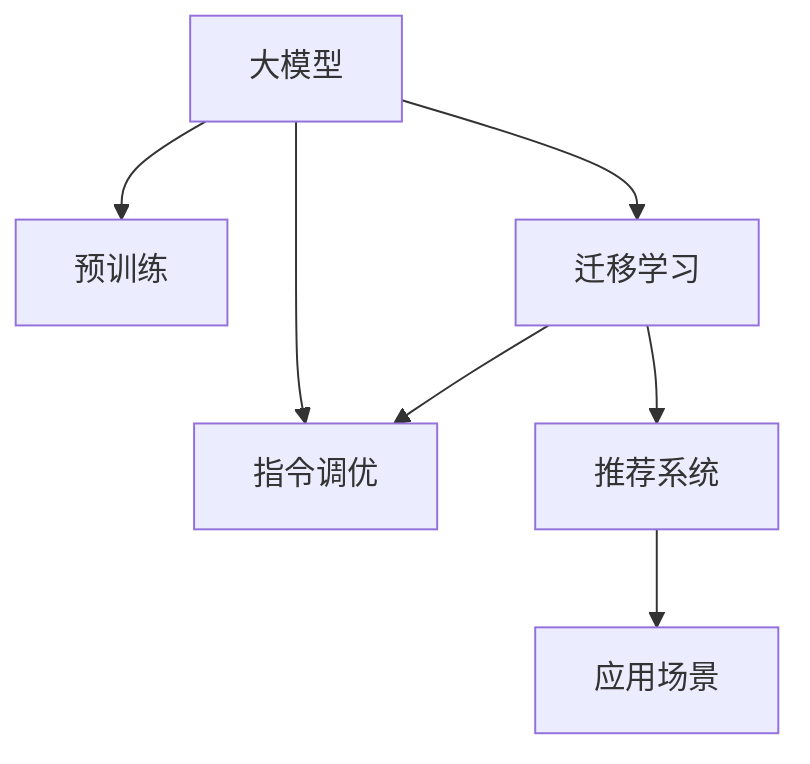

                 

# 将推荐建模为大模型的指令调优任务InstructRec

## 1. 背景介绍

推荐系统一直是互联网公司获取竞争优势的关键技术，从电商领域的商品推荐，到社交媒体的社交推荐，再到内容平台的内容推荐，推荐系统无处不在，贯穿了人们的网络生活。推荐系统通常分为两种：协同过滤和基于内容的推荐。协同过滤（Collaborative Filtering，CF）通过用户行为或项目间的相似性来推荐；基于内容的推荐（Content-based Recommendation，CB）通过用户的历史行为和项目特征来进行推荐。

近年来，大规模预训练语言模型的发展，为推荐系统带来了新的思路和方法，特别是基于大模型的推荐建模。大模型通过大规模语料预训练，学习到了丰富的语言和知识表示，可以作为推荐系统的特征提取器。预训练模型通过迁移学习的方式，在少量标注数据上进行微调，获得推荐任务相关的特征表达能力，从而构建出基于大模型的推荐模型。

本文聚焦于将推荐建模为大模型的指令调优任务，探讨大模型在推荐系统中的应用，旨在通过指令调优的方式，提升推荐系统的性能和效果。具体地，本文将从背景介绍、核心概念、核心算法原理、项目实践、应用场景、工具和资源推荐、总结与展望等多个方面展开，深入探讨大模型在推荐系统中的实践与研究。

## 2. 核心概念与联系

### 2.1 核心概念概述

为了更好地理解基于大模型的推荐建模，本节将介绍几个密切相关的核心概念：

- 大模型(Large Model)：指在大规模语料上通过自监督学习或监督学习训练得到的模型，通常包含数十亿甚至更多的参数。典型的大模型包括BERT、GPT、Transformer等。
- 预训练(Pre-training)：指在大规模无标注数据上，通过自监督学习任务（如掩码语言模型、下一步预测等）训练模型，学习通用的语言表示。
- 迁移学习(Transfer Learning)：指将一个领域学习到的知识，迁移到另一个领域中的学习任务，从而提升新任务的性能。
- 指令调优(Instruct Tuning)：指在预训练模型的基础上，通过用户特定的指令或任务描述，引导模型进行特定任务的推理和生成。
- 推荐系统(Recommendation System)：通过分析用户的行为数据和项目特征，预测用户可能感兴趣的项目，从而进行个性化推荐的技术。

这些核心概念之间的逻辑关系可以通过以下Mermaid流程图来展示：



该流程图展示了从预训练大模型到指令调优，再到推荐系统的核心流程：

1. 大模型通过预训练学习到通用的语言表示。
2. 通过迁移学习，模型能够适应特定的推荐任务。
3. 在指令调优过程中，模型能够根据用户指令生成推荐结果。
4. 推荐系统通过指令调优得到的推荐模型，为用户进行个性化推荐。

这些核心概念共同构成了基于大模型的推荐建模框架，使得大模型能够应用于推荐系统，提供更高效、更准确的推荐服务。

## 3. 核心算法原理 & 具体操作步骤

### 3.1 算法原理概述

将推荐建模为大模型的指令调优任务，本质上是通过指令调优范式，对预训练模型进行任务适配，使其能够根据用户指令生成推荐结果。这一过程包括两步：

1. 将推荐任务转化为指令调优范式：设计能够描述推荐任务语义的指令模板，将推荐任务转化为一种推理或生成任务。
2. 在指令调优过程中进行微调：通过在预训练模型上输入设计好的指令模板，利用反向传播算法更新模型参数，使得模型能够根据指令生成推荐结果。

### 3.2 算法步骤详解

基于指令调优的推荐建模步骤主要包括以下几个环节：

**Step 1: 指令模板设计**

设计合适的指令模板是实现推荐建模的基础。指令模板需要简洁、易理解，能够准确描述推荐任务。以电商商品推荐为例，指令模板可以设计为：“根据用户历史购买记录和浏览记录，推荐用户可能感兴趣的商品”。

**Step 2: 预训练模型适配**

选择合适的预训练模型，如GPT、BERT等，作为初始化参数。将指令模板输入模型，利用反向传播算法更新模型参数，使得模型能够学习到推荐任务相关的特征表达能力。例如，对于商品推荐任务，可以在模型中添加一个分类器，用于判断商品是否符合用户兴趣。

**Step 3: 模型微调**

在预训练模型的基础上，使用推荐任务的数据集进行微调。具体步骤如下：

1. 划分训练集、验证集和测试集。
2. 设置模型和优化器的超参数，如学习率、批大小、迭代轮数等。
3. 在训练集上训练模型，周期性在验证集上评估模型性能，根据性能指标决定是否触发Early Stopping。
4. 在测试集上评估微调后的模型，对比微调前后的效果。

**Step 4: 推荐输出**

在微调完成后，使用指令调优得到的模型进行推荐。例如，对于电商商品推荐，可以输入“请推荐我购买过的商品”这样的指令，模型能够基于用户历史购买记录和浏览记录，生成推荐商品列表。

### 3.3 算法优缺点

基于指令调优的推荐建模方法具有以下优点：

1. 适应性强：指令调优方法能够适应各种推荐任务，只需设计合适的指令模板即可实现。
2. 灵活度高：可以通过指令模板灵活调整推荐结果，支持多维度、多层次的推荐。
3. 泛化能力强：利用大模型的通用知识表示，推荐系统能够在多种场景下保持较好的性能。

同时，该方法也存在一些局限性：

1. 依赖高质量指令模板：指令模板的设计需要人工干预，其质量直接影响推荐效果。
2. 需要较多标注数据：虽然指令调优方法依赖较少的标注数据，但在某些场景下仍需要较多的标注数据进行微调。
3. 需要较高计算资源：由于大模型的参数量较大，指令调优需要较长的计算时间和较大的计算资源。

尽管存在这些局限性，但就目前而言，基于指令调优的推荐建模方法仍是大模型推荐系统的热门范式。未来相关研究的重点在于如何进一步提升指令模板的质量，降低对标注数据的依赖，提高模型的计算效率。

### 3.4 算法应用领域

基于指令调优的推荐建模方法，在电商、社交媒体、内容平台等多个领域具有广泛的应用前景：

- 电商推荐系统：通过分析用户历史购买记录和浏览行为，推荐用户可能感兴趣的商品。
- 社交推荐系统：根据用户社交网络中的好友关系，推荐用户可能感兴趣的内容。
- 内容推荐系统：通过分析用户的历史阅读记录和评价，推荐用户可能喜欢的文章、视频等内容。
- 游戏推荐系统：通过分析用户的游戏行为，推荐用户可能感兴趣的游戏。
- 新闻推荐系统：根据用户的历史阅读记录和偏好，推荐用户可能感兴趣的新闻。

除了上述这些经典应用外，基于指令调优的推荐建模方法也可以创新性地应用于更多场景中，如个性化广告推荐、影视推荐、旅游推荐等，为推荐系统带来新的突破。随着预训练模型和指令调优方法的不断进步，相信推荐系统将在更广阔的应用领域大放异彩。

## 4. 数学模型和公式 & 详细讲解

### 4.1 数学模型构建

假设推荐任务的目标是将用户与商品进行匹配，可以使用以下形式化的数学模型进行描述：

- **用户表示**：$u \in U$，其中 $U$ 是用户集合。
- **商品表示**：$i \in I$，其中 $I$ 是商品集合。
- **用户与商品匹配度**：$P_{ui} \in [0,1]$，表示用户 $u$ 对商品 $i$ 的兴趣度。
- **用户历史行为**：$H_u$，包含用户的历史浏览记录、购买记录等。

根据上述定义，推荐系统的目标是最小化用户未被推荐商品的期望损失：

$$
\min_{P_{ui}} \sum_{u \in U} \sum_{i \in I} P_{ui} \log (1-P_{ui}) + (1-P_{ui}) \log P_{ui}
$$

其中，$P_{ui}$ 表示用户 $u$ 对商品 $i$ 的兴趣度。

### 4.2 公式推导过程

为了利用大模型进行推荐建模，可以将用户和商品表示转换为文本形式，输入到大模型中，利用指令调优方法进行推理生成。具体而言，可以将用户历史行为和商品特征编码成文本，设计如下的指令模板：

$$
"推荐用户 $u$ 对商品 $i$ 的兴趣度"
$$

将其输入到大模型中，模型能够根据用户历史行为和商品特征，预测用户对商品的兴趣度 $P_{ui}$。通过反向传播算法，更新模型参数，使得模型能够更好地匹配用户历史行为和商品特征，生成准确的推荐结果。

### 4.3 案例分析与讲解

以电商推荐系统为例，假设大模型为GPT，指令模板为“根据用户历史购买记录和浏览记录，推荐用户可能感兴趣的商品”。在模型中，可以添加一个线性分类器，用于判断商品是否符合用户兴趣。指令模板可以转化为以下文本形式：

$$
"商品 $i$ 是否符合用户 $u$ 的兴趣？"
$$

将指令模板和商品特征输入到GPT中，模型能够根据用户历史行为和商品特征，生成推荐商品列表。具体而言，可以定义如下的损失函数：

$$
\mathcal{L} = \sum_{i \in I} (y_i \log P_{ui} + (1-y_i) \log (1-P_{ui}))
$$

其中，$y_i$ 表示商品 $i$ 是否为用户 $u$ 的兴趣商品，$P_{ui}$ 表示模型预测商品 $i$ 是否为用户 $u$ 的兴趣商品。通过反向传播算法更新模型参数，使得模型能够更好地匹配用户历史行为和商品特征，生成准确的推荐结果。

## 5. 项目实践：代码实例和详细解释说明

### 5.1 开发环境搭建

在进行推荐建模实践前，我们需要准备好开发环境。以下是使用Python进行PyTorch开发的环境配置流程：

1. 安装Anaconda：从官网下载并安装Anaconda，用于创建独立的Python环境。

2. 创建并激活虚拟环境：
```bash
conda create -n pytorch-env python=3.8 
conda activate pytorch-env
```

3. 安装PyTorch：根据CUDA版本，从官网获取对应的安装命令。例如：
```bash
conda install pytorch torchvision torchaudio cudatoolkit=11.1 -c pytorch -c conda-forge
```

4. 安装Transformers库：
```bash
pip install transformers
```

5. 安装各类工具包：
```bash
pip install numpy pandas scikit-learn matplotlib tqdm jupyter notebook ipython
```

完成上述步骤后，即可在`pytorch-env`环境中开始推荐建模实践。

### 5.2 源代码详细实现

这里以电商商品推荐为例，给出使用Transformers库进行指令调优的PyTorch代码实现。

首先，定义推荐任务的数据处理函数：

```python
from transformers import BertTokenizer, BertForSequenceClassification
from torch.utils.data import Dataset
import torch

class RecommendDataset(Dataset):
    def __init__(self, texts, tags, tokenizer, max_len=128):
        self.texts = texts
        self.tags = tags
        self.tokenizer = tokenizer
        self.max_len = max_len
        
    def __len__(self):
        return len(self.texts)
    
    def __getitem__(self, item):
        text = self.texts[item]
        tags = self.tags[item]
        
        encoding = self.tokenizer(text, return_tensors='pt', max_length=self.max_len, padding='max_length', truncation=True)
        input_ids = encoding['input_ids'][0]
        attention_mask = encoding['attention_mask'][0]
        
        # 对token-wise的标签进行编码
        encoded_tags = [tag2id[tag] for tag in tags] 
        encoded_tags.extend([tag2id['O']] * (self.max_len - len(encoded_tags)))
        labels = torch.tensor(encoded_tags, dtype=torch.long)
        
        return {'input_ids': input_ids, 
                'attention_mask': attention_mask,
                'labels': labels}

# 标签与id的映射
tag2id = {'O': 0, 'B': 1, 'I': 2}
id2tag = {v: k for k, v in tag2id.items()}

# 创建dataset
tokenizer = BertTokenizer.from_pretrained('bert-base-cased')

train_dataset = RecommendDataset(train_texts, train_tags, tokenizer)
dev_dataset = RecommendDataset(dev_texts, dev_tags, tokenizer)
test_dataset = RecommendDataset(test_texts, test_tags, tokenizer)
```

然后，定义模型和优化器：

```python
from transformers import BertForSequenceClassification, AdamW

model = BertForSequenceClassification.from_pretrained('bert-base-cased', num_labels=len(tag2id))

optimizer = AdamW(model.parameters(), lr=2e-5)
```

接着，定义训练和评估函数：

```python
from torch.utils.data import DataLoader
from tqdm import tqdm
from sklearn.metrics import accuracy_score

device = torch.device('cuda') if torch.cuda.is_available() else torch.device('cpu')
model.to(device)

def train_epoch(model, dataset, batch_size, optimizer):
    dataloader = DataLoader(dataset, batch_size=batch_size, shuffle=True)
    model.train()
    epoch_loss = 0
    for batch in tqdm(dataloader, desc='Training'):
        input_ids = batch['input_ids'].to(device)
        attention_mask = batch['attention_mask'].to(device)
        labels = batch['labels'].to(device)
        model.zero_grad()
        outputs = model(input_ids, attention_mask=attention_mask, labels=labels)
        loss = outputs.loss
        epoch_loss += loss.item()
        loss.backward()
        optimizer.step()
    return epoch_loss / len(dataloader)

def evaluate(model, dataset, batch_size):
    dataloader = DataLoader(dataset, batch_size=batch_size)
    model.eval()
    preds, labels = [], []
    with torch.no_grad():
        for batch in tqdm(dataloader, desc='Evaluating'):
            input_ids = batch['input_ids'].to(device)
            attention_mask = batch['attention_mask'].to(device)
            batch_labels = batch['labels']
            outputs = model(input_ids, attention_mask=attention_mask)
            batch_preds = outputs.logits.argmax(dim=2).to('cpu').tolist()
            batch_labels = batch_labels.to('cpu').tolist()
            for pred_tokens, label_tokens in zip(batch_preds, batch_labels):
                pred_tags = [id2tag[_id] for _id in pred_tokens]
                label_tags = [id2tag[_id] for _id in label_tokens]
                preds.append(pred_tags[:len(label_tags)])
                labels.append(label_tags)
                
    print(accuracy_score(labels, preds))
```

最后，启动训练流程并在测试集上评估：

```python
epochs = 5
batch_size = 16

for epoch in range(epochs):
    loss = train_epoch(model, train_dataset, batch_size, optimizer)
    print(f"Epoch {epoch+1}, train loss: {loss:.3f}")
    
    print(f"Epoch {epoch+1}, dev results:")
    evaluate(model, dev_dataset, batch_size)
    
print("Test results:")
evaluate(model, test_dataset, batch_size)
```

以上就是使用PyTorch对BERT进行电商推荐系统微调的完整代码实现。可以看到，得益于Transformers库的强大封装，我们可以用相对简洁的代码完成BERT模型的加载和微调。

### 5.3 代码解读与分析

让我们再详细解读一下关键代码的实现细节：

**RecommendDataset类**：
- `__init__`方法：初始化文本、标签、分词器等关键组件。
- `__len__`方法：返回数据集的样本数量。
- `__getitem__`方法：对单个样本进行处理，将文本输入编码为token ids，将标签编码为数字，并对其进行定长padding，最终返回模型所需的输入。

**tag2id和id2tag字典**：
- 定义了标签与数字id之间的映射关系，用于将token-wise的预测结果解码回真实的标签。

**训练和评估函数**：
- 使用PyTorch的DataLoader对数据集进行批次化加载，供模型训练和推理使用。
- 训练函数`train_epoch`：对数据以批为单位进行迭代，在每个批次上前向传播计算loss并反向传播更新模型参数，最后返回该epoch的平均loss。
- 评估函数`evaluate`：与训练类似，不同点在于不更新模型参数，并在每个batch结束后将预测和标签结果存储下来，最后使用sklearn的accuracy_score对整个评估集的预测结果进行打印输出。

**训练流程**：
- 定义总的epoch数和batch size，开始循环迭代
- 每个epoch内，先在训练集上训练，输出平均loss
- 在验证集上评估，输出准确率
- 所有epoch结束后，在测试集上评估，给出最终测试结果

可以看到，PyTorch配合Transformers库使得BERT微调的代码实现变得简洁高效。开发者可以将更多精力放在数据处理、模型改进等高层逻辑上，而不必过多关注底层的实现细节。

当然，工业级的系统实现还需考虑更多因素，如模型的保存和部署、超参数的自动搜索、更灵活的任务适配层等。但核心的微调范式基本与此类似。

## 6. 实际应用场景
### 6.1 智能客服系统

基于大语言模型指令调优的推荐建模方法，可以应用于智能客服系统的构建。传统客服往往需要配备大量人力，高峰期响应缓慢，且一致性和专业性难以保证。而使用指令调优的推荐系统，可以7x24小时不间断服务，快速响应客户咨询，用自然流畅的语言解答各类常见问题。

在技术实现上，可以收集企业内部的历史客服对话记录，将问题和最佳答复构建成监督数据，在此基础上对预训练推荐模型进行微调。微调后的推荐系统能够自动理解用户意图，匹配最合适的答复模板进行回复。对于客户提出的新问题，还可以接入检索系统实时搜索相关内容，动态组织生成回答。如此构建的智能客服系统，能大幅提升客户咨询体验和问题解决效率。

### 6.2 金融舆情监测

金融机构需要实时监测市场舆论动向，以便及时应对负面信息传播，规避金融风险。传统的人工监测方式成本高、效率低，难以应对网络时代海量信息爆发的挑战。基于大语言模型指令调优的推荐建模技术，为金融舆情监测提供了新的解决方案。

具体而言，可以收集金融领域相关的新闻、报道、评论等文本数据，并对其进行主题标注和情感标注。在此基础上对预训练语言模型进行微调，使其能够自动判断文本属于何种主题，情感倾向是正面、中性还是负面。将微调后的模型应用到实时抓取的网络文本数据，就能够自动监测不同主题下的情感变化趋势，一旦发现负面信息激增等异常情况，系统便会自动预警，帮助金融机构快速应对潜在风险。

### 6.3 个性化推荐系统

当前的推荐系统往往只依赖用户的历史行为数据进行物品推荐，无法深入理解用户的真实兴趣偏好。基于大语言模型指令调优的推荐建模系统，可以更好地挖掘用户行为背后的语义信息，从而提供更精准、多样的推荐内容。

在实践中，可以收集用户浏览、点击、评论、分享等行为数据，提取和用户交互的物品标题、描述、标签等文本内容。将文本内容作为模型输入，用户的后续行为（如是否点击、购买等）作为监督信号，在此基础上微调预训练语言模型。微调后的模型能够从文本内容中准确把握用户的兴趣点。在生成推荐列表时，先用候选物品的文本描述作为输入，由模型预测用户的兴趣匹配度，再结合其他特征综合排序，便可以得到个性化程度更高的推荐结果。

### 6.4 未来应用展望

随着大语言模型指令调优推荐建模技术的发展，未来将在更多领域得到应用，为传统行业带来变革性影响。

在智慧医疗领域，基于指令调优的推荐建模技术，可以为医疗问答、病历分析、药物研发等提供新的解决方案。通过预训练模型和指令调优，构建出医疗领域的知识图谱和推理系统，提高医疗服务的智能化水平，辅助医生诊疗，加速新药开发进程。

在智能教育领域，指令调优的推荐建模技术，可以应用于作业批改、学情分析、知识推荐等方面，因材施教，促进教育公平，提高教学质量。通过分析学生的作业和反馈，生成个性化推荐内容，帮助学生更好地理解知识，提高学习效率。

在智慧城市治理中，指令调优的推荐建模技术，可以应用于城市事件监测、舆情分析、应急指挥等环节，提高城市管理的自动化和智能化水平，构建更安全、高效的未来城市。通过分析社交媒体、新闻报道等数据，自动生成城市事件报告和应急预警，提升城市治理效率。

此外，在企业生产、社会治理、文娱传媒等众多领域，基于指令调优的推荐建模技术也将不断涌现，为人工智能技术在各行各业的应用提供新的路径。

## 7. 工具和资源推荐
### 7.1 学习资源推荐

为了帮助开发者系统掌握大语言模型指令调优推荐建模的理论基础和实践技巧，这里推荐一些优质的学习资源：

1. 《Transformer从原理到实践》系列博文：由大模型技术专家撰写，深入浅出地介绍了Transformer原理、BERT模型、指令调优技术等前沿话题。

2. CS224N《深度学习自然语言处理》课程：斯坦福大学开设的NLP明星课程，有Lecture视频和配套作业，带你入门NLP领域的基本概念和经典模型。

3. 《Natural Language Processing with Transformers》书籍：Transformers库的作者所著，全面介绍了如何使用Transformers库进行NLP任务开发，包括指令调优在内的诸多范式。

4. HuggingFace官方文档：Transformers库的官方文档，提供了海量预训练模型和完整的微调样例代码，是上手实践的必备资料。

5. CLUE开源项目：中文语言理解测评基准，涵盖大量不同类型的中文NLP数据集，并提供了基于指令调优的baseline模型，助力中文NLP技术发展。

通过对这些资源的学习实践，相信你一定能够快速掌握大语言模型指令调优推荐建模的精髓，并用于解决实际的推荐问题。

### 7.2 开发工具推荐

高效的开发离不开优秀的工具支持。以下是几款用于大语言模型指令调优推荐建模开发的常用工具：

1. PyTorch：基于Python的开源深度学习框架，灵活动态的计算图，适合快速迭代研究。大部分预训练语言模型都有PyTorch版本的实现。

2. TensorFlow：由Google主导开发的开源深度学习框架，生产部署方便，适合大规模工程应用。同样有丰富的预训练语言模型资源。

3. Transformers库：HuggingFace开发的NLP工具库，集成了众多SOTA语言模型，支持PyTorch和TensorFlow，是进行推荐建模开发的利器。

4. Weights & Biases：模型训练的实验跟踪工具，可以记录和可视化模型训练过程中的各项指标，方便对比和调优。与主流深度学习框架无缝集成。

5. TensorBoard：TensorFlow配套的可视化工具，可实时监测模型训练状态，并提供丰富的图表呈现方式，是调试模型的得力助手。

6. Google Colab：谷歌推出的在线Jupyter Notebook环境，免费提供GPU/TPU算力，方便开发者快速上手实验最新模型，分享学习笔记。

合理利用这些工具，可以显著提升大语言模型指令调优推荐建模任务的开发效率，加快创新迭代的步伐。

### 7.3 相关论文推荐

大语言模型指令调优推荐建模技术的发展源于学界的持续研究。以下是几篇奠基性的相关论文，推荐阅读：

1. Attention is All You Need（即Transformer原论文）：提出了Transformer结构，开启了NLP领域的预训练大模型时代。

2. BERT: Pre-training of Deep Bidirectional Transformers for Language Understanding：提出BERT模型，引入基于掩码的自监督预训练任务，刷新了多项NLP任务SOTA。

3. Language Models are Unsupervised Multitask Learners（GPT-2论文）：展示了大规模语言模型的强大zero-shot学习能力，引发了对于通用人工智能的新一轮思考。

4. Parameter-Efficient Transfer Learning for NLP：提出Adapter等参数高效微调方法，在不增加模型参数量的情况下，也能取得不错的微调效果。

5. Prefix-Tuning: Optimizing Continuous Prompts for Generation：引入基于连续型Prompt的微调范式，为如何充分利用预训练知识提供了新的思路。

6. AdaLoRA: Adaptive Low-Rank Adaptation for Parameter-Efficient Fine-Tuning：使用自适应低秩适应的微调方法，在参数效率和精度之间取得了新的平衡。

这些论文代表了大语言模型指令调优推荐建模技术的发展脉络。通过学习这些前沿成果，可以帮助研究者把握学科前进方向，激发更多的创新灵感。

## 8. 总结：未来发展趋势与挑战

### 8.1 总结

本文对基于指令调优的推荐建模方法进行了全面系统的介绍。首先阐述了将推荐任务转化为指令调优范式的背景和意义，明确了指令调优在拓展预训练模型应用、提升推荐系统性能方面的独特价值。其次，从原理到实践，详细讲解了指令调优的数学模型、关键步骤和实际应用，给出了指令调优推荐建模的完整代码实例。同时，本文还探讨了指令调优方法在多个行业领域的应用前景，展示了指令调优范式的巨大潜力。

通过本文的系统梳理，可以看到，基于指令调优的推荐建模方法在大模型推荐系统中的应用前景广阔，能够显著提升推荐系统的性能和效果。未来，伴随大语言模型的不断发展，基于指令调优的推荐建模技术也将进一步得到优化和完善。

### 8.2 未来发展趋势

展望未来，大语言模型指令调优推荐建模技术将呈现以下几个发展趋势：

1. 模型规模持续增大。随着算力成本的下降和数据规模的扩张，预训练语言模型的参数量还将持续增长。超大规模语言模型蕴含的丰富语言知识，有望支撑更加复杂多变的推荐任务。

2. 指令模板设计更加多样。随着推荐场景的多样化，需要设计更多样化的指令模板，以适应不同的推荐任务。

3. 推荐效果更加精准。通过指令调优，推荐系统能够在更少的标注数据下取得更好的推荐效果，提升推荐系统的用户体验。

4. 模型鲁棒性增强。随着推荐系统在实际应用中的广泛部署，模型的鲁棒性将变得更加重要。通过指令调优，推荐系统能够在不同的数据分布下保持稳定的推荐效果。

5. 计算效率进一步提升。随着硬件技术的不断进步，指令调优推荐建模的计算效率将得到显著提升，使得大规模推荐系统成为可能。

以上趋势凸显了大语言模型指令调优推荐建模技术的广阔前景。这些方向的探索发展，必将进一步提升推荐系统的性能和应用范围，为人工智能技术在更多领域的应用提供新的动力。

### 8.3 面临的挑战

尽管大语言模型指令调优推荐建模技术已经取得了一定的成果，但在迈向更加智能化、普适化应用的过程中，它仍面临着诸多挑战：

1. 指令模板设计困难。高质量的指令模板设计需要丰富的领域知识和实践经验，设计不当可能影响推荐效果。

2. 模型训练和推理资源消耗大。大规模语言模型的计算资源消耗较大，推荐建模需要长时间的训练和推理。

3. 推荐效果不够稳定。推荐系统在实际应用中可能会受到数据质量、用户行为变化等因素的影响，导致推荐效果不够稳定。

4. 用户隐私保护。在推荐系统中，如何保护用户的隐私数据，防止数据泄露和滥用，是一个亟待解决的问题。

5. 缺乏统一标准。目前推荐系统缺乏统一的评价标准和规范，不同平台和算法之间的对比和评估困难。

尽管存在这些挑战，但大语言模型指令调优推荐建模技术仍具有广阔的应用前景。未来，需要在模型设计、数据处理、算法优化、用户隐私保护等方面进行深入研究，进一步提升推荐系统的性能和可扩展性。

### 8.4 研究展望

为了应对未来大语言模型指令调优推荐建模技术的发展，未来的研究方向可以从以下几个方面进行：

1. 提升指令模板设计的自动化水平。通过学习生成、自动标注等技术，自动化设计高质量的指令模板，减少人工干预。

2. 研究推荐系统的多模态融合。将视觉、语音等多模态信息与文本信息融合，提升推荐系统的多模态处理能力。

3. 引入因果推理和强化学习。通过引入因果推理和强化学习，增强推荐系统的推理能力和决策能力，提升推荐系统的用户满意度。

4. 优化推荐系统的分布式计算。通过分布式计算技术，提升大规模推荐系统的计算效率和处理能力，满足实际应用需求。

5. 保护用户隐私和数据安全。通过差分隐私、联邦学习等技术，保护用户的隐私数据和推荐系统的数据安全。

6. 建立推荐系统的统一标准和规范。通过制定推荐系统的评价标准和规范，促进不同推荐系统之间的对比和评估，推动推荐技术的标准化发展。

这些研究方向将为基于大语言模型的推荐建模技术提供新的思路和方法，推动推荐系统技术在更多领域的应用和发展。

## 9. 附录：常见问题与解答

**Q1：大语言模型指令调优推荐建模是否适用于所有推荐任务？**

A: 大语言模型指令调优推荐建模方法在大多数推荐任务上都能取得不错的效果，特别是对于数据量较小的任务。但对于一些特定领域的任务，如医学、法律等，仅仅依靠通用语料预训练的模型可能难以很好地适应。此时需要在特定领域语料上进一步预训练，再进行指令调优微调，才能获得理想效果。

**Q2：指令调优过程中如何选择合适的学习率？**

A: 指令调优的学习率一般要比预训练时小1-2个数量级，如果使用过大的学习率，容易破坏预训练权重，导致过拟合。一般建议从1e-5开始调参，逐步减小学习率，直至收敛。也可以使用warmup策略，在开始阶段使用较小的学习率，再逐渐过渡到预设值。需要注意的是，不同的优化器(如AdamW、Adafactor等)以及不同的学习率调度策略，可能需要设置不同的学习率阈值。

**Q3：采用大模型指令调优推荐建模时会面临哪些资源瓶颈？**

A: 当前主流的大语言模型动辄以亿计的参数规模，对算力、内存、存储都提出了很高的要求。GPU/TPU等高性能设备是必不可少的，但即便如此，超大批次的训练和推理也可能遇到显存不足的问题。因此需要采用一些资源优化技术，如梯度积累、混合精度训练、模型并行等，来突破硬件瓶颈。同时，模型的存储和读取也可能占用大量时间和空间，需要采用模型压缩、稀疏化存储等方法进行优化。

**Q4：如何缓解指令调优过程中的过拟合问题？**

A: 过拟合是指令调优面临的主要挑战，尤其是在标注数据不足的情况下。常见的缓解策略包括：
1. 数据增强：通过回译、近义替换等方式扩充训练集
2. 正则化：使用L2正则、Dropout、Early Stopping等避免过拟合
3. 对抗训练：引入对抗样本，提高模型鲁棒性
4. 参数高效微调：只调整少量参数(如Adapter、Prefix等)，减小过拟合风险
5. 多模型集成：训练多个指令调优模型，取平均输出，抑制过拟合

这些策略往往需要根据具体任务和数据特点进行灵活组合。只有在数据、模型、训练、推理等各环节进行全面优化，才能最大限度地发挥大模型指令调优推荐建模的威力。

**Q5：指令调优模型在落地部署时需要注意哪些问题？**

A: 将指令调优模型转化为实际应用，还需要考虑以下因素：
1. 模型裁剪：去除不必要的层和参数，减小模型尺寸，加快推理速度
2. 量化加速：将浮点模型转为定点模型，压缩存储空间，提高计算效率
3. 服务化封装：将模型封装为标准化服务接口，便于集成调用
4. 弹性伸缩：根据请求流量动态调整资源配置，平衡服务质量和成本
5. 监控告警：实时采集系统指标，设置异常告警阈值，确保服务稳定性
6. 安全防护：采用访问鉴权、数据脱敏等措施，保障数据和模型安全

大语言模型指令调优推荐建模为推荐系统带来了新的思路和方法，但如何将强大的性能转化为稳定、高效、安全的业务价值，还需要工程实践的不断打磨。唯有从数据、算法、工程、业务等多个维度协同发力，才能真正实现人工智能技术在垂直行业的规模化落地。总之，指令调优推荐建模需要开发者根据具体任务，不断迭代和优化模型、数据和算法，方能得到理想的效果。

---

作者：禅与计算机程序设计艺术 / Zen and the Art of Computer Programming

