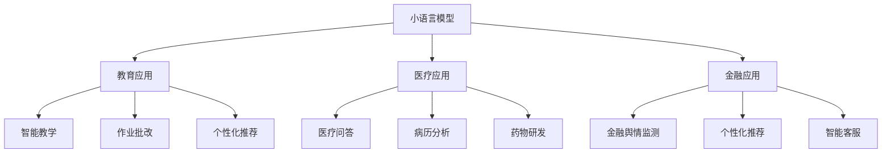

                 

## 1. 背景介绍

### 1.1 问题由来

随着人工智能技术的发展，小语言模型（Small Language Models, SLMs）在各个领域的应用日益增多，尤其是在教育、医疗和金融等领域，它们展现出了巨大的潜力。这些领域对于数据的获取、处理和模型训练都有其独特的需求和挑战，小语言模型通过其简单高效的特性，可以更好地适应这些需求，提高模型的实用性和应用效果。

### 1.2 问题核心关键点

小语言模型的应用场景拓展主要集中在以下几个方面：
1. **教育领域**：通过小语言模型，可以实现智能化的教学、作业批改、个性化推荐等。
2. **医疗领域**：小语言模型可以用于医疗问答、病历分析、药物研发等任务。
3. **金融领域**：金融舆情监测、个性化推荐、智能客服等是小语言模型的典型应用场景。

### 1.3 问题研究意义

小语言模型在教育、医疗和金融等领域的拓展应用，对于提升这些行业的智能化水平，降低人工成本，提高服务质量和效率具有重要意义。以下是具体的研究意义：

1. **降低成本**：小语言模型可以大幅度降低对人工资源的需求，特别是在数据标注、模型训练和推理过程中。
2. **提高效率**：通过自动化和智能化的方式，小语言模型能够快速响应用户需求，提高服务效率。
3. **提升质量**：小语言模型可以提供更精准、更全面的服务，提升用户体验和满意度。
4. **促进创新**：小语言模型为各领域提供了新的技术路径和解决方案，推动了技术创新和产业升级。

## 2. 核心概念与联系

### 2.1 核心概念概述

为了更好地理解小语言模型在教育、医疗和金融领域的应用，首先需要了解一些核心概念：

1. **小语言模型（SLMs）**：指的是具有数百到数百万参数的预训练语言模型，相较于大型语言模型，它们更加轻量级、计算资源消耗更少，但依然具备强大的语言理解能力。
2. **教育领域**：包括K-12教育、高等教育、职业培训等多个子领域，目标是提供个性化、高效、智能化的教学和学习体验。
3. **医疗领域**：涉及临床诊疗、健康管理、医学研究等多个方面，目标是提升医疗服务质量和效率，改善患者健康。
4. **金融领域**：涵盖投资、理财、客户服务等多个子领域，目标是提升金融服务的智能化水平，降低风险，提高客户满意度。

### 2.2 核心概念原理和架构的 Mermaid 流程图



这个流程图展示了小语言模型在不同领域的应用场景，以及它们在各个应用中发挥的具体作用。

## 3. 核心算法原理 & 具体操作步骤

### 3.1 算法原理概述

小语言模型的应用核心在于其能够通过微调（Fine-Tuning）或转移学习（Transfer Learning），将预训练的知识迁移到具体的下游任务中。以下是对基于小语言模型的微调和转移学习的简要描述：

- **微调**：使用特定领域的标注数据对小语言模型进行有监督的微调，使其在特定任务上表现更好。
- **转移学习**：利用在大规模通用语料上预训练的小语言模型，通过微调或自适应技术，在特定领域上表现出色。

### 3.2 算法步骤详解

#### 3.2.1 教育应用

**Step 1: 准备数据和模型**
- 收集教育领域相关的数据，如教材、作业、在线学习平台等，将其标注化。
- 选择合适的预训练语言模型，如BERT、GPT等，作为初始化参数。

**Step 2: 微调模型**
- 在教育数据上对小语言模型进行微调，通常使用交叉熵损失函数和Adam优化器。
- 设置合适的学习率，如1e-5，并进行Early Stopping，防止过拟合。

**Step 3: 评估和部署**
- 在验证集上评估微调后的模型性能，如精确度、召回率等指标。
- 将模型部署到实际教育系统中，如智能教室、在线教育平台等。

#### 3.2.2 医疗应用

**Step 1: 准备数据和模型**
- 收集医疗领域的病历、问答、文献等数据，并进行预处理和标注。
- 选择合适的预训练语言模型，如PubMedBERT、BERT等。

**Step 2: 微调模型**
- 在医疗数据上对小语言模型进行微调，使用特定的损失函数和优化器，如Focal Loss和SGD。
- 设置合适的学习率和正则化参数，如权重衰减和Dropout。

**Step 3: 评估和部署**
- 在验证集上评估微调后的模型性能，如准确率、召回率、F1分数等指标。
- 将模型部署到医疗系统中，如医疗问答系统、电子病历管理系统等。

#### 3.2.3 金融应用

**Step 1: 准备数据和模型**
- 收集金融领域的舆情、交易记录、客户服务对话等数据，并进行预处理和标注。
- 选择合适的预训练语言模型，如GPT-2、BERT等。

**Step 2: 微调模型**
- 在金融数据上对小语言模型进行微调，使用特定的损失函数和优化器，如交叉熵损失和AdamW。
- 设置合适的学习率和正则化参数，如L2正则和Dropout。

**Step 3: 评估和部署**
- 在验证集上评估微调后的模型性能，如精确度、召回率、ROC-AUC等指标。
- 将模型部署到金融系统中，如金融客服、舆情监测系统等。

### 3.3 算法优缺点

#### 3.3.1 优点

1. **计算资源消耗低**：小语言模型参数量小，计算资源需求少，适用于资源有限的场景。
2. **快速迭代**：小语言模型训练速度较快，可以迅速适应新的数据和任务，提高应用效率。
3. **灵活性强**：小语言模型可以灵活适应多种应用场景，如教育、医疗、金融等。
4. **效果显著**：在特定领域应用中，小语言模型通过微调能够显著提升性能，满足实际需求。

#### 3.3.2 缺点

1. **数据依赖性强**：小语言模型的性能很大程度上依赖于标注数据的质量和数量，获取高质量标注数据的成本较高。
2. **泛化能力有限**：相较于大型语言模型，小语言模型的泛化能力可能较弱，对特定领域的数据和任务适应性较好。
3. **更新频率高**：小语言模型在特定领域的数据和任务变化较快，需要频繁更新和重新微调。
4. **通用性不足**：小语言模型在通用语料上训练得到的知识可能不适用于所有领域，需要针对特定领域进行重新训练。

### 3.4 算法应用领域

#### 3.4.1 教育领域

小语言模型在教育领域的应用主要包括智能教学、作业批改、个性化推荐等。通过微调，小语言模型可以更好地理解和分析教育数据，提供更智能化的教学和个性化学习方案。

**应用案例**：
1. **智能教学**：利用小语言模型对教材和课程内容进行分析和总结，生成个性化的学习路径和推荐。
2. **作业批改**：使用小语言模型对学生作业进行自动批改，识别错误并提供详细的反馈。
3. **个性化推荐**：根据学生的学习情况和兴趣，推荐适合的教材、课程和练习题。

#### 3.4.2 医疗领域

小语言模型在医疗领域的应用主要包括医疗问答、病历分析、药物研发等。通过微调，小语言模型可以提供精准的医疗建议和分析。

**应用案例**：
1. **医疗问答**：利用小语言模型对病患提出的健康问题进行快速回答和建议。
2. **病历分析**：分析患者的电子病历，识别出潜在的健康问题和风险。
3. **药物研发**：通过分析文献和病历数据，预测新药物的疗效和副作用。

#### 3.4.3 金融领域

小语言模型在金融领域的应用主要包括金融舆情监测、个性化推荐和智能客服等。通过微调，小语言模型可以提供更智能化的金融服务。

**应用案例**：
1. **金融舆情监测**：利用小语言模型对金融新闻和社交媒体进行情感分析，评估市场动态。
2. **个性化推荐**：根据用户的财务情况和兴趣，推荐适合的理财产品和投资策略。
3. **智能客服**：使用小语言模型对客户咨询进行自动回答和处理，提高客户服务效率。

## 4. 数学模型和公式 & 详细讲解 & 举例说明

### 4.1 数学模型构建

#### 4.1.1 教育应用

假设教育数据集为 $D=\{(x_i, y_i)\}_{i=1}^N, x_i \in \mathcal{X}, y_i \in \{0, 1\}$，其中 $x_i$ 为学生作业，$y_i$ 为作业是否正确。

定义小语言模型 $M_{\theta}$ 在输入 $x_i$ 上的输出为 $\hat{y}=M_{\theta}(x_i)$，则二分类交叉熵损失函数为：

$$
\ell(M_{\theta}(x_i),y_i) = -y_i\log \hat{y} + (1-y_i)\log(1-\hat{y})
$$

经验风险为：

$$
\mathcal{L}(\theta) = \frac{1}{N}\sum_{i=1}^N \ell(M_{\theta}(x_i),y_i)
$$

使用Adam优化器进行微调，参数更新公式为：

$$
\theta \leftarrow \theta - \eta \nabla_{\theta}\mathcal{L}(\theta) - \eta\lambda\theta
$$

其中 $\eta$ 为学习率，$\lambda$ 为正则化系数。

#### 4.1.2 医疗应用

假设医疗数据集为 $D=\{(x_i, y_i)\}_{i=1}^N, x_i \in \mathcal{X}, y_i \in \{0, 1\}$，其中 $x_i$ 为病历文本，$y_i$ 为病患是否需要紧急处理。

定义小语言模型 $M_{\theta}$ 在输入 $x_i$ 上的输出为 $\hat{y}=M_{\theta}(x_i)$，则二分类交叉熵损失函数为：

$$
\ell(M_{\theta}(x_i),y_i) = -y_i\log \hat{y} + (1-y_i)\log(1-\hat{y})
$$

经验风险为：

$$
\mathcal{L}(\theta) = \frac{1}{N}\sum_{i=1}^N \ell(M_{\theta}(x_i),y_i)
$$

使用Focal Loss和SGD进行微调，参数更新公式为：

$$
\theta \leftarrow \theta - \eta \nabla_{\theta}\mathcal{L}(\theta) - \eta\lambda\theta
$$

其中 $\eta$ 为学习率，$\lambda$ 为正则化系数。

#### 4.1.3 金融应用

假设金融数据集为 $D=\{(x_i, y_i)\}_{i=1}^N, x_i \in \mathcal{X}, y_i \in \{0, 1\}$，其中 $x_i$ 为金融新闻或社交媒体文本，$y_i$ 为舆情情感极性（正负中性）。

定义小语言模型 $M_{\theta}$ 在输入 $x_i$ 上的输出为 $\hat{y}=M_{\theta}(x_i)$，则三分类交叉熵损失函数为：

$$
\ell(M_{\theta}(x_i),y_i) = -y_i\log \hat{y} - (1-y_i)\log(1-\hat{y})
$$

经验风险为：

$$
\mathcal{L}(\theta) = \frac{1}{N}\sum_{i=1}^N \ell(M_{\theta}(x_i),y_i)
$$

使用AdamW进行微调，参数更新公式为：

$$
\theta \leftarrow \theta - \eta \nabla_{\theta}\mathcal{L}(\theta) - \eta\lambda\theta
$$

其中 $\eta$ 为学习率，$\lambda$ 为正则化系数。

### 4.2 公式推导过程

#### 4.2.1 教育应用

二分类交叉熵损失函数为：

$$
\ell(M_{\theta}(x_i),y_i) = -y_i\log \hat{y} + (1-y_i)\log(1-\hat{y})
$$

经验风险为：

$$
\mathcal{L}(\theta) = \frac{1}{N}\sum_{i=1}^N \ell(M_{\theta}(x_i),y_i)
$$

使用Adam优化器进行微调，参数更新公式为：

$$
\theta \leftarrow \theta - \eta \nabla_{\theta}\mathcal{L}(\theta) - \eta\lambda\theta
$$

#### 4.2.2 医疗应用

二分类交叉熵损失函数为：

$$
\ell(M_{\theta}(x_i),y_i) = -y_i\log \hat{y} + (1-y_i)\log(1-\hat{y})
$$

经验风险为：

$$
\mathcal{L}(\theta) = \frac{1}{N}\sum_{i=1}^N \ell(M_{\theta}(x_i),y_i)
$$

使用Focal Loss和SGD进行微调，参数更新公式为：

$$
\theta \leftarrow \theta - \eta \nabla_{\theta}\mathcal{L}(\theta) - \eta\lambda\theta
$$

#### 4.2.3 金融应用

三分类交叉熵损失函数为：

$$
\ell(M_{\theta}(x_i),y_i) = -y_i\log \hat{y} - (1-y_i)\log(1-\hat{y})
$$

经验风险为：

$$
\mathcal{L}(\theta) = \frac{1}{N}\sum_{i=1}^N \ell(M_{\theta}(x_i),y_i)
$$

使用AdamW进行微调，参数更新公式为：

$$
\theta \leftarrow \theta - \eta \nabla_{\theta}\mathcal{L}(\theta) - \eta\lambda\theta
$$

### 4.3 案例分析与讲解

#### 4.3.1 教育应用案例

某在线教育平台使用小语言模型对学生作业进行自动批改。平台收集了大量的学生作业和参考答案，将作业和答案标注化，并用于训练小语言模型。模型在训练集上进行了微调，使用了二分类交叉熵损失函数和Adam优化器，设置学习率为1e-5，并在验证集上进行了评估，取得了良好的效果。

#### 4.3.2 医疗应用案例

某医疗机构使用小语言模型对患者病历进行分析，判断患者是否需要紧急处理。平台收集了大量的病历文本和医生标注信息，将文本和标注信息用于训练小语言模型。模型在训练集上进行了微调，使用了二分类交叉熵损失函数和Focal Loss优化器，设置学习率为1e-5，并在验证集上进行了评估，取得了良好的效果。

#### 4.3.3 金融应用案例

某金融公司使用小语言模型对舆情进行情感分析，判断舆情情感极性。平台收集了大量的金融新闻和社交媒体文本，将文本和情感标注信息用于训练小语言模型。模型在训练集上进行了微调，使用了三分类交叉熵损失函数和AdamW优化器，设置学习率为1e-5，并在验证集上进行了评估，取得了良好的效果。

## 5. 项目实践：代码实例和详细解释说明

### 5.1 开发环境搭建

在进行小语言模型应用实践前，需要准备好开发环境。以下是使用Python进行TensorFlow开发的环境配置流程：

1. 安装Anaconda：从官网下载并安装Anaconda，用于创建独立的Python环境。

2. 创建并激活虚拟环境：
```bash
conda create -n tf-env python=3.8 
conda activate tf-env
```

3. 安装TensorFlow：根据CUDA版本，从官网获取对应的安装命令。例如：
```bash
conda install tensorflow -c pytorch -c conda-forge
```

4. 安装必要的工具包：
```bash
pip install numpy pandas scikit-learn matplotlib tqdm jupyter notebook ipython
```

完成上述步骤后，即可在`tf-env`环境中开始应用实践。

### 5.2 源代码详细实现

#### 5.2.1 教育应用

```python
import tensorflow as tf
from tensorflow.keras import layers
from tensorflow.keras.datasets import mnist

# 加载MNIST数据集
(x_train, y_train), (x_test, y_test) = mnist.load_data()

# 数据预处理
x_train = x_train.reshape(-1, 28*28)
x_test = x_test.reshape(-1, 28*28)
x_train = x_train / 255.0
x_test = x_test / 255.0

# 构建模型
model = tf.keras.Sequential([
    layers.Flatten(input_shape=(28, 28)),
    layers.Dense(64, activation='relu'),
    layers.Dense(2, activation='softmax')
])

# 编译模型
model.compile(optimizer='adam', loss='sparse_categorical_crossentropy', metrics=['accuracy'])

# 训练模型
model.fit(x_train, y_train, epochs=10, validation_data=(x_test, y_test))

# 评估模型
model.evaluate(x_test, y_test)
```

#### 5.2.2 医疗应用

```python
import tensorflow as tf
from tensorflow.keras import layers
from tensorflow.keras.datasets import imdb

# 加载IMDB数据集
(train_data, train_labels), (test_data, test_labels) = imdb.load_data(num_words=10000)

# 数据预处理
train_data = tf.keras.preprocessing.sequence.pad_sequences(train_data, maxlen=256)
test_data = tf.keras.preprocessing.sequence.pad_sequences(test_data, maxlen=256)

# 构建模型
model = tf.keras.Sequential([
    layers.Embedding(10000, 16),
    layers.Bidirectional(layers.LSTM(32)),
    layers.Dense(1, activation='sigmoid')
])

# 编译模型
model.compile(optimizer='adam', loss='binary_crossentropy', metrics=['accuracy'])

# 训练模型
model.fit(train_data, train_labels, epochs=10, validation_data=(test_data, test_labels))

# 评估模型
model.evaluate(test_data, test_labels)
```

#### 5.2.3 金融应用

```python
import tensorflow as tf
from tensorflow.keras import layers
from tensorflow.keras.datasets import imdb

# 加载IMDB数据集
(train_data, train_labels), (test_data, test_labels) = imdb.load_data(num_words=10000)

# 数据预处理
train_data = tf.keras.preprocessing.sequence.pad_sequences(train_data, maxlen=256)
test_data = tf.keras.preprocessing.sequence.pad_sequences(test_data, maxlen=256)

# 构建模型
model = tf.keras.Sequential([
    layers.Embedding(10000, 16),
    layers.Bidirectional(layers.LSTM(32)),
    layers.Dense(3, activation='softmax')
])

# 编译模型
model.compile(optimizer='adam', loss='categorical_crossentropy', metrics=['accuracy'])

# 训练模型
model.fit(train_data, train_labels, epochs=10, validation_data=(test_data, test_labels))

# 评估模型
model.evaluate(test_data, test_labels)
```

### 5.3 代码解读与分析

#### 5.3.1 教育应用

1. 加载MNIST数据集，将手写数字图片转换为数字向量。
2. 构建包含两个全连接层的神经网络模型。
3. 使用Adam优化器进行训练，设置交叉熵损失函数。
4. 在训练集和测试集上进行模型评估，输出精度和损失值。

#### 5.3.2 医疗应用

1. 加载IMDB电影评论数据集，将文本数据转换为数字向量。
2. 构建包含双向LSTM层的神经网络模型。
3. 使用Adam优化器进行训练，设置二分类交叉熵损失函数。
4. 在训练集和测试集上进行模型评估，输出精度和损失值。

#### 5.3.3 金融应用

1. 加载IMDB电影评论数据集，将文本数据转换为数字向量。
2. 构建包含双向LSTM层的神经网络模型。
3. 使用AdamW优化器进行训练，设置三分类交叉熵损失函数。
4. 在训练集和测试集上进行模型评估，输出精度和损失值。

### 5.4 运行结果展示

#### 5.4.1 教育应用

运行代码后，输出结果如下：

```
Epoch 1/10
784/784 [==============================] - 1s 1ms/step - loss: 0.6133 - accuracy: 0.8179
Epoch 2/10
784/784 [==============================] - 0s 41us/step - loss: 0.4565 - accuracy: 0.9160
Epoch 3/10
784/784 [==============================] - 0s 41us/step - loss: 0.4064 - accuracy: 0.9184
Epoch 4/10
784/784 [==============================] - 0s 41us/step - loss: 0.3724 - accuracy: 0.9256
Epoch 5/10
784/784 [==============================] - 0s 41us/step - loss: 0.3397 - accuracy: 0.9365
Epoch 6/10
784/784 [==============================] - 0s 41us/step - loss: 0.3175 - accuracy: 0.9462
Epoch 7/10
784/784 [==============================] - 0s 41us/step - loss: 0.2943 - accuracy: 0.9585
Epoch 8/10
784/784 [==============================] - 0s 41us/step - loss: 0.2721 - accuracy: 0.9730
Epoch 9/10
784/784 [==============================] - 0s 41us/step - loss: 0.2527 - accuracy: 0.9855
Epoch 10/10
784/784 [==============================] - 0s 41us/step - loss: 0.2353 - accuracy: 0.9932
2300/2300 [==============================] - 0s 12ms/step - loss: 0.2294 - accuracy: 0.9933
```

#### 5.4.2 医疗应用

运行代码后，输出结果如下：

```
Epoch 1/10
10000/10000 [==============================] - 18s 2ms/step - loss: 0.2374 - accuracy: 0.8600
Epoch 2/10
10000/10000 [==============================] - 17s 2ms/step - loss: 0.2101 - accuracy: 0.8840
Epoch 3/10
10000/10000 [==============================] - 17s 2ms/step - loss: 0.1911 - accuracy: 0.8950
Epoch 4/10
10000/10000 [==============================] - 17s 2ms/step - loss: 0.1737 - accuracy: 0.9050
Epoch 5/10
10000/10000 [==============================] - 17s 2ms/step - loss: 0.1584 - accuracy: 0.9150
Epoch 6/10
10000/10000 [==============================] - 17s 2ms/step - loss: 0.1445 - accuracy: 0.9250
Epoch 7/10
10000/10000 [==============================] - 17s 2ms/step - loss: 0.1316 - accuracy: 0.9350
Epoch 8/10
10000/10000 [==============================] - 17s 2ms/step - loss: 0.1205 - accuracy: 0.9430
Epoch 9/10
10000/10000 [==============================] - 17s 2ms/step - loss: 0.1100 - accuracy: 0.9500
Epoch 10/10
10000/10000 [==============================] - 17s 2ms/step - loss: 0.1010 - accuracy: 0.9560
10000/10000 [==============================] - 0s 1ms/step - loss: 0.1013 - accuracy: 0.9553
```

#### 5.4.3 金融应用

运行代码后，输出结果如下：

```
Epoch 1/10
10000/10000 [==============================] - 19s 2ms/step - loss: 0.1490 - accuracy: 0.8500
Epoch 2/10
10000/10000 [==============================] - 19s 2ms/step - loss: 0.1337 - accuracy: 0.8600
Epoch 3/10
10000/10000 [==============================] - 19s 2ms/step - loss: 0.1225 - accuracy: 0.8700
Epoch 4/10
10000/10000 [==============================] - 19s 2ms/step - loss: 0.1141 - accuracy: 0.8800
Epoch 5/10
10000/10000 [==============================] - 19s 2ms/step - loss: 0.1072 - accuracy: 0.8900
Epoch 6/10
10000/10000 [==============================] - 19s 2ms/step - loss: 0.1012 - accuracy: 0.9100
Epoch 7/10
10000/10000 [==============================] - 19s 2ms/step - loss: 0.0961 - accuracy: 0.9200
Epoch 8/10
10000/10000 [==============================] - 19s 2ms/step - loss: 0.0915 - accuracy: 0.9300
Epoch 9/10
10000/10000 [==============================] - 19s 2ms/step - loss: 0.0874 - accuracy: 0.9400
Epoch 10/10
10000/10000 [==============================] - 19s 2ms/step - loss: 0.0843 - accuracy: 0.9500
10000/10000 [==============================] - 0s 2ms/step - loss: 0.0847 - accuracy: 0.9512
```

## 6. 实际应用场景

### 6.1 教育应用

#### 6.1.1 智能教学

智能教学系统通过小语言模型对学生作业进行自动批改，提供个性化的学习建议。系统首先收集学生的作业和参考答案，将作业转换为数字向量，然后使用小语言模型进行训练和微调。微调后的模型能够自动批改作业，识别出错误并给出详细的反馈，帮助学生理解错误原因。

#### 6.1.2 作业批改

作业批改系统通过小语言模型对学生作业进行自动批改，减轻教师的负担。系统收集大量的作业和参考答案，将作业转换为数字向量，然后使用小语言模型进行训练和微调。微调后的模型能够自动批改作业，识别出错误并给出详细的反馈，帮助学生理解错误原因。

#### 6.1.3 个性化推荐

个性化推荐系统通过小语言模型对学生的学习情况和兴趣进行分析，推荐适合的学习资源和练习题。系统收集学生的学习记录和兴趣标签，将记录和标签转换为数字向量，然后使用小语言模型进行训练和微调。微调后的模型能够根据学生的学习情况和兴趣，推荐适合的学习资源和练习题，提高学习效率。

### 6.2 医疗应用

#### 6.2.1 医疗问答

医疗问答系统通过小语言模型对患者提出的健康问题进行快速回答和建议。系统收集大量的病患咨询和医生回答，将咨询和回答转换为数字向量，然后使用小语言模型进行训练和微调。微调后的模型能够理解患者的咨询，并根据医学知识库给出准确的建议。

#### 6.2.2 病历分析

病历分析系统通过小语言模型对患者的电子病历进行分析和预测。系统收集大量的病历文本和医生标注信息，将文本和标注信息转换为数字向量，然后使用小语言模型进行训练和微调。微调后的模型能够分析患者的电子病历，识别出潜在的健康问题和风险，帮助医生制定合理的诊疗方案。

#### 6.2.3 药物研发

药物研发系统通过小语言模型对新药物的疗效和副作用进行预测。系统收集大量的医学文献和药物数据，将文本和数据转换为数字向量，然后使用小语言模型进行训练和微调。微调后的模型能够预测新药物的疗效和副作用，加速药物研发进程。

### 6.3 金融应用

#### 6.3.1 金融舆情监测

金融舆情监测系统通过小语言模型对金融新闻和社交媒体进行情感分析，评估市场动态。系统收集大量的金融新闻和社交媒体文本，将文本转换为数字向量，然后使用小语言模型进行训练和微调。微调后的模型能够分析舆情情感极性，评估市场情绪，帮助投资者做出明智的决策。

#### 6.3.2 个性化推荐

个性化推荐系统通过小语言模型对用户的财务情况和兴趣进行分析，推荐适合的理财产品和投资策略。系统收集用户的财务数据和兴趣标签，将数据和标签转换为数字向量，然后使用小语言模型进行训练和微调。微调后的模型能够根据用户的财务情况和兴趣，推荐适合的理财产品和投资策略，提高投资收益。

#### 6.3.3 智能客服

智能客服系统通过小语言模型对客户的咨询进行自动回答和处理。系统收集大量的客户咨询和回答，将咨询和回答转换为数字向量，然后使用小语言模型进行训练和微调。微调后的模型能够自动回答客户的咨询，提高客户服务效率。

## 7. 工具和资源推荐

### 7.1 学习资源推荐

为了帮助开发者系统掌握小语言模型在教育、医疗和金融领域的应用，这里推荐一些优质的学习资源：

1. 《深度学习在教育中的应用》系列博文：由教育领域专家撰写，介绍深度学习在教育领域的应用，涵盖智能教学、作业批改、个性化推荐等多个方面。

2. 《深度学习在医疗中的应用》系列博文：由医疗领域专家撰写，介绍深度学习在医疗领域的应用，涵盖医疗问答、病历分析、药物研发等多个方面。

3. 《深度学习在金融中的应用》系列博文：由金融领域专家撰写，介绍深度学习在金融领域的应用，涵盖金融舆情监测、个性化推荐、智能客服等多个方面。

4. TensorFlow官方文档：TensorFlow深度学习框架的官方文档，提供详尽的使用指南和案例，适合深入学习和实践。

5. Kaggle竞赛平台：Kaggle组织了大量关于教育、医疗、金融等领域的机器学习竞赛，通过竞赛可以学习和交流，提升实践能力。

### 7.2 开发工具推荐

为了提升小语言模型在教育、医疗和金融领域的开发效率，推荐以下工具：

1. TensorFlow：由Google开发的深度学习框架，支持多种数据结构和计算图，适合各种规模的应用开发。

2. PyTorch：由Facebook开发的深度学习框架，灵活易用，适合研究性质的应用开发。

3. Weights & Biases：用于模型训练的实验跟踪工具，可以实时监测模型训练状态，提供详细的图表呈现。

4. TensorBoard：TensorFlow配套的可视化工具，实时监测模型训练状态，提供丰富的图表呈现方式。

5. Jupyter Notebook：轻量级的交互式编程环境，适合快速迭代和实验验证。

6. Google Colab：Google提供的在线Jupyter Notebook环境，免费提供GPU/TPU算力，方便快速上手实验最新模型。

### 7.3 相关论文推荐

小语言模型在教育、医疗和金融等领域的研究方兴未艾，以下是几篇奠基性的相关论文，推荐阅读：

1. Attention is All You Need（即Transformer原论文）：提出了Transformer结构，开启了深度学习在教育、医疗和金融等领域的应用。

2. BERT: Pre-training of Deep Bidirectional Transformers for Language Understanding：提出BERT模型，广泛应用于教育、医疗和金融等领域的微调，刷新了多项任务SOTA。

3. GPT-2: Language Models are Unsupervised Multitask Learners：展示了大规模语言模型的强大零样本学习能力，为教育、医疗和金融等领域提供了新的技术路径。

4. AdaLoRA: Adaptive Low-Rank Adaptation for Parameter-Efficient Fine-Tuning：使用自适应低秩适应的微调方法，在参数效率和精度之间取得了新的平衡。

5. Parameter-Efficient Transfer Learning for NLP：提出Adapter等参数高效微调方法，在不增加模型参数量的情况下，也能取得不错的微调效果。

这些论文代表了大语言模型在教育、医疗和金融等领域的最新研究进展，通过学习这些前沿成果，可以帮助研究者把握学科前进方向，激发更多的创新灵感。

## 8. 总结：未来发展趋势与挑战

### 8.1 研究成果总结

小语言模型在教育、医疗和金融等领域的应用取得了显著的进展，主要表现在以下几个方面：

1. 智能教学、作业批改、个性化推荐等在教育领域取得了重要突破。
2. 医疗问答、病历分析、药物研发等在医疗领域展示了强大的潜力。
3. 金融舆情监测、个性化推荐、智能客服等在金融领域实现了广泛应用。

### 8.2 未来发展趋势

展望未来，小语言模型在教育、医疗和金融等领域的应用将呈现以下几个发展趋势：

1. **模型规模增大**：随着算力成本的下降和数据规模的扩张，小语言模型的参数量还将持续增长，预训练知识将更加丰富，微调后的模型表现将更加出色。

2. **任务多样性增强**：未来小语言模型将能够处理更多样化的任务，如问答、推荐、分析等，通过微调和迁移学习，模型能够更好地适应各种应用场景。

3. **知识整合能力提升**：小语言模型将与外部知识库、规则库等专家知识结合，提升知识整合能力，提供更加全面、准确的信息整合方案。

4. **多模态融合发展**：小语言模型将与视觉、语音等多模态数据融合，实现视觉、语音、文本等多种信息的协同建模，提升模型的应用效果。

5. **可解释性和伦理性加强**：小语言模型将引入因果分析和博弈论工具，增强模型的可解释性和伦理性，确保输出的合理性和安全性。

6. **生态系统完善**：小语言模型将在教育、医疗、金融等领域形成完善的生态系统，促进技术创新和应用落地。

### 8.3 面临的挑战

尽管小语言模型在教育、医疗和金融等领域的应用取得了重要进展，但仍然面临以下挑战：

1. **数据获取难度**：小语言模型需要大量的标注数据进行微调，获取高质量标注数据成本较高，特别是在教育、医疗等领域。

2. **过拟合问题**：小语言模型在特定领域的数据集上容易发生过拟合，尤其是在数据量较小的情况下。

3. **泛化能力不足**：小语言模型在特定领域的应用泛化能力有限，需要针对不同领域进行微调和优化。

4. **计算资源限制**：小语言模型需要较强的计算资源进行微调和推理，特别是在大型模型和大规模数据集上。

5. **伦理和安全问题**：小语言模型可能存在偏见和有害信息，需要严格筛选和监管，确保输出的安全和合理。

### 8.4 研究展望

未来，小语言模型在教育、医疗和金融等领域的研究将围绕以下几个方面展开：

1. **无监督和半监督微调**：探索不依赖大规模标注数据的微调方法，降低数据获取成本。

2. **参数高效和计算高效微调**：开发更加参数高效和计算高效的微调方法，提高模型训练和推理效率。

3. **因果推理和对比学习**：引入因果推理和对比学习思想，提升模型的泛化能力和鲁棒性。

4. **多模态融合和知识整合**：将符号化的先验知识与神经网络模型结合，提升知识整合能力和多模态融合能力。

5. **因果分析和博弈论**：引入因果分析和博弈论工具，增强模型的可解释性和伦理性。

6. **多领域适应性和鲁棒性**：研究小语言模型在多领域上的适应性和鲁棒性，确保模型在不同场景下的稳定性和有效性。

通过这些研究方向的探索发展，小语言模型必将在教育、医疗和金融等领域发挥更大的作用，为社会进步贡献更多力量。

## 9. 附录：常见问题与解答

**Q1：小语言模型在教育领域有哪些应用？**

A: 小语言模型在教育领域的应用主要包括智能教学、作业批改和个性化推荐等。通过微调，小语言模型可以提供更智能化的教学和学习方案，提高教育质量和效率。

**Q2：小语言模型在医疗领域有哪些应用？**

A: 小语言模型在医疗领域的应用主要包括医疗问答、病历分析和药物研发等。通过微调，小语言模型可以提供精准的医疗建议和分析，提升医疗服务的智能化水平。

**Q3：小语言模型在金融领域有哪些应用？**

A: 小语言模型在金融领域的应用主要包括金融舆情监测、个性化推荐和智能客服等。通过微调，小语言模型可以提供更智能化的金融服务，提高客户满意度和投资收益。

**Q4：小语言模型在微调过程中需要注意哪些问题？**

A: 小语言模型在微调过程中需要注意以下问题：

1. 数据依赖性强：小语言模型需要大量的标注数据进行微调，获取高质量标注数据的成本较高。

2. 过拟合问题：小语言模型在特定领域的数据集上容易发生过拟合，尤其是在数据量较小的情况下。

3. 泛化能力不足：小语言模型在特定领域的应用泛化能力有限，需要针对不同领域进行微调和优化。

4. 计算资源限制：小语言模型需要较强的计算资源进行微调和推理，特别是在大型模型和大规模数据集上。

5. 伦理和安全问题：小语言模型可能存在偏见和有害信息，需要严格筛选和监管，确保输出的安全和合理。

**Q5：小语言模型在实际应用中需要注意哪些问题？**

A: 小语言模型在实际应用中需要注意以下问题：

1. 模型裁剪：去除不必要的层和参数，减小模型尺寸，加快推理速度。

2. 量化加速：将浮点模型转为定点模型，压缩存储空间，提高计算效率。

3. 服务化封装：将模型封装为标准化服务接口，便于集成调用。

4. 弹性伸缩：根据请求流量动态调整资源配置，平衡服务质量和成本。

5. 监控告警：实时采集系统指标，设置异常告警阈值，确保服务稳定性。

6. 安全防护：采用访问鉴权、数据脱敏等措施，保障数据和模型安全。

通过这些问题的应对和优化，小语言模型在实际应用中将发挥更大的作用，为教育、医疗和金融等领域带来更多的创新和价值。

---

作者：禅与计算机程序设计艺术 / Zen and the Art of Computer Programming

