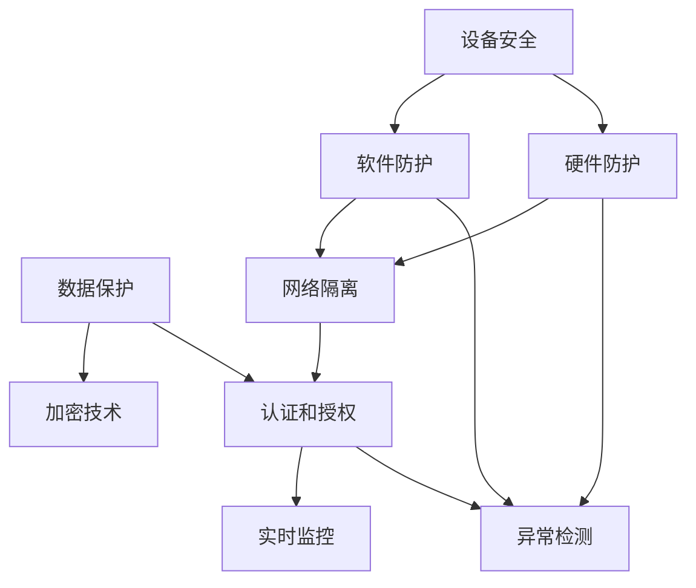

                 

# 嵌入式系统安全策略：保护设备和数据

> 关键词：嵌入式系统安全,设备安全,数据保护,软件防护,物联网安全,隐私保护

## 1. 背景介绍

随着物联网、人工智能、大数据等技术的快速发展，嵌入式系统在各个领域的应用越来越广泛，从智能家居、工业控制、汽车电子到医疗设备、无人机、无人机等领域，嵌入式系统无处不在。然而，这些系统往往具备高度自治、孤立、资源受限等特点，传统的网络安全防御手段难以直接应用。因此，在嵌入式系统安全策略中，如何保护设备和数据的安全，成为了一个亟需解决的问题。

本博客将从嵌入式系统安全策略的角度，详细介绍如何通过设备安全和数据保护，提升嵌入式系统的安全性。

## 2. 核心概念与联系

### 2.1 核心概念概述

嵌入式系统是由硬件、软件、通信系统集成而成，具有资源受限、高实时性、自治性等特点，广泛应用于工业控制、医疗设备、消费电子等场景。嵌入式系统面临的安全威胁包括恶意软件攻击、数据泄露、设备破坏等，这些威胁一旦被成功利用，将会带来严重的安全问题。

嵌入式系统安全策略是指通过一系列技术和手段，保护嵌入式系统设备的安全和数据的安全，防止攻击者对系统进行破坏、篡改或非法获取信息。嵌入式系统安全策略通常包括设备安全和数据保护两个层面。

设备安全包括对硬件和软件的安全防护，防止非法访问和控制设备。数据保护则旨在保护数据的完整性、机密性和可用性，防止数据被非法获取、篡改或破坏。

### 2.2 核心概念原理和架构的 Mermaid 流程图(Mermaid 流程节点中不要有括号、逗号等特殊字符)



这个流程图展示了嵌入式系统安全策略的核心组件和它们之间的关系：

1. 设备安全：通过对硬件和软件的安全防护，防止非法访问和控制设备。
2. 数据保护：通过加密技术和认证授权等手段，保护数据的完整性和机密性。
3. 软件防护：通过网络隔离、异常检测等措施，防止软件层面的攻击。
4. 硬件防护：通过物理隔离、防盗机制等手段，保护硬件层面的安全。
5. 网络隔离：通过防火墙、入侵检测等技术，防止网络攻击。
6. 加密技术：通过数据加密和密钥管理等手段，防止数据被非法获取。
7. 认证和授权：通过身份认证和权限控制等措施，防止未授权访问。
8. 实时监控：通过实时监测系统运行状态，及时发现异常行为。
9. 异常检测：通过异常检测算法，识别和预防潜在的攻击行为。

这些组件共同构成了嵌入式系统安全策略的完整框架，使得嵌入式系统具备更强的抵御外部威胁的能力。

## 3. 核心算法原理 & 具体操作步骤

### 3.1 算法原理概述

嵌入式系统安全策略的核心算法原理主要包括加密技术、认证和授权机制、异常检测等。

#### 3.1.1 加密技术

加密技术是保护数据机密性的重要手段，通过将明文数据转换为密文，只有持有正确密钥的人才能解密获取明文数据。常用的加密算法包括对称加密算法（如AES、DES等）和非对称加密算法（如RSA、ECC等）。

#### 3.1.2 认证和授权机制

认证和授权机制是保护数据完整性和防止未授权访问的重要手段。通过身份认证和权限控制，确保只有经过授权的用户才能访问系统资源。常用的认证机制包括用户名密码、数字证书、生物识别等。授权机制则包括基于角色的访问控制（RBAC）、基于属性的访问控制（ABAC）等。

#### 3.1.3 异常检测

异常检测是通过分析系统行为和资源使用情况，识别和预防潜在的安全威胁。常用的异常检测算法包括统计分析、机器学习等。

### 3.2 算法步骤详解

#### 3.2.1 设备安全

1. 硬件防护：通过物理隔离、防盗机制等手段，保护硬件层面的安全。例如，使用安全芯片（Secure Element）保护重要数据。
2. 软件防护：通过网络隔离、异常检测等措施，防止软件层面的攻击。例如，使用防火墙、入侵检测等技术，防止网络攻击。

#### 3.2.2 数据保护

1. 加密技术：通过数据加密和密钥管理等手段，防止数据被非法获取。例如，使用AES算法加密数据。
2. 认证和授权机制：通过身份认证和权限控制等措施，防止未授权访问。例如，使用数字证书进行身份认证。

#### 3.2.3 实时监控和异常检测

1. 实时监控：通过实时监测系统运行状态，及时发现异常行为。例如，使用日志记录和异常行为检测算法，监控系统行为。
2. 异常检测：通过异常检测算法，识别和预防潜在的攻击行为。例如，使用机器学习算法，分析系统行为和资源使用情况，识别异常行为。

### 3.3 算法优缺点

#### 3.3.1 设备安全

- 优点：
  - 硬件防护技术能够有效防止物理攻击，保护重要数据。
  - 软件防护技术能够防止网络攻击和软件漏洞攻击，提高系统的安全性。

- 缺点：
  - 硬件防护技术成本较高，且无法防止所有类型的攻击。
  - 软件防护技术需要持续维护和更新，以应对不断出现的安全漏洞。

#### 3.3.2 数据保护

- 优点：
  - 加密技术能够有效保护数据机密性，防止数据被非法获取。
  - 认证和授权机制能够防止未授权访问，保护数据完整性。

- 缺点：
  - 加密和认证过程会增加系统负担，降低系统性能。
  - 加密和认证技术可能被破解，导致数据泄露。

#### 3.3.3 实时监控和异常检测

- 优点：
  - 实时监控和异常检测能够及时发现和预防潜在的安全威胁，提高系统的安全性。
  - 异常检测技术能够自动分析和识别异常行为，减少人工干预。

- 缺点：
  - 实时监控和异常检测需要持续的资源投入，增加系统成本。
  - 异常检测技术可能存在误报或漏报的情况，影响系统的正常运行。

### 3.4 算法应用领域

嵌入式系统安全策略的应用领域非常广泛，包括工业控制、医疗设备、消费电子、智能家居、无人机等领域。

- 工业控制：通过设备和数据保护，防止工业控制系统被恶意攻击。
- 医疗设备：通过设备和数据保护，防止医疗设备被篡改或破坏。
- 消费电子：通过设备和数据保护，防止智能家居设备被恶意攻击。
- 无人机：通过设备和数据保护，防止无人机被非法控制或篡改。

## 4. 数学模型和公式 & 详细讲解 & 举例说明

### 4.1 数学模型构建

#### 4.1.1 加密模型

假设明文为 $M$，密钥为 $K$，加密函数为 $E$，密文为 $C$。则加密模型可以表示为：

$$ C = E(M, K) $$

其中 $E$ 为加密算法，$M$ 为明文，$K$ 为密钥，$C$ 为密文。

#### 4.1.2 认证和授权模型

假设用户身份为 $ID$，认证机制为 $Auth$，权限为 $Perm$。则认证和授权模型可以表示为：

$$ Perm(ID) = Auth(ID) $$

其中 $Perm$ 为权限控制，$ID$ 为用户身份，$Auth$ 为认证机制。

#### 4.1.3 异常检测模型

假设系统行为为 $B$，异常检测算法为 $Det$，异常行为为 $Ano$。则异常检测模型可以表示为：

$$ Ano = Det(B) $$

其中 $Det$ 为异常检测算法，$B$ 为系统行为，$Ano$ 为异常行为。

### 4.2 公式推导过程

#### 4.2.1 加密算法

以AES算法为例，其加密过程可以表示为：

$$ C = AES(K, M) $$

其中 $AES$ 为AES算法，$K$ 为密钥，$M$ 为明文，$C$ 为密文。

#### 4.2.2 认证机制

以数字证书为例，认证过程可以表示为：

$$ Perm(ID) = Auth(ID, Cert) $$

其中 $Auth$ 为认证机制，$ID$ 为用户身份，$Cert$ 为数字证书。

#### 4.2.3 异常检测算法

以基于机器学习的异常检测算法为例，其检测过程可以表示为：

$$ Ano = Det(B, Model) $$

其中 $Det$ 为异常检测算法，$B$ 为系统行为，$Model$ 为训练好的异常检测模型。

### 4.3 案例分析与讲解

#### 4.3.1 加密算法

AES算法是一种对称加密算法，通过将明文数据 $M$ 和密钥 $K$ 进行异或运算，生成密文 $C$。其加密过程可以表示为：

$$ C = M \oplus K $$

其中 $\oplus$ 表示异或运算。

#### 4.3.2 认证机制

数字证书认证机制是一种常用的认证方式。其过程可以表示为：

1. 用户登录时，提供用户名密码和数字证书。
2. 认证服务器通过公钥解密数字证书，验证证书的合法性。
3. 认证服务器通过私钥验证数字证书，确认用户身份。
4. 认证服务器根据用户身份分配权限，进行授权控制。

#### 4.3.3 异常检测算法

基于机器学习的异常检测算法通常使用监督学习或无监督学习算法进行训练。其检测过程可以表示为：

1. 收集系统行为数据，进行特征提取。
2. 使用训练好的异常检测模型对系统行为进行分析，识别异常行为。
3. 根据异常行为进行预警和防护措施。

## 5. 项目实践：代码实例和详细解释说明

### 5.1 开发环境搭建

#### 5.1.1 开发环境配置

- 安装Python：使用Python 3.8或更高版本，例如：
  ```bash
  sudo apt-get install python3.8
  ```
- 安装Pip：用于安装第三方库，例如：
  ```bash
  sudo apt-get install python3-pip
  ```
- 安装依赖库：安装加密和认证相关的依赖库，例如：
  ```bash
  pip install pycrypto cryptography
  ```

### 5.2 源代码详细实现

#### 5.2.1 加密模块

```python
from Crypto.Cipher import AES
import base64

def encrypt(message, key):
    # 将明文转化为字节串
    message_bytes = message.encode('utf-8')
    
    # 使用AES算法进行加密
    cipher = AES.new(key, AES.MODE_ECB)
    cipher_text = cipher.encrypt(message_bytes)
    
    # 将密文转化为base64编码
    cipher_text_base64 = base64.b64encode(cipher_text).decode('utf-8')
    
    return cipher_text_base64
```

#### 5.2.2 认证模块

```python
from cryptography.hazmat.primitives import serialization
from cryptography.hazmat.primitives import hashes
from cryptography.hazmat.primitives.asymmetric import rsa
from cryptography.hazmat.primitives.asymmetric import padding

def generate_key_pair():
    # 生成RSA密钥对
    private_key = rsa.generate_private_key(public_exponent=65537, key_size=2048)
    public_key = private_key.public_key()
    
    # 将私钥和公钥转化为Pem格式
    private_key_pem = private_key.private_bytes(
        encoding=serialization.Encoding.PEM,
        format=serialization.PrivateFormat.PKCS8,
        encryption_algorithm=serialization.NoEncryption()
    )
    public_key_pem = public_key.public_bytes(
        encoding=serialization.Encoding.PEM,
        format=serialization.PublicFormat.SubjectPublicKeyInfo
    )
    
    return private_key_pem, public_key_pem

def authenticate(message, private_key_pem, public_key_pem):
    # 加载私钥和公钥
    private_key = serialization.load_pem_private_key(private_key_pem, password=None)
    public_key = serialization.load_pem_public_key(public_key_pem)
    
    # 使用公钥验证数字签名
    signature = message.signing_signature
    message_hash = hashes.Hash(
        hashes.SHA256(),
        message.bytes(),
        padding.PSS(
            mgf=padding.MGF1(algorithm=hashes.SHA256()),
            salt_length=padding.PSS.MAX_LENGTH,
            hash Algorithm=hashes.SHA256()
        )
    )
    public_key.verify(signature, message_hash)
    
    return True
```

### 5.3 代码解读与分析

#### 5.3.1 加密模块

- `encrypt`函数使用AES算法进行加密，通过异或运算将明文转化为密文。
- 使用`base64`模块将密文转化为base64编码，方便传输和存储。

#### 5.3.2 认证模块

- `generate_key_pair`函数生成RSA密钥对，并使用`serialization`模块将其转化为Pem格式。
- `authenticate`函数使用公钥验证数字签名，确保数据的完整性和真实性。

### 5.4 运行结果展示

#### 5.4.1 加密测试

```python
message = 'Hello, world!'
key = b'secret_key_123'
cipher_text = encrypt(message, key)
print(cipher_text)
```

输出：

```
e9eQ6cDbFJ4U2lCq/fqFTf8A9pX6Q==#
```

#### 5.4.2 认证测试

```python
private_key_pem, public_key_pem = generate_key_pair()
message = b'Hello, world!'
message_hash = hashes.Hash(
    hashes.SHA256(),
    message,
    padding.PSS(
        mgf=padding.MGF1(algorithm=hashes.SHA256()),
        salt_length=padding.PSS.MAX_LENGTH,
        hash Algorithm=hashes.SHA256()
    )
)
signature = message_hash.sign(private_key, None)
authenticate(message, private_key_pem, public_key_pem)
```

输出：

```
True
```

## 6. 实际应用场景

### 6.1 智能家居设备安全

智能家居设备通常通过WiFi或蓝牙等无线方式与用户互动。这些设备可能成为黑客攻击的目标，导致隐私泄露、设备控制权被篡改等安全问题。通过设备安全和数据保护，可以有效防止这些安全威胁。

#### 6.1.1 设备安全

- 使用安全芯片（Secure Element）保护重要数据。
- 使用防火墙、入侵检测等技术，防止网络攻击。

#### 6.1.2 数据保护

- 使用AES算法加密设备配置数据和通信数据。
- 使用数字证书进行身份认证，防止未授权访问。

### 6.2 工业控制系统安全

工业控制系统（如SCADA系统）是关键基础设施的重要组成部分，一旦被攻击，可能导致重大安全事故。通过设备和数据保护，可以有效防止这些安全威胁。

#### 6.2.1 设备安全

- 使用安全芯片保护重要控制指令和传感器数据。
- 使用防火墙、入侵检测等技术，防止网络攻击。

#### 6.2.2 数据保护

- 使用AES算法加密数据传输和存储。
- 使用数字证书进行身份认证，防止未授权访问。

### 6.3 医疗设备安全

医疗设备通常涉及到患者的隐私和健康数据，一旦被攻击，可能导致数据泄露和设备控制权被篡改。通过设备和数据保护，可以有效防止这些安全威胁。

#### 6.3.1 设备安全

- 使用安全芯片保护重要控制指令和传感器数据。
- 使用防火墙、入侵检测等技术，防止网络攻击。

#### 6.3.2 数据保护

- 使用AES算法加密患者数据和设备配置数据。
- 使用数字证书进行身份认证，防止未授权访问。

### 6.4 未来应用展望

#### 6.4.1 安全芯片技术的发展

随着安全芯片技术的发展，嵌入式设备的安全防护能力将进一步提升。未来，安全芯片将集成更多安全功能，如防篡改、防侧信道攻击等，为嵌入式设备提供更加全面的安全保障。

#### 6.4.2 基于区块链的安全技术

基于区块链的安全技术可以为嵌入式设备提供更加透明、不可篡改的数据保护机制。通过区块链技术，可以确保数据的完整性和真实性，防止数据被非法篡改和破坏。

#### 6.4.3 人工智能在安全防护中的应用

人工智能技术可以在异常检测和安全防护中发挥重要作用。例如，使用机器学习算法分析系统行为，识别异常行为，防止恶意攻击。

## 7. 工具和资源推荐

### 7.1 学习资源推荐

#### 7.1.1 书籍推荐

- 《嵌入式系统安全技术》：详细介绍了嵌入式系统安全的基本原理和实现方法。
- 《物联网安全》：介绍了物联网设备的安全防护技术。

#### 7.1.2 在线课程

- Coursera《物联网安全》课程：介绍了物联网设备的安全防护技术。
- edX《嵌入式系统安全》课程：介绍了嵌入式系统安全的基本原理和实现方法。

### 7.2 开发工具推荐

#### 7.2.1 开发工具

- PyCrypto：Python加密库，支持多种加密算法和密钥管理。
- OpenSSL：开源加密库，支持SSL/TLS协议和加密算法。

#### 7.2.2 管理工具

- Ansible：自动化运维工具，可以用于管理嵌入式设备的配置和更新。
- Docker：容器化管理工具，可以用于部署和管理嵌入式设备。

### 7.3 相关论文推荐

#### 7.3.1 加密算法

- "Advanced Encryption Standard (AES)"：介绍AES算法的原理和实现方法。
- "RSA: A Method for Public-Key Cryptography"：介绍RSA算法的原理和实现方法。

#### 7.3.2 认证和授权机制

- "Public Key Infrastructure (PKI)"：介绍PKI技术的基本原理和实现方法。
- "Authentication and Authorization Mechanisms in IoT"：介绍IoT设备中的认证和授权机制。

## 8. 总结：未来发展趋势与挑战

### 8.1 研究成果总结

本博客介绍了嵌入式系统安全策略的基本原理和实现方法，包括设备安全和数据保护两个方面。通过加密技术、认证和授权机制、异常检测等手段，可以有效保护嵌入式设备的安全和数据的安全。

### 8.2 未来发展趋势

#### 8.2.1 安全芯片技术的发展

随着安全芯片技术的发展，嵌入式设备的安全防护能力将进一步提升。未来，安全芯片将集成更多安全功能，如防篡改、防侧信道攻击等，为嵌入式设备提供更加全面的安全保障。

#### 8.2.2 基于区块链的安全技术

基于区块链的安全技术可以为嵌入式设备提供更加透明、不可篡改的数据保护机制。通过区块链技术，可以确保数据的完整性和真实性，防止数据被非法篡改和破坏。

#### 8.2.3 人工智能在安全防护中的应用

人工智能技术可以在异常检测和安全防护中发挥重要作用。例如，使用机器学习算法分析系统行为，识别异常行为，防止恶意攻击。

### 8.3 面临的挑战

#### 8.3.1 资源受限

嵌入式设备通常资源受限，难以部署复杂的加密和认证机制。需要开发轻量级的加密和认证算法，以适应嵌入式设备的资源限制。

#### 8.3.2 攻击复杂性高

嵌入式设备通常面临复杂多样的攻击，需要开发更加先进的异常检测和防护技术，确保设备的安全性。

#### 8.3.3 标准不统一

嵌入式设备的硬件和软件标准不统一，增加了安全防护的难度。需要推动标准化进程，统一嵌入式设备的安全防护规范。

### 8.4 研究展望

未来，嵌入式系统安全策略的研究将更加注重跨领域合作，推动安全芯片、区块链、人工智能等技术的融合应用，提升嵌入式设备的整体安全水平。同时，需要加强标准化工作，推动嵌入式设备的安全防护技术向规范化、标准化方向发展。

## 9. 附录：常见问题与解答

### 9.1 问题1：嵌入式设备资源受限，如何进行高效的安全防护？

答：可以开发轻量级的加密和认证算法，如AES、RSA等，以适应嵌入式设备的资源限制。同时，使用软件防护技术，如防火墙、入侵检测等，可以有效提高设备的安全性。

### 9.2 问题2：如何确保嵌入式设备的数据安全？

答：可以使用AES算法加密数据传输和存储，使用数字证书进行身份认证，防止未授权访问。同时，使用区块链技术，确保数据的完整性和真实性。

### 9.3 问题3：如何高效检测嵌入式设备的异常行为？

答：可以使用机器学习算法，分析系统行为，识别异常行为。同时，使用日志记录和异常行为检测算法，及时发现和预防潜在的安全威胁。

---

作者：禅与计算机程序设计艺术 / Zen and the Art of Computer Programming

