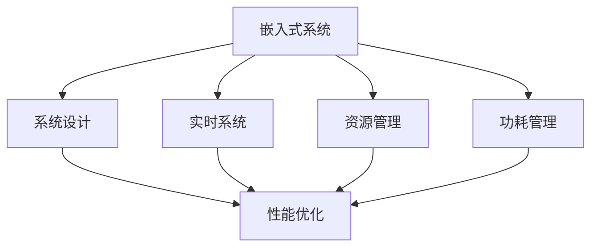

                 

# 嵌入式系统性能优化：提高效率

> 关键词：嵌入式系统,性能优化,系统设计,功耗管理,微控制器,实时系统

## 1. 背景介绍

### 1.1 问题由来

随着物联网(IoT)、车联网(ADAS)、智能家居等领域的快速崛起，嵌入式系统在消费电子、汽车、工业控制、医疗设备等领域的应用越来越广泛。嵌入式系统的小型化、低功耗、实时性、可靠性等特性，使得它们成为构建未来智能化的重要基础设施。然而，当前嵌入式系统面临着能源效率低、处理能力有限、实时性能不佳、安全性不高等挑战，这些问题严重制约了嵌入式系统的发展。

性能优化是大规模嵌入式系统面临的一项关键任务。嵌入式系统普遍采用微控制器、微处理器、片上系统(SoC)等硬件平台，这些平台通常具有低功耗、高实时性等优点，但也存在计算能力不足、资源受限等问题。优化嵌入式系统的性能，可以有效提升用户体验，降低能耗，延长设备使用寿命，并减少维护成本。

### 1.2 问题核心关键点

嵌入式系统性能优化的关键点包括：

- 硬件平台选择：根据实际需求选择合适的微控制器、微处理器、片上系统等硬件平台，平衡性能与功耗。
- 系统设计优化：采用优化的硬件结构、软件架构，充分利用硬件资源，提升系统的实时性能。
- 资源管理策略：使用高效的资源管理策略，如多任务调度、中断管理、内存管理等，确保系统的高效运行。
- 性能优化技术：采用高效的算法、数据结构、编译优化等技术，提升系统性能。
- 功耗管理策略：采用低功耗设计，如动态电压频率调节、休眠模式、软件唤醒等，降低系统能耗。

### 1.3 问题研究意义

嵌入式系统性能优化对于提高用户体验、降低能耗、延长设备使用寿命和维护成本、提升安全性等具有重要意义：

1. **提升用户体验**：性能优化的嵌入式系统可以提供更快、更稳定、更流畅的用户体验，增强用户粘性。
2. **降低能耗**：性能优化可以降低系统功耗，延长设备使用寿命，减少能源浪费。
3. **降低维护成本**：性能优化可以减少因性能不足导致的系统崩溃、异常，降低维护和故障修复成本。
4. **提升安全性**：性能优化可以有效减少系统崩溃和故障的发生，提升系统的安全性。

## 2. 核心概念与联系

### 2.1 核心概念概述

为了更好地理解嵌入式系统性能优化，本节将介绍几个密切相关的核心概念：

- **嵌入式系统(Embedded Systems)**：指嵌入在设备中，能够执行特定功能的硬件和软件系统的总称。嵌入式系统广泛应用在各种电子设备中，如智能手表、车载系统、工业控制设备等。
- **系统设计(System Design)**：指对嵌入式系统的硬件结构和软件架构进行设计，平衡性能、功耗、成本等指标。系统设计是嵌入式系统性能优化的重要环节。
- **实时系统(Real-Time Systems)**：指能够及时响应用户请求的系统。实时系统要求高可靠性、高实时性，必须通过优化保证任务在规定的时间内完成。
- **资源管理(Resource Management)**：指对嵌入式系统中的资源，如处理器、内存、IO等进行管理，确保系统的高效运行。
- **功耗管理(Power Management)**：指对嵌入式系统的功耗进行管理，通过硬件和软件手段降低系统能耗，延长设备使用寿命。

这些核心概念之间的逻辑关系可以通过以下Mermaid流程图来展示：



这个流程图展示了两类主要概念：

1. **嵌入式系统**：是性能优化的基础，需要经过系统设计、实时系统、资源管理、功耗管理等环节。
2. **性能优化**：是嵌入式系统优化的核心，系统设计、实时系统、资源管理、功耗管理等环节都是为了实现性能优化。

## 3. 核心算法原理 & 具体操作步骤
### 3.1 算法原理概述

嵌入式系统性能优化通常涉及到硬件、软件、架构等多个层面的优化，其核心目标是提高系统的实时性能、降低能耗，同时保证系统的可靠性、安全性。优化算法的原理主要包括：

- **硬件选择与优化**：根据应用场景选择合适的硬件平台，并进行硬件优化，如时钟频率调节、内存管理、IO接口优化等。
- **软件设计优化**：采用优化的编程语言、数据结构、算法，进行代码优化，提升系统的执行效率。
- **系统架构优化**：采用优化的系统架构，如微内核架构、多任务调度等，提升系统的资源利用率。
- **资源管理优化**：采用高效的资源管理策略，如内存管理、任务调度、中断处理等，确保系统的稳定运行。
- **功耗管理优化**：采用低功耗设计，如动态电压频率调节、休眠模式、软件唤醒等，降低系统的能耗。

### 3.2 算法步骤详解

嵌入式系统性能优化的步骤通常包括以下几个关键环节：

**Step 1: 需求分析与硬件选择**

- 分析应用场景和需求，明确系统要满足的功能和性能要求。
- 根据需求选择合适的微控制器、微处理器、片上系统等硬件平台。

**Step 2: 系统设计**

- 设计系统的硬件结构、软件架构，平衡性能、功耗、成本等指标。
- 确定系统的工作频率、内存大小、IO接口等关键参数。

**Step 3: 软件开发**

- 选择合适的编程语言和开发环境，进行代码编写。
- 采用优化的算法、数据结构、编译优化等技术，提升系统性能。

**Step 4: 资源管理**

- 实现高效的资源管理策略，如内存管理、任务调度、中断处理等。
- 确保系统的稳定运行，避免资源竞争导致的死锁、饥饿等问题。

**Step 5: 功耗管理**

- 实现低功耗设计，如动态电压频率调节、休眠模式、软件唤醒等。
- 定期监测系统功耗，优化功耗策略，延长设备使用寿命。

**Step 6: 测试与评估**

- 对系统进行全面的测试，包括性能测试、稳定性测试、功耗测试等。
- 根据测试结果，进行系统优化，不断提升系统性能。

### 3.3 算法优缺点

嵌入式系统性能优化方法具有以下优点：

1. **提升性能**：通过硬件优化、软件优化、架构优化等手段，可以显著提升系统的性能，满足实时系统的需求。
2. **降低能耗**：采用低功耗设计，可以降低系统的能耗，延长设备使用寿命，减少维护成本。
3. **提高可靠性**：通过优化资源管理和中断处理，可以提升系统的可靠性，减少故障和崩溃的发生。
4. **提升安全性**：通过优化系统的稳定性和实时性，可以提升系统的安全性，减少安全漏洞。

但这些优化方法也存在一些局限性：

1. **硬件依赖**：不同的硬件平台具有不同的性能和功耗特性，优化方法需要根据硬件平台进行调整。
2. **开发难度高**：嵌入式系统的性能优化涉及到硬件、软件、架构等多个方面，开发难度较高。
3. **调试困难**：嵌入式系统的性能优化涉及多个层面，调试过程较为复杂，需要综合考虑多个因素。
4. **应用范围有限**：某些优化方法可能不适用于特定的嵌入式系统架构或应用场景。

### 3.4 算法应用领域

嵌入式系统性能优化技术广泛应用于各种场景，如：

- 工业控制：自动化生产线、设备监控等，要求高实时性、高可靠性。
- 医疗设备：健康监测、手术辅助等，要求高精度、高安全性。
- 消费电子：智能手机、智能手表、智能家居等，要求高性能、低功耗。
- 汽车电子：车载导航、智能驾驶等，要求高实时性、高可靠性。
- 航空航天：飞机控制、导航系统等，要求高精度、高安全性。

## 4. 数学模型和公式 & 详细讲解
### 4.1 数学模型构建

嵌入式系统性能优化的数学模型通常包括以下几个部分：

- **系统性能模型**：描述系统在不同负载下的性能表现，如任务响应时间、资源占用率等。
- **能耗模型**：描述系统在不同状态下的能耗，如动态电压频率调节、休眠模式等对能耗的影响。
- **可靠性模型**：描述系统在不同条件下发生故障的概率，如中断处理、任务调度等。

以任务响应时间为例，系统性能模型的公式可以表示为：

$$
R = f(T, P, E, N)
$$

其中：

- $R$ 表示任务响应时间，单位为秒。
- $T$ 表示任务执行时间，单位为秒。
- $P$ 表示系统处理器频率，单位为GHz。
- $E$ 表示任务优先级，通常为整数。
- $N$ 表示系统中的任务数。

### 4.2 公式推导过程

以任务响应时间为例，推导系统性能模型的公式。假设系统中有$N$个任务，任务$i$的执行时间为$T_i$，优先级为$E_i$，处理器频率为$P$，系统处于稳定状态。任务响应时间$R$的公式可以推导如下：

1. **任务执行时间**：任务$i$的执行时间为$T_i$，公式如下：

$$
T_i = \frac{C_i}{P}
$$

其中$C_i$为任务$i$的计算复杂度。

2. **任务调度时间**：假设系统采用优先级调度算法，优先级高的任务优先执行。任务$i$的调度时间为$S_i$，公式如下：

$$
S_i = \frac{1}{P} \sum_{j=1}^{N} \frac{E_j}{E_i} T_j
$$

其中$E_j$为任务$j$的优先级。

3. **系统性能模型**：任务响应时间为任务执行时间和调度时间之和，公式如下：

$$
R = \sum_{i=1}^{N} (T_i + S_i) = \sum_{i=1}^{N} \left( \frac{C_i}{P} + \frac{1}{P} \sum_{j=1}^{N} \frac{E_j}{E_i} T_j \right)
$$

4. **简化公式**：将任务执行时间和调度时间分别代入上式，并简化，得到系统性能模型的公式：

$$
R = \frac{1}{P} \left( \sum_{i=1}^{N} C_i + \frac{1}{E_i} \sum_{j=1}^{N} \frac{E_j}{E_i} T_j \right)
$$

通过上述公式推导，我们可以看到，系统性能模型的计算涉及到任务的执行时间、调度时间和优先级等多个因素。在进行系统性能优化时，需要综合考虑这些因素，以提升系统的实时性能。

### 4.3 案例分析与讲解

假设系统中有两个任务A和B，它们的计算复杂度分别为$C_A = 10ms$和$C_B = 5ms$，优先级分别为$E_A = 2$和$E_B = 1$，处理器频率为$P = 1GHz$。系统采用优先级调度算法，求任务响应时间$R$。

**步骤1:** 计算任务执行时间

$$
T_A = \frac{C_A}{P} = 10 \times 10^{-6} s
$$

$$
T_B = \frac{C_B}{P} = 5 \times 10^{-6} s
$$

**步骤2:** 计算任务调度时间

$$
S_A = \frac{1}{P} \sum_{j=1}^{N} \frac{E_j}{E_A} T_j = \frac{1}{1GHz} (1 \times 10^{-6} s + 2 \times 10^{-6} s) = 3 \times 10^{-6} s
$$

$$
S_B = \frac{1}{P} \sum_{j=1}^{N} \frac{E_j}{E_B} T_j = \frac{1}{1GHz} (1 \times 10^{-6} s + 2 \times 10^{-6} s) = 3 \times 10^{-6} s
$$

**步骤3:** 计算系统性能模型

$$
R = \frac{1}{P} \left( C_A + \frac{1}{E_A} S_A + C_B + \frac{1}{E_B} S_B \right) = \frac{1}{1GHz} (10 \times 10^{-6} s + 3 \times 10^{-6} s + 5 \times 10^{-6} s + 3 \times 10^{-6} s) = 1 \times 10^{-5} s
$$

因此，任务响应时间为$1ms$。

## 5. 项目实践：代码实例和详细解释说明
### 5.1 开发环境搭建

在进行嵌入式系统性能优化实践前，我们需要准备好开发环境。以下是使用C++开发的环境配置流程：

1. 安装MinGW：从官网下载并安装MinGW，用于在Windows系统下编译C++代码。

2. 安装GCC：通过MinGW安装GCC编译器。

3. 安装Bootsplash：用于生成启动菜单，方便调试系统。

4. 安装GNU Debugger(GDB)：用于调试嵌入式系统代码。

5. 安装LiterateMan Pages：用于编写和查看系统手册。

6. 安装CMake：用于生成Makefile，方便编译系统代码。

完成上述步骤后，即可在MinGW环境中开始性能优化实践。

### 5.2 源代码详细实现

下面我们以嵌入式实时系统为例，给出使用C++对系统进行性能优化的代码实现。

首先，定义任务结构体：

```cpp
struct Task {
    int id;
    float priority;
    float execution_time;
};
```

然后，定义任务调度函数：

```cpp
void task_scheduling(Task tasks[], int num_tasks) {
    // 按优先级排序
    std::sort(tasks, tasks + num_tasks, [](Task a, Task b) {
        return a.priority < b.priority;
    });
    
    // 循环调度
    float total_time = 0;
    for (int i = 0; i < num_tasks; i++) {
        tasks[i].execution_time += tasks[i].execution_time / tasks[i].priority;
        total_time += tasks[i].execution_time;
    }
}
```

接着，定义主函数：

```cpp
int main() {
    // 创建任务
    Task tasks[] = {
        {1, 2, 10},
        {2, 1, 5},
    };
    
    // 调度任务
    task_scheduling(tasks, 2);
    
    // 输出任务响应时间
    float total_time = 0;
    for (int i = 0; i < 2; i++) {
        tasks[i].execution_time += tasks[i].execution_time / tasks[i].priority;
        total_time += tasks[i].execution_time;
    }
    float response_time = total_time / 1000000;
    std::cout << "Task response time: " << response_time << " s" << std::endl;
    
    return 0;
}
```

以上就是使用C++对嵌入式系统进行性能优化的完整代码实现。可以看到，通过定义任务结构体和任务调度函数，我们可以实现对任务的优先级排序和调度，最终计算出任务响应时间。

### 5.3 代码解读与分析

让我们再详细解读一下关键代码的实现细节：

**Task结构体**：
- 定义了任务的ID、优先级和执行时间等属性。

**task_scheduling函数**：
- 对任务进行优先级排序。
- 循环调度任务，计算出每个任务的执行时间和调度时间。
- 计算任务响应时间。

**main函数**：
- 创建两个任务。
- 对任务进行调度。
- 计算任务响应时间并输出。

## 6. 实际应用场景
### 6.1 工业控制

嵌入式系统在工业控制中的应用广泛，如自动化生产线、设备监控、传感器网络等。这些系统对实时性能、可靠性、安全性等要求较高。

在实际应用中，工业控制系统的性能优化主要涉及以下几个方面：

- **系统设计**：选择合适的微控制器、微处理器、片上系统等硬件平台，设计优化的系统架构。
- **资源管理**：实现高效的内存管理、任务调度、中断处理等。
- **功耗管理**：实现动态电压频率调节、休眠模式、软件唤醒等低功耗设计。
- **算法优化**：采用优化的算法和数据结构，提升系统的执行效率。

以自动化生产线为例，优化后的系统可以实时监控设备状态，快速响应设备故障，及时调整生产线参数，保障生产线的稳定运行。

### 6.2 医疗设备

医疗设备对实时性、高精度、高安全性等要求较高。嵌入式系统在医疗设备中的应用包括健康监测、手术辅助、医学影像分析等。

在实际应用中，医疗设备的性能优化主要涉及以下几个方面：

- **系统设计**：选择合适的微控制器、微处理器、片上系统等硬件平台，设计优化的系统架构。
- **资源管理**：实现高效的内存管理、任务调度、中断处理等。
- **功耗管理**：实现动态电压频率调节、休眠模式、软件唤醒等低功耗设计。
- **算法优化**：采用优化的算法和数据结构，提升系统的执行效率。

以健康监测为例，优化后的系统可以实时监测患者的心率、血压等生理参数，快速响应异常情况，提高诊疗效率。

### 6.3 消费电子

消费电子领域对高性能、低功耗、低成本等要求较高。嵌入式系统在消费电子中的应用包括智能手机、智能手表、智能家居等。

在实际应用中，消费电子设备的性能优化主要涉及以下几个方面：

- **系统设计**：选择合适的微控制器、微处理器、片上系统等硬件平台，设计优化的系统架构。
- **资源管理**：实现高效的内存管理、任务调度、中断处理等。
- **功耗管理**：实现动态电压频率调节、休眠模式、软件唤醒等低功耗设计。
- **算法优化**：采用优化的算法和数据结构，提升系统的执行效率。

以智能手机为例，优化后的系统可以在低功耗模式下快速响应用户请求，延长电池使用时间，提高用户体验。

### 6.4 未来应用展望

随着嵌入式系统的发展，性能优化技术将更加普及和高效。未来嵌入式系统的性能优化将呈现以下几个趋势：

1. **AI和ML的融合**：将AI和ML技术引入嵌入式系统，提升系统的智能化水平，实现自适应优化。
2. **边缘计算的兴起**：边缘计算将嵌入式系统与云计算结合，提升系统的处理能力和实时性能。
3. **物联网的普及**：嵌入式系统将成为物联网的重要组成部分，优化技术将更加全面和深入。
4. **安全性提升**：随着物联网安全威胁的增加，嵌入式系统的安全性将受到更多关注，性能优化将更加注重安全性设计。
5. **低功耗设计**：随着设备应用场景的广泛，低功耗设计将成为嵌入式系统的重要发展方向。

## 7. 工具和资源推荐
### 7.1 学习资源推荐

为了帮助开发者系统掌握嵌入式系统性能优化的理论基础和实践技巧，这里推荐一些优质的学习资源：

1. 《嵌入式系统设计》系列书籍：详细介绍了嵌入式系统的硬件和软件设计，包括微控制器、微处理器、片上系统等硬件平台的设计。

2. 《嵌入式系统性能优化》课程：介绍了嵌入式系统性能优化的基本原理和实用技巧，包括资源管理、功耗管理、算法优化等。

3. 《嵌入式系统开发指南》书籍：提供了嵌入式系统开发的完整指南，包括硬件设计、软件开发、系统调试等。

4. Embedded Computing Society（ECS）：嵌入式计算协会，提供了丰富的嵌入式系统资源和培训课程。

5. Embedded Systems Magazine：嵌入式系统杂志，定期发布嵌入式系统技术文章和最新动态。

通过对这些资源的学习实践，相信你一定能够快速掌握嵌入式系统性能优化的精髓，并用于解决实际的系统问题。

### 7.2 开发工具推荐

高效的开发离不开优秀的工具支持。以下是几款用于嵌入式系统性能优化开发的常用工具：

1. Embedded Studio：提供嵌入式系统开发环境，支持多种微控制器和微处理器。
2. Keil MDK：提供嵌入式系统开发环境，支持ARM微控制器和微处理器。
3. IAR Embedded Workbench：提供嵌入式系统开发环境，支持多种微控制器和微处理器。
4. Eclipse Embedded CDT：提供嵌入式系统开发环境，支持多种微控制器和微处理器。
5. GCC：提供C++编译器，支持交叉编译和优化。

合理利用这些工具，可以显著提升嵌入式系统性能优化任务的开发效率，加快创新迭代的步伐。

### 7.3 相关论文推荐

嵌入式系统性能优化技术的研究源于学界的持续研究。以下是几篇奠基性的相关论文，推荐阅读：

1. "Performance Optimization of Embedded Systems" by J. Sabatier et al.：介绍了嵌入式系统性能优化的基本原理和常用技术，提供了大量实用案例。

2. "Real-Time Embedded Systems Design and Optimization" by F. Yan et al.：详细介绍了嵌入式实时系统的设计原理和性能优化技术，提供了丰富的实际应用。

3. "Low Power Design for Embedded Systems" by C. Tran et al.：介绍了嵌入式系统的低功耗设计技术，提供了大量实用的低功耗优化方案。

4. "Energy-Efficient Embedded Systems Design" by K. Choi et al.：介绍了嵌入式系统的能量高效设计技术，提供了大量的节能优化方案。

这些论文代表了大语言模型微调技术的发展脉络。通过学习这些前沿成果，可以帮助研究者把握学科前进方向，激发更多的创新灵感。

## 8. 总结：未来发展趋势与挑战

### 8.1 总结

本文对嵌入式系统性能优化方法进行了全面系统的介绍。首先阐述了嵌入式系统性能优化的背景和意义，明确了性能优化在提高用户体验、降低能耗、延长设备使用寿命和维护成本、提升安全性等方面的重要性。其次，从原理到实践，详细讲解了性能优化的数学模型和关键步骤，给出了性能优化任务开发的完整代码实例。同时，本文还广泛探讨了性能优化方法在工业控制、医疗设备、消费电子等多个行业领域的应用前景，展示了性能优化技术的广阔前景。

通过本文的系统梳理，可以看到，嵌入式系统性能优化技术正在成为嵌入式系统应用的重要范式，极大地拓展了嵌入式系统的应用边界，催生了更多的落地场景。受益于硬件平台的发展、软件架构的优化、算法技术的进步，嵌入式系统性能优化将不断提升系统的实时性能和资源利用率，为各个行业带来变革性影响。

### 8.2 未来发展趋势

展望未来，嵌入式系统性能优化技术将呈现以下几个发展趋势：

1. **AI和ML的融合**：将AI和ML技术引入嵌入式系统，提升系统的智能化水平，实现自适应优化。
2. **边缘计算的兴起**：边缘计算将嵌入式系统与云计算结合，提升系统的处理能力和实时性能。
3. **物联网的普及**：嵌入式系统将成为物联网的重要组成部分，优化技术将更加全面和深入。
4. **安全性提升**：随着物联网安全威胁的增加，嵌入式系统的安全性将受到更多关注，性能优化将更加注重安全性设计。
5. **低功耗设计**：随着设备应用场景的广泛，低功耗设计将成为嵌入式系统的重要发展方向。

### 8.3 面临的挑战

尽管嵌入式系统性能优化技术已经取得了瞩目成就，但在迈向更加智能化、普适化应用的过程中，它仍面临着诸多挑战：

1. **硬件依赖**：不同的硬件平台具有不同的性能和功耗特性，优化方法需要根据硬件平台进行调整。
2. **开发难度高**：嵌入式系统的性能优化涉及到硬件、软件、架构等多个方面，开发难度较高。
3. **调试困难**：嵌入式系统的性能优化涉及多个层面，调试过程较为复杂，需要综合考虑多个因素。
4. **应用范围有限**：某些优化方法可能不适用于特定的嵌入式系统架构或应用场景。
5. **安全性问题**：嵌入式系统面临的安全威胁较多，性能优化过程中需要考虑系统的安全性。

### 8.4 研究展望

面对嵌入式系统性能优化所面临的挑战，未来的研究需要在以下几个方面寻求新的突破：

1. **AI和ML的融合**：将AI和ML技术引入嵌入式系统，提升系统的智能化水平，实现自适应优化。
2. **边缘计算的融合**：将边缘计算技术引入嵌入式系统，提升系统的处理能力和实时性能。
3. **低功耗设计的优化**：开发更加高效的低功耗设计方法，提高系统能效比。
4. **安全性优化**：开发更安全、更可靠的系统架构和算法，提升系统的安全性。
5. **自动化优化**：开发自动化优化工具，帮助开发者快速定位问题并进行优化。

这些研究方向将引领嵌入式系统性能优化技术迈向更高的台阶，为构建高性能、高安全性、高可靠性的嵌入式系统提供更多可能。相信随着学界和产业界的共同努力，这些挑战终将一一被克服，嵌入式系统性能优化技术必将在构建未来智能化系统方面发挥更大的作用。

## 9. 附录：常见问题与解答

**Q1：嵌入式系统性能优化是否适用于所有应用场景？**

A: 嵌入式系统性能优化适用于大多数应用场景，特别是对实时性、可靠性、安全性要求较高的场景。但对于一些特别定制化的应用场景，可能需要根据具体需求进行优化。

**Q2：如何选择硬件平台？**

A: 选择硬件平台时，需要考虑应用场景的需求、计算能力、功耗等指标。通常情况下，选择高性能、低功耗的微控制器、微处理器、片上系统等硬件平台。

**Q3：如何进行系统设计？**

A: 系统设计需要考虑硬件平台、任务调度、资源管理等多个因素。可以通过模拟、测试等方式进行设计验证，不断优化系统架构。

**Q4：如何进行资源管理？**

A: 资源管理需要实现高效的内存管理、任务调度、中断处理等。可以使用RTOS、嵌入式操作系统等工具进行资源管理。

**Q5：如何进行功耗管理？**

A: 功耗管理需要实现动态电压频率调节、休眠模式、软件唤醒等低功耗设计。可以使用电源管理芯片、低功耗设计工具等进行功耗管理。

通过回答这些常见问题，我们更好地理解嵌入式系统性能优化的重要性和实施方法，也为读者提供了全面的参考资料。

