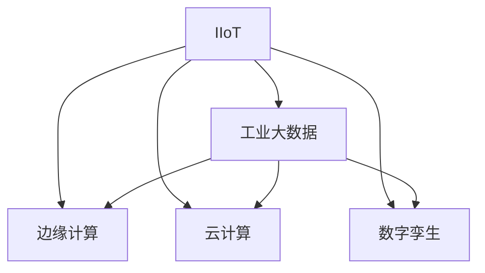

                 

# 工业物联网（IIoT）：智能制造的核心驱动力

## 1. 背景介绍

### 1.1 问题由来

随着全球化经济的快速发展，制造业作为国民经济的基础和支柱，对国家竞争力的提升具有决定性作用。然而，传统制造业面临着资源消耗大、环境污染重、效率低下等诸多问题。工业物联网（IIoT）的兴起，为智能制造提供了新的技术范式，通过物联网技术将各种生产设备、传感器、工业数据等连接起来，构建起高度自治的智能生产系统，实现了实时监控、智能调度、质量控制、预测维护等核心功能，大幅提升了制造效率和产品质量，推动了产业转型升级。

### 1.2 问题核心关键点

IIoT的核心在于通过对生产设备和系统的数字化改造，实现数据的全面采集和实时分析，进而进行精准控制和智能决策。其核心价值体现在：

- **设备互联化**：通过传感器和通信技术，实现设备间的信息交互和协同作业。
- **数据实时化**：实现生产数据的时时采集和存储，为后续分析和决策提供数据基础。
- **控制智能化**：运用先进的算法和智能设备，实现对生产过程的自动控制和优化调整。
- **决策精准化**：通过数据分析和预测，实现生产调度、质量控制、资源配置等方面的精准决策。
- **服务个性化**：基于用户需求和反馈，提供定制化服务，提升用户体验。

IIoT的这些关键点共同构成了智能制造的基石，为制造业的高质量发展提供了强大动力。

## 2. 核心概念与联系

### 2.1 核心概念概述

为了更好地理解IIoT在智能制造中的作用，我们先简要介绍几个核心概念：

- **工业物联网（IIoT）**：通过物联网技术将工业设备、传感器、生产数据等互联互通，实现信息实时交互和自动控制，提升生产效率和产品质量。
- **工业大数据**：指在工业生产过程中产生的大量结构化和非结构化数据，包括生产工艺、设备运行状态、质量检测结果等。
- **边缘计算**：在靠近数据源的本地设备上进行的计算和数据处理，减少网络延迟，提升计算效率。
- **云计算**：通过大规模的计算和存储资源，为IIoT平台提供弹性计算能力，支持大数据分析、机器学习等任务。
- **数字孪生**：通过虚拟和物理世界的双向映射，构建出与实际生产系统一致的数字模型，用于实时监控和仿真优化。

这些概念之间存在紧密的联系，共同构成了IIoT在智能制造中的应用框架：



这个流程图展示了IIoT技术在智能制造中的应用：

1. 通过设备互联和数据采集，生成大量工业大数据。
2. 边缘计算在本地对数据进行初步处理和分析，提高实时性。
3. 云计算提供强大的计算和存储资源，支持大数据分析、机器学习等任务。
4. 数字孪生构建虚拟模型，用于实时监控和仿真优化。

这些技术手段共同推动了智能制造的发展，实现了设备互联、数据实时化、控制智能化和决策精准化，最终推动了产业的转型升级。

## 3. 核心算法原理 & 具体操作步骤
### 3.1 算法原理概述

IIoT的核心算法原理可以概括为以下几个方面：

- **设备互联与数据采集**：通过传感器和通信技术，实现设备间的信息交互和数据采集。
- **数据预处理**：在边缘计算设备上对原始数据进行清洗、去噪、归一化等预处理，为后续分析提供准确的数据基础。
- **数据存储与管理**：将处理后的数据上传到云端，使用数据库或数据湖进行存储和管理。
- **数据挖掘与分析**：运用数据挖掘、机器学习等算法，从海量数据中挖掘出有价值的信息，用于优化生产过程。
- **模型训练与优化**：基于挖掘出的数据，训练和优化生产模型，实现精确控制和决策。

IIoT的算法原理涉及多种技术和手段，涵盖了设备互联、数据处理、模型训练等多个环节，共同支撑着智能制造的实现。

### 3.2 算法步骤详解

下面详细介绍IIoT在智能制造中的应用流程：

**Step 1: 设备互联与数据采集**

- **设备联网**：将生产设备、传感器等物理设备通过无线网络、有线网络等手段连接到互联网。
- **数据采集**：利用传感器等设备采集设备的运行状态、环境参数等数据。

**Step 2: 数据预处理**

- **数据清洗**：去除数据中的噪音、异常值等，保证数据质量。
- **数据归一化**：将不同尺度的数据进行归一化处理，便于后续分析。
- **数据压缩**：使用数据压缩算法，减小数据传输和存储的带宽和存储需求。

**Step 3: 数据存储与管理**

- **数据上传**：将处理后的数据上传到云端存储平台，如AWS、Google Cloud等。
- **数据管理**：使用数据库或数据湖对数据进行管理和组织，提供数据访问接口。

**Step 4: 数据挖掘与分析**

- **特征提取**：从数据中提取有用的特征，用于后续分析和模型训练。
- **模式识别**：利用机器学习算法，识别数据中的模式和规律。
- **异常检测**：使用异常检测算法，识别生产过程中的异常情况。

**Step 5: 模型训练与优化**

- **模型选择**：选择合适的机器学习模型，如线性回归、决策树、神经网络等。
- **模型训练**：使用训练数据集对模型进行训练，优化模型参数。
- **模型评估**：在测试数据集上评估模型性能，选择最优模型。

**Step 6: 应用部署与优化**

- **模型部署**：将训练好的模型部署到生产环境中，用于实时预测和决策。
- **模型优化**：根据生产反馈，不断优化模型参数，提升模型效果。

### 3.3 算法优缺点

IIoT的算法具有以下优点：

- **高精度**：通过数据挖掘和分析，实现对生产过程的高精度控制和预测。
- **实时性**：边缘计算和云平台的结合，实现了数据的实时处理和分析。
- **可靠性**：冗余设计和容错机制，保障系统的可靠性和稳定性。

同时，IIoT算法也存在一些缺点：

- **数据质量依赖**：算法的精度和效果高度依赖数据质量，数据采集和预处理需要细致的工作。
- **成本高**：初始投资较大，包括设备和传感器的购置、网络布线、云平台搭建等。
- **安全性问题**：IIoT系统涉及大量敏感数据，需要严格的安全防护措施。

### 3.4 算法应用领域

IIoT技术在智能制造中的应用广泛，具体包括：

- **设备监控与预测维护**：实时监控设备状态，预测故障和维护需求。
- **生产调度与优化**：基于实时数据，优化生产流程和资源配置。
- **质量控制与检测**：实时检测产品品质，提高生产效率和产品质量。
- **能源管理**：监控能源消耗，优化能源使用，降低成本。
- **供应链管理**：实时跟踪供应链信息，优化供应链管理。

此外，IIoT还在智能仓储、智能物流等领域得到广泛应用，推动了整个制造业的智能化转型。

## 4. 数学模型和公式 & 详细讲解 & 举例说明
### 4.1 数学模型构建

IIoT中的数学模型通常包括以下几个方面：

- **设备状态监测模型**：通过传感器采集设备状态数据，构建设备状态监测模型，预测设备故障。
- **生产过程优化模型**：基于实时数据，构建生产过程优化模型，优化生产流程和资源配置。
- **能源管理模型**：监控能源消耗，构建能源管理模型，优化能源使用。

以设备状态监测模型为例，假设设备状态数据 $x$ 由多个传感器采集，设备状态监测模型为 $y=f(x;\theta)$，其中 $f$ 为监测函数，$\theta$ 为模型参数。监测函数 $f$ 通常为线性或非线性模型，如：

$$
y = w_0 + w_1 x_1 + w_2 x_2 + \ldots + w_n x_n
$$

其中 $w_i$ 为模型的权重系数。

### 4.2 公式推导过程

以线性回归模型为例，我们推导最小二乘法的公式。假设已知 $n$ 个数据点 $(x_i, y_i)$，其中 $x_i=(x_{i1}, x_{i2}, \ldots, x_{in})$，$y_i$ 为设备状态监测值。我们的目标是最小化误差平方和：

$$
J = \sum_{i=1}^n (y_i - f(x_i;\theta))^2
$$

对 $\theta$ 求偏导，并令导数为零，得：

$$
\frac{\partial J}{\partial \theta_j} = \sum_{i=1}^n 2 (y_i - f(x_i;\theta)) x_{ij} = 0
$$

其中 $x_{ij}$ 表示第 $i$ 个数据点的第 $j$ 个特征值。通过求解上述方程组，得到最小二乘法的结果：

$$
\hat{\theta} = (X^TX)^{-1} X^Ty
$$

其中 $X$ 为特征矩阵，$Y$ 为目标向量。

### 4.3 案例分析与讲解

假设我们有一个自动化生产线，需要监测设备的温度、振动、电流等状态数据，预测设备故障。我们收集了100个样本，每个样本包含6个特征，设备状态监测结果为1（正常）或0（故障）。我们使用线性回归模型进行训练，得到如下的监测函数：

$$
y = 0.1x_1 + 0.2x_2 - 0.3x_3 + 0.4x_4 - 0.5x_5 + 0.6x_6
$$

将数据带入上述公式，计算得到模型参数：

$$
\hat{\theta} = (X^TX)^{-1} X^Ty = [0.1, 0.2, -0.3, 0.4, -0.5, 0.6]
$$

训练好的模型可以用于实时预测设备状态，例如：输入当前温度为35°C，振动强度为0.8，电流为0.2A，设备状态监测函数计算得到的结果为0.4，判断设备处于正常状态。

## 5. 项目实践：代码实例和详细解释说明
### 5.1 开发环境搭建

在进行IIoT项目开发前，我们需要准备好开发环境。以下是使用Python进行开发的环境配置流程：

1. 安装Anaconda：从官网下载并安装Anaconda，用于创建独立的Python环境。

2. 创建并激活虚拟环境：
```bash
conda create -n iiot-env python=3.8 
conda activate iiot-env
```

3. 安装必要的Python库：
```bash
pip install pandas numpy matplotlib sklearn
```

4. 安装IIoT平台所需工具：
```bash
pip install amqplib pymongo rpi-gpio pyserial
```

5. 配置开发环境：
```bash
vi ~/.bashrc
```

添加以下配置项，保存并退出：

```bash
export MQTT_BROKER_URL="mqtt://192.168.1.1"
export MQTT_CLIENT_ID="iot_client"
export MQTT_TOPIC="sensors"
```

完成上述步骤后，即可在`iiot-env`环境中开始IIoT项目开发。

### 5.2 源代码详细实现

下面我们以设备状态监测为例，给出使用Python和Paho MQTT进行IIoT开发的完整代码实现。

```python
import paho.mqtt.client as mqtt
import pandas as pd
import numpy as np
from sklearn.linear_model import LinearRegression

# MQTT配置
MQTT_BROKER_URL = "mqtt://192.168.1.1"
MQTT_CLIENT_ID = "iot_client"
MQTT_TOPIC = "sensors"

# 传感器数据
sensors_data = pd.read_csv("sensors_data.csv")

# 特征提取
features = sensors_data.drop(["temperature", "vibration", "current"], axis=1)
target = sensors_data["status"]

# 构建特征矩阵和目标向量
X = features.values
y = target.values

# 线性回归模型训练
model = LinearRegression()
model.fit(X, y)

# MQTT客户端
client = mqtt.Client(client_id=MQTT_CLIENT_ID)
client.connect(MQTT_BROKER_URL, 1883, 60)
client.subscribe(MQTT_TOPIC)

# 监听 MQTT 消息
def on_message(client, userdata, msg):
    data = msg.payload.decode("utf-8")
    data = data.split(",")
    temperature, vibration, current = map(float, data)
    x = np.array([temperature, vibration, current])
    y = model.predict(x)[0]
    print(f"Temperature: {temperature}, Vibration: {vibration}, Current: {current}, Status: {int(y)}")
    client.publish("status", f"{int(y)}")

client.on_message = on_message
client.start()

```

以上代码实现了IIoT系统中的设备状态监测功能。通过MQTT协议，从传感器获取实时数据，利用线性回归模型进行预测，并将结果通过MQTT发布，实现实时监测和反馈。

### 5.3 代码解读与分析

让我们再详细解读一下关键代码的实现细节：

**MQTT配置**：
- `MQTT_BROKER_URL`：MQTT消息代理的URL，可以是本地或云端的消息代理。
- `MQTT_CLIENT_ID`：客户端标识，用于区分不同的客户端。
- `MQTT_TOPIC`：传感器数据的发布主题，与订阅主题相对应。

**传感器数据读取**：
- 通过`pd.read_csv`读取传感器数据，包含多个特征和设备状态。
- 使用`drop`方法去除不需要的特征，保留设备状态作为目标变量。

**模型训练**：
- 使用`sklearn.linear_model.LinearRegression`进行线性回归模型训练，通过`fit`方法计算模型参数。
- 训练好的模型用于后续的预测。

**MQTT客户端**：
- 通过`paho.mqtt.client.Client`创建MQTT客户端，设置客户端ID和消息代理URL。
- 通过`subscribe`方法订阅传感器数据主题。
- 通过`on_message`方法处理接收到的MQTT消息，解析数据并预测设备状态。
- 通过`publish`方法将预测结果发布到状态主题。

## 6. 实际应用场景

### 6.1 设备监控与预测维护

IIoT系统在设备监控和预测维护中的应用非常广泛。通过实时采集设备状态数据，构建设备状态监测模型，可以实现设备故障的预测和预防。例如，在汽车制造企业中，通过监测生产线上的机器人状态，预测机器人故障，并及时进行维护，可以显著降低停机时间和维护成本。

### 6.2 生产调度与优化

IIoT系统通过实时监控生产数据，实现生产过程的优化和调度。例如，在半导体生产中，通过实时监控生产设备的运行状态，优化生产工艺，提升良品率，减少废品率。通过智能调度系统，实现生产资源的合理分配和优化，提高生产效率。

### 6.3 质量控制与检测

IIoT系统在质量控制和检测中同样发挥着重要作用。通过实时监控生产过程中的关键参数，及时发现产品质量问题，提高产品合格率。例如，在食品生产中，通过监测生产过程中的温度、湿度等参数，确保产品质量符合标准，减少质量投诉。

### 6.4 能源管理

IIoT系统通过实时监控能源消耗，实现能源的优化管理。例如，在工业园区中，通过监测各个生产设备的能源使用情况，优化能源配置，降低能源成本。通过智能能源管理系统，实现能源的实时监控和预测，提升能源使用效率。

### 6.5 供应链管理

IIoT系统在供应链管理中的应用同样不容忽视。通过实时监控供应链中的各个环节，优化物流配送，提升供应链效率。例如，在仓储管理中，通过实时监控仓库状态，优化库存管理，减少库存成本。通过供应链管理平台，实现供应链的透明化、可视化，提高供应链协同效率。

## 7. 工具和资源推荐

### 7.1 学习资源推荐

为了帮助开发者系统掌握IIoT的理论基础和实践技巧，这里推荐一些优质的学习资源：

1. 《物联网应用基础》系列书籍：全面介绍了物联网技术的基本概念、核心技术和典型应用，是学习IIoT的入门读物。
2. IIoT在线课程：如Coursera的《物联网系统设计》课程，涵盖IIoT的各个方面，从基础到高级，内容丰富。
3. 《工业互联网：原理与实践》：详细介绍了工业互联网的原理和应用，对于理解IIoT非常有帮助。
4. IIoT社区和论坛：如IOT For All、IoT Stack Exchange等，提供了丰富的学习资源和交流平台。
5. IIoT工具和框架：如MQTT、Kafka、Apache Flink等，是实现IIoT应用的必备工具。

通过这些资源的学习实践，相信你一定能够快速掌握IIoT的核心技术，并用于解决实际的工业问题。

### 7.2 开发工具推荐

高效的开发离不开优秀的工具支持。以下是几款用于IIoT开发的常用工具：

1. MQTT：轻量级、高可靠性的消息协议，广泛应用于IIoT系统的设备互联。
2. Paho MQTT：Python的MQTT客户端库，支持发布和订阅消息，易于使用。
3. Kafka：高吞吐量的分布式消息系统，适用于IIoT系统的数据流处理。
4. Apache Flink：高性能、可扩展的数据流处理框架，支持实时数据处理和分析。
5. Python：简单易学、功能强大的编程语言，广泛应用于IIoT系统的开发。

合理利用这些工具，可以显著提升IIoT项目的开发效率，加快创新迭代的步伐。

### 7.3 相关论文推荐

IIoT技术的发展源于学界的持续研究。以下是几篇奠基性的相关论文，推荐阅读：

1. Guo, J., Zhang, Y., & Sheng, Q. (2018). An Overview of the Industrial Internet of Things: State-of-the-Art and Challenges. IEEE Access, 6, 52937-52954.
2. Chen, W., Zhang, L., Li, J., & Qu, Y. (2017). A Survey on Industrial Internet of Things and Related Technologies. IEEE Access, 5, 5024-5052.
3. Li, S., Chen, G., & Song, X. (2019). A Survey on Energy Management Technologies in the Internet of Things (IoT). IEEE Access, 7, 12534-12549.
4. Guo, W., Li, Y., Xu, L., & He, L. (2021). A Survey on Data Privacy Protection in Internet of Things (IoT) Systems. IEEE Access, 9, 6525-6546.
5. Li, J., Li, Z., & Sun, Y. (2020). A Survey on Device-to-Device Communication for Industrial Internet of Things. IEEE Access, 8, 113630-113657.

这些论文代表了大数据和IIoT技术的发展脉络。通过学习这些前沿成果，可以帮助研究者把握学科前进方向，激发更多的创新灵感。

## 8. 总结：未来发展趋势与挑战

### 8.1 总结

本文对IIoT技术在智能制造中的应用进行了全面系统的介绍。首先阐述了IIoT技术在智能制造中的重要性和核心价值，明确了其在设备互联、数据实时化、控制智能化和决策精准化等方面的独特优势。其次，从原理到实践，详细讲解了IIoT系统的核心算法原理和操作步骤，给出了IIoT项目开发的完整代码实例。同时，本文还广泛探讨了IIoT技术在实际应用中的多种场景，展示了IIoT技术在智能制造中的广阔应用前景。

通过本文的系统梳理，可以看到，IIoT技术已经成为智能制造的重要技术范式，极大地提升了制造业的智能化水平，推动了产业的转型升级。未来，伴随IIoT技术的不断发展，其应用场景将更加广泛，对制造业的智能化贡献也将更加显著。

### 8.2 未来发展趋势

展望未来，IIoT技术将呈现以下几个发展趋势：

1. **设备互联更加广泛**：未来IIoT系统的设备互联将更加广泛，涉及更多的设备和数据源，实现全厂互联、全链条智能化。
2. **数据实时化更高**：随着5G和边缘计算技术的发展，IIoT系统的数据实时化能力将进一步提升，支持更大规模的数据采集和实时处理。
3. **控制智能化更深**：基于深度学习和大数据分析技术，IIoT系统的控制智能化能力将进一步提升，实现更精准的决策和优化。
4. **系统集成更加紧密**：IIoT系统将与其他智能技术如人工智能、区块链等进行更深层次的融合，实现更全面的智能化。
5. **服务个性化更加精准**：IIoT系统将基于用户需求和反馈，提供更加精准和个性化的服务，提升用户体验。

以上趋势凸显了IIoT技术在智能制造中的巨大前景。这些方向的探索发展，必将进一步提升智能制造的智能化水平，推动制造业的高质量发展。

### 8.3 面临的挑战

尽管IIoT技术已经取得了显著成效，但在迈向更加智能化、普适化应用的过程中，仍面临诸多挑战：

1. **数据隐私和安全**：IIoT系统涉及大量敏感数据，如何保障数据隐私和安全是亟待解决的问题。
2. **设备和系统的兼容性**：不同厂商的设备和技术标准不同，如何实现设备互联和系统兼容，是IIoT系统需要解决的关键问题。
3. **网络延迟和带宽问题**：IIoT系统对网络的依赖较大，如何优化网络架构，降低延迟和带宽需求，是系统性能提升的重要方向。
4. **计算和存储资源**：IIoT系统对计算和存储资源的需求较大，如何优化计算架构，提高资源利用率，是系统可靠性和稳定性需要解决的问题。
5. **算法的实时性和鲁棒性**：IIoT系统对算法实时性和鲁棒性的要求较高，如何优化算法，提升系统性能和稳定性，是系统技术优化的关键方向。

解决这些挑战，将是大数据和IIoT技术迈向成熟的重要一步，IIoT系统才能真正实现其智能化潜力。

### 8.4 研究展望

面向未来，IIoT技术的研究可以从以下几个方面进行突破：

1. **多源数据融合**：未来IIoT系统将需要处理更多源的数据，如何实现多源数据的融合和统一，是提升系统决策精准性的关键。
2. **边缘计算优化**：优化边缘计算架构，提升边缘计算能力，降低网络延迟和带宽需求，是提升系统实时性的重要方向。
3. **深度学习的应用**：引入深度学习技术，提升IIoT系统的控制智能化能力，实现更精准的决策和优化。
4. **分布式系统的优化**：优化分布式系统的架构和算法，提升系统的计算能力和稳定性，是提升系统可靠性的重要方向。
5. **安全隐私保护**：开发更加安全的IIoT系统架构和算法，保护数据隐私和安全，是IIoT系统发展的重要保障。

这些研究方向将推动IIoT技术迈向更高的台阶，为智能制造的智能化转型提供更加可靠的技术支持。总之，IIoT技术的研究和应用将不断深化，推动制造业的智能化进程，为社会经济的可持续发展提供新的动力。

## 9. 附录：常见问题与解答

**Q1: IIoT系统如何实现设备互联？**

A: IIoT系统实现设备互联主要通过MQTT、CoAP、HTTP等轻量级通信协议。通过将设备连接到网络，采集设备状态数据，并发送至云端平台进行存储和分析。

**Q2: IIoT系统的数据存储和管理有哪些常见的解决方案？**

A: IIoT系统的数据存储和管理常见的解决方案包括：
1. 关系型数据库（如MySQL、PostgreSQL）：适合结构化数据的存储和管理。
2. 非关系型数据库（如MongoDB、Cassandra）：适合大规模非结构化数据的存储和管理。
3. 数据湖（如Hadoop、Spark）：支持大规模数据的存储和处理。

**Q3: IIoT系统如何实现设备状态的实时监测？**

A: IIoT系统实现设备状态的实时监测主要通过MQTT协议和边缘计算设备。通过MQTT协议将设备状态数据发送至边缘计算设备，在边缘计算设备上进行数据清洗、归一化等预处理，然后将处理后的数据上传到云端进行实时分析，从而实现设备状态的实时监测。

**Q4: IIoT系统如何优化生产过程？**

A: IIoT系统优化生产过程主要通过数据挖掘和机器学习技术。首先，从设备状态数据中提取有用的特征，用于后续分析和模型训练。然后，使用机器学习算法，如回归分析、决策树、神经网络等，训练和优化生产模型，实现对生产过程的精准控制和优化调整。

**Q5: IIoT系统如何实现能源管理？**

A: IIoT系统实现能源管理主要通过实时监测能源消耗，优化能源配置。通过采集生产设备的能源使用数据，利用数据分析和机器学习算法，实现对能源消耗的实时监控和预测，优化能源使用，提升能源使用效率，降低能源成本。

**Q6: IIoT系统在实际应用中需要注意哪些安全问题？**

A: IIoT系统在实际应用中需要注意以下安全问题：
1. 数据隐私保护：对设备状态数据进行加密，防止数据泄露。
2. 设备身份验证：对设备进行身份验证，防止未授权设备接入系统。
3. 通信安全：对通信数据进行加密，防止数据篡改和攻击。
4. 系统漏洞防护：定期对系统进行安全漏洞扫描和修复，防止黑客攻击。

这些安全问题需要综合考虑，制定完善的安全防护策略，保障IIoT系统的安全性和可靠性。

---

作者：禅与计算机程序设计艺术 / Zen and the Art of Computer Programming

