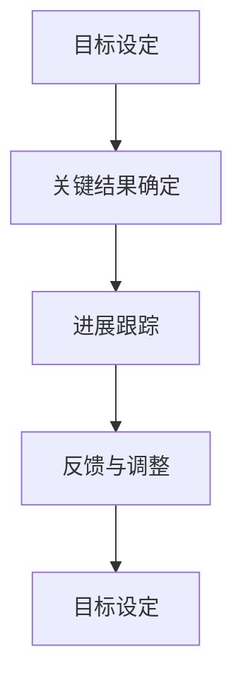

                 

# 巴菲特目标管理法则的团队应用

## 1. 背景介绍

### 1.1 问题由来

巴菲特的目标管理法则（OKR, Objectives and Key Results）是现代企业中最具影响力的管理工具之一。OKR的核心理念是通过设定明确的目标（Objectives）和可量化的关键结果（Key Results），帮助团队聚焦于业务优先级，激发团队成员的主动性和创造力，提升组织效能。OKR不仅仅是一种目标设定方法，更是一种系统性的战略执行框架。

在IT领域，随着技术栈的不断扩展和业务复杂性的增加，如何有效地管理团队目标、分配资源、驱动创新和提高交付效率，成为企业发展的核心挑战。OKR的引入，为IT团队提供了一套切实可行的方法，帮助团队成员更好地理解公司的战略方向，协同工作，并创造出有价值的产品和服务。

### 1.2 问题核心关键点

OKR之所以成为企业管理的利器，在于其具备以下几个关键特性：

1. **目标设定与战略对齐**：通过设定明确的目标，确保团队工作与公司的整体战略一致。
2. **透明与共享**：OKR的设立和进展透明化，鼓励团队成员之间的交流和协作。
3. **自驱与赋能**：团队成员对自己的关键结果负责，激发内生动力和自我管理能力。
4. **持续反馈与迭代**：通过定期的回顾和调整，确保目标和关键结果的有效性，推动团队不断优化。

这些特性使得OKR在企业管理中的应用效果显著，逐步被广泛应用于各个行业，包括IT领域。在IT团队中，OKR的应用不仅仅局限于项目管理，更涉及到产品规划、技术选型、人才发展等多个层面。本文将深入探讨OKR在IT团队中的应用，从目标设定、团队协作、绩效评估等多个角度，揭示OKR如何帮助IT团队实现战略对齐、资源优化和效率提升。

## 2. 核心概念与联系

### 2.1 核心概念概述

OKR是一个动态的目标管理框架，主要包括目标设定和关键结果两个核心元素。目标（Objective）是对组织或团队方向和愿景的描述，通常包含战略方向和业务优先级。关键结果（Key Results）是对目标的可量化描述，用以衡量目标达成情况，通常包括定量和定性指标。

OKR的设定和实施流程一般包括以下步骤：

1. **目标设定**：明确团队在当前周期内的主要任务和优先级。
2. **关键结果确定**：为每个目标设定具体、可量化的关键结果。
3. **进展跟踪**：定期检查关键结果的进展，确保目标的实现。
4. **反馈与调整**：根据进展情况调整目标和关键结果，确保目标的有效性。

### 2.2 核心概念原理和架构的 Mermaid 流程图



这个流程图展示了OKR实施的基本流程。从目标设定开始，通过关键结果的确定，再到进展跟踪和反馈调整，形成了一个持续迭代、动态优化的目标管理循环。

## 3. 核心算法原理 & 具体操作步骤

### 3.1 算法原理概述

OKR的算法原理基于目标设定理论和自我管理理论。通过明确的目标设定，帮助团队聚焦于战略优先级；通过关键结果的量化，提供可衡量的绩效指标；通过透明的进展跟踪和反馈调整，确保目标的有效实施。

OKR的实施过程包括以下关键步骤：

1. **目标设定**：明确团队在当前周期内的主要任务和优先级。
2. **关键结果确定**：为每个目标设定具体、可量化的关键结果。
3. **进展跟踪**：定期检查关键结果的进展，确保目标的实现。
4. **反馈与调整**：根据进展情况调整目标和关键结果，确保目标的有效性。

### 3.2 算法步骤详解

**Step 1: 目标设定**

目标设定是OKR实施的第一步，也是最重要的环节。有效的目标设定需要符合SMART原则，即具体（Specific）、可衡量（Measurable）、可达成（Achievable）、相关性（Relevant）和时限性（Time-bound）。

目标的设定一般包括以下步骤：

1. **高层战略传达**：高层管理者通过战略会议、战略文档等形式，向团队传达公司的总体战略和业务优先级。
2. **团队讨论与共识**：团队内部进行深入讨论，达成共识，确定本周期内的主要任务和优先级。
3. **目标撰写**：将讨论结果转化为明确的目标描述，通常不超过一句话，简洁明了地表达目标。

**Step 2: 关键结果确定**

关键结果是目标的可量化描述，用于衡量目标的实现情况。通常每个目标对应1-4个关键结果，每个关键结果包含定量和定性指标。

关键结果的确定需要考虑以下几点：

1. **量化的重要性**：所有关键结果都需要量化，以便于衡量和评估。
2. **相关性与平衡**：关键结果需要与目标密切相关，同时保持平衡，避免单一指标导致的偏差。
3. **可操作性**：关键结果需要具体且可操作，以便团队成员明确执行方向。

**Step 3: 进展跟踪**

进展跟踪是OKR实施的核心环节，通过定期检查关键结果的进展情况，确保目标的实现。

进展跟踪一般包括以下步骤：

1. **定期检查**：通常每周或每两周进行一次进展检查，记录关键结果的实际进展。
2. **公开透明**：将进展情况公开透明化，鼓励团队成员之间的交流和协作。
3. **讨论与调整**：根据进展情况进行讨论和调整，确保目标的有效实施。

**Step 4: 反馈与调整**

反馈与调整是OKR实施的最后一个环节，通过定期的回顾和调整，确保目标和关键结果的有效性。

反馈与调整一般包括以下步骤：

1. **周期回顾**：通常每个季度或半年进行一次周期回顾，评估目标的实现情况。
2. **经验总结**：总结成功经验和失败教训，形成改进措施。
3. **目标优化**：根据反馈结果，优化目标和关键结果，确保下一周期的工作更加高效。

### 3.3 算法优缺点

OKR的优点在于：

1. **战略对齐**：确保团队工作与公司的整体战略一致，提升组织效能。
2. **透明协作**：通过公开透明的进展跟踪，鼓励团队成员之间的交流和协作。
3. **自驱赋能**：激发团队成员的主动性和自我管理能力，提高工作效率。
4. **持续优化**：通过定期反馈与调整，确保目标和关键结果的有效性，推动团队不断优化。

OKR的缺点在于：

1. **目标设定复杂**：目标设定的过程需要团队讨论和共识，耗费时间较多。
2. **资源消耗**：进展跟踪和反馈调整需要定期进行，增加了资源消耗。
3. **执行难度**：对团队成员的管理能力和自我驱动力要求较高，可能导致执行难度增加。

### 3.4 算法应用领域

OKR不仅适用于企业整体战略管理，更广泛应用于IT团队的日常工作中。以下是OKR在IT团队中的应用领域：

1. **项目规划与执行**：通过OKR设定项目目标和关键结果，确保项目按计划推进，提高项目成功率。
2. **产品开发与迭代**：将OKR应用于产品开发和迭代过程中，确保产品功能与市场需求一致，提升产品质量和用户满意度。
3. **技术选型与架构设计**：通过OKR评估技术选型的可行性和优先级，确保架构设计符合战略方向。
4. **人才发展与激励**：通过OKR设定个人发展目标和关键结果，激发团队成员的内生动力，促进人才发展。
5. **团队协作与沟通**：通过OKR透明化的进展跟踪和反馈调整，促进团队成员之间的协作和沟通，提高团队凝聚力。

## 4. 数学模型和公式 & 详细讲解 & 举例说明

### 4.1 数学模型构建

OKR的数学模型构建主要围绕目标和关键结果展开。目标（Objective）可以视为一个向量，包含多个可量化的关键结果（Key Results）。每个关键结果可以表示为一个向量，包含定量和定性指标。

目标和关键结果的关系可以表示为：

$$
\text{Objective} = \left( KR_1, KR_2, ..., KR_n \right)
$$

其中，$KR_i$ 表示第 $i$ 个关键结果。

### 4.2 公式推导过程

OKR的公式推导主要围绕目标实现情况和关键结果的评估展开。目标实现情况可以用一个实数表示，关键结果的评估可以用多个实数表示。

目标实现情况的计算公式为：

$$
S = \sum_{i=1}^n W_i \times KR_i
$$

其中，$S$ 表示目标实现情况，$W_i$ 表示第 $i$ 个关键结果的权重，$KR_i$ 表示第 $i$ 个关键结果的值。

关键结果的评估公式为：

$$
KR_i = R_i - R_{\text{base}}
$$

其中，$R_i$ 表示第 $i$ 个关键结果的实际值，$R_{\text{base}}$ 表示第 $i$ 个关键结果的基线值。

### 4.3 案例分析与讲解

**案例分析：**

一家软件公司采用OKR管理法，设定了“提升产品性能”作为其核心目标，并确定了以下关键结果：

1. 减少页面加载时间50%。
2. 用户满意度提升20%。
3. 代码复用率提高30%。

目标设定如下：

**目标**：提升产品性能

**关键结果**：

- $KR_1$：减少页面加载时间50%
- $KR_2$：用户满意度提升20%
- $KR_3$：代码复用率提高30%

**进展跟踪**：

在第一个季度，团队通过一系列技术改进和优化，实现了以下进展：

- $KR_1$：实现了页面加载时间减少45%。
- $KR_2$：用户满意度提升了25%。
- $KR_3$：代码复用率提高了25%。

**反馈与调整**：

在季度回顾会上，团队讨论了当前进展情况，认为 $KR_1$ 的完成情况略低于预期，需要进行额外的优化。因此，调整了 $KR_1$ 的权重，增加了调整措施，以确保下一个季度的目标实现。

## 5. 项目实践：代码实例和详细解释说明

### 5.1 开发环境搭建

为了实现OKR的自动化管理和追踪，可以使用一些现成的项目管理工具，如Jira、Trello、Confluence等。这里以Jira为例，介绍OKR的开发环境搭建过程。

1. **安装Jira**：从官网下载Jira Community Edition，按照安装向导完成安装。
2. **配置OKR模板**：创建OKR模板，设定目标和关键结果的字段和配置。
3. **用户和团队设置**：创建用户和团队，并赋予相应的权限。

完成上述步骤后，即可在Jira中启动OKR项目管理和追踪。

### 5.2 源代码详细实现

以下是使用Python和Flask实现OKR管理系统的示例代码：

```python
from flask import Flask, request, jsonify

app = Flask(__name__)

# OKR数据存储
class OKRData:
    def __init__(self):
        self.okrs = {}

    def add_okr(self, objective, key_results):
        self.okrs[objective] = key_results

    def update_okr(self, objective, key_results):
        self.okrs[objective] = key_results

    def get_okr(self, objective):
        return self.okrs.get(objective)

app.add_url_rule('/add_okr', methods=['POST'], endpoint='add_okr')
app.add_url_rule('/update_okr', methods=['POST'], endpoint='update_okr')
app.add_url_rule('/get_okr', methods=['GET'], endpoint='get_okr')

@app.route('/add_okr')
def add_okr():
    objective = request.json.get('objective')
    key_results = request.json.get('key_results')
    data.add_okr(objective, key_results)
    return jsonify({'success': True}), 200

@app.route('/update_okr')
def update_okr():
    objective = request.json.get('objective')
    key_results = request.json.get('key_results')
    data.update_okr(objective, key_results)
    return jsonify({'success': True}), 200

@app.route('/get_okr')
def get_okr():
    objective = request.args.get('objective')
    okr = data.get_okr(objective)
    return jsonify(okr), 200

if __name__ == '__main__':
    app.run(debug=True)
```

### 5.3 代码解读与分析

上述代码展示了如何使用Flask实现一个简单的OKR管理系统。代码中定义了OKR数据的存储和操作，通过HTTP接口提供添加、更新和获取OKR数据的API。

- **添加OKR**：通过POST请求添加OKR，返回添加成功的JSON响应。
- **更新OKR**：通过POST请求更新OKR，返回更新成功的JSON响应。
- **获取OKR**：通过GET请求获取指定目标的OKR数据，返回JSON格式的OKR数据。

## 6. 实际应用场景

### 6.1 软件开发团队

软件开发团队在项目管理和产品开发中面临诸多挑战，OKR可以帮助团队聚焦于业务优先级，提升项目成功率和产品品质。

**应用场景**：

- **项目规划与执行**：通过OKR设定项目目标和关键结果，确保项目按计划推进，提高项目成功率。
- **产品开发与迭代**：将OKR应用于产品开发和迭代过程中，确保产品功能与市场需求一致，提升产品质量和用户满意度。
- **技术选型与架构设计**：通过OKR评估技术选型的可行性和优先级，确保架构设计符合战略方向。

### 6.2 数据科学团队

数据科学团队在数据挖掘、模型训练和结果应用中需要高效协作和持续改进，OKR可以帮助团队提升工作效率和成果质量。

**应用场景**：

- **数据挖掘与探索**：通过OKR设定数据挖掘目标和关键结果，确保数据挖掘工作高效进行，发现有价值的数据洞见。
- **模型训练与优化**：将OKR应用于模型训练和优化过程中，确保模型性能符合业务需求，提升模型效果。
- **结果应用与反馈**：通过OKR跟踪模型应用效果，及时调整和优化，确保模型应用效果最大化。

### 6.3 云计算团队

云计算团队在资源管理、服务优化和客户支持中需要高效协同和持续改进，OKR可以帮助团队提升资源利用率和客户满意度。

**应用场景**：

- **资源管理与优化**：通过OKR设定资源管理目标和关键结果，确保资源高效利用，提升服务质量和性能。
- **服务优化与扩展**：将OKR应用于服务优化和扩展过程中，确保服务性能符合客户需求，提升客户满意度。
- **客户支持与反馈**：通过OKR跟踪客户反馈和需求，及时调整和优化服务，确保客户体验不断提升。

### 6.4 未来应用展望

随着OKR在企业中的应用日益广泛，其在IT团队中的应用前景也愈发广阔。未来，OKR将进一步扩展到更多IT领域，推动IT团队实现更高的目标和业绩。

- **自动化的OKR管理**：借助AI和大数据技术，实现OKR管理的自动化，提升管理效率和精度。
- **跨团队的OKR协同**：通过跨团队的OKR协同，实现更大范围的目标设定和资源优化，提升整体组织效能。
- **定制化的OKR应用**：针对不同IT团队的业务特点，定制化的OKR应用方案，确保OKR实施的有效性。

## 7. 工具和资源推荐

### 7.1 学习资源推荐

为了帮助IT团队系统掌握OKR的应用，以下是一些优质的学习资源：

1. **《OKR: The Ultimate Guide to Objective and Key Results》**：详细介绍OKR的原理、实施方法和成功案例。
2. **《The Sprint: How to Solve Big Problems and Test New Ideas in Just Five Days》**：介绍OKR与Sprint结合的应用，帮助团队快速迭代和交付。
3. **《Objectives and Key Results (OKR) Training》**：提供专业的OKR培训课程，涵盖目标设定、关键结果确定、进展跟踪等关键环节。

### 7.2 开发工具推荐

以下是一些适用于OKR管理的开发工具：

1. **Jira**：功能强大的项目管理工具，提供OKR模板和自定义字段，支持高效的OKR管理和追踪。
2. **Trello**：简单易用的项目管理工具，支持OKR卡片和列表管理，适合小型团队和初创企业。
3. **Confluence**：协作文档工具，支持OKR文档和目标管理，便于团队协作和知识共享。

### 7.3 相关论文推荐

以下是几篇关于OKR的经典论文，推荐阅读：

1. **"Objectives and Key Results: A Simple and Practical Method to Better Manage Performance and Align Strategies"**：介绍OKR的原理和实施方法，适合初学者学习。
2. **"OKRs: The Secret to Scaling Your People and Your Company"**：分享OKR在企业中的应用案例，帮助理解OKR的实际效果。
3. **"Aligning on Objectives: An Empirical Study of OKRs"**：通过实证研究，评估OKR的效果和影响，提供数据支撑。

## 8. 总结：未来发展趋势与挑战

### 8.1 研究成果总结

OKR作为一种高效的目标管理方法，已在企业中得到广泛应用，并取得显著成效。其核心在于通过明确的目标设定和关键结果量化，提升团队的工作效率和绩效水平。在IT团队中，OKR的应用不仅限于项目管理，更涉及产品规划、技术选型、人才发展等多个层面。

### 8.2 未来发展趋势

随着OKR在企业中的应用日益成熟，其在IT团队中的应用前景也愈发广阔。未来，OKR将进一步扩展到更多IT领域，推动IT团队实现更高的目标和业绩。

- **自动化的OKR管理**：借助AI和大数据技术，实现OKR管理的自动化，提升管理效率和精度。
- **跨团队的OKR协同**：通过跨团队的OKR协同，实现更大范围的目标设定和资源优化，提升整体组织效能。
- **定制化的OKR应用**：针对不同IT团队的业务特点，定制化的OKR应用方案，确保OKR实施的有效性。

### 8.3 面临的挑战

尽管OKR在企业中的应用效果显著，但其推广和实施过程中仍面临诸多挑战：

- **目标设定复杂**：目标设定的过程需要团队讨论和共识，耗费时间较多。
- **资源消耗**：进展跟踪和反馈调整需要定期进行，增加了资源消耗。
- **执行难度**：对团队成员的管理能力和自我驱动力要求较高，可能导致执行难度增加。

### 8.4 研究展望

面对OKR推广和实施中的挑战，未来的研究需要在以下几个方面寻求新的突破：

- **目标设定简化**：开发自动化的目标设定工具，简化目标设定的过程，提升效率。
- **资源优化**：优化进展跟踪和反馈调整的频率和方式，减少资源消耗。
- **执行支持**：提供更多的执行支持，提升团队成员的自我驱动力和管理能力。

通过这些研究方向的探索，未来OKR在IT团队中的应用将更加高效和灵活，帮助团队实现更高的目标和业绩。

## 9. 附录：常见问题与解答

**Q1：OKR的实施过程需要团队讨论和共识，耗费时间较多，如何提高效率？**

A: OKR的实施效率可以通过以下几个方式提升：

1. **简化目标设定**：通过预设模板和标准流程，简化目标设定的过程。
2. **自动化工具辅助**：借助自动化工具，如OKR管理软件，提高目标设定和进展跟踪的效率。
3. **定期培训与辅导**：定期进行OKR培训和辅导，提升团队成员的理解和执行力。

**Q2：OKR的进展跟踪需要定期进行，增加了资源消耗，如何优化？**

A: OKR的进展跟踪可以通过以下几个方式优化：

1. **周期缩短**：将进展检查周期缩短，如每周进行一次，减少资源消耗。
2. **自动提醒**：使用自动化工具，如邮件提醒和任务调度，提升进展跟踪的及时性和准确性。
3. **重点跟踪**：重点关注关键结果和关键指标，减少跟踪的工作量。

**Q3：OKR的执行难度较高，如何提高团队成员的自我驱动力？**

A: OKR的执行难度可以通过以下几个方式提升：

1. **明确目标**：确保目标设定清晰明确，与团队成员的个人发展目标和职业规划相结合。
2. **激励机制**：建立激励机制，如奖金、晋升等，激励团队成员达成目标。
3. **领导支持**：领导层积极支持和参与OKR实施，增强团队成员的信心和动力。

通过这些方式，可以有效提升OKR在IT团队的执行效果，确保目标和关键结果的有效实施。

---

作者：禅与计算机程序设计艺术 / Zen and the Art of Computer Programming

