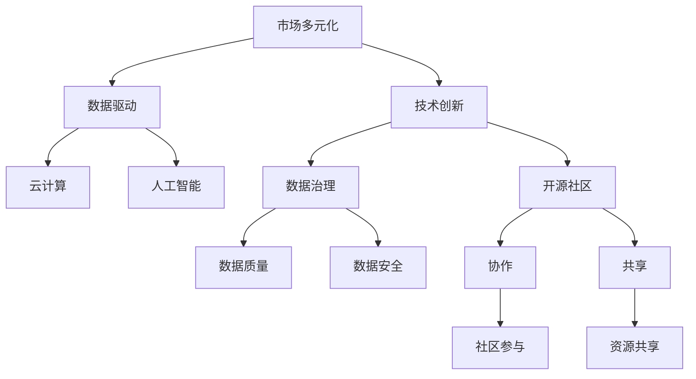

                 

# 市场多元化的益处：贾扬清的观点，竞争推动质量提升与生态发展

> 关键词：市场多元化, 竞争, 质量提升, 生态发展, AI, 技术创新, 云计算, 数据驱动, 开源社区

## 1. 背景介绍

### 1.1 问题由来
在全球化进程加速的背景下，市场的多元化趋势日益显著。从传统的实体市场到互联网电商，从单一行业的供应链管理到跨行业的大数据集成，市场的多元化程度不断提升，企业的业务模式、数据形态、技术栈等也日益复杂。面对这种变化，企业需要更好地理解市场环境，适应市场变化，同时不断提升自身的产品和服务质量，以保持竞争力。

### 1.2 问题核心关键点
市场多元化带来的核心挑战包括：
- 数据多样性：不同行业、不同平台的数据格式、数据源、数据质量等存在显著差异。
- 技术复杂性：企业需要掌握多种技术栈，如云计算、人工智能、大数据、区块链等。
- 生态协同：不同企业、不同部门之间需要协同工作，数据共享、技术协作等成为关键难题。

### 1.3 问题研究意义
深入研究市场多元化的益处，对企业及整个社会都具有重要意义：
- 提高市场适应性：帮助企业更灵活地应对市场变化，抓住市场机遇。
- 提升产品和服务质量：利用技术创新和数据驱动，优化产品设计和用户体验。
- 促进生态发展：通过协同合作，共同推动行业技术进步和产业升级。
- 增强国际竞争力：在全球市场中占据有利地位，提升企业的国际形象和市场份额。

## 2. 核心概念与联系

### 2.1 核心概念概述

为更好地理解市场多元化的益处，本节将介绍几个密切相关的核心概念：

- 市场多元化(Market Diversification)：指企业在单一市场的基础上，拓展多个市场领域，以分散风险、获取更大市场份额的过程。
- 数据驱动(Data-Driven)：指基于数据进行决策和优化，以提升业务效率和产品质量的技术范式。
- 技术创新(Technology Innovation)：指企业通过技术突破，改善产品和服务，提升用户体验，增强市场竞争力的过程。
- 云计算(Cloud Computing)：指通过互联网提供计算服务，实现资源共享、弹性伸缩的计算模式。
- 人工智能(AI)：指利用算法和模型，模拟人类智能行为，解决复杂问题的技术。
- 数据治理(Data Governance)：指通过管理数据源、数据质量、数据安全等，确保数据的高效使用和数据治理的合规性。
- 开源社区(Open Source Community)：指围绕特定软件或技术平台，聚集开发者、用户等社区成员，共同贡献、分享、协作的生态体系。

这些核心概念之间的逻辑关系可以通过以下Mermaid流程图来展示：



这个流程图展示了大语言模型微调的核心概念及其之间的关系：

1. 市场多元化通过拓展市场领域，为企业带来了新的市场机会。
2. 数据驱动基于市场多元化获取的数据，进行深度分析和优化决策。
3. 技术创新利用数据驱动获取的洞察，进行产品和服务创新。
4. 云计算通过数据驱动和人工智能技术，提供计算资源和弹性扩展。
5. 人工智能在数据驱动和云计算的支持下，实现智能决策和自动化操作。
6. 数据治理通过管理数据质量和安全，确保数据的准确性和合规性。
7. 开源社区促进技术共享和协作，推动技术进步和生态发展。

## 3. 核心算法原理 & 具体操作步骤

### 3.1 算法原理概述

市场多元化的实现过程中，数据驱动和人工智能技术发挥了关键作用。具体而言，企业通过收集和分析市场数据，结合人工智能技术进行预测和优化，以提升市场适应性和竞争力。

企业的数据驱动过程通常包括以下几个关键步骤：

1. **数据收集**：从多个市场领域获取业务数据、客户数据、市场数据等。
2. **数据清洗**：对数据进行去重、去噪、填充缺失值等处理。
3. **数据分析**：使用机器学习、深度学习等技术，对数据进行模式识别、趋势分析等。
4. **决策支持**：根据分析结果，制定市场策略、优化产品设计、提升服务质量等。

人工智能技术在此过程中主要提供以下支持：
- **数据处理**：使用自动化工具和算法，处理大规模数据，提升数据处理效率。
- **模式识别**：通过机器学习算法，发现数据中的规律和模式，辅助决策。
- **预测分析**：使用预测模型，对市场趋势进行预测，优化市场策略。
- **自动化操作**：通过自动化工具，实现业务流程的自动化，提高运营效率。

### 3.2 算法步骤详解

市场多元化的实现过程可以分为以下几个关键步骤：

**Step 1: 数据收集与预处理**
- 定义数据源和数据格式，确保数据的完整性和一致性。
- 使用数据清洗工具，处理数据缺失、异常值、重复数据等问题。
- 数据整合，将来自不同来源的数据统一，建立统一的数据视图。

**Step 2: 数据建模与分析**
- 选择合适的人工智能算法，建立数据模型，如线性回归、决策树、深度神经网络等。
- 训练模型，使用历史数据对模型进行训练和调优。
- 验证模型，使用交叉验证等方法评估模型性能，确保模型泛化能力。

**Step 3: 数据可视化与报告**
- 使用可视化工具，如Tableau、PowerBI等，将数据模型和分析结果进行可视化展示。
- 制作数据报告，将分析结果进行总结和展示，支持管理层决策。

**Step 4: 应用实施与反馈**
- 将模型应用到实际业务场景中，实时获取数据，进行预测和优化。
- 收集用户反馈，评估模型效果，持续改进模型。
- 持续监控数据质量，确保数据的一致性和完整性。

### 3.3 算法优缺点

市场多元化实现过程的数据驱动和人工智能技术具有以下优点：
- **数据驱动决策**：基于大量真实数据，进行科学决策，提高决策准确性。
- **快速响应市场变化**：通过实时数据分析，快速适应市场变化，抓住市场机遇。
- **提升运营效率**：自动化流程和算法优化，减少人工干预，提升运营效率。

同时，该方法也存在一些局限性：
- **数据隐私和安全**：数据收集和分析过程中涉及大量敏感信息，需注意数据隐私和安全问题。
- **模型复杂度**：复杂的模型可能导致过拟合，影响模型的泛化能力。
- **技术门槛高**：数据处理和算法实现需要较高技术水平，需要专业团队支撑。
- **数据质量要求高**：数据的质量和一致性对分析结果有直接影响，需要严格的数据治理。

### 3.4 算法应用领域

市场多元化的数据驱动和人工智能技术，在多个领域得到了广泛应用，例如：

- **金融行业**：通过分析交易数据、市场数据等，进行风险评估、投资决策、客户关系管理等。
- **零售行业**：利用消费者行为数据，进行产品推荐、库存管理、销售预测等。
- **制造业**：通过生产数据、质量数据等，进行生产调度、质量控制、供应链优化等。
- **医疗行业**：利用患者数据、医疗记录等，进行疾病预测、诊断决策、医疗资源管理等。
- **政府部门**：通过社会数据、经济数据等，进行政策制定、公共服务优化、应急管理等。

## 4. 数学模型和公式 & 详细讲解 & 举例说明

### 4.1 数学模型构建

本节将使用数学语言对市场多元化的数据驱动和人工智能过程进行更加严格的刻画。

假设企业收集的市场数据为 $\mathcal{D}=\{(x_i,y_i)\}_{i=1}^N$，其中 $x$ 为输入特征，$y$ 为输出标签。通过数据驱动和人工智能技术，建立模型 $M$，模型预测输出为 $\hat{y}=M(x)$。

定义模型 $M$ 在数据样本 $(x,y)$ 上的损失函数为 $\ell(M(x),y)$，则在数据集 $\mathcal{D}$ 上的经验风险为：

$$
\mathcal{L}(M) = \frac{1}{N} \sum_{i=1}^N \ell(M(x_i),y_i)
$$

数据驱动和人工智能技术的核心目标是最小化经验风险，即找到最优模型：

$$
M^* = \mathop{\arg\min}_{M} \mathcal{L}(M)
$$

在实践中，我们通常使用基于梯度的优化算法（如SGD、Adam等）来近似求解上述最优化问题。设 $\eta$ 为学习率，则参数的更新公式为：

$$
\theta \leftarrow \theta - \eta \nabla_{\theta}\mathcal{L}(\theta)
$$

其中 $\nabla_{\theta}\mathcal{L}(\theta)$ 为损失函数对模型参数 $\theta$ 的梯度，可通过反向传播算法高效计算。

### 4.2 公式推导过程

以下我们以线性回归为例，推导数据驱动和人工智能技术的数学模型及其梯度计算公式。

假设模型 $M$ 为线性回归模型，即：

$$
\hat{y} = \theta^T x + b
$$

其中 $\theta$ 为模型参数，$x$ 为输入特征，$b$ 为截距。则损失函数为均方误差损失函数：

$$
\ell(\hat{y},y) = \frac{1}{2} (\hat{y} - y)^2
$$

将其代入经验风险公式，得：

$$
\mathcal{L}(\theta) = \frac{1}{2N} \sum_{i=1}^N (\hat{y}_i - y_i)^2
$$

根据链式法则，损失函数对模型参数 $\theta_k$ 的梯度为：

$$
\frac{\partial \mathcal{L}(\theta)}{\partial \theta_k} = \frac{1}{N} \sum_{i=1}^N (\hat{y}_i - y_i) x_{ik}
$$

其中 $x_{ik}$ 为输入特征的第 $k$ 个元素。在得到损失函数的梯度后，即可带入参数更新公式，完成模型的迭代优化。重复上述过程直至收敛，最终得到适应市场多元化的最优模型参数 $\theta^*$。

### 4.3 案例分析与讲解

考虑一个电商企业的多元化市场策略。企业收集了来自不同市场的销售数据，如电子商务、实体店铺、移动端应用等。通过对这些数据进行清洗和整合，企业构建了一个统一的数据视图。

接着，企业使用线性回归模型，分析不同市场的销售趋势、季节性因素、促销效果等，建立了多个线性回归模型。通过历史数据训练这些模型，并对模型性能进行交叉验证，最终选择表现最好的模型进行应用。

具体实现步骤如下：

1. **数据收集与预处理**：
   - 收集来自电子商务平台、实体店铺、移动应用等渠道的销售数据。
   - 使用ETL工具进行数据清洗，去除重复、缺失、异常数据。
   - 整合数据，建立统一的数据视图。

2. **数据建模与分析**：
   - 定义输入特征和输出标签，构建多个线性回归模型。
   - 使用历史数据对模型进行训练和调优。
   - 使用交叉验证评估模型性能，选择最优模型。

3. **数据可视化与报告**：
   - 使用Tableau等工具，将模型结果进行可视化展示。
   - 制作销售预测报告，提供给管理层参考。

4. **应用实施与反馈**：
   - 将模型应用到实际销售预测中，实时获取数据，进行预测和优化。
   - 收集销售数据，评估模型效果，持续改进模型。
   - 监控数据质量，确保数据的一致性和完整性。

## 5. 项目实践：代码实例和详细解释说明

### 5.1 开发环境搭建

在进行数据驱动和人工智能技术实践前，我们需要准备好开发环境。以下是使用Python进行Scikit-learn开发的环境配置流程：

1. 安装Anaconda：从官网下载并安装Anaconda，用于创建独立的Python环境。

2. 创建并激活虚拟环境：
```bash
conda create -n sklearn-env python=3.8 
conda activate sklearn-env
```

3. 安装Scikit-learn：
```bash
conda install scikit-learn
```

4. 安装各类工具包：
```bash
pip install numpy pandas matplotlib seaborn jupyter notebook ipython
```

完成上述步骤后，即可在`sklearn-env`环境中开始数据驱动和人工智能技术实践。

### 5.2 源代码详细实现

下面我们以电商平台销售预测为例，给出使用Scikit-learn对数据进行线性回归分析的Python代码实现。

首先，定义数据预处理函数：

```python
from sklearn.model_selection import train_test_split
from sklearn.linear_model import LinearRegression
from sklearn.metrics import mean_squared_error
import pandas as pd
import numpy as np

def preprocess_data(data):
    # 处理缺失值
    data = data.dropna()
    # 特征工程
    data['day_of_week'] = data['date'].apply(lambda x: x.weekday())
    data['sqrt_sales'] = np.sqrt(data['sales'])
    return data
```

然后，定义数据建模和评估函数：

```python
def train_model(X, y, test_size=0.2, random_state=42):
    # 分割数据集
    X_train, X_test, y_train, y_test = train_test_split(X, y, test_size=test_size, random_state=random_state)
    # 训练模型
    model = LinearRegression()
    model.fit(X_train, y_train)
    # 预测并评估
    y_pred = model.predict(X_test)
    mse = mean_squared_error(y_test, y_pred)
    return model, mse
```

接着，读取数据并进行模型训练和评估：

```python
# 读取数据
data = pd.read_csv('sales_data.csv')
# 数据预处理
data = preprocess_data(data)
# 数据建模和评估
model, mse = train_model(data.drop('sales', axis=1), data['sales'])
print(f'Mean Squared Error: {mse:.3f}')
```

以上就是使用Scikit-learn对数据进行线性回归分析的完整代码实现。可以看到，利用Scikit-learn，数据驱动和人工智能技术的实现变得相对简单高效。

### 5.3 代码解读与分析

让我们再详细解读一下关键代码的实现细节：

**preprocess_data函数**：
- 处理缺失值：使用dropna方法去除数据中缺失值。
- 特征工程：通过date字段提取星期几（day_of_week），并对销量取平方根（sqrt_sales）。

**train_model函数**：
- 数据分割：使用train_test_split方法，将数据集分为训练集和测试集。
- 模型训练：使用LinearRegression模型进行训练。
- 预测和评估：使用均方误差（mse）评估模型性能。

**读取数据和模型训练**：
- 读取数据：使用pandas的read_csv方法，读取csv格式的数据文件。
- 数据预处理：调用preprocess_data函数，处理缺失值和特征工程。
- 模型训练和评估：调用train_model函数，训练线性回归模型并输出均方误差。

## 6. 实际应用场景

### 6.1 智能客服系统

基于数据驱动和人工智能技术的智能客服系统，可以广泛应用于电商、金融、医疗等行业。传统客服往往需要配备大量人力，高峰期响应缓慢，且一致性和专业性难以保证。

企业可以收集客户的历史对话记录，将问题和最佳答复构建成监督数据，在此基础上对预训练语言模型进行微调。微调后的语言模型能够自动理解用户意图，匹配最合适的答复模板，提升客服系统的效率和质量。

具体实现步骤如下：

1. **数据收集与预处理**：
   - 收集客户的历史对话记录，提取问题和答案。
   - 使用数据清洗工具，去除重复、无关数据。
   - 将对话数据分为训练集和测试集。

2. **数据建模与分析**：
   - 构建基于语言模型的对话生成模型。
   - 使用历史对话数据训练模型。
   - 评估模型性能，选择最优模型。

3. **数据可视化与报告**：
   - 使用可视化工具，展示模型生成的对话。
   - 制作对话系统性能报告，提供给管理层参考。

4. **应用实施与反馈**：
   - 将模型应用到实际对话生成中，实时获取对话，进行生成和优化。
   - 收集客户反馈，评估模型效果，持续改进模型。
   - 监控对话质量，确保对话的一致性和准确性。

### 6.2 金融舆情监测

金融机构需要实时监测市场舆论动向，以便及时应对负面信息传播，规避金融风险。传统的人工监测方式成本高、效率低，难以应对网络时代海量信息爆发的挑战。

企业可以收集金融领域相关的新闻、报道、评论等文本数据，并对其进行主题标注和情感标注。在此基础上对预训练语言模型进行微调，使其能够自动判断文本属于何种主题，情感倾向是正面、中性还是负面。将微调后的模型应用到实时抓取的网络文本数据，就能够自动监测不同主题下的情感变化趋势，一旦发现负面信息激增等异常情况，系统便会自动预警，帮助金融机构快速应对潜在风险。

具体实现步骤如下：

1. **数据收集与预处理**：
   - 收集金融领域的新闻、报道、评论等文本数据。
   - 使用数据清洗工具，去除重复、无关数据。
   - 将文本数据分为训练集和测试集。

2. **数据建模与分析**：
   - 构建基于情感分析的文本分类模型。
   - 使用历史文本数据训练模型。
   - 评估模型性能，选择最优模型。

3. **数据可视化与报告**：
   - 使用可视化工具，展示模型分类结果。
   - 制作舆情监测报告，提供给管理层参考。

4. **应用实施与反馈**：
   - 将模型应用到实时文本分类中，实时获取文本，进行分类和预警。
   - 收集舆情数据，评估模型效果，持续改进模型。
   - 监控舆情质量，确保舆情的准确性和及时性。

### 6.3 个性化推荐系统

当前的推荐系统往往只依赖用户的历史行为数据进行物品推荐，无法深入理解用户的真实兴趣偏好。基于数据驱动和人工智能技术的推荐系统可以更好地挖掘用户行为背后的语义信息，从而提供更精准、多样的推荐内容。

企业可以收集用户浏览、点击、评论、分享等行为数据，提取和用户交互的物品标题、描述、标签等文本内容。将文本内容作为模型输入，用户的后续行为（如是否点击、购买等）作为监督信号，在此基础上微调预训练语言模型。微调后的模型能够从文本内容中准确把握用户的兴趣点。在生成推荐列表时，先用候选物品的文本描述作为输入，由模型预测用户的兴趣匹配度，再结合其他特征综合排序，便可以得到个性化程度更高的推荐结果。

具体实现步骤如下：

1. **数据收集与预处理**：
   - 收集用户的历史行为数据，提取物品标题、描述、标签等文本内容。
   - 使用数据清洗工具，去除重复、无关数据。
   - 将文本数据分为训练集和测试集。

2. **数据建模与分析**：
   - 构建基于文本推荐的推荐模型。
   - 使用历史行为数据训练模型。
   - 评估模型性能，选择最优模型。

3. **数据可视化与报告**：
   - 使用可视化工具，展示推荐结果。
   - 制作推荐系统性能报告，提供给管理层参考。

4. **应用实施与反馈**：
   - 将模型应用到实际推荐中，实时获取用户行为，进行推荐和优化。
   - 收集用户反馈，评估模型效果，持续改进模型。
   - 监控推荐质量，确保推荐的准确性和多样性。

### 6.4 未来应用展望

随着数据驱动和人工智能技术的不断发展，市场多元化的应用前景将更加广阔。未来，市场多元化将更多地融合云计算、大数据、人工智能等技术，推动企业实现更高层次的市场竞争力和业务创新。

1. **云计算与大数据融合**：
   - 利用云计算资源，实现数据分布式存储和处理，提升数据处理效率。
   - 结合大数据技术，进行海量数据采集和分析，挖掘数据价值。

2. **人工智能与多模态融合**：
   - 结合视觉、语音、文本等多模态数据，提升市场多元化的数据理解和分析能力。
   - 利用自然语言处理、计算机视觉等技术，提升市场多元化的业务决策能力。

3. **智能化与自动化协同**：
   - 结合人工智能技术，提升市场多元化的智能化水平，实现自动化操作。
   - 结合机器学习、深度学习等技术，提升市场多元化的自动化能力，减少人工干预。

4. **跨行业合作与协同**：
   - 通过跨行业合作，共享数据、技术、人才等资源，推动市场多元化发展。
   - 利用协同平台，实现不同企业、不同部门之间的协同工作，提升市场多元化的生态协同能力。

总之，市场多元化利用数据驱动和人工智能技术，通过数据驱动决策、智能业务优化、跨行业协同等方式，推动企业实现高质量发展。未来，随着技术的不断进步，市场多元化的应用范围将更加广泛，其价值也将进一步提升。

## 7. 工具和资源推荐

### 7.1 学习资源推荐

为了帮助开发者系统掌握数据驱动和人工智能技术的理论基础和实践技巧，这里推荐一些优质的学习资源：

1. 《Python数据科学手册》：全面介绍Python在数据科学和人工智能领域的应用，涵盖数据处理、机器学习、深度学习等。

2. 《深度学习入门：基于Python的理论与实现》：系统讲解深度学习的基本理论和实现方法，适合初学者入门。

3. 《机器学习实战》：基于Python和Scikit-learn，提供大量实践案例，帮助读者深入理解机器学习算法。

4. Coursera《机器学习》课程：斯坦福大学开设的机器学习课程，系统讲解机器学习理论和方法，配套作业和项目实践。

5. TensorFlow官方文档：详细介绍了TensorFlow框架的实现原理和使用技巧，是深度学习开发的重要参考。

通过这些资源的学习实践，相信你一定能够快速掌握数据驱动和人工智能技术的精髓，并用于解决实际的商业问题。

### 7.2 开发工具推荐

高效的开发离不开优秀的工具支持。以下是几款用于数据驱动和人工智能技术开发的工具：

1. Python：Python语言简单易学，拥有丰富的开源库和框架，是数据科学和人工智能开发的首选语言。

2. Scikit-learn：基于Python的开源机器学习库，提供了简单易用的API，适合快速迭代研究和应用。

3. TensorFlow：由Google主导开发的深度学习框架，支持分布式计算和GPU加速，适合大规模工程应用。

4. Jupyter Notebook：基于Web的交互式开发环境，支持Python、R等多种语言，适合编写和调试代码。

5. Tableau：商业智能和数据可视化工具，适合制作数据报告和可视化展示。

6. Apache Kafka：开源分布式消息队列，支持高吞吐量数据处理，适合大规模数据流的实时处理。

合理利用这些工具，可以显著提升数据驱动和人工智能技术的开发效率，加快创新迭代的步伐。

### 7.3 相关论文推荐

数据驱动和人工智能技术的快速发展源于学界的持续研究。以下是几篇奠基性的相关论文，推荐阅读：

1. Anomaly Detection in Financial Systems：提出基于深度学习的异常检测方法，用于金融风险管理和市场监测。

2. Recommendation Systems in E-Commerce：分析了电子商务平台上的推荐系统，提出了多种推荐算法和优化方法。

3. Adversarial Machine Learning：研究了对抗性机器学习，提出了对抗样本生成和防御方法，保障了模型安全。

4. Cloud Computing: Concepts, Technology and Architecture：介绍了云计算的概念、技术和架构，讨论了云计算在市场多元化中的应用。

5. Deep Learning for Recommender Systems：探讨了深度学习在推荐系统中的应用，提出了基于深度学习的推荐模型。

这些论文代表了大数据和人工智能技术的最新进展，通过学习这些前沿成果，可以帮助研究者把握学科前进方向，激发更多的创新灵感。

## 8. 总结：未来发展趋势与挑战

### 8.1 研究成果总结

本文对基于数据驱动和人工智能技术的市场多元化进行了全面系统的介绍。首先阐述了市场多元化的核心挑战和研究意义，明确了数据驱动和人工智能技术在市场多元化中的关键作用。其次，从原理到实践，详细讲解了数据驱动和人工智能技术的数学原理和关键步骤，给出了数据驱动和人工智能技术的完整代码实例。同时，本文还广泛探讨了数据驱动和人工智能技术在智能客服、金融舆情、个性化推荐等多个行业领域的应用前景，展示了数据驱动和人工智能技术的巨大潜力。

### 8.2 未来发展趋势

展望未来，数据驱动和人工智能技术将呈现以下几个发展趋势：

1. **技术融合**：数据驱动和人工智能技术将进一步融合，实现多模态数据的协同分析。

2. **云原生化**：云原生技术将为数据驱动和人工智能技术的开发和部署提供更高效、更灵活的基础设施支持。

3. **智能化决策**：数据驱动和人工智能技术将更多地应用于企业决策过程中，实现智能化决策支持。

4. **自动化运营**：数据驱动和人工智能技术将推动企业运营自动化，提升运营效率和产品质量。

5. **国际化应用**：数据驱动和人工智能技术将在全球范围内推广应用，推动全球市场多元化进程。

### 8.3 面临的挑战

尽管数据驱动和人工智能技术已经取得了显著进展，但在市场多元化的应用过程中，仍面临以下挑战：

1. **数据隐私和安全**：数据驱动和人工智能技术需要处理大量敏感数据，需注意数据隐私和安全问题。

2. **模型复杂度**：复杂的模型可能导致过拟合，影响模型的泛化能力。

3. **技术门槛高**：数据处理和算法实现需要较高技术水平，需要专业团队支撑。

4. **数据质量要求高**：数据的质量和一致性对分析结果有直接影响，需要严格的数据治理。

5. **成本问题**：数据驱动和人工智能技术在实际应用中，可能需要大量计算资源和人力成本。

6. **技术集成问题**：数据驱动和人工智能技术需要与其他系统集成，实现协同工作。

正视这些挑战，积极应对并寻求突破，将是数据驱动和人工智能技术在市场多元化中持续发展的重要保障。

### 8.4 研究展望

面对数据驱动和人工智能技术在市场多元化中面临的挑战，未来的研究需要在以下几个方面寻求新的突破：

1. **数据隐私保护**：研究如何保护数据隐私，防止数据泄露和滥用。

2. **模型简化与高效**：开发更高效、更简单的模型，提升模型的泛化能力和适用性。

3. **自动化与可解释性**：研究如何实现模型自动化和可解释性，提升模型的可信度和透明性。

4. **跨平台与跨系统集成**：研究如何实现数据驱动和人工智能技术与现有系统的集成，提升系统的协同能力。

5. **技术普及与标准化**：推动数据驱动和人工智能技术的普及和标准化，提升技术应用的效果和效率。

通过这些研究方向的探索，将推动数据驱动和人工智能技术在市场多元化中实现更高的应用价值和社会效益。

## 9. 附录：常见问题与解答

**Q1：市场多元化对企业有哪些具体好处？**

A: 市场多元化对企业有以下具体好处：

1. **分散风险**：通过拓展多个市场领域，分散了企业在单一市场中的风险，减少了市场波动对企业的影响。

2. **增加市场份额**：通过拓展新市场，企业可以在新市场中获取更多用户和收入，增加市场份额。

3. **提高竞争力**：通过多元化，企业可以在不同市场中提供差异化的产品和服务，满足不同市场的需求，提升竞争力。

4. **优化资源配置**：通过多元化，企业可以更有效地利用资源，避免资源浪费，提升资源配置效率。

**Q2：数据驱动和人工智能技术在市场多元化中的应用有哪些局限性？**

A: 数据驱动和人工智能技术在市场多元化中的应用存在以下局限性：

1. **数据隐私和安全**：数据驱动和人工智能技术需要处理大量敏感数据，需注意数据隐私和安全问题。

2. **模型复杂度**：复杂的模型可能导致过拟合，影响模型的泛化能力。

3. **技术门槛高**：数据处理和算法实现需要较高技术水平，需要专业团队支撑。

4. **数据质量要求高**：数据的质量和一致性对分析结果有直接影响，需要严格的数据治理。

5. **成本问题**：数据驱动和人工智能技术在实际应用中，可能需要大量计算资源和人力成本。

6. **技术集成问题**：数据驱动和人工智能技术需要与其他系统集成，实现协同工作。

**Q3：如何进行数据驱动和人工智能技术的项目实践？**

A: 进行数据驱动和人工智能技术的项目实践，需要以下步骤：

1. **数据收集与预处理**：收集和处理数据，确保数据的完整性和一致性。

2. **数据建模与分析**：选择合适的算法和模型，建立数据模型，使用历史数据训练和评估模型。

3. **数据可视化与报告**：使用可视化工具，展示模型结果和分析报告。

4. **应用实施与反馈**：将模型应用到实际业务场景中，实时获取数据，进行预测和优化，收集反馈持续改进模型。

通过以上步骤，可以在实际项目中实现数据驱动和人工智能技术的价值。

---

作者：禅与计算机程序设计艺术 / Zen and the Art of Computer Programming

