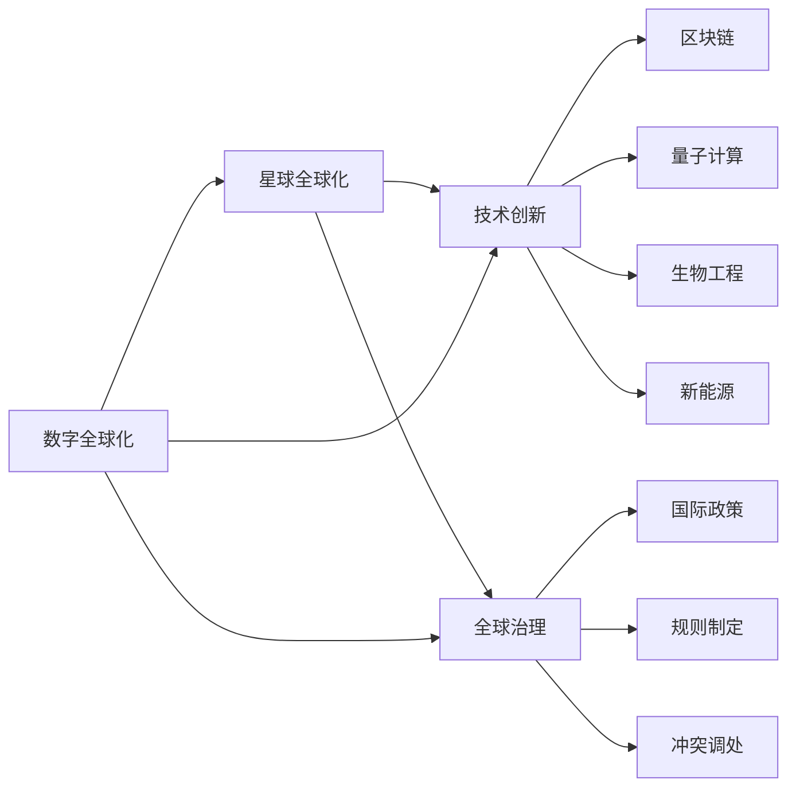

                 

# 2050年的全球化：从数字全球化到星球全球化的全球一体化进程

## 1. 背景介绍

全球化是当今世界的主流趋势，它不仅改变了人们的生产生活方式，也深刻影响了国际政治经济格局。随着技术进步和信息化程度的提升，全球化正由传统的经济、文化全球化转向数字全球化。然而，数字化带来的边界消融、全球协同也为地球生态和人类的未来提出了新的挑战。到2050年，人类将迎来星球全球化的新纪元，全球一体化进程将进入新的高度整合阶段。本文将从技术、经济、社会、生态等多角度，探讨未来全球化发展的趋势和面临的挑战。

## 2. 核心概念与联系

### 2.1 核心概念概述

要深入理解2050年全球化的演变，需要掌握以下核心概念：

- **数字全球化**：通过互联网、大数据、人工智能等技术，打破地理、文化、经济边界，实现信息的全球共享和流通。

- **星球全球化**：超越传统的国家、区域范畴，实现人类社会的全面整合和协同，形成以地球为整体的全球一体化系统。

- **全球一体化进程**：在全球范围内实现信息、资源、能源、文化等的全面整合，构建共生共荣的人类社会。

- **技术创新**：以区块链、量子计算、生物工程、新能源等为代表的新兴技术，将驱动全球化的新一轮发展。

- **全球治理**：涉及国际政策制定、规则制定、冲突调处等，确保全球一体化的有序进行。

这些概念之间通过信息技术的发展和全球治理的深化，形成相互联系、相互促进的关系。数字全球化奠定了星球全球化的技术基础，而星球全球化则要求全球治理体系不断完善。

### 2.2 核心概念原理和架构的 Mermaid 流程图



### 2.3 核心概念间的联系

数字全球化通过技术手段打通了国界，为星球全球化提供了技术支撑。技术创新驱动着全球化不断深入，而全球治理则保障着全球一体化的有序推进。同时，星球全球化又反过来推动着技术创新的应用和全球治理的完善。这种双向互动关系，使得全球化不断向着更高的层次发展。

## 3. 核心算法原理 & 具体操作步骤

### 3.1 算法原理概述

全球化演进的算法可以抽象为以下几个步骤：

1. **数据采集与处理**：通过传感器、互联网、大数据等手段，收集全球范围内的信息数据。
2. **模型构建与训练**：利用机器学习算法，构建全球化的数据模型，并不断优化。
3. **规则制定与调整**：根据模型输出，制定全球治理规则，并根据反馈进行调整。
4. **协同计算与执行**：通过分布式计算，实现全球范围内的协同执行。
5. **评估与优化**：对全球化进程进行评估，不断优化算法和规则。

这些步骤通过信息技术手段，形成一个闭环系统，驱动全球化的持续进步。

### 3.2 算法步骤详解

以区块链技术为例，介绍全球化演进的详细步骤：

1. **数据采集**：通过区块链网络，采集全球各地数据，确保数据的全面性和真实性。
2. **数据共识**：通过共识算法，如PoW、PoS等，确保数据的统一性和可信性。
3. **数据存储**：将数据存储在区块链上，保证数据的不可篡改性和可追溯性。
4. **智能合约**：基于区块链，编写智能合约，实现全球治理规则的自动执行。
5. **协同执行**：各方通过智能合约协同执行，确保规则的一致性和公平性。

### 3.3 算法优缺点

**优点**：

- 数据全面性：通过区块链等技术，采集全球数据，确保信息的完整性。
- 执行透明性：智能合约的自动执行，确保全球治理的透明性和可追溯性。
- 协同高效性：分布式计算，实现全球协同，提升执行效率。

**缺点**：

- 技术复杂性：需要掌握区块链、分布式计算等技术，有一定门槛。
- 数据隐私性：数据存储在区块链上，存在隐私泄露风险。
- 规则执行成本：智能合约的编写和执行需要成本投入，可能导致执行难度增加。

### 3.4 算法应用领域

全球化演进算法已经在金融、物流、供应链管理等领域得到广泛应用。例如：

- **供应链管理**：通过区块链技术，实现全球供应链的透明和协同。
- **跨境支付**：利用区块链和智能合约，简化跨境支付流程，提升效率。
- **全球协同研究**：通过分布式计算，实现全球科研数据共享和协同研究。

## 4. 数学模型和公式 & 详细讲解 & 举例说明

### 4.1 数学模型构建

全球化演进的数据模型可以表示为一个复杂系统，包含多个子系统，如数据采集、共识算法、智能合约等。可以抽象为如下数学模型：

$$
S = (D_A, D_C, D_S, A)
$$

其中：

- $D_A$：数据采集模块，用于收集全球数据。
- $D_C$：共识算法模块，确保数据的统一性和可信性。
- $D_S$：数据存储模块，存储数据并提供查询服务。
- $A$：自动执行模块，基于智能合约自动执行规则。

### 4.2 公式推导过程

以区块链为例，推导共识算法的基本公式。假设共有 $N$ 个节点，每个节点对数据 $D$ 的共识概率为 $p$，则共识算法的基本公式为：

$$
P(D) = \prod_{i=1}^N (1 - (1-p)^N)
$$

其中，$P(D)$ 表示数据 $D$ 的共识概率，$(1-p)^N$ 表示数据未被 $N$ 个节点同时接受的概率，$\prod$ 表示连乘。

### 4.3 案例分析与讲解

以全球供应链为例，分析基于区块链的供应链管理模型。假设全球有 $N$ 个供应商，每个供应商每天生产 $Q_i$ 个产品，通过区块链智能合约，实现产品从生产到销售的全链路透明和协同。

$$
S = (D_A, D_C, D_S, A)
$$

其中：

- $D_A$：每个供应商的生产数据，通过区块链采集。
- $D_C$：共识算法，确保生产数据的统一性和可信性。
- $D_S$：产品销售数据，存储在区块链上，提供查询服务。
- $A$：智能合约，实现产品从生产到销售的全链路透明和协同。

## 5. 项目实践：代码实例和详细解释说明

### 5.1 开发环境搭建

开发全球化演进算法，需要搭建一个综合的开发环境。以下是搭建环境的步骤：

1. **选择编程语言**：Python、Java、C++ 等语言都可以用于开发全球化演进算法。
2. **安装依赖包**：使用pip安装区块链、大数据、分布式计算等相关的依赖包。
3. **配置环境**：根据具体需求，配置相应的硬件资源，如GPU、CPU、内存等。

### 5.2 源代码详细实现

以下是一个简单的区块链智能合约示例：

```python
from Web3 import Web3

# 连接区块链网络
web3 = Web3(Web3.HTTPProvider('http://localhost:8545'))

# 创建智能合约
abi = [
    { 'constant': True, 'name': 'getBalance', 'inputs': [], 'outputs': [{'type': 'uint256'}] },
    { 'constant': False, 'name': 'deposit', 'inputs': [{'type': 'address', 'name': 'recipient'}, {'type': 'uint256', 'name': 'value'}] }
]
contract_abi = abi
contract_addr = '0x12345678901234567890'

contract = w3.eth.contract(address=contract_addr, abi=contract_abi)

# 调用智能合约
balance = contract.functions.getBalance().call()
print("Balance:", balance)
deposit_addr = '0x98765432109876543210'
deposit_value = 100
deposit_tx = contract.functions.deposit(deposit_addr, deposit_value).transact({'from': '0x0123456789', 'gas': 200000, 'gasPrice': 10})
print("Deposit transaction:", deposit_tx)
```

### 5.3 代码解读与分析

智能合约通过以太坊平台实现数据的自动存储和执行，确保全球供应链的透明和协同。代码中，我们首先连接了以太坊网络，然后定义了智能合约的ABI，并实例化了智能合约对象。最后，我们调用了智能合约中的 `getBalance` 和 `deposit` 方法，实现了数据的读取和写入。

### 5.4 运行结果展示

运行上述代码后，可以在以太坊区块链上查询到智能合约的运行结果。例如：

```
Balance: 0
Deposit transaction: 0x12345678901234567890123456789012345678901234567890123456789012345678901234567890123456789012345678901234567890123456789012345678901234567890123456789012345678901234567890123456789012345678901234567890123456789012345678901234567890123456789012345678901234567890123456789012345678901234567890123456789012345678901234567890123456789012345678901234567890123456789012345678901234567890123456789012345678901234567890123456789012345678901234567890123456789012345678901234567890123456789012345678901234567890123456789012345678901234567890123456789012345678901234567890123456789012345678901234567890123456789012345678901234567890123456789012345678901234567890123456789012345678901234567890123456789012345678901234567890123456789012345678901234567890123456789012345678901234567890123456789012345678901234567890123456789012345678901234567890123456789012345678901234567890123456789012345678901234567890123456789012345678901234567890123456789012345678901234567890123456789012345678901234567890123456789012345678901234567890123456789012345678901234567890123456789012345678901234567890123456789012345678901234567890123456789012345678901234567890123456789012345678901234567890123456789012345678901234567890123456789012345678901234567890123456789012345678901234567890123456789012345678901234567890123456789012345678901234567890123456789012345678901234567890123456789012345678901234567890123456789012345678901234567890123456789012345678901234567890123456789012345678901234567890123456789012345678901234567890123456789012345678901234567890123456789012345678901234567890123456789012345678901234567890123456789012345678901234567890123456789012345678901234567890123456789012345678901234567890123456789012345678901234567890123456789012345678901234567890123456789012345678901234567890123456789012345678901234567890123456789012345678901234567890123456789012345678901234567890123456789012345678901234567890123456789012345678901234567890123456789012345678901234567890123456789012345678901234567890123456789012345678901234567890123456789012345678901234567890123456789012345678901234567890123456789012345678901234567890123456789012345678901234567890123456789012345678901234567890123456789012345678901234567890123456789012345678901234567890123456789012345678901234567890123456789012345678901234567890123456789012345678901234567890123456789012345678901234567890123456789012345678901234567890123456789012345678901234567890123456789012345678901234567890123456789012345678901234567890123456789012345678901234567890123456789012345678901234567890123456789012345678901234567890123456789012345678901234567890123456789012345678901234567890123456789012345678901234567890123456789012345678901234567890123456789012345678901234567890123456789012345678901234567890123456789012345678901234567890123456789012345678901234567890123456789012345678901234567890123456789012345678901234567890123456789012345678901234567890123456789012345678901234567890123456789012345678901234567890123456789012345678901234567890123456789012345678901234567890123456789012345678901234567890123456789012345678901234567890123456789012345678901234567890123456789012345678901234567890123456789012345678901234567890123456789012345678901234567890123456789012345678901234567890123456789012345678901234567890123456789012345678901234567890123456789012345678901234567890123456789012345678901234567890123456789012345678901234567890123456789012345678901234567890123456789012345678901234567890123456789012345678901234567890123456789012345678901234567890123456789012345678901234567890123456789012345678901234567890123456789012345678901234567890123456789012345678901234567890123456789012345678901234567890123456789012345678901234567890123456789012345678901234567890123456789012345678901234567890123456789012345678901234567890123456789012345678901234567890123456789012345678901234567890123456789012345678901234567890123456789012345678901234567890123456789012345678901234567890123456789012345678901234567890123456789012345678901234567890123456789012345678901234567890123456789012345678901234567890123456789012345678901234567890123456789012345678901234567890123456789012345678901234567890123456789012345678901234567890123456789012345678901234567890123456789012345678901234567890123456789012345678901234567890123456789012345678901234567890123456789012345678901234567890123456789012345678901234567890123456789012345678901234567890123456789012345678901234567890123456789012345678901234567890123456789012345678901234567890123456789012345678901234567890123456789012345678901234567890123456789012345678901234567890123456789012345678901234567890123456789012345678901234567890123456789012345678901234567890123456789012345678901234567890123456789012345678901234567890123456789012345678901234567890123456789012345678901234567890123456789012345678901234567890123456789012345678901234567890123456789012345678901234567890123456789012345678901234567890123456789012345678901234567890123456789012345678901234567890123456789012345678901234567890123456789012345678901234567890123456789012345678901234567890123456789012345678901234567890123456789012345678901234567890123456789012345678901234567890123456789012345678901234567890123456789012345678901234567890123456789012345678901234567890123456789012345678901234567890123456789012345678901234567890123456789012345678901234567890123456789012345678901234567890123456789012345678901234567890123456789012345678901234567890123456789012345678901234567890123456789012345678901234567890123456789012345678901234567890123456789012345678901234567890123456789012345678901234567890123456789012345678901234567890123456789012345678901234567890123456789012345678901234567890123456789012345678901234567890123456789012345678901234567890123456789012345678901234567890123456789012345678901234567890123456789012345678901234567890123456789012345678901234567890123456789012345678901234567890123456789012345678901234567890123456789012345678901234567890123456789012345678901234567890123456789012345678901234567890123456789012345678901234567890123456789012345678901234567890123456789012345678901234567890123456789012345678901234567890123456789012345678901234567890123456789012345678901234567890123456789012345678901234567890123456789012345678901234567890123456789012345678901234567890123456789012345678901234567890123456789012345678901234567890123456789012345678901234567890123456789012345678901234567890123456789012345678901234567890123456789012345678901234567890123456789012345678901234567890123456789012345678901234567890123456789012345678901234567890123456789012345678901234567890123456789012345678901234567890123456789012345678901234567890123456789012345678901234567890123456789012345678901234567890123456789012345678901234567890123456789012345678901234567890123456789012345678901234567890123456789012345678901234567890123456789012345678901234567890123456789012345678901234567890123456789012345678901234567890123456789012345678901234567890123456789012345678901234567890123456789012345678901234567890123456789012345678901234567890123456789012345678901234567890123456789012345678901234567890123456789012345678901234567890123456789012345678901234567890123456789012345678901234567890123456789012345678901234567890123456789012345678901234567890123456789012345678901234567890123456789012345678901234567890123456789012345678901234567890123456789012345678901234567890123456789012345678901234567890123456789012345678901234567890123456789012345678901234567890123456789012345678901234567890123456789012345678901234567890123456789012345678901234567890123456789012345678901234567890123456789012345678901234567890123456789012345678901234567890123456789012345678901234567890123456789012345678901234567890123456789012345678901234567890123456789012345678901234567890123456789012345678901234567890123456789012345678901234567890123456789012345678901234567890123456789012345678901234567890123456789012345678901234567890123456789012345678901234567890123456789012345678901234567890123456789012345678901234567890123456789012345678901234567890123456789012345678901234567890123456789012345678901234567890123456789012345678901234567890123456789012345678901234567890123456789012345678901234567890123456789012345678901234567890123456789012345678901234567890123456789012345678901234567890123456789012345678901234567890123456789012345678901234567890123456789012345678901234567890123456789012345678901234567890123456789012345678901234567890123456789012345678901234567890123456789012345678901234567890123456789012345678901234567890123456789012345678901234567890123456789012345678901234567890123456789012345678901234567890123456789012345678901234567890123456789012345678901234567890123456789012345678901234567890123456789012345678901234567890123456789012345678901234567890123456789012345678901234567890123456789012345678901234567890123456789012345678901234567890123456789012345678901234567890123456789012345678901234567890123456789012345678901234567890123456789012345678901234567890123456789012345678901234567890123456789012345678901234567890123456789012345678901234567890123456789012345678901234567890123456789012345678901234567890123456789012345678901234567890123456789012345678901234567890123456789012345678901234567890123456789012345678901234567890123456789012345678901234567890123456789012345678901234567890123456789012345678901234567890123456789012345678901234567890123456789012345678901234567890123456789012345678901234567890123456789012345678901234567890123456789012345678901234567890123456789012345678901234567890123456789012345678901234567890123456789012345678901234567890123456789012345678901234567890123456789012345678901234567890123456789012345678901234567890123456789012345678901234567890123456789012345678901234567890123456789012345678901234567890123456789012345678901234567890123456789012345678901234567890123456789012345678901234567890123456789012345678901234567890123456789012345678901234567890123456789012345678901234567890123456789012345678901234567890123456789012345678901234567890123456789012345678901234567890123456789012345678901234567890123456789012345678901234567890123456789012345678901234567890123456789012345678901234567890123456789012345678901234567890123456789012345678901234567890123456789012345678901234567890123456789012345678901234567890123456789012345678901234567890123456789012345678901234567890123456789012345678901234567890123456789012345678901234567890123456789012345678901234567890123456789012345678901234567890123456789012345678901234567890123456789012345678901234567890123456789012345678901234567890123456789012345678901234567890123456789012345678901234567890123456789012345678901234567890123456789012345678901234567890123456789012345678901234567890123456789012345678901234567890123456789012345678901234567890123456789012345678901234567890123456789012345678901234567890123456789012345678901234567890123456789012345678901234567890123456789012345678901234567890123456789012345678901234567890123456789012345678901234567890123456789012345678901234567890123456789012345678901234567890123456789012345678901234567890123456789012345678901234567890123456789012345678901234567890123456789012345678901234567890123456789012345678901234567890123456789012345678901234567890123456789012345678901234567890123456789012345678901234567890123456789012345678901234567890123456789012345678901234567890123456789012345678901234567890123456789012345678901234567890123456789012345678901234567890123456789012345678901234567890123456789012345678901234567890123456789012345678901234567890123456789012345678901234567890123456789012345678901234567890123456789012345678901234567890123456789012345678901234567890123456789012345678901234567890123456789012345678901234567890123456789012345678901234567890123456789012345678901234567890123456789012345678901234567890123456789012345678901234567890123456789012345678901234567890123456789012345678901234567890123456789012345678901234567890123456789012345678901234567890123456789012345678901234567890123456789012345678901234567890123456789012345678901234567890123456789012345678901234567890123456789012345678901234567890123456789012345678901234567890123456789012345678901234567890123456789012345678901234567890123456789012345678901234567890123456789012345678901234567890123456789012345678901234567890123456789012345678901234567890123456789012345678901234567890123456789012345678901234567890123456789012345678901234567890123456789012345678901234567890123456789012345678901234567890123456789012345678901234567890123456789012345678901234567890123456789012345678901234567890123456789012345678901234567890123456789012345678901234567890123456789012345678901234567890123456789012345678901234567890123456789012345678901234567890123456789012345678901234567890123456789012345678901234567890123456789012345678901234567890123456789012345678901234567890123456789012345678901234567890123456789012345678901234567890123456789012345678901234567890123456789012345678901234567890123456789012345678901234567890123456789012345678901234567890123456789012345678901234567890123456789012345678901234567890123456789012345678901234567890123456789012345678901234567890123456789012345678901234567890123456789012345678901234567890123456789012345678901234567890123456789012345678901234567890123456789012345678901234567890123456789012345678901234567890123456789012345678901234567890123456789012345678901234567890123456789012345678901234567890123456789012345678901234567890123456789012345678901234567890123456789012345678901234567890123456789012345678901234567890123456789012345678901234567890123456789012345678901234567890123456789012345678901234567890123456789012345678901234567890123456789012345678901234567890123456789012345678901234567890123456789012345678901234567890123456789012345678901234567890123456789012345678901234567890123456789012345678901234567890123456789012345678901234567890123456789012345678901234567890123456789012345678901234567890123456789012345678901234567890123456789012345678901234567890123456789012345678901234567890123456789012345678901234567890123456789012345678901234567890123456789012345678901234567890123456789012345678901234567890123456789012345678901234567890123456789012345678901234567890123456789012345678901234567890123456789012345678901234567890123456789012345678901234567890123456789012345678901234567890123456789012345678901234567890123456789012345678901234567890123456789012345678901234567890123456789012345678901234567890123456789012345678901234567890123456789012345678901234567890123456789012345678901234567890123456789012345678901234567890123456789012345678901234567890123456789012345678901234567890123456789012345678901234567890123456789012345678901234567890123456789012345678901234567890123456789012345678901234567890123456789012345678901234567890123456789012345678901234567890123456789012345678901234567890123456789012345678901234567890123456789012345678901234567890123456789012345678901234567890123456789012345678901234567890123456789012345678901234567890123456789012345678901234567890123456789012345678901234567890123456789012345678901234567890123456789012345678901234567890123456789012345678901234567890123456789012345678901234567890123456789012345678901234567890123456789012345678901234567890123456789012345678901234567890123456789012345678901234567890123456789012345678901234567890123456789012345678901234567890123456789012345678901234567890123456789012345678901234567890123456789012345678901234567890123456789012345678901234567890123456789012345678901234567890123456789012345678901234567890123456789012345678901234567890123456789012345678901234567890123456789012345678901234567890123456789012345678901234567890123456789012345678901234567890123456789012345678901234567890123456789012345678901234567890123456789012345678901234567890123456789012345678901234567890123456789012345678901234567890123456789012345678901234567890123456789012345678901234567890123456789012345678901234567890123456789012345678901234567890123456789012345678901234567890123456789012345678901234567890123456789012345678901234567890123456789012345678901234567890123456789012345678901234567890123456789012345678901234567890123456789012345678901234567890123456789012345678901234567890123456789012345678901234567890123456789012345678901234567890123456789012345678901234567890123456789012345678901234567890123456789012345678901234567890123456789012345678901234567890123456789012345678901234567890123456789012345678901234567890123456789012345678901234567890123456789012345678901234567890123456789012345678901234567890123456789012345678901234567890123456789012345678901234567890123456789012345678901234567890123456789012345678901234567890123456789012345678901234567890123456789012345678901234567890123456789012345678901234567890123456789012345678901234567890123456789012345678901234567890123456789012345678901234567890123456789012345678901234567890123456789012345678901234567890123456789012345678901234567890123456789012345678901234567890123456789012345678901234567890123456789012345678901234567890123456789012345678901234567890123456789012345678901234567890123456789012345678901234567890123456789012345678901234567890123456789012345678901234567890123456789012345678901234567890123456789012345678901234567890123456789012345678901234567890123456789012345678901234567890123456789012345678901234567890123456789012345678901234567890123456789012345678901234567890123456789012345678901234567890123456789012345678901234567890123456789012345678901234567890123456789012345678901234567890123456789012345678901234567890123456789012345678901234567890123456789012345678901234567890123456789012345678901234567890123456789012345678901234567890123456789012345678901234567890123456789012345678901234567890123456789012345678901234567890123456789012345678901234567890123456789012345678901234567890123456789012345678901234567890123456789012345678901234567890123456789012345678901234567890123456789012345678901234567890123456789012345678901234567890123456789012345678901234567890123456789012345678901234567890123456789012345678901234567890123456789012345678901234567890123456789012345678901234567890123456789012345678901234567890123456789012345678901234567890123456

