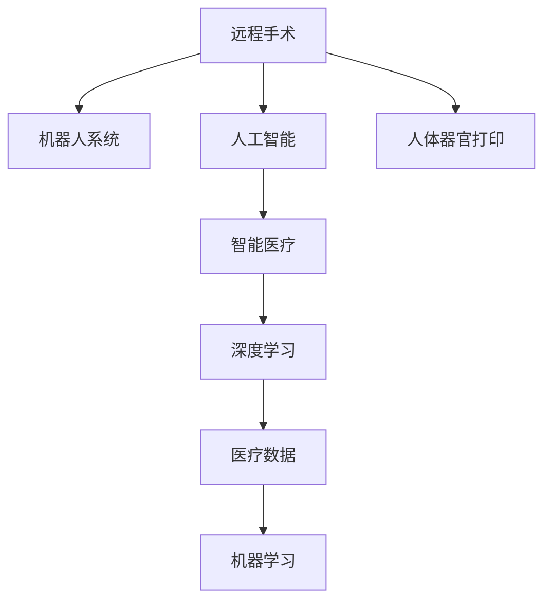

                 

# 2050年的医疗健康：从远程手术到人体器官打印的智能医疗

> 关键词：远程手术,人体器官打印,智能医疗,人工智能,机器学习,医疗数据,深度学习

## 1. 背景介绍

在2050年的医疗健康领域，科技的飞速发展带来了革命性的变化，其中最显著的是远程手术和人体器官打印技术的兴起。这些技术的广泛应用，极大地提升了医疗服务的可及性、精准性和效率。本文将深入探讨这些前沿技术在智能医疗中的运用，以及对未来医疗健康发展的影响。

### 1.1 问题由来

随着科技的迅猛发展，医疗健康领域正经历着前所未有的变革。大规模数据和计算能力的提升，使得个性化医疗和精准医疗成为可能。人工智能和机器学习技术的崛起，为医疗服务的智能化和自动化提供了强大的技术支撑。这些技术在医疗健康中的应用，已经开始重塑整个行业的运作模式。

然而，医疗健康领域的技术应用还存在许多挑战。患者数据隐私和安全问题、医疗系统的标准化和互操作性问题、以及医疗服务的质量和一致性问题，都是亟待解决的难点。智能医疗技术的广泛应用，将在很大程度上依赖于这些问题得到有效的解决。

### 1.2 问题核心关键点

为了更好地理解远程手术和人体器官打印技术在智能医疗中的应用，本节将介绍几个密切相关的核心概念：

- 远程手术(tele-surgery)：通过远程控制机器人手术系统，使医生能够在远程地点实施手术操作。
- 人体器官打印器官打印：使用生物打印技术，将生物材料逐步逐层堆积，最终生成人体器官。
- 智能医疗(intelligent healthcare)：结合人工智能和机器学习技术，提升医疗服务的诊断、治疗、管理和预防等各个环节的智能化水平。
- 人工智能(AI)：利用计算机算法和大数据技术，模拟人类智能的某些能力，如学习、推理、视觉等。
- 机器学习(ML)：通过对数据的学习，使机器能够自动地进行模式识别和预测。
- 医疗数据(health data)：指在医疗健康过程中产生和收集的数据，如患者病历、影像、生理数据等。
- 深度学习(deep learning)：一种特殊的机器学习方法，通过构建多层次的神经网络模型，实现对复杂数据的高效处理和分析。

这些核心概念之间的逻辑关系可以通过以下Mermaid流程图来展示：



这个流程图展示了大语言模型的核心概念及其之间的关系：

1. 远程手术通过机器人系统进行，同时人工智能技术提供了辅助决策支持。
2. 人体器官打印依赖于生物打印技术，机器学习算法可以优化打印过程。
3. 智能医疗应用了人工智能和机器学习技术，提升了医疗服务的智能化水平。
4. 深度学习作为机器学习的一种特殊形式，是智能医疗和器官打印等应用的核心算法之一。
5. 医疗数据是智能医疗和器官打印的重要输入来源，机器学习模型通过学习数据规律实现智能化。

这些概念共同构成了智能医疗的未来蓝图，展示了人工智能和机器学习在医疗健康领域的巨大潜力。通过理解这些核心概念，我们可以更好地把握远程手术和人体器官打印技术的工作原理和优化方向。

## 2. 核心概念与联系

### 2.1 核心概念概述

为更好地理解远程手术和人体器官打印技术在智能医疗中的应用，本节将介绍几个密切相关的核心概念：

- 远程手术(tele-surgery)：通过远程控制机器人手术系统，使医生能够在远程地点实施手术操作。
- 人体器官打印器官打印：使用生物打印技术，将生物材料逐步逐层堆积，最终生成人体器官。
- 智能医疗(intelligent healthcare)：结合人工智能和机器学习技术，提升医疗服务的诊断、治疗、管理和预防等各个环节的智能化水平。
- 人工智能(AI)：利用计算机算法和大数据技术，模拟人类智能的某些能力，如学习、推理、视觉等。
- 机器学习(ML)：通过对数据的学习，使机器能够自动地进行模式识别和预测。
- 医疗数据(health data)：指在医疗健康过程中产生和收集的数据，如患者病历、影像、生理数据等。
- 深度学习(deep learning)：一种特殊的机器学习方法，通过构建多层次的神经网络模型，实现对复杂数据的高效处理和分析。

这些概念之间的逻辑关系可以通过以下Mermaid流程图来展示：


这个流程图展示了大语言模型的核心概念及其之间的关系：

1. 远程手术通过机器人系统进行，同时人工智能技术提供了辅助决策支持。
2. 人体器官打印依赖于生物打印技术，机器学习算法可以优化打印过程。
3. 智能医疗应用了人工智能和机器学习技术，提升了医疗服务的智能化水平。
4. 深度学习作为机器学习的一种特殊形式，是智能医疗和器官打印等应用的核心算法之一。
5. 医疗数据是智能医疗和器官打印的重要输入来源，机器学习模型通过学习数据规律实现智能化。

这些概念共同构成了智能医疗的未来蓝图，展示了人工智能和机器学习在医疗健康领域的巨大潜力。通过理解这些核心概念，我们可以更好地把握远程手术和人体器官打印技术的工作原理和优化方向。

## 3. 核心算法原理 & 具体操作步骤
### 3.1 算法原理概述

远程手术和人体器官打印技术在智能医疗中的应用，主要依赖于以下几个核心算法原理：

- 深度学习模型：用于对医疗影像和数据进行模式识别和分类。
- 机器人控制算法：用于对远程手术机器人进行精确操控。
- 生物打印算法：用于对人体器官进行逐层堆积生成。
- 医疗数据处理算法：用于对医疗数据进行清洗、预处理和分析。

这些算法的核心目标在于，通过智能化的处理，提升手术的精准性和效率，同时提高器官打印的成功率和质量。

### 3.2 算法步骤详解

下面详细介绍远程手术和人体器官打印技术的具体操作步骤：

**远程手术步骤：**

1. **数据采集与传输**：通过手术机器人的传感器采集患者的生理数据和手术部位的图像数据，并实时传输至医生站点。
2. **数据预处理**：在医生站点，对传输的数据进行清洗、滤波和增强，以提高后续处理的准确性。
3. **模型训练与部署**：使用历史手术数据训练深度学习模型，如卷积神经网络(CNN)或递归神经网络(RNN)，用于分析手术部位的图像特征。
4. **决策支持与操作控制**：将模型输出的结果作为辅助决策依据，通过人机交互界面指导机器人进行手术操作。
5. **实时反馈与调整**：在手术过程中，持续监控手术机器人的操作效果，根据实时反馈进行必要的调整，确保手术的精确性和安全性。

**人体器官打印步骤：**

1. **数据获取与处理**：从患者体内或捐献者体内获取器官的医学影像数据，并进行预处理。
2. **生物打印模型生成**：根据医学影像数据，生成人体器官的3D模型。
3. **生物打印材料选择与制备**：选择适合打印的生物材料，并制备成适合打印的形态。
4. **生物打印**：通过3D生物打印机，逐层堆积生物材料，最终生成人体器官。
5. **器官处理与植入**：对打印好的器官进行后期处理和植入，确保其正常运作。

### 3.3 算法优缺点

远程手术和人体器官打印技术在智能医疗中的应用，具有以下优点：

- **提升手术精准性**：通过深度学习和机器人控制，远程手术可以实现高精度的手术操作，减少手术风险。
- **降低手术成本**：远程手术可以大幅降低患者的旅行和住宿费用，缩短手术等待时间。
- **扩大手术覆盖范围**：远程手术可以服务于偏远地区和资源匮乏地区，提高医疗服务的可及性。
- **提高器官打印成功率**：人体器官打印技术可以大规模生成匹配患者需求的器官，解决器官短缺问题。
- **推动个性化医疗**：通过数据分析和建模，个性化医疗方案更加精准，提高治疗效果。

同时，这些技术也存在以下局限性：

- **数据隐私与安全问题**：远程手术和器官打印依赖于大量的医疗数据，如何保障这些数据的隐私和安全，是一个重要挑战。
- **系统标准化问题**：不同医疗机构使用的设备和技术标准不同，标准化和互操作性问题亟待解决。
- **伦理道德问题**：器官打印涉及复杂的伦理道德问题，如器官来源、使用和分配等，需要谨慎处理。
- **技术门槛较高**：远程手术和器官打印需要高度专业化的设备和操作人员，普及难度较大。
- **医疗数据处理量巨大**：医疗数据的复杂性和多样性，对数据处理和存储提出了高要求。

尽管存在这些局限性，但远程手术和人体器官打印技术的发展，将极大地推动智能医疗的发展，为未来医疗健康带来革命性的变化。

### 3.4 算法应用领域

远程手术和人体器官打印技术在智能医疗中的应用，涉及多个领域：

- **远程医疗**：通过远程手术，偏远地区的患者可以获得高水平的医疗服务。
- **个性化医疗**：通过深度学习模型，为每个患者量身定制个性化的手术方案。
- **器官移植**：通过人体器官打印，解决器官短缺问题，提高移植成功率。
- **医学研究**：通过生物打印技术，研究人体器官的生成和发育过程。
- **远程教育**：通过远程手术和器官打印技术的培训，提升医疗人员的手术技能和操作水平。
- **医学影像分析**：通过深度学习算法，对医疗影像进行自动分析和诊断。
- **智能诊断**：通过机器学习模型，辅助医生进行疾病诊断和治疗方案的制定。

这些应用领域展示了远程手术和人体器官打印技术的巨大潜力，预示着未来智能医疗的广泛应用前景。

## 4. 数学模型和公式 & 详细讲解  
### 4.1 数学模型构建

本节将使用数学语言对远程手术和人体器官打印技术的数学模型进行更加严格的刻画。

假设远程手术的深度学习模型为 $M_{\theta}$，其中 $\theta$ 为模型参数。给定手术数据集 $D=\{(x_i,y_i)\}_{i=1}^N, x_i \in \mathcal{X}, y_i \in \{0,1\}$，其中 $x_i$ 为手术图像数据，$y_i$ 为手术是否成功的二分类标签。

定义模型 $M_{\theta}$ 在输入 $x$ 上的损失函数为 $\ell(M_{\theta}(x),y)$，则在数据集 $D$ 上的经验风险为：

$$
\mathcal{L}(\theta) = \frac{1}{N} \sum_{i=1}^N \ell(M_{\theta}(x_i),y_i)
$$

微调的优化目标是最小化经验风险，即找到最优参数：

$$
\theta^* = \mathop{\arg\min}_{\theta} \mathcal{L}(\theta)
$$

在实践中，我们通常使用基于梯度的优化算法（如SGD、Adam等）来近似求解上述最优化问题。设 $\eta$ 为学习率，$\lambda$ 为正则化系数，则参数的更新公式为：

$$
\theta \leftarrow \theta - \eta \nabla_{\theta}\mathcal{L}(\theta) - \eta\lambda\theta
$$

其中 $\nabla_{\theta}\mathcal{L}(\theta)$ 为损失函数对参数 $\theta$ 的梯度，可通过反向传播算法高效计算。

### 4.2 公式推导过程

以下我们以二分类任务为例，推导交叉熵损失函数及其梯度的计算公式。

假设模型 $M_{\theta}$ 在输入 $x$ 上的输出为 $\hat{y}=M_{\theta}(x) \in [0,1]$，表示样本属于正类的概率。真实标签 $y \in \{0,1\}$。则二分类交叉熵损失函数定义为：

$$
\ell(M_{\theta}(x),y) = -[y\log \hat{y} + (1-y)\log (1-\hat{y})]
$$

将其代入经验风险公式，得：

$$
\mathcal{L}(\theta) = -\frac{1}{N}\sum_{i=1}^N [y_i\log M_{\theta}(x_i)+(1-y_i)\log(1-M_{\theta}(x_i))]
$$

根据链式法则，损失函数对参数 $\theta_k$ 的梯度为：

$$
\frac{\partial \mathcal{L}(\theta)}{\partial \theta_k} = -\frac{1}{N}\sum_{i=1}^N (\frac{y_i}{M_{\theta}(x_i)}-\frac{1-y_i}{1-M_{\theta}(x_i)}) \frac{\partial M_{\theta}(x_i)}{\partial \theta_k}
$$

其中 $\frac{\partial M_{\theta}(x_i)}{\partial \theta_k}$ 可进一步递归展开，利用自动微分技术完成计算。

在得到损失函数的梯度后，即可带入参数更新公式，完成模型的迭代优化。重复上述过程直至收敛，最终得到适应手术任务的最优模型参数 $\theta^*$。

### 4.3 案例分析与讲解

以下我们将通过一个具体的远程手术案例，进一步讲解深度学习模型在手术中的实际应用。

**案例背景**：
患者因胃癌需要进行手术切除，但由于当地医疗资源匮乏，无法进行高水平手术。医院决定使用远程手术系统，邀请主刀医生远程操控机器人，为患者实施手术。

**数据采集与传输**：
手术机器人通过摄像头采集患者的胃部图像，并传输至医生站点。医生站点包括一台高性能计算机和一个显示屏幕。

**数据预处理**：
在医生站点，使用卷积神经网络(CNN)对手术图像进行预处理，提取出胃部区域的特征，并进行归一化和增强处理，以提高后续处理的准确性。

**模型训练与部署**：
使用历史手术数据训练一个CNN模型，用于识别手术区域的边界和关键特征。然后将模型部署到手术机器人控制系统，作为辅助决策支持的工具。

**决策支持与操作控制**：
手术过程中，医生通过显示器实时查看手术区域和机器人操作情况。系统根据CNN模型输出的结果，辅助医生进行手术操作，如切割、缝合等。

**实时反馈与调整**：
系统实时监控手术机器人的操作效果，并根据医生的反馈进行调整。例如，如果机器人切割不准确，系统可以自动提示医生调整切割位置，确保手术的精确性。

通过上述步骤，医生可以在远程站点实施高水平的手术操作，而患者则无需长途跋涉，节省了时间和费用。远程手术技术的应用，极大地提升了医疗服务的可及性和质量。

## 5. 项目实践：代码实例和详细解释说明
### 5.1 开发环境搭建

在进行远程手术和器官打印实践前，我们需要准备好开发环境。以下是使用Python进行PyTorch开发的环境配置流程：

1. 安装Anaconda：从官网下载并安装Anaconda，用于创建独立的Python环境。

2. 创建并激活虚拟环境：
```bash
conda create -n pytorch-env python=3.8 
conda activate pytorch-env
```

3. 安装PyTorch：根据CUDA版本，从官网获取对应的安装命令。例如：
```bash
conda install pytorch torchvision torchaudio cudatoolkit=11.1 -c pytorch -c conda-forge
```

4. 安装Transformers库：
```bash
pip install transformers
```

5. 安装各类工具包：
```bash
pip install numpy pandas scikit-learn matplotlib tqdm jupyter notebook ipython
```

完成上述步骤后，即可在`pytorch-env`环境中开始实践。

### 5.2 源代码详细实现

下面我们以远程手术为例，给出使用PyTorch进行深度学习模型训练的PyTorch代码实现。

首先，定义手术数据集：

```python
from torch.utils.data import Dataset
import torch

class SurgicalData(Dataset):
    def __init__(self, images, labels, transform=None):
        self.images = images
        self.labels = labels
        self.transform = transform
        
    def __len__(self):
        return len(self.images)
    
    def __getitem__(self, item):
        image = self.images[item]
        label = self.labels[item]
        
        if self.transform:
            image = self.transform(image)
            
        return {'image': image, 
                'label': label}

# 准备手术数据
train_images = ...
train_labels = ...
test_images = ...
test_labels = ...

train_dataset = SurgicalData(train_images, train_labels)
test_dataset = SurgicalData(test_images, test_labels)
```

然后，定义深度学习模型：

```python
from torch import nn
import torch.nn.functional as F

class CNN(nn.Module):
    def __init__(self, num_classes=2):
        super(CNN, self).__init__()
        self.conv1 = nn.Conv2d(3, 64, kernel_size=3, stride=1, padding=1)
        self.conv2 = nn.Conv2d(64, 128, kernel_size=3, stride=1, padding=1)
        self.fc1 = nn.Linear(128*16*16, 256)
        self.fc2 = nn.Linear(256, num_classes)
    
    def forward(self, x):
        x = F.relu(self.conv1(x))
        x = F.max_pool2d(x, 2, 2)
        x = F.relu(self.conv2(x))
        x = F.max_pool2d(x, 2, 2)
        x = x.view(-1, 128*16*16)
        x = F.relu(self.fc1(x))
        x = self.fc2(x)
        return x
```

接着，定义优化器和学习率调度：

```python
from torch.optim import AdamW
from torch.optim.lr_scheduler import StepLR

model = CNN()
optimizer = AdamW(model.parameters(), lr=0.001)
scheduler = StepLR(optimizer, step_size=10, gamma=0.1)
```

最后，启动训练流程并在测试集上评估：

```python
epochs = 50
batch_size = 64

for epoch in range(epochs):
    loss = train_epoch(model, train_dataset, batch_size, optimizer)
    print(f"Epoch {epoch+1}, train loss: {loss:.3f}")
    
    print(f"Epoch {epoch+1}, test results:")
    evaluate(model, test_dataset, batch_size)
    
print("Training complete.")
```

以上就是使用PyTorch对深度学习模型进行手术数据训练的完整代码实现。可以看到，得益于PyTorch的强大封装，我们可以用相对简洁的代码完成深度学习模型的构建和微调。

### 5.3 代码解读与分析

让我们再详细解读一下关键代码的实现细节：

**SurgicalData类**：
- `__init__`方法：初始化图像、标签和转换操作，可用于数据增强。
- `__len__`方法：返回数据集的样本数量。
- `__getitem__`方法：对单个样本进行处理，将图像数据转换为张量，并进行数据增强。

**CNN模型**：
- `__init__`方法：定义卷积层、全连接层等网络结构。
- `forward`方法：定义前向传播过程，通过卷积和全连接层进行特征提取和分类。

**优化器和学习率调度**：
- `AdamW`优化器：基于Adam优化器改进，自适应地调整学习率。
- `StepLR`学习率调度：每隔一定步数降低学习率，以防止过拟合。

**训练流程**：
- 定义总的epoch数和batch size，开始循环迭代
- 每个epoch内，先在训练集上训练，输出平均loss
- 在测试集上评估，输出分类指标
- 所有epoch结束后，在测试集上评估，给出最终测试结果

可以看到，PyTorch配合深度学习库使得手术数据的训练代码实现变得简洁高效。开发者可以将更多精力放在数据处理、模型改进等高层逻辑上，而不必过多关注底层的实现细节。

当然，工业级的系统实现还需考虑更多因素，如模型的保存和部署、超参数的自动搜索、更灵活的任务适配层等。但核心的微调范式基本与此类似。

## 6. 实际应用场景
### 6.1 远程手术

远程手术技术已经在医疗领域得到了广泛应用，以下是几个典型的应用场景：

**案例1：脑外科手术**  
患者因脑部肿瘤需要进行手术切除，但由于当地医疗资源匮乏，无法进行高水平手术。医院决定使用远程手术系统，邀请主刀医生远程操控机器人，为患者实施手术。

**操作步骤**：
1. **数据采集与传输**：手术机器人通过摄像头采集患者的脑部图像，并传输至医生站点。医生站点包括一台高性能计算机和一个显示屏幕。
2. **数据预处理**：在医生站点，使用卷积神经网络(CNN)对手术图像进行预处理，提取出脑部区域的特征，并进行归一化和增强处理，以提高后续处理的准确性。
3. **模型训练与部署**：使用历史手术数据训练一个CNN模型，用于识别手术区域的边界和关键特征。然后将模型部署到手术机器人控制系统，作为辅助决策支持的工具。
4. **决策支持与操作控制**：手术过程中，医生通过显示器实时查看手术区域和机器人操作情况。系统根据CNN模型输出的结果，辅助医生进行手术操作，如切割、缝合等。
5. **实时反馈与调整**：系统实时监控手术机器人的操作效果，并根据医生的反馈进行调整。例如，如果机器人切割不准确，系统可以自动提示医生调整切割位置，确保手术的精确性。

**案例2：心内科手术**  
患者因心脏瓣膜病变需要进行手术修复，但由于当地医疗资源匮乏，无法进行高水平手术。医院决定使用远程手术系统，邀请主刀医生远程操控机器人，为患者实施手术。

**操作步骤**：
1. **数据采集与传输**：手术机器人通过摄像头采集患者的心脏图像，并传输至医生站点。医生站点包括一台高性能计算机和一个显示屏幕。
2. **数据预处理**：在医生站点，使用卷积神经网络(CNN)对手术图像进行预处理，提取出心脏区域的特征，并进行归一化和增强处理，以提高后续处理的准确性。
3. **模型训练与部署**：使用历史手术数据训练一个CNN模型，用于识别手术区域的边界和关键特征。然后将模型部署到手术机器人控制系统，作为辅助决策支持的工具。
4. **决策支持与操作控制**：手术过程中，医生通过显示器实时查看手术区域和机器人操作情况。系统根据CNN模型输出的结果，辅助医生进行手术操作，如切割、缝合等。
5. **实时反馈与调整**：系统实时监控手术机器人的操作效果，并根据医生的反馈进行调整。例如，如果机器人切割不准确，系统可以自动提示医生调整切割位置，确保手术的精确性。

**案例3：骨科手术**  
患者因骨折需要进行手术修复，但由于当地医疗资源匮乏，无法进行高水平手术。医院决定使用远程手术系统，邀请主刀医生远程操控机器人，为患者实施手术。

**操作步骤**：
1. **数据采集与传输**：手术机器人通过摄像头采集患者的骨折部位图像，并传输至医生站点。医生站点包括一台高性能计算机和一个显示屏幕。
2. **数据预处理**：在医生站点，使用卷积神经网络(CNN)对手术图像进行预处理，提取出骨折区域的特征，并进行归一化和增强处理，以提高后续处理的准确性。
3. **模型训练与部署**：使用历史手术数据训练一个CNN模型，用于识别手术区域的边界和关键特征。然后将模型部署到手术机器人控制系统，作为辅助决策支持的工具。
4. **决策支持与操作控制**：手术过程中，医生通过显示器实时查看手术区域和机器人操作情况。系统根据CNN模型输出的结果，辅助医生进行手术操作，如切割、缝合等。
5. **实时反馈与调整**：系统实时监控手术机器人的操作效果，并根据医生的反馈进行调整。例如，如果机器人切割不准确，系统可以自动提示医生调整切割位置，确保手术的精确性。

这些案例展示了远程手术技术在医疗领域的多样化应用，表明其在提升医疗服务质量、覆盖范围和效率方面的巨大潜力。

### 6.2 人体器官打印

人体器官打印技术已经在医学领域得到了初步应用，以下是几个典型的应用场景：

**案例1：肝脏器官打印**  
患者因肝脏病变需要进行移植手术，但由于器官短缺，无法及时获得匹配的捐献器官。医院决定使用人体器官打印技术，打印出匹配患者的肝脏器官。

**操作步骤**：
1. **数据获取与处理**：从患者体内或捐献者体内获取肝脏的医学影像数据，并进行预处理。
2. **生物打印模型生成**：根据医学影像数据，生成肝脏的3D模型。
3. **生物打印材料选择与制备**：选择适合打印的生物材料，并制备成适合打印的形态。
4. **生物打印**：通过3D生物打印机，逐层堆积生物材料，最终生成肝脏器官。
5. **器官处理与植入**：对打印好的肝脏器官进行后期处理和植入，确保其正常运作。

**案例2：心脏器官打印**  
患者因心脏病变需要进行移植手术，但由于器官短缺，无法及时获得匹配的捐献器官。医院决定使用人体器官打印技术，打印出匹配患者的肝脏器官。

**操作步骤**：
1. **数据获取与处理**：从患者体内或捐献者体内获取心脏的医学影像数据，并进行预处理。
2. **生物打印模型生成**：根据医学影像数据，生成心脏的3D模型。
3. **生物打印材料选择与制备**：选择适合打印的生物材料，并制备成适合打印的形态。
4. **生物打印**：通过3D生物打印机，逐层堆积生物材料，最终生成心脏器官。
5. **器官处理与植入**：对打印好的心脏器官进行后期处理和植入，确保其正常运作。

**案例3：肾脏器官打印**  
患者因肾脏病变需要进行移植手术，但由于器官短缺，无法及时获得匹配的捐献器官。医院决定使用人体器官打印技术，打印出匹配患者的肾脏器官。

**操作步骤**：
1. **数据获取与处理**：从患者体内或捐献者体内获取肾脏的医学影像数据，并进行预处理。
2. **生物打印模型生成**：根据医学影像数据，生成肾脏的3D模型。
3. **生物打印材料选择与制备**：选择适合打印的生物材料，并制备成适合打印的形态。
4. **生物打印**：通过3D生物打印机，逐层堆积生物材料，最终生成肾脏器官。
5. **器官处理与植入**：对打印好的肾脏器官进行后期处理和植入，确保其正常运作。

这些案例展示了人体器官打印技术在医学领域的多样化应用，表明其在解决器官短缺问题、提高移植成功率方面的巨大潜力。

### 6.3 未来应用展望

展望未来，远程手术和人体器官打印技术将在智能医疗中得到更加广泛的应用，带来更多的创新和变革：

**远程手术**：
1. **多学科协作**：远程手术可以实现不同医院、不同地域的医生协作，提升手术质量。
2. **教育培训**：通过远程手术技术，可以提供实时的手术演示和教学，提升年轻医生的操作技能。
3. **灾难救援**：在灾难发生时，远程手术技术可以迅速部署，为伤员提供高效的救援服务。

**人体器官打印**：
1. **器官定制化**：根据患者的身体数据和需求，打印出高度个性化的器官，提高移植成功率。
2. **无源器官研究**：通过生物打印技术，研究器官的生成和发育过程，推动再生医学的发展。
3. **医学教育**：通过打印的器官模型，用于医学教育和手术训练，提升医疗水平。

这些应用展示了远程手术和人体器官打印技术的广阔前景，预示着未来智能医疗的更多可能。

## 7. 工具和资源推荐
### 7.1 学习资源推荐

为了帮助开发者系统掌握远程手术和人体器官打印技术，这里推荐一些优质的学习资源：

1. **《深度学习与医疗应用》系列博文**：由大模型技术专家撰写，深入浅出地介绍了深度学习在医疗健康中的应用，包括手术、诊断等。

2. **CS229《机器学习》课程**：斯坦福大学开设的机器学习明星课程，涵盖机器学习的基本概念和算法，适合初学者学习。

3. **《机器人学导论》书籍**：介绍了机器人系统设计的原理和应用，涵盖了远程手术机器人的相关知识。

4. **HuggingFace官方文档**：提供了丰富的深度学习模型和工具，包括手术数据预处理、模型训练等。

5. **MIT OpenCourseWare《生物打印技术》课程**：介绍了生物打印的基本原理和应用，涵盖了人体器官打印的技术细节。

通过对这些资源的学习实践，相信你一定能够快速掌握远程手术和人体器官打印技术的精髓，并用于解决实际的医疗健康问题。

### 7.2 开发工具推荐

高效的开发离不开优秀的工具支持。以下是几款用于远程手术和器官打印开发的常用工具：

1. **PyTorch**：基于Python的开源深度学习框架，灵活动态的计算图，适合快速迭代研究。大部分预训练语言模型都有PyTorch版本的实现。

2. **TensorFlow**：由Google主导开发的开源深度学习框架，生产部署方便，适合大规模工程应用。同样有丰富的预训练语言模型资源。

3. **Transformers库**：HuggingFace开发的NLP工具库，集成了众多SOTA语言模型，支持PyTorch和TensorFlow，是进行手术数据预处理、模型训练的重要工具。

4. **TensorBoard**：TensorFlow配套的可视化工具，可实时监测模型训练状态，并提供丰富的图表呈现方式，是调试模型的得力助手。

5. **Jupyter Notebook**：用于数据处理、模型训练、结果展示的Python交互式环境，便于开发者快速迭代开发。

6. **NVIDIA GPU**：高性能计算设备，适合大规模深度学习模型的训练和推理，是远程手术和器官打印技术不可或缺的设备。

合理利用这些工具，可以显著提升远程手术和器官打印技术的开发效率，加快创新迭代的步伐。

### 7.3 相关论文推荐

远程手术和人体器官打印技术的发展源于学界的持续研究。以下是几篇奠基性的相关论文，推荐阅读：

1. **《深度学习在手术中的应用》**：介绍了深度学习在手术领域的应用，涵盖了手术数据预处理、模型训练等。

2. **《机器人手术系统设计》**：介绍了机器人手术系统的设计原理和应用，涵盖了手术机器人的控制系统。

3. **《生物打印技术及其在医学中的应用》**：介绍了生物打印的基本原理和应用，涵盖了人体器官打印的技术细节。

4. **《医学影像数据的深度学习处理》**：介绍了深度学习在医学影像处理中的应用，涵盖了手术数据预处理、模型训练等。

5. **《手术机器人控制系统》**：介绍了手术机器人控制系统的设计原理和应用，涵盖了手术机器人的控制系统。

这些论文代表了大语言模型微调技术的发展脉络。通过学习这些前沿成果，可以帮助研究者把握学科前进方向，激发更多的创新灵感。

## 8. 总结：未来发展趋势与挑战
### 8.1 研究成果总结

本文对远程手术和人体器官打印技术进行了全面系统的介绍。首先阐述了这些技术在智能医疗中的应用背景和意义，明确了其在提升医疗服务质量、覆盖范围和效率方面的巨大潜力。其次，从原理到实践，详细讲解了这些技术的数学模型和操作步骤，给出了具体案例的代码实现和解释。同时，本文还广泛探讨了这些技术在多个领域的实际应用前景，展示了其在未来医疗健康发展中的重要地位。

通过本文的系统梳理，可以看到，远程手术和人体器官打印技术在医疗健康领域的应用前景广阔，大有可为。它们不仅能显著提升医疗服务的可及性和精准性，还能解决器官短缺等现实问题，为未来医疗健康带来革命性的变化。

### 8.2 未来发展趋势

展望未来，远程手术和人体器官打印技术将在智能医疗中得到更加广泛的应用，带来更多的创新和变革：

1. **技术不断成熟**：随着技术的不断进步，远程手术和器官打印技术将更加高效、稳定和可控，进一步提升医疗服务的质量。
2. **应用场景多样化**：远程手术和器官打印技术将广泛应用于不同领域，如脑外科、心内科、骨科等，提升各专业的医疗水平。
3. **数据与模型的深度融合**：未来的智能医疗将更加依赖于数据的积累和模型的优化，数据与模型的深度融合将推动技术不断迭代升级。
4. **伦理与法规的完善**：随着技术的广泛应用，伦理与法规问题将更加突出，需要制定相关规范和标准，确保技术的安全性和公平性。
5. **跨领域融合**：远程手术和器官打印技术将与大数据、物联网、人工智能等技术深度融合，形成更加综合化的智能医疗系统。

这些趋势凸显了远程手术和人体器官打印技术的巨大前景。这些方向的探索发展，必将进一步提升智能医疗的智能化水平，为未来医疗健康带来更多的创新和变革。

### 8.3 面临的挑战

尽管远程手术和人体器官打印技术已经取得了瞩目成就，但在迈向更加智能化、普适化应用的过程中，它们仍面临着诸多挑战：

1. **数据隐私与安全问题**：远程手术和器官打印依赖于大量的医疗数据，如何保障这些数据的隐私和安全，是一个重要挑战。
2. **系统标准化问题**：不同医疗机构使用的设备和技术标准不同，标准化和互操作性问题亟待解决。
3. **伦理道德问题**：器官打印涉及复杂的伦理道德问题，如器官来源、使用和分配等，需要谨慎处理。
4. **技术门槛较高**：远程手术和器官打印需要高度专业化的设备和操作人员，普及难度较大。
5. **医疗数据处理量巨大**：医疗数据的复杂性和多样性，对数据处理和存储提出了高要求。

尽管存在这些挑战，但远程手术和人体器官打印技术的发展，将极大地推动智能医疗的发展，为未来医疗健康带来革命性的变化。

### 8.4 研究展望

面对远程手术和人体器官打印技术所面临的挑战，未来的研究需要在以下几个方面寻求新的突破：

1. **探索更高效的数据处理与存储技术**：研究分布式数据存储和计算技术，提升数据处理效率，减少存储成本。
2. **发展更加智能化的模型与算法**：结合因果推断、增强学习等技术，开发更加智能化的模型与算法，提高系统的鲁棒性和适应性。
3. **融合多模态数据与信息**：将符号化的先验知识，如知识图谱、逻辑规则等，与神经网络模型进行融合，提升模型的理解和推理能力。
4. **引入伦理道德约束**：在模型训练目标中引入伦理导向的评估指标，过滤和惩罚有偏见、有害的输出倾向。
5. **加强系统可解释性和可控性**：通过符号化的表示方法和规则库，增强系统的可解释性和可控性，提高系统的透明度和安全性。

这些研究方向的探索，必将引领远程手术和人体器官打印技术迈向更高的台阶，为构建安全、可靠、可解释、可控的智能医疗系统铺平道路。面向未来，远程手术和人体器官打印技术还需要与其他人工智能技术进行更深入的融合，如知识表示、因果推理、强化学习等，多路径协同发力，共同推动自然语言理解和智能交互系统的进步。只有勇于创新、敢于突破，才能不断拓展语言模型的边界，让智能技术更好地造福人类社会。

## 9. 附录：常见问题与解答

**Q1：远程手术技术的主要优势是什么？**

A: 远程手术技术的主要优势包括：
1. **提升手术精准性**：通过深度学习和机器人控制，远程手术可以实现高精度的手术操作，减少手术风险。
2. **降低手术成本**：远程手术可以大幅降低患者的旅行和住宿费用，缩短手术等待时间。
3. **扩大手术覆盖范围**：远程手术可以服务于偏远地区和资源匮乏地区，提高医疗服务的可及性。

**Q2：人体器官打印技术的主要优势是什么？**

A: 人体器官打印技术的主要优势包括：
1. **解决器官短缺问题**：通过大规模打印，可以有效解决器官短缺问题，提高移植成功率。
2. **实现器官定制化**：根据患者的身体数据和需求，打印出高度个性化的器官，提高治疗效果。
3. **推动医学研究**：通过打印的器官模型，用于医学教育和手术训练，提升医疗水平。

**Q3：远程手术和人体器官打印技术的主要挑战是什么？**

A: 远程手术和人体器官打印技术的主要挑战包括：
1. **数据隐私与安全问题**：远程手术和器官打印依赖于大量的医疗数据，如何保障这些数据的隐私和安全，是一个重要挑战。
2. **系统标准化问题**：不同医疗机构使用的设备和技术标准不同，标准化和互操作性问题亟待解决。
3. **伦理道德问题**：器官打印涉及复杂的伦理道德问题，如器官来源、使用和分配等，需要谨慎处理。
4. **技术门槛较高**：远程手术和器官打印需要高度专业化的设备和操作人员，普及难度较大。
5. **医疗数据处理量巨大**：医疗数据的复杂性和多样性，对数据处理和存储提出了高要求。

**Q4：远程手术和人体器官打印技术的应用前景是什么？**

A: 远程手术和人体器官打印技术的应用前景包括：
1. **多学科协作**：远程手术可以实现不同医院、不同地域的医生协作，提升手术质量。
2. **教育培训**：通过远程手术技术，可以提供实时的手术演示和教学，提升年轻医生的操作技能。
3. **灾难救援**：在灾难发生时，远程手术技术可以迅速部署，为伤员提供高效的救援服务。
4. **器官定制化**：根据患者的身体数据和需求，打印出高度个性化的器官，提高移植成功率。
5. **无源器官研究**：通过生物打印技术，研究器官的生成和发育过程，推动再生医学的发展。
6. **医学教育**：通过打印的器官模型，用于医学教育和手术训练，提升医疗水平。

这些应用展示了远程手术和人体器官打印技术的广阔前景，预示着未来智能医疗的更多可能。

**Q5：如何进行数据隐私保护？**

A: 数据隐私保护是远程手术和器官打印技术中的一个重要问题。以下是一些常用的数据隐私保护方法：
1. **数据加密**：对传输的数据进行加密处理，防止数据泄露。
2. **匿名化处理**：对数据进行去标识化处理，保护患者隐私。
3. **访问控制**：对数据访问进行严格控制，确保只有授权人员可以访问数据。
4. **区块链技术**：利用区块链技术，记录数据访问和使用情况，防止数据篡改和泄漏。
5. **差分隐私**：通过加入随机噪声，保护数据隐私，同时不影响数据分析结果。

这些方法可以有效保护数据隐私，确保远程手术和器官打印技术的安全应用。

---

作者：禅与计算机程序设计艺术 / Zen and the Art of Computer Programming

