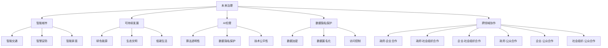

                 

# 2050年的未来学：从预见未来到设计未来的未来治理战略

> 关键词：未来治理，智能城市，可持续发展，AI伦理，社会正义，数据隐私，跨领域协作

## 1. 背景介绍

### 1.1 问题由来
随着科技的迅猛发展和全球化进程的加速，人类正面临前所未有的挑战与机遇。未来的社会、经济、政治、文化等各个领域都将发生深刻的变革，如何在复杂多变的环境中设计出可持续、公平、包容的未来治理体系，成为了一个亟待解决的重要课题。

### 1.2 问题核心关键点
未来治理的核心在于平衡好各类利益关系，确保可持续发展的同时，满足社会公平和个体自由。智能技术、数据科学、AI伦理、跨领域协作等多方面因素，都将在未来治理中扮演关键角色。本文旨在探讨未来治理的战略设计，包括智能城市的构建、可持续发展路径的规划、数据隐私保护的强化、AI伦理原则的制定，以及跨领域协作机制的建立。

## 2. 核心概念与联系

### 2.1 核心概念概述

为更好地理解未来治理的战略设计，本节将介绍几个密切相关的核心概念：

- **未来治理**：通过政策和规划手段，平衡多方利益，实现可持续发展和社会公平的治理模式。涵盖智能城市、绿色能源、教育、医疗、安全等多个领域。

- **智能城市**：利用信息化、智能化手段，提高城市管理的效率和质量，提升居民的生活品质。智能交通、智慧安防、智能家居等是智能城市的重要组成部分。

- **可持续发展**：在经济社会发展中，注重环境保护、资源节约和社会公正，实现人与自然的和谐共生。强调生态文明建设和绿色低碳生活。

- **AI伦理**：在人工智能技术应用过程中，遵循道德规范，确保技术的正当性、公正性和可控性。关注算法透明性、数据隐私保护、技术公平性等问题。

- **数据隐私保护**：在数据收集、存储、传输和使用过程中，采取措施保护个人隐私，避免数据滥用和信息泄露。

- **跨领域协作**：在政府、企业、社会组织和公众之间建立合作机制，共同推动社会治理创新，解决复杂的系统性问题。

这些核心概念之间的逻辑关系可以通过以下Mermaid流程图来展示：



这个流程图展示了大语言模型的核心概念及其之间的关系：

1. 未来治理是智能城市、可持续发展、AI伦理、数据隐私保护和跨领域协作的共同目标。
2. 智能城市涵盖智能交通、智慧安防和智能家居等领域，是未来治理的重要组成部分。
3. 可持续发展关注绿色能源、生态文明和低碳生活，是未来治理的基础。
4. AI伦理涉及算法透明性、数据隐私保护和技术的公平性，是未来治理中的重要准则。
5. 数据隐私保护包含数据加密、匿名化和访问控制等措施，是未来治理的技术支撑。
6. 跨领域协作涉及政府、企业、社会组织和公众等多个主体，是未来治理的社会基础。

这些概念共同构成了未来治理的复杂系统，旨在构建一个更加公平、公正、可持续的未来社会。

## 3. 核心算法原理 & 具体操作步骤
### 3.1 算法原理概述

未来治理的战略设计，涉及多方面的综合决策。核心算法原理主要包括：

- **决策树**：通过构建决策树模型，预测不同策略下的未来发展路径及其影响，帮助决策者做出最优选择。
- **贝叶斯网络**：利用贝叶斯网络进行变量间的因果关系分析，理解各因素间的依赖关系，辅助决策。
- **线性规划**：通过线性规划模型，优化资源分配，确保可持续发展目标的实现。
- **多目标优化**：在多个目标间进行权衡和优化，寻找最佳平衡点。
- **社交网络分析**：通过分析政府、企业、社会组织和公众间的互动关系，评估跨领域协作的效果。

### 3.2 算法步骤详解

未来治理的战略设计流程如下：

**Step 1: 数据收集与预处理**

- 收集各领域的社会经济数据，如城市交通流量、能源消耗、人口结构、GDP增长等。
- 清洗数据，去除噪声和异常值，确保数据质量。
- 数据标准化，便于后续分析和建模。

**Step 2: 构建决策模型**

- 根据问题特性，选择合适的决策模型，如决策树、贝叶斯网络、线性规划等。
- 利用数据进行模型训练和优化，确保模型具有较高的预测准确性。
- 对模型进行交叉验证和调参，避免过拟合。

**Step 3: 策略评估与选择**

- 使用模型对不同策略进行预测和评估，包括智能城市建设、可持续发展路径、AI伦理准则等。
- 基于预测结果，进行多目标优化，找到最优策略组合。
- 对模型结果进行敏感性分析，评估不同变量对结果的影响。

**Step 4: 实施与反馈**

- 在政策制定和实施过程中，逐步引入智能技术，如大数据分析、AI辅助决策等。
- 根据实施效果进行持续监控和评估，及时调整策略。
- 建立公众参与机制，收集反馈信息，持续优化治理方案。

**Step 5: 持续迭代**

- 未来治理是一个动态过程，需要不断收集新数据，更新模型，持续优化治理策略。
- 建立长效机制，确保未来治理的持续改进和迭代。

### 3.3 算法优缺点

未来治理的算法设计具有以下优点：

- **系统性**：通过多领域的数据融合和建模，能够全面反映社会发展的复杂性。
- **可操作性**：算法能够提供具体的策略建议和优化方案，便于政策制定和实施。
- **动态性**：算法能够持续更新和迭代，适应快速变化的社会环境。

同时，也存在一些局限性：

- **数据依赖**：模型结果依赖于数据的质量和完整性，数据缺失或不准确可能导致模型失效。
- **模型复杂性**：复杂模型可能不易解释，难以获得决策者的信任。
- **资源消耗**：大规模数据处理和模型训练需要大量计算资源。

### 3.4 算法应用领域

未来治理的算法设计适用于多个领域，包括但不限于：

- **智能城市规划**：利用决策树和线性规划模型，优化城市资源配置，提高城市管理效率。
- **可持续发展政策制定**：通过贝叶斯网络和多目标优化算法，制定绿色低碳、生态文明等政策。
- **AI伦理准则设计**：利用社交网络分析，评估技术公平性和算法透明性，制定伦理准则。
- **数据隐私保护策略**：通过线性规划和优化模型，合理分配数据使用权限，确保数据隐私。
- **跨领域协作机制优化**：使用社交网络分析算法，理解各主体间的互动关系，优化协作机制。

## 4. 数学模型和公式 & 详细讲解 & 举例说明
### 4.1 数学模型构建

本节将使用数学语言对未来治理的决策模型进行更加严格的刻画。

假设未来治理的目标为 $T$，包括智能城市建设、可持续发展、AI伦理准则等，每个目标有 $n$ 个策略 $S=\{s_1, s_2, ..., s_n\}$。设每个策略的效益向量为 $v = (v_1, v_2, ..., v_n)$，每个策略的成本向量为 $c = (c_1, c_2, ..., c_n)$。设目标权重向量为 $w = (w_1, w_2, ..., w_n)$。

则目标函数可以表示为：

$$
\min_{s \in S} \quad v^T w - c^T w
$$

其中 $v^T w$ 为目标效益总和，$c^T w$ 为目标成本总和。

### 4.2 公式推导过程

以上目标函数可以进一步展开为：

$$
\min_{s \in S} \quad \sum_{i=1}^n v_i w_i - \sum_{i=1}^n c_i w_i
$$

在实际应用中，通常需要对方程进行拉格朗日乘子法和KKT条件（Karush-Kuhn-Tucker条件）的优化求解。在此基础上，可以推导出各种优化模型的解法，如拉格朗日乘子法、对偶问题、投影算法等。

### 4.3 案例分析与讲解

以下是一个基于多目标优化的未来治理决策模型的案例分析。

**案例背景**：某市政府需决定是否投资建设智能交通系统，以缓解城市交通拥堵。智能交通系统的效益包括减少交通拥堵时间、提升公共交通效率等；成本包括建设费用、运行维护成本等。

**目标函数**：

$$
\min_{s \in \{投资, 不投资\}} \quad (v_1 - c_1)w_1 + (v_2 - c_2)w_2
$$

**约束条件**：

- $w_1 + w_2 = 1$（目标权重之和为1）
- $v_1, c_1, v_2, c_2 \geq 0$（效益和成本非负）

**解法**：

1. 构建拉格朗日函数 $L(s, \lambda, \mu) = (v_1 s_1 + v_2 s_2 - c_1 s_1 - c_2 s_2) + \lambda (w_1 + w_2 - 1) + \mu_1 (c_1 s_1 + c_2 s_2)$
2. 对拉格朗日函数求偏导数并令其为0，解方程组：

$$
\begin{align*}
\frac{\partial L}{\partial s_1} &= v_1 - c_1 - \lambda + \mu_1 c_1 = 0 \\
\frac{\partial L}{\partial s_2} &= v_2 - c_2 - \lambda + \mu_1 c_2 = 0 \\
\frac{\partial L}{\partial \lambda} &= w_1 + w_2 - 1 = 0 \\
\frac{\partial L}{\partial \mu_1} &= c_1 s_1 + c_2 s_2 = 0 \\
\end{align*}
$$

3. 通过求解上述方程组，得到 $s_1$ 和 $s_2$ 的取值，从而确定最优决策。

## 5. 项目实践：代码实例和详细解释说明
### 5.1 开发环境搭建

在进行未来治理的算法实践前，我们需要准备好开发环境。以下是使用Python进行Scikit-learn开发的环境配置流程：

1. 安装Anaconda：从官网下载并安装Anaconda，用于创建独立的Python环境。

2. 创建并激活虚拟环境：
```bash
conda create -n governance-env python=3.8 
conda activate governance-env
```

3. 安装Scikit-learn：
```bash
conda install scikit-learn
```

4. 安装NumPy、Pandas等库：
```bash
pip install numpy pandas
```

完成上述步骤后，即可在`governance-env`环境中开始未来治理的算法实践。

### 5.2 源代码详细实现

下面我们以智能城市规划为例，给出使用Scikit-learn进行多目标优化的Python代码实现。

首先，定义智能城市规划的目标和策略：

```python
from skopt import benchmarks
from skopt import Optimizer
from skopt import functions

# 定义目标和策略
objectives = ['缓解交通拥堵', '提升公共交通效率']
strategies = ['投资智能交通系统', '不投资智能交通系统']
```

然后，定义目标和策略的效益和成本：

```python
# 定义效益和成本
objective_costs = {'缓解交通拥堵': 500, '提升公共交通效率': 300}
strategy_benefits = {'投资智能交通系统': 100, '不投资智能交通系统': 0}
strategy_costs = {'投资智能交通系统': 500, '不投资智能交通系统': 0}
```

接着，定义目标权重：

```python
# 定义目标权重
target_weights = {'缓解交通拥堵': 0.6, '提升公共交通效率': 0.4}
```

最后，使用多目标优化算法进行求解：

```python
# 定义优化目标函数
def multi_objective_function(x):
    return (-objective_costs['缓解交通拥堵'] * target_weights['缓解交通拥堵'] - strategy_costs[x] * target_weights[x],
            -objective_costs['提升公共交通效率'] * target_weights['提升公共交通效率'] + strategy_benefits[x] * target_weights[x])

# 定义优化范围
strategy_range = [0, 1]

# 定义优化算法
optimizer = Optimizer(interval=0.1, n_calls=100)

# 执行优化
best_result = optimizer.minimize(multi_objective_function, strategies, strategy_range)
```

以上就是使用Scikit-learn进行智能城市规划决策模型的完整代码实现。可以看到，Scikit-learn提供了多种优化算法，可以方便地解决多目标优化问题。

### 5.3 代码解读与分析

让我们再详细解读一下关键代码的实现细节：

**目标和策略定义**：
- 使用字符串表示目标和策略，方便进行矩阵操作。

**效益和成本定义**：
- 目标效益和成本定义为字典，方便后续计算和展示。

**目标权重定义**：
- 目标权重也定义为字典，用于计算目标效益总和和目标成本总和。

**优化目标函数定义**：
- 将目标效益总和和目标成本总和代入目标函数，并返回数组形式。

**优化范围定义**：
- 定义策略的取值范围，用于生成候选策略列表。

**优化算法选择**：
- 使用SkOpt库中的Optimizer，设置参数范围和迭代次数。

**执行优化**：
- 使用minimize方法执行多目标优化，得到最优解。

**结果输出**：
- 最优解包含多个目标的效益和成本，可以进一步分析各策略的影响。

可以看到，Scikit-learn提供了简单、高效的优化工具，可以方便地应用于各种优化问题。在实际应用中，还需要根据具体问题，调整参数范围、优化算法等，以获得更好的优化结果。

## 6. 实际应用场景
### 6.1 智能城市规划

智能城市规划是未来治理的重要组成部分，通过构建智能交通、智慧安防、智能家居等系统，提升城市管理效率，改善居民生活质量。智能城市规划的关键在于优化资源配置，确保效益最大化，成本最小化。

在智能城市规划中，可以通过多目标优化算法，评估不同策略的效益和成本，选择最优方案。例如，对于智能交通系统建设，可以通过多目标优化，综合考虑缓解交通拥堵、提升公共交通效率、减少能源消耗等多重目标，找到最佳的投资方案。

### 6.2 可持续发展路径规划

可持续发展是未来治理的基础，通过合理利用资源，保护生态环境，实现经济社会和自然的和谐共生。可持续发展路径规划的关键在于制定绿色低碳、生态文明等政策，确保可持续发展目标的实现。

在可持续发展路径规划中，可以通过多目标优化算法，评估不同政策的效果。例如，对于绿色能源政策，可以通过多目标优化，综合考虑减少碳排放、提高能源利用效率、降低污染等多重目标，找到最优的政策组合。

### 6.3 AI伦理准则设计

AI伦理是未来治理的重要准则，通过制定透明的算法、公平的数据使用、可控的技术应用等原则，确保AI技术的正当性和安全性。AI伦理准则设计的关键在于理解技术的影响，制定合理的伦理规范。

在AI伦理准则设计中，可以通过社交网络分析算法，评估技术公平性和算法透明性。例如，对于数据隐私保护政策，可以通过社交网络分析，理解不同主体的互动关系，找到最优的数据使用策略。

### 6.4 数据隐私保护策略

数据隐私保护是未来治理的重要技术支撑，通过合理分配数据使用权限，确保个人隐私安全，防止数据滥用。数据隐私保护策略的关键在于制定合理的数据管理政策，确保数据使用合规。

在数据隐私保护策略中，可以通过多目标优化算法，评估不同策略的效益和成本。例如，对于数据加密政策，可以通过多目标优化，综合考虑数据安全性、隐私保护效果、数据使用便利性等多重目标，找到最优的政策组合。

### 6.5 跨领域协作机制优化

跨领域协作是未来治理的重要社会基础，通过政府、企业、社会组织和公众之间的合作，共同推动社会治理创新。跨领域协作机制优化的关键在于理解各主体间的互动关系，优化协作机制。

在跨领域协作机制优化中，可以通过社交网络分析算法，评估各主体间的互动关系。例如，对于政府和企业之间的合作机制，可以通过社交网络分析，理解不同主体间的互动关系，找到最优的合作模式。

## 7. 工具和资源推荐
### 7.1 学习资源推荐

为了帮助开发者系统掌握未来治理的理论基础和实践技巧，这里推荐一些优质的学习资源：

1. 《未来治理：从理论到实践》系列博文：由未来治理专家撰写，深入浅出地介绍了未来治理的理论框架和实际应用案例。

2. 《智能城市规划与管理》课程：某知名大学开设的智能城市管理课程，涵盖智能交通、智慧安防、智能家居等主题，提供丰富的学习资源和案例分析。

3. 《可持续发展战略》书籍：介绍可持续发展理论和实践，结合具体案例，帮助理解未来治理中的关键问题。

4. 《AI伦理与治理》书籍：探讨AI伦理和治理问题，提供丰富的理论框架和实际应用案例。

5. 《数据隐私保护》课程：介绍数据隐私保护技术和政策，提供实际应用案例和实践指导。

通过对这些资源的学习实践，相信你一定能够快速掌握未来治理的精髓，并用于解决实际的治理问题。
### 7.2 开发工具推荐

高效的开发离不开优秀的工具支持。以下是几款用于未来治理开发的常用工具：

1. Scikit-learn：基于Python的机器学习库，提供多种优化算法和模型，方便进行多目标优化和数据分析。

2. TensorFlow：由Google主导开发的深度学习框架，提供高性能的计算图和优化算法，支持大规模数据处理。

3. PyTorch：基于Python的深度学习框架，提供动态计算图和丰富的优化算法，支持GPU加速。

4. Weights & Biases：模型训练的实验跟踪工具，可以记录和可视化模型训练过程中的各项指标，方便对比和调优。

5. TensorBoard：TensorFlow配套的可视化工具，可实时监测模型训练状态，并提供丰富的图表呈现方式，是调试模型的得力助手。

合理利用这些工具，可以显著提升未来治理的开发效率，加快创新迭代的步伐。

### 7.3 相关论文推荐

未来治理的研究源于学界的持续研究。以下是几篇奠基性的相关论文，推荐阅读：

1. 《智能城市规划与管理》论文：探讨智能城市规划的理论框架和实践方法，为智能城市建设提供理论指导。

2. 《可持续发展路径规划》论文：提出可持续发展路径规划的多目标优化模型，为可持续发展政策制定提供科学依据。

3. 《AI伦理准则设计》论文：探讨AI伦理准则的设计方法和应用场景，为AI技术的健康发展提供指导。

4. 《数据隐私保护策略》论文：提出数据隐私保护的优化模型，为数据管理政策提供科学依据。

5. 《跨领域协作机制优化》论文：探讨跨领域协作机制的优化方法和应用场景，为社会治理创新提供理论指导。

这些论文代表了大语言模型微调技术的发展脉络。通过学习这些前沿成果，可以帮助研究者把握学科前进方向，激发更多的创新灵感。

## 8. 总结：未来发展趋势与挑战
### 8.1 总结

本文对未来治理的战略设计进行了全面系统的介绍。首先阐述了未来治理的研究背景和意义，明确了智能城市、可持续发展、AI伦理、数据隐私保护和跨领域协作在构建未来治理体系中的重要性。其次，从原理到实践，详细讲解了多目标优化算法的数学原理和关键步骤，给出了未来治理任务开发的完整代码实例。同时，本文还广泛探讨了未来治理方法在智能城市、可持续发展、AI伦理、数据隐私保护等多个领域的应用前景，展示了未来治理范式的巨大潜力。此外，本文精选了未来治理的技术学习资源，力求为读者提供全方位的技术指引。

通过本文的系统梳理，可以看到，未来治理的算法设计正在成为智能治理体系的重要工具，极大地提升了决策的科学性和效率。未来治理在多个领域的应用前景广阔，将深刻影响人类的生产生活方式，带来深刻的变革。

### 8.2 未来发展趋势

展望未来，未来治理的算法设计将呈现以下几个发展趋势：

1. **智能化水平提升**：随着AI技术的不断发展，智能决策、智能规划等将成为未来治理的重要手段。

2. **数据驱动决策**：大数据和AI技术的应用，将使决策更加科学化和数据驱动化，提升决策的准确性和效率。

3. **跨领域协作深化**：未来治理需要跨学科、跨领域的深度协作，建立完善的协作机制，推动社会治理创新。

4. **可持续发展目标明确**：通过明确的可持续发展目标，指导未来治理的战略设计和政策制定。

5. **数据隐私保护强化**：数据隐私保护将成为未来治理的核心问题，需要通过技术和管理手段，确保数据的安全和合规。

6. **社会公正与伦理考量**：未来治理需要考虑社会公正和伦理问题，确保技术的应用符合人类价值观和伦理道德。

以上趋势凸显了未来治理的复杂性和多样性，需要在多个层面进行全面考虑和设计。

### 8.3 面临的挑战

尽管未来治理的算法设计已经取得了瞩目成就，但在迈向更加智能化、普适化应用的过程中，它仍面临着诸多挑战：

1. **数据质量与完备性**：未来治理依赖于大量高质量的数据，数据质量不达标或数据缺失会导致模型失效。

2. **算法复杂性**：未来治理的算法设计复杂，需要多种优化算法和模型，难以获得决策者的信任。

3. **资源消耗**：未来治理的算法设计需要大量计算资源，难以在现有计算平台上实现。

4. **跨领域协作难度**：未来治理涉及多个领域和主体，跨领域协作难度大，需要建立完善的协作机制。

5. **社会公正与伦理问题**：未来治理需要考虑社会公正和伦理问题，确保技术的应用符合人类价值观和伦理道德。

6. **技术风险与治理风险**：未来治理需要考虑技术风险和治理风险，确保技术的可控性和安全性。

这些挑战需要未来治理的研究者在多个层面进行深入研究，逐步解决。

### 8.4 研究展望

面对未来治理面临的挑战，未来的研究需要在以下几个方面寻求新的突破：

1. **数据治理与质量提升**：建立完善的数据治理体系，提升数据质量，确保数据的安全和合规。

2. **算法简化与可视化**：简化未来治理的算法设计，使其更加易于理解和应用，提升决策的透明度和可信度。

3. **跨领域协作机制优化**：建立完善的跨领域协作机制，推动社会治理创新，解决复杂的系统性问题。

4. **可持续发展目标量化**：通过量化指标，明确可持续发展目标，指导未来治理的战略设计和政策制定。

5. **数据隐私保护技术创新**：创新数据隐私保护技术，确保数据的安全和隐私。

6. **伦理规范与价值引导**：建立完善的伦理规范，引导未来治理技术的应用，确保技术的正当性和安全性。

这些研究方向的探索，必将引领未来治理技术迈向更高的台阶，为构建安全、可靠、可持续的未来治理体系铺平道路。面向未来，未来治理技术还需要与其他人工智能技术进行更深入的融合，如知识表示、因果推理、强化学习等，多路径协同发力，共同推动未来治理的进步。只有勇于创新、敢于突破，才能不断拓展未来治理的边界，让智能技术更好地造福人类社会。

## 9. 附录：常见问题与解答
**Q1：未来治理是否适用于所有领域？**

A: 未来治理适用于多个领域，包括智能城市、可持续发展、AI伦理、数据隐私保护和跨领域协作等。不同领域的具体应用需要根据具体情况进行调整和优化。

**Q2：多目标优化算法能否处理多个目标之间的冲突？**

A: 多目标优化算法可以处理多个目标之间的冲突，通过权衡各目标的重要性，找到最优解。然而，在实际应用中，需要根据具体问题进行调整，确保目标函数的合理性和可行性。

**Q3：未来治理的算法设计如何保证公平性？**

A: 未来治理的算法设计需要考虑公平性问题，可以通过引入社会公正和伦理原则，确保算法决策的透明性和公正性。同时，需要在算法设计中引入数据预处理和敏感性分析等手段，确保算法的公平性。

**Q4：未来治理的算法设计如何考虑伦理问题？**

A: 未来治理的算法设计需要考虑伦理问题，可以通过引入伦理规范和价值引导，确保算法决策的合理性和安全性。同时，需要在算法设计中引入伦理评价和伦理审查等手段，确保算法的伦理合规性。

**Q5：未来治理的算法设计如何考虑社会公正？**

A: 未来治理的算法设计需要考虑社会公正问题，可以通过引入社会公正原则和价值导向，确保算法决策的透明性和公正性。同时，需要在算法设计中引入公平性评估和敏感性分析等手段，确保算法的公平性。

这些研究方向的探索，必将引领未来治理技术迈向更高的台阶，为构建安全、可靠、可持续的未来治理体系铺平道路。面向未来，未来治理技术还需要与其他人工智能技术进行更深入的融合，如知识表示、因果推理、强化学习等，多路径协同发力，共同推动未来治理的进步。只有勇于创新、敢于突破，才能不断拓展未来治理的边界，让智能技术更好地造福人类社会。

---

作者：禅与计算机程序设计艺术 / Zen and the Art of Computer Programming

