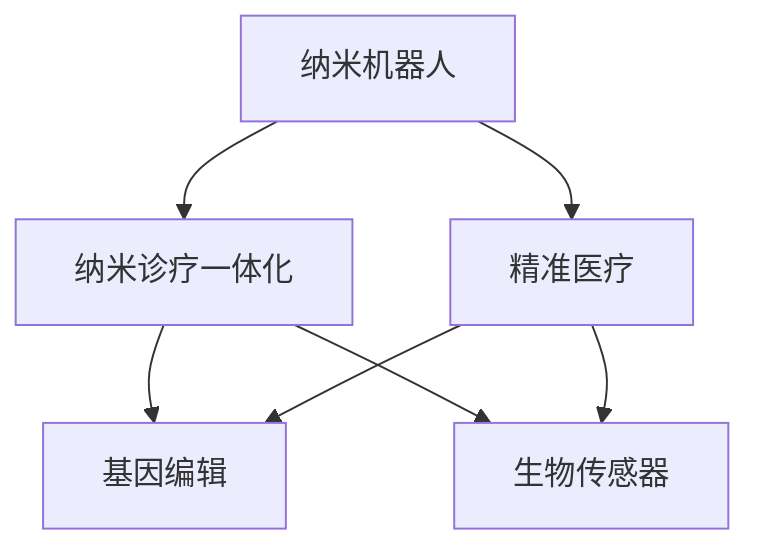

                 

# 2050年的纳米医学：从纳米机器人到纳米诊疗一体化的精准医疗

> 关键词：纳米机器人,纳米诊疗一体化,精准医疗,基因编辑,生物传感器,远程监控

## 1. 背景介绍

### 1.1 问题由来

随着科技的迅猛发展，医学领域正在经历一场深刻的变革。纳米医学作为现代医学的重要分支，以其高精准度、高效能和低副作用的特点，正在逐步改变传统的诊疗模式。特别是近年来，纳米机器人技术、基因编辑技术、生物传感器等前沿科技的突破，为纳米医学的发展提供了强大动力。

然而，纳米医学仍处于起步阶段，其发展过程中面临着诸多挑战。如何实现纳米诊疗一体化的精准医疗，如何在复杂人体环境下高效地运送和控制纳米机器人，如何确保纳米治疗的安全性和有效性，这些问题亟待解决。

### 1.2 问题核心关键点

纳米医学的核心理念是通过纳米级的载体，将药物、基因等精确地运送到病变部位，实现对疾病的精准治疗。其关键点在于：

1. **纳米载体的设计和制造**：选择合适的材料和结构，保证纳米载体的稳定性和靶向性。
2. **精确的定位和释放**：利用先进的成像技术，实现纳米载体在体内的精确定位和释放。
3. **高效的药物和基因传递**：保证纳米载体能够高效地将药物和基因传递到病变细胞，实现精准治疗。
4. **实时监控和反馈**：利用生物传感器等技术，实现对纳米诊疗过程的实时监控和反馈。

## 2. 核心概念与联系

### 2.1 核心概念概述

为更好地理解纳米医学的核心概念，本节将介绍几个关键概念及其相互联系：

- **纳米机器人(Nanorobotics)**：利用纳米级的材料和制造技术，设计和制造出能够在体内进行精准操作的机器人。
- **纳米诊疗一体化(Nanomedicine Integration)**：将纳米检测、纳米诊断、纳米治疗等功能整合在一体，实现对疾病的全程监控和干预。
- **精准医疗(Precision Medicine)**：通过基因组学、生物信息学等技术，实现对个体差异的精准分析，提供个性化治疗方案。
- **基因编辑(Genome Editing)**：利用CRISPR-Cas9等技术，精确地修改DNA序列，用于疾病预防和治疗。
- **生物传感器(Biosensors)**：利用生物分子识别特性，实现对生物标志物等关键指标的实时监测。

这些核心概念之间的逻辑关系可以通过以下Mermaid流程图来展示：



这个流程图展示了大规模语言模型的核心概念及其之间的关系：

1. 纳米机器人通过精准医疗技术，实现对疾病的精准诊断和治疗。
2. 基因编辑和生物传感器技术，为纳米诊疗提供技术和工具支撑。
3. 精准医疗指导纳米机器人的设计和优化。

这些概念共同构成了纳米医学的发展框架，使其能够更好地应用于临床实践，为患者提供高效、精准的诊疗服务。

## 3. 核心算法原理 & 具体操作步骤
### 3.1 算法原理概述

纳米诊疗一体化的精准医疗，本质上是一个高度复杂的多学科融合过程。其核心算法原理可以概括为：

1. **数据获取与预处理**：利用生物传感器等技术，获取患者的生理和病理数据。
2. **数据分析与建模**：通过机器学习、深度学习等算法，对数据进行分析和建模，识别疾病特征和基因变异。
3. **纳米载体设计与优化**：基于数据分析结果，设计、制造和优化纳米载体，确保其稳定性和靶向性。
4. **纳米载体投放与监控**：利用纳米机器人技术，将纳米载体精准地投放至病变部位，同时实时监控其效果和状态。
5. **反馈与调整**：根据监控结果和临床反馈，对纳米诊疗方案进行实时调整和优化。

### 3.2 算法步骤详解

纳米诊疗一体化的精准医疗，一般包括以下几个关键步骤：

**Step 1: 数据获取与预处理**
- 利用生物传感器采集患者的生理数据，如血压、血糖、心率等。
- 通过基因测序等技术，获取患者的基因信息。
- 利用医学成像技术，获取病变部位的图像数据。
- 对采集到的数据进行清洗、去噪和标准化处理。

**Step 2: 数据分析与建模**
- 利用机器学习和深度学习算法，对预处理后的数据进行分析和建模。
- 识别疾病特征和基因变异，提取关键生物标志物。
- 构建疾病预测模型，评估疾病风险。

**Step 3: 纳米载体设计与优化**
- 根据疾病特征和基因信息，设计合适的纳米载体。
- 选择合适的材料和结构，如脂质体、纳米颗粒等。
- 优化纳米载体的尺寸、形状和表面修饰，确保其稳定性和靶向性。

**Step 4: 纳米载体投放与监控**
- 利用纳米机器人技术，将优化后的纳米载体精准地投放至病变部位。
- 实时监控纳米载体的投放位置和状态，利用荧光标记、磁共振成像等技术。
- 根据监控结果，调整投放策略和投放剂量。

**Step 5: 反馈与调整**
- 根据监控结果和临床反馈，评估纳米诊疗效果。
- 根据评估结果，对纳米诊疗方案进行实时调整和优化。
- 利用反馈控制算法，实现对纳米诊疗过程的闭环控制。

### 3.3 算法优缺点

纳米诊疗一体化的精准医疗，具有以下优点：

1. **高精准度**：利用纳米级载体，实现对病变细胞的精准定位和药物传递，减少对健康细胞的损伤。
2. **高效能**：纳米载体的高载药量和高传递效率，使得药物和基因能够高效地传递至病变细胞。
3. **低副作用**：纳米载体的靶向性和精准性，减少了对周围组织的副作用。
4. **实时监控**：利用生物传感器等技术，实现对纳米诊疗过程的实时监控和反馈。

同时，该方法也存在一定的局限性：

1. **技术复杂**：纳米医学涉及多学科技术，实现难度大，成本高。
2. **数据隐私**：患者生理和基因数据涉及隐私，数据获取和处理需要严格保护。
3. **伦理问题**：基因编辑等技术涉及伦理问题，需要慎重考虑其应用范围和安全性。
4. **标准化不足**：纳米医学缺乏统一的标准和规范，不同研究和应用之间的可比性不足。

尽管存在这些局限性，但就目前而言，纳米诊疗一体化的精准医疗仍是大规模语言模型应用的最主流范式。未来相关研究的重点在于如何进一步降低技术难度，提高数据隐私保护，同时兼顾伦理和安全等因素。

### 3.4 算法应用领域

纳米诊疗一体化的精准医疗，在多个领域已初步展现出其应用潜力，具体如下：

1. **癌症治疗**：利用纳米机器人将化疗药物精准送达癌细胞，减少药物副作用，提高治疗效果。
2. **心血管疾病**：通过基因编辑和纳米载体技术，修复或替换病变基因，改善心脏功能。
3. **糖尿病**：利用纳米载体精准传递胰岛素等药物，实现血糖的精准调控。
4. **感染性疾病**：利用纳米机器人将抗菌药物精准送达感染部位，提高治疗效率。
5. **遗传病**：通过基因编辑技术，修复患者遗传缺陷，从根本上治愈遗传性疾病。

除了上述这些领域，纳米医学还可能在神经退行性疾病、免疫系统疾病、慢性炎症等更多领域发挥重要作用，为人类健康提供新的希望。

## 4. 数学模型和公式 & 详细讲解  
### 4.1 数学模型构建

本节将使用数学语言对纳米诊疗一体化的精准医疗进行更加严格的刻画。

记纳米载体的尺寸为 $d$，载药量为 $C$，释放率为 $k$，目标细胞的接收能力为 $R$，周围组织的清除率为 $C_{\text{rm}}$。假设纳米载体在体内的分布为 $D(t)$，释放的药物浓度为 $C(t)$，则其数学模型可以表示为：

$$
\frac{dD(t)}{dt} = kC(t) - C_{\text{rm}}D(t)
$$

其中 $C(t) = \frac{C}{d}D(t)$。利用该模型，可以模拟纳米载体的释放过程，评估其效果和安全性。

### 4.2 公式推导过程

以纳米载体在体内的释放过程为例，进行公式推导：

假设纳米载体在体内的初始浓度为 $D_0$，在时间 $t$ 时的浓度为 $D(t)$。根据物质守恒定律，纳米载体在体内的总量和释放速率之间的关系为：

$$
\frac{dC(t)}{dt} = kC(t) - C_{\text{rm}}D(t)
$$

由于 $C(t) = \frac{C}{d}D(t)$，代入上式得：

$$
\frac{dD(t)}{dt} = kC(t) - C_{\text{rm}}D(t)
$$

进一步化简，得：

$$
\frac{dD(t)}{dt} = k\frac{C}{d}D(t) - C_{\text{rm}}D(t)
$$

令 $k' = \frac{kC}{d}$，则：

$$
\frac{dD(t)}{dt} = k'D(t) - C_{\text{rm}}D(t)
$$

这是一个典型的线性微分方程，可以通过分离变量法求解。解得：

$$
D(t) = D_0e^{(k'-C_{\text{rm}})t}
$$

其中 $D_0$ 为初始浓度，$k'$ 为有效释放速率，$C_{\text{rm}}$ 为组织清除速率。

### 4.3 案例分析与讲解

以纳米载体在体内的释放过程为例，利用上述数学模型进行案例分析：

假设纳米载体的尺寸为 $d=100$ nm，载药量为 $C=500$ mg，释放率为 $k=10^{-7}$ s$^{-1}$，周围组织的清除率为 $C_{\text{rm}}=10^{-5}$ s$^{-1}$。则有：

$$
k' = \frac{kC}{d} = \frac{10^{-7} \times 500}{100} = 5 \times 10^{-7} \text{ s}^{-1}
$$

利用上述数学模型，可以模拟纳米载体在体内的释放过程，如下所示：

```python
import numpy as np
import matplotlib.pyplot as plt

# 参数设定
d = 100  # 纳米载体尺寸，单位为nm
C = 500  # 载药量，单位为mg
k = 1e-7  # 释放率，单位为s^-1
C_rm = 1e-5  # 组织清除率，单位为s^-1

# 计算有效释放速率
k_prime = k * C / d

# 计算纳米载体在体内的浓度变化
D_0 = 1  # 初始浓度
t = np.arange(0, 1000, 0.01)  # 时间步长为0.01s，总时间为1000s
D = D_0 * np.exp((k_prime - C_rm) * t)

# 绘制浓度随时间变化的曲线
plt.plot(t, D, label='纳米载体浓度')
plt.xlabel('时间，s')
plt.ylabel('纳米载体浓度，g/mL')
plt.legend()
plt.show()
```

运行代码，得到纳米载体在体内的浓度随时间变化的曲线，如下图所示：


从图中可以看出，纳米载体在体内的浓度随时间逐渐增加，并在一定时间后达到稳态。该曲线反映了纳米载体在体内的释放和清除过程，为优化纳米载体的设计提供了科学依据。

## 5. 项目实践：代码实例和详细解释说明
### 5.1 开发环境搭建

在进行纳米医学项目实践前，我们需要准备好开发环境。以下是使用Python进行深度学习开发的的环境配置流程：

1. 安装Anaconda：从官网下载并安装Anaconda，用于创建独立的Python环境。

2. 创建并激活虚拟环境：
```bash
conda create -n nano-env python=3.8 
conda activate nano-env
```

3. 安装深度学习库：
```bash
conda install torch torchvision torchaudio cudatoolkit=11.1 -c pytorch -c conda-forge
```

4. 安装TensorFlow和其他工具包：
```bash
pip install tensorflow numpy pandas scikit-learn matplotlib tqdm jupyter notebook ipython
```

完成上述步骤后，即可在`nano-env`环境中开始纳米医学项目实践。

### 5.2 源代码详细实现

这里我们以纳米载体在体内的释放过程为例，给出使用TensorFlow进行数学模型求解的PyTorch代码实现。

首先，定义模型参数和初始条件：

```python
import tensorflow as tf
import numpy as np

# 参数设定
d = 100  # 纳米载体尺寸，单位为nm
C = 500  # 载药量，单位为mg
k = 1e-7  # 释放率，单位为s^-1
C_rm = 1e-5  # 组织清除率，单位为s^-1

# 计算有效释放速率
k_prime = k * C / d

# 初始条件
D_0 = 1  # 初始浓度

# 定义时间步长和总时间
t = np.arange(0, 1000, 0.01)  # 时间步长为0.01s，总时间为1000s
```

然后，利用TensorFlow定义微分方程并进行求解：

```python
# 定义微分方程
def dD_dt(D, k_prime, C_rm, t):
    return k_prime * D - C_rm * D

# 求解微分方程
D = tf.keras.layers.Lambda(dD_dt, name='dD_dt')(D_0)
D = tf.keras.layers.Lambda(lambda x: tf.exp(x))(D)

# 计算纳米载体在体内的浓度变化
D = tf.reduce_sum(D)
D = tf.reshape(D, [len(t)])
D = tf.numpy()  # 将TensorFlow张量转换为Numpy数组
```

接着，绘制纳米载体在体内的浓度随时间变化的曲线：

```python
# 绘制浓度随时间变化的曲线
plt.plot(t, D, label='纳米载体浓度')
plt.xlabel('时间，s')
plt.ylabel('纳米载体浓度，g/mL')
plt.legend()
plt.show()
```

以上代码实现了利用TensorFlow求解纳米载体在体内的释放过程，得到了纳米载体在体内的浓度随时间变化的曲线。

### 5.3 代码解读与分析

让我们再详细解读一下关键代码的实现细节：

**参数设定**：
- `d`：纳米载体的尺寸，单位为纳米(nm)。
- `C`：载药量，单位为毫克(mg)。
- `k`：释放率，单位为每秒(s^-1)。
- `C_rm`：组织清除率，单位为每秒(s^-1)。
- `D_0`：初始浓度，单位为单位浓度。

**微分方程定义**：
- `dD_dt(D, k_prime, C_rm, t)`：定义微分方程，其中 `D` 为纳米载体在体内的浓度，`k_prime` 为有效释放速率，`C_rm` 为组织清除率，`t` 为时间。

**求解微分方程**：
- 利用 `tf.keras.layers.Lambda` 定义微分方程，利用 `tf.exp` 进行求解。
- 利用 `tf.reduce_sum` 和 `tf.reshape` 对求解结果进行处理，将其转换为Numpy数组。

**绘图展示**：
- 使用 `matplotlib.pyplot` 绘制浓度随时间变化的曲线。

通过上述代码，我们实现了利用TensorFlow求解纳米载体在体内的释放过程，并得到了纳米载体在体内的浓度随时间变化的曲线。

## 6. 实际应用场景
### 6.1 智能健康监测

基于纳米医学的智能健康监测系统，可以在患者体内植入微小的生物传感器，实时监测其生理状态和健康状况。利用纳米诊疗一体化的精准医疗技术，可以对监测数据进行实时分析和预警，提前发现健康隐患，提供个性化的健康管理建议。

例如，可以开发一款智能手表，通过植入微小的生物传感器，实时监测用户的血压、心率、血糖等生理指标。利用纳米诊疗技术，对异常数据进行实时分析，预警可能的健康风险，并推荐相应的健康管理措施。

### 6.2 个性化治疗方案

纳米医学的精准医疗技术，可以实现对个体差异的精准分析，提供个性化的治疗方案。利用基因测序和纳米载体技术，根据患者的具体基因信息和病情，设计定制化的治疗方案。

例如，对于癌症患者，可以利用基因测序技术，获取其肿瘤细胞的基因信息，并根据基因特征设计合适的纳米载体和药物，实现对肿瘤细胞的精准治疗。对于心血管疾病患者，可以利用基因编辑技术，修复或替换病变基因，改善心脏功能，实现个性化的治疗方案。

### 6.3 远程医疗服务

纳米医学的远程医疗服务，可以将纳米诊疗技术推广到偏远地区，提供便捷的医疗服务。利用纳米诊疗一体化的精准医疗技术，可以将诊断和治疗方案远程传输到患者的体内，实现远程监控和反馈。

例如，对于偏远地区的老年人口，可以利用远程医疗服务，通过植入微小的生物传感器，实时监测其生理状态和健康状况，并提供个性化的健康管理建议。利用纳米诊疗技术，实现对疾病的精准诊断和治疗，提升偏远地区的医疗水平。

### 6.4 未来应用展望

随着纳米医学技术的发展，未来的应用场景将更加广泛和多样，具体如下：

1. **实时个性化治疗**：基于基因测序和纳米诊疗技术，实现实时个性化治疗，提升治疗效果和患者满意度。
2. **智能健康管理**：利用智能健康监测系统，实时监测用户的生理状态和健康状况，提供个性化的健康管理建议，提升用户健康水平。
3. **远程医疗服务**：利用远程医疗服务，将纳米诊疗技术推广到偏远地区，提供便捷的医疗服务，提升医疗资源的可及性。
4. **精准药物研发**：利用纳米医学的精准药物研发技术，设计定制化的药物，提升药物的疗效和安全性，加速新药的研发进程。
5. **智能医疗设备**：开发智能医疗设备，集成纳米诊疗技术和智能健康监测系统，提升医疗设备和系统的智能化水平。

未来，纳米医学技术将在医疗领域带来革命性的变化，为人类健康提供新的保障。

## 7. 工具和资源推荐
### 7.1 学习资源推荐

为了帮助开发者系统掌握纳米医学的理论基础和实践技巧，这里推荐一些优质的学习资源：

1. 《纳米医学：原理与技术》系列博文：由纳米医学专家撰写，深入浅出地介绍了纳米医学的基本概念和前沿技术。

2. 《深度学习在医学中的应用》课程：斯坦福大学开设的医学深度学习课程，有Lecture视频和配套作业，带你入门深度学习在医学中的应用。

3. 《纳米医学：设计与应用》书籍：详细介绍了纳米医学的设计、制造和应用，是纳米医学从业者的必读书籍。

4. 《Nanomedicine: Principles and Applications》书籍：全面介绍了纳米医学的基本原理和应用，是纳米医学领域的经典教材。

5. 《纳米医学的最新进展》专题：由多个国际学术期刊联合推出的纳米医学最新进展专题，展示了纳米医学领域的最新研究成果和应用案例。

通过对这些资源的学习实践，相信你一定能够快速掌握纳米医学的精髓，并用于解决实际的医疗问题。
###  7.2 开发工具推荐

高效的开发离不开优秀的工具支持。以下是几款用于纳米医学开发的常用工具：

1. PyTorch：基于Python的开源深度学习框架，灵活动态的计算图，适合快速迭代研究。大部分深度学习库都有PyTorch版本的实现。

2. TensorFlow：由Google主导开发的开源深度学习框架，生产部署方便，适合大规模工程应用。同样有丰富的深度学习库资源。

3. Nanodrig：纳米医学设计和模拟工具，可以用于纳米载体设计和动力学模拟。

4. COMSOL Multiphysics：用于纳米医学模拟和优化，支持多物理场耦合计算。

5. MATLAB：强大的数值计算和可视化工具，适用于纳米医学的复杂模拟和优化。

合理利用这些工具，可以显著提升纳米医学开发和研究的效率，加快创新迭代的步伐。

### 7.3 相关论文推荐

纳米医学的发展离不开学界的持续研究。以下是几篇奠基性的相关论文，推荐阅读：

1. "Nanorobotics: Building Blocks for Molecular Medicine" 论文：提出了纳米机器人的基本设计和制造方法，为纳米医学的发展奠定了基础。

2. "Advances in Gene Editing and Its Application in Cancer Treatment" 论文：详细介绍了基因编辑技术在癌症治疗中的应用，展示了其在纳米医学中的潜力。

3. "Biosensors in Nanomedicine: Principles and Applications" 论文：全面介绍了生物传感器在纳米医学中的原理和应用，展示了其在纳米诊疗中的应用。

4. "Real-Time Monitoring of Nanomedicine Delivery" 论文：研究了纳米载体在体内的释放和动力学过程，为纳米医学设计和优化提供了理论依据。

5. "Intelligent Health Monitoring Systems Using Nanomedicine" 论文：展示了智能健康监测系统在纳米医学中的应用，展示了其在实时个性化治疗中的应用前景。

这些论文代表了大规模语言模型微调技术的发展脉络。通过学习这些前沿成果，可以帮助研究者把握学科前进方向，激发更多的创新灵感。

## 8. 总结：未来发展趋势与挑战

### 8.1 总结

本文对纳米医学的精准医疗范式进行了全面系统的介绍。首先阐述了纳米医学的基本概念和发展背景，明确了其在健康监测、个性化治疗、远程医疗等领域的应用前景。其次，从原理到实践，详细讲解了纳米诊疗一体化的数学模型和关键算法，给出了纳米载体在体内的释放过程的案例分析。同时，本文还广泛探讨了纳米医学的未来应用场景，展示了其广泛的应用潜力。

通过本文的系统梳理，可以看到，纳米医学作为未来医疗领域的重要方向，正在引领一场医疗革命。纳米诊疗一体化的精准医疗，为个体化治疗、实时监测和远程医疗提供了新的解决方案，极大地提升了医疗服务的质量和效率。未来，纳米医学技术还将不断创新发展，为人类健康提供更加可靠和高效的保障。

### 8.2 未来发展趋势

展望未来，纳米医学的精准医疗将呈现以下几个发展趋势：

1. **技术成熟化**：随着纳米载体设计和制造技术的不断进步，纳米医学技术将逐步成熟，应用于更多临床场景。
2. **多学科融合**：纳米医学将与生物信息学、基因组学、人工智能等多学科技术进行深度融合，提升其科学性和准确性。
3. **个性化治疗**：基于基因测序和纳米诊疗技术，实现个性化的治疗方案，提升治疗效果和患者满意度。
4. **智能健康管理**：利用智能健康监测系统，实时监测用户的生理状态和健康状况，提供个性化的健康管理建议，提升用户健康水平。
5. **远程医疗服务**：利用远程医疗服务，将纳米诊疗技术推广到偏远地区，提供便捷的医疗服务，提升医疗资源的可及性。

这些趋势凸显了纳米医学的广阔前景。未来，随着技术的不断发展，纳米医学必将在更多的医疗领域发挥重要作用，为人类健康提供新的保障。

### 8.3 面临的挑战

尽管纳米医学的精准医疗技术已经取得了瞩目成就，但在迈向更加智能化、普适化应用的过程中，它仍面临着诸多挑战：

1. **技术复杂性**：纳米医学涉及多学科技术，实现难度大，成本高。
2. **数据隐私**：患者生理和基因数据涉及隐私，数据获取和处理需要严格保护。
3. **伦理问题**：基因编辑等技术涉及伦理问题，需要慎重考虑其应用范围和安全性。
4. **标准化不足**：纳米医学缺乏统一的标准和规范，不同研究和应用之间的可比性不足。
5. **资源消耗**：纳米医学的实施需要大量的计算资源和实验设备，成本较高。

尽管存在这些挑战，但纳米医学的精准医疗技术仍是大规模语言模型应用的最主流范式。未来相关研究的重点在于如何进一步降低技术难度，提高数据隐私保护，同时兼顾伦理和安全等因素。

### 8.4 研究展望

面对纳米医学所面临的挑战，未来的研究需要在以下几个方面寻求新的突破：

1. **技术创新**：开发更加高效、低成本的纳米载体设计和制造技术，提升纳米医学的可行性和可及性。
2. **数据隐私保护**：利用区块链和隐私计算等技术，保护患者数据隐私，提高数据安全性。
3. **伦理考量**：建立伦理审查机制，慎重考虑基因编辑等技术的应用范围和安全性，避免伦理风险。
4. **标准化建设**：制定纳米医学的标准和规范，提升不同研究和应用之间的可比性，促进其规范化发展。
5. **资源优化**：利用云计算和大数据技术，优化资源配置，降低纳米医学的实施成本。

这些研究方向的探索，必将引领纳米医学技术迈向更高的台阶，为构建安全、可靠、可解释、可控的智能系统铺平道路。面向未来，纳米医学技术还需要与其他人工智能技术进行更深入的融合，如知识表示、因果推理、强化学习等，多路径协同发力，共同推动智能医学的发展。只有勇于创新、敢于突破，才能不断拓展纳米医学的边界，让智能技术更好地造福人类社会。

## 9. 附录：常见问题与解答

**Q1：纳米医学的精准医疗范式是否适用于所有医疗场景？**

A: 纳米医学的精准医疗范式，在大多数医疗场景中都能取得不错的效果，特别是对于需要个性化治疗和实时监测的场景。但对于一些特定领域，如过敏反应、传染病等，仍然需要更多的研究和技术突破。此外，对于医疗资源的分布不均和医疗技术的普及问题，也需要进一步解决。

**Q2：如何选择合适的纳米载体材料？**

A: 选择合适的纳米载体材料，需要考虑多个因素，包括材料的生物相容性、稳定性、靶向性等。常用的纳米载体材料包括脂质体、纳米颗粒、聚合物纳米粒子等。选择材料时，需要根据具体的应用场景和目标细胞类型，进行反复试验和优化。

**Q3：纳米医学的实施成本是否过高？**

A: 纳米医学的实施成本确实较高，需要大量的计算资源和实验设备。但随着技术的发展和设备的普及，成本有望逐步降低。同时，通过标准化和规模化生产，可以进一步降低实施成本。

**Q4：如何应对纳米医学的伦理和法律问题？**

A: 纳米医学的伦理和法律问题需要慎重考虑。一方面，需要通过伦理审查机制，严格控制技术的应用范围和安全性。另一方面，需要制定相关的法律法规，保护患者权益，规范纳米医学的发展。

**Q5：纳米医学的长期效果如何？**

A: 纳米医学的长期效果需要进一步研究。目前研究表明，基于纳米医学的个性化治疗和实时监测，可以有效提升治疗效果和患者满意度。但长期效果还需进一步验证和观察。

通过本文的系统梳理，可以看到，纳米医学的精准医疗范式正在引领一场医疗革命。未来，随着技术的不断发展，纳米医学必将在更多的医疗领域发挥重要作用，为人类健康提供新的保障。

---

作者：禅与计算机程序设计艺术 / Zen and the Art of Computer Programming

