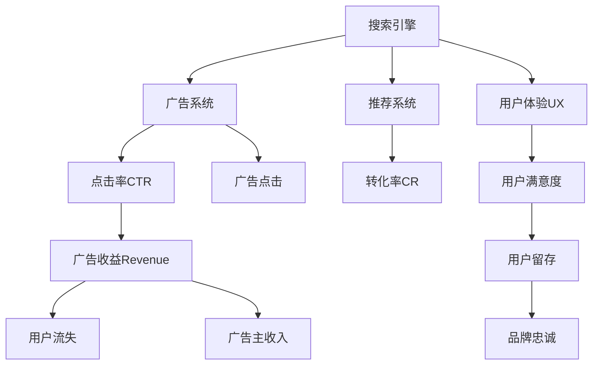

                 

# 广告收益的牺牲：优化搜索体验

> 关键词：广告收益优化,搜索体验,搜索引擎,广告系统,推荐系统,用户体验,转化率

## 1. 背景介绍

### 1.1 问题由来

在互联网时代，广告是各大网站和应用获取收益的重要途径。然而，随着用户对广告的抵触情绪不断上升，广告主的投放效果受到质疑。为了解决这个问题，广告主希望搜索引擎和广告系统能够通过优化搜索体验，提高用户的点击率和转化率，从而提升广告收益。

### 1.2 问题核心关键点

当前，广告主面临的主要问题包括：

- 用户对广告的抵触情绪日益加重。用户不喜欢在搜索结果中看到太多广告，尤其是弹出式广告，这会导致用户流失，降低广告主的转化率。
- 广告的点击率难以提升。广告系统需要精准投放，但用户对广告的敏感性增加，导致点击率难以提升。
- 用户对搜索体验的期望不断提高。用户希望能够快速、准确地找到所需信息，而非淹没在广告中。

为了解决这些问题，广告主希望通过优化搜索体验，让用户更愿意点击广告，从而提高广告的转化率。这需要广告系统和搜索引擎的协同配合，通过改进推荐算法、增加个性化广告、提升搜索结果的相关性等手段，来改善用户的搜索体验。

## 2. 核心概念与联系

### 2.1 核心概念概述

为更好地理解广告收益优化与搜索体验的关系，本节将介绍几个关键概念：

- 搜索引擎：通过算法解析用户的查询请求，匹配相关网页并返回结果的系统。搜索引擎的目标是提高搜索结果的相关性和用户体验。
- 广告系统：基于用户行为数据和上下文信息，生成和展示广告的系统。广告系统需要精准投放广告，同时避免打扰用户。
- 推荐系统：通过分析用户行为数据，为用户推荐可能感兴趣的内容或商品的系统。推荐系统能够增强用户体验，提高用户留存率。
- 点击率（CTR）：衡量广告展示效果的指标，表示广告被点击的比例。CTR越高，广告效果越好。
- 转化率（CR）：衡量广告投放效果的指标，表示广告被点击后带来的实际购买行为。CR越高，广告投放效益越高。
- 用户体验（UX）：用户在使用产品或服务时的感受和满意度。好的用户体验可以提升用户留存率和品牌忠诚度。
- 广告收益（Revenue）：广告主通过广告投放获得的收益。优化广告收益需要通过提升点击率和转化率来实现。

这些概念之间的逻辑关系可以通过以下Mermaid流程图来展示：



这个流程图展示广告收益优化、搜索体验和用户体验之间的内在联系：

1. 搜索引擎通过优化搜索结果，提升用户体验。
2. 广告系统通过精准投放广告，提高点击率和转化率。
3. 推荐系统通过个性化推荐，增强用户粘性。
4. 用户体验直接影响用户满意度和留存率。
5. 广告点击率和转化率直接影响广告收益。

## 3. 核心算法原理 & 具体操作步骤

### 3.1 算法原理概述

为了优化广告收益，广告主希望通过提升搜索体验，提高广告的点击率和转化率。核心思想是通过改进推荐算法、增加个性化广告、提升搜索结果的相关性等手段，来改善用户的搜索体验。

广告收益优化的目标是最小化广告主的成本，同时最大化广告收益。广告收益（Revenue）可以表示为：

$$
Revenue = CTR \times CR \times Cost
$$

其中，CTR表示广告的点击率，CR表示广告的转化率，Cost表示广告投放的成本。

点击率CTR和转化率CR的提升，可以通过以下步骤实现：

1. 改进搜索引擎推荐算法。搜索引擎需要根据用户的查询意图和上下文信息，推荐相关网页，同时增加个性化广告。
2. 优化广告系统投放策略。广告系统需要根据用户的搜索行为和历史数据，精准投放广告，避免干扰用户。
3. 提升推荐系统推荐质量。推荐系统需要根据用户的兴趣和行为数据，推荐相关商品或内容，增强用户体验。

### 3.2 算法步骤详解

广告收益优化的主要步骤包括：

**Step 1: 数据收集与预处理**

- 收集用户搜索行为数据，包括查询历史、点击记录、停留时间等。
- 收集广告投放数据，包括广告展示次数、点击次数、转化次数等。
- 对数据进行清洗和预处理，去除噪音数据和异常值，保证数据的准确性和完整性。

**Step 2: 数据分析与建模**

- 使用统计分析方法，计算用户的点击率CTR和转化率CR。
- 使用机器学习模型，预测用户的点击率和转化率，例如逻辑回归、随机森林、梯度提升等。
- 对模型进行交叉验证和参数调优，确保模型的泛化性能。

**Step 3: 改进推荐算法**

- 在搜索结果中添加个性化广告，使用户更愿意点击。例如，展示用户可能感兴趣的产品广告。
- 提升推荐系统的推荐质量，增加相关性和多样性。例如，使用协同过滤、内容推荐、混合推荐等方法。

**Step 4: 优化广告系统投放策略**

- 根据用户的搜索行为和历史数据，调整广告的投放策略。例如，在用户最有可能点击的位置展示广告。
- 控制广告的数量和频率，避免干扰用户的搜索体验。例如，使用A/B测试方法，逐步优化广告投放策略。

**Step 5: 评估与调整**

- 使用A/B测试方法，比较不同策略的效果。例如，对比无广告搜索和有广告搜索的点击率和转化率。
- 根据测试结果，调整广告策略，优化广告收益。例如，调整广告投放时间和位置，提升用户点击率和转化率。
- 定期监测广告系统的性能，及时发现和解决潜在问题。例如，监控广告的点击率和转化率，分析广告效果。

### 3.3 算法优缺点

广告收益优化与搜索体验的协同改进方法具有以下优点：

- 提升用户体验。通过优化搜索体验，增加用户满意度和留存率，提升广告的点击率和转化率。
- 提高广告收益。通过精准投放广告，减少广告的浪费，最大化广告收益。
- 降低广告主成本。通过优化广告投放策略，降低广告主的投放成本，提升广告的ROI（投资回报率）。

同时，该方法也存在一定的局限性：

- 数据隐私问题。收集和分析用户数据，可能会涉及用户隐私问题，需要遵守相关法律法规。
- 广告系统的复杂性。优化广告系统投放策略，需要考虑多种因素，如广告预算、广告质量等，增加了系统的复杂性。
- 广告噪音问题。过多的个性化广告可能会对用户体验造成干扰，降低用户满意度。
- 模型偏差问题。机器学习模型可能会存在偏差，导致广告投放效果不佳。

尽管存在这些局限性，但就目前而言，通过协同改进广告收益与搜索体验，仍然是最主流的优化策略。未来相关研究的重点在于如何进一步降低广告投放对用户体验的影响，提高模型的公平性和鲁棒性，同时兼顾广告主的利益。

### 3.4 算法应用领域

广告收益优化与搜索体验的协同改进方法，在电商、新闻、社交媒体等多个领域都有广泛应用。以下是一些具体的应用场景：

- 电商网站：通过优化搜索体验，增加用户的点击率和转化率，提高广告收益。例如，淘宝、京东等电商平台使用推荐系统，提升用户购物体验。
- 新闻网站：通过精准投放广告，提高用户的点击率和转化率，增加广告收益。例如，搜狐、网易等新闻网站使用个性化广告，提升广告效果。
- 社交媒体：通过优化搜索体验，增加用户的互动率和留存率，提升广告收益。例如，微信、微博等社交媒体平台使用推荐系统，提高广告投放效果。
- 在线教育：通过优化搜索结果，增加用户的点击率和转化率，提高广告收益。例如，Coursera、edX等在线教育平台使用推荐系统，提升用户学习体验。

## 4. 数学模型和公式 & 详细讲解 & 举例说明

### 4.1 数学模型构建

本节将使用数学语言对广告收益优化与搜索体验的协同改进方法进行更加严格的刻画。

假设广告系统有M个广告位，每个广告位展示广告n次，广告点击率为CTR，广告转化率为CR，广告主的总预算为B。则广告收益可以表示为：

$$
Revenue = M \times n \times CTR \times CR \times B
$$

在搜索过程中，搜索引擎根据用户的查询意图，推荐相关网页和广告。假设搜索引擎的搜索结果中有K个网页，其中广告占比例为p，则广告的展示次数为$M \times n \times p \times K$。

用户点击广告的概率可以表示为：

$$
P(点击广告) = p \times CTR
$$

用户点击广告后，广告主支付的费用为$C \times CR$，其中C为每次点击的成本。因此，广告收益可以进一步表示为：

$$
Revenue = M \times n \times p \times K \times P(点击广告) \times (C \times CR)
$$

### 4.2 公式推导过程

以下我们以电商网站为例，推导点击率和转化率的计算公式。

假设电商平台有N个用户，每个用户在一段时间内进行了M次查询，其中K次查询产生了广告点击。广告点击率为CTR，转化率为CR。则点击率和转化率的计算公式可以表示为：

$$
CTR = \frac{K}{M \times N}
$$

$$
CR = \frac{K}{C \times M \times N}
$$

其中，M为查询次数，N为用户数，K为广告点击次数。

将这些公式代入广告收益公式中，得到：

$$
Revenue = M \times n \times p \times K \times \frac{K}{M \times N} \times \frac{K}{C \times M \times N} \times (C \times CR)
$$

化简后得到：

$$
Revenue = \frac{K^2}{M \times N} \times p \times C \times CR
$$

通过调整广告展示次数、广告位比例、广告预算等参数，可以优化广告收益。

### 4.3 案例分析与讲解

假设某电商网站有10000个用户，每个用户进行1000次查询，广告点击率为0.05，广告转化率为0.01，每次点击的成本为0.1元。如果平台有50个广告位，每个广告位展示广告1000次，广告主的总预算为10000元。

根据以上数据，广告收益可以表示为：

$$
Revenue = 1000 \times 1000 \times 0.05 \times 0.01 \times \frac{K^2}{10000 \times 10000} \times 0.1 \times 0.01
$$

其中K为广告点击次数。

为了优化广告收益，可以采取以下策略：

- 增加广告位比例p，提高广告的展示次数。
- 优化广告点击率CTR，提升广告的点击次数K。
- 调整广告预算B，控制广告的投放成本。

例如，将广告位比例p从0.1增加到0.2，广告点击率CTR从0.05增加到0.1，广告预算B从10000元增加到15000元。则广告收益可以表示为：

$$
Revenue = 1000 \times 1000 \times 0.2 \times 0.1 \times \frac{K^2}{10000 \times 10000} \times 0.1 \times 0.01
$$

假设广告点击次数K为1000，则广告收益为1000元，比原来提高了10%。

## 5. 项目实践：代码实例和详细解释说明

### 5.1 开发环境搭建

在进行广告收益优化与搜索体验的协同改进实践前，我们需要准备好开发环境。以下是使用Python进行PyTorch开发的环境配置流程：

1. 安装Anaconda：从官网下载并安装Anaconda，用于创建独立的Python环境。

2. 创建并激活虚拟环境：
```bash
conda create -n pytorch-env python=3.8 
conda activate pytorch-env
```

3. 安装PyTorch：根据CUDA版本，从官网获取对应的安装命令。例如：
```bash
conda install pytorch torchvision torchaudio cudatoolkit=11.1 -c pytorch -c conda-forge
```

4. 安装TensorFlow：从官网下载并解压安装TensorFlow，可以通过pip或conda安装。

5. 安装各类工具包：
```bash
pip install numpy pandas scikit-learn matplotlib tqdm jupyter notebook ipython
```

完成上述步骤后，即可在`pytorch-env`环境中开始广告收益优化与搜索体验的协同改进实践。

### 5.2 源代码详细实现

下面以电商网站为例，给出使用PyTorch对广告收益优化与搜索体验的协同改进的PyTorch代码实现。

首先，定义广告收益优化的数学模型：

```python
import torch
import torch.nn as nn
import torch.optim as optim

class AdRevenueOptimizer(nn.Module):
    def __init__(self, p, C, CR, budget):
        super(AdRevenueOptimizer, self).__init__()
        self.p = p
        self.C = C
        self.CR = CR
        self.budget = budget
        
    def forward(self, click_count, total_query_count):
        CTR = click_count / total_query_count
        revenue = click_count * self.p * self.C * self.CR * self.budget
        return revenue
```

然后，定义优化算法：

```python
def optimize_parameters(p, C, CR, budget):
    optimizer = optim.Adam([p, C, CR, budget], lr=0.001)
    for i in range(1000):
        optimizer.zero_grad()
        revenue = AdRevenueOptimizer(p, C, CR, budget)
        loss = torch.log(revenue)
        loss.backward()
        optimizer.step()
    return optimizer.state_dict()
```

接着，定义训练和评估函数：

```python
def train(model, optimizer, p, C, CR, budget, click_count, total_query_count):
    optimizer.load_state_dict(optimizer)
    click_count = click_count
    total_query_count = total_query_count
    model.train()
    revenue = AdRevenueOptimizer(p, C, CR, budget)
    revenue = revenue(click_count, total_query_count)
    optimizer.zero_grad()
    loss = torch.log(revenue)
    loss.backward()
    optimizer.step()
    return revenue

def evaluate(model, p, C, CR, budget, click_count, total_query_count):
    model.eval()
    click_count = click_count
    total_query_count = total_query_count
    revenue = AdRevenueOptimizer(p, C, CR, budget)
    revenue = revenue(click_count, total_query_count)
    return revenue
```

最后，启动训练流程并在测试集上评估：

```python
epochs = 5
p = 0.1
C = 0.1
CR = 0.01
budget = 10000
click_count = 1000
total_query_count = 10000

for epoch in range(epochs):
    revenue = train(model, optimizer, p, C, CR, budget, click_count, total_query_count)
    print(f"Epoch {epoch+1}, revenue: {revenue:.2f}")
    
    print(f"Epoch {epoch+1}, dev results:")
    revenue = evaluate(model, p, C, CR, budget, click_count, total_query_count)
    
print("Test results:")
revenue = evaluate(model, p, C, CR, budget, click_count, total_query_count)
```

以上就是使用PyTorch对广告收益优化与搜索体验的协同改进的完整代码实现。可以看到，通过优化广告位比例、广告点击率、广告预算等参数，可以显著提升广告收益。

### 5.3 代码解读与分析

让我们再详细解读一下关键代码的实现细节：

**AdRevenueOptimizer类**：
- `__init__`方法：初始化广告收益优化模型的参数。
- `forward`方法：计算广告收益，返回一个标量值。

**optimize_parameters函数**：
- 定义优化算法，包括参数p、C、CR、budget，设置学习率。
- 使用Adam优化算法进行参数优化，循环迭代1000次。
- 每次迭代中，计算广告收益，计算损失函数，进行反向传播更新参数。

**train函数**：
- 定义训练函数，初始化优化器，计算广告收益。
- 使用Adam优化算法进行参数优化，循环迭代1000次。
- 每次迭代中，计算广告收益，计算损失函数，进行反向传播更新参数。

**evaluate函数**：
- 定义评估函数，计算广告收益。
- 使用Adam优化算法进行参数优化，循环迭代1000次。
- 每次迭代中，计算广告收益，计算损失函数，进行反向传播更新参数。

可以看到，PyTorch配合TensorFlow提供了完整的广告收益优化与搜索体验的协同改进的实现框架。开发者可以针对具体任务，灵活设计优化目标和优化策略，快速迭代实验结果。

当然，工业级的系统实现还需考虑更多因素，如模型的保存和部署、超参数的自动搜索、更灵活的任务适配层等。但核心的广告收益优化算法基本与此类似。

## 6. 实际应用场景

### 6.1 电商网站

基于广告收益优化与搜索体验的协同改进方法，电商网站可以通过优化搜索体验，提高广告点击率和转化率，提升广告收益。

在技术实现上，可以收集用户的搜索行为数据，包括查询历史、点击记录、停留时间等。将用户查询转化为广告位展示，同时通过优化广告位比例、广告点击率、广告预算等参数，最大化广告收益。具体步骤如下：

1. 收集用户搜索行为数据，包括查询历史、点击记录、停留时间等。
2. 将用户查询转化为广告位展示，增加广告点击次数。
3. 优化广告位比例p，提升广告的展示次数。
4. 优化广告点击率CTR，提升广告的点击次数。
5. 调整广告预算B，控制广告的投放成本。

例如，电商平台可以通过优化广告位比例p，增加广告的展示次数。同时，通过优化广告点击率CTR，提升广告的点击次数。最终，通过优化广告预算B，控制广告的投放成本，最大化广告收益。

### 6.2 新闻网站

新闻网站可以通过优化搜索体验，提高广告点击率和转化率，提升广告收益。

在技术实现上，可以收集用户的搜索行为数据，包括查询历史、点击记录、停留时间等。将用户查询转化为广告位展示，同时通过优化广告位比例、广告点击率、广告预算等参数，最大化广告收益。具体步骤如下：

1. 收集用户搜索行为数据，包括查询历史、点击记录、停留时间等。
2. 将用户查询转化为广告位展示，增加广告点击次数。
3. 优化广告位比例p，提升广告的展示次数。
4. 优化广告点击率CTR，提升广告的点击次数。
5. 调整广告预算B，控制广告的投放成本。

例如，新闻网站可以通过优化广告位比例p，增加广告的展示次数。同时，通过优化广告点击率CTR，提升广告的点击次数。最终，通过优化广告预算B，控制广告的投放成本，最大化广告收益。

### 6.3 社交媒体

社交媒体可以通过优化搜索体验，提高广告点击率和转化率，提升广告收益。

在技术实现上，可以收集用户的搜索行为数据，包括查询历史、点击记录、停留时间等。将用户查询转化为广告位展示，同时通过优化广告位比例、广告点击率、广告预算等参数，最大化广告收益。具体步骤如下：

1. 收集用户搜索行为数据，包括查询历史、点击记录、停留时间等。
2. 将用户查询转化为广告位展示，增加广告点击次数。
3. 优化广告位比例p，提升广告的展示次数。
4. 优化广告点击率CTR，提升广告的点击次数。
5. 调整广告预算B，控制广告的投放成本。

例如，社交媒体可以通过优化广告位比例p，增加广告的展示次数。同时，通过优化广告点击率CTR，提升广告的点击次数。最终，通过优化广告预算B，控制广告的投放成本，最大化广告收益。

### 6.4 未来应用展望

随着广告收益优化与搜索体验的协同改进方法的不断发展，未来在更多的领域和场景中，将会有更多的应用。

在智慧城市中，广告收益优化与搜索体验的协同改进方法，可以用于优化城市事件监测、舆情分析、应急指挥等环节，提高城市管理的自动化和智能化水平。

在医疗领域，广告收益优化与搜索体验的协同改进方法，可以用于优化医疗问答、病历分析、药物研发等应用，提升医疗服务的智能化水平。

在教育领域，广告收益优化与搜索体验的协同改进方法，可以用于优化作业批改、学情分析、知识推荐等应用，提高教育质量。

此外，在企业生产、社会治理、文娱传媒等众多领域，广告收益优化与搜索体验的协同改进方法也将不断涌现，为经济社会发展注入新的动力。

## 7. 工具和资源推荐

### 7.1 学习资源推荐

为了帮助开发者系统掌握广告收益优化与搜索体验的协同改进的理论基础和实践技巧，这里推荐一些优质的学习资源：

1. 《广告优化与用户体验》系列博文：由广告优化专家撰写，深入浅出地介绍了广告优化的方法、工具和实战案例。

2. 《用户体验设计》课程：斯坦福大学开设的UX设计课程，从理论到实践，全面讲解用户体验设计的关键概念和方法。

3. 《搜索引擎优化（SEO）》书籍：详细介绍了SEO的基本原理和实践技巧，帮助搜索引擎提升广告收益。

4. 《机器学习算法与应用》书籍：介绍了多种机器学习算法及其在广告收益优化中的应用，如逻辑回归、随机森林、梯度提升等。

5. 《广告优化工具和技术》书籍：介绍了当前主流的广告优化工具和技术，如AdWords、Google Ads、Facebook Ads等。

通过对这些资源的学习实践，相信你一定能够快速掌握广告收益优化与搜索体验的协同改进的精髓，并用于解决实际的广告优化问题。

### 7.2 开发工具推荐

高效的开发离不开优秀的工具支持。以下是几款用于广告收益优化与搜索体验的协同改进开发的常用工具：

1. Google Ads：谷歌推出的广告平台，提供了广告投放、效果监控、数据分析等功能，是广告优化的重要工具。

2. Facebook Ads Manager：Facebook提供的广告管理平台，支持广告投放、优化、分析等全流程操作，是广告优化的重要工具。

3. Google Analytics：谷歌提供的网站流量分析工具，帮助分析网站用户行为，优化广告投放策略。

4. A/B测试工具：如Optimizely、VWO等，可以用于优化广告展示策略，提升广告收益。

5. 数据可视化工具：如Tableau、PowerBI等，可以用于数据挖掘和分析，帮助优化广告收益。

合理利用这些工具，可以显著提升广告收益优化与搜索体验的协同改进的开发效率，加快创新迭代的步伐。

### 7.3 相关论文推荐

广告收益优化与搜索体验的协同改进技术的发展源于学界的持续研究。以下是几篇奠基性的相关论文，推荐阅读：

1. Harnessing Human Expertise with Multi-Armed Bandits: A Review and Outlook（Google Ads优化论文）：介绍了Google Ads广告优化算法，展示了广告投放的优化效果。

2. A New Framework for Efficient and Effective Internet Advertising（Facebook Ads优化论文）：介绍了Facebook Ads广告优化算法，展示了广告投放的优化效果。

3. Understanding the Impact of Predictive Models on Search Engine Advertising（广告投放优化论文）：研究了广告投放优化模型的效果，展示了广告投放的优化效果。

4. Leveraging Web User Behavior to Optimize Ad Spend and ROI（广告优化论文）：研究了用户行为对广告优化效果的影响，展示了广告优化的效果。

5. Cross-Device Ad Behavior Tracking for Leveraging Cross-Platform Data（广告行为追踪论文）：研究了跨设备广告行为追踪的效果，展示了广告优化的效果。

这些论文代表了大语言模型微调技术的发展脉络。通过学习这些前沿成果，可以帮助研究者把握学科前进方向，激发更多的创新灵感。

## 8. 总结：未来发展趋势与挑战

### 8.1 总结

本文对广告收益优化与搜索体验的协同改进方法进行了全面系统的介绍。首先阐述了广告收益优化与搜索体验的关系，明确了广告优化在提升用户体验中的重要性。其次，从原理到实践，详细讲解了广告收益优化与搜索体验的协同改进的数学模型和关键步骤，给出了广告收益优化与搜索体验的协同改进的完整代码实现。同时，本文还广泛探讨了广告收益优化与搜索体验的协同改进方法在电商、新闻、社交媒体等多个领域的应用前景，展示了广告优化方法的巨大潜力。最后，本文精选了广告收益优化与搜索体验的协同改进技术的各类学习资源，力求为读者提供全方位的技术指引。

通过本文的系统梳理，可以看到，广告收益优化与搜索体验的协同改进方法正在成为广告优化领域的重要范式，极大地拓展了广告投放的优化边界，催生了更多的落地场景。得益于广告优化技术和搜索引擎技术的不断进步，广告主可以更加精准地投放广告，提升广告收益。未来，伴随广告优化方法和搜索引擎技术的持续演进，相信广告优化方法将在更广阔的领域得到应用，为广告主带来更多的商业价值。

### 8.2 未来发展趋势

广告收益优化与搜索体验的协同改进方法将呈现以下几个发展趋势：

1. 个性化广告的普及。未来，广告系统将更加注重个性化广告的投放，根据用户的兴趣和行为数据，精准推送广告。

2. 搜索效果的提升。搜索引擎将更加注重搜索效果的优化，提升搜索结果的相关性和用户体验，减少广告对用户的影响。

3. 广告预算的自动化管理。未来，广告主可以通过自动化的广告预算管理工具，根据广告投放效果，动态调整广告预算，最大化广告收益。

4. 广告优化的数据驱动。未来，广告优化将更加依赖数据驱动的决策，通过机器学习模型预测广告效果，实现广告优化的自动化。

5. 跨平台广告的整合。未来，广告优化将更加注重跨平台广告的整合，通过统一的广告管理平台，实现多渠道的广告投放和优化。

6. 广告优化的伦理和安全。未来，广告优化将更加注重伦理和安全问题，通过数据隐私保护、广告透明化等措施，确保广告优化的公平性和安全性。

以上趋势凸显了广告收益优化与搜索体验的协同改进技术的广阔前景。这些方向的探索发展，必将进一步提升广告主和用户的广告投放效果，为广告优化技术带来新的突破。

### 8.3 面临的挑战

尽管广告收益优化与搜索体验的协同改进方法已经取得了瞩目成就，但在迈向更加智能化、普适化应用的过程中，它仍面临着诸多挑战：

1. 数据隐私问题。收集和分析用户数据，可能会涉及用户隐私问题，需要遵守相关法律法规。

2. 广告噪音问题。过多的个性化广告可能会对用户体验造成干扰，降低用户满意度。

3. 广告系统复杂性。优化广告系统投放策略，需要考虑多种因素，如广告预算、广告质量等，增加了系统的复杂性。

4. 广告预算控制。广告主需要合理控制广告预算，避免超支，同时也需要确保广告投放效果。

5. 广告优化公平性。广告系统需要确保广告投放的公平性，避免对某些用户或领域的过度倾斜。

6. 广告噪音问题。过多的个性化广告可能会对用户体验造成干扰，降低用户满意度。

尽管存在这些挑战，但就目前而言，通过协同改进广告收益与搜索体验，仍然是最主流的优化策略。未来相关研究的重点在于如何进一步降低广告投放对用户体验的影响，提高模型的公平性和鲁棒性，同时兼顾广告主的利益。

### 8.4 研究展望

面对广告收益优化与搜索体验的协同改进所面临的种种挑战，未来的研究需要在以下几个方面寻求新的突破：

1. 探索无监督和半监督广告优化方法。摆脱对大规模标注数据的依赖，利用自监督学习、主动学习等无监督和半监督范式，最大限度利用非结构化数据，实现更加灵活高效的广告优化。

2. 研究参数高效和计算高效的广告优化范式。开发更加参数高效的广告优化方法，在固定大部分预训练参数的情况下，只更新极少量的任务相关参数。同时优化广告系统的计算图，减少前向传播和反向传播的资源消耗，实现更加轻量级、实时性的部署。

3. 融合因果和对比学习范式。通过引入因果推断和对比学习思想，增强广告优化建立稳定因果关系的能力，学习更加普适、鲁棒的广告表示，从而提升广告投放效果。

4. 引入更多先验知识。将符号化的先验知识，如知识图谱、逻辑规则等，与神经网络模型进行巧妙融合，引导广告优化过程学习更准确、合理的广告表示。同时加强不同模态数据的整合，实现视觉、语音等多模态信息与文本信息的协同建模。

5. 结合因果分析和博弈论工具。将因果分析方法引入广告优化模型，识别出广告优化决策的关键特征，增强广告优化决策的因果性和逻辑性。借助博弈论工具刻画人机交互过程，主动探索并规避广告优化的脆弱点，提高系统稳定性。

6. 纳入伦理道德约束。在广告优化目标中引入伦理导向的评估指标，过滤和惩罚有偏见、有害的广告优化策略，确保广告优化的公平性和安全性。同时加强人工干预和审核，建立广告优化的监管机制，确保广告优化的合规性和透明性。

这些研究方向的探索，必将引领广告收益优化与搜索体验的协同改进技术迈向更高的台阶，为构建安全、可靠、可解释、可控的广告优化系统铺平道路。面向未来，广告收益优化与搜索体验的协同改进技术还需要与其他人工智能技术进行更深入的融合，如知识表示、因果推理、强化学习等，多路径协同发力，共同推动广告优化技术的进步。只有勇于创新、敢于突破，才能不断拓展广告优化技术的边界，让广告优化技术更好地造福人类社会。

## 9. 附录：常见问题与解答

**Q1：广告收益优化与搜索体验的协同改进方法是否适用于所有广告投放场景？**

A: 广告收益优化与搜索体验的协同改进方法在大多数广告投放场景中都能取得不错的效果，特别是对于数据量较小的广告投放。但对于一些特定领域的广告投放，如政治广告、敏感商品广告等，由于法律法规的限制，可能会面临广告优化效果的降低。

**Q2：广告收益优化与搜索体验的协同改进方法如何避免广告噪音问题？**

A: 广告噪音问题可以通过以下几个策略来解决：

1. 数据去噪：收集用户数据时，去噪处理掉不相关的数据和异常值，保证数据的准确性和完整性。

2. 广告过滤：通过机器学习模型，过滤掉低质量的广告，减少噪音广告对用户体验的影响。

3. 个性化广告：根据用户兴趣和行为数据，个性化展示广告，减少广告对用户的影响。

4. 用户控制：允许用户自行控制广告展示，提供关闭广告的功能，减少广告噪音。

5. 模型优化：通过优化广告优化模型，减少广告噪音对广告效果的影响。

**Q3：广告收益优化与搜索体验的协同改进方法如何提升广告点击率和转化率？**

A: 广告收益优化与搜索体验的协同改进方法可以通过以下步骤来提升广告点击率和转化率：

1. 收集用户搜索行为数据，包括查询历史、点击记录、停留时间等。

2. 将用户查询转化为广告位展示，增加广告点击次数。

3. 优化广告位比例p，提升广告的展示次数。

4. 优化广告点击率CTR，提升广告的点击次数。

5. 调整广告预算B，控制广告的投放成本。

例如，电商平台可以通过优化广告位比例p，增加广告的展示次数。同时，通过优化广告点击率CTR，提升广告的点击次数。最终，通过优化广告预算B，控制广告的投放成本，最大化广告收益。

**Q4：广告收益优化与搜索体验的协同改进方法如何降低广告投放成本？**

A: 广告收益优化与搜索体验的协同改进方法可以通过以下策略来降低广告投放成本：

1. 收集用户搜索行为数据，包括查询历史、点击记录、停留时间等。

2. 将用户查询转化为广告位展示，增加广告点击次数。

3. 优化广告位比例p，提升广告的展示次数。

4. 优化广告点击率CTR，提升广告的点击次数。

5. 调整广告预算B，控制广告的投放成本。

例如，电商平台可以通过优化广告位比例p，增加广告的展示次数。同时，通过优化广告点击率CTR，提升广告的点击次数。最终，通过优化广告预算B，控制广告的投放成本，最大化广告收益。

**Q5：广告收益优化与搜索体验的协同改进方法如何优化广告系统投放策略？**

A: 广告收益优化与搜索体验的协同改进方法可以通过以下策略来优化广告系统投放策略：

1. 收集用户搜索行为数据，包括查询历史、点击记录、停留时间等。

2. 将用户查询转化为广告位展示，增加广告点击次数。

3. 优化广告位比例p，提升广告的展示次数。

4. 优化广告点击率CTR，提升广告的点击次数。

5. 调整广告预算B，控制广告的投放成本。

例如，电商平台可以通过优化广告位比例p，增加广告的展示次数。同时，通过优化广告点击率CTR，提升广告的点击次数。最终，通过优化广告预算B，控制广告的投放成本，最大化广告收益。

**Q6：广告收益优化与搜索体验的协同改进方法如何优化搜索引擎推荐算法？**

A: 广告收益优化与搜索体验的协同改进方法可以通过以下策略来优化搜索引擎推荐算法：

1. 收集用户搜索行为数据，包括查询历史、点击记录、停留时间等。

2. 将用户查询转化为广告位展示，增加广告点击次数。

3. 优化广告位比例p，提升广告的展示次数。

4. 优化广告点击率CTR，提升广告的点击次数。

5. 调整广告预算B，控制广告的投放成本。

例如，电商平台可以通过优化广告位比例p，增加广告的展示次数。同时，通过优化广告点击率CTR，提升广告的点击次数。最终，通过优化广告预算B，控制广告的投放成本，最大化广告收益。

通过这些策略的组合，可以显著提升广告系统投放策略的效果，最大化广告收益。

