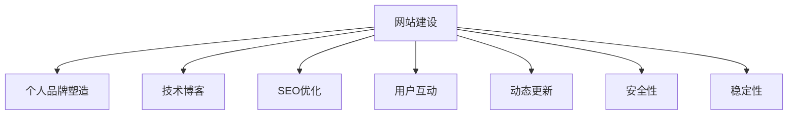

                 

# 建立个人网站：展示你的专业知识和成果

> 关键词：网站建设, 个人品牌塑造, 技术博客, 网站优化, 用户互动

## 1. 背景介绍

### 1.1 问题由来
在当今信息爆炸的时代，个人品牌的建立和展示已经成为了成功职业生涯的重要组成部分。无论是技术人员还是管理人员，一个精心设计的个人网站不仅能展示其专业知识和成果，还能吸引潜在雇主、合作伙伴或学术交流对象。然而，如何高效地建立和维护一个既能反映个人技能，又能提供有价值信息的网站，成为了一个技术难题。

### 1.2 问题核心关键点
一个成功的个人网站应具备以下关键点：
- 高质量的内容：展示个人专业知识和研究成果。
- 直观易用的界面：提升用户体验，增强浏览黏性。
- 良好的SEO优化：增加网站的可见性和流量。
- 用户互动功能：如评论、留言等，增强互动性。
- 动态更新机制：保持网站内容的时效性和吸引力。
- 安全性与稳定性：保护用户隐私，确保网站运行稳定。

## 2. 核心概念与联系

### 2.1 核心概念概述

为更好地理解如何建立和维护个人网站，本节将介绍几个密切相关的核心概念：

- 网站建设(Web Development)：包括前端和后端技术，实现网站的构建和功能实现。
- 个人品牌塑造(Branding)：通过网站内容、设计、SEO等手段，塑造和传播个人或品牌的形象和价值。
- 技术博客(Technical Blogging)：以技术内容为主，分享个人或团队的开发经验和见解。
- SEO优化(Search Engine Optimization)：通过优化网站结构和内容，提高在搜索引擎中的排名，增加网站流量。
- 用户互动(User Interaction)：如评论区、在线聊天、论坛等，提升用户参与度和满意度。
- 动态更新(Dynamic Updating)：使用博客系统、CMS等工具，实现网站的持续更新和维护。
- 安全性(Security)：保护网站免受恶意攻击，确保数据隐私。
- 稳定性(Stability)：确保网站稳定运行，不出现长时间宕机或故障。

这些核心概念之间的逻辑关系可以通过以下Mermaid流程图来展示：



这个流程图展示了个体网站建设的各个环节及其相互作用：

1. 网站建设是基础，实现网站功能的实现。
2. 个人品牌塑造通过网站内容和设计来塑造和传播。
3. 技术博客提供技术分享，提升网站的专业性。
4. SEO优化提高网站的可见性和流量。
5. 用户互动增加用户参与度。
6. 动态更新确保网站内容的时效性和吸引力。
7. 安全性与稳定性保护网站免受攻击，确保运行稳定。

这些概念共同构成了个人网站建设的核心框架，帮助技术从业者更好地展示其专业知识和成果。

## 3. 核心算法原理 & 具体操作步骤
### 3.1 算法原理概述

网站建设是一个涉及多种技术和策略的综合过程，核心算法原理主要包括：

- 前端开发：HTML、CSS、JavaScript等技术，实现网站的可视化和交互效果。
- 后端开发：服务器端语言（如Python、Java、PHP等），处理业务逻辑和数据存储。
- SEO算法：通过关键词优化、网站结构设计等，提升搜索引擎抓取和排名。
- 安全性策略：采用SSL证书、防火墙、Web应用防火墙等技术手段，保护网站安全。
- 稳定性方案：数据库优化、负载均衡、灾难恢复等技术，确保网站稳定运行。

### 3.2 算法步骤详解

网站建设的具体操作步骤包括以下几个关键步骤：

**Step 1: 确定网站需求和目标**
- 定义网站的主要功能和展示内容。
- 设定网站的定位和目标受众。
- 确定网站的UI/UX设计风格。

**Step 2: 选择技术栈和框架**
- 确定网站的前端和后端技术。
- 选择合适的开发框架和工具。
- 配置版本控制系统（如Git）。

**Step 3: 网站搭建与开发**
- 使用HTML、CSS、JavaScript等技术实现网站的前端界面。
- 使用后端技术实现数据处理和业务逻辑。
- 进行SEO优化，包括关键词研究、网站结构设计等。

**Step 4: 测试与优化**
- 对网站进行功能测试、性能测试、安全测试等。
- 收集用户反馈，不断优化网站体验。
- 对SEO策略进行调整，提升搜索引擎排名。

**Step 5: 部署与维护**
- 选择合适的托管平台（如AWS、阿里云等）。
- 进行网站上线部署。
- 持续监控网站状态，进行日常维护和更新。

### 3.3 算法优缺点

网站建设涉及多方面的技术和策略，其优缺点如下：

**优点：**
- 展示专业知识和成果，建立个人品牌。
- 提升个人或团队的影响力和知名度。
- 增加与行业内外的交流机会。
- 利用网站流量，进行商业合作或产品推广。

**缺点：**
- 需要投入大量时间和资源进行建设和维护。
- 技术门槛较高，非专业开发人员难以独立完成。
- 网站安全性和稳定性需持续监控和优化。
- 网站更新频率要求高，维护成本较大。

### 3.4 算法应用领域

网站建设的应用领域非常广泛，适用于各种职业和行业，例如：

- 软件开发人员：展示技术项目和博客文章，吸引技术交流。
- 产品经理：展示产品原型和功能说明，收集用户反馈。
- 数据科学家：展示数据分析结果和模型，提升技术认可度。
- 学术研究人员：发布研究论文和成果，进行学术交流。
- 设计人员：展示设计作品和案例，提升设计影响力。
- 自由职业者：展示服务项目和客户评价，吸引潜在客户。
- 教育工作者：发布教学资源和课堂体验，提升教学效果。

## 4. 数学模型和公式 & 详细讲解  
### 4.1 数学模型构建

网站建设虽然不直接涉及数学模型，但可以引入数学模型来优化网站的某些方面。例如，SEO优化中，可以通过Google PageRank算法来计算网站的权重和排名，进行搜索引擎优化。以下是Google PageRank的基本数学模型：

$$
P_{i} = (1 - d)/N + d/(N \sum_{j \in M_i} P_j)
$$

其中，$P_i$ 表示网页 $i$ 的权重，$d$ 是阻尼因子（通常设为0.85），$N$ 是网页总数，$M_i$ 是网页 $i$ 的出链集合。

### 4.2 公式推导过程

以SEO优化为例，Google PageRank算法的基本原理是通过网页间的链接关系，计算网页的权重，从而确定其在搜索引擎中的排名。以下是该算法的详细推导过程：

1. 假设网页集合为 $\{P_1, P_2, ..., P_N\}$，其中 $P_i$ 表示网页 $i$ 的权重。
2. 网页 $i$ 的权重可以通过其链接到的所有网页的权重来计算，公式为：
   $$
   P_{i} = (1 - d)/N + d/(N \sum_{j \in M_i} P_j)
   $$
   其中，$d$ 是阻尼因子，通常设为0.85。
3. 该公式的物理意义是：网页的权重是1减去阻尼因子，加上阻尼因子与所有指向该网页的网页权重的平均值。
4. 通过迭代计算，可以逐步逼近网页的真实权重，从而确定其在搜索引擎中的排名。

### 4.3 案例分析与讲解

以一个简单的博客系统为例，分析如何使用数学模型来优化SEO。

**步骤1: 网页权重计算**
- 假设博客系统中有10篇博客，每篇博客链接到5篇文章。
- 计算每篇博客的权重，假设有三篇文章被所有博客引用，权重分别为0.9、0.8、0.7。

**步骤2: 权重迭代计算**
- 按照公式 $P_{i} = (1 - d)/N + d/(N \sum_{j \in M_i} P_j)$ 计算每篇文章的权重。
- 假设阻尼因子 $d = 0.85$，迭代计算每篇文章的权重，直到收敛。

**步骤3: 结果分析**
- 通过权重迭代，可以发现引用次数多的文章权重更高，被更多文章引用的文章权重也更高。
- 可以根据权重进行文章的优先展示，提升搜索引擎排名。

## 5. 项目实践：代码实例和详细解释说明
### 5.1 开发环境搭建

在进行网站建设之前，我们需要准备好开发环境。以下是使用Python进行Flask开发的环境配置流程：

1. 安装Python：确保Python 3.7或更高版本已经安装。
2. 安装Flask：使用pip安装Flask框架。
3. 安装扩展包：如Flask-WTF、Flask-SQLAlchemy等。
4. 创建虚拟环境：使用virtualenv创建虚拟环境，隔离项目依赖。

### 5.2 源代码详细实现

以下是一个简单的博客系统示例，包括前端和后端代码实现。

**前端代码：**

```html
<!DOCTYPE html>
<html>
<head>
    <title>My Blog</title>
    <link rel="stylesheet" href="{{ url_for('static', filename='style.css') }}">
</head>
<body>
    <h1>Welcome to My Blog</h1>
    <ul id="posts">
        
            <li>
                <h2>{{ post.title }}</h2>
                <p>{{ post.content }}</p>
                <a href="{{ url_for('post_detail', post_id=post.id) }}">Read More</a>
            </li>
        
    </ul>
    <form action="{{ url_for('post_create') }}" method="post">
        <input type="text" name="title">
        <textarea name="content"></textarea>
        <button type="submit">Create Post</button>
    </form>
</body>
</html>
```

**后端代码：**

```python
from flask import Flask, render_template, request, redirect, url_for
from flask_sqlalchemy import SQLAlchemy
from flask_wtf import FlaskForm
from wtforms import StringField, TextAreaField
from wtforms.validators import DataRequired

app = Flask(__name__)
app.config['SQLALCHEMY_DATABASE_URI'] = 'sqlite:///blog.db'
db = SQLAlchemy(app)

class Post(db.Model):
    id = db.Column(db.Integer, primary_key=True)
    title = db.Column(db.String(80), unique=True, nullable=False)
    content = db.Column(db.Text, nullable=False)

class PostForm(FlaskForm):
    title = StringField('Title', validators=[DataRequired()])
    content = TextAreaField('Content', validators=[DataRequired()])

@app.route('/')
def index():
    posts = Post.query.all()
    return render_template('index.html', posts=posts)

@app.route('/post_detail', methods=['GET', 'POST'])
def post_detail():
    post_id = request.args.get('post_id')
    post = Post.query.get_or_404(post_id)
    form = PostForm()
    if form.validate_on_submit():
        title = form.title.data
        content = form.content.data
        new_post = Post(title=title, content=content)
        db.session.add(new_post)
        db.session.commit()
        return redirect(url_for('index'))
    return render_template('post_detail.html', post=post, form=form)

if __name__ == '__main__':
    db.create_all()
    app.run(debug=True)
```

### 5.3 代码解读与分析

让我们再详细解读一下关键代码的实现细节：

**Post类：**
- 定义了博客文章的数据库模型，包括文章ID、标题和内容。

**PostForm类：**
- 定义了表单验证器，确保文章标题和内容必须填写。

**index函数：**
- 获取所有文章，渲染到首页。

**post_detail函数：**
- 根据文章ID获取文章，显示文章详情。
- 提交表单时，创建新文章并保存到数据库。

**if __name__ == '__main__':**
- 创建数据库表，启动Flask应用。

可以看到，Flask框架的使用使得博客系统的开发非常简洁高效。开发者可以将更多精力放在逻辑实现上，而不必过多关注底层的实现细节。

当然，工业级的系统实现还需考虑更多因素，如数据库优化、用户认证、缓存机制等。但核心的网站搭建和开发流程基本与此类似。

## 6. 实际应用场景
### 6.1 企业内部知识共享

企业内部的知识共享平台可以极大地提升团队协作效率，加速技术传承和创新。一个集成的博客系统，可以让员工展示其技术积累，分享项目经验和研究成果。

具体而言，可以收集企业内部的技术文档、项目总结、培训材料等，构建一个易于访问、互动的博客系统。员工可以在系统中发布文章，进行评论和讨论，形成良好的知识共享氛围。此外，还可以设置内部论坛、知识库等，进一步丰富知识共享形式，加速企业技术积累和知识传播。

### 6.2 教育培训平台

教育培训平台可以为学员提供丰富的学习资源和技术支持。一个专业的技术博客系统，能够展示课程内容、教学视频、习题解答等，提升培训效果。

在实践中，可以收集课程讲义、实验报告、论文草稿等教学资料，创建一个集成的博客系统。学员可以阅读学习资料，参与讨论，甚至可以提交作业并获得教师的反馈。如此构建的培训平台，能够提升学习者的参与度和学习效果，加速知识转化和应用。

### 6.3 学术研究分享

学术研究人员需要及时分享其最新的研究成果和进展，以便获得同行评审和交流。一个集成的博客系统，可以帮助研究人员展示其研究成果，扩大影响力。

具体而言，可以收集研究论文、实验数据、代码实现等学术资料，创建一个集成的博客系统。研究人员可以发布最新论文和实验结果，进行学术讨论，甚至可以提供在线实验和代码分享。如此构建的学术平台，能够促进科研资源的共享和交流，加速学术创新的进程。

### 6.4 未来应用展望

随着技术的不断进步，网站建设的应用将更加多样和深入。未来，我们相信网站建设将在以下几个方面取得突破：

1. 更加交互化和个性化。利用AI和数据分析技术，为用户提供个性化的内容推荐和互动体验。
2. 支持多语言和跨文化。通过自然语言处理技术，实现多语言支持和跨文化交流。
3. 增强自动化和智能化。引入机器学习和数据挖掘技术，实现内容的自动生成和优化。
4. 实现全平台覆盖。支持PC、移动端等多种设备和平台，提升用户体验和访问便捷性。
5. 实现区块链技术的应用。通过区块链技术，保障内容的真实性和版权保护。

## 7. 工具和资源推荐
### 7.1 学习资源推荐

为了帮助开发者系统掌握网站建设的技术基础和前沿趋势，这里推荐一些优质的学习资源：

1. 《Web Development with Python》：详细讲解Python在网站开发中的应用，适合入门和进阶读者。
2. 《Flask Web Development》：由Flask官方作者撰写，详细介绍Flask框架的开发实践。
3. 《JavaScript & JQuery: Interactive Front-End Web Development》：讲解JavaScript和JQuery的前端开发技术，适合前端开发者。
4. 《Designing with the Mind in Mind》：讲解UI/UX设计原则，提升网站设计质量。
5. 《SEO for Beginners》：由SEO专家撰写，适合初学者，讲解SEO基础知识和实践技巧。

通过对这些资源的学习实践，相信你一定能够快速掌握网站建设的核心技术，并用于解决实际的业务问题。

### 7.2 开发工具推荐

高效的开发离不开优秀的工具支持。以下是几款用于网站建设开发的常用工具：

1. VS Code：一款强大的代码编辑器，支持多种语言和框架，适合前后端开发。
2. Git：版本控制系统，方便代码管理和团队协作。
3. Bootstrap：前端开发框架，提供丰富的UI组件和样式，快速搭建网站原型。
4. Docker：容器化技术，方便网站部署和管理。
5. Jenkins：持续集成工具，自动构建和部署网站代码。

合理利用这些工具，可以显著提升网站建设的开发效率，加快创新迭代的步伐。

### 7.3 相关论文推荐

网站建设技术的发展源于学界的持续研究。以下是几篇奠基性的相关论文，推荐阅读：

1. "Web Development and Application" by Tom Green, Dave Gutknecht: 综合介绍了网站开发的各个方面，包括前端、后端、数据库等技术。
2. "Designing Web Sites" by Mark Levison: 讲解了网站设计和用户交互的原则，提升网站用户体验。
3. "Site Search in the Enterprise" by Chris Jones: 讨论了企业网站搜索技术的应用，提升网站信息检索和导航效果。
4. "Robust Scalable Caching for Websites" by Mark Marby: 讲解了网站缓存技术，提升网站性能和稳定性。
5. "Using Web Storage to Save State" by Paul Irish: 讲解了Web Storage技术，提升网站的交互体验和数据管理。

这些论文代表了我们网站建设的理论基础和发展方向，通过学习这些前沿成果，可以帮助研究者把握学科前进方向，激发更多的创新灵感。

## 8. 总结：未来发展趋势与挑战
### 8.1 总结

本文对网站建设的核心概念和实现流程进行了全面系统的介绍。首先阐述了网站建设和个人品牌塑造的重要性，明确了网站建设在展示专业知识和成果方面的独特价值。其次，从原理到实践，详细讲解了网站建设的数学模型和操作步骤，给出了网站建设任务开发的完整代码实例。同时，本文还广泛探讨了网站建设在企业知识共享、教育培训、学术研究等各个领域的应用前景，展示了网站建设的巨大潜力。此外，本文精选了网站建设的相关学习资源，力求为读者提供全方位的技术指引。

通过本文的系统梳理，可以看到，网站建设技术不仅是一个技术难题，更是一个需要从多个维度综合考虑的问题。只有从数据、算法、工程、业务等多个维度协同发力，才能真正实现网站建设的目标，构建一个高效、美观、安全的个人品牌展示平台。

### 8.2 未来发展趋势

展望未来，网站建设技术将呈现以下几个发展趋势：

1. 更加交互化和个性化。通过AI和数据分析技术，提升网站的互动性和用户体验。
2. 多平台覆盖和跨文化支持。支持PC、移动端和多种设备，实现跨文化交流和协作。
3. 自动化和智能化。引入机器学习和数据挖掘技术，提升网站内容的生成和优化。
4. 全栈开发和全技术栈支持。涵盖前端、后端、数据库、安全等多方面的技术，提升网站综合能力。
5. 全生命周期管理。涵盖网站规划、开发、测试、部署、运维等各个环节，确保网站长期稳定运行。

这些趋势凸显了网站建设技术的广阔前景，必将引领网站建设迈向更高的台阶，为个人品牌展示和业务应用提供更全面的支持。

### 8.3 面临的挑战

尽管网站建设技术已经取得了瞩目成就，但在迈向更加智能化、普适化应用的过程中，它仍面临着诸多挑战：

1. 技术门槛高。网站建设需要掌握多种技术和工具，非专业开发者难以独立完成。
2. 维护成本高。网站内容需要持续更新和维护，成本较高。
3. 安全性风险大。网站需要面对各种恶意攻击，安全性需持续监控和防护。
4. 资源需求大。网站运行需要较高的计算资源，如何高效利用资源是重要挑战。
5. 用户体验需持续优化。如何提升用户体验，增强网站黏性，是一个长期任务。

### 8.4 研究展望

面对网站建设所面临的种种挑战，未来的研究需要在以下几个方面寻求新的突破：

1. 探索无代码和低代码技术。降低网站建设的技术门槛，提升开发效率。
2. 引入自然语言处理技术。实现网站内容的自动生成和优化，提升内容的可读性和吸引力。
3. 引入区块链技术。保障内容的真实性和版权保护，提升网站信息的可信度。
4. 引入智能推荐系统。通过推荐引擎，提升网站的用户体验和内容发现性。
5. 引入自然语言交互技术。实现网站与用户的自然语言交互，提升用户参与度和互动性。

这些研究方向的探索，必将引领网站建设技术迈向更高的台阶，为个人品牌展示和业务应用提供更全面的支持。只有勇于创新、敢于突破，才能不断拓展网站建设的技术边界，让网站更好地服务用户和业务。

## 9. 附录：常见问题与解答

**Q1：网站建设需要哪些技术和工具？**

A: 网站建设需要掌握多种技术和工具，包括前端（HTML、CSS、JavaScript）、后端（Python、Java、PHP等）、数据库（MySQL、PostgreSQL等）、服务器（AWS、阿里云等）、版本控制（Git）、前端框架（Bootstrap、React等）等。

**Q2：如何提升网站的安全性和稳定性？**

A: 网站的安全性和稳定性需从多个方面考虑：
1. 使用HTTPS协议，防止数据传输被窃听。
2. 部署Web应用防火墙，防止常见攻击。
3. 定期备份数据，防止数据丢失。
4. 使用CDN加速网站，提升访问速度。
5. 进行负载均衡，分散服务器压力。
6. 使用自动化部署工具，减少人工操作。

**Q3：如何提升网站的性能？**

A: 网站性能优化需从多个方面考虑：
1. 使用缓存技术，减少数据库查询次数。
2. 进行代码优化，减少资源消耗。
3. 使用CDN加速网站，提升访问速度。
4. 进行负载均衡，分散服务器压力。
5. 使用异步加载，减少页面渲染时间。

**Q4：如何提升网站的用户体验？**

A: 提升用户体验需从多个方面考虑：
1. 使用响应式设计，适应不同设备。
2. 使用UI/UX设计原则，提升界面美观和易用性。
3. 提供丰富的互动功能，增强用户参与度。
4. 提供个性化的内容推荐，提升内容发现性。
5. 提供良好的反馈机制，提升用户满意度。

---

作者：禅与计算机程序设计艺术 / Zen and the Art of Computer Programming

