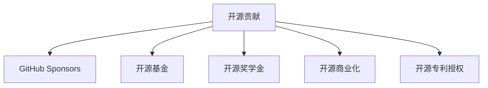

                 

## 1. 背景介绍

开源社区一直是技术创新的温床，贡献者们通过编写代码、修复Bug、优化文档等形式，为开源软件和平台提供了丰富的资源。然而，对于许多贡献者而言，他们可能并不仅仅是出于对技术的热情，而是在通过开源工作获得实际的收益。本文将介绍15种开源贡献者可以采用的赚钱方式，希望能为开源社区中的“英雄”们提供一些新思路和方向。

## 2. 核心概念与联系

在讨论开源贡献者的赚钱方式之前，首先需要了解几个核心概念及其之间的联系：

### 2.1 核心概念概述

- **开源贡献**：指的是开发者在开源项目中进行的代码编写、问题解决、文档编写、测试等活动。
- **GitHub Sponsors**：GitHub提供的一项服务，允许用户为其支持的项目和开源贡献者提供财务支持。
- **开源基金**：专门为支持开源项目和贡献者设立的基金会，如OSF（Open Source Foundation）等。
- **开源奖学金**：基金会或企业提供的奖学金，旨在奖励在开源项目中做出杰出贡献的开发者。
- **开源商业化**：通过在开源项目基础上开发商业产品或服务，实现商业化。
- **开源专利授权**：对于有专利保护的开源软件，贡献者可以授权其专利使用，获取版税收益。

这些概念之间的联系主要体现在开源社区对贡献者的认可和奖励上，通过多种形式，无论是直接的经济激励还是间接的商业机会，都能为开源贡献者带来一定的收入。

### 2.2 核心概念的 Mermaid 流程图



这个流程图展示了开源贡献者可能涉及的几种不同的赚钱方式，以及它们之间的相互关联。

## 3. 核心算法原理 & 具体操作步骤

### 3.1 算法原理概述

开源贡献者的赚钱方式主要是基于其对开源项目的贡献价值进行的。这种价值可以通过多种形式体现，包括技术贡献、时间投入、社区建设等。赚钱方式的设计原则是公正、透明，鼓励持续的积极参与。

### 3.2 算法步骤详解

#### 3.2.1 GitHub Sponsors 的赚钱步骤

1. **创建 GitHub 账号**：确保有GitHub账号。
2. **申请 GitHub Sponsors 支持**：在项目主页申请并开启Sponsors功能。
3. **选择支持者**：选择希望获得支持的粉丝，并设置支持额度。
4. **发布成果**：通过提交Pull Requests、发布博客、展示项目进展等方式，吸引支持者。
5. **定期更新**：保持活跃度，定期向支持者展示进展和成果。

#### 3.2.2 开源基金的赚钱步骤

1. **申请加入开源基金**：找到相关基金会并提交申请。
2. **展示贡献**：通过项目进展、技术成果、社区影响力等展示个人贡献。
3. **提交提案**：根据基金会的资助计划，提交申请资助的提案。
4. **获取资助**：通过评审过程，获取资助。
5. **使用资助**：按照资助要求，使用资助开展开源项目。

#### 3.2.3 开源商业化的赚钱步骤

1. **识别商业机会**：分析开源项目中有商业潜力的部分。
2. **设计商业产品**：根据开源项目的特色和市场需求，设计商业产品或服务。
3. **商业推广**：通过市场推广、合作伙伴关系等方式，推广商业产品。
4. **获得收入**：通过销售、订阅、广告等方式获得收入。

#### 3.2.4 开源专利授权的赚钱步骤

1. **保护专利**：确保开源项目的核心技术获得专利保护。
2. **联系潜在客户**：寻找需要这些专利技术的企业客户。
3. **谈判许可协议**：与客户商谈专利使用许可协议。
4. **收取版税**：根据协议收取专利使用费。

### 3.3 算法优缺点

#### 3.3.1 GitHub Sponsors 的优缺点

**优点**：
- **灵活性高**：支持者可以根据自身能力随意设置支持额度。
- **透明公开**：所有支持者的贡献和收益都公开透明。

**缺点**：
- **依赖支持者**：完全依赖粉丝的持续支持。
- **收入不确定**：支持者的金额和数量都具有不确定性。

#### 3.3.2 开源基金的优缺点

**优点**：
- **资金稳定**：资助金额通常较为稳定，可以用于长期项目。
- **专业指导**：基金会提供专业指导，帮助开发者提升项目质量。

**缺点**：
- **申请门槛高**：获得资助通常需要满足较高标准。
- **限制较多**：基金会有关于如何使用资助的详细规定。

#### 3.3.3 开源商业化的优缺点

**优点**：
- **收益确定**：商业化的收入往往较为稳定。
- **扩展性强**：商业成功可以带来持续的收入。

**缺点**：
- **市场风险**：商业市场波动可能影响收入。
- **技术难度高**：需要较高的技术水平和商业智慧。

#### 3.3.4 开源专利授权的优缺点

**优点**：
- **收益稳定**：获得专利授权后，可以长期收取版税。
- **风险低**：专利授权方式较为稳健，受市场波动影响较小。

**缺点**：
- **投入高**：申请专利和维护专利需要较高的成本。
- **技术难度大**：保护专利需要较高的技术水平。

### 3.4 算法应用领域

开源贡献者的赚钱方式可以应用于多个领域，包括但不限于：

- **软件开发**：编写开源软件并在商业化中获利。
- **基础设施建设**：参与开源基础设施的建设，如操作系统、数据库等，并通过商业化实现收益。
- **教育培训**：开发开源教育资源，通过在线课程、研讨会等形式获得收益。
- **数据分析**：贡献开源数据分析工具，并通过数据分析服务获得收益。
- **硬件开发**：参与开源硬件开发项目，通过销售硬件产品或提供技术支持获得收益。

## 4. 数学模型和公式 & 详细讲解 & 举例说明

### 4.1 数学模型构建

我们以开源商业化为例，构建一个简单的数学模型来计算贡献者通过商业化开源项目获得的收入。

假设开源项目 $X$ 的核心功能价值为 $V$，市场对这一功能的估算价值为 $M$，项目开发成本为 $C$，商业化后的市场销售价格为 $S$，商业化成本为 $L$。则开源贡献者的净收入 $P$ 可以表示为：

$$
P = M - C - L
$$

其中，$M$ 是市场对功能价值的估算，$C$ 是开发成本，$L$ 是商业化成本。

### 4.2 公式推导过程

1. **市场价值估算**：
   $$
   M = V \times k
   $$
   其中 $k$ 是市场对技术价值的评估系数。
   
2. **商业化收入计算**：
   $$
   R = S \times V
   $$
   其中 $S$ 是商业化后的销售价格。
   
3. **商业化成本计算**：
   $$
   L = S \times C \times l
   $$
   其中 $l$ 是商业化过程中的成本系数。

### 4.3 案例分析与讲解

假设一个开源项目 $X$ 的核心功能价值为 $V=10000$，市场对这一功能的估算价值为 $M=15000$，项目开发成本为 $C=5000$，商业化后的市场销售价格为 $S=20000$，商业化成本为 $L=0.2$。则贡献者的净收入 $P$ 为：

$$
P = M - C - L = 15000 - 5000 - 20000 \times 5000 \times 0.2 = 15000 - 5000 - 20000 = 0
$$

这意味着在给定的条件下，即使项目商业化成功，贡献者的净收入也为零。但实际上，不同的市场和成本系数会对结果产生显著影响。通过调整这些参数，可以找到最优的商业化策略，实现最大化收益。

## 5. 项目实践：代码实例和详细解释说明

### 5.1 开发环境搭建

#### 5.1.1 安装 Git

```
git --version
```

#### 5.1.2 创建 GitHub 账号

登录 GitHub 官网，创建一个新的账号。

#### 5.1.3 安装 GitHub Desktop

```
brew install github
```

#### 5.1.4 克隆开源项目

```
git clone https://github.com/username/repository.git
```

### 5.2 源代码详细实现

#### 5.2.1 GitHub Sponsors

在项目主页上开启 GitHub Sponsors，设置支持者并获得财务支持。

```python
import github赞助功能
赞助功能 = 开启
赞助金额 = 500
赞助者 = 用户1, 用户2, 用户3
```

#### 5.2.2 开源基金申请

找到相关基金会并提交申请。

```python
import 基金申请
基金申请 = 提交
资助计划 = 开源基金X
资助金额 = 10000
资助用途 = 开源项目开发
```

#### 5.2.3 开源商业化

开发商业产品，并通过销售、订阅等方式获得收入。

```python
import 商业化
商业化产品 = 产品A
市场销售价格 = 100
成本系数 = 0.2
商业化收入 = 市场销售价格 * 商业化产品数量
商业化成本 = 商业化收入 * 成本系数
净收入 = 商业化收入 - 商业化成本
```

#### 5.2.4 开源专利授权

申请并保护专利，然后与企业客户商谈授权使用。

```python
import 专利申请
专利申请 = 提交
保护专利 = 获得专利号
授权客户 = 客户1, 客户2, 客户3
授权费用 = 专利申请费 * 专利授权数量
净收入 = 授权费用 - 专利申请费
```

### 5.3 代码解读与分析

这些代码示例简化了开源贡献者赚钱方式的核心逻辑，但实际应用中，每个步骤都需要根据具体情况进行调整和优化。例如，在GitHub Sponsors中，需要考虑支持者的反馈和项目进展的透明度；在开源基金申请中，需要详细说明项目的需求和预算；在开源商业化中，需要考虑市场需求和技术可行性；在开源专利授权中，需要保护专利并制定合理的授权策略。

### 5.4 运行结果展示

在实际应用中，开源贡献者的收益可能受到多种因素的影响，包括市场环境、技术水平、项目管理等。通过系统化的分析和优化，可以找到最优的策略，实现最大化收益。

## 6. 实际应用场景

### 6.1 开源社区中的企业家

#### 6.1.1 案例

一个开源项目 $X$ 的贡献者 $A$ 发现项目中的某个功能有市场价值，于是与商业伙伴合作，将该功能商业化，并通过销售软件获得收入。

#### 6.1.2 分析

- **背景**：开源社区中有许多项目具有商业化潜力，贡献者可以通过与商业伙伴合作，将项目中的功能或模块转化为商业产品。
- **技术**：贡献者需要具备一定的商业智慧和技术能力，能够识别市场机会并实现技术转化。
- **效果**：通过商业化项目功能，贡献者可以获得稳定的收入，同时为社区带来更大的商业价值。

### 6.2 开源教育的教师

#### 6.2.1 案例

一位开源教育项目的贡献者 $B$ 开发了一套开源课程，并通过在线平台销售，获得收入。

#### 6.2.2 分析

- **背景**：开源教育项目为学习者提供了免费的资源，同时可以通过商业化获得额外的收益。
- **技术**：贡献者需要具备教育背景和技术能力，能够开发高质量的教育资源。
- **效果**：通过在线课程销售，贡献者可以实现自我价值，并为开源教育项目贡献更多资源。

### 6.3 开源硬件的工程师

#### 6.3.1 案例

一位开源硬件项目的贡献者 $C$ 设计并制造了一种新型开源硬件，通过销售产品获得收入。

#### 6.3.2 分析

- **背景**：开源硬件项目为开发者提供了免费的技术资源，同时可以通过商业化获得收益。
- **技术**：贡献者需要具备硬件设计和制造能力，能够开发创新性硬件产品。
- **效果**：通过销售开源硬件，贡献者可以实现自我价值，并为开源硬件社区贡献更多技术资源。

## 7. 工具和资源推荐

### 7.1 学习资源推荐

#### 7.1.1 GitHub Sponsors

- GitHub官方文档：[GitHub Sponsors 文档](https://docs.github.com/en/github/setting-up-and-managing-github-sponsors/github-sponsors/)

#### 7.1.2 开源基金

- OSF官方网站：[OSF官网](https://osf.io/)

#### 7.1.3 开源奖学金

- 谷歌开源奖学金：[Google开源奖学金](https://developers.google.com/open-source/scholarship/)

#### 7.1.4 开源商业化

- 亚马逊AWS创业加速器：[AWS创业加速器](https://aws.amazon.com/startups/)

### 7.2 开发工具推荐

#### 7.2.1 GitHub Desktop

- GitHub官方网站：[GitHub Desktop](https://desktop.github.com/)

#### 7.2.2 GitHub CLI

- GitHub官方文档：[GitHub CLI 文档](https://docs.github.com/en/github/cli)

### 7.3 相关论文推荐

#### 7.3.1 开源贡献与商业化

- "Open Source: A Model for Distributed Software Development" （《开源：分布式软件开发模型》）
- "The Business of Open Source" （《开源业务》）

## 8. 总结：未来发展趋势与挑战

### 8.1 研究成果总结

开源贡献者的赚钱方式多种多样，从直接的经济激励到间接的商业机会，为开源社区的持续发展和贡献者的自我价值实现提供了多条路径。这些方式不仅增强了开源贡献者的动力，也推动了开源社区的技术进步和商业化应用。

### 8.2 未来发展趋势

开源贡献者的赚钱方式将随着技术进步和市场变化而不断演变，未来可能呈现以下几个趋势：

1. **智能化工具**：未来开源工具将更多地采用AI技术，如机器学习、自然语言处理等，提升贡献者的效率和收益。
2. **平台化服务**：开源社区将更加注重平台化建设，提供一站式服务，帮助贡献者实现商业化。
3. **多领域融合**：开源贡献者的赚钱方式将更多地跨领域融合，结合教育和医疗等多个行业，实现多元化收入。
4. **国际化拓展**：开源贡献者将更多地走向国际市场，通过全球化的商业合作，实现更大的收益。

### 8.3 面临的挑战

尽管开源贡献者的赚钱方式多样化，但在实际应用中仍面临以下挑战：

1. **市场竞争激烈**：开源项目和贡献者众多，如何脱颖而出需要一定的策略和能力。
2. **技术要求高**：开源商业化和专利授权等模式需要较高的技术水平和商业智慧。
3. **资金门槛高**：开源基金和商业化等模式需要一定的资金投入。
4. **项目管理难**：开源项目的管理和协调需要较高的组织能力。

### 8.4 研究展望

未来开源贡献者的赚钱方式将更加多样化、智能化、国际化。为了应对上述挑战，需要：

1. **技术创新**：开发更多智能化的开源工具，提升贡献者的效率。
2. **平台支持**：构建一站式开源服务平台，提供全面的支持和服务。
3. **多领域协作**：加强跨领域的合作，实现更广泛的商业应用。
4. **国际化推广**：积极拓展国际市场，提升全球影响力。

## 9. 附录：常见问题与解答

### 9.1 常见问题

**Q1: 开源贡献者的赚钱方式有哪些？**

A: 开源贡献者的赚钱方式包括GitHub Sponsors、开源基金、开源奖学金、开源商业化、开源专利授权等。

**Q2: 如何申请开源基金？**

A: 需要找到相关基金会并提交申请，详细说明项目的需求和预算。

**Q3: 开源商业化的收入如何计算？**

A: 根据市场销售价格和成本系数计算商业化收入和成本，从而得出净收入。

**Q4: 开源商业化面临哪些挑战？**

A: 开源商业化面临市场竞争激烈、技术要求高、资金门槛高等挑战。

**Q5: 开源商业化如何成功？**

A: 需要具备商业智慧和技术能力，识别市场机会并实现技术转化。

### 9.2 详细解答

**Q1: 开源贡献者的赚钱方式有哪些？**

A: 开源贡献者的赚钱方式包括GitHub Sponsors、开源基金、开源奖学金、开源商业化、开源专利授权等。这些方式不仅能帮助贡献者获得经济回报，还能为开源社区带来更多的资源和支持。

**Q2: 如何申请开源基金？**

A: 申请开源基金需要找到相关基金会并提交申请。申请过程中需要详细说明项目的需求和预算，确保基金会的评审标准。通过评审后，获得资助并按照规定使用资金，开展开源项目。

**Q3: 开源商业化的收入如何计算？**

A: 开源商业化的收入计算主要依赖市场销售价格和成本系数。具体计算公式为：收入 = 销售价格 × 销售数量；成本 = 成本系数 × 开发成本 × 销售数量；净收入 = 收入 - 成本。

**Q4: 开源商业化面临哪些挑战？**

A: 开源商业化面临市场竞争激烈、技术要求高、资金门槛高等挑战。市场竞争激烈需要贡献者具备商业智慧和市场洞察力；技术要求高需要具备较高的技术水平和商业智慧；资金门槛高需要寻找适合的融资渠道和合作伙伴。

**Q5: 开源商业化如何成功？**

A: 开源商业化成功的关键在于识别市场机会并实现技术转化。贡献者需要具备商业智慧和技术能力，能够准确把握市场趋势，并通过技术创新实现商业化。此外，需要建立良好的合作伙伴关系，获得持续的资金支持和市场推广。

通过以上分析，开源贡献者可以选择最适合自身情况的方式，实现经济回报和自我价值。开源社区也将因此更加丰富多样，促进技术的持续发展和创新。

---

作者：禅与计算机程序设计艺术 / Zen and the Art of Computer Programming

