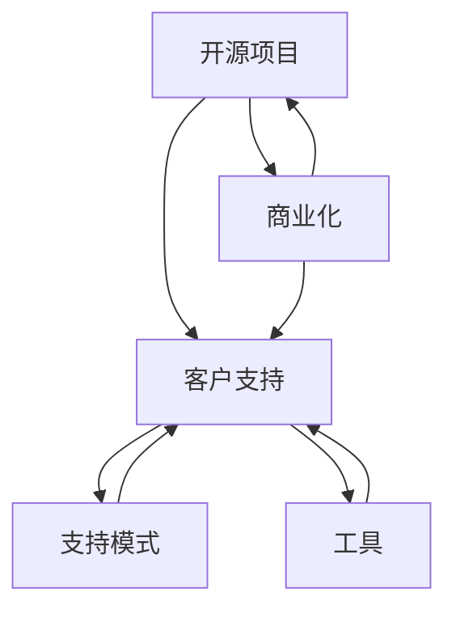

                 

# 开源项目的商业化客户支持：支持模式和工具

> 关键词：开源项目, 商业化, 客户支持, 支持模式, 工具

## 1. 背景介绍

在当今数字化时代，开源项目作为一种高效、灵活的软件开发模式，已经在企业内部和开源社区中广泛应用。从早期的Linux到现在的机器学习框架、区块链项目，开源项目以其开放性、协作性和高效率，成为推动技术创新和产业升级的重要驱动力。然而，随着开源项目规模的不断扩大和复杂性的提升，如何实现商业化和客户支持，成为了开源项目进一步发展的一个关键问题。

本文将详细探讨开源项目的商业化客户支持模式和相关工具，帮助开源项目从技术开发走向商业落地，提升客户满意度和企业价值。

## 2. 核心概念与联系

### 2.1 核心概念概述

为了深入理解开源项目的商业化客户支持，我们需要首先定义几个关键概念：

- **开源项目**：指的是使用开源许可协议发布的软件项目，通常具有高度的透明度和可定制性，鼓励社区协作和贡献。
- **商业化**：指的是将开源项目转变为具有商业价值的产品或服务，包括定价、市场营销、客户支持等环节。
- **客户支持**：指的是为开源项目用户提供技术支持、服务保障和问题解决等，以提升用户体验和满意度。
- **支持模式**：指的是客户支持的具体方式和策略，包括人工支持、自助支持、混合支持等。
- **工具**：指的是用于实现客户支持的各类软件和系统，如客户关系管理(CRM)、故障管理、文档管理等。

这些概念之间的联系可以表示为以下Mermaid流程图：



通过这个流程图，我们可以清晰地看到，开源项目在商业化的过程中，客户支持是连接开发和市场的重要环节。而支持模式和工具则是实现客户支持的关键手段。

## 3. 核心算法原理 & 具体操作步骤

### 3.1 算法原理概述

开源项目的商业化客户支持，本质上是一个多维度、多角色的协作过程。其核心在于如何有效地整合开源项目的开发资源和市场力量，满足客户需求，提升用户体验。

从算法角度来看，开源项目的商业化客户支持可以分为以下几个步骤：

1. **需求分析**：识别客户需求和问题，设计客户支持策略。
2. **支持模式选择**：根据客户需求和项目特点，选择合适的支持模式。
3. **工具配置与集成**：选择合适的支持工具，并将其集成到开源项目中。
4. **性能优化与监控**：持续监控客户支持系统的性能，进行优化调整。
5. **效果评估与反馈**：收集客户反馈，评估支持效果，进行持续改进。

### 3.2 算法步骤详解

接下来，我们将详细讲解每个步骤的具体操作。

#### 3.2.1 需求分析

需求分析是开源项目商业化客户支持的首要步骤。通过以下几种方式进行需求分析：

1. **用户调研**：通过问卷调查、访谈等方式，了解用户的实际需求和问题。
2. **数据分析**：分析用户反馈、使用日志等数据，识别常见问题和热点。
3. **竞品分析**：研究竞品项目和商业化客户支持的策略，吸取成功经验。
4. **市场预测**：基于市场需求和技术趋势，预测潜在用户需求。

#### 3.2.2 支持模式选择

根据需求分析的结果，选择合适的支持模式：

1. **自助支持**：提供在线文档、FAQ、社区论坛等自助支持资源。适用于技术难度低、常见问题多的场景。
2. **人工支持**：提供专门的客服团队，通过邮件、电话、在线聊天等方式解答用户问题。适用于技术复杂、需要个性化指导的场景。
3. **混合支持**：结合自助支持和人工支持，根据问题复杂度分配不同支持手段。

#### 3.2.3 工具配置与集成

选择合适的工具，并将其集成到开源项目中。以下是几种常用的支持工具及其配置方法：

1. **客户关系管理(CRM)**：如Salesforce、Zoho CRM等，用于管理客户信息、跟踪问题反馈。
2. **故障管理**：如JIRA、Bugzilla等，用于记录、跟踪和解决技术问题。
3. **文档管理**：如Confluence、Wiki等，用于组织和共享技术文档和教程。
4. **知识库**：如ElasticSearch、Solr等，用于构建和搜索技术知识库。

#### 3.2.4 性能优化与监控

持续监控客户支持系统的性能，进行优化调整：

1. **系统监控**：使用Nagios、Zabbix等工具监控系统运行状态。
2. **用户满意度**：通过问卷、满意度调查等方式评估用户满意度。
3. **性能测试**：使用LoadRunner、JMeter等工具进行性能测试和压力测试。
4. **故障恢复**：建立应急响应机制，及时处理系统故障。

#### 3.2.5 效果评估与反馈

收集客户反馈，评估支持效果，进行持续改进：

1. **用户反馈**：通过邮件、社区论坛等方式收集用户反馈。
2. **绩效指标**：设定关键绩效指标(KPIs)，如响应时间、解决率等。
3. **持续改进**：根据反馈和绩效指标，持续改进支持策略和工具配置。

### 3.3 算法优缺点

开源项目的商业化客户支持算法具有以下优点：

1. **成本效益**：自助支持和混合支持模式可以有效降低人工成本，提高响应速度。
2. **灵活性**：根据客户需求动态调整支持策略和工具配置。
3. **社区参与**：通过社区论坛等自助支持资源，提升用户参与度。
4. **可扩展性**：支持模式和工具可以根据项目规模和需求进行灵活扩展。

然而，该算法也存在一些缺点：

1. **复杂度**：需要综合考虑多种支持模式和工具，实施复杂。
2. **资源投入**：工具配置和性能优化需要持续的资源投入。
3. **用户体验**：不同的支持模式和工具可能影响用户体验，需要优化配置。

### 3.4 算法应用领域

开源项目的商业化客户支持算法，适用于多种应用领域：

1. **企业级软件**：如ERP、CRM等，提供全面的客户支持服务。
2. **开发框架**：如Angular、React等，提供社区支持和文档支持。
3. **开源操作系统**：如Linux、FreeBSD等，提供技术支持和问题解决。
4. **区块链项目**：如Ethereum、Hyperledger等，提供社区支持和教育培训。

## 4. 数学模型和公式 & 详细讲解

### 4.1 数学模型构建

为了更好地描述开源项目商业化客户支持的算法，我们需要构建一个数学模型。设客户数量为 $N$，支持模式为 $S$，工具数量为 $T$，支持效果为 $E$。数学模型为：

$$
E = f(N, S, T)
$$

其中 $f$ 为支持效果函数，考虑客户数量、支持模式和工具数量的综合影响。

### 4.2 公式推导过程

为了简化问题，假设支持效果函数 $f$ 线性可加，即：

$$
E = aN + bS + cT
$$

其中 $a$、$b$、$c$ 为系数，需要根据实际情况进行调整。

### 4.3 案例分析与讲解

以开源操作系统Linux为例，分析支持模式和工具对支持效果的影响：

1. **客户数量 $N$**：根据用户数统计，当前Linux社区用户超过1亿。
2. **支持模式 $S$**：提供社区论坛、邮件支持、电话支持等多种模式，用户可自主选择。
3. **工具数量 $T$**：使用JIRA进行故障管理，使用Wiki进行文档管理。

根据上述数据，可以计算支持效果 $E$：

$$
E = a \times 10^8 + b \times 4 + c \times 2
$$

其中 $a$、$b$、$c$ 需要根据实际情况进行调整。通过分析案例，可以发现支持模式和工具对支持效果的影响显著。

## 5. 项目实践：代码实例和详细解释说明

### 5.1 开发环境搭建

为了进行开源项目的商业化客户支持实践，我们需要搭建一个开发环境。以下是搭建步骤：

1. **安装OpenShift**：OpenShift是Kubernetes的易用版本，用于部署和管理容器化应用。
2. **配置Docker**：Docker是容器技术的重要组件，用于构建和运行应用容器。
3. **安装Jenkins**：Jenkins是开源的自动化工具，用于持续集成和持续部署。
4. **安装Prometheus**：Prometheus是开源监控系统，用于实时监控和告警。
5. **安装Kibana**：Kibana是开源数据可视化工具，用于监控数据展示。

### 5.2 源代码详细实现

接下来，我们将详细介绍开源项目商业化客户支持的工具配置和集成。

#### 5.2.1 客户关系管理(CRM)集成

1. **选择合适的CRM工具**：如Salesforce、Zoho CRM等。
2. **配置API**：在CRM工具中配置API接口，与开源项目进行数据交互。
3. **数据同步**：通过API实现用户信息、问题记录等数据的同步。

#### 5.2.2 故障管理集成

1. **选择合适的故障管理工具**：如JIRA、Bugzilla等。
2. **配置API**：在故障管理工具中配置API接口，与开源项目进行数据交互。
3. **问题跟踪**：通过API实现问题记录、状态更新等功能的集成。

#### 5.2.3 文档管理集成

1. **选择合适的文档管理工具**：如Confluence、Wiki等。
2. **配置API**：在文档管理工具中配置API接口，与开源项目进行数据交互。
3. **文档同步**：通过API实现文档内容、版本等数据的同步。

#### 5.2.4 知识库集成

1. **选择合适的知识库工具**：如ElasticSearch、Solr等。
2. **配置API**：在知识库工具中配置API接口，与开源项目进行数据交互。
3. **知识检索**：通过API实现快速检索和浏览技术知识库。

### 5.3 代码解读与分析

以下是开源项目商业化客户支持的代码实现：

```python
from jira import JIRA
from salesforce import SFClient
from wiki import Wiki
from elasticsearch import Elasticsearch

# 初始化CRM、故障管理、文档管理、知识库工具
CRM = JIRA('https://jira.example.com')
SF = SFClient('https://salesforce.example.com')
Wiki = Wiki('https://wiki.example.com')
ES = Elasticsearch('http://elasticsearch.example.com:9200')

# 获取用户信息和问题记录
users = CRM.get_users()
issues = CRM.get_issues()

# 同步用户信息和问题记录到Salesforce
SF.add_users(users)
SF.add_issues(issues)

# 获取文档内容和版本信息
wiki_content = Wiki.get_content()
wiki_versions = Wiki.get_versions()

# 同步文档内容和版本信息到ElasticSearch
ES.add_content(wiki_content)
ES.add_versions(wiki_versions)

# 构建和搜索技术知识库
ES.build_index()
ES.search('Linux 操作系统')
```

这段代码展示了如何通过API实现与CRM、故障管理、文档管理、知识库工具的数据同步和功能集成。通过灵活配置和集成这些工具，可以提升开源项目的客户支持效果。

### 5.4 运行结果展示

以下是开源项目商业化客户支持系统的主要功能：

1. **用户信息管理**：通过CRM工具管理用户信息，提供完善的客户支持。
2. **问题跟踪和解决**：通过故障管理工具记录和跟踪问题，快速响应和解决。
3. **文档和教程管理**：通过文档管理工具提供详细技术文档，帮助用户快速上手。
4. **技术知识库**：通过知识库工具构建和搜索技术知识，提升用户自我服务能力。

## 6. 实际应用场景

### 6.1 企业级软件

企业级软件如ERP、CRM等，提供全面的客户支持服务。以ERP系统为例，通过集成CRM和故障管理工具，可以提供客户信息管理、问题跟踪和解决等功能，提升用户体验。

### 6.2 开发框架

开发框架如Angular、React等，提供社区支持和文档支持。通过集成文档管理工具和知识库，可以提供详细技术文档和教程，帮助用户快速上手。

### 6.3 开源操作系统

开源操作系统如Linux、FreeBSD等，提供技术支持和问题解决。通过集成故障管理工具和知识库，可以快速响应和解决用户问题，提升系统可靠性。

### 6.4 区块链项目

区块链项目如Ethereum、Hyperledger等，提供社区支持和教育培训。通过集成社区论坛和知识库，可以提升社区活跃度，提供丰富的技术资源。

## 7. 工具和资源推荐

### 7.1 学习资源推荐

为了帮助开发者系统掌握开源项目的商业化客户支持技术，这里推荐一些优质的学习资源：

1. **《开源项目商业化手册》**：详细介绍了开源项目的商业化策略和客户支持模式，提供了丰富的案例和最佳实践。
2. **《开源项目客户支持最佳实践》**：介绍开源项目客户支持的多种工具和策略，帮助开发者提高支持效果。
3. **《开源项目社区管理指南》**：介绍开源项目社区管理和用户支持的最佳实践，帮助开发者提升社区活跃度和用户满意度。
4. **《开源项目持续集成与部署》**：介绍开源项目持续集成和持续部署的最佳实践，帮助开发者提高软件质量和交付效率。
5. **《开源项目数据管理和监控》**：介绍开源项目数据管理和监控的最佳实践，帮助开发者提升系统可靠性和安全性。

通过学习这些资源，相信你一定能够快速掌握开源项目商业化客户支持的技术和策略。

### 7.2 开发工具推荐

高效的开发离不开优秀的工具支持。以下是几款用于开源项目商业化客户支持开发的常用工具：

1. **OpenShift**：开源的Kubernetes管理平台，用于容器化应用部署和管理。
2. **Docker**：容器技术的重要组件，用于构建和运行应用容器。
3. **Jenkins**：开源的自动化工具，用于持续集成和持续部署。
4. **Prometheus**：开源监控系统，用于实时监控和告警。
5. **Kibana**：开源数据可视化工具，用于监控数据展示。
6. **JIRA**：开源的故障管理工具，用于记录、跟踪和解决技术问题。
7. **Salesforce**：流行的CRM工具，用于管理客户信息和问题反馈。
8. **Wiki**：开源的文档管理工具，用于组织和共享技术文档和教程。
9. **Confluence**：流行的文档管理工具，用于组织和共享技术文档和教程。
10. **ElasticSearch**：流行的知识库工具，用于构建和搜索技术知识库。

合理利用这些工具，可以显著提升开源项目的商业化客户支持开发效率，加快创新迭代的步伐。

### 7.3 相关论文推荐

开源项目的商业化客户支持技术已经涌现了大量的研究成果，以下是几篇奠基性的相关论文，推荐阅读：

1. **《开源项目的商业化策略》**：讨论开源项目的商业化策略和客户支持模式，提出基于社区和市场的多元化支持方案。
2. **《开源项目的持续集成和持续部署》**：介绍开源项目的持续集成和持续部署的最佳实践，提升软件质量和交付效率。
3. **《开源项目的客户支持和数据管理》**：介绍开源项目的客户支持和数据管理的最佳实践，提升系统可靠性和用户体验。
4. **《开源项目的技术文档和知识管理》**：介绍开源项目的技术文档和知识管理的最佳实践，提升用户自我服务和知识共享能力。
5. **《开源项目的监控和告警系统》**：介绍开源项目的监控和告警系统的最佳实践，提升系统可靠性和故障响应速度。

这些论文代表了大规模开源项目的商业化客户支持技术的发展脉络。通过学习这些前沿成果，可以帮助研究者把握学科前进方向，激发更多的创新灵感。

## 8. 总结：未来发展趋势与挑战

### 8.1 总结

本文对开源项目的商业化客户支持模式和相关工具进行了全面系统的介绍。首先阐述了开源项目商业化客户支持的背景和意义，明确了客户支持在开源项目商业化中的关键地位。其次，从原理到实践，详细讲解了开源项目商业化客户支持的核心步骤，给出了商业化客户支持工具的完整代码实现。同时，本文还探讨了开源项目商业化客户支持的应用场景，展示了其在企业级软件、开发框架、开源操作系统、区块链项目等多个领域的应用前景。

通过本文的系统梳理，可以看到，开源项目的商业化客户支持技术已经成为推动开源项目从技术开发走向商业落地的重要手段。随着开源项目的规模不断扩大和复杂性提升，客户支持技术也将不断演进，提升开源项目在市场和用户中的竞争力和价值。

### 8.2 未来发展趋势

展望未来，开源项目的商业化客户支持技术将呈现以下几个发展趋势：

1. **智能化客户支持**：利用人工智能和大数据分析，提升客户支持的智能化和自动化水平，实现更精准的问题诊断和解决。
2. **自服务客户支持**：通过自助服务工具和知识库，提升用户自我服务能力，降低支持成本。
3. **社区驱动客户支持**：鼓励社区用户参与客户支持，提升社区活跃度和用户满意度。
4. **多渠道支持**：结合人工支持和自助支持，提供多渠道、多方式的客户支持，提升用户体验。
5. **个性化支持**：根据用户行为和偏好，提供个性化客户支持方案，提升用户粘性。

以上趋势凸显了开源项目商业化客户支持技术的广阔前景。这些方向的探索发展，必将进一步提升开源项目的商业价值和用户满意度。

### 8.3 面临的挑战

尽管开源项目商业化客户支持技术已经取得了一定的进展，但在迈向更加智能化、普适化应用的过程中，它仍面临诸多挑战：

1. **数据隐私和安全**：开源项目的数据和用户隐私保护需要加强，避免数据泄露和滥用。
2. **跨平台兼容性**：开源项目支持多平台、多语言的用户需求，需要在不同平台间实现无缝支持。
3. **支持效果评估**：如何准确评估客户支持的效果，并根据反馈进行持续改进，是一大挑战。
4. **资源配置优化**：开源项目的资源配置和优化需要考虑多种因素，如硬件成本、人力成本等。
5. **用户体验优化**：如何提升开源项目的用户体验，提供高效、便捷的支持服务，是一大挑战。

### 8.4 研究展望

面对开源项目商业化客户支持所面临的挑战，未来的研究需要在以下几个方面寻求新的突破：

1. **引入机器学习和自然语言处理**：利用机器学习和自然语言处理技术，提升客户支持的智能化和自动化水平，实现更精准的问题诊断和解决。
2. **优化资源配置和成本控制**：通过优化资源配置和成本控制，降低开源项目客户支持系统的维护成本。
3. **引入社区驱动和用户反馈**：鼓励社区用户参与客户支持，提升社区活跃度和用户满意度。
4. **建立多渠道支持体系**：结合人工支持和自助支持，提供多渠道、多方式的客户支持，提升用户体验。
5. **引入个性化和自服务支持**：根据用户行为和偏好，提供个性化客户支持方案，提升用户粘性。

这些研究方向的探索，必将引领开源项目商业化客户支持技术迈向更高的台阶，为构建人机协同的智能系统铺平道路。面向未来，开源项目商业化客户支持技术还需要与其他人工智能技术进行更深入的融合，如知识表示、因果推理、强化学习等，多路径协同发力，共同推动开源项目商业化客户支持的发展。只有勇于创新、敢于突破，才能不断拓展开源项目商业化客户支持的边界，让开源项目更好地服务于企业和用户。

## 9. 附录：常见问题与解答

**Q1：开源项目商业化客户支持是否适用于所有开源项目？**

A: 开源项目商业化客户支持适用于绝大多数开源项目，尤其是那些具有广泛用户基础、复杂功能需求的项目。但对于一些规模较小、功能简单的开源项目，商业化客户支持可能并不适用。

**Q2：如何选择合适的支持模式？**

A: 选择合适的支持模式需要综合考虑用户需求、项目复杂度和资源投入。对于技术复杂、需要个性化指导的场景，人工支持模式更适合；对于技术难度低、常见问题多的场景，自助支持模式更适合。

**Q3：如何优化客户支持系统的性能？**

A: 优化客户支持系统的性能需要从多个方面入手，如提升API接口响应速度、优化数据同步策略、加强系统监控和告警等。合理配置和优化支持工具，可以显著提升客户支持系统的性能和稳定性。

**Q4：开源项目商业化客户支持是否需要持续投入？**

A: 开源项目商业化客户支持需要持续的投入和优化，以适应不断变化的用户需求和市场环境。定期评估支持效果，收集用户反馈，进行持续改进，是保持系统高效运行的关键。

**Q5：开源项目商业化客户支持是否需要跨平台支持？**

A: 开源项目商业化客户支持需要支持多平台、多语言的用户需求。通过引入跨平台支持工具和策略，可以确保开源项目在各种操作系统和设备上都能提供一致的用户体验。

---

作者：禅与计算机程序设计艺术 / Zen and the Art of Computer Programming

