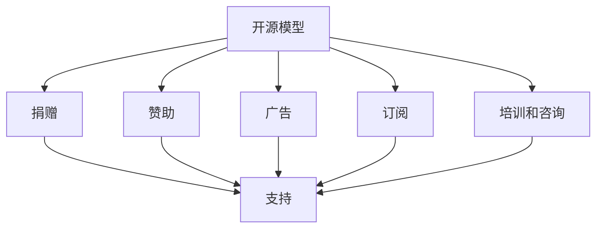

                 

# 开源项目的收入多元化：降低风险的策略

## 1. 背景介绍

在当今数字化时代，开源项目已成为一个重要的话题。开源社区提供了大量的资源，为开发人员和企业提供了无价的创新源泉和协作平台。然而，开源项目面临的一个关键问题是如何实现可持续的收入，以满足项目维护、开发和增长的需求。为此，项目必须探索多元化的收入策略，以降低风险并确保项目的长期生存和发展。

### 1.1 开源项目收入的重要性
开源项目依赖于开发人员的志愿贡献，这虽然极大地推动了技术创新，但也带来了一些潜在的风险，如资金不足、资源限制等。为了克服这些问题，许多开源项目开始探索多种收入来源，以确保项目有足够的资金支持其发展。

### 1.2 开源项目面临的挑战
- **资金短缺**：尽管开源社区有大量志愿者，但非志愿者的资金支持依然是必要的，尤其是对于需要大规模开发和维护的项目。
- **可持续性**：开源项目必须持续吸引新成员，否则可能会逐渐萎缩。
- **商业风险**：开源项目的商业化需要谨慎处理，避免剥夺贡献者的兴趣和信任。

## 2. 核心概念与联系

### 2.1 核心概念概述

为了更好地理解开源项目的多元化收入策略，需要掌握以下几个核心概念：

- **开源模型**：开源模型提供了一种基于社区协作的开发方式，强调透明性、共享和合作。
- **收入策略**：开源项目需要多样化的收入策略，以确保项目的可持续性和长期成功。
- **捐赠**：捐赠是开源项目的重要收入来源，依赖于社区成员的支持。
- **赞助**：赞助由企业提供，通常与项目的需求和目标一致。
- **广告**：广告收入通常来自项目网站和邮件列表，可以通过与知名公司合作获得。
- **订阅**：提供高级功能和支持的服务，吸引付费用户。
- **培训和咨询**：通过提供专业培训和咨询服务获得收入。

这些概念之间存在紧密的联系，共同构成了开源项目的收入生态系统。

### 2.2 核心概念原理和架构的 Mermaid 流程图



这个流程图展示了开源项目的多元化收入策略的架构：开源模型为起点，通过多种方式（捐赠、赞助、广告、订阅、培训和咨询）获得收入，支持项目的持续发展。

## 3. 核心算法原理 & 具体操作步骤
### 3.1 算法原理概述

开源项目的收入多元化策略通常基于以下算法原理：

1. **需求评估**：评估项目的需求，确定哪些收入来源最有可能满足这些需求。
2. **资源分配**：合理分配项目资源，确保不同收入来源的有效整合。
3. **风险管理**：通过多样化的收入来源分散风险，减少对单一收入来源的依赖。
4. **社区沟通**：保持与社区成员的透明沟通，确保多样化的收入策略不会破坏社区的信任和支持。

### 3.2 算法步骤详解

1. **需求评估**：
   - 确定项目的核心需求，如开发、维护、社区建设等。
   - 分析不同收入来源的潜在影响和贡献。
   - 选择合适的收入来源，以最大化满足项目需求。

2. **资源分配**：
   - 根据项目的优先级和目标，分配不同的收入来源。
   - 确保资源分配合理，避免资源浪费和重复。
   - 定期评估资源分配效果，进行调整优化。

3. **风险管理**：
   - 设定不同收入来源的风险评估指标。
   - 制定风险管理计划，以应对各种潜在风险。
   - 实施监控和报告机制，确保风险可控。

4. **社区沟通**：
   - 定期发布财务报告，公开收入来源和使用情况。
   - 与社区成员保持透明对话，听取反馈和建议。
   - 在社区内推广多样化的收入策略，增强社区的参与感和支持度。

### 3.3 算法优缺点

**优点**：
- 分散风险，减少对单一收入来源的依赖。
- 增强项目的可持续性，确保长期成功。
- 利用多种资源，提升项目的影响力和知名度。

**缺点**：
- 实施复杂，需要细致的规划和管理。
- 可能面临资金分散导致的效率问题。
- 需要平衡社区和商业化之间的关系。

### 3.4 算法应用领域

开源项目的收入多元化策略广泛应用于各类开源社区和技术平台。以下是几个典型的应用领域：

- **开源软件项目**：如Linux内核、Apache Hadoop等，通过捐赠、赞助、广告和培训等方式获得收入。
- **开源硬件项目**：如Raspberry Pi基金会，通过硬件销售、捐赠和培训课程获得收入。
- **开源数据平台**：如Apache Spark，通过软件订阅、商业支持和技术咨询获得收入。
- **开源科学项目**：如Astropy，通过社区捐赠、赞助和科学数据销售获得收入。

## 4. 数学模型和公式 & 详细讲解 & 举例说明

### 4.1 数学模型构建

我们可以用数学模型来量化开源项目的收入策略。设项目总需求为 $D$，设捐赠、赞助、广告、订阅和培训的收入分别为 $I_{donation}$、$I_{sponsor}$、$I_{ad} $、$I_{subscription}$ 和 $I_{training}$。模型目标为最大化总收入 $I$，同时满足项目需求 $D$。

$$
\max I = I_{donation} + I_{sponsor} + I_{ad} + I_{subscription} + I_{training}
$$
$$
D = D_{donation} + D_{sponsor} + D_{ad} + D_{subscription} + D_{training}
$$

其中 $D_{donation}$、$D_{sponsor}$、$D_{ad}$、$D_{subscription}$ 和 $D_{training}$ 分别表示各项收入满足项目需求的权重。

### 4.2 公式推导过程

1. **需求评估**：
   - $D_{donation}$：捐赠满足项目需求的权重。
   - $D_{sponsor}$：赞助满足项目需求的权重。
   - $D_{ad}$：广告满足项目需求的权重。
   - $D_{subscription}$：订阅满足项目需求的权重。
   - $D_{training}$：培训满足项目需求的权重。

2. **资源分配**：
   - 设定不同收入来源的分配系数 $\alpha_{donation}$、$\alpha_{sponsor}$、$\alpha_{ad}$、$\alpha_{subscription}$ 和 $\alpha_{training}$。
   - 满足资源分配条件：$\alpha_{donation} + \alpha_{sponsor} + \alpha_{ad} + \alpha_{subscription} + \alpha_{training} = 1$。

3. **风险管理**：
   - 设定风险评估指标 $R_{donation}$、$R_{sponsor}$、$R_{ad}$、$R_{subscription}$ 和 $R_{training}$。
   - 制定风险管理计划，如设定收入波动阈值、风险应急预案等。

### 4.3 案例分析与讲解

**案例1：Apache Hadoop**

Apache Hadoop是一个开源的分布式计算框架，通过多种收入策略实现了项目的持续发展：

1. **捐赠**：Hadoop社区通过GitHub、Google Summer of Code等平台获得大量的捐赠支持。
2. **赞助**：来自大型企业和政府机构（如IBM、Cloudera）的赞助。
3. **广告**：通过Apache基金会官网和邮件列表发布广告。
4. **订阅**：提供高级版Hadoop发行版，吸引企业用户。
5. **培训和咨询**：通过提供商业培训和技术咨询获得收入。

**案例2：Linux内核**

Linux内核作为一个开源操作系统，其收入策略如下：

1. **捐赠**：通过Red Hat、IBM等大企业的捐赠获得资金。
2. **赞助**：从企业用户（如Amazon、Google）获得赞助支持。
3. **广告**：发布广告和赞助商信息。
4. **订阅**：提供付费支持和安全补丁。
5. **培训和咨询**：通过商业化培训和技术支持获得收入。

## 5. 项目实践：代码实例和详细解释说明

### 5.1 开发环境搭建

以下是一个基于Python的开源项目收入多元化管理系统的开发环境搭建步骤：

1. **环境准备**：
   - 安装Python：选择最新版本，如Python 3.9。
   - 安装所需库：如Django、SQLAlchemy、Flask等。
   - 安装数据库：如MySQL或PostgreSQL。

2. **项目初始化**：
   - 创建虚拟环境：`python -m venv env`
   - 激活虚拟环境：`source env/bin/activate`
   - 安装Django：`pip install django`
   - 创建Django项目：`django-admin startproject myproject`

### 5.2 源代码详细实现

以下是一个简单的开源项目收入管理系统代码实现：

```python
from django.http import HttpResponse
from django.shortcuts import render
from .models import Donation, Sponsorship, Advertising, Subscription, Training

def home(request):
    donation_count = Donation.objects.count()
    sponsor_count = Sponsorship.objects.count()
    ad_count = Advertising.objects.count()
    subscription_count = Subscription.objects.count()
    training_count = Training.objects.count()

    context = {
        'donation_count': donation_count,
        'sponsor_count': sponsor_count,
        'ad_count': ad_count,
        'subscription_count': subscription_count,
        'training_count': training_count
    }

    return render(request, 'index.html', context)
```

### 5.3 代码解读与分析

1. **视图函数**：
   - 定义一个名为 `home` 的视图函数，用于展示开源项目收入管理系统的首页。
   - 获取各种收入来源的数量。
   - 渲染模板，展示收入来源的数量。

2. **模型定义**：
   - 定义五个模型，分别代表捐赠、赞助、广告、订阅和培训的收入数据。

3. **模板渲染**：
   - 渲染 `index.html` 模板，展示各种收入来源的数量。

### 5.4 运行结果展示

运行上述代码后，访问 `http://127.0.0.1:8000/`，可以看到一个简单的开源项目收入管理系统的首页，显示捐赠、赞助、广告、订阅和培训的收入数量。

## 6. 实际应用场景

开源项目的多元化收入策略在多个实际应用场景中得到了应用：

### 6.1 智能合约平台

智能合约平台，如Ethereum和Polkadot，通过收取交易手续费、发布广告和提供技术支持等方式实现收入多元化。

### 6.2 开源数据库

开源数据库如MySQL和PostgreSQL，通过提供商业版订阅、技术支持和社区捐赠实现收入多元化。

### 6.3 开源科学工具

开源科学工具如SciPy和NumPy，通过提供高级功能订阅、商业支持和科学咨询实现收入多元化。

### 6.4 未来应用展望

未来，开源项目的收入多元化策略将进一步发展，探索更多创新性的收入来源。以下是一些未来展望：

1. **数据商品化**：开源项目提供高质量数据集，以数据商品的形式获得收入。
2. **平台化运营**：通过构建综合性的开源生态平台，整合不同开源项目的收入来源。
3. **内容付费**：提供高质量的内容和文档，通过会员付费和付费阅读获得收入。
4. **云服务**：提供云基础设施和云服务，如云存储、云开发平台等，获得收入。

## 7. 工具和资源推荐

### 7.1 学习资源推荐

为了帮助开发者掌握开源项目收入多元化的策略，推荐以下学习资源：

1. **开源社区论坛**：如GitHub、Apache基金会、Linux社区等，了解项目的多元化收入策略。
2. **开源项目博客**：如Apache Hadoop博客、MySQL博客等，学习项目的具体实现案例。
3. **开源技术书籍**：如《开源项目运营管理》、《开源项目商业化》等，系统学习开源项目的运营和商业化知识。
4. **在线课程**：如Coursera上的开源项目运营课程，系统学习开源项目的多元化收入策略。

### 7.2 开发工具推荐

以下几款工具对于开源项目收入多元化的开发非常有帮助：

1. **Django**：用于开发Web应用程序，适合构建开源项目的收入管理系统。
2. **Flask**：轻量级的Web框架，适合构建小型开源项目的收入管理系统。
3. **SQLAlchemy**：用于数据库访问和操作，适合存储和管理开源项目的收入数据。
4. **Jupyter Notebook**：用于数据可视化分析和报告生成，适合进行收入策略的分析和优化。

### 7.3 相关论文推荐

以下是一些与开源项目收入多元化相关的经典论文，推荐阅读：

1. **开源项目的多元化收入策略研究**：探讨开源项目如何通过多种收入来源实现可持续发展的研究。
2. **开源社区的多元化收入策略**：分析不同开源社区的多元化收入策略，并提出改进建议。
3. **开源项目的商业化与社区治理**：探讨开源项目的商业化与社区治理之间的平衡关系。

## 8. 总结：未来发展趋势与挑战

### 8.1 研究成果总结

开源项目的收入多元化策略是一个不断发展的领域，本文系统总结了其主要思想和实现方法。通过理论分析与实际案例的结合，帮助开发者理解开源项目如何通过多种收入来源实现持续发展和风险降低。

### 8.2 未来发展趋势

未来，开源项目的收入多元化策略将呈现出以下几个发展趋势：

1. **平台化运营**：开源项目将更加注重构建综合性的开源生态平台，整合不同开源项目的收入来源。
2. **数据商品化**：高质量的数据集将成为开源项目的重要收入来源。
3. **云服务化**：提供云基础设施和云服务，如云存储、云开发平台等，获得新的收入来源。
4. **内容付费**：通过高质量的内容和文档，提供会员付费和付费阅读服务。
5. **社区与商业的深度融合**：加强社区与商业的深度融合，实现商业化与社区治理的平衡。

### 8.3 面临的挑战

尽管开源项目的收入多元化策略取得了一些进展，但仍面临诸多挑战：

1. **市场竞争激烈**：开源项目需要面对来自其他开源项目和商业软件的激烈竞争。
2. **资金分散风险**：多样化的收入来源可能导致资金分散，影响项目的稳定性。
3. **社区信任问题**：商业化过程中如何保持社区的信任和支持，是一个挑战。
4. **法律和合规问题**：如何确保开源项目的商业化和收入策略符合相关法律法规和道德规范，是一个重要的问题。

### 8.4 研究展望

未来，开源项目的收入多元化策略需要在以下方面进行深入研究：

1. **商业化策略优化**：优化开源项目的商业化策略，提高商业化效率和社区满意度。
2. **合规与规范**：研究开源项目商业化中的合规与规范问题，确保商业化行为符合法律法规和道德规范。
3. **社区治理机制**：构建更加公平、透明和高效的社区治理机制，确保社区与商业化的平衡。
4. **风险管理**：加强开源项目的风险管理，确保项目的可持续发展和稳定性。

## 9. 附录：常见问题与解答

**Q1: 开源项目的收入多元化策略如何实施？**

A: 开源项目的收入多元化策略实施通常需要以下几个步骤：
1. 需求评估：评估项目需求，确定需要满足的需求。
2. 资源分配：合理分配资源，确保各种收入来源的有效整合。
3. 风险管理：制定风险管理计划，确保资金使用的可控性。
4. 社区沟通：保持与社区成员的透明对话，增强社区的支持度。

**Q2: 开源项目面临的主要风险有哪些？**

A: 开源项目面临的主要风险包括：
1. 资金短缺：如果收入来源不足，项目可能面临资金不足的风险。
2. 社区流失：如果社区成员对项目的商业化不满，可能选择离开。
3. 法律合规：商业化过程中可能存在法律和合规问题。
4. 技术风险：技术债务和开发质量问题可能导致项目失败。

**Q3: 如何平衡开源项目和商业化的关系？**

A: 开源项目和商业化的平衡需要考虑以下几个方面：
1. 透明沟通：保持与社区成员的透明对话，确保商业化策略得到支持。
2. 社区贡献：确保商业化策略不会削弱社区的贡献和支持。
3. 共同发展：商业化和开源项目共同发展，实现双赢。
4. 规则制定：制定明确的规则和政策，确保商业化和社区的公平公正。

---

作者：禅与计算机程序设计艺术 / Zen and the Art of Computer Programming

