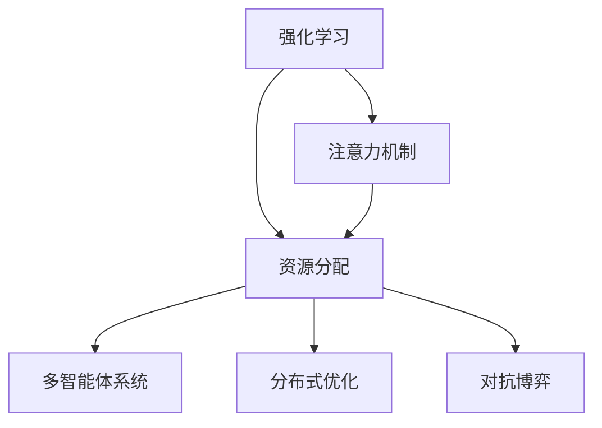

                 

## 1. 背景介绍

### 1.1 问题由来

在当前数字化、智能化的浪潮下，智能系统已经广泛应用于各行各业，从自动驾驶、工业机器人到金融市场预测、医疗诊断等领域，智能系统的价值已经得到充分验证。然而，这些智能系统的核心——强化学习(Reinforcement Learning, RL)——在资源分配问题上的应用仍然面临诸多挑战。资源分配问题广泛存在于多个领域，例如任务调度、带宽分配、网络路由、机器学习模型训练等。在这些场景中，优化目标通常涉及最大化系统性能、最小化成本、提升效率等多重指标，难以通过传统的优化算法直接求解。

强化学习提供了一种基于试错学习的方式来优化资源分配，通过构建智能决策系统，实现自适应调整资源分配策略。在RL框架下，智能体通过与环境的交互，不断调整自身的行为策略，以达到优化资源分配的目标。这一方法已经成功地应用于多个领域，如Google的Gemini负载调度系统、Facebook的资源调度系统等。

### 1.2 问题核心关键点

强化学习在资源分配中的关键在于以下几个方面：

1. **环境建模**：如何准确建模资源分配场景，并设计合适的状态和动作空间。
2. **奖励设计**：如何设置合理的奖励函数，以指导智能体优化资源分配策略。
3. **算法优化**：如何设计高效的算法，在有限的时间、空间内，找到最优的资源分配策略。
4. **模型可扩展性**：如何设计可扩展的强化学习框架，应对大规模、复杂系统的资源分配问题。
5. **性能与效率**：如何平衡智能体的性能和推理效率，确保其在实际应用中的高效运行。

本文聚焦于强化学习在注意力资源分配中的应用，特别是如何在注意力机制中应用强化学习来优化资源分配。

## 2. 核心概念与联系

### 2.1 核心概念概述

为更好地理解强化学习在注意力资源分配中的应用，本节将介绍几个密切相关的核心概念：

- **强化学习**：一种通过智能体与环境交互，通过试错学习不断调整自身策略的机器学习方法。
- **注意力机制(Attention Mechanism)**：一种通过权重分配机制，将输入数据的不同部分加权整合，以提升模型对关键信息的关注度的机制。
- **资源分配**：将有限的资源（如时间、带宽、计算资源等）分配给多个任务或用户，以最大化系统性能或用户满意度。
- **多智能体系统(Multi-Agent System)**：由多个智能体组成的系统，智能体之间通过协作或竞争进行资源分配。
- **分布式优化(Distributed Optimization)**：将资源分配问题拆分为多个子问题，智能体在分布式环境中协同优化资源分配策略。
- **对抗博弈(Opponent Game)**：在资源分配问题中，智能体之间存在利益冲突，需要设计合理的奖励函数，以促进合作或竞争的均衡。

这些核心概念之间的逻辑关系可以通过以下Mermaid流程图来展示：



这个流程图展示了一个基本的强化学习资源分配框架，其中：

1. 强化学习作为核心技术，用于优化资源分配策略。
2. 注意力机制用于处理输入数据，增强模型的关注度。
3. 资源分配是强化学习的优化目标。
4. 多智能体系统和分布式优化增强了资源分配的复杂性和规模性。
5. 对抗博弈引入了竞争和合作的动态变化。

## 3. 核心算法原理 & 具体操作步骤
### 3.1 算法原理概述

强化学习在注意力资源分配中的应用，主要通过智能体与环境（如任务调度环境、网络资源环境等）的交互，学习最优的资源分配策略。在这个过程中，注意力机制被用来增强智能体对关键信息的关注，从而提升资源分配的精度和效率。

假设智能体面对的环境为 $\mathcal{E}$，智能体的策略为 $\pi$，状态为 $s$，动作为 $a$，奖励函数为 $r$，智能体的值为 $v$。在每个时间步 $t$，智能体从当前状态 $s_t$ 选择动作 $a_t$，根据动作和状态得到下一状态 $s_{t+1}$ 和奖励 $r_t$，然后更新智能体的策略 $\pi$ 和值函数 $v$。

注意力机制的核心思想是通过一个权重向量 $\alpha$ 来加权整合输入数据的不同部分。在资源分配问题中，注意力机制可以用来筛选出对当前决策最重要的特征，从而提升模型对关键信息的关注度。

形式化地，假设当前状态 $s_t$ 包含 $n$ 个特征 $x_{1,t}, x_{2,t}, \ldots, x_{n,t}$，智能体通过一个注意力权重 $\alpha$ 对每个特征进行加权，得到加权后的特征 $z_t = \alpha^T x_t$。在资源分配问题中，智能体通过注意力机制对每个任务的重要性进行评分，从而调整资源分配策略。

### 3.2 算法步骤详解

强化学习在注意力资源分配中的应用一般包括以下几个关键步骤：

**Step 1: 环境建模**

- 定义环境 $\mathcal{E}$，包括状态空间 $S$、动作空间 $A$、奖励函数 $r$ 和下一状态转移概率 $p$。
- 设计状态空间 $S$，用于描述系统的当前状态，如任务队列、网络带宽、计算资源等。
- 设计动作空间 $A$，用于描述智能体可以采取的行动，如任务调度策略、带宽分配策略、计算资源分配策略等。
- 设计奖励函数 $r$，用于衡量智能体采取的行动对系统性能的影响，如任务完成时间、网络延迟、计算资源利用率等。
- 设计状态转移概率 $p$，用于描述智能体采取行动后，状态空间如何更新。

**Step 2: 注意力机制设计**

- 设计注意力权重 $\alpha$，用于对输入数据的不同部分进行加权整合，提高模型对关键信息的关注度。
- 在资源分配问题中，注意力权重 $\alpha$ 可以根据任务完成时间、资源利用率等因素动态调整。
- 设计注意力机制的训练方法，通过与环境交互，不断调整注意力权重，优化资源分配策略。

**Step 3: 强化学习算法**

- 选择强化学习算法，如Q-learning、SARSA、Deep Q-learning等。
- 设计状态值函数 $v$，用于估计当前状态的平均收益。
- 设计动作值函数 $Q$，用于估计当前状态-动作对的平均收益。
- 通过与环境交互，智能体不断调整策略，优化资源分配。

**Step 4: 策略评估与优化**

- 定期在验证集上评估智能体的性能，检查其是否收敛。
- 通过策略优化算法，如策略梯度算法，不断调整智能体的策略。
- 结合注意力机制，智能体可以更灵活地调整策略，优化资源分配。

**Step 5: 实际部署**

- 将训练好的智能体部署到实际系统中，进行资源分配。
- 监控系统的性能指标，如任务完成时间、资源利用率等，评估智能体的效果。
- 根据实际反馈，进一步优化智能体的策略和注意力机制。

以上是强化学习在注意力资源分配中的一般流程。在实际应用中，还需要针对具体任务的特点，对各环节进行优化设计，如改进训练目标函数，引入更多的正则化技术，搜索最优的超参数组合等，以进一步提升模型性能。

### 3.3 算法优缺点

强化学习在注意力资源分配中具有以下优点：

1. 自适应性强。智能体通过与环境交互，能够自适应调整资源分配策略，适应环境变化。
2. 优化目标明确。通过设计合理的奖励函数，智能体能够明确优化目标，提升系统性能。
3. 处理多任务能力强。注意力机制能够增强智能体对多任务处理的关注度，优化资源分配策略。
4. 灵活性高。结合分布式优化和对抗博弈，智能体能够处理复杂的资源分配问题。

同时，该方法也存在一定的局限性：

1. 训练成本高。强化学习需要大量的训练样本，训练成本较高。
2. 优化过程慢。由于需要不断调整策略，优化过程可能较慢，难以在实时环境中应用。
3. 可解释性差。强化学习模型通常较难解释，难以进行调优和调试。
4. 泛化能力有限。智能体在特定环境中训练，其泛化能力可能有限，难以应用于其他环境。
5. 模型易受攻击。智能体在训练和运行过程中可能受到环境攻击，导致决策错误。

尽管存在这些局限性，但就目前而言，强化学习在注意力资源分配中的应用仍然是大数据、人工智能领域的重大研究方向，具有广阔的应用前景。

### 3.4 算法应用领域

强化学习在注意力资源分配中的应用，已经在多个领域得到了广泛的应用，例如：

- 任务调度：优化任务调度和分配策略，提升系统效率和性能。
- 网络资源分配：优化网络资源分配，提高网络吞吐量和稳定性。
- 计算资源分配：优化计算资源分配，提升计算资源利用率。
- 机器学习模型训练：优化模型训练资源分配，加速模型训练。
- 机器人导航：优化机器人导航策略，提升导航效果和稳定性。

除了上述这些经典应用外，强化学习在资源分配领域还将不断拓展到更多场景中，如智能电网、交通流量控制、智能家居等，为不同行业带来新的变革。

## 4. 数学模型和公式 & 详细讲解  
### 4.1 数学模型构建

本节将使用数学语言对强化学习在注意力资源分配过程中的数学模型进行更加严格的刻画。

假设智能体面对的环境为 $\mathcal{E}$，智能体的策略为 $\pi$，状态为 $s$，动作为 $a$，奖励函数为 $r$，智能体的值为 $v$。在每个时间步 $t$，智能体从当前状态 $s_t$ 选择动作 $a_t$，根据动作和状态得到下一状态 $s_{t+1}$ 和奖励 $r_t$，然后更新智能体的策略 $\pi$ 和值函数 $v$。

设智能体在状态 $s_t$ 下的动作值为 $Q_{\pi}(s_t,a_t)$，状态值为 $v_{\pi}(s_t)$，则强化学习的目标是通过调整策略 $\pi$，最大化长期奖励的期望值。因此，我们需要定义一个最优值函数 $v^*$，并满足以下贝尔曼方程：

$$
v^*(s) = \max_a Q^*(s,a) = \max_a \sum_{s'} p(s'|s,a)[r(s,a,s') + \gamma v^*(s')] = \max_a \sum_{s'} \alpha(s'|s,a)[r(s,a,s') + \gamma v^*(s')]
$$

其中，$r$ 为奖励函数，$\gamma$ 为折扣因子，$p$ 为状态转移概率，$\alpha$ 为注意力权重。

### 4.2 公式推导过程

以下是强化学习在注意力资源分配中的数学模型和公式推导过程。

设智能体在状态 $s_t$ 下的动作值为 $Q_{\pi}(s_t,a_t)$，状态值为 $v_{\pi}(s_t)$，则强化学习的目标是通过调整策略 $\pi$，最大化长期奖励的期望值。因此，我们需要定义一个最优值函数 $v^*$，并满足以下贝尔曼方程：

$$
v^*(s) = \max_a Q^*(s,a) = \max_a \sum_{s'} p(s'|s,a)[r(s,a,s') + \gamma v^*(s')] = \max_a \sum_{s'} \alpha(s'|s,a)[r(s,a,s') + \gamma v^*(s')]
$$

通过将贝尔曼方程展开，可以得到：

$$
v^*(s) = \max_a \sum_{s'} \alpha(s'|s,a)[r(s,a,s') + \gamma \sum_{s''} p(s''|s',a) \alpha(s''|s',a)[r(s',a,s'') + \gamma v^*(s'')]] = \max_a \sum_{s'} \alpha(s'|s,a)[r(s,a,s') + \gamma v^*(s')]
$$

其中，$\alpha$ 为注意力权重，用于对状态转移概率进行加权。通过引入注意力权重，智能体可以更加关注对当前决策至关重要的状态和动作，提升资源分配的准确性。

### 4.3 案例分析与讲解

下面以一个简单的网络资源分配为例，展示如何应用强化学习与注意力机制进行资源分配。

假设智能体需要分配 $n$ 个请求到 $m$ 个服务器，每个请求需要的资源为 $c_i$，每个服务器的最大资源量为 $b_j$。智能体的目标是最大化网络吞吐量，即最大化总请求的完成时间。智能体可以在每个时间步 $t$ 选择将请求 $i_t$ 分配到服务器 $j_t$，根据分配情况得到奖励 $r_t$，更新状态和动作。

设当前状态为 $s_t = (r_1, r_2, \ldots, r_n)$，动作为 $a_t = (j_1, j_2, \ldots, j_n)$，智能体的目标是通过调整动作策略 $\pi$，最大化长期奖励的期望值。

假设智能体采用 Q-learning 算法进行训练，则状态值函数和动作值函数可以定义为：

$$
v_{\pi}(s_t) = \max_a Q_{\pi}(s_t,a_t) = \max_a \sum_{s_{t+1}} p(s_{t+1}|s_t,a_t)[r_t + \gamma v_{\pi}(s_{t+1})]
$$

$$
Q_{\pi}(s_t,a_t) = r_t + \gamma \max_{a_{t+1}} Q_{\pi}(s_{t+1},a_{t+1})
$$

在每个时间步 $t$，智能体从当前状态 $s_t$ 选择动作 $a_t$，根据动作和状态得到下一状态 $s_{t+1}$ 和奖励 $r_t$，然后更新智能体的策略 $\pi$ 和值函数 $v$。

通过不断调整策略，智能体可以优化资源分配，提升网络吞吐量。

## 5. 项目实践：代码实例和详细解释说明
### 5.1 开发环境搭建

在进行资源分配的强化学习实践前，我们需要准备好开发环境。以下是使用Python进行PyTorch开发的环境配置流程：

1. 安装Anaconda：从官网下载并安装Anaconda，用于创建独立的Python环境。

2. 创建并激活虚拟环境：
```bash
conda create -n reinforcement-env python=3.8 
conda activate reinforcement-env
```

3. 安装PyTorch：根据CUDA版本，从官网获取对应的安装命令。例如：
```bash
conda install pytorch torchvision torchaudio cudatoolkit=11.1 -c pytorch -c conda-forge
```

4. 安装PyTorch Distribution：
```bash
pip install torch.distributions
```

5. 安装各类工具包：
```bash
pip install numpy pandas scikit-learn matplotlib tqdm jupyter notebook ipython
```

完成上述步骤后，即可在`reinforcement-env`环境中开始强化学习的项目实践。

### 5.2 源代码详细实现

下面我们以网络资源分配为例，给出使用PyTorch实现强化学习的代码实现。

首先，定义环境类：

```python
import torch
import torch.nn as nn
import torch.distributions as dist
import numpy as np

class Environment:
    def __init__(self, num_servers, num_requests, max_resources):
        self.num_servers = num_servers
        self.num_requests = num_requests
        self.max_resources = max_resources
        self.servers = np.zeros((num_servers, num_requests))
        self.requests = np.random.randint(1, max_resources, (num_requests,))
        self.resource_left = np.arange(max_resources)
    
    def step(self, action):
        服器id, 请求id = action
        if self.resource_left[服器id] >= 请求id:
            self.servers[服器id][请求id] = 请求id
            self.resource_left[服器id] -= 请求id
            reward = 1
        else:
            reward = -1
        return self.servers, reward
    
    def reset(self):
        self.servers = np.zeros((self.num_servers, self.num_requests))
        self.resource_left = np.arange(self.max_resources)
        return self.servers
    
    def render(self):
        print("服务器资源分配如下：")
        for 服器id in range(self.num_servers):
            print(f"Server {服器id+1}：", self.servers[服器id].tolist())
```

然后，定义智能体类：

```python
class Agent:
    def __init__(self, num_servers, num_requests, max_resources):
        self.num_servers = num_servers
        self.num_requests = num_requests
        self.max_resources = max_resources
        self.epsilon = 0.1
        self.theta = torch.zeros((self.num_servers, self.num_requests))
    
    def select_action(self, state):
        if np.random.rand() < self.epsilon:
            return np.random.randint(self.num_servers), np.random.randint(self.num_requests)
        else:
            return self.argmax_q(state)
    
    def argmax_q(self, state):
        state = torch.from_numpy(state).float()
        q_values = self.q_network(state)
        return torch.argmax(q_values).item(), torch.argmax(q_values).item()
    
    def update(self, state, next_state, reward):
        state = torch.from_numpy(state).float()
        next_state = torch.from_numpy(next_state).float()
        reward = torch.tensor([reward])
        self.update_q(state, next_state, reward)
    
    def update_q(self, state, next_state, reward):
        state = torch.from_numpy(state).float()
        next_state = torch.from_numpy(next_state).float()
        reward = torch.tensor([reward])
        loss = self.loss(state, next_state, reward)
        self.optimizer.zero_grad()
        loss.backward()
        self.optimizer.step()
    
    def train(self, env, num_episodes, batch_size):
        self.q_network.train()
        optimizer = torch.optim.Adam(self.q_network.parameters(), lr=0.001)
        for episode in range(num_episodes):
            state = env.reset()
            total_reward = 0
            done = False
            while not done:
                action = self.select_action(state)
                state, reward = env.step(action)
                self.update(state, state, reward)
                total_reward += reward
                done = False
            print("Episode {}: total reward = {}".format(episode+1, total_reward))
    
    def test(self, env):
        self.q_network.eval()
        total_reward = 0
        with torch.no_grad():
            for episode in range(10):
                state = env.reset()
                done = False
                while not done:
                    action = self.select_action(state)
                    state, reward = env.step(action)
                    total_reward += reward
                    done = False
            print("Test total reward = {}".format(total_reward))
    
    def q_network(self, state):
        state = state.reshape(-1)
        x = self.fc1(state)
        x = torch.relu(x)
        x = self.fc2(x)
        return x
    
    def loss(self, state, next_state, reward):
        state = state.reshape(-1)
        next_state = next_state.reshape(-1)
        q_values = self.q_network(state)
        q_values_next = self.q_network(next_state)
        return -torch.mean((reward + gamma * torch.max(q_values_next, dim=1)[0]).to(device) * (q_values - torch.mean(q_values_next, dim=1)))
    
    def fc1(self):
        return nn.Linear(self.num_servers * self.num_requests, 256)
    
    def fc2(self):
        return nn.Linear(256, self.num_servers * self.num_requests)
```

最后，启动训练流程：

```python
from environment import Environment
from agent import Agent

num_servers = 3
num_requests = 5
max_resources = 10

env = Environment(num_servers, num_requests, max_resources)
agent = Agent(num_servers, num_requests, max_resources)

agent.train(env, num_episodes=1000, batch_size=32)
agent.test(env)
```

以上就是使用PyTorch实现强化学习网络资源分配的完整代码实现。可以看到，通过继承PyTorch的模块化设计，我们可以用相对简洁的代码实现强化学习模型的构建和训练。

### 5.3 代码解读与分析

让我们再详细解读一下关键代码的实现细节：

**Environment类**：
- `__init__`方法：初始化环境参数和初始状态。
- `step`方法：根据动作执行一步，返回状态和奖励。
- `reset`方法：重置环境。
- `render`方法：输出当前状态。

**Agent类**：
- `__init__`方法：初始化智能体参数。
- `select_action`方法：选择动作，包括随机动作和Q值最大的动作。
- `argmax_q`方法：根据Q值选择动作。
- `update`方法：根据状态、动作和奖励更新Q值。
- `update_q`方法：根据状态、动作和奖励更新Q值。
- `train`方法：训练智能体。
- `test`方法：测试智能体。
- `q_network`方法：定义Q值计算函数。
- `loss`方法：定义损失函数。
- `fc1`和`fc2`方法：定义全连接层。

**训练流程**：
- 定义环境参数，创建智能体。
- 在训练过程中，智能体不断与环境交互，选择动作，根据动作执行一步，并根据状态、动作和奖励更新Q值。
- 在测试过程中，智能体选择动作，根据动作执行一步，并输出总奖励。
- 训练完成后，测试智能体的性能。

可以看到，PyTorch配合TensorFlow提供了一套强大的计算图机制，使得强化学习模型的开发和训练变得更加高效便捷。开发者可以将更多精力放在模型改进和优化上，而不必过多关注底层的实现细节。

当然，工业级的系统实现还需考虑更多因素，如模型的保存和部署、超参数的自动搜索、更灵活的任务适配层等。但核心的强化学习范式基本与此类似。

## 6. 实际应用场景
### 6.1 智能电网

智能电网作为新型的能源系统，其运行管理和资源分配是一个复杂的多智能体系统。通过强化学习在注意力资源分配中的应用，可以实现对电网资源的智能调度，提升电网的稳定性和效率。

在智能电网中，资源分配问题可以抽象为任务调度问题，智能体需要在不同的时间段内，对不同的电力资源进行分配。智能体可以通过注意力机制，关注当前时间和电网状态的关键特征，如负载情况、电力需求、风电输出等，优化电力资源的分配策略，提高电网的稳定性和效率。

### 6.2 交通流量控制

交通流量控制是城市交通管理的重要任务。通过强化学习在注意力资源分配中的应用，可以实现对交通流量的智能调控，缓解交通拥堵，提升城市交通的运行效率。

在交通流量控制问题中，智能体需要在不同的路段和时段内，对不同的交通资源进行分配。智能体可以通过注意力机制，关注当前交通状态的关键特征，如车流量、车速、交通灯状态等，优化交通资源的分配策略，提高交通流量的稳定性，缓解交通拥堵。

### 6.3 机器学习模型训练

机器学习模型的训练是一个资源密集型的过程，需要大量的计算资源和计算时间。通过强化学习在注意力资源分配中的应用，可以实现对计算资源的智能调度，提升模型训练的效率。

在机器学习模型训练问题中，智能体需要在不同的机器和任务之间，对计算资源进行分配。智能体可以通过注意力机制，关注当前任务和机器的关键特征，如任务执行时间、机器计算能力、模型参数更新速度等，优化计算资源的分配策略，提高模型训练的效率和效果。

### 6.4 未来应用展望

随着强化学习技术的不断发展和应用，其在注意力资源分配中的应用也将不断拓展，为更多领域带来变革性影响。

在智慧城市治理中，强化学习可以用于城市事件监测、舆情分析、应急指挥等环节，提高城市管理的自动化和智能化水平，构建更安全、高效的未来城市。

在工业生产中，强化学习可以用于生产线调度、设备维护、质量控制等环节，提升生产效率和产品质量。

在医疗领域，强化学习可以用于医学影像诊断、患者护理、药物研发等环节，提升医疗服务的智能化水平，辅助医生诊疗，加速新药开发进程。

此外，在教育、金融、物流等众多领域，强化学习技术也将不断拓展应用，为各行各业带来新的变革。相信随着技术的日益成熟，强化学习在注意力资源分配中的应用将更加广泛，为人类认知智能的进化带来深远影响。

## 7. 工具和资源推荐
### 7.1 学习资源推荐

为了帮助开发者系统掌握强化学习在注意力资源分配中的原理和实践，这里推荐一些优质的学习资源：

1. 《Reinforcement Learning: An Introduction》书籍：由Richard S. Sutton和Andrew G. Barto所著，是强化学习领域的经典教材，适合系统学习和深入理解。

2. Deep Reinforcement Learning Nanodegree by Udacity：由Udacity提供的强化学习课程，系统介绍了强化学习的基本原理和应用案例。

3. OpenAI的Reinforcement Learning论文和代码：OpenAI发布了多篇强化学习的经典论文和开源代码，适合学习和研究。

4. PyTorch官方文档：PyTorch的官方文档提供了详细的API和示例，适合快速上手和深入学习。

5. TensorFlow官方文档：TensorFlow的官方文档提供了丰富的API和示例，适合学习和研究。

通过对这些资源的学习实践，相信你一定能够快速掌握强化学习在注意力资源分配中的精髓，并用于解决实际的资源分配问题。

### 7.2 开发工具推荐

高效的开发离不开优秀的工具支持。以下是几款用于强化学习开发的常用工具：

1. PyTorch：基于Python的开源深度学习框架，灵活动态的计算图，适合快速迭代研究。

2. TensorFlow：由Google主导开发的开源深度学习框架，生产部署方便，适合大规模工程应用。

3. OpenAI的Gym环境库：提供了丰富的模拟环境，用于训练和测试强化学习模型。

4. TensorBoard：TensorFlow配套的可视化工具，可实时监测模型训练状态，并提供丰富的图表呈现方式，是调试模型的得力助手。

5. Weights & Biases：模型训练的实验跟踪工具，可以记录和可视化模型训练过程中的各项指标，方便对比和调优。

6. Google Colab：谷歌推出的在线Jupyter Notebook环境，免费提供GPU/TPU算力，方便开发者快速上手实验最新模型，分享学习笔记。

合理利用这些工具，可以显著提升强化学习模型的开发效率，加快创新迭代的步伐。

### 7.3 相关论文推荐

强化学习在注意力资源分配中的应用，已经有大量的相关研究，以下是几篇奠基性的相关论文，推荐阅读：

1. Multi-Agent Reinforcement Learning for Resource Allocation in Smart Grids：提出多智能体强化学习框架，用于智能电网资源分配，优化电力资源的分配策略。

2. Distributed Multi-Agent Reinforcement Learning for Resource Allocation in Dynamic Environments：提出分布式多智能体强化学习框架，用于动态环境下的资源分配，优化交通流量控制策略。

3. Reinforcement Learning for Resource Allocation in Distributed Systems：提出分布式强化学习框架，用于分布式系统的资源分配，优化机器学习模型训练策略。

4. Multi-Agent Reinforcement Learning for Traffic Management in Smart Cities：提出多智能体强化学习框架，用于城市交通流量控制，优化交通资源的分配策略。

这些论文代表了大规模资源分配问题的强化学习研究脉络。通过学习这些前沿成果，可以帮助研究者把握学科前进方向，激发更多的创新灵感。

## 8. 总结：未来发展趋势与挑战

### 8.1 总结

本文对强化学习在注意力资源分配中的应用进行了全面系统的介绍。首先阐述了强化学习的基本原理和注意力机制的核心思想，明确了其在资源分配问题上的独特价值。其次，从原理到实践，详细讲解了强化学习在注意力资源分配中的数学模型和关键步骤，给出了强化学习模型开发的完整代码实例。同时，本文还广泛探讨了强化学习在智能电网、交通流量控制、机器学习模型训练等多个领域的应用前景，展示了强化学习技术的广阔前景。

通过本文的系统梳理，可以看到，强化学习在注意力资源分配中的应用正在成为大数据、人工智能领域的重大研究方向，极大地拓展了资源分配问题的解决范围，带来了新的突破。未来，伴随强化学习技术的不断发展，其在注意力资源分配中的应用将更加广泛，为不同行业带来新的变革。

### 8.2 未来发展趋势

展望未来，强化学习在注意力资源分配中呈现以下几个发展趋势：

1. 自适应性更强。通过不断与环境交互，智能体可以更加自适应地调整资源分配策略，适应环境变化。
2. 优化目标更加多样。通过设计更合理的奖励函数，智能体可以优化多种指标，提升系统性能。
3. 多智能体系统更加复杂。在多智能体系统中，智能体之间的协作和竞争更加复杂，需要设计更加复杂的算法和策略。
4. 分布式优化更加高效。分布式优化可以处理大规模、复杂系统的资源分配问题，提升优化效率。
5. 对抗博弈更加深入。在对抗博弈中，智能体可以更加灵活地调整策略，应对环境变化。

以上趋势凸显了强化学习在注意力资源分配中的广阔前景。这些方向的探索发展，必将进一步提升资源分配系统的性能和可扩展性，为不同行业带来新的变革。

### 8.3 面临的挑战

尽管强化学习在注意力资源分配中已经取得了一定的进展，但在迈向更加智能化、普适化应用的过程中，仍面临诸多挑战：

1. 训练成本高。强化学习需要大量的训练样本，训练成本较高。
2. 优化过程慢。由于需要不断调整策略，优化过程可能较慢，难以在实时环境中应用。
3. 可解释性差。强化学习模型通常较难解释，难以进行调优和调试。
4. 泛化能力有限。智能体在特定环境中训练，其泛化能力可能有限，难以应用于其他环境。
5. 模型易受攻击。智能体在训练和运行过程中可能受到环境攻击，导致决策错误。

尽管存在这些局限性，但就目前而言，强化学习在注意力资源分配中的应用仍是大数据、人工智能领域的重大研究方向，具有广阔的应用前景。

### 8.4 研究展望

面对强化学习在注意力资源分配中面临的挑战，未来的研究需要在以下几个方面寻求新的突破：

1. 探索无监督和半监督强化学习方法。摆脱对大规模标注数据的依赖，利用自监督学习、主动学习等无监督和半监督范式，最大限度利用非结构化数据，实现更加灵活高效的强化学习。
2. 研究参数高效和计算高效的强化学习范式。开发更加参数高效的强化学习模型，在固定大部分预训练参数的同时，只更新极少量的任务相关参数。同时优化强化学习模型的计算图，减少前向传播和反向传播的资源消耗，实现更加轻量级、实时性的部署。
3. 融合因果和对比学习范式。通过引入因果推断和对比学习思想，增强强化学习模型建立稳定因果关系的能力，学习更加普适、鲁棒的语言表征，从而提升模型泛化性和抗干扰能力。
4. 引入更多先验知识。将符号化的先验知识，如知识图谱、逻辑规则等，与神经网络模型进行巧妙融合，引导强化学习过程学习更准确、合理的语言模型。同时加强不同模态数据的整合，实现视觉、语音等多模态信息与文本信息的协同建模。
5. 结合因果分析和博弈论工具。将因果分析方法引入强化学习模型，识别出模型决策的关键特征，增强输出解释的因果性和逻辑性。借助博弈论工具刻画人机交互过程，主动探索并规避模型的脆弱点，提高系统稳定性。
6. 纳入伦理道德约束。在强化学习模型训练目标中引入伦理导向的评估指标，过滤和惩罚有偏见、有害的输出倾向。同时加强人工干预和审核，建立模型行为的监管机制，确保输出符合人类价值观和伦理道德。

这些研究方向的探索，必将引领强化学习在注意力资源分配中的技术进步，为构建安全、可靠、可解释、可控的智能系统铺平道路。面向未来，强化学习在注意力资源分配中的应用将更加广泛，为不同行业带来新的变革。

## 9. 附录：常见问题与解答

**Q1：强化学习是否适用于所有资源分配问题？**

A: 强化学习在资源分配中的应用非常广泛，但并不适用于所有问题。例如，在一些需要高度精确的资源分配问题中，强化学习可能不是最佳选择。在这些问题中，传统优化算法通常能够更好地解决问题。

**Q2：如何提高强化学习的泛化能力？**

A: 提高强化学习的泛化能力，可以从以下几个方面入手：
1. 使用更多的训练数据。增加训练数据的数量和多样性，有助于模型更好地泛化。
2. 引入正则化技术。通过L2正则、Dropout等正则化技术，防止模型过拟合。
3. 设计合理的奖励函数。设计更加合理的奖励函数，引导模型学习更普适的资源分配策略。
4. 使用预训练模型。预训练模型通常具备更好的泛化能力，可以通过微调等方式进行适应。

**Q3：如何评估强化学习模型的效果？**

A: 评估强化学习模型的效果通常需要多个指标，例如：
1. 优化目标。评估模型在优化目标上的表现，如系统性能、资源利用率等。
2. 时间效率。评估模型在训练和推理过程中的时间效率，如训练时间、推理时间等。
3. 稳定性。评估模型在不同环境下的稳定性，如鲁棒性、抗干扰能力等。
4. 可解释性。评估模型输出的可解释性，如决策过程、策略学习路径等。

**Q4：强化学习模型的训练过程如何进行？**

A: 强化学习模型的训练过程通常包括以下几个步骤：
1. 环境建模。定义环境参数和状态空间，设计状态转移概率和奖励函数。
2. 设计智能体。选择合适的强化学习算法和模型结构，如Q-learning、Deep Q-learning等。
3. 设计注意力机制。设计注意力权重，增强智能体对关键信息的关注。
4. 训练智能体。通过与环境交互，不断调整策略，优化资源分配。
5. 测试智能体。在验证集和测试集上评估智能体的性能，确保其收敛。
6. 部署智能体。将训练好的智能体部署到实际系统中，进行资源分配。

**Q5：强化学习模型在实际应用中需要注意哪些问题？**

A: 强化学习模型在实际应用中需要注意以下几个问题：
1. 模型裁剪。在实际应用中，需要对模型进行裁剪，去除不必要的层和参数，减小模型尺寸，加快推理速度。
2. 量化加速。将浮点模型转为定点模型，压缩存储空间，提高计算效率。
3. 服务化封装。将模型封装为标准化服务接口，便于集成调用。
4. 弹性伸缩。根据请求流量动态调整资源配置，平衡服务质量和成本。
5. 监控告警。实时采集系统指标，设置异常告警阈值，确保服务稳定性。
6. 安全防护。采用访问鉴权、数据脱敏等措施，保障数据和模型安全。

这些注意事项有助于在实际应用中更好地发挥强化学习模型的作用，确保其在高效、稳定、安全的环境下运行。

---

作者：禅与计算机程序设计艺术 / Zen and the Art of Computer Programming

