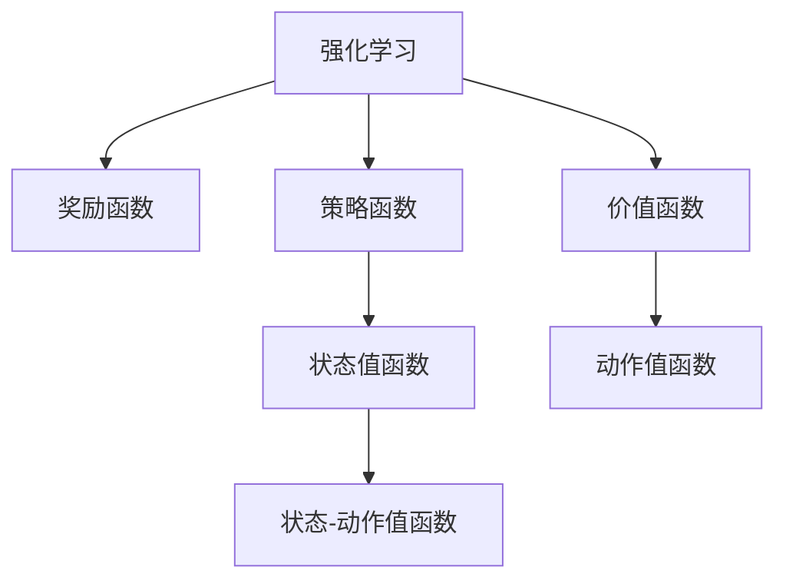

                 

# 强化学习基础：奖励和策略

> 关键词：强化学习,奖励函数,策略函数,价值函数,蒙特卡洛方法,时序差分学习,政策评估与改进,应用领域

## 1. 背景介绍

强化学习（Reinforcement Learning, RL）作为人工智能的三大支柱之一，与传统的监督学习和无监督学习不同，它通过试错的方式，使智能体在动态环境中学习最优策略，实现从已知输入到期望输出的映射。RL广泛应用于机器人控制、自动驾驶、游戏策略、金融交易等多个领域，并取得了令人瞩目的成效。

本文将从强化学习的核心概念入手，详细探讨强化学习中的奖励和策略，为读者提供一个全面而系统的理解。

## 2. 核心概念与联系

### 2.1 核心概念概述

为了更好地理解强化学习中的奖励和策略，本节将介绍几个密切相关的核心概念：

- **强化学习**：一种通过智能体在环境中交互，不断尝试并根据环境反馈调整策略的学习方法。智能体在不断试错中学习到最优策略，实现从当前状态到下一个状态的映射。
- **奖励函数**：定义智能体在每个状态下获得的即时奖励，用于衡量智能体行为的优劣。奖励函数的设计需要合理，以便引导智能体学习到最优策略。
- **策略函数**：定义智能体在当前状态下采取动作的概率分布，策略函数的选择直接影响学习效率和最终策略。
- **价值函数**：评估智能体在不同状态下的期望奖励，包括状态值函数和动作值函数。价值函数为智能体提供了一种对未来收益的预期，帮助决策。

这些核心概念之间的逻辑关系可以通过以下Mermaid流程图来展示：



这个流程图展示了强化学习中各个核心概念之间的关系：

1. 强化学习通过智能体与环境的交互学习最优策略。
2. 奖励函数引导智能体学习方向。
3. 策略函数描述智能体如何作出决策。
4. 价值函数评估策略的好坏，并指导决策。

## 3. 核心算法原理 & 具体操作步骤

### 3.1 算法原理概述

强化学习的核心在于通过智能体与环境的交互，不断调整策略以最大化预期奖励。算法通过奖励函数和策略函数相互配合，实现智能体的最优决策。

在强化学习中，智能体（agent）通过执行一系列动作（action）来与环境（environment）互动，并根据环境的反馈（即奖励）来更新策略（policy）。强化学习的目标是通过不断的试错，找到能够最大化累积奖励（cumulative reward）的策略。

### 3.2 算法步骤详解

强化学习的主要步骤包括：

1. **环境设定**：定义环境状态空间、动作空间、状态转移概率和奖励函数。
2. **策略初始化**：选择策略函数或策略网络，作为智能体的初始行为模型。
3. **策略评估**：通过与环境交互，根据奖励函数评估策略的效果。
4. **策略改进**：根据策略评估结果，使用优化算法更新策略函数。
5. **迭代优化**：重复执行3和4，直到策略收敛。

### 3.3 算法优缺点

强化学习的优点包括：

- **适应性强**：智能体可以在未知环境中学习，且无需大量标注数据。
- **模型简单**：无需显式构建特征表示，可适用于高维度数据。
- **可扩展性强**：可应用于连续动作空间、高维度状态空间等复杂问题。

其缺点主要包括：

- **训练时间长**：需要大量时间探索环境，寻找最优策略。
- **模型复杂性高**：策略函数的优化需要解决非凸优化问题，可能存在局部最优。
- **可解释性差**：强化学习过程缺乏可解释性，难以理解智能体的决策机制。

### 3.4 算法应用领域

强化学习在多个领域中得到了广泛应用：

- **机器人控制**：如导航、操作、抓握等，智能体通过与环境的交互，学习到最优控制策略。
- **自动驾驶**：智能体学习到在复杂交通环境中安全行驶的策略。
- **游戏策略**：如AlphaGo，通过学习棋局策略，达到人类级水平。
- **金融交易**：智能体学习到最优的买卖策略，以获得最大收益。

## 4. 数学模型和公式 & 详细讲解

### 4.1 数学模型构建

强化学习中，智能体的目标是通过策略函数 $\pi$ 在每个状态下采取最优动作 $a$，以最大化期望累积奖励 $J(\pi)$。

设状态空间为 $S$，动作空间为 $A$，策略函数为 $\pi(a|s)$，状态转移概率为 $P(s'|s,a)$，奖励函数为 $R(s,a)$，智能体在状态 $s$ 下执行动作 $a$ 的累积奖励为 $G_t$。则状态值函数 $V(s)$ 和动作值函数 $Q(s,a)$ 的定义如下：

$$
V(s) = \mathbb{E}_{a \sim \pi}[\sum_{t=0}^{\infty} \gamma^t R(s_t,a_t)]
$$

$$
Q(s,a) = \mathbb{E}_{a \sim \pi}[\sum_{t=0}^{\infty} \gamma^t R(s_t,a_t)]
$$

其中 $\gamma$ 为折扣因子，用于将未来奖励折现。

### 4.2 公式推导过程

我们将通过举例说明状态值函数和动作值函数的计算过程。

假设智能体在状态 $s_0$ 执行动作 $a_0$，进入状态 $s_1$，获得奖励 $R_1$，再进入状态 $s_2$，获得奖励 $R_2$，如此反复。根据定义，智能体在状态 $s_0$ 的累积奖励为：

$$
G_0 = R_1 + \gamma R_2 + \gamma^2 R_3 + \ldots
$$

通过状态值函数，我们可以计算出智能体在状态 $s_0$ 的期望累积奖励 $V(s_0)$：

$$
V(s_0) = \mathbb{E}_{a \sim \pi}[G_0]
$$

类似地，动作值函数 $Q(s_0,a_0)$ 可以表示为：

$$
Q(s_0,a_0) = \mathbb{E}_{a_1 \sim \pi}[R_1 + \gamma Q(s_1,a_1)]
$$

通过上述公式，我们可以使用蒙特卡洛方法或时序差分方法来计算状态值函数和动作值函数。

### 4.3 案例分析与讲解

为了更直观地理解状态值函数和动作值函数的计算，我们以一个简单的“抓苹果”游戏为例。

假设智能体需要从每个房间中抓取苹果，每个房间中有两种动作：向左走或向右走。如果抓到苹果，智能体获得1个奖励，否则获得-1个奖励。智能体需要在最短时间内抓到最多苹果。

1. **蒙特卡洛方法**：智能体从每个状态中开始，随机选择一个动作，执行后记录奖励。重复执行多次，统计每个状态的累积奖励。

2. **时序差分方法**：智能体从每个状态开始，根据当前状态和动作，预测下一个状态和奖励，计算动作值。然后根据实际执行的动作和获得的奖励，更新动作值。

通过以上方法，智能体可以逐步学习到最优策略，即在每个状态下选择最可能获得高奖励的动作。

## 5. 项目实践：代码实例和详细解释说明

### 5.1 开发环境搭建

在进行强化学习实践前，我们需要准备好开发环境。以下是使用Python进行PyTorch开发的环境配置流程：

1. 安装Anaconda：从官网下载并安装Anaconda，用于创建独立的Python环境。

2. 创建并激活虚拟环境：
```bash
conda create -n pytorch-env python=3.8 
conda activate pytorch-env
```

3. 安装PyTorch：根据CUDA版本，从官网获取对应的安装命令。例如：
```bash
conda install pytorch torchvision torchaudio cudatoolkit=11.1 -c pytorch -c conda-forge
```

4. 安装TensorFlow：
```bash
conda install tensorflow
```

5. 安装Gym环境：
```bash
conda install gym
```

完成上述步骤后，即可在`pytorch-env`环境中开始强化学习实践。

### 5.2 源代码详细实现

我们以“抓苹果”游戏为例，给出使用PyTorch实现强化学习的代码实现。

```python
import torch
import torch.nn as nn
import torch.optim as optim
import gym

# 创建环境
env = gym.make('FrozenLake-v0')

# 定义策略网络
class Policy(nn.Module):
    def __init__(self, state_dim, action_dim):
        super(Policy, self).__init__()
        self.fc1 = nn.Linear(state_dim, 32)
        self.fc2 = nn.Linear(32, action_dim)

    def forward(self, x):
        x = torch.relu(self.fc1(x))
        x = torch.sigmoid(self.fc2(x))
        return x

# 定义策略评估
class Value(nn.Module):
    def __init__(self, state_dim):
        super(Value, self).__init__()
        self.fc1 = nn.Linear(state_dim, 32)
        self.fc2 = nn.Linear(32, 1)

    def forward(self, x):
        x = torch.relu(self.fc1(x))
        x = self.fc2(x)
        return x

# 定义奖励函数
def reward_fn(state, action):
    if state == 's1' and action == 'R':
        return 1
    elif state == 's2' and action == 'D':
        return 1
    elif state == 's2' and action == 'R':
        return -1
    else:
        return -1

# 定义状态值函数和动作值函数
def value_fn(state):
    state = torch.tensor(state, dtype=torch.float)
    v = value_net(state)
    return v.item()

def q_fn(state, action):
    state = torch.tensor(state, dtype=torch.float)
    action = torch.tensor(action, dtype=torch.float)
    q = q_net(state, action)
    return q.item()

# 定义策略评估函数
def policy_eval():
    total_reward = 0
    state = env.reset()
    done = False
    while not done:
        action = env.action_space.sample()
        state, reward, done, _ = env.step(action)
        total_reward += reward
    return total_reward

# 定义训练函数
def train_policy(policy, optimizer, total_episodes):
    for episode in range(total_episodes):
        state = env.reset()
        done = False
        total_reward = 0
        while not done:
            probs = policy(torch.tensor(state, dtype=torch.float))
            action = torch.bernoulli(probs).item()
            state, reward, done, _ = env.step(action)
            total_reward += reward
            optimizer.zero_grad()
            policy_loss = -torch.log(probs[action]) * reward
            policy_loss.backward()
            optimizer.step()
        print('Episode {}: Total reward {}'.format(episode+1, total_reward))

# 定义参数
state_dim = 4
action_dim = 2
total_episodes = 1000
learning_rate = 0.01
discount_factor = 0.9

# 定义模型和优化器
policy_net = Policy(state_dim, action_dim)
q_net = Value(state_dim)
optimizer = optim.Adam(list(policy_net.parameters()) + list(q_net.parameters()), lr=learning_rate)

# 训练和评估
train_policy(policy_net, optimizer, total_episodes)
print('Policy Evaluation: {}'.format(policy_eval()))

# 运行结果展示
```

以上就是使用PyTorch实现强化学习的完整代码实现。可以看到，通过定义策略网络、奖励函数、状态值函数和动作值函数，我们可以在强化学习环境中实现对环境的探索和优化。

### 5.3 代码解读与分析

让我们再详细解读一下关键代码的实现细节：

**Policy类**：
- `__init__`方法：初始化策略网络的权重。
- `forward`方法：定义策略函数的前向传播过程，计算每个动作的概率分布。

**Value类**：
- `__init__`方法：初始化状态值函数的权重。
- `forward`方法：定义状态值函数的前向传播过程，计算状态值。

**reward_fn**：
- 根据状态和动作返回奖励值，用于更新策略和状态值函数。

**value_fn和q_fn**：
- 定义状态值函数和动作值函数的计算过程，使用PyTorch的Tensor和神经网络模块。

**policy_eval**：
- 定义策略评估函数，计算在环境中的平均奖励。

**train_policy**：
- 定义训练函数，通过与环境交互更新策略网络。

**训练过程**：
- 在每轮训练中，智能体从环境起始状态开始，根据策略网络计算每个动作的概率分布，随机选择一个动作，执行后接收环境反馈，并更新策略网络。

通过上述代码，我们可以使用PyTorch实现强化学习的训练过程，并评估策略的效果。

## 6. 实际应用场景

### 6.1 机器人控制

强化学习在机器人控制中得到了广泛应用，如导航、操作、抓握等。通过与环境的交互，智能体可以学习到最优的控制策略，实现自主导航和操作。

以机器人臂为例，智能体通过与环境（如视觉传感器、机械臂等）的交互，学习到最优的抓握、放置等动作策略，以完成复杂任务。

### 6.2 自动驾驶

自动驾驶是强化学习的典型应用场景之一。智能体通过与环境的交互，学习到最优的驾驶策略，实现安全和高效的行驶。

在自动驾驶中，智能体需要考虑多种环境因素（如交通灯、行人、车辆等），通过学习最优策略，实现路径规划、避障等复杂任务。

### 6.3 游戏策略

强化学习在游戏策略中也得到了广泛应用。智能体通过与环境的交互，学习到最优的游戏策略，实现游戏中的胜利。

以AlphaGo为例，智能体通过与棋盘状态的交互，学习到最优的落子策略，达到人类级水平。

### 6.4 金融交易

金融交易是强化学习的另一个重要应用领域。智能体通过与市场的交互，学习到最优的交易策略，实现最大收益。

在金融交易中，智能体需要考虑多种市场因素（如股票价格、市场情绪等），通过学习最优策略，实现买卖决策。

## 7. 工具和资源推荐

### 7.1 学习资源推荐

为了帮助开发者系统掌握强化学习的理论基础和实践技巧，这里推荐一些优质的学习资源：

1. 《Reinforcement Learning: An Introduction》：由Richard Sutton和Andrew Barto合著的经典教材，详细介绍了强化学习的基本概念和算法。

2. CS294T《强化学习》课程：由UC Berkeley开设的强化学习课程，有Lecture视频和配套作业，带你深入理解强化学习的核心思想。

3. DeepMind公开课：DeepMind团队的多场公开课，涵盖了强化学习的各个方面，从基础到前沿，非常全面。

4. OpenAI Gym：一个开源的强化学习环境，包含了各种经典环境和实验，是学习强化学习的必备资源。

5. 《Hands-On Reinforcement Learning with Python》：由Stuart Russell和Peter Norvig合著的经典教材，详细介绍了强化学习的基本概念和算法，并提供了Python实现的代码。

通过对这些资源的学习实践，相信你一定能够快速掌握强化学习的精髓，并用于解决实际的强化学习问题。

### 7.2 开发工具推荐

高效的开发离不开优秀的工具支持。以下是几款用于强化学习开发的常用工具：

1. PyTorch：基于Python的开源深度学习框架，灵活动态的计算图，适合快速迭代研究。

2. TensorFlow：由Google主导开发的开源深度学习框架，生产部署方便，适合大规模工程应用。

3. Gym：开源的强化学习环境，包含各种经典环境和实验，方便开发者进行实验。

4. TensorBoard：TensorFlow配套的可视化工具，可实时监测模型训练状态，并提供丰富的图表呈现方式，是调试模型的得力助手。

5. Weights & Biases：模型训练的实验跟踪工具，可以记录和可视化模型训练过程中的各项指标，方便对比和调优。

6. Jupyter Notebook：一个交互式的Python环境，方便开发者进行实验和数据处理。

合理利用这些工具，可以显著提升强化学习的开发效率，加快创新迭代的步伐。

### 7.3 相关论文推荐

强化学习在多个领域中得到了广泛应用，以下是几篇奠基性的相关论文，推荐阅读：

1. Q-learning：Watkins和Powell提出的Q-learning算法，是强化学习领域的重要基础算法。

2. Policy Gradient Methods：Sutton和Barto提出的Policy Gradient方法，直接优化策略函数，而非状态值函数。

3. Actor-Critic Methods：Konda和Johnson提出的Actor-Critic方法，通过两个网络（Actor和Critic）联合训练，优化策略函数和状态值函数。

4. Deep Q-Networks（DQN）：Mnih等提出的DQN算法，通过深度神经网络优化Q-learning算法，实现了在Atari游戏上的高效学习。

5. Trust Region Policy Optimization（TRPO）：Schulman等提出的TRPO算法，通过引入梯度裁剪和二阶优化技术，实现了策略函数的稳定更新。

6. Proximal Policy Optimization（PPO）：Schulman等提出的PPO算法，通过引入梯度裁剪和梯度惩罚，实现了策略函数的稳定更新，并取得了优秀的实验效果。

这些论文代表了几十年来强化学习领域的核心进展，通过学习这些前沿成果，可以帮助研究者把握学科前进方向，激发更多的创新灵感。

## 8. 总结：未来发展趋势与挑战

### 8.1 总结

本文对强化学习中的奖励和策略进行了全面系统的介绍。首先阐述了强化学习的基本概念和核心思想，明确了奖励和策略在强化学习中的重要作用。其次，从原理到实践，详细讲解了奖励和策略的设计和优化过程，给出了强化学习任务开发的完整代码实例。同时，本文还广泛探讨了强化学习在机器人控制、自动驾驶、游戏策略、金融交易等多个领域的应用前景，展示了强化学习范式的巨大潜力。

通过本文的系统梳理，可以看到，强化学习通过智能体与环境的交互学习最优策略，已经在多个领域中取得了显著成效。未来，伴随强化学习算法的不断演进，结合多模态数据、迁移学习等前沿技术，强化学习将进一步拓展应用边界，成为推动人工智能技术发展的重要力量。

### 8.2 未来发展趋势

展望未来，强化学习将呈现以下几个发展趋势：

1. **深度强化学习**：结合深度神经网络和强化学习，实现更高效、更灵活的策略学习。

2. **多智能体学习**：多个智能体在环境中共存并竞争，学习到更加复杂和多样的策略。

3. **元强化学习**：通过学习学习策略，实现自我优化和自适应，进一步提高智能体的性能。

4. **迁移学习和跨领域应用**：在已有经验的基础上，将学习策略迁移到新任务或新领域，提升模型泛化能力。

5. **强化学习与知识表示结合**：结合知识图谱、符号化推理等知识表示方法，实现更加精确和全面的策略学习。

6. **强化学习与道德和伦理结合**：在强化学习过程中加入道德和伦理约束，确保智能体的行为符合人类价值观和社会规范。

以上趋势凸显了强化学习技术的广阔前景。这些方向的探索发展，必将进一步提升强化学习的性能和应用范围，为人类认知智能的进化带来深远影响。

### 8.3 面临的挑战

尽管强化学习已经取得了瞩目成就，但在迈向更加智能化、普适化应用的过程中，它仍面临着诸多挑战：

1. **训练效率低下**：强化学习需要大量的环境交互，时间成本高。如何提高训练效率，减少环境交互次数，是重要的研究方向。

2. **可解释性差**：强化学习过程缺乏可解释性，难以理解智能体的决策机制。如何提高可解释性，确保智能体的行为透明和可信，是重要的研究方向。

3. **模型鲁棒性不足**：强化学习模型面对小样本数据和噪声干扰时，容易产生不稳定和过拟合。如何提高模型鲁棒性，确保智能体的行为稳定和可靠，是重要的研究方向。

4. **计算资源消耗大**：强化学习模型往往需要大规模的计算资源，如何优化模型结构，减少计算开销，是重要的研究方向。

5. **伦理和道德问题**：强化学习模型可能学习到有害的行为策略，如何确保模型的行为符合伦理道德，是重要的研究方向。

6. **数据隐私和安全问题**：强化学习模型需要大量的环境数据，如何保护数据隐私和安全，防止数据泄露和滥用，是重要的研究方向。

### 8.4 研究展望

面对强化学习面临的挑战，未来的研究需要在以下几个方面寻求新的突破：

1. **模型压缩和加速**：通过模型压缩和加速技术，提高强化学习的训练效率，减少计算开销。

2. **可解释性增强**：通过引入可解释性技术和符号化推理，提高强化学习的可解释性，确保智能体的行为透明和可信。

3. **鲁棒性和稳定性提升**：通过鲁棒性分析和稳定性优化，提高强化学习的模型鲁棒性和行为稳定性。

4. **伦理和道德约束**：在强化学习过程中加入伦理和道德约束，确保智能体的行为符合人类价值观和社会规范。

5. **跨领域应用拓展**：将强化学习应用于更多的领域，如社交、医疗、金融等，提升模型泛化能力和应用价值。

6. **多模态数据融合**：将强化学习与多模态数据融合技术结合，提升模型对多模态数据的整合能力。

这些研究方向的探索，必将引领强化学习技术迈向更高的台阶，为人工智能技术的发展提供更加坚实的理论基础和实践支撑。

## 9. 附录：常见问题与解答

**Q1：强化学习是否适用于所有问题？**

A: 强化学习适用于那些可以通过智能体与环境的交互，通过试错学习最优策略的问题。但强化学习需要大量的环境交互，对于复杂且无法通过交互学习的问题，强化学习可能不是最佳选择。

**Q2：如何选择奖励函数？**

A: 奖励函数的选择需要根据具体问题进行设计。通常需要确保奖励函数能够引导智能体学习到最优策略，同时避免奖励函数设计的陷阱（如偏置、奖励衰减等）。可以通过试验和调整，找到最优的奖励函数。

**Q3：如何设计策略函数？**

A: 策略函数的设计需要考虑智能体的行为分布，并尽可能地简化策略函数。常用的策略函数包括概率策略函数、确定性策略函数等。需要根据具体问题选择合适的策略函数。

**Q4：强化学习中的探索与利用平衡问题如何处理？**

A: 探索与利用平衡问题是强化学习中的一个经典问题，需要通过ε-greedy策略、Softmax策略等方法进行解决。可以在训练初期采用较大的探索概率，逐步降低，确保智能体能够在探索和利用之间取得平衡。

**Q5：强化学习中的值函数如何计算？**

A: 值函数的计算可以通过蒙特卡洛方法、时序差分方法、最小最大规划等方法进行。这些方法各有优缺点，需要根据具体问题选择合适的计算方法。

通过这些问题的解答，相信你对强化学习的理解更加全面，能够更好地应用于实际问题中。

