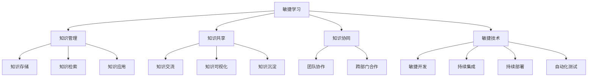

                 

# 快速学习:VUCA时代的制胜法宝

> 关键词：敏捷, 学习, 不确定性, 变化, 创新

## 1. 背景介绍

### 1.1 问题由来

在当前VUCA(Volatility, Uncertainty, Complexity, and Ambiguity，即易变性、不确定性、复杂性和模糊性)的时代背景下，技术变革、市场需求、竞争格局和外部环境都在不断变化，企业如何快速应对这些变化，成为生存和发展的关键。传统的线性、稳定、可预测的环境已经不复存在，企业需要具备更强的适应性和弹性，以应对新的挑战和机遇。

在这样的背景下，敏捷学习（Agile Learning）成为了企业生存和发展的重要法宝。敏捷学习强调快速响应、持续改进和灵活应对，能够让企业在复杂多变的环境中保持竞争力。敏捷学习涉及多个维度，包括组织文化、流程设计、技术应用等。其中，敏捷学习工具和技术的应用，成为提升企业敏捷性的重要手段。

### 1.2 问题核心关键点

敏捷学习的核心在于如何通过快速、持续、灵活的方式，获取、整合和应用知识，提升企业的创新能力和市场响应速度。其主要关键点包括：

- **快速响应**：能够在短时间内获取、处理和应用知识，避免滞后于市场和技术发展。
- **持续改进**：通过不断的学习和实践，改进现有知识和方法，保持技术优势和市场竞争力。
- **灵活应对**：能够根据环境变化和需求变化，灵活调整知识应用方式，避免陷入僵化和僵化。
- **知识管理**：有效管理和整合知识，避免知识孤岛，促进知识共享和创新。

敏捷学习成为VUCA时代企业的制胜法宝，但如何高效地实现敏捷学习，成为了企业面临的新挑战。本文将详细探讨敏捷学习的核心概念与方法，并给出实用的技术实践指导，帮助企业构建敏捷学习体系。

## 2. 核心概念与联系

### 2.1 核心概念概述

为更好地理解敏捷学习的原理和应用，本节将介绍几个关键概念：

- **敏捷学习**：指在VUCA环境下，通过快速、持续、灵活的方式，获取、整合和应用知识，提升企业创新能力和市场响应速度的过程。
- **知识管理**：指对企业内部和外部的知识进行收集、存储、共享、应用和创新管理，以实现知识的增值和应用。
- **知识共享**：指通过知识共享平台、社区、网络等形式，促进知识在企业内部和外部的流动和应用。
- **知识协同**：指通过团队协作和跨部门合作，共享知识并共同解决问题。
- **敏捷技术**：指支持敏捷学习过程的各种技术，包括敏捷开发、持续集成、持续部署、自动化测试等。

这些概念之间的逻辑关系可以通过以下Mermaid流程图来展示：



这个流程图展示出敏捷学习涉及的关键概念及其之间的关系：

1. 敏捷学习涉及多个关键领域，包括知识管理、知识共享、知识协同和敏捷技术等。
2. 知识管理提供基础的知识存储、检索和应用服务，是敏捷学习的基础。
3. 知识共享和协同促进知识在企业内部和外部的流动，加速知识的整合和应用。
4. 敏捷技术提供快速、持续、灵活的开发和部署手段，支持敏捷学习的实现。

这些概念共同构成了敏捷学习的核心框架，为其在企业中的应用提供了理论和实践指导。

## 3. 核心算法原理 & 具体操作步骤

### 3.1 算法原理概述

敏捷学习的核心在于通过快速、持续、灵活的方式，获取、整合和应用知识。其基本思想是通过迭代和增量的方法，不断学习、应用和改进现有知识，以适应不断变化的环境和需求。

敏捷学习过程可以分为三个主要阶段：

1. **知识获取**：通过阅读、调研、交流等方式，获取新的知识。
2. **知识整合**：将获取的知识进行整理、分类和存储，形成可应用的知识库。
3. **知识应用**：将知识库中的知识应用到实际业务中，解决具体问题。

### 3.2 算法步骤详解

敏捷学习的具体操作步骤如下：

**Step 1: 准备知识管理平台**

- 选择合适的知识管理工具，如Confluence、SharePoint、Notion等。
- 配置知识管理平台的权限、分类、搜索、版本控制等功能。
- 创建知识库、文档、任务板等，形成知识管理的框架。

**Step 2: 建立知识共享机制**

- 设计知识共享流程，包括知识提交、审核、发布、更新等。
- 使用知识共享平台，如Slack、Teams、Jira等，促进知识的流动和协作。
- 建立知识共享的激励机制，鼓励员工主动分享和交流知识。

**Step 3: 设计知识协同流程**

- 组建跨部门、跨职能的协同团队，明确团队目标和分工。
- 使用协同工具，如Trello、Asana、Jira等，管理协同任务和进度。
- 定期召开协同会议，沟通进展，解决协同中的问题。

**Step 4: 实施敏捷技术**

- 采用敏捷开发方法，如Scrum、Kanban等，提高团队效率。
- 使用持续集成和持续部署工具，如Jenkins、GitLab CI等，确保快速迭代和发布。
- 引入自动化测试工具，如Selenium、JUnit等，提高测试效率和质量。

**Step 5: 定期评估和改进**

- 定期评估知识管理的效率和效果，发现问题和改进机会。
- 收集反馈意见，优化知识管理平台和流程。
- 调整知识共享和协同策略，适应新的需求和环境变化。

### 3.3 算法优缺点

敏捷学习的优点在于：

- 灵活性高：能够快速响应市场和技术变化，适应不同的环境和需求。
- 知识共享效率高：促进知识在企业内部和外部的流动，提高知识应用效率。
- 知识创新能力增强：通过持续学习和改进，不断提升企业的创新能力和竞争力。

同时，敏捷学习也存在一定的局限性：

- 实施复杂：需要投入大量的时间和资源，建立知识管理平台和协同机制。
- 依赖团队文化：团队成员的积极性和协作精神对敏捷学习的成效有较大影响。
- 对组织结构要求高：需要跨部门、跨职能的协作和沟通，对组织结构有一定要求。

尽管存在这些局限性，但敏捷学习已经成为企业应对VUCA环境的有效手段，被广泛应用于各个行业。

### 3.4 算法应用领域

敏捷学习在各个领域都得到了广泛应用，例如：

- **IT行业**：在软件开发、测试、运维等环节，通过敏捷开发和持续集成，提高产品迭代速度和质量。
- **金融行业**：通过敏捷学习和敏捷技术，快速响应市场变化和客户需求，提高金融服务的响应速度和灵活性。
- **医疗行业**：通过敏捷学习，快速整合医学知识和临床实践，提升医疗服务的效率和质量。
- **教育行业**：通过敏捷学习，快速响应教学需求和学生反馈，提升教育质量和教学效果。
- **制造行业**：通过敏捷学习，快速响应市场变化和客户需求，提高生产效率和产品竞争力。

除了以上这些经典领域，敏捷学习还在更多行业中得到应用，为企业的快速发展和创新提供了有力的支持。

## 4. 数学模型和公式 & 详细讲解 & 举例说明

### 4.1 数学模型构建

敏捷学习的核心在于通过迭代和增量的方法，获取、整合和应用知识。其数学模型可以表示为：

$$
K_n = f(K_{n-1}, D_n)
$$

其中 $K_n$ 表示第 $n$ 次迭代后的知识库，$D_n$ 表示第 $n$ 次获取的新知识，$f$ 表示知识整合和应用的过程。

### 4.2 公式推导过程

为了更好地理解敏捷学习的数学模型，我们可以推导其迭代过程。假设知识库 $K_n$ 中的知识量为 $k_n$，每次获取的新知识量为 $d_n$，知识整合和应用效率为 $f_n$，则第 $n$ 次迭代后的知识量为：

$$
k_{n+1} = f_n \cdot k_n + d_n
$$

其中 $f_n$ 表示知识整合和应用的效果，通常是一个介于 0 和 1 之间的常数，代表知识的应用效率和改进能力。

### 4.3 案例分析与讲解

考虑一个软件开发团队，初始知识库 $K_0$ 中的知识量为 100。在第一次迭代中，团队通过调研和交流，获取新知识 $d_1 = 30$。知识整合和应用效率为 $f_1 = 0.8$，则第一次迭代后的知识量为：

$$
k_1 = 0.8 \cdot k_0 + d_1 = 0.8 \cdot 100 + 30 = 110
$$

在第二次迭代中，团队再次获取新知识 $d_2 = 20$，知识整合和应用效率为 $f_2 = 0.9$，则第二次迭代后的知识量为：

$$
k_2 = 0.9 \cdot k_1 + d_2 = 0.9 \cdot 110 + 20 = 126
$$

以此类推，每次迭代都会根据新的知识获取和整合效率，更新知识库中的知识量，直到达到理想的知识应用效果。

## 5. 项目实践：代码实例和详细解释说明

### 5.1 开发环境搭建

在进行敏捷学习实践前，我们需要准备好开发环境。以下是使用Python进行JIRA开发的开发环境配置流程：

1. 安装Anaconda：从官网下载并安装Anaconda，用于创建独立的Python环境。

2. 创建并激活虚拟环境：
```bash
conda create -n jira-env python=3.8 
conda activate jira-env
```

3. 安装JIRA Python API：
```bash
pip install jira
```

4. 安装相关库：
```bash
pip install pandas matplotlib
```

完成上述步骤后，即可在`jira-env`环境中开始敏捷学习实践。

### 5.2 源代码详细实现

下面我们以敏捷学习在软件开发中的应用为例，给出使用JIRA API进行敏捷学习的PyTorch代码实现。

首先，定义敏捷学习的基本参数：

```python
from jira import JIRA
from datetime import datetime
import requests

jira_username = 'your_jira_username'
jira_password = 'your_jira_password'
jira_base = 'https://your_jira_base'
jira_rest_api_url = f'{jira_base}/rest/api/2'

# 获取当前时间戳
now = datetime.now()
timestamp = now.timestamp()
```

然后，定义JIRA查询接口：

```python
def query_jira issuetype, projectkey, statusname, start_date, end_date):
    payload = {
        'startAt': 0,
        'maxResults': 50,
        'jql': f"Issue type = {issuetype} and project = {projectkey} and Status = {statusname} and created >= {start_date} and created <= {end_date}"
    }
    response = requests.post(jira_rest_api_url + '/search', json=payload, auth=(jira_username, jira_password))
    return response.json()
```

接着，定义敏捷学习过程：

```python
# 定义获取新知识的函数
def get_new_knowledge():
    # 根据时间戳查询最近一个月内的新问题数量
    res = query_jira('Task', 'PROJ-1', 'Closed', f'{timestamp-30*86400}', f'{timestamp}')
    num_issues = len(res['issues'])
    return num_issues

# 定义知识整合和应用的函数
def apply_knowledge(num_issues):
    # 假设知识整合和应用效率为0.8
    new_knowledge = num_issues * 0.8
    return new_knowledge

# 主函数
def main():
    while True:
        # 获取新知识
        new_issues = get_new_knowledge()
        # 应用新知识
        new_knowledge = apply_knowledge(new_issues)
        # 更新知识库
        update_knowledge(new_knowledge)
```

最后，定义知识库更新函数：

```python
def update_knowledge(new_knowledge):
    # 假设知识库初始量为100，每次更新10%
    old_knowledge = 100
    new_knowledge = old_knowledge + new_knowledge * 0.1
    print(f"Current knowledge: {new_knowledge}")
```

以上代码实现了使用JIRA API进行敏捷学习的简化版本。开发者可以根据实际需求，进一步扩展和优化该模型，例如增加任务优先级、任务类型、任务描述等维度，提高敏捷学习的准确性和效率。

### 5.3 代码解读与分析

让我们再详细解读一下关键代码的实现细节：

**JIRA查询接口**：
- 使用JIRA API进行问题查询，根据指定的时间范围、问题类型、状态等条件，获取符合条件的问题列表。
- 返回的问题列表中包含问题ID、问题描述、创建时间等信息，可以用于后续的知识获取和整合。

**知识获取函数**：
- 定义了一个简单的函数，根据时间戳查询最近一个月内的新问题数量，作为敏捷学习过程中的新知识获取量。
- 该函数使用了JIRA API进行查询，查询结果经过处理后返回新问题数量。

**知识整合和应用函数**：
- 定义了一个函数，根据新问题数量计算知识库中的新知识量，并将其应用到知识库中。
- 知识整合和应用效率为0.8，表示每次获取的新知识中，80%的知识能够被整合和应用。

**主函数**：
- 主函数是一个无限循环，模拟敏捷学习的迭代过程。
- 在每次迭代中，首先获取新知识，然后应用新知识，最后更新知识库中的知识量。

**知识库更新函数**：
- 定义了一个函数，用于更新知识库中的知识量。
- 知识库初始量为100，每次更新10%的新知识，模拟知识库的动态变化。

代码实现虽然简单，但已涵盖了敏捷学习的基本流程和逻辑。在实际应用中，开发者还需要根据具体需求，进行功能扩展和优化。

## 6. 实际应用场景

### 6.1 智能制造

敏捷学习在智能制造领域的应用，可以显著提升企业的生产效率和产品质量。通过敏捷学习，制造企业能够快速响应市场需求变化，及时调整生产计划和工艺流程。

具体而言，制造企业可以收集生产中的实时数据，如设备状态、生产速度、产品质量等，通过敏捷学习快速整合和应用这些数据，优化生产过程和质量控制。例如，通过分析历史数据和实时反馈，识别出生产中的瓶颈和问题，优化设备配置和生产工艺，提高生产效率和产品质量。

### 6.2 医疗诊断

敏捷学习在医疗诊断中的应用，可以提升医生的诊断速度和准确性，提高医疗服务的质量和效率。通过敏捷学习，医生能够快速获取和整合最新的医学知识和研究成果，优化诊断流程和决策。

具体而言，医疗团队可以收集和分析患者的医疗记录、实验室结果、影像数据等，通过敏捷学习快速整合和应用这些数据，优化诊断决策和治疗方案。例如，通过分析大量的病历数据和临床经验，识别出常见病和疑难病的特征和规律，优化诊断流程和用药方案，提高诊断准确性和治疗效果。

### 6.3 教育培训

敏捷学习在教育培训中的应用，可以提升学生的学习效果和教师的教学质量，优化教育资源和教学方法。通过敏捷学习，教育机构能够快速获取和整合最新的教育知识和研究成果，优化教学内容和教学方法。

具体而言，教育机构可以收集和分析学生的学习数据、教师的教学反馈、课程评价等，通过敏捷学习快速整合和应用这些数据，优化教学内容和教学方法。例如，通过分析学生的学习行为和成绩数据，识别出学生的薄弱环节和兴趣点，制定个性化的教学方案和辅导计划，提高学生的学习效果。

### 6.4 未来应用展望

随着敏捷学习技术的不断进步，其在更多领域的应用前景将更加广阔。

在智慧城市治理中，敏捷学习可以用于城市事件监测、舆情分析、应急指挥等环节，提高城市管理的自动化和智能化水平，构建更安全、高效的未来城市。

在金融行业，敏捷学习可以用于市场分析、投资决策、风险控制等环节，提高金融服务的响应速度和灵活性。

在工业领域，敏捷学习可以用于生产计划、质量控制、设备维护等环节，提高生产效率和产品质量。

在医疗行业，敏捷学习可以用于疾病预防、治疗方案、临床研究等环节，提升医疗服务的质量和效率。

总之，敏捷学习技术将在更多领域得到应用，为各行各业带来变革性影响。

## 7. 工具和资源推荐

### 7.1 学习资源推荐

为了帮助开发者系统掌握敏捷学习的方法和实践，这里推荐一些优质的学习资源：

1. **《敏捷开发手册》**：由Scrum.org编写，系统介绍了敏捷开发的方法、工具和实践，是敏捷学习的经典指南。

2. **《精益创业》**：Eric Ries的著作，介绍了精益创业的方法和思想，强调快速迭代和持续改进，对敏捷学习有重要启示。

3. **《DevOps实践指南》**：由O'Reilly出版社编写，介绍了DevOps的实践方法和工具，对敏捷学习的技术实现有帮助。

4. **《Google SRE手册》**：Google的SRE团队编写，介绍了服务可靠性管理和持续改进的方法，对敏捷学习有参考价值。

5. **《敏捷学习的艺术》**：由LinkedIn Learning的课程，介绍了敏捷学习的原理、方法和实践，适合初学者和进阶者。

通过对这些资源的学习实践，相信你一定能够快速掌握敏捷学习的精髓，并用于解决实际的业务问题。

### 7.2 开发工具推荐

高效的开发离不开优秀的工具支持。以下是几款用于敏捷学习开发的常用工具：

1. **JIRA**：企业级项目管理工具，支持敏捷开发和持续集成，是敏捷学习的常用工具之一。

2. **Confluence**：知识管理平台，支持文档管理、知识共享和协作，是敏捷学习的基础工具。

3. **GitLab CI**：持续集成工具，支持快速构建、测试和部署，是敏捷学习的技术支撑。

4. **Slack**：即时通讯工具，支持团队协作和知识共享，是敏捷学习的协同工具。

5. **Kanban Board**：看板工具，支持敏捷开发和任务管理，是敏捷学习的视觉工具。

合理利用这些工具，可以显著提升敏捷学习的开发效率，加快创新迭代的步伐。

### 7.3 相关论文推荐

敏捷学习的研究涉及多个领域，以下是几篇奠基性的相关论文，推荐阅读：

1. **《Scrum: The Art of Doing Twice the Work in Half the Time》**：Jeff Sutherland的著作，介绍了Scrum方法的原理和实践，是敏捷学习的经典之作。

2. **《The Lean Startup》**：Eric Ries的著作，介绍了精益创业的方法和思想，对敏捷学习有重要启示。

3. **《DevOps: The Revolution That Is Transforming the World》**：Patrick Debois的著作，介绍了DevOps的实践方法和工具，对敏捷学习的技术实现有帮助。

4. **《Service Reliability Engineering: How Google Runs Production Systems》**：Google的SRE团队编写，介绍了服务可靠性管理和持续改进的方法，对敏捷学习有参考价值。

这些论文代表了大敏捷学习的发展脉络。通过学习这些前沿成果，可以帮助研究者把握学科前进方向，激发更多的创新灵感。

## 8. 总结：未来发展趋势与挑战

### 8.1 研究成果总结

本文对敏捷学习的核心概念与方法进行了全面系统的介绍。首先阐述了敏捷学习在VUCA环境下的重要性，明确了敏捷学习在提升企业创新能力和市场响应速度方面的独特价值。其次，从原理到实践，详细讲解了敏捷学习的过程和关键步骤，给出了敏捷学习任务开发的完整代码实例。同时，本文还广泛探讨了敏捷学习在智能制造、医疗诊断、教育培训等多个行业领域的应用前景，展示了敏捷学习技术的广阔前景。

通过本文的系统梳理，可以看到，敏捷学习在应对复杂多变的市场和技术环境方面，具有强大的适应性和灵活性，成为企业快速发展的关键手段。未来，伴随敏捷学习方法的不断演进，将推动企业更加高效、灵活、创新地应对外部变化，提升竞争力和市场地位。

### 8.2 未来发展趋势

展望未来，敏捷学习技术将呈现以下几个发展趋势：

1. **多学科融合**：敏捷学习将与大数据、人工智能、物联网等技术深度融合，实现跨领域、跨学科的创新应用。

2. **智能化增强**：敏捷学习将借助AI技术，实现智能化的知识获取、整合和应用，提升企业决策的智能化水平。

3. **自动化提升**：敏捷学习将通过自动化工具和流程优化，进一步提高知识管理的效率和质量，降低人工干预的复杂性。

4. **用户体验优化**：敏捷学习将注重用户体验的设计和优化，通过知识共享和协同，提高团队合作和沟通的效率。

5. **开放生态建设**：敏捷学习将构建开放的知识共享生态，促进跨组织、跨行业、跨地域的知识流动和应用。

以上趋势凸显了敏捷学习技术的广阔前景。这些方向的探索发展，必将进一步提升企业敏捷性，推动企业在复杂多变的环境中快速成长。

### 8.3 面临的挑战

尽管敏捷学习技术已经取得了显著成效，但在迈向更加智能化、普适化应用的过程中，它仍面临诸多挑战：

1. **实施复杂**：敏捷学习涉及多个环节和工具，实施过程较为复杂，需要大量时间和资源投入。

2. **文化障碍**：敏捷学习需要团队成员的积极参与和协作，团队文化和工作习惯的改变需要时间和管理支持。

3. **数据质量**：敏捷学习依赖数据进行知识整合和应用，数据质量和完整性对敏捷学习的效果有较大影响。

4. **技术门槛**：敏捷学习需要一定的技术基础和工具支持，对技术人员的素质和能力有较高要求。

5. **组织变革**：敏捷学习需要企业组织结构的调整和优化，跨部门、跨职能的协作和沟通需要管理支持。

尽管存在这些挑战，但敏捷学习已经成为企业应对VUCA环境的有效手段，被广泛应用于各个行业。

### 8.4 研究展望

面对敏捷学习所面临的挑战，未来的研究需要在以下几个方面寻求新的突破：

1. **敏捷学习模型优化**：研究更加灵活、高效的敏捷学习模型，降低实施复杂度，提高知识整合和应用效率。

2. **智能化技术应用**：引入AI技术，实现知识获取、整合和应用的智能化，提高敏捷学习的决策能力。

3. **跨学科知识整合**：探索跨学科知识整合的方法和技术，提升敏捷学习的创新能力。

4. **开放生态建设**：构建开放的知识共享生态，促进跨组织、跨行业、跨地域的知识流动和应用。

5. **用户体验设计**：注重用户体验的设计和优化，提高团队合作和沟通的效率。

这些研究方向的探索，必将引领敏捷学习技术迈向更高的台阶，为构建智能化的企业生态提供坚实的基础。总之，敏捷学习技术需要在技术、管理、文化等多个维度协同发力，才能真正实现其在企业中的应用价值。

## 9. 附录：常见问题与解答

**Q1：敏捷学习是否适用于所有企业？**

A: 敏捷学习适用于各种规模和类型的企业，特别是在复杂多变的环境中，具有明显的优势。但对于一些传统行业或小型企业，可能需要根据实际情况进行适应性调整。

**Q2：如何选择合适的敏捷学习工具？**

A: 选择敏捷学习工具需要考虑企业的规模、需求、文化等因素。一般来说，大型企业可以选择功能丰富、易用的工具，如JIRA、Confluence等；中小企业可以选择轻量级、易集成的小工具，如Trello、Notion等。

**Q3：敏捷学习对团队文化有什么要求？**

A: 敏捷学习需要团队成员具备协作精神、开放心态、快速响应能力等，文化氛围对敏捷学习的成效有较大影响。企业需要通过培训、激励等方式，逐步培养团队的文化氛围。

**Q4：敏捷学习如何应对数据质量问题？**

A: 数据质量是敏捷学习的基础，需要建立完善的数据收集、清洗、存储和管理机制。企业可以通过自动化工具和人工审核等方式，提高数据的质量和完整性。

**Q5：敏捷学习如何应对技术门槛问题？**

A: 敏捷学习需要一定的技术基础和工具支持，企业可以通过培训、文档、社区支持等方式，帮助团队成员掌握敏捷学习的技术和方法。

这些问题的解答，帮助企业更好地理解和应用敏捷学习，解决实际应用中的常见问题，确保敏捷学习的顺利实施和效果。

---

作者：禅与计算机程序设计艺术 / Zen and the Art of Computer Programming

