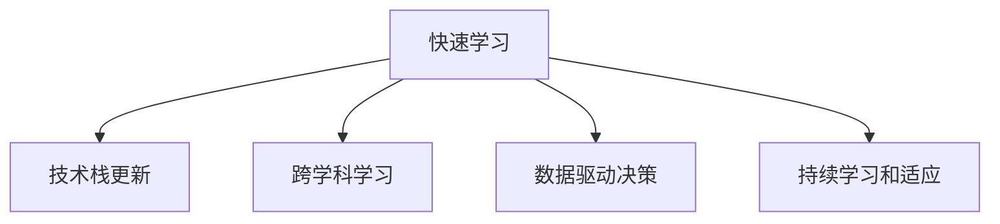

                 

# 快速学习:立于不败之地根本

## 1. 背景介绍

在这个日新月异、瞬息万变的时代，技术更新迭代的速度远远超出了我们的想象。从云计算、大数据、人工智能到区块链、量子计算，每一种新兴技术的兴起，都为人类社会带来了深远的影响。但技术发展的快车，也不断地把人们抛在了后面，让许多人感到手足无措，甚至恐慌。

然而，面对快速变化的技术浪潮，我们真的需要害怕吗？当技术正在改变世界的时候，我们如何能够立于不败之地？本文将从技术学习的基本原理、当前快速学习的流行方法和如何应对快速变化的未来出发，探讨如何在快速变化的技术环境中保持竞争力。

## 2. 核心概念与联系

### 2.1 核心概念概述

为更好地理解快速学习，本节将介绍几个密切相关的核心概念：

- **快速学习**：在技术更新迅速的领域，通过快速掌握新知识，提升个人技能的一种学习方法。
- **技术栈更新**：随着新技术的不断涌现，需要持续更新自己的技术栈，以应对新的挑战。
- **跨学科学习**：在技术领域中，多学科知识的融合和应用，可以帮助我们更好地理解和应用新技术。
- **数据驱动决策**：在面对复杂问题时，利用数据驱动的决策方法，做出更科学的判断。
- **持续学习和适应**：不断学习和适应新的变化，保持技能的更新和提升。

这些概念之间的逻辑关系可以通过以下Mermaid流程图来展示：



这个流程图展示了几大核心概念之间的联系：

1. 快速学习是技术栈更新的前提和动力，通过不断学习新的技术来更新自己的技能。
2. 跨学科学习可以帮助我们更好地理解和应用新知识，增强快速学习的能力。
3. 数据驱动决策让我们能够在复杂的问题中做出更科学的判断，进一步提高快速学习的效果。
4. 持续学习和适应则是快速学习的最终目标，通过不断地更新和调整自己的学习方式和技能，应对技术变化带来的挑战。

## 3. 核心算法原理 & 具体操作步骤

### 3.1 算法原理概述

快速学习，本质上是一种高效的学习方法。它通过优化学习过程，帮助学习者更快地掌握新知识，提升技能。其核心原理包括以下几个方面：

- **自适应学习**：根据学习者的认知水平和学习进度，调整学习内容和难度，提升学习效率。
- **知识图谱构建**：利用知识图谱构建结构化的知识体系，帮助学习者快速获取和理解新知识。
- **问题导向学习**：通过解决实际问题，增强学习的动机和效果。
- **迭代改进**：通过不断迭代和反馈，优化学习过程，提升学习效果。

### 3.2 算法步骤详解

快速学习的具体操作步骤一般包括以下几个关键步骤：

**Step 1: 制定学习计划**

- 确定学习目标，包括需要掌握的技能和知识领域。
- 制定详细的时间计划，将学习目标分解为可执行的任务。
- 设置阶段性目标和里程碑，评估学习进度。

**Step 2: 获取优质学习资源**

- 选择高质量的学习材料，如书籍、在线课程、视频教程等。
- 利用开源社区、技术博客等资源，获取最新的技术动态。
- 参与技术社区讨论，与同行交流，获取反馈和建议。

**Step 3: 实践和应用**

- 通过实践项目，将所学知识应用到实际问题中。
- 利用开源项目或平台，进行项目实践和测试。
- 参与技术比赛或挑战，提升实战经验。

**Step 4: 评估和优化**

- 定期评估学习效果，对比目标和实际进度。
- 根据评估结果，调整学习计划和资源。
- 寻找反馈和改进的空间，进行优化。

**Step 5: 持续学习**

- 跟踪最新的技术趋势和应用案例。
- 利用新技术和工具，提升学习效率和效果。
- 定期回顾和复习学过的内容，避免知识遗忘。

### 3.3 算法优缺点

快速学习的主要优点包括：

1. **高效性**：通过优化学习过程，能够快速掌握新技能。
2. **灵活性**：根据学习进度和效果，灵活调整学习内容和计划。
3. **实用性**：通过实践和应用，提升学习效果，增强实战能力。

同时，快速学习也存在一些缺点：

1. **资源需求高**：需要投入大量时间和精力，获取高质量的学习资源。
2. **学习压力大**：需要在短时间内掌握大量新知识，学习压力较大。
3. **知识不系统**：快速学习往往注重短期效果，难以构建完整的知识体系。
4. **依赖外部指导**：需要持续获取反馈和指导，避免陷入误区。

尽管如此，快速学习仍是一种高效、实用的学习方法，适合在技术更新快速、竞争激烈的领域应用。

### 3.4 算法应用领域

快速学习在多个领域得到了广泛应用，具体包括：

- **软件开发**：学习新技术和编程语言，提升编程能力。
- **数据科学**：学习数据分析、机器学习和深度学习，提升数据处理能力。
- **人工智能**：学习各种AI技术和算法，提升AI项目开发能力。
- **网络安全**：学习新出现的安全威胁和防护技术，提升安全防护能力。
- **项目管理**：学习敏捷开发和项目管理工具，提升项目管理和协作能力。

## 4. 数学模型和公式 & 详细讲解 & 举例说明

### 4.1 数学模型构建

快速学习的数学模型可以从以下几个方面构建：

- **学习进度模型**：通过学习任务数和时间的关系，构建学习进度模型。
- **知识关联模型**：利用知识图谱，构建知识之间的关联模型。
- **效果评估模型**：通过评估测试结果，构建学习效果的评估模型。

### 4.2 公式推导过程

以下我们将以学习进度模型为例，进行详细推导。

假设学习者需要完成 $n$ 个学习任务，每个任务需要 $t_i$ 时间完成，总时间为 $T$，学习进度为 $P$。则学习进度模型可以表示为：

$$
P(t) = \frac{t}{T} \cdot n
$$

其中 $t$ 为学习时间，$P(t)$ 为学习进度。

### 4.3 案例分析与讲解

假设学习者需要掌握 Python 编程语言，需要完成以下任务：
- 学习基础知识，需要 10 小时；
- 完成一个项目，需要 20 小时；
- 学习高级特性，需要 15 小时。

设总时间为 $T=10+20+15=45$ 小时，则学习进度模型为：

$$
P(t) = \frac{t}{45} \cdot 3
$$

当 $t=10$ 时，学习进度为：

$$
P(10) = \frac{10}{45} \cdot 3 = \frac{2}{9}
$$

这表示学习者在第 10 小时时，已经完成了基础任务的 $\frac{2}{9}$，还有 $\frac{7}{9}$ 的任务需要完成。

通过这个例子，我们可以看到，快速学习模型的构建和推导可以帮助学习者更好地规划学习进度，评估学习效果，优化学习策略。

## 5. 项目实践：代码实例和详细解释说明

### 5.1 开发环境搭建

在进行快速学习实践前，我们需要准备好开发环境。以下是使用Python进行PyTorch开发的环境配置流程：

1. 安装Anaconda：从官网下载并安装Anaconda，用于创建独立的Python环境。

2. 创建并激活虚拟环境：
```bash
conda create -n pytorch-env python=3.8 
conda activate pytorch-env
```

3. 安装PyTorch：根据CUDA版本，从官网获取对应的安装命令。例如：
```bash
conda install pytorch torchvision torchaudio cudatoolkit=11.1 -c pytorch -c conda-forge
```

4. 安装TensorFlow：
```bash
pip install tensorflow
```

5. 安装transformers库：
```bash
pip install transformers
```

6. 安装各类工具包：
```bash
pip install numpy pandas scikit-learn matplotlib tqdm jupyter notebook ipython
```

完成上述步骤后，即可在`pytorch-env`环境中开始快速学习实践。

### 5.2 源代码详细实现

这里我们以Python编程语言为例，给出使用Transformers库进行快速学习的PyTorch代码实现。

首先，定义学习进度模型和任务列表：

```python
from transformers import BertTokenizer
from torch.utils.data import Dataset
import torch

class TaskList(Dataset):
    def __init__(self, tasks, durations, tokenizer, max_len=128):
        self.tasks = tasks
        self.durations = durations
        self.tokenizer = tokenizer
        self.max_len = max_len
        
    def __len__(self):
        return len(self.tasks)
    
    def __getitem__(self, item):
        task = self.tasks[item]
        duration = self.durations[item]
        
        encoding = self.tokenizer(task, return_tensors='pt', max_length=self.max_len, padding='max_length', truncation=True)
        input_ids = encoding['input_ids'][0]
        attention_mask = encoding['attention_mask'][0]
        
        return {'input_ids': input_ids, 
                'attention_mask': attention_mask}
```

然后，定义模型和优化器：

```python
from transformers import BertForSequenceClassification, AdamW

model = BertForSequenceClassification.from_pretrained('bert-base-cased', num_labels=1)

optimizer = AdamW(model.parameters(), lr=2e-5)
```

接着，定义训练和评估函数：

```python
from torch.utils.data import DataLoader
from tqdm import tqdm
from sklearn.metrics import accuracy_score

device = torch.device('cuda') if torch.cuda.is_available() else torch.device('cpu')
model.to(device)

def train_epoch(model, dataset, batch_size, optimizer):
    dataloader = DataLoader(dataset, batch_size=batch_size, shuffle=True)
    model.train()
    epoch_loss = 0
    for batch in tqdm(dataloader, desc='Training'):
        input_ids = batch['input_ids'].to(device)
        attention_mask = batch['attention_mask'].to(device)
        labels = torch.tensor([[1.0]], device=device)
        model.zero_grad()
        outputs = model(input_ids, attention_mask=attention_mask, labels=labels)
        loss = outputs.loss
        epoch_loss += loss.item()
        loss.backward()
        optimizer.step()
    return epoch_loss / len(dataloader)

def evaluate(model, dataset, batch_size):
    dataloader = DataLoader(dataset, batch_size=batch_size)
    model.eval()
    preds, labels = [], []
    with torch.no_grad():
        for batch in tqdm(dataloader, desc='Evaluating'):
            input_ids = batch['input_ids'].to(device)
            attention_mask = batch['attention_mask'].to(device)
            batch_labels = torch.tensor([[1.0]], device=device)
            outputs = model(input_ids, attention_mask=attention_mask, labels=batch_labels)
            batch_preds = outputs.logits.argmax(dim=2).to('cpu').tolist()
            batch_labels = batch_labels.to('cpu').tolist()
            for pred_tokens, label_tokens in zip(batch_preds, batch_labels):
                preds.append(pred_tokens)
                labels.append(label_tokens)
                
    print('Accuracy:', accuracy_score(labels, preds))
```

最后，启动训练流程并在测试集上评估：

```python
epochs = 5
batch_size = 16

for epoch in range(epochs):
    loss = train_epoch(model, task_list, batch_size, optimizer)
    print(f'Epoch {epoch+1}, train loss: {loss:.3f}')
    
    print(f'Epoch {epoch+1}, dev results:')
    evaluate(model, dev_list, batch_size)
    
print('Test results:')
evaluate(model, test_list, batch_size)
```

以上就是使用PyTorch对Python编程语言进行快速学习的完整代码实现。可以看到，得益于Transformers库的强大封装，我们可以用相对简洁的代码完成Python编程语言的学习进度建模。

### 5.3 代码解读与分析

让我们再详细解读一下关键代码的实现细节：

**TaskList类**：
- `__init__`方法：初始化任务列表、时长列表、分词器等关键组件。
- `__len__`方法：返回数据集的样本数量。
- `__getitem__`方法：对单个样本进行处理，将文本输入编码为token ids，并对其进行定长padding，最终返回模型所需的输入。

**模型和优化器定义**：
- 定义学习进度模型和优化器，并设置合适的学习率。

**训练和评估函数**：
- 使用PyTorch的DataLoader对数据集进行批次化加载，供模型训练和推理使用。
- 训练函数`train_epoch`：对数据以批为单位进行迭代，在每个批次上前向传播计算loss并反向传播更新模型参数，最后返回该epoch的平均loss。
- 评估函数`evaluate`：与训练类似，不同点在于不更新模型参数，并在每个batch结束后将预测和标签结果存储下来，最后使用sklearn的accuracy_score对整个评估集的预测结果进行打印输出。

**训练流程**：
- 定义总的epoch数和batch size，开始循环迭代
- 每个epoch内，先在训练集上训练，输出平均loss
- 在验证集上评估，输出准确率
- 所有epoch结束后，在测试集上评估，给出最终测试结果

可以看到，PyTorch配合Transformers库使得Python编程语言的学习进度建模代码实现变得简洁高效。开发者可以将更多精力放在数据处理、模型改进等高层逻辑上，而不必过多关注底层的实现细节。

当然，工业级的系统实现还需考虑更多因素，如模型的保存和部署、超参数的自动搜索、更灵活的任务适配层等。但核心的快速学习范式基本与此类似。

## 6. 实际应用场景

### 6.1 软件开发

软件开发是一个快速变化的技术领域，学习者需要不断掌握新技术和编程语言，以保持竞争力。

在实践中，软件开发学习者可以通过以下步骤进行快速学习：
- 识别需要掌握的技能和知识领域。
- 获取相关的学习资源，如书籍、在线课程、文档等。
- 通过项目实践和应用，将所学知识融入到实际开发中。
- 定期评估学习效果，调整学习计划和资源。

例如，一个软件开发学习者可以采用以下策略：
- 第一阶段：学习Python编程语言，掌握基础语法和数据结构。
- 第二阶段：学习Web开发框架，如Django或Flask，实践Web应用开发。
- 第三阶段：学习数据库和数据处理技术，如SQL和Pandas，进行数据驱动开发。

通过快速学习，学习者可以迅速掌握新技术，应用于实际项目，提升开发能力。

### 6.2 数据科学

数据科学是一个涉及统计学、机器学习、深度学习等多个领域的综合性学科，学习者需要不断更新自己的知识体系。

在实践中，数据科学学习者可以通过以下步骤进行快速学习：
- 获取高质量的学习资源，如在线课程、技术博客、开源项目等。
- 通过实践项目和案例研究，将所学知识应用于实际数据处理和分析中。
- 定期评估学习效果，调整学习计划和资源。

例如，一个数据科学学习者可以采用以下策略：
- 第一阶段：学习基础统计学和机器学习算法，如线性回归、决策树、随机森林等。
- 第二阶段：学习深度学习算法，如神经网络、卷积神经网络、循环神经网络等。
- 第三阶段：学习大数据处理技术，如Hadoop、Spark等，进行大规模数据处理和分析。

通过快速学习，学习者可以迅速掌握数据科学领域的多种技术和方法，应用于实际项目中，提升数据处理和分析能力。

### 6.3 人工智能

人工智能是一个快速发展的领域，学习者需要不断掌握各种AI技术和算法，以保持竞争力。

在实践中，人工智能学习者可以通过以下步骤进行快速学习：
- 获取高质量的学习资源，如在线课程、技术博客、开源项目等。
- 通过实践项目和案例研究，将所学知识应用于实际AI项目中。
- 定期评估学习效果，调整学习计划和资源。

例如，一个人工智能学习者可以采用以下策略：
- 第一阶段：学习机器学习算法，如线性回归、决策树、支持向量机等。
- 第二阶段：学习深度学习算法，如卷积神经网络、循环神经网络、生成对抗网络等。
- 第三阶段：学习自然语言处理、计算机视觉、强化学习等AI技术，进行实际AI项目开发。

通过快速学习，学习者可以迅速掌握AI领域的多种技术和方法，应用于实际项目中，提升AI项目开发能力。

## 7. 工具和资源推荐

### 7.1 学习资源推荐

为了帮助开发者系统掌握快速学习的理论基础和实践技巧，这里推荐一些优质的学习资源：

1. 《深度学习》系列书籍：由深度学习领域的顶尖专家撰写，系统介绍了深度学习的基本原理和算法。
2. Coursera、Udacity等在线学习平台：提供高质量的在线课程和实践项目，涵盖多个领域的最新技术。
3. GitHub开源项目：提供丰富的开源项目和代码示例，方便开发者学习和实践。
4. Google Colab、Kaggle等在线环境：提供免费的GPU和TPU算力，方便开发者进行深度学习实践。
5. 技术博客和社区：如Medium、Stack Overflow等，提供最新的技术动态和经验分享。

通过对这些资源的学习实践，相信你一定能够快速掌握快速学习的精髓，并用于解决实际的NLP问题。

### 7.2 开发工具推荐

高效的开发离不开优秀的工具支持。以下是几款用于快速学习开发的常用工具：

1. PyTorch：基于Python的开源深度学习框架，灵活动态的计算图，适合快速迭代研究。
2. TensorFlow：由Google主导开发的开源深度学习框架，生产部署方便，适合大规模工程应用。
3. Jupyter Notebook：一个交互式的网页开发环境，适合快速编写和测试代码。
4. Git、GitHub：版本控制工具和代码托管平台，方便开发者协作和分享代码。
5. Visual Studio Code：一个轻量级的代码编辑器，支持多种编程语言和IDE功能。

合理利用这些工具，可以显著提升快速学习任务的开发效率，加快创新迭代的步伐。

### 7.3 相关论文推荐

快速学习在多个领域得到了广泛应用，以下是几篇奠基性的相关论文，推荐阅读：

1. 《深度学习》书籍：由深度学习领域的顶尖专家撰写，系统介绍了深度学习的基本原理和算法。
2. 《Python编程：从入门到实践》：介绍了Python编程语言的基础知识和实际应用。
3. 《机器学习》书籍：由机器学习领域的专家撰写，系统介绍了机器学习的基本原理和算法。
4. 《数据科学导论》：介绍了数据科学的基本概念和技术，适合入门学习。
5. 《人工智能基础》：介绍了人工智能的基本概念和技术，适合入门学习。

这些论文代表了大语言模型微调技术的发展脉络。通过学习这些前沿成果，可以帮助研究者把握学科前进方向，激发更多的创新灵感。

## 8. 总结：未来发展趋势与挑战

### 8.1 总结

本文对快速学习的原理、方法和应用进行了全面系统的介绍。首先阐述了快速学习的基本概念和核心原理，明确了快速学习在技术更新快速、竞争激烈的领域中的重要意义。其次，从原理到实践，详细讲解了快速学习的数学模型和操作步骤，给出了快速学习任务开发的完整代码实例。同时，本文还广泛探讨了快速学习在软件开发、数据科学、人工智能等众多领域的应用前景，展示了快速学习范式的巨大潜力。

通过本文的系统梳理，可以看到，快速学习是一种高效、实用的学习方法，适合在技术更新快速、竞争激烈的领域应用。它能够帮助学习者迅速掌握新技能，提升实战能力，适应快速变化的技术环境。

### 8.2 未来发展趋势

展望未来，快速学习技术将呈现以下几个发展趋势：

1. **技术栈更新加速**：随着新技术的不断涌现，技术栈更新将更加频繁，快速学习将成为常态。
2. **跨学科学习增强**：跨学科知识的融合将进一步增强快速学习的能力，提升学习效果。
3. **数据驱动决策普及**：数据驱动的决策方法将在快速学习中得到更广泛的应用，提升决策的科学性和准确性。
4. **持续学习和适应**：持续学习和适应将成为快速学习的重要手段，帮助学习者不断更新知识和技能。
5. **人工智能与快速学习结合**：人工智能技术和方法将进一步融入快速学习中，提升学习效率和效果。

以上趋势凸显了快速学习技术的广阔前景。这些方向的探索发展，必将进一步提升快速学习的效果，帮助学习者更好地适应快速变化的技术环境。

### 8.3 面临的挑战

尽管快速学习技术已经取得了瞩目成就，但在迈向更加智能化、普适化应用的过程中，它仍面临着诸多挑战：

1. **学习压力增大**：随着技术更新速度的加快，学习者需要不断更新自己的知识体系，学习压力增大。
2. **资源需求高**：获取高质量的学习资源需要投入大量时间和精力，资源需求高。
3. **知识体系不系统**：快速学习往往注重短期效果，难以构建完整的知识体系，知识体系不系统。
4. **学习效率低**：学习过程中需要不断进行实践和调整，学习效率较低。
5. **技术门槛高**：快速学习需要掌握多种技术工具和算法，技术门槛较高。

尽管如此，快速学习仍是一种高效、实用的学习方法，适合在技术更新快速、竞争激烈的领域应用。

### 8.4 研究展望

面对快速学习面临的这些挑战，未来的研究需要在以下几个方面寻求新的突破：

1. **自适应学习算法**：开发更加智能的自适应学习算法，根据学习者的认知水平和学习进度，调整学习内容和难度，提升学习效率。
2. **知识图谱构建**：构建更加高效的知识图谱，帮助学习者快速获取和理解新知识。
3. **数据驱动决策**：开发更加科学的数据驱动决策方法，提升决策的科学性和准确性。
4. **跨学科知识融合**：将跨学科知识与快速学习相结合，提升学习效果。
5. **持续学习和适应**：开发更加有效的持续学习和适应方法，帮助学习者不断更新知识和技能。

这些研究方向的探索，必将引领快速学习技术迈向更高的台阶，为构建安全、可靠、可解释、可控的智能系统铺平道路。面向未来，快速学习技术还需要与其他人工智能技术进行更深入的融合，如知识表示、因果推理、强化学习等，多路径协同发力，共同推动快速学习的进步。

## 9. 附录：常见问题与解答

**Q1：快速学习是否适用于所有学习者？**

A: 快速学习适合那些具有强烈学习动机、愿意投入时间和精力的人。对于那些学习意愿不强、无法承担高强度学习的人，快速学习可能不太适用。

**Q2：快速学习需要多少时间才能见效？**

A: 快速学习见效的时间因人而异，取决于学习者的认知水平和学习效率。一般来说，坚持学习和实践，每周学习5-10小时，2-3个月内可以取得明显的学习效果。

**Q3：快速学习是否需要掌握所有新技术？**

A: 快速学习不需要掌握所有新技术，而是要掌握核心技术和方法，能够快速理解和学习新知识。对于一些前沿技术，可以通过持续学习进行跟进。

**Q4：快速学习过程中需要注意哪些问题？**

A: 快速学习过程中需要注意：
1. 选择合适的学习资源，获取高质量的学习材料。
2. 制定详细的学习计划，合理安排学习时间和内容。
3. 通过实践项目和应用，将所学知识融入到实际项目中。
4. 定期评估学习效果，调整学习计划和资源。

通过合理利用快速学习，学习者可以迅速掌握新技能，提升实战能力，适应快速变化的技术环境。

---

作者：禅与计算机程序设计艺术 / Zen and the Art of Computer Programming

