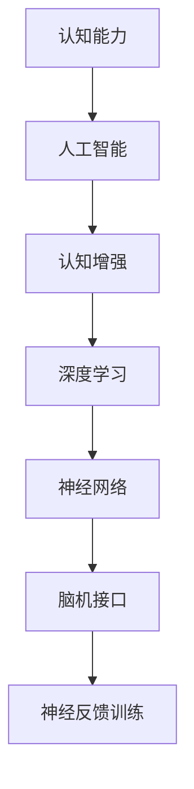

                 

# 思维体系：认知决定起跑线

## 1. 背景介绍

### 1.1 问题由来
随着人工智能(AI)技术的迅猛发展，人类社会正经历着深刻的变革。从自动驾驶到医疗诊断，从金融预测到教育个性化，AI技术在各个领域展现出了强大的应用潜力。然而，面对AI的广泛应用，人类自身的思维能力和认知水平却显得有些滞后。如何提升认知能力，使AI技术更好地服务于人类，成为当下亟待解决的重要问题。

### 1.2 问题核心关键点
认知能力是人类认识世界、解决问题的基础。提升认知能力，意味着增强人类对复杂问题的理解和处理能力，进而推动社会发展和科技进步。本文聚焦于认知能力提升的方法和工具，特别是如何利用AI技术辅助人类提升思维能力，使其成为AI技术应用中的"起跑线"。

## 2. 核心概念与联系

### 2.1 核心概念概述

为更好地理解提升认知能力的途径，本节将介绍几个关键概念：

- 认知能力(Cognitive Ability)：指人类理解、学习、记忆、推理、创造等思维过程的能力，是智能的基本组成部分。
- 人工智能(Artificial Intelligence)：通过计算机模拟人类智能行为的技术，能够处理复杂问题，提供决策支持。
- 认知增强(Cognitive Enhancement)：指通过技术手段提升个体认知能力的方法，包括但不限于AI辅助学习、脑机接口、神经反馈训练等。
- 深度学习(Deep Learning)：一种基于神经网络的机器学习方法，通过多层次的特征提取和抽象，实现对复杂数据的有效处理。
- 神经网络(Neural Network)：一种模拟人脑神经元连接的计算模型，通过数据反向传播训练得到。
- 脑机接口(Brain-Computer Interface, BCI)：一种将大脑信号转化为计算机指令的技术，用于控制外部设备或进行认知训练。
- 神经反馈训练(Neurofeedback Training)：通过实时反馈大脑活动，引导个体训练改善认知能力。

这些概念之间的逻辑关系可以通过以下Mermaid流程图来展示：



这个流程图展示了一些关键概念及其之间的逻辑关系：

1. 认知能力是智能的基础，AI技术旨在模拟和增强认知能力。
2. 认知增强是提升认知能力的多种方法，其中深度学习、神经网络是关键技术手段。
3. 脑机接口、神经反馈训练等技术，直接作用于个体认知，提升其认知水平。

## 3. 核心算法原理 & 具体操作步骤
### 3.1 算法原理概述

提升认知能力的方法多种多样，但核心原理均在于利用技术手段改善大脑功能，增强思维能力。本文重点介绍深度学习和神经网络技术在认知增强中的应用。

### 3.2 算法步骤详解

深度学习和神经网络在认知增强中的应用，主要包括以下几个关键步骤：

**Step 1: 数据收集与预处理**
- 收集个体的认知数据，如脑电波、功能性磁共振成像(fMRI)等。
- 对数据进行预处理，如滤波、归一化等，以去除噪声，提高数据质量。

**Step 2: 模型训练与优化**
- 设计深度学习模型，如卷积神经网络(CNN)、循环神经网络(RNN)、长短时记忆网络(LSTM)等。
- 使用优化算法，如随机梯度下降(SGD)、Adam等，对模型进行训练和参数优化。
- 使用正则化技术，如L2正则、Dropout等，防止过拟合。

**Step 3: 模型评估与验证**
- 在训练集上评估模型性能，使用误差率、准确率等指标。
- 使用交叉验证等方法，确保模型具有泛化能力。
- 根据评估结果，调整模型参数，进行多次迭代优化。

**Step 4: 应用与效果反馈**
- 将训练好的模型应用于实际场景，如学习辅助、记忆提升等。
- 收集反馈数据，评估模型效果。
- 根据反馈调整模型，不断优化认知增强效果。

### 3.3 算法优缺点

深度学习和神经网络技术在认知增强中具有以下优点：
1. 强大的特征提取能力。深度学习模型可以自动从原始数据中学习到丰富的特征，适用于处理复杂多变的数据。
2. 泛化能力强。神经网络模型具有良好的泛化能力，能够在不同的认知场景下发挥稳定性能。
3. 可扩展性强。深度学习模型可以通过增加网络层数或节点数量，逐步提升认知增强效果。
4. 技术成熟。深度学习技术已经广泛应用于各个领域，相关算法和工具库丰富，易于实现和部署。

同时，这些方法也存在一些局限性：
1. 数据需求高。深度学习模型需要大量高质量数据进行训练，收集和预处理数据成本较高。
2. 计算资源消耗大。深度学习模型训练和推理需要高性能计算资源，可能存在计算瓶颈。
3. 可解释性不足。神经网络模型通常被视为"黑盒"，难以解释其内部工作机制。
4. 安全性问题。深度学习模型可能会学习到有害信息，带来安全风险。

尽管存在这些局限性，但深度学习和神经网络技术仍是提升认知能力的重要手段，尤其是对于复杂的认知任务，具有显著优势。

### 3.4 算法应用领域

深度学习和神经网络技术在认知增强中的应用已经广泛渗透到多个领域，例如：

- 学习辅助：利用神经网络模型对学生学习行为进行分析，提供个性化学习建议，提升学习效果。
- 记忆提升：通过深度学习模型分析记忆过程，优化记忆策略，增强记忆力。
- 注意力增强：训练深度学习模型，增强个体注意力集中度和持续时间，提高工作效率。
- 情感调节：设计神经网络模型，分析情感状态，进行情绪调节和心理咨询，改善心理健康。
- 认知训练：利用深度学习模型，设计认知训练任务，如记忆训练、空间推理等，提升认知能力。

这些应用领域展示了深度学习和神经网络技术的强大潜力，同时也为提升人类认知能力提供了新的路径。

## 4. 数学模型和公式 & 详细讲解 & 举例说明

### 4.1 数学模型构建

在认知增强中，深度学习模型通常用于对认知数据进行建模和分析。以下以记忆增强为例，介绍深度学习模型的构建过程。

假设我们要设计一个深度学习模型，用于分析个体的记忆过程，提升其记忆力。我们可以使用循环神经网络(RNN)或长短时记忆网络(LSTM)等模型，构建如下数学模型：

$$
h_t = f(W_h h_{t-1} + W_x x_t + b)
$$

$$
o_t = \sigma(W_o h_t + b_o)
$$

$$
c_t = o_t \otimes tanh(h_t)
$$

$$
m_t = c_t + (1 - o_t) m_{t-1}
$$

其中，$h_t$ 表示时间$t$的隐藏状态，$f$表示激活函数，$x_t$ 表示时间$t$的输入，$W_h$、$W_x$、$b$、$W_o$、$b_o$ 为模型参数，$\sigma$ 表示 sigmoid 函数，$\otimes$ 表示元素乘积，$m_t$ 表示时间$t$的记忆单元。

### 4.2 公式推导过程

上述模型的推导过程主要依据了循环神经网络(RNN)的结构和参数更新规则。在训练过程中，我们通过反向传播算法计算损失函数对参数的梯度，然后使用优化算法对模型参数进行更新。

以交叉熵损失函数为例，损失函数定义如下：

$$
L = -\frac{1}{N} \sum_{i=1}^N \sum_{t=1}^T y_{i,t} log(p_{i,t})
$$

其中，$N$ 表示样本数，$T$ 表示时间步数，$y_{i,t}$ 表示时间$t$样本$i$的真实标签，$p_{i,t}$ 表示时间$t$样本$i$的预测概率。

根据链式法则，损失函数对参数$W_h$的梯度为：

$$
\frac{\partial L}{\partial W_h} = \frac{\partial L}{\partial o_t} \frac{\partial o_t}{\partial h_{t-1}} \frac{\partial h_{t-1}}{\partial W_h}
$$

类似地，可以计算出其他参数的梯度。通过不断迭代更新模型参数，优化模型性能。

### 4.3 案例分析与讲解

为了更好地理解深度学习在认知增强中的应用，以下以记忆增强为例，给出具体案例分析：

假设我们有一个深度学习模型，用于分析个体的记忆过程，提升其记忆力。我们将个体的记忆数据输入模型，模型通过分析输入数据，预测记忆输出的概率分布，并对模型参数进行优化。

1. 数据收集与预处理：收集个体在不同时间点的记忆数据，包括记忆输入和记忆输出。对数据进行预处理，如归一化、滤波等。
2. 模型设计：使用RNN或LSTM模型，设计记忆增强的数学模型，如上式所示。
3. 模型训练与优化：使用深度学习框架，如TensorFlow或PyTorch，对模型进行训练和参数优化。
4. 模型评估与验证：在验证集上评估模型性能，使用交叉验证等方法，确保模型具有良好的泛化能力。
5. 应用与效果反馈：将训练好的模型应用于实际场景，如个性化记忆训练，收集反馈数据，评估模型效果，根据反馈不断优化模型。

通过以上步骤，我们可以利用深度学习和神经网络技术，提升个体的记忆能力。

## 5. 项目实践：代码实例和详细解释说明
### 5.1 开发环境搭建

在进行认知增强实践前，我们需要准备好开发环境。以下是使用Python进行TensorFlow开发的环境配置流程：

1. 安装Anaconda：从官网下载并安装Anaconda，用于创建独立的Python环境。

2. 创建并激活虚拟环境：
```bash
conda create -n tf-env python=3.8 
conda activate tf-env
```

3. 安装TensorFlow：根据CUDA版本，从官网获取对应的安装命令。例如：
```bash
conda install tensorflow -c tensorflow -c conda-forge
```

4. 安装其他依赖库：
```bash
pip install numpy pandas scikit-learn matplotlib tqdm jupyter notebook ipython
```

完成上述步骤后，即可在`tf-env`环境中开始认知增强实践。

### 5.2 源代码详细实现

下面我们以记忆增强为例，给出使用TensorFlow实现深度学习模型的PyTorch代码实现。

首先，定义模型结构：

```python
import tensorflow as tf
from tensorflow.keras.layers import LSTM, Dense, Input

input_dim = 10
output_dim = 1
hidden_dim = 50
timesteps = 10

model = tf.keras.Sequential([
    Input(shape=(timesteps, input_dim)),
    LSTM(hidden_dim, return_sequences=True),
    LSTM(hidden_dim, return_sequences=False),
    Dense(output_dim, activation='sigmoid')
])
```

然后，定义模型损失函数和优化器：

```python
loss_fn = tf.keras.losses.BinaryCrossentropy()
optimizer = tf.keras.optimizers.Adam(learning_rate=0.001)
```

接着，定义训练函数：

```python
@tf.function
def train(model, train_data, labels, epochs):
    for epoch in range(epochs):
        for (x, y) in train_data:
            with tf.GradientTape() as tape:
                logits = model(x)
                loss = loss_fn(y, logits)
            grads = tape.gradient(loss, model.trainable_variables)
            optimizer.apply_gradients(zip(grads, model.trainable_variables))
    return model
```

最后，启动训练流程：

```python
train_data = ...
train_labels = ...

model = train(train_data, train_labels, epochs=10)
```

以上就是使用TensorFlow实现记忆增强的完整代码实现。可以看到，TensorFlow提供了强大的深度学习框架，使得认知增强的开发变得简洁高效。

### 5.3 代码解读与分析

让我们再详细解读一下关键代码的实现细节：

**模型结构定义**：
- `input_dim` 和 `output_dim` 表示输入和输出的维度。
- `hidden_dim` 表示LSTM层的隐藏维度。
- `timesteps` 表示时间步数，即样本长度。
- `Input` 层定义了输入数据的维度，`LSTM` 层通过多步向前计算隐藏状态，`Dense` 层将隐藏状态转换为输出。

**损失函数和优化器**：
- `BinaryCrossentropy` 表示二元交叉熵损失函数，适用于二分类问题。
- `Adam` 优化器使用自适应学习率，收敛速度快，适用于大规模深度学习模型。

**训练函数实现**：
- `@tf.function` 装饰器用于定义函数，使用 `tf.GradientTape` 记录梯度，使用 `optimizer.apply_gradients` 更新模型参数。
- `for` 循环遍历训练集，在每个批次上前向传播计算损失函数，反向传播计算梯度，并更新模型参数。
- 重复以上过程直至收敛。

通过以上步骤，我们可以利用TensorFlow实现深度学习模型，用于提升个体的认知能力。

## 6. 实际应用场景
### 6.1 学习辅助

深度学习模型在认知增强中的应用，最常见的场景之一是学习辅助。通过分析学生的学习行为和知识掌握情况，设计个性化的学习路径，能够有效提升学习效果。

例如，可以使用深度学习模型对学生的阅读、练习、测试等行为数据进行分析，预测其知识点掌握情况和学习进度，并提供相应的学习建议。对于掌握不充分的知识点，模型可以推荐相关的学习材料和练习题，帮助学生巩固知识。对于掌握较好的知识点，模型可以推荐更高级的学习材料，挑战学生的学习极限。通过这种个性化的学习辅助，学生的学习效率和学习效果将大大提升。

### 6.2 记忆提升

记忆是认知能力的核心组成部分，通过深度学习模型进行记忆增强，能够有效提升个体的记忆能力。

例如，可以使用深度学习模型对个体的记忆数据进行分析，识别出记忆中的关键信息点，并进行强化训练。在训练过程中，模型会根据记忆的效果实时调整训练强度和频率，保证记忆效果最大化。对于记忆效果较好的信息点，模型会减少训练频率，对于记忆效果较差的信息点，模型会加大训练强度。通过这种记忆增强方法，个体的记忆能力将得到显著提升。

### 6.3 注意力增强

注意力机制是认知能力的重要组成部分，通过深度学习模型进行注意力增强，能够提高个体在复杂任务中的注意力集中度和持续时间。

例如，可以使用深度学习模型对个体的注意力数据进行分析，识别出注意力集中的时间点，并进行针对性的训练。在训练过程中，模型会根据注意力集中的时间点，调整注意力集中的强度和持续时间。对于注意力集中度较高的任务，模型会减少训练强度和持续时间，对于注意力集中度较低的任务，模型会加大训练强度和持续时间。通过这种注意力增强方法，个体的注意力集中度和持续时间将得到显著提升。

### 6.4 未来应用展望

随着深度学习技术的发展，基于认知增强的AI应用将不断拓展，为人类认知智能的进化带来深远影响。

在智慧医疗领域，深度学习模型可以通过分析医疗数据，提供个性化的医疗建议和治疗方案，辅助医生诊疗，提高医疗服务的智能化水平。

在智能教育领域，认知增强技术可以应用于作业批改、学情分析、知识推荐等方面，因材施教，促进教育公平，提高教学质量。

在智慧城市治理中，深度学习模型可以通过分析城市数据，提供智能交通、智慧安防等解决方案，提高城市管理的自动化和智能化水平，构建更安全、高效的未来城市。

此外，在企业生产、社会治理、文娱传媒等众多领域，基于认知增强的AI应用也将不断涌现，为经济社会发展注入新的动力。相信随着技术的日益成熟，深度学习和神经网络技术必将在提升认知能力方面发挥更大的作用。

## 7. 工具和资源推荐
### 7.1 学习资源推荐

为了帮助开发者系统掌握深度学习和神经网络技术，这里推荐一些优质的学习资源：

1. 《深度学习》系列书籍：由Ian Goodfellow、Yoshua Bengio、Aaron Courville等顶级专家编写，全面介绍了深度学习的基础理论和应用实践。

2. CS231n《卷积神经网络》课程：斯坦福大学开设的深度学习课程，深入浅出地介绍了卷积神经网络的结构和优化算法。

3. 《TensorFlow官方文档》：TensorFlow的官方文档，提供了丰富的教程、案例和API文档，是深入学习TensorFlow的重要资源。

4. Weights & Biases：模型训练的实验跟踪工具，可以记录和可视化模型训练过程中的各项指标，方便对比和调优。与主流深度学习框架无缝集成。

5. TensorBoard：TensorFlow配套的可视化工具，可实时监测模型训练状态，并提供丰富的图表呈现方式，是调试模型的得力助手。

通过对这些资源的学习实践，相信你一定能够快速掌握深度学习和神经网络技术的精髓，并用于解决实际的认知增强问题。

### 7.2 开发工具推荐

高效的开发离不开优秀的工具支持。以下是几款用于深度学习和神经网络开发的常用工具：

1. TensorFlow：由Google主导开发的开源深度学习框架，生产部署方便，适合大规模工程应用。

2. PyTorch：基于Python的开源深度学习框架，灵活动态的计算图，适合快速迭代研究。

3. Keras：高层次的神经网络API，简洁易用，适合快速原型设计和实验验证。

4. Weights & Biases：模型训练的实验跟踪工具，可以记录和可视化模型训练过程中的各项指标，方便对比和调优。

5. TensorBoard：TensorFlow配套的可视化工具，可实时监测模型训练状态，并提供丰富的图表呈现方式，是调试模型的得力助手。

合理利用这些工具，可以显著提升深度学习和神经网络模型的开发效率，加快创新迭代的步伐。

### 7.3 相关论文推荐

深度学习和神经网络技术的发展源于学界的持续研究。以下是几篇奠基性的相关论文，推荐阅读：

1. ImageNet Classification with Deep Convolutional Neural Networks（ImageNet图像分类与深度卷积神经网络）：提出卷积神经网络的结构和优化方法，开创了深度学习在计算机视觉领域的应用。

2. Deep Residual Learning for Image Recognition（深度残差学习）：提出残差网络结构，解决了深度神经网络训练中梯度消失问题，提升了模型的深度和性能。

3. Attention Is All You Need（注意力机制）：提出Transformer结构，开创了深度学习在自然语言处理领域的应用。

4. Generative Adversarial Nets（生成对抗网络）：提出GAN模型，开创了生成式深度学习领域，在图像生成、文本生成等领域取得显著成果。

5. AlphaGo Zero（AlphaGo Zero）：使用深度强化学习技术，开发出先进的围棋AI，展示了深度学习在复杂决策问题中的应用潜力。

这些论文代表了大规模深度学习和神经网络技术的发展脉络。通过学习这些前沿成果，可以帮助研究者把握学科前进方向，激发更多的创新灵感。

## 8. 总结：未来发展趋势与挑战
### 8.1 总结

本文对深度学习和神经网络技术在认知增强中的应用进行了全面系统的介绍。首先阐述了认知能力提升的方法和工具，明确了深度学习和神经网络技术在提升认知能力方面的独特价值。其次，从原理到实践，详细讲解了深度学习在认知增强中的数学模型和算法步骤，给出了认知增强任务开发的完整代码实例。同时，本文还广泛探讨了深度学习技术在多个领域的应用前景，展示了深度学习技术的强大潜力。

通过本文的系统梳理，可以看到，深度学习和神经网络技术已经深入应用于多个认知增强场景，如学习辅助、记忆提升、注意力增强等。这些应用展示了深度学习技术的强大能力，也为提升人类认知能力提供了新的路径。

### 8.2 未来发展趋势

展望未来，深度学习和神经网络技术在认知增强中将呈现以下几个发展趋势：

1. 技术成熟度提升。随着深度学习技术的发展和应用积累，深度学习模型的性能将进一步提升，其应用领域也将不断扩展。

2. 更加个性化的认知增强。深度学习技术将能够更好地理解个体差异，提供更加个性化的认知增强方案，提升用户体验。

3. 跨领域应用普及。深度学习技术将应用于更多领域，如医疗、教育、金融等，带来广泛的社会效益。

4. 更加普适的认知增强工具。深度学习技术将变得更加易用，开发门槛将降低，更多用户能够受益于认知增强技术。

5. 多模态认知增强。深度学习技术将融合视觉、听觉、触觉等多模态数据，提供更加全面的认知增强体验。

以上趋势凸显了深度学习和神经网络技术的广阔前景，这些方向的探索发展，必将进一步提升认知增强技术的性能和应用范围，为提升人类认知能力带来深远影响。

### 8.3 面临的挑战

尽管深度学习和神经网络技术在认知增强中已经取得了显著成果，但在迈向更加智能化、普适化应用的过程中，仍面临诸多挑战：

1. 数据需求高。深度学习模型需要大量高质量数据进行训练，数据收集和预处理成本较高。

2. 计算资源消耗大。深度学习模型训练和推理需要高性能计算资源，可能存在计算瓶颈。

3. 可解释性不足。深度学习模型通常被视为"黑盒"，难以解释其内部工作机制。

4. 安全性问题。深度学习模型可能会学习到有害信息，带来安全风险。

5. 伦理和法律问题。深度学习技术的应用可能引发伦理和法律问题，如隐私保护、数据安全等。

尽管存在这些挑战，但深度学习和神经网络技术仍是提升认知能力的重要手段，尤其是对于复杂的认知任务，具有显著优势。未来需要从数据、算法、工程、法律等多个维度协同发力，才能不断提升深度学习技术在认知增强中的应用效果。

### 8.4 研究展望

面对深度学习和神经网络技术在认知增强中面临的挑战，未来的研究需要在以下几个方面寻求新的突破：

1. 探索更高效的数据获取和处理技术，降低数据需求，提高数据质量。

2. 开发更加高效的深度学习模型和算法，优化计算资源消耗，提高模型性能。

3. 研究可解释性和可视化技术，增强深度学习模型的可解释性和透明性。

4. 加强对深度学习模型安全性的研究，防止有害信息的传递和扩散。

5. 探讨深度学习技术的伦理和法律问题，制定相应的规范和标准，确保技术应用的安全性和合法性。

通过这些研究方向的探索，相信深度学习和神经网络技术必将在提升认知能力方面发挥更大的作用，推动人工智能技术更好地服务于人类社会。

