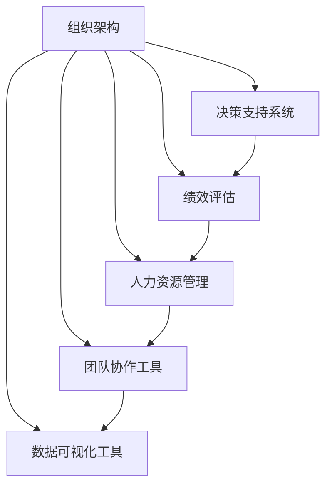

                 

# 思维工具在管理中的实际应用

> 关键词：管理工具, 组织架构, 决策支持系统, 绩效评估, 人力资源, 团队协作

## 1. 背景介绍

### 1.1 问题由来
随着企业的不断发展壮大，管理层在业务增长和效率提升方面面临越来越大的挑战。传统的手工记录、报表分析和决策方法已经难以应对日益复杂的信息需求和快速变化的市场环境。在这一背景下，各类管理工具和系统应运而生，成为现代企业进行高效管理、决策支持和资源配置的重要手段。

近年来，人工智能和大数据技术在各个行业中的应用愈发广泛，为企业提供了前所未有的数据驱动决策支持能力。特别是在管理领域，思维工具的应用已成为企业提升竞争力的重要工具。通过引入先进的数据分析、智能决策和团队协作工具，企业能够更好地整合资源，提升管理效率，优化决策过程，驱动业务持续增长。

### 1.2 问题核心关键点
本文聚焦于企业在管理中如何应用思维工具，深入探讨了以下几个核心关键点：

- 组织架构与思维工具：现代企业如何通过思维工具优化组织架构设计，提升组织效率和敏捷性。
- 决策支持系统与思维工具：利用数据驱动决策的思维工具，如何帮助企业更好地理解市场动态，制定高效战略。
- 绩效评估与思维工具：思维工具在企业绩效评估中的应用，包括基于数据的绩效监控和分析。
- 人力资源管理与思维工具：利用智能化的思维工具，提升人力资源管理效率和员工满意度。
- 团队协作与思维工具：通过工具化的思维工具，实现高效、实时的团队协作和知识共享。

这些核心关键点围绕企业管理的全流程，涵盖了从组织架构设计到绩效评估，再到团队协作的方方面面。通过深入理解这些关键点，可以帮助企业管理者更好地应用思维工具，实现企业的数字化转型和智能化升级。

### 1.3 问题研究意义
研究思维工具在企业管理中的应用，对于企业实现智能化管理，提升竞争力和效率具有重要意义：

- 降低管理成本：思维工具可以自动化处理大量重复性工作，如数据报表生成、绩效分析等，显著降低管理成本。
- 提高决策速度：利用大数据和人工智能技术，企业能够更快地做出数据驱动的决策，增强市场反应速度。
- 优化资源配置：通过思维工具对组织资源进行更精准的配置和调度，提升资源利用率。
- 增强员工参与：借助思维工具，员工可以更高效地参与管理和决策，提升整体工作效率和团队协作。
- 推动创新发展：思维工具为企业的创新发展提供了新思路和新方法，帮助企业快速适应市场变化，把握新的发展机遇。

## 2. 核心概念与联系

### 2.1 核心概念概述

为更好地理解思维工具在企业管理中的应用，本节将介绍几个密切相关的核心概念：

- **组织架构**：企业为实现目标而设立的分工合作关系，通常包括层级结构、部门设置等要素。
- **决策支持系统(DSS)**：通过数据和计算技术，辅助管理层进行决策支持的系统。
- **绩效评估**：基于一定标准对组织或员工的实际工作进行评价和分析的过程。
- **人力资源管理**：企业根据自身发展战略，通过招聘、培训、绩效管理等手段，实现人力资源的最优配置和利用。
- **团队协作工具**：用于支持团队成员之间的沟通、协作和知识共享的平台或工具。
- **数据可视化工具**：将复杂的数据信息转化为直观图表，辅助决策和分析的工具。

这些核心概念之间的逻辑关系可以通过以下Mermaid流程图来展示：



这个流程图展示了几类思维工具在企业管理中的联系和作用：

1. 组织架构通过合理设计，为其他管理工具的部署和应用提供基础。
2. 决策支持系统依赖组织架构和绩效评估，生成数据驱动的决策建议。
3. 绩效评估通过与决策支持系统相结合，实现对业务运营的监控和优化。
4. 人力资源管理与团队协作工具相互配合，提升人员管理和团队合作效率。
5. 数据可视化工具为其他管理工具提供直观的数据展示，辅助分析和决策。

## 3. 核心算法原理 & 具体操作步骤
### 3.1 算法原理概述

思维工具在企业管理中的应用，本质上是利用数据、计算和算法，对企业运营中的各类信息和过程进行量化、优化和协同。其核心算法原理主要包括：

- **数据驱动决策**：通过收集、处理和分析企业内外部的各类数据，辅助管理层做出决策。
- **模型预测与优化**：利用统计学和运筹学模型，对企业运营进行预测和优化，提高资源配置效率。
- **自然语言处理(NLP)**：通过NLP技术，实现对大量文本数据的分析和理解，提升团队协作和信息沟通效率。

这些算法原理共同构成了思维工具在企业管理中的应用框架，使其能够有效地支持企业战略决策、绩效管理、人力资源优化和团队协作等关键环节。

### 3.2 算法步骤详解

在实际应用中，思维工具的应用一般包括以下几个关键步骤：

**Step 1: 数据收集与预处理**
- 收集企业运营中的各类数据，包括财务数据、运营数据、员工数据等。
- 清洗、整理和标准化数据，去除噪音和异常值，保证数据质量。
- 使用ETL工具进行数据抽取、转换和加载，构建统一的数据仓库。

**Step 2: 数据分析与建模**
- 对数据仓库中的数据进行探索性分析，识别关键指标和模式。
- 利用统计学、机器学习和运筹学等模型，进行数据建模和预测分析。
- 使用数据可视化工具，将分析结果直观展示，辅助管理决策。

**Step 3: 决策支持与优化**
- 将分析结果输入决策支持系统，生成数据驱动的决策建议。
- 结合组织架构和绩效评估，制定优化方案和策略。
- 利用团队协作工具，在团队中分享决策建议，并实施优化方案。

**Step 4: 绩效监控与反馈**
- 通过绩效评估工具，对优化效果进行持续监控和评估。
- 根据评估结果，调整和优化决策方案，不断提升管理效率。
- 收集员工反馈，进一步优化人力资源管理和团队协作工具。

**Step 5: 持续改进与迭代**
- 对整个思维工具应用流程进行复盘和评估，识别改进点。
- 结合企业发展战略和市场需求，迭代思维工具的模型和算法。
- 推动思维工具在企业内部的广泛应用和深度整合。

以上是思维工具在企业管理中的一般流程。在实际应用中，还需要根据企业具体需求，对各环节进行优化和定制。

### 3.3 算法优缺点

思维工具在企业管理中的应用具有以下优点：

- **数据驱动决策**：通过数据支持决策，减少主观偏见，提高决策科学性和准确性。
- **高效优化资源**：利用模型和算法优化资源配置，提升资源利用效率。
- **提高团队协作效率**：通过团队协作工具，增强团队信息共享和沟通协作，提升团队凝聚力。

同时，思维工具在应用中也存在一些局限性：

- **数据质量依赖**：工具的效果依赖于数据的准确性和完整性，数据质量不高时，可能影响分析结果。
- **技术门槛较高**：应用思维工具需要具备一定的数据科学和系统集成能力，对企业技术团队提出较高要求。
- **用户习惯调整**：企业内部需要适应新的工具和流程，用户习惯的改变需要一定的时间。
- **隐私与安全问题**：数据处理和共享过程中，需要关注隐私和数据安全问题，防止数据泄露。

尽管存在这些局限性，但就目前而言，思维工具已成为企业管理中不可或缺的一部分。未来相关研究的重点在于如何进一步降低技术门槛，提高数据质量，优化工具使用体验，以及加强数据隐私和安全保护。

### 3.4 算法应用领域

思维工具在企业管理中的应用领域非常广泛，涵盖了从战略规划到日常运营的各个环节。以下是几个典型应用场景：

- **战略规划与决策支持**：利用DSS和大数据技术，支持企业进行市场预测、竞争分析、战略规划等决策活动。
- **绩效评估与管理**：通过绩效评估工具，实现对组织和员工的全面监控和绩效分析，支持薪酬激励和晋升决策。
- **人力资源管理**：利用HRMIS和团队协作工具，优化招聘、培训、绩效管理和员工关系管理，提升人力资源管理效率。
- **供应链管理**：通过数据分析和优化模型，优化供应链流程，提高物流效率和库存管理水平。
- **客户关系管理**：通过客户数据分析和CRM系统，提升客户满意度，实现个性化服务和营销。

## 4. 数学模型和公式 & 详细讲解  
### 4.1 数学模型构建

本节将使用数学语言对思维工具在企业管理中的应用进行更加严格的刻画。

设企业运营数据集为 $D=\{(x_i, y_i)\}_{i=1}^N$，其中 $x_i$ 为输入特征，$y_i$ 为输出结果。企业管理的任务可以抽象为以下几个数学模型：

- **组织架构模型**：$A(x) = \sum_i a_i x_i$，其中 $a_i$ 为组织架构中各要素的权重系数。
- **决策支持模型**：$D(x) = f(x; \theta)$，其中 $f$ 为决策支持算法，$\theta$ 为算法参数。
- **绩效评估模型**：$P(x) = g(x; \beta)$，其中 $g$ 为绩效评估函数，$\beta$ 为评估参数。
- **人力资源管理模型**：$H(x) = h(x; \alpha)$，其中 $h$ 为人力资源管理算法，$\alpha$ 为管理参数。
- **团队协作模型**：$T(x) = t(x; \gamma)$，其中 $t$ 为团队协作算法，$\gamma$ 为协作参数。

这些模型通过输入特征 $x$ 和算法参数，输出相应的管理结果。实际应用中，需要根据企业具体情况选择合适的模型，并进行参数训练和优化。

### 4.2 公式推导过程

以下我们以决策支持系统的构建为例，推导其中的核心算法和公式。

**决策支持算法**：
设企业运营数据集为 $D=\{(x_i, y_i)\}_{i=1}^N$，其中 $x_i$ 为输入特征，$y_i$ 为输出结果。假设决策支持算法为 $f(x; \theta)$，其中 $\theta$ 为算法参数。则通过最小二乘法拟合，可以得到最优参数：

$$
\theta^* = \mathop{\arg\min}_{\theta} \sum_i (y_i - f(x_i; \theta))^2
$$

利用梯度下降算法，计算损失函数对参数 $\theta$ 的梯度，并更新参数：

$$
\theta \leftarrow \theta - \eta \nabla_{\theta} \mathcal{L}(\theta)
$$

其中 $\mathcal{L}(\theta)$ 为损失函数，$\eta$ 为学习率。

**绩效评估算法**：
设绩效评估模型为 $g(x; \beta)$，其中 $\beta$ 为评估参数。假设绩效评估指标为 $k$，则可以通过线性回归或Logistic回归等模型进行评估：

$$
\hat{y} = g(x; \beta) = \beta_0 + \sum_i \beta_i x_i
$$

评估指标 $k$ 可以表示为：

$$
k(x) = \max_i \{y_i - \hat{y}_i\}
$$

其中 $\hat{y}_i$ 为预测值。

### 4.3 案例分析与讲解

以某制造企业为例，分析思维工具在绩效评估中的应用。假设该企业希望通过绩效评估工具，提升生产效率和员工满意度。其运营数据包括生产量、设备利用率、员工加班时间等特征 $x$，以及绩效指标 $y$（如生产效率、员工满意度等）。

假设使用线性回归模型进行绩效评估，则可得：

$$
\hat{y} = \beta_0 + \sum_i \beta_i x_i
$$

根据实际运营数据，训练模型参数 $\beta$，并计算每个员工的生产效率和满意度预测值。通过将预测值与实际绩效指标对比，发现员工加班时间与生产效率、满意度之间的关系，调整生产计划和员工管理策略。

## 5. 项目实践：代码实例和详细解释说明
### 5.1 开发环境搭建

在进行思维工具应用实践前，我们需要准备好开发环境。以下是使用Python进行数据分析和模型训练的环境配置流程：

1. 安装Anaconda：从官网下载并安装Anaconda，用于创建独立的Python环境。

2. 创建并激活虚拟环境：
```bash
conda create -n analysis-env python=3.8 
conda activate analysis-env
```

3. 安装必要的Python包：
```bash
conda install numpy pandas scipy scikit-learn statsmodels matplotlib seaborn
```

4. 安装Jupyter Notebook和JupyterLab：
```bash
conda install jupyterlab
jupyter lab --generate-config
jupyter lab start
```

5. 安装必要的R包：
```bash
conda install rpy2
```

完成上述步骤后，即可在`analysis-env`环境中开始思维工具的开发和实践。

### 5.2 源代码详细实现

下面我们以某制造企业为例，给出使用Python和R语言对绩效评估进行模型训练的代码实现。

**Python部分**：

首先，定义性能评估的数据集：

```python
import pandas as pd

# 加载数据集
df = pd.read_csv('performance_data.csv')

# 数据预处理
X = df[['加班时间', '生产量', '设备利用率']]
y = df['生产效率']
```

然后，构建线性回归模型并进行训练：

```python
from sklearn.linear_model import LinearRegression

# 初始化模型
model = LinearRegression()

# 训练模型
model.fit(X, y)
```

接着，进行模型评估和预测：

```python
from sklearn.metrics import r2_score

# 评估模型
y_pred = model.predict(X)
print('R2 Score:', r2_score(y, y_pred))

# 预测新数据
new_data = [[30, 100, 0.8]]  # 加班时间30小时，生产量100，设备利用率80%
new_pred = model.predict(new_data)
print('预测值:', new_pred)
```

**R语言部分**：

首先，加载R语言的数据集：

```R
library(tidyverse)
library(dplyr)

# 加载数据集
data <- read.csv('performance_data.csv', header = TRUE)
```

然后，构建线性回归模型并进行训练：

```R
# 初始化模型
model <- lm(生产效率 ~ 加班时间 + 生产量 + 设备利用率, data = data)

# 训练模型
summary(model)
```

接着，进行模型评估和预测：

```R
# 评估模型
predictions <- predict(model, newdata = data.frame(加班时间 = c(30), 生产量 = c(100), 设备利用率 = c(0.8)))
rmse <- sqrt(mean((y - predictions)^2))
print(paste('RMSE:', rmse))

# 预测新数据
new_data <- data.frame(加班时间 = 30, 生产量 = 100, 设备利用率 = 0.8)
new_pred <- predict(model, newdata = new_data)
print(paste('预测值:', new_pred))
```

以上就是使用Python和R语言对绩效评估进行模型训练的完整代码实现。可以看到，通过简单的Python和R代码，就可以构建和训练线性回归模型，进行绩效评估和预测。

### 5.3 代码解读与分析

让我们再详细解读一下关键代码的实现细节：

**数据加载和预处理**：
- 使用Pandas和Dplyr进行数据加载和预处理，确保数据格式和处理的一致性。

**模型构建和训练**：
- 利用Scikit-Learn和R语言的lm函数，构建线性回归模型。
- 使用训练数据进行模型拟合，得到最优参数。

**模型评估和预测**：
- 利用Scikit-Learn的R2_score和R语言的RMSE，评估模型性能。
- 使用训练好的模型对新数据进行预测，提供未来绩效的参考。

可以看到，通过Python和R语言，思维工具的开发和应用可以变得非常简洁高效。开发者可以根据具体需求，灵活选择工具和技术，实现更高效的决策支持和管理优化。

## 6. 实际应用场景
### 6.1 智能生产管理

智能生产管理系统通过数据分析和优化模型，实现生产流程的智能化管理。例如，某制造企业通过引入智能生产管理系统，结合大数据分析工具，对生产设备的利用率、生产线的运行状态进行实时监控和优化，从而显著提升了生产效率和产品质量。

具体实现上，智能生产管理系统通过传感器和物联网设备收集实时生产数据，然后利用数据分析工具进行数据清洗和处理。结合统计学和运筹学模型，生成生产优化方案，实时调整生产计划和设备配置。通过团队协作工具，管理层和生产人员可以实时查看优化结果，共同协作完成生产任务的执行。

### 6.2 供应链优化

供应链优化系统通过数据分析和决策支持模型，提升供应链流程的效率和灵活性。例如，某零售企业通过引入供应链优化系统，对供应链的各个环节进行数据分析，优化库存管理、运输路线和供应商选择。

具体实现上，供应链优化系统通过数据分析工具对销售数据、库存数据、运输数据等进行建模和分析，生成供应链优化方案。结合DSS工具，管理层可以快速获取优化建议，调整供应链策略，实现资源的高效配置和利用。通过团队协作工具，各供应链环节的参与者可以实时沟通和协作，确保供应链运营的顺利进行。

### 6.3 客户关系管理

客户关系管理系统通过数据分析和智能推荐模型，提升客户满意度和市场响应速度。例如，某电商平台通过引入客户关系管理系统，对用户行为数据进行分析，生成个性化的推荐内容和营销方案，提升用户购买率和满意度。

具体实现上，客户关系管理系统通过数据分析工具对用户浏览记录、购买记录等行为数据进行分析，生成个性化推荐模型。结合推荐系统算法，生成推荐内容和营销方案，并通过团队协作工具进行营销活动的策划和执行。通过绩效评估工具，实时监控和评估营销效果，不断优化推荐策略。

## 7. 工具和资源推荐
### 7.1 学习资源推荐

为了帮助开发者系统掌握思维工具在企业管理中的应用，这里推荐一些优质的学习资源：

1. **《数据分析与决策支持系统》书籍**：系统讲解数据分析和决策支持系统的原理和应用，包括数据清洗、统计学模型、DSS工具等。

2. **Coursera《Data Science Specialization》课程**：由Johns Hopkins大学开设的系列课程，涵盖数据分析、机器学习、数据可视化等多个主题，适合初学者和进阶者。

3. **Kaggle竞赛平台**：Kaggle提供大量真实数据集和竞赛项目，适合实战演练数据分析和模型构建技能。

4. **Hadoop、Spark大数据平台**：用于处理大规模数据，提供数据湖和流计算等大数据分析能力。

5. **Tableau、Power BI数据可视化工具**：将复杂的数据信息转化为直观图表，辅助决策和分析。

通过对这些资源的学习实践，相信你一定能够快速掌握思维工具在企业管理中的应用，并用于解决实际的业务问题。

### 7.2 开发工具推荐

高效的开发离不开优秀的工具支持。以下是几款用于思维工具开发和应用的常用工具：

1. Python和R语言：数据分析和建模的首选语言，提供了丰富的数据分析和机器学习库。

2. Scikit-Learn、TensorFlow和Keras：用于构建和训练各种机器学习模型，支持深度学习和统计学模型。

3. Jupyter Notebook和JupyterLab：交互式编程环境，适合数据科学和算法开发。

4. R语言和ggplot2：数据可视化的利器，提供丰富的图表类型和定制化能力。

5. Tableau和Power BI：企业级数据可视化工具，支持复杂的数据分析和报表生成。

合理利用这些工具，可以显著提升思维工具在企业管理中的应用效率，加速创新迭代的步伐。

### 7.3 相关论文推荐

思维工具在企业管理中的应用源于学界的持续研究。以下是几篇奠基性的相关论文，推荐阅读：

1. **《大数据驱动的智能生产管理》**：介绍了大数据和人工智能在智能生产管理中的应用，提供了智能生产管理的案例和实践经验。

2. **《供应链优化算法与应用》**：系统讲解了供应链优化模型和算法，展示了供应链优化在实际中的应用效果。

3. **《客户关系管理系统的设计与实现》**：介绍了客户关系管理系统的构建思路和关键技术，提供了实际应用案例。

4. **《数据分析与决策支持系统》**：探讨了数据分析和决策支持系统的原理和应用，提供了详细的理论基础和实践指南。

5. **《思维工具在企业管理中的应用》**：分析了思维工具在企业管理中的应用案例和优化建议，提供了系统化的研究和总结。

这些论文代表了大数据和人工智能在企业管理中的应用脉络。通过学习这些前沿成果，可以帮助研究者把握学科前进方向，激发更多的创新灵感。

## 8. 总结：未来发展趋势与挑战
### 8.1 总结

本文对思维工具在企业管理中的应用进行了全面系统的介绍。首先阐述了企业在管理中面临的挑战，以及如何通过思维工具提升管理效率和决策水平。其次，从原理到实践，详细讲解了思维工具的数学模型和算法流程，提供了具体的代码实例和详细解释。最后，讨论了思维工具在不同领域的应用场景，并推荐了相关的学习资源和开发工具。

通过本文的系统梳理，可以看到，思维工具在企业管理中的应用正在成为企业提升竞争力、实现数字化转型的重要手段。利用数据和算法，企业能够更好地理解市场动态，优化资源配置，提升决策速度和精度，驱动业务持续增长。未来，伴随数据分析和算法技术的不断进步，思维工具必将在企业管理的各个环节发挥更大的作用，推动企业向更加智能化和高效化的方向发展。

### 8.2 未来发展趋势

展望未来，思维工具在企业管理中的应用将呈现以下几个发展趋势：

1. **智能化管理工具**：随着人工智能和大数据技术的进一步发展，思维工具将更加智能化和自动化，能够更好地支持企业决策和运营。

2. **实时分析与监控**：通过实时数据流处理和大数据分析，思维工具将能够对企业运营进行实时监控和优化，提升管理效率。

3. **跨领域融合**：思维工具将与物联网、区块链、人工智能等技术进行深度融合，提供更加全面、深入的决策支持和管理优化。

4. **个性化与定制化**：思维工具将根据企业具体情况进行个性化和定制化设计，提供量身定做的解决方案，满足企业独特需求。

5. **多模态数据整合**：思维工具将整合多模态数据（如文本、图像、视频等），提升数据的完整性和丰富性，增强决策的科学性和准确性。

6. **自适应与自学习**：思维工具将具备自适应和自学习能力，能够不断从新数据中学习和优化，保持其决策能力的持续提升。

以上趋势凸显了思维工具在企业管理中的广阔前景。这些方向的探索发展，必将进一步提升企业的智能化管理水平，推动企业向更加高效、智能化的方向发展。

### 8.3 面临的挑战

尽管思维工具在企业管理中的应用已经取得了显著成效，但在迈向更加智能化、普适化应用的过程中，它仍面临着诸多挑战：

1. **数据质量问题**：数据收集和处理过程中，可能存在数据缺失、噪音等问题，影响思维工具的性能。如何提升数据质量，是思维工具应用的难点之一。

2. **技术门槛较高**：思维工具的开发和应用需要一定的技术背景，对企业技术团队提出了较高要求。如何降低技术门槛，普及思维工具的应用，需要更多的培训和推广。

3. **隐私与安全问题**：在数据处理和共享过程中，需要关注隐私和数据安全问题，防止数据泄露和滥用。如何加强隐私保护和数据安全，是思维工具应用的重要挑战。

4. **用户习惯调整**：企业内部需要适应新的工具和流程，用户习惯的改变需要一定的时间。如何加速用户习惯的调整，提高工具的接受度和应用效果，需要企业的持续努力。

5. **模型可解释性**：一些高级的思维工具，如深度学习模型，具有“黑盒”特性，难以解释其决策过程。如何提高模型的可解释性，增强用户信任和接受度，是思维工具应用的重要课题。

6. **成本与收益**：思维工具的应用需要一定的投入，包括设备、培训、维护等成本。如何平衡成本与收益，确保思维工具的投资回报，需要企业在实践中不断优化。

这些挑战需要通过技术创新、管理优化和实践积累，逐步克服，才能使思维工具在企业管理中发挥更大的价值。

### 8.4 研究展望

面对思维工具在企业管理中所面临的挑战，未来的研究需要在以下几个方面寻求新的突破：

1. **数据清洗与预处理技术**：研究更加高效、准确的数据清洗和预处理技术，提升数据质量，确保思维工具的性能和可靠性。

2. **智能化算法**：开发更加智能化、自适应的算法，提升思维工具的决策能力和适应性，增强其自主学习能力和自适应能力。

3. **可视化与交互设计**：研究更加直观、易用的可视化与交互设计技术，提升用户体验和工具的可操作性，增强用户对思维工具的接受度和使用效果。

4. **隐私保护与安全技术**：研究更加严格、全面的隐私保护和安全技术，确保数据处理和共享过程中的安全性，防止数据泄露和滥用。

5. **模型可解释性**：研究如何提高思维工具模型的可解释性，增强其决策过程的透明度和可信度，提高用户信任和接受度。

6. **成本效益分析**：研究如何通过思维工具的优化和优化策略，降低企业的投入成本，提升投资回报率，确保思维工具的可持续发展。

这些研究方向的探索，必将引领思维工具在企业管理中的应用走向更高的台阶，为企业的智能化管理提供更强大的支持。面向未来，思维工具需要在技术创新、管理优化和实践积累等方面协同发力，共同推动企业向更加高效、智能化的方向发展。

## 9. 附录：常见问题与解答

**Q1：思维工具在企业管理中主要有哪些应用场景？**

A: 思维工具在企业管理中的应用场景非常广泛，涵盖从战略规划到日常运营的各个环节。以下是几个典型应用场景：

1. **战略规划与决策支持**：通过DSS和大数据技术，支持企业进行市场预测、竞争分析、战略规划等决策活动。

2. **绩效评估与管理**：通过绩效评估工具，实现对组织和员工的全面监控和绩效分析，支持薪酬激励和晋升决策。

3. **人力资源管理**：利用HRMIS和团队协作工具，优化招聘、培训、绩效管理和员工关系管理，提升人力资源管理效率。

4. **供应链管理**：通过数据分析和优化模型，优化供应链流程，提高物流效率和库存管理水平。

5. **客户关系管理**：通过数据分析和智能推荐模型，提升客户满意度和市场响应速度。

6. **智能生产管理**：通过数据分析和优化模型，实现生产流程的智能化管理，提升生产效率和产品质量。

**Q2：思维工具在应用过程中需要注意哪些问题？**

A: 思维工具在应用过程中需要注意以下几个问题：

1. **数据质量依赖**：工具的效果依赖于数据的准确性和完整性，数据质量不高时，可能影响分析结果。

2. **技术门槛较高**：应用思维工具需要具备一定的数据科学和系统集成能力，对企业技术团队提出较高要求。

3. **用户习惯调整**：企业内部需要适应新的工具和流程，用户习惯的改变需要一定的时间。

4. **隐私与安全问题**：在数据处理和共享过程中，需要关注隐私和数据安全问题，防止数据泄露。

5. **模型可解释性**：一些高级的思维工具，如深度学习模型，具有“黑盒”特性，难以解释其决策过程。

6. **成本与收益**：思维工具的应用需要一定的投入，包括设备、培训、维护等成本，需要企业在实践中不断优化。

这些问题的解决需要企业在应用思维工具时，进行全面评估和规划，确保工具的顺利应用和效果提升。

**Q3：如何提升思维工具在企业管理中的应用效果？**

A: 提升思维工具在企业管理中的应用效果，可以从以下几个方面入手：

1. **数据质量管理**：建立完善的数据采集、清洗和处理流程，确保数据的高质量。

2. **技术培训与支持**：加强对企业技术团队的技术培训和支持，提升团队的数据科学和系统集成能力。

3. **用户习惯调整**：通过推广和培训，帮助企业内部逐步适应新的工具和流程，提高用户习惯的调整速度。

4. **隐私保护与安全措施**：加强数据隐私保护和数据安全措施，确保数据处理和共享过程中的安全性。

5. **模型可解释性提升**：研究如何提高思维工具模型的可解释性，增强其决策过程的透明度和可信度。

6. **成本效益分析**：通过思维工具的优化和优化策略，降低企业的投入成本，提升投资回报率。

这些措施的综合应用，将有助于提升思维工具在企业管理中的应用效果，推动企业向更加智能化、高效化的方向发展。

---

作者：禅与计算机程序设计艺术 / Zen and the Art of Computer Programming

