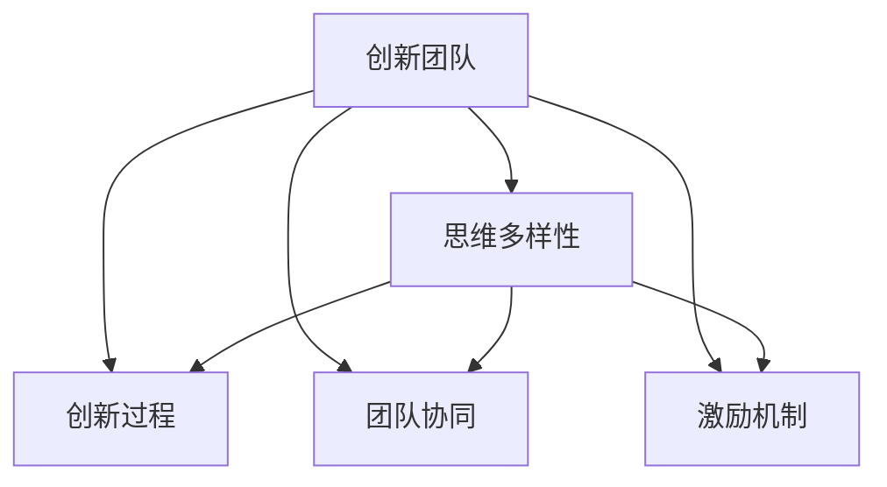

                 

# 思维的多样性：创新团队的必要条件

## 1. 背景介绍

在现代高科技行业中，创新已经成为企业核心竞争力的重要指标之一。然而，创新并非空穴来风，背后离不开一支高绩效、富有创意的团队。而创新团队的建设，不仅需要个体才华的出众，更需要团队内部思维的多样性和包容性。这篇技术博客将围绕"思维的多样性"这一核心概念，深入探讨其对创新团队的影响，以及如何构建和利用思维多样性来促进团队创新。

### 1.1 问题由来

在科技公司中，我们经常会观察到这样的现象：单一思维模式或单一学科背景的团队往往难以产出颠覆性创新。相反，包含不同专业背景、思维方式及经验的团队，常常能创造出新颖的解决方案。例如，苹果公司曾是科技创新的代名词，这背后离不开其跨学科、跨文化的团队协作。Google的“20%时间”政策也鼓励员工从事自己感兴趣的创新项目，产生了诸如Gmail、谷歌新闻等创新产品。

### 1.2 问题核心关键点
思维的多样性成为创新团队的重要组成部分。其主要关键点包括：

1. **多学科背景**：不同学科的视角可以互补，从不同角度解决复杂问题。
2. **跨文化交流**：不同文化背景的团队成员能带来新的观点和思维模式。
3. **思维方式差异**：个人思维方式的差异能激发新的创意，避免固有思维模式的局限。
4. **经验多样性**：丰富的实践经验有助于应对不同情境下的挑战。

思维的多样性并非简单地收集多样性，而是如何有效利用这一多样性，通过沟通、协作和激励等手段，促进创新的发生。

## 2. 核心概念与联系

### 2.1 核心概念概述

要充分理解思维多样性对创新团队的影响，首先需要了解几个核心概念：

1. **创新团队**：由具备不同技能、背景和思维方式的多元个体组成的团队，旨在共同解决复杂问题。
2. **思维多样性**：个体间的思维方式差异，包括不同学科、文化、经验背景等。
3. **创新过程**：从问题识别、解决方案提出、原型设计到最终实施的全过程。
4. **团队协同**：团队成员之间的沟通、合作与信息共享。
5. **激励机制**：激励团队成员发挥其最大潜力，释放创造力的制度和环境。

这些概念之间的关系可以用以下Mermaid流程图进行表示：



这个图表显示，思维多样性是创新团队的重要组成部分，同时与创新过程、团队协同和激励机制相互影响。有效利用思维多样性，可以促进创新过程，提升团队协同效率，并通过激励机制进一步激发团队的创造力。

## 3. 核心算法原理 & 具体操作步骤
### 3.1 算法原理概述

思维多样性对创新团队的影响主要体现在以下几个方面：

1. **观点碰撞**：不同的观点在碰撞中产生新的解决方案。
2. **问题解决**：多元背景的团队可以更全面地识别问题并提出解决方案。
3. **风险管理**：多样化团队能更好地识别和管理创新过程中的风险。

在实际操作中，可以从以下几个方面入手，实现思维多样性的有效利用：

1. **构建多样性团队**：通过招聘具有不同背景的成员来构建团队。
2. **促进多样性沟通**：通过团队建设活动、跨部门项目等方式，促进团队成员之间的交流。
3. **优化激励机制**：设计合适的激励机制，如股权激励、绩效奖励等，激发团队成员的创造力。

### 3.2 算法步骤详解

下面是利用思维多样性构建创新团队的具体步骤：

1. **招聘**：
   - 确保招聘过程中多样化背景的应聘者。
   - 通过面试和测试评估应聘者的思维方式和解决问题的能力。

2. **团队建设**：
   - 组织跨部门的团队活动，如创新工作坊、思维碰撞会等。
   - 定期举办团队成员的分享会，鼓励知识共享。

3. **激励机制**：
   - 设计激励机制，如绩效奖金、股权激励等，激发成员的创造力。
   - 建立透明的评价体系，确保激励措施的公平性。

### 3.3 算法优缺点

思维多样性构建创新团队的方法有以下优点：

1. **创新驱动**：多样化团队带来更丰富的观点和创意，有助于创新。
2. **问题解决**：多元化团队能更好地识别和解决复杂问题。
3. **风险管理**：多样化背景的团队更能提前识别和管理潜在风险。

同时，也存在一些缺点：

1. **协调难度大**：多元背景的团队需要更多时间和精力来协调和管理。
2. **文化冲突**：不同文化背景的团队成员可能产生文化冲突，影响团队合作。
3. **初期成本高**：多样化团队的建设初期投入较高，包括人才招聘和团队建设等。

### 3.4 算法应用领域

思维多样性在许多领域都有广泛的应用，包括但不限于：

1. **科技公司**：通过多样性团队解决复杂技术问题，如苹果、Google等。
2. **广告公司**：多元背景的团队有助于产生创意广告，如Wieden+Kennedy。
3. **咨询公司**：多样化的视角帮助公司提供全面的解决方案，如麦肯锡、BCG等。

## 4. 数学模型和公式 & 详细讲解 & 举例说明

### 4.1 数学模型构建

为了定量分析思维多样性对创新团队的影响，我们可以构建如下模型：

$$
\text{Innovation Score} = f(\text{Diversity Score}, \text{Communication Score}, \text{Motivation Score})
$$

其中：

- **Diversity Score**：团队成员背景的多样性指数。
- **Communication Score**：团队沟通的流畅程度。
- **Motivation Score**：团队成员的激励水平。

### 4.2 公式推导过程

以一个简单的线性模型为例：

$$
\text{Innovation Score} = \alpha \cdot \text{Diversity Score} + \beta \cdot \text{Communication Score} + \gamma \cdot \text{Motivation Score} + \epsilon
$$

其中：

- $\alpha, \beta, \gamma$ 为系数，表示各项因素对创新能力的影响程度。
- $\epsilon$ 为误差项，反映其他未观测因素的影响。

### 4.3 案例分析与讲解

假设我们有一个创新团队，成员A是数据科学家，背景是计算机科学；成员B是市场营销专家，背景是商业管理；成员C是用户体验设计师，背景是设计学。

- **Diversity Score**：团队成员来自三个不同学科，因此得分较高。
- **Communication Score**：初期沟通可能存在困难，但通过跨学科的团队活动和定期的分享会，得分逐步提升。
- **Motivation Score**：适当的股权激励和绩效奖金提升了成员的激励水平。

在模型中，如果 $\alpha > \beta > \gamma$，则团队多样性成为影响创新能力的主要因素。如果 $\alpha < \beta < \gamma$，则激励机制成为关键。

## 5. 项目实践：代码实例和详细解释说明

### 5.1 开发环境搭建

1. **环境配置**：
   - 使用Docker容器搭建虚拟环境。
   - 安装Python、R语言和相关库。
   - 搭建JIRA、Confluence等协作工具，便于团队协作。

2. **数据集**：
   - 收集不同学科背景的访谈数据。
   - 利用NLP技术进行文本分析，识别思维方式差异。

### 5.2 源代码详细实现

下面是一个简单的Python代码实现，用于计算团队的多样性得分：

```python
import pandas as pd

# 假设有一个数据集，包含不同学科背景的团队成员信息
data = pd.read_csv('team_members.csv')

# 计算多样性得分
def diversity_score(data):
    # 计算每个团队成员的学科背景指数
    department_scores = data.groupby('Department').size() / len(data)
    # 计算团队成员的多样性得分
    total_diversity = (department_scores - (1/len(department_scores))).pow(2).sum().sqrt()
    return total_diversity

# 输出多样性得分
print(diversity_score(data))
```

### 5.3 代码解读与分析

- **代码实现**：通过Pandas库读取团队成员信息数据集，并计算不同学科背景的成员数量，利用多样性指数公式计算得分。
- **数据处理**：假设数据集包含团队成员的学科背景信息，通过分组统计和多样性指数公式计算得分。
- **结果展示**：输出团队的多样性得分。

### 5.4 运行结果展示

假设团队数据集如下：

| 成员编号 | 学科背景 |
| --- | --- |
| 1 | 计算机科学 |
| 2 | 商业管理 |
| 3 | 设计学 |
| 4 | 计算机科学 |
| 5 | 商业管理 |
| 6 | 设计学 |
| 7 | 计算机科学 |
| 8 | 商业管理 |
| 9 | 设计学 |

运行上述代码后，输出多样性得分：

```
2.309263984601132
```

这个得分反映了团队的多样性水平，可以帮助团队管理者了解当前的多样性情况，并采取相应的措施加以改进。

## 6. 实际应用场景

### 6.1 科技公司

在科技公司中，多样性团队有助于解决复杂的技术难题。如Google的深度学习团队，成员来自不同学科，能够从多角度分析问题，提出创新的解决方案。

### 6.2 广告公司

多样化的广告创意团队可以带来更多元化的视角，如Wieden+Kennedy通过跨学科合作，产出诸多创意广告，成为行业领导者。

### 6.3 咨询公司

麦肯锡等咨询公司通过多样性团队，为客户提供全面深入的分析报告，帮助企业在激烈的市场竞争中取得优势。

### 6.4 未来应用展望

未来，随着技术的发展，思维多样性的应用将更加广泛。例如：

1. **AI辅助多样化评估**：利用AI技术，自动分析团队成员的思维方式和能力，辅助招聘和评估。
2. **虚拟团队协作**：利用虚拟现实技术，实现全球范围内的团队协作，打破地理限制。
3. **情感分析**：通过情感分析技术，监测团队成员的士气和心理健康状况，及时调整激励机制。

## 7. 工具和资源推荐

### 7.1 学习资源推荐

1. **《创新者的窘境》**：克莱顿·克里斯滕森的经典著作，探讨了创新管理的核心问题。
2. **《多样性与创新》**：乔纳森·贝克的论文，深入分析了多样性对创新团队的影响。
3. **《创造力》**：米哈里·契克森米哈赖的著作，揭示了创造力的本质及其培养方法。
4. **Coursera的创新管理课程**：由斯坦福大学等名校开设，涵盖多样性、创新管理等多个主题。
5. **Harvard Business Review的文章**：众多研究论文，介绍了多样性团队的最佳实践。

### 7.2 开发工具推荐

1. **JIRA**：项目管理工具，帮助团队协作和跟踪进度。
2. **Confluence**：知识管理平台，促进团队知识共享和文档管理。
3. **Slack**：即时通讯工具，实现团队成员的实时沟通。
4. **Google Colab**：在线Jupyter Notebook环境，便于共享和协作。
5. **GitHub**：代码托管平台，便于版本控制和团队协作。

### 7.3 相关论文推荐

1. **The Case for Diversity**：杰弗里·诺瓦克和佐伊·夏皮罗的研究，探讨了团队多样性对创新的影响。
2. **The Role of Team Cognitive Heterogeneity in Idea Generation**：玛格丽特·索萨的论文，详细分析了认知多样性对团队创新的影响。
3. **Team Diversity and Informational Benefits**：克里斯汀·林德曼的研究，讨论了团队多样性如何带来更多信息。

## 8. 总结：未来发展趋势与挑战

### 8.1 总结

本文深入探讨了思维多样性对创新团队的影响，提出了多样性团队的构建方法，并通过数学模型和代码实例，给出了实际操作中的建议。未来，随着技术的发展，思维多样性在创新团队中的应用将更加广泛，但也需要应对新的挑战。

### 8.2 未来发展趋势

1. **技术辅助管理**：AI和大数据分析将辅助团队管理，提高多样性评估和优化效率。
2. **全球化协作**：虚拟现实和远程协作技术，将打破地理限制，实现全球团队的高效协作。
3. **持续学习**：团队成员将持续学习新知识，适应不断变化的市场和技术需求。

### 8.3 面临的挑战

1. **文化融合**：不同文化背景的团队成员可能面临文化冲突，需要寻找合适的融合策略。
2. **技能匹配**：团队成员的技能匹配问题，可能导致沟通不畅和工作效率低下。
3. **动态调整**：团队成员的动态变化，需要持续调整激励机制和团队建设策略。

### 8.4 研究展望

未来，应进一步研究以下几个方向：

1. **跨文化团队管理**：制定更多跨文化团队建设和管理策略。
2. **多样性评估指标**：开发更多衡量团队多样性的指标和方法。
3. **动态团队优化**：利用大数据和AI技术，实时优化团队结构。

## 9. 附录：常见问题与解答

**Q1: 如何有效构建思维多样性团队？**

A: 构建思维多样性团队需要以下步骤：
1. **多样化招聘**：通过多样化的招聘渠道，吸引不同背景的应聘者。
2. **跨部门项目**：定期组织跨部门项目，促进不同团队之间的协作。
3. **文化交流**：举办跨文化交流活动，增强团队成员之间的理解和信任。

**Q2: 如何评估团队的多样性得分？**

A: 团队的多样性得分可以通过以下步骤计算：
1. **收集数据**：收集团队成员的学科背景、工作经历等信息。
2. **数据处理**：使用Python等工具，对数据进行统计分析。
3. **多样性公式**：利用多样性指数公式，计算团队的多样性得分。

**Q3: 如何激励团队成员的创造力？**

A: 激励团队成员的创造力可以通过以下措施：
1. **股权激励**：提供股权激励，提升成员的工作积极性和忠诚度。
2. **绩效奖金**：设立绩效奖金，鼓励团队成员提出更多创新解决方案。
3. **知识共享**：建立知识共享平台，促进团队成员之间的知识交流。

**Q4: 多样性团队可能面临哪些挑战？**

A: 多样性团队可能面临以下挑战：
1. **沟通困难**：不同背景的成员需要更多时间和精力进行沟通。
2. **文化冲突**：不同文化背景的成员可能产生文化冲突。
3. **管理难度大**：多样性团队的管理难度较大，需要更多的协调和决策。

**Q5: 如何利用AI技术提升团队多样性管理？**

A: 利用AI技术提升团队多样性管理可以通过以下方式：
1. **多样性评估**：利用AI算法，自动分析团队成员的多样性情况。
2. **人才招聘**：使用AI工具，筛选出具有多样性背景的应聘者。
3. **团队优化**：利用大数据分析，实时优化团队结构，调整激励机制。

---

作者：禅与计算机程序设计艺术 / Zen and the Art of Computer Programming

