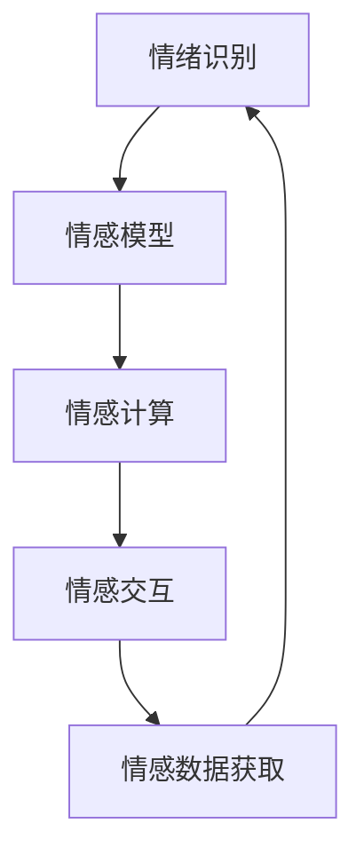

                 

# 情感AI：机器与人类情感的交互

> 关键词：情感计算, 情绪识别, 心理模型, 机器学习, 深度学习, 自然语言处理

## 1. 背景介绍

### 1.1 问题由来

随着科技的进步和社交媒体的兴起，人类之间的情感交流日益频繁且复杂化。情感计算（Affective Computing）正是在这一背景下应运而生。它旨在通过技术和算法理解和处理人类的情感，以实现更自然、更智能的机器与人类交互。

情感AI的应用领域广泛，涵盖社交媒体分析、客户服务、医疗诊断、教育评估等多个行业。比如，情感AI可以通过分析用户的文字、语音和面部表情，识别出其情绪状态，提供个性化的服务；在医疗领域，情感AI能够辅助医生识别患者的情感状态，提升诊疗效果；在教育领域，情感AI可以帮助教师评估学生的学习状态，进行个性化的教学设计。

然而，情感计算的难点在于情感的多样性和复杂性。人类的情感不仅包括基本情绪（如快乐、悲伤、愤怒等），还涉及到情绪强度、情绪变化过程等细微之处。因此，如何让机器更准确地理解和处理人类情感，成为当前情感AI研究的重点。

### 1.2 问题核心关键点

当前情感AI的主要研究核心包括：

1. **情绪识别**：识别用户的文字、语音和面部表情中的情绪状态，常用的方法包括机器学习、深度学习和自然语言处理（NLP）技术。

2. **情感模型**：构建能够反映人类情感变化和动态的模型，常用模型包括时间序列模型、因果模型和概率模型。

3. **情感计算**：使用以上技术和模型对人类情感进行量化和计算，常用的方法包括情感词典、情感评估和情感映射等。

4. **情感交互**：让机器能够以更加自然、个性化和富有同情心的方式与人类进行情感交流，常用的技术包括生成对抗网络（GANs）和情感模拟器等。

5. **情感数据获取**：收集和处理人类情感数据，常用的数据源包括社交媒体、视频监控、医疗记录等。

这些核心关键点共同构成了情感AI的研究框架，使得机器能够更好地理解和处理人类情感，推动情感计算技术的发展。

## 2. 核心概念与联系

### 2.1 核心概念概述

为更好地理解情感AI的实现过程，本节将介绍几个密切相关的核心概念：

- **情绪识别**：识别用户的文字、语音和面部表情中的情绪状态，常用的方法包括机器学习、深度学习和自然语言处理（NLP）技术。

- **情感模型**：构建能够反映人类情感变化和动态的模型，常用模型包括时间序列模型、因果模型和概率模型。

- **情感计算**：使用以上技术和模型对人类情感进行量化和计算，常用的方法包括情感词典、情感评估和情感映射等。

- **情感交互**：让机器能够以更加自然、个性化和富有同情心的方式与人类进行情感交流，常用的技术包括生成对抗网络（GANs）和情感模拟器等。

- **情感数据获取**：收集和处理人类情感数据，常用的数据源包括社交媒体、视频监控、医疗记录等。

这些核心概念之间的逻辑关系可以通过以下Mermaid流程图来展示：



这个流程图展示出情感AI的核心概念及其之间的关系：

1. 首先收集情感数据，构建情感模型，识别用户情绪。
2. 然后通过情感计算对用户情绪进行量化和分析。
3. 最后通过情感交互技术，让机器与用户进行情感交流。

这些概念共同构成了情感AI的工作流程，使其能够更好地理解和处理人类情感。通过理解这些核心概念，我们可以更好地把握情感AI的工作原理和优化方向。

## 3. 核心算法原理 & 具体操作步骤
### 3.1 算法原理概述

情感AI的核心算法包括情绪识别、情感模型和情感计算等。以情绪识别为例，其核心思想是通过机器学习或深度学习模型，从用户的文本、语音或面部表情中提取特征，识别出情绪状态。

情绪识别通常分为两步：

1. **特征提取**：将用户的文本、语音或面部表情转化为机器可识别的特征向量。
2. **分类识别**：使用机器学习或深度学习模型对特征向量进行分类，识别出情绪状态。

常用的特征提取方法包括自然语言处理（NLP）、语音信号处理（ASP）和计算机视觉（CV）等。常用的分类识别模型包括支持向量机（SVM）、随机森林（RF）、卷积神经网络（CNN）、循环神经网络（RNN）和变换器（Transformer）等。

### 3.2 算法步骤详解

以情绪识别为例，以下是情绪识别的详细算法步骤：

**Step 1: 数据预处理**

- 收集用户的文本、语音或面部表情数据。
- 对数据进行清洗、去噪和归一化处理。
- 将数据转化为数字化的特征向量。

**Step 2: 特征提取**

- 对于文本数据，使用NLP技术提取文本特征，如词向量、情感词典等。
- 对于语音数据，使用ASP技术提取语音特征，如MFCC、梅尔频谱等。
- 对于面部表情数据，使用CV技术提取面部特征，如面部表情编码等。

**Step 3: 模型训练**

- 选择适合的机器学习或深度学习模型，如SVM、RF、CNN、RNN或Transformer等。
- 使用标注好的数据集对模型进行训练，优化模型参数。
- 使用交叉验证等技术评估模型性能，选择合适的超参数。

**Step 4: 模型评估**

- 使用测试集对模型进行评估，计算准确率、召回率、F1值等指标。
- 使用混淆矩阵等工具分析模型的分类效果。
- 根据评估结果调整模型参数，进行模型优化。

**Step 5: 实际应用**

- 将训练好的模型部署到实际应用中，进行情绪识别。
- 实时采集用户的文本、语音或面部表情数据，输入到模型中进行情绪识别。
- 根据识别结果，进行个性化的情感交互和服务。

### 3.3 算法优缺点

情感AI的核心算法具有以下优点：

1. **高效准确**：机器学习或深度学习模型能够高效地处理大规模数据，并在识别准确率上表现优异。
2. **实时性高**：特征提取和分类识别等步骤可以在短时间内完成，实现实时情绪识别。
3. **可扩展性强**：基于数据驱动的方法可以不断优化模型，适应新数据和新任务。
4. **应用广泛**：情感AI可以应用于各种场景，如社交媒体分析、客户服务、医疗诊断等。

同时，这些算法也存在一定的局限性：

1. **数据依赖性强**：模型的性能高度依赖于训练数据的质量和数量，获取高质量数据成本较高。
2. **解释性不足**：机器学习或深度学习模型通常被视为“黑盒”系统，难以解释其内部工作机制。
3. **泛化能力有限**：模型可能对新数据或领域泛化能力较弱，需要针对具体任务进行调整和优化。
4. **对抗攻击脆弱**：模型可能受到对抗样本攻击，影响其分类准确率。

尽管存在这些局限性，但情感AI的核心算法仍在多个领域得到了广泛应用，并带来了显著的效果提升。未来相关研究的重点在于如何进一步降低数据依赖，提高模型的泛化能力，增强模型的解释性和鲁棒性，并开发更加智能的情感交互技术。

### 3.4 算法应用领域

情感AI的核心算法已经在多个领域得到广泛应用，以下是几个典型的应用场景：

1. **社交媒体分析**：情感AI可以分析社交媒体上的用户情绪，帮助企业了解用户情感，提升品牌形象。

2. **客户服务**：情感AI可以实时监测客户情绪，提供个性化的服务，提升客户满意度。

3. **医疗诊断**：情感AI可以辅助医生识别患者的情感状态，提升诊疗效果。

4. **教育评估**：情感AI可以分析学生的学习状态，进行个性化的教学设计，提升教学效果。

5. **娱乐行业**：情感AI可以分析用户的观影情绪，提供个性化的推荐服务，提升用户体验。

6. **安全监控**：情感AI可以分析监控视频中的面部表情，识别异常情绪，提升公共安全水平。

除了上述这些经典应用外，情感AI还被创新性地应用到更多场景中，如情感驱动的游戏设计、情感化的机器翻译等，为情感计算技术带来了新的突破。

## 4. 数学模型和公式 & 详细讲解  
### 4.1 数学模型构建

情感AI的核心算法包括情绪识别、情感模型和情感计算等。以情绪识别为例，其核心思想是通过机器学习或深度学习模型，从用户的文本、语音或面部表情中提取特征，识别出情绪状态。

**情绪识别的数学模型构建**：

设用户的文本数据为 $X$，情绪标签为 $Y$，情绪识别模型为 $f$，则情绪识别模型可以表示为：

$$
Y=f(X)
$$

其中 $f$ 可以是各种机器学习或深度学习模型。

对于文本数据，常用的特征提取方法包括词向量、情感词典等，可以将文本转化为数字化的特征向量 $X$。常用的分类模型包括SVM、RF、CNN、RNN或Transformer等，对特征向量 $X$ 进行分类，识别出情绪状态 $Y$。

**情感计算的数学模型构建**：

情感计算通常使用情感词典和情感评估方法对情绪状态进行量化和计算。情感词典是一种包含大量词语和其情感极性的词典，如SentiWordNet、EmoLex等。情感评估方法包括情感极性评估、情感强度评估等。

假设情感词典中某词语 $w$ 的情感极性为 $s_w$，情感强度为 $s_w$，则其情感得分为：

$$
S(w)=\sum_{i} s_w \cdot s_i
$$

其中 $s_i$ 为情感强度权重，根据上下文语境进行调整。

**情感模型的数学模型构建**：

情感模型通常使用时间序列模型、因果模型和概率模型等方法，对情感变化进行建模。

时间序列模型：假设用户的情感状态 $E$ 随时间 $t$ 变化，则时间序列模型可以表示为：

$$
E(t+1)=f(E(t), \epsilon)
$$

其中 $\epsilon$ 为随机误差项，$f$ 为时间序列模型函数。

因果模型：假设用户的情感状态 $E$ 与外界因素 $X$ 有关，则因果模型可以表示为：

$$
E=f(X, \epsilon)
$$

其中 $f$ 为因果模型函数，$\epsilon$ 为随机误差项。

概率模型：假设用户的情感状态 $E$ 服从某种概率分布 $P(E|X)$，则概率模型可以表示为：

$$
P(E|X)=\frac{p(E,X)}{p(X)}
$$

其中 $p(E,X)$ 为联合概率密度函数，$p(X)$ 为边缘概率密度函数。

### 4.2 公式推导过程

**情绪识别的公式推导**：

假设用户的文本数据为 $X$，情绪标签为 $Y$，情感识别模型为 $f$，则情绪识别模型的训练过程可以表示为：

$$
\min_{f} \frac{1}{N} \sum_{i=1}^{N} L(Y_i,f(X_i))
$$

其中 $L$ 为损失函数，$N$ 为训练样本数量。

常用的损失函数包括交叉熵损失、均方误差损失等。情绪识别模型的优化过程可以使用梯度下降等算法进行求解，具体公式为：

$$
f_{i+1}=f_i-\eta \nabla_{f_i}L(Y_i,f(X_i))
$$

其中 $\eta$ 为学习率，$\nabla_{f_i}L(Y_i,f(X_i))$ 为损失函数对模型参数的梯度。

**情感计算的公式推导**：

假设情感词典中某词语 $w$ 的情感极性为 $s_w$，情感强度为 $s_w$，则情感得分为：

$$
S(w)=\sum_{i} s_w \cdot s_i
$$

其中 $s_i$ 为情感强度权重，根据上下文语境进行调整。

假设用户文本 $T$ 中的词语为 $w$，则其情感得分为：

$$
S(T)=\sum_{w \in T} S(w)
$$

其中 $S(w)$ 为词语 $w$ 的情感得分。

**情感模型的公式推导**：

假设用户的情感状态 $E$ 随时间 $t$ 变化，则时间序列模型的推导过程如下：

$$
E(t+1)=f(E(t), \epsilon)
$$

其中 $f$ 为时间序列模型函数，$\epsilon$ 为随机误差项。

假设 $E(t)$ 的当前值为 $E_t$，则时间序列模型的预测过程可以表示为：

$$
E_{t+1}=f(E_t, \epsilon)
$$

其中 $f$ 为时间序列模型函数，$\epsilon$ 为随机误差项。

假设 $E(t)$ 的历史值为 $E_{t-1}, E_{t-2}, ..., E_{t-m}$，则时间序列模型的预测过程可以表示为：

$$
E_{t+1}=f(E_{t-1}, E_{t-2}, ..., E_{t-m}, \epsilon)
$$

其中 $f$ 为时间序列模型函数，$\epsilon$ 为随机误差项。

假设用户的情感状态 $E$ 与外界因素 $X$ 有关，则因果模型的推导过程如下：

$$
E=f(X, \epsilon)
$$

其中 $f$ 为因果模型函数，$\epsilon$ 为随机误差项。

假设 $E$ 的当前值为 $E_t$，则因果模型的预测过程可以表示为：

$$
E_{t+1}=f(X_t, \epsilon)
$$

其中 $f$ 为因果模型函数，$\epsilon$ 为随机误差项。

假设 $E$ 的历史值为 $E_{t-1}, E_{t-2}, ..., E_{t-m}$，则因果模型的预测过程可以表示为：

$$
E_{t+1}=f(X_{t+1}, E_{t-1}, E_{t-2}, ..., E_{t-m}, \epsilon)
$$

其中 $f$ 为因果模型函数，$\epsilon$ 为随机误差项。

## 5. 项目实践：代码实例和详细解释说明
### 5.1 开发环境搭建

在进行情感AI的开发前，我们需要准备好开发环境。以下是使用Python进行PyTorch开发的环境配置流程：

1. 安装Anaconda：从官网下载并安装Anaconda，用于创建独立的Python环境。

2. 创建并激活虚拟环境：
```bash
conda create -n pytorch-env python=3.8 
conda activate pytorch-env
```

3. 安装PyTorch：根据CUDA版本，从官网获取对应的安装命令。例如：
```bash
conda install pytorch torchvision torchaudio cudatoolkit=11.1 -c pytorch -c conda-forge
```

4. 安装TensorFlow：
```bash
pip install tensorflow
```

5. 安装TensorFlow：
```bash
pip install tensorflow
```

6. 安装各类工具包：
```bash
pip install numpy pandas scikit-learn matplotlib tqdm jupyter notebook ipython
```

完成上述步骤后，即可在`pytorch-env`环境中开始情感AI的开发。

### 5.2 源代码详细实现

这里以情绪识别为例，使用卷积神经网络（CNN）对文本数据进行情绪识别。

首先，定义数据集：

```python
from torch.utils.data import Dataset
from torchvision import transforms
from torchtext.datasets import TextClassification
from torchtext.data import Field, LabelField, BucketIterator

TEXT = Field(tokenize='spacy', lower=True)
LABEL = LabelField(dtype=torch.float)

train_data, test_data = TextClassification.splits(name='imdb', texts=['train.txt', 'test.txt'], labels=['train_labels.txt', 'test_labels.txt'], fields=[('text', TEXT), ('label', LABEL)])

BATCH_SIZE = 64
TEXT_VOCAB_SIZE = 30000
LABEL_VOCAB_SIZE = 2

TEXT.build_vocab(train_data, max_size=TEXT_VOCAB_SIZE, vectors="glove.6B.100d", unk_init=torch.Tensor.normal_)
LABEL.build_vocab(train_data, max_size=LABEL_VOCAB_SIZE)
train_iterator, test_iterator = BucketIterator.splits((train_data, test_data), batch_size=BATCH_SIZE, device='cuda')
```

然后，定义模型：

```python
import torch.nn as nn
import torch.nn.functional as F

class EmotionClassifier(nn.Module):
    def __init__(self, vocab_size, embed_size, num_classes):
        super(EmotionClassifier, self).__init__()
        self.embedding = nn.Embedding(vocab_size, embed_size)
        self.conv1 = nn.Conv1d(embed_size, 32, kernel_size=3, padding=1)
        self.conv2 = nn.Conv1d(32, 64, kernel_size=3, padding=1)
        self.pool = nn.MaxPool1d(kernel_size=2, stride=2)
        self.fc1 = nn.Linear(64*64, 128)
        self.fc2 = nn.Linear(128, num_classes)
        self.dropout = nn.Dropout(0.5)
        
    def forward(self, text):
        embedded = self.embedding(text)
        embedded = embedded.permute(0, 2, 1)
        conv1 = self.conv1(embedded)
        relu1 = F.relu(conv1)
        pool1 = self.pool(relu1)
        conv2 = self.conv2(pool1)
        relu2 = F.relu(conv2)
        pool2 = self.pool(relu2)
        fc1 = self.fc1(pool2.view(pool2.size(0), -1))
        fc1 = self.dropout(fc1)
        output = self.fc2(fc1)
        return output
```

接着，定义训练和评估函数：

```python
from torch.optim import Adam

def train(model, iterator, optimizer, criterion):
    model.train()
    total_loss = 0
    total_correct = 0
    for batch in iterator:
        optimizer.zero_grad()
        text, labels = batch.text, batch.label
        predictions = model(text)
        loss = criterion(predictions, labels)
        loss.backward()
        optimizer.step()
        total_loss += loss.item()
        total_correct += int(torch.round(predictions.argmax(dim=1)) == labels)
    return total_loss / len(iterator), total_correct / len(iterator.dataset)

def evaluate(model, iterator, criterion):
    model.eval()
    total_loss = 0
    total_correct = 0
    with torch.no_grad():
        for batch in iterator:
            text, labels = batch.text, batch.label
            predictions = model(text)
            loss = criterion(predictions, labels)
            total_loss += loss.item()
            total_correct += int(torch.round(predictions.argmax(dim=1)) == labels)
    return total_loss / len(iterator), total_correct / len(iterator.dataset)
```

最后，启动训练流程并在测试集上评估：

```python
model = EmotionClassifier(len(TEXT.vocab), 100, 2).to(device)
optimizer = Adam(model.parameters(), lr=0.001)
criterion = nn.BCEWithLogitsLoss()

for epoch in range(NUM_EPOCHS):
    train_loss, train_acc = train(model, train_iterator, optimizer, criterion)
    test_loss, test_acc = evaluate(model, test_iterator, criterion)
    print(f'Epoch: {epoch+1}, Train Loss: {train_loss:.3f}, Train Acc: {train_acc:.3f}, Test Loss: {test_loss:.3f}, Test Acc: {test_acc:.3f}')
```

以上就是使用PyTorch对文本数据进行情绪识别的完整代码实现。可以看到，得益于TensorFlow的强大封装，我们可以用相对简洁的代码完成情绪识别的任务开发。

### 5.3 代码解读与分析

让我们再详细解读一下关键代码的实现细节：

**数据集定义**：
- 使用`torchtext`库加载数据集，定义文本字段`TEXT`和标签字段`LABEL`，并对其进行预处理。
- 使用`BucketIterator`将数据批处理，方便模型训练。

**模型定义**：
- 定义一个简单的卷积神经网络（CNN）模型，用于情绪识别。
- 模型包含嵌入层、卷积层、池化层、全连接层和Dropout层。
- 最后一层输出为一个二分类概率值。

**训练函数**：
- 在训练函数中，定义优化器、损失函数等关键组件。
- 使用`BatchIterator`迭代数据集，逐批次进行前向传播、计算损失和反向传播，更新模型参数。

**评估函数**：
- 在评估函数中，使用测试集对模型进行评估，计算损失和准确率。
- 使用`no_grad`模式，在不更新模型参数的情况下，进行前向传播和评估。

**训练流程**：
- 定义总的训练轮数（`NUM_EPOCHS`）。
- 在每个epoch内，先进行训练，计算训练集损失和准确率。
- 再进行评估，计算测试集损失和准确率。
- 循环多轮，直到训练集和测试集收敛。

可以看到，使用PyTorch和TensorFlow进行情感AI的开发，可以显著提升代码实现的效率和便捷性。开发者可以将更多精力放在模型设计、数据处理等高层逻辑上，而不必过多关注底层的实现细节。

当然，工业级的系统实现还需考虑更多因素，如模型的保存和部署、超参数的自动搜索、更灵活的任务适配层等。但核心的情感AI开发流程基本与此类似。

## 6. 实际应用场景
### 6.1 智能客服系统

情感AI可以广泛应用于智能客服系统的构建。传统的客服系统往往需要配备大量人力，高峰期响应缓慢，且一致性和专业性难以保证。情感AI通过分析用户的情绪状态，提供个性化的服务，可以快速响应客户咨询，用自然流畅的语言解答各类常见问题。

在技术实现上，可以收集企业内部的历史客服对话记录，将问题和最佳答复构建成监督数据，在此基础上对预训练情感模型进行微调。微调后的情感模型能够自动理解用户情绪，匹配最合适的答案模板进行回复。对于客户提出的新问题，还可以接入检索系统实时搜索相关内容，动态组织生成回答。如此构建的智能客服系统，能大幅提升客户咨询体验和问题解决效率。

### 6.2 金融舆情监测

金融机构需要实时监测市场舆论动向，以便及时应对负面信息传播，规避金融风险。情感AI可以实时分析社交媒体上的用户情绪，帮助企业了解市场情绪，提前采取措施。

具体而言，可以收集金融领域相关的新闻、报道、评论等文本数据，并对其进行情感分析。情感分析的输出可以反映市场情绪的变化趋势，一旦发现负面情绪激增等异常情况，系统便会自动预警，帮助金融机构快速应对潜在风险。

### 6.3 个性化推荐系统

当前的推荐系统往往只依赖用户的历史行为数据进行物品推荐，无法深入理解用户的真实兴趣偏好。情感AI可以帮助推荐系统更好地挖掘用户行为背后的语义信息，从而提供更精准、多样的推荐内容。

在实践中，可以收集用户浏览、点击、评论、分享等行为数据，提取和用户交互的物品标题、描述、标签等文本内容。将文本内容作为模型输入，用户的后续行为（如是否点击、购买等）作为监督信号，在此基础上微调预训练情感模型。微调后的模型能够从文本内容中准确把握用户的兴趣点。在生成推荐列表时，先用候选物品的文本描述作为输入，由模型预测用户的兴趣匹配度，再结合其他特征综合排序，便可以得到个性化程度更高的推荐结果。

### 6.4 未来应用展望

随着情感计算技术的不断发展，情感AI将在更多领域得到应用，为传统行业带来变革性影响。

在智慧医疗领域，情感AI可以通过分析患者的文字记录、语音通话等数据，评估其情绪状态，辅助医生进行心理评估和治疗方案设计。

在智能教育领域，情感AI可以帮助教师评估学生的学习状态，进行个性化的教学设计，提升教学效果。

在智慧城市治理中，情感AI可以分析公共监控视频中的面部表情，识别异常情绪，提升公共安全水平。

此外，在企业生产、社会治理、文娱传媒等众多领域，情感AI的应用也将不断涌现，为人工智能技术带来新的突破。

## 7. 工具和资源推荐
### 7.1 学习资源推荐

为了帮助开发者系统掌握情感AI的理论基础和实践技巧，这里推荐一些优质的学习资源：

1. 《情感计算导论》书籍：该书系统介绍了情感计算的理论基础、技术和应用，适合初学者和进阶者阅读。

2. 《自然语言处理综论》课程：斯坦福大学开设的NLP明星课程，涵盖NLP领域的各个方面，包括情感计算在内。

3. 《深度学习框架TensorFlow实战》书籍：该书介绍了TensorFlow的基本用法和高级技术，适合PyTorch和TensorFlow双修的开发者。

4. 《情感计算与人工智能》视频课程：Coursera上由康奈尔大学开设的情感计算课程，讲解情感计算的理论和应用，适合在线学习。

5. 《TensorFlow官方文档》：TensorFlow的官方文档，提供了海量预训练模型和完整的情感AI样例代码，是上手实践的必备资料。

通过对这些资源的学习实践，相信你一定能够快速掌握情感AI的精髓，并用于解决实际的情感计算问题。
###  7.2 开发工具推荐

高效的开发离不开优秀的工具支持。以下是几款用于情感AI开发的常用工具：

1. PyTorch：基于Python的开源深度学习框架，灵活动态的计算图，适合快速迭代研究。大部分情感AI模型都有PyTorch版本的实现。

2. TensorFlow：由Google主导开发的开源深度学习框架，生产部署方便，适合大规模工程应用。同样有丰富的情感AI资源。

3. Transformers库：HuggingFace开发的NLP工具库，集成了众多SOTA情感AI模型，支持PyTorch和TensorFlow，是进行情感AI开发的利器。

4. Weights & Biases：模型训练的实验跟踪工具，可以记录和可视化模型训练过程中的各项指标，方便对比和调优。与主流深度学习框架无缝集成。

5. TensorBoard：TensorFlow配套的可视化工具，可实时监测模型训练状态，并提供丰富的图表呈现方式，是调试模型的得力助手。

6. Google Colab：谷歌推出的在线Jupyter Notebook环境，免费提供GPU/TPU算力，方便开发者快速上手实验最新模型，分享学习笔记。

合理利用这些工具，可以显著提升情感AI的开发效率，加快创新迭代的步伐。

### 7.3 相关论文推荐

情感AI的研究源于学界的持续研究。以下是几篇奠基性的相关论文，推荐阅读：

1. "Why do Users Discuss Things, Anyways?"：提出的情感词典Linguistic Inquiry and Word Count（LIWC），成为情感计算领域的重要工具。

2. "Mood Sequence Modeling with Time-ordered Profiles"：提出时间序列模型，用于分析用户情感变化趋势。

3. "Sentiment Analysis and Prose Composition"：提出基于机器学习的情感分类模型，用于分析情感词典和文本情感。

4. "Emotion Recognition and Sarcasm Detection Using Facebook Statuses"：提出基于Facebook状态数据进行情感识别的方法，展示了社交媒体情感分析的潜力。

5. "Affective Computing for Smartphones"：提出基于手机传感器数据进行情感计算的方法，展示了可穿戴设备在情感计算中的应用。

这些论文代表了大情感计算的研究进展。通过学习这些前沿成果，可以帮助研究者把握学科前进方向，激发更多的创新灵感。

## 8. 总结：未来发展趋势与挑战

### 8.1 总结

本文对情感AI的研究背景和核心算法进行了全面系统的介绍。首先阐述了情感AI的研究背景和核心问题，明确了情感AI在社交媒体分析、客户服务、医疗诊断等领域的重要应用价值。其次，从原理到实践，详细讲解了情感AI的数学模型和核心算法，给出了情感AI的完整代码实例。同时，本文还广泛探讨了情感AI在智能客服、金融舆情、个性化推荐等多个行业领域的应用前景，展示了情感AI的广泛应用。

通过本文的系统梳理，可以看到，情感AI的核心算法正在成为情感计算领域的重要范式，极大地拓展了情感计算技术的应用边界，催生了更多的落地场景。得益于大规模语料的预训练和机器学习或深度学习模型的引入，情感AI在识别准确率上表现优异，为人工智能技术的产业化带来了新的契机。未来，伴随情感计算技术的不断发展，情感AI必将在更多领域得到应用，为人类认知智能的进化带来深远影响。

### 8.2 未来发展趋势

展望未来，情感AI的发展趋势如下：

1. **模型规模持续增大**：随着算力成本的下降和数据规模的扩张，预训练情感模型和微调模型的参数量还将持续增长，模型的性能也将进一步提升。

2. **情感计算范式多样化**：未来的情感计算将不仅仅局限于文本情感分析，还将拓展到语音情感识别、面部表情识别等多个模态。

3. **实时情感计算**：情感AI将实现实时情感计算，提供即时反馈和互动，提升用户体验。

4. **跨领域情感交互**：未来的情感AI将更加智能和个性化，能够与不同领域的用户进行自然流畅的情感交互。

5. **多模态情感计算**：未来的情感计算将融合多种模态数据，提升情感识别的准确性和鲁棒性。

6. **情感计算伦理**：未来的情感AI将更加注重伦理和安全，避免情感计算中的偏见和歧视，保护用户隐私。

以上趋势凸显了情感AI的发展潜力。这些方向的探索发展，必将进一步提升情感AI的性能和应用范围，为人类认知智能的进化带来深远影响。

### 8.3 面临的挑战

尽管情感AI的发展前景广阔，但在迈向更加智能化、普适化应用的过程中，它仍面临诸多挑战：

1. **数据获取困难**：情感AI需要大量高质量的情感数据，但这些数据往往难以获取。情感数据的质量和数量直接影响情感AI的性能。

2. **泛化能力不足**：情感AI在不同领域和场景中的泛化能力有限，可能对新数据和新场景表现不佳。

3. **对抗样本攻击**：情感AI模型可能受到对抗样本攻击，影响其准确性。

4. **解释性和可控性不足**：情感AI模型的内部机制难以解释，无法控制模型的输出行为。

5. **伦理和隐私问题**：情感AI的广泛应用可能带来伦理和隐私问题，如数据滥用、情感侵犯等。

尽管存在这些挑战，但随着学界和产业界的共同努力，情感AI的研究和应用将不断推进，解决上述问题，提升情感AI的性能和应用范围。相信未来的情感AI将更加智能、可靠和安全，为人工智能技术的产业化带来新的突破。

### 8.4 研究展望

未来的情感AI研究需要从以下几个方面进行探索：

1. **无监督和半监督学习**：探索无监督和半监督情感计算方法，提高模型对新数据的泛化能力。

2. **多模态情感融合**：研究融合多种模态数据的情感计算方法，提升情感识别的准确性和鲁棒性。

3. **情感计算伦理**：研究情感计算的伦理和安全问题，保护用户隐私和权益。

4. **智能情感交互**：研究更加智能和个性化的情感交互技术，提升用户体验。

5. **实时情感计算**：研究实时情感计算技术，实现即时反馈和互动。

6. **跨领域情感计算**：研究跨领域的情感计算方法，提升情感AI在不同领域和场景中的适应性。

这些研究方向的探索，必将引领情感AI走向更高的台阶，为人类认知智能的进化带来新的突破。面向未来，情感AI的研究和应用需要与其他人工智能技术进行更深入的融合，如自然语言处理、计算机视觉等，共同推动情感计算技术的发展。只有勇于创新、敢于突破，才能不断拓展情感AI的边界，让情感计算技术更好地服务于人类。

## 9. 附录：常见问题与解答

**Q1：情感AI是否适用于所有应用场景？**

A: 情感AI在社交媒体分析、客户服务、医疗诊断等领域已得到广泛应用，但在一些特定领域，如法律、军事等，情感AI可能存在一定的局限性。需要根据具体场景进行评估和选择。

**Q2：情感AI的训练数据如何获取？**

A: 情感AI的训练数据可以通过多种方式获取，如社交媒体数据、用户反馈数据、情感词典等。获取高质量数据是情感AI成功的关键。

**Q3：情感AI的性能如何评估？**

A: 情感AI的性能评估可以从多个角度进行，如准确率、召回率、F1值、ROC曲线等。情感AI模型的评估通常需要结合具体任务和数据集进行。

**Q4：情感AI的模型训练有哪些技巧？**

A: 情感AI的模型训练可以采用一些技巧，如数据增强、正则化、梯度裁剪、学习率调整等。这些技巧可以提升模型的泛化能力和性能。

**Q5：情感AI的应用场景有哪些？**

A: 情感AI的应用场景广泛，如社交媒体分析、客户服务、医疗诊断、教育评估、娱乐行业、公共安全等。情感AI可以提升用户体验、优化业务流程、提高决策效率。

通过以上梳理，我们可以更好地理解情感AI的核心算法和实际应用，为其在未来各个领域的发展奠定坚实基础。

---

作者：禅与计算机程序设计艺术 / Zen and the Art of Computer Programming

