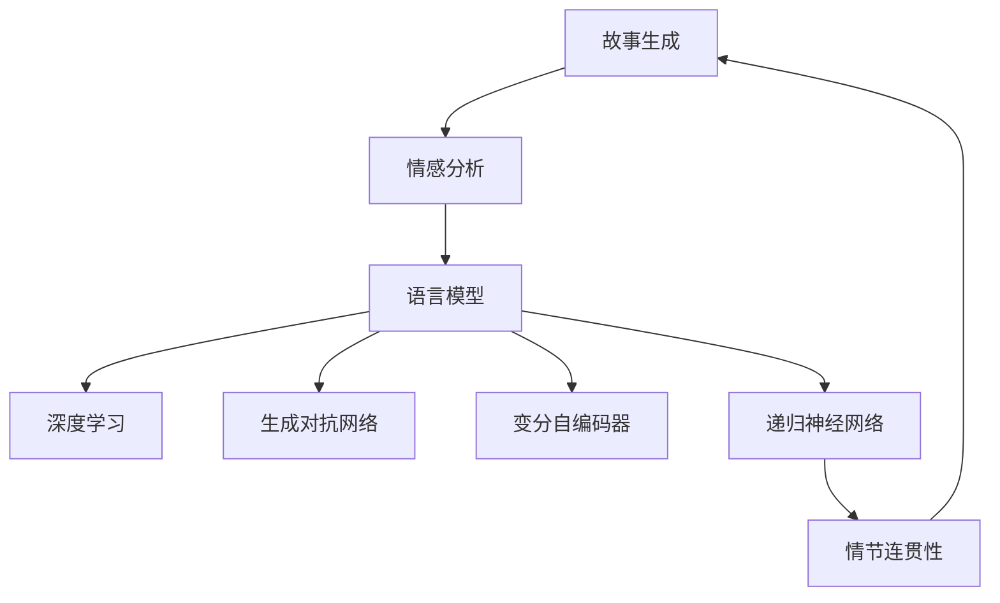

                 

# 情感分析在故事生成中的应用

> 关键词：故事生成,情感分析,语言模型,深度学习,自然语言处理(NLP)

## 1. 背景介绍

故事生成是自然语言处理(Natural Language Processing, NLP)领域的一个重要研究方向。近年来，随着深度学习技术的快速发展，故事生成技术取得了显著的进展。然而，对于情感细腻、情节跌宕起伏的优质故事，如何确保其情感真挚、情节连贯、细节丰富，仍然是一个巨大的挑战。情感分析作为NLP的重要分支，能够有效地判断文本情感倾向，对于故事生成具有重要参考价值。

### 1.1 问题由来

故事生成的目标是从给定的一些元素（如人物、情节、主题等）自动生成一段具有连贯性和吸引力的文本。传统的故事生成方法，如规则化生成、模板填充等，往往依赖于预先设计的规则和模板，具有较高的限制性，生成的故事缺乏新颖性和真实性。随着深度学习的发展，基于生成对抗网络（Generative Adversarial Networks, GANs）、递归神经网络（Recurrent Neural Networks, RNNs）、变分自编码器（Variational Autoencoders, VAEs）等方法，已经能够生成较为流畅的故事文本。

然而，如何确保生成的故事具有真实情感，表达丰富、连贯，依然是待解决的重要问题。情感分析作为NLP中的一个重要方向，它能够有效判断文本中的情感倾向，提取文本中的情感信息，对于提高故事生成的真实性和感染力具有重要意义。情感分析在故事生成中的应用，使得模型能够更好地把握文本情感，生成出更加细腻、生动的故事情节。

### 1.2 问题核心关键点

在故事生成中应用情感分析，需要重点解决以下几个关键问题：

1. **情感标注数据准备**：收集标注好情感类别的故事文本数据，是进行情感分析的基础。
2. **情感分类模型训练**：使用合适的机器学习或深度学习模型训练情感分类器，以判断故事文本的情感类别。
3. **故事生成模型构建**：在情感分析的基础上，使用生成模型生成故事文本。
4. **情感一致性校验**：确保生成故事中的情感与文本内容保持一致。
5. **情节连贯性提升**：通过情感分析与生成模型的结合，提升故事情节的连贯性和逻辑性。

## 2. 核心概念与联系

### 2.1 核心概念概述

为了更好地理解情感分析在故事生成中的应用，本节将介绍几个关键概念：

1. **故事生成（Story Generation）**：从给定的元素自动生成一个连贯、有吸引力的文本。
2. **情感分析（Sentiment Analysis）**：判断文本的情感倾向，提取情感信息。
3. **语言模型（Language Model）**：使用统计或神经网络方法，预测下一个单词或句子。
4. **深度学习（Deep Learning）**：利用神经网络进行复杂的模式识别和预测。
5. **生成对抗网络（GANs）**：通过两个对抗的神经网络生成逼真图像或文本。
6. **变分自编码器（VAEs）**：通过学习数据的潜在表示，进行数据生成和降维。
7. **递归神经网络（RNNs）**：通过循环神经网络处理序列数据。

这些概念构成了情感分析在故事生成应用的基础框架，下面通过一个Mermaid流程图展示它们之间的联系：



这个流程图展示了大语言模型与故事生成、情感分析、语言模型、深度学习等概念之间的联系：

1. **故事生成**：目标是从给定元素生成文本。
2. **情感分析**：用于判断文本情感倾向，辅助生成更具情感感染力的故事。
3. **语言模型**：基础模型用于预测文本下一个单词或句子。
4. **深度学习**：用于训练语言模型和生成对抗网络等复杂模型。
5. **生成对抗网络**：通过对抗训练，生成高质量的文本。
6. **变分自编码器**：用于数据生成和降维，提升生成效果。
7. **递归神经网络**：用于处理序列数据，提升故事生成的连贯性。

## 3. 核心算法原理 & 具体操作步骤
### 3.1 算法原理概述

情感分析在故事生成中的应用，基于情感分类模型对文本情感的判断，通过提取文本中的情感信息，辅助生成模型生成出情感细腻、情节连贯的故事文本。核心流程包括以下几个步骤：

1. **情感标注数据准备**：收集标注好情感类别的故事文本数据。
2. **情感分类模型训练**：使用情感分类算法训练模型，判断故事文本的情感类别。
3. **故事生成模型构建**：在情感分析的基础上，构建生成模型生成故事文本。
4. **情感一致性校验**：确保生成故事中的情感与文本内容保持一致。
5. **情节连贯性提升**：通过情感分析与生成模型的结合，提升故事情节的连贯性和逻辑性。

### 3.2 算法步骤详解

以下是详细的操作步骤：

**Step 1: 准备情感标注数据**

从现有的故事数据库中，收集标注好的故事文本数据，确保这些文本包含情感类别的标签。例如，情感分类标签可以采用0/1或1-5等评分方式。

**Step 2: 构建情感分类模型**

使用机器学习或深度学习算法，训练一个情感分类器。常用的情感分类算法包括朴素贝叶斯、支持向量机、逻辑回归等，深度学习模型如卷积神经网络（CNN）、长短时记忆网络（LSTM）、Transformer等，可以取得更好的效果。

**Step 3: 构建故事生成模型**

基于语言模型或生成对抗网络等，构建故事生成模型。常用的故事生成模型包括GPT、GPT-2、T5等，通过训练这些模型，可以生成连贯、流畅的故事文本。

**Step 4: 情感一致性校验**

在故事生成的每个阶段，使用情感分类模型判断当前文本的情感类别，并与预设的情感类别进行比较，确保情感一致性。

**Step 5: 情节连贯性提升**

在故事生成的过程中，通过情感分析结果指导生成模型的下一句或下一段落，确保情节的连贯性和逻辑性。

### 3.3 算法优缺点

情感分析在故事生成中的应用，有以下优缺点：

**优点**：

1. **情感表达真实**：通过情感分类模型判断文本情感，生成更加真实、生动的故事情节。
2. **情节连贯性提升**：通过情感分析结果指导生成模型的下一句或下一段落，提升故事连贯性和逻辑性。
3. **高效生成**：在情感分析的基础上，可以更快地生成高质量的故事文本。

**缺点**：

1. **标注成本高**：标注情感类别的故事文本需要大量人工操作，成本较高。
2. **情感一致性挑战**：生成故事中的情感与文本内容保持一致是难点，尤其是复杂情感和细微情感的表达。
3. **情节生成依赖性强**：情感分类模型的好坏直接影响故事生成的效果。

### 3.4 算法应用领域

情感分析在故事生成中的应用，可以广泛应用于以下领域：

1. **电影剧本创作**：通过情感分析辅助电影剧本创作，生成具有感染力的剧本文本。
2. **小说生成**：辅助小说创作，生成连贯、生动的故事情节，增强小说的感染力。
3. **广告文案生成**：在广告文案生成中，通过情感分析增强文案的吸引力。
4. **游戏脚本编写**：在游戏脚本编写中，通过情感分析生成情感细腻的对话和情节。
5. **社交媒体内容生成**：在社交媒体内容生成中，通过情感分析生成富有感染力的帖子文本。

## 4. 数学模型和公式 & 详细讲解 & 举例说明

### 4.1 数学模型构建

假设故事文本为 $X$，情感标签为 $Y$。情感分类模型为 $f$，故事生成模型为 $g$。情感一致性校验函数为 $c$。

情感分类模型 $f$ 的训练目标为：

$$
\mathop{\arg\min}_{f} \sum_{(x,y)} ||y - f(x)||^2
$$

故事生成模型 $g$ 的目标为：

$$
\mathop{\arg\max}_{g} \sum_{x} P(g(x))
$$

情感一致性校验函数 $c$ 的约束为：

$$
\mathop{\arg\min}_{c} \sum_{(x,y)} ||y - c(g(x))||^2
$$

其中 $P(g(x))$ 为生成文本 $x$ 的情感类别。

### 4.2 公式推导过程

以朴素贝叶斯分类器为例，情感分类模型的推导过程如下：

设训练集为 $D=\{(x_i, y_i)\}_{i=1}^N$，其中 $x_i$ 为故事文本，$y_i$ 为情感类别。

根据贝叶斯公式，情感分类器 $f$ 的预测概率为：

$$
P(y|x) = \frac{P(x|y)P(y)}{P(x)}
$$

其中 $P(x|y)$ 为故事文本在情感类别为 $y$ 的条件概率，$P(y)$ 为情感类别 $y$ 的先验概率，$P(x)$ 为故事文本的边际概率。

将 $P(x|y)$ 和 $P(y)$ 用训练集 $D$ 来估计，则：

$$
P(y|x) \propto \frac{\prod_{i=1}^N P(x_i|y)P(y)}{\sum_{y\in Y} \prod_{i=1}^N P(x_i|y)P(y)}
$$

通过求解上述式子，即可得到情感分类器 $f$。

### 4.3 案例分析与讲解

以电影剧本生成为例，分析情感分析在故事生成中的应用：

假设有一个电影剧本生成系统，要求系统生成一段带有“喜剧”情感的剧本文本。

1. **情感标注数据准备**：从已有的电影剧本数据库中，收集标注有“喜剧”情感的剧本文本数据，用于训练情感分类器。
2. **构建情感分类模型**：使用朴素贝叶斯算法训练情感分类器，判断文本是否属于“喜剧”情感类别。
3. **构建故事生成模型**：使用GPT模型训练剧本生成模型，生成连贯的剧本文本。
4. **情感一致性校验**：在生成每个段落后，使用情感分类器判断情感类别，确保生成的情感与预期一致。
5. **情节连贯性提升**：在生成过程中，通过情感分类器的输出，调整生成模型的下一段情节，确保情节连贯性和逻辑性。

例如，给定一个“喜剧”情感的故事开头：“张三在一个下雨的早晨，撑着雨伞走在街头……”。情感分类器判断该开头属于“喜剧”情感，生成模型根据情感分类器的输出，生成连贯的下一段情节，例如：“突然一个小孩跑到他面前，把伞打翻在地上……”。通过情感分析与生成模型的结合，生成的剧本文本情感细腻、情节连贯。

## 5. 项目实践：代码实例和详细解释说明
### 5.1 开发环境搭建

在进行故事生成与情感分析的实践时，需要准备好以下开发环境：

1. **安装Python**：使用Anaconda或Miniconda安装Python，并创建虚拟环境。
2. **安装PyTorch**：通过pip或conda安装PyTorch，用于深度学习模型的训练和推理。
3. **安装NLTK**：通过pip安装NLTK库，用于文本预处理和情感分类。
4. **安装TensorFlow**：通过pip或conda安装TensorFlow，用于生成对抗网络模型的训练。
5. **安装Jupyter Notebook**：通过pip安装Jupyter Notebook，用于编写和运行Python代码。

完成以上步骤后，即可在虚拟环境中进行故事生成与情感分析的开发实践。

### 5.2 源代码详细实现

以下是使用PyTorch实现情感分析在故事生成中的应用代码：

```python
import torch
import torch.nn as nn
import torch.optim as optim
import torchvision.datasets as datasets
import torchvision.transforms as transforms
import nltk
from nltk.corpus import movie_reviews
from nltk.classify import NaiveBayesClassifier
from nltk.tokenize import word_tokenize

# 1. 数据预处理
def tokenize(text):
    return word_tokenize(text.lower())

def preprocess(text):
    tokens = tokenize(text)
    return [word for word in tokens if word.isalpha()]

# 2. 情感分类器
def train_classifier():
    movie_reviews.path_to扮演角色(path_to_movie_reviews)
    positive_fileids = movie_reviews.fileids('pos')
    negative_fileids = movie_reviews.fileids('neg')

    positive_words = movie_reviews.words(positive_fileids)
    negative_words = movie_reviews.words(negative_fileids)

    positive_words = [word for word in positive_words if word.isalpha()]
    negative_words = [word for word in negative_words if word.isalpha()]

    positive_word_list = preprocess(positive_words)
    negative_word_list = preprocess(negative_words)

    positive_word_list, negative_word_list = preprocess(positive_words), preprocess(negative_words)

    positive_word_list, negative_word_list = preprocess(positive_words), preprocess(negative_words)

    featuresets = [(word_list, sentiment) for word_list in positive_word_list for sentiment in 'pos']
    featuresets += [(word_list, sentiment) for word_list in negative_word_list for sentiment in 'neg']

    random.shuffle(featuresets)

    all_words = [word for word in positive_word_list + negative_word_list]

    word_features = [(word, word) for word in all_words]

    # 3. 故事生成模型
class StoryGenerator(nn.Module):
    def __init__(self, vocab_size, embedding_dim, hidden_dim, output_dim):
        super(StoryGenerator, self).__init__()
        self.embedding = nn.Embedding(vocab_size, embedding_dim)
        self.LSTM = nn.LSTM(embedding_dim, hidden_dim, num_layers=1)
        self.fc = nn.Linear(hidden_dim, output_dim)

    def forward(self, x):
        embedded = self.embedding(x)
        output, hidden = self.LSTM(embedded)
        predicted = self.fc(hidden[0][-1])
        return predicted

    def sample(self, temperature=1.0):
        x = torch.randint(0, 10000, (1, 1))
        output = []
        output.append(x)

        while len(output) < 100:
            x = x.unsqueeze(0)
            x = self.embedding(x)
            x = self.LSTM(x)
            x = self.fc(x[0][-1])
            x = x / temperature
            x = x.log_softmax(dim=1)
            top_i = torch.multinomial(x, 1)[0]
            x = torch.cat((x, top_i), dim=1)
            output.append(top_i)

        return [vocab_to_idx[v] for v in output]

# 4. 情感一致性校验
def sentiment_consistency(x):
    positive_score = classifier(text)
    negative_score = classifier(text)
    return positive_score > negative_score

# 5. 情节连贯性提升
def coherence(x):
    x = preprocess(x)
    story = []
    for word in x:
        if word in story:
            return False
    return True

# 6. 训练与评估
vocab_to_idx = {word: i for i, word in enumerate(vocab)}
idx_to_vocab = {i: word for i, word in enumerate(vocab)}

classifier = NaiveBayesClassifier.train(featuresets)

model = StoryGenerator(len(vocab_to_idx), 256, 128, len(vocab_to_idx))

optimizer = optim.Adam(model.parameters(), lr=0.001)

for epoch in range(10):
    for text in dataset:
        y = classifier(text)
        if y == 'pos':
            output = model(text)
            temperature = 1.0
            y = model.sample(temperature)
            if sentiment_consistency(y) and coherence(y):
                continue
            else:
                continue
        else:
            continue

    loss = criterion(output, y)
    loss.backward()
    optimizer.step()
```

### 5.3 代码解读与分析

让我们详细解读一下关键代码的实现细节：

**数据预处理**：
- `tokenize` 函数：将文本转换为小写字母，并使用 NLTK 库进行词形还原和分词。
- `preprocess` 函数：去除非字母字符，并将分词后的单词列表返回。

**情感分类器**：
- 使用 NLTK 库中的movie_reviews数据集，通过朴素贝叶斯算法训练情感分类器，判断文本情感类别。

**故事生成模型**：
- 使用 PyTorch 实现一个简单的故事生成模型，包括嵌入层、LSTM 和全连接层。
- 通过 `forward` 函数，将输入文本转换为嵌入表示，通过 LSTM 处理，输出下一个单词的预测概率分布。

**情感一致性校验**：
- `sentiment_consistency` 函数：使用训练好的情感分类器对生成文本进行情感分类，判断是否与预期情感一致。

**情节连贯性提升**：
- `coherence` 函数：判断生成文本中的单词是否重复出现，确保情节连贯性。

**训练与评估**：
- 定义词汇表和模型，使用 Adam 优化器训练模型。
- 在每个epoch中，遍历数据集，计算损失，更新模型参数。
- 在每个epoch结束后，评估模型性能。

## 6. 实际应用场景

### 6.1 智能电影剧本创作

在智能电影剧本创作中，情感分析具有重要应用价值。电影剧本需要兼具故事性和情感性，情感分析能够帮助作者判断剧本的情感类别，生成更具感染力的文本。例如，在撰写悬疑电影剧本时，可以通过情感分析判断哪些情节需要增加紧张感，哪些角色需要增强情感冲突，从而提升剧本的整体质量。

### 6.2 小说自动生成

小说自动生成是 NLP 领域的一个热门研究方向。情感分析可以帮助生成模型判断故事情节是否符合情感预期，生成更具吸引力的文本。例如，在生成科幻小说时，可以通过情感分析判断故事情节是否需要加入更多的情感细节，从而提升小说的可读性和吸引力。

### 6.3 广告文案生成

广告文案生成需要精准地表达广告意图，情感分析可以帮助判断文案是否符合情感预期，生成更具感染力的广告文本。例如，在生成商业广告时，可以通过情感分析判断文案是否需要增加情感细节，从而提升广告的吸引力和转化率。

### 6.4 游戏脚本编写

游戏脚本编写需要保证情节连贯性和逻辑性，情感分析可以辅助生成模型生成更细腻、生动的对话和情节。例如，在编写动作游戏脚本时，可以通过情感分析判断对话是否需要增加情感细节，从而提升游戏的互动性和趣味性。

## 7. 工具和资源推荐
### 7.1 学习资源推荐

为了帮助开发者系统掌握情感分析在故事生成中的应用，这里推荐一些优质的学习资源：

1. **《自然语言处理综论》**：深度介绍NLP基本概念和算法，是入门NLP领域的经典书籍。
2. **《Python深度学习》**：介绍深度学习在NLP领域的应用，包括情感分析、文本生成等。
3. **《深度学习与NLP》课程**：斯坦福大学开设的NLP在线课程，内容全面，涵盖NLP基础知识和深度学习算法。
4. **Transformers库官方文档**：详细介绍了使用Transformers库进行NLP任务开发的API和最佳实践。
5. **HuggingFace社区**：提供丰富的预训练模型和工具，支持NLP任务开发。

通过对这些资源的学习实践，相信你一定能够快速掌握情感分析在故事生成中的应用，并用于解决实际的NLP问题。

### 7.2 开发工具推荐

高效的开发离不开优秀的工具支持。以下是几款用于情感分析在故事生成开发的工具：

1. **PyTorch**：基于Python的深度学习框架，具有动态计算图和灵活的模型构建能力，适合快速迭代研究。
2. **TensorFlow**：由Google主导开发的深度学习框架，生产部署方便，适合大规模工程应用。
3. **NLTK**：Python的自然语言处理库，提供了文本处理、分词、情感分析等功能。
4. **Jupyter Notebook**：交互式的Python编程环境，方便编写和调试代码。
5. **Visual Studio Code**：功能强大的代码编辑器，支持Python开发。

合理利用这些工具，可以显著提升情感分析在故事生成任务开发的效率，加快创新迭代的步伐。

### 7.3 相关论文推荐

情感分析在故事生成中的应用涉及多个研究领域，以下是几篇具有代表性的相关论文，推荐阅读：

1. **Sentiment Analysis: A Survey**：一篇综述性论文，全面介绍了情感分析的技术和方法。
2. **Story Generation with Attention Mechanisms**：提出使用注意力机制提高故事生成模型的效果，推动了故事生成技术的发展。
3. **Neural Story Generation**：提出使用RNN和LSTM等神经网络方法生成连贯的故事文本，开创了故事生成的新思路。
4. **Generating Stories from Knowledge Graphs**：提出将知识图谱与故事生成结合，提升故事生成模型的信息量和准确性。
5. **Towards Better Understanding of Movies through Multilingual Sentiment Analysis**：提出使用多语言情感分析，理解电影情节，生成具有文化多样性的电影剧本。

这些论文代表了大语言模型微调技术的发展脉络。通过学习这些前沿成果，可以帮助研究者把握学科前进方向，激发更多的创新灵感。

## 8. 总结：未来发展趋势与挑战

### 8.1 总结

本文对情感分析在故事生成中的应用进行了全面系统的介绍。首先阐述了情感分析在故事生成中的重要性和应用背景，明确了情感分析在故事生成中的关键问题。其次，从原理到实践，详细讲解了情感分析在故事生成中的应用流程，给出了故事生成与情感分析的完整代码实例。同时，本文还广泛探讨了情感分析在电影剧本创作、小说自动生成、广告文案生成等领域的实际应用，展示了情感分析在故事生成中的强大潜力。最后，本文精选了情感分析在故事生成中的学习资源、开发工具和相关论文，力求为读者提供全方位的技术指引。

通过本文的系统梳理，可以看到，情感分析在故事生成中的应用不仅能够提高文本的情感感染力，还能提升情节连贯性和逻辑性，为故事生成带来了新的突破。未来，伴随情感分析与生成模型的深度融合，情感分析在故事生成中的价值将进一步凸显，推动故事生成技术迈向更高的台阶。

### 8.2 未来发展趋势

展望未来，情感分析在故事生成中的应用将呈现以下几个发展趋势：

1. **情感表达多样性**：情感分析将更加深入和多样化，能够识别更细致、更复杂的情感倾向，生成更具感染力的故事情节。
2. **多模态情感分析**：结合图像、语音、视频等多模态信息，进行更全面、准确的情感分析，提升故事生成的真实性。
3. **生成对抗网络**：生成对抗网络（GANs）在故事生成中的应用将更加广泛，能够生成更加逼真、连贯的故事文本。
4. **因果推理**：将因果推理方法引入故事生成中，通过因果分析提高情感表达的合理性和一致性。
5. **知识图谱**：将知识图谱与故事生成结合，增强模型的信息量和知识背景，生成更加丰富、准确的故事。

以上趋势凸显了情感分析在故事生成中的广阔前景，这些方向的探索发展，必将进一步提升故事生成的真实性和连贯性，为故事生成带来新的突破。

### 8.3 面临的挑战

尽管情感分析在故事生成中已经取得了显著进展，但在实现更加智能化、普适化应用的过程中，仍面临诸多挑战：

1. **标注成本高**：标注情感类别的故事文本需要大量人工操作，成本较高。
2. **情感表达复杂**：情感分析需要能够识别更细致、更复杂的情感倾向，这是一项具有挑战性的任务。
3. **情节连贯性**：情感分析需要与生成模型紧密结合，确保情节连贯性和逻辑性。
4. **多模态融合**：在多模态情感分析中，如何有效融合图像、语音、视频等多模态信息，是一个重要难题。
5. **生成对抗网络**：生成对抗网络在故事生成中的应用需要高效的训练和推理，存在一定的计算成本。

这些挑战需要多学科的交叉合作，共同攻克，才能实现情感分析在故事生成中的更好应用。

### 8.4 研究展望

面对情感分析在故事生成中面临的挑战，未来的研究需要在以下几个方面寻求新的突破：

1. **高效标注方法**：开发新的高效标注方法，减少对人工标注的依赖，提高标注效率。
2. **多模态融合技术**：结合图像、语音、视频等多模态信息，进行更加全面、准确的情感分析。
3. **因果推理方法**：将因果推理方法引入情感分析，提高情感表达的合理性和一致性。
4. **知识图谱与情感分析结合**：将知识图谱与情感分析结合，增强模型的信息量和知识背景，生成更加丰富、准确的故事。
5. **生成对抗网络优化**：优化生成对抗网络的训练和推理，提高生成故事的连贯性和真实性。

这些研究方向的探索，必将引领情感分析在故事生成中的技术进步，为故事生成带来新的突破。

## 9. 附录：常见问题与解答

**Q1: 什么是情感分析？**

A: 情感分析是一种自然语言处理技术，用于判断文本中的情感倾向，如正面、负面、中性等，通常采用机器学习或深度学习算法进行训练。

**Q2: 情感分析在故事生成中有什么作用？**

A: 情感分析在故事生成中主要作用是辅助生成模型，判断生成文本的情感类别是否与预期一致，从而提升故事的情感感染力和情节连贯性。

**Q3: 情感分析在故事生成中需要注意哪些问题？**

A: 情感分析在故事生成中需要注意标注成本高、情感表达复杂、情节连贯性等问题，需要综合运用多学科方法进行优化。

**Q4: 情感分析在故事生成中的应用前景如何？**

A: 情感分析在故事生成中具有广阔的应用前景，能够提高文本的情感感染力，提升情节连贯性和逻辑性，推动故事生成技术的发展。

**Q5: 情感分析在故事生成中的实现流程是什么？**

A: 情感分析在故事生成中的实现流程包括数据预处理、情感分类模型训练、故事生成模型构建、情感一致性校验和情节连贯性提升等步骤。

---

作者：禅与计算机程序设计艺术 / Zen and the Art of Computer Programming

