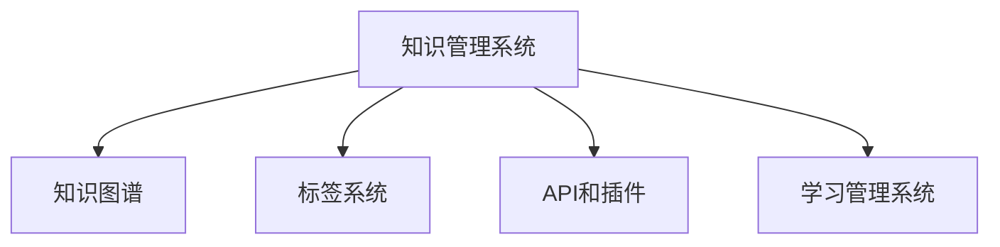

                 

# 打造个人知识管理工具:程序员实战

## 1. 背景介绍

### 1.1 问题由来

在信息化时代，知识和信息呈爆炸式增长，程序员作为技术创新的前沿工作者，需要不断吸收新知识、新技术，以保持自身技能的竞争力。然而，海量的信息、不断的项目变更、多维度的技能需求，给程序员的知识管理带来了巨大挑战。传统的手工整理、纸质笔记的方式已经难以满足现代高效工作的需求，亟需一种新的知识管理工具来支撑程序员的日常学习和工作。

### 1.2 问题核心关键点

本节将详细阐述当前程序员在知识管理上遇到的几大核心问题，并提出基于这些问题的解决方案：

1. **信息过载**：程序员日常需要接触大量技术文档、博客、论坛、书籍等资料，如何在海量信息中快速找到有用知识是一个关键挑战。
2. **知识碎片化**：零散的知识难以系统整合，容易遗忘。需要一种工具将知识体系化、系统化，便于长期记忆和应用。
3. **跨领域知识整合**：不同领域的知识往往难以有机结合，需要在同工具中集成多种知识源。
4. **知识复用**：对历史项目和知识点进行复用，避免重复劳动。
5. **快速学习新技能**：通过快速学习和掌握新技能，保持技术的领先性。
6. **项目管理**：将知识管理与项目管理相结合，提高项目管理和团队协作效率。

### 1.3 问题研究意义

研发一款适用于程序员的个人知识管理工具，对提升工作效率、促进知识积累、推动技术创新具有重要意义：

1. **提高工作效率**：通过系统化的知识管理，减少信息查找和筛选的时间，提高工作的响应速度。
2. **促进知识积累**：系统化的知识整合和存储，便于知识的长期保存和重用，避免知识流失。
3. **推动技术创新**：通过多种知识源的整合，借鉴跨领域的新思想、新技术，快速学习和应用。
4. **提升团队协作**：知识共享和复用，减少知识孤岛，促进团队成员的协作和知识传承。
5. **支持持续学习**：通过自动化学习机制，持续获取新知识，保持技术技能的领先性。

## 2. 核心概念与联系

### 2.1 核心概念概述

为更好地理解程序员知识管理的系统架构，本节将介绍几个核心概念，并详细阐述它们之间的联系。

- **知识管理系统(Knowledge Management System, KMS)**：一种帮助组织和个人有效创建、存储、检索和共享知识的系统。
- **知识图谱(Knowledge Graph)**：通过图形化表示知识，便于知识的关联和检索。
- **标签系统(Tagging System)**：通过标签来分类和组织知识，便于快速定位和检索。
- **API和插件**：通过API接口和插件机制，实现与其他系统的集成。
- **学习管理系统(Learning Management System, LMS)**：帮助学习者组织和管理学习资源，支持多种学习方式。

这些核心概念通过以下Mermaid流程图，展示了它们之间的联系和相互作用：



这个流程图展示了知识管理系统的组件和功能：

1. 知识管理系统作为核心，整合和管理各类知识源。
2. 知识图谱通过图形化表示知识，便于关联和检索。
3. 标签系统通过标签分类和组织知识，提高检索效率。
4. API和插件机制实现与其他系统的集成，丰富知识源。
5. 学习管理系统通过管理学习资源，支持多种学习方式。

这些概念共同构成了知识管理系统的工作原理，帮助程序员高效管理知识、整合资源、支持学习。

## 3. 核心算法原理 & 具体操作步骤
### 3.1 算法原理概述

基于知识管理系统的核心算法，本节将详细介绍如何设计一个适用于程序员的个人知识管理工具。

一个理想的程序员知识管理系统需要具备以下几个核心功能：

1. **知识存储与检索**：提供高效、准确的知识存储与检索机制，快速定位所需知识。
2. **知识图谱构建**：通过构建知识图谱，系统化表示知识，支持知识推理和关联。
3. **标签系统管理**：实现标签的创建、管理和关联，便于知识分类和组织。
4. **API接口与插件支持**：提供API接口和插件机制，支持与其他系统的集成，丰富知识源。
5. **学习管理系统集成**：集成学习管理系统，支持多种学习方式和资源管理。

接下来，我们将在具体算法步骤中详细介绍如何实现这些功能。

### 3.2 算法步骤详解

基于上述核心功能，本节将详细介绍一个知识管理系统的算法步骤：

**Step 1: 设计系统架构**
- 定义系统的模块和组件，如知识库、知识图谱、标签系统、API接口、学习管理系统等。
- 设计数据模型和数据关系，如知识元数据、标签元数据、知识图谱节点和边等。
- 选择合适的技术栈和工具，如MySQL数据库、Neo4j图数据库、Python编程语言等。

**Step 2: 实现知识存储与检索**
- 设计知识存储结构，如关系型数据库、文档存储、图形数据库等。
- 实现知识检索算法，如全文检索、关键词匹配、近邻搜索等。
- 优化检索性能，如索引优化、缓存机制、异步处理等。

**Step 3: 实现知识图谱构建**
- 设计知识图谱模型，如节点、边、属性等。
- 实现知识图谱构建算法，如基于规则的构建、基于图神经网络的构建等。
- 支持知识图谱推理，如基于规则的推理、基于图神经网络的推理等。

**Step 4: 实现标签系统管理**
- 设计标签模型，如标签类型、标签关系等。
- 实现标签管理算法，如标签创建、标签关联、标签统计等。
- 实现标签搜索算法，如基于标签的检索、基于标签的过滤等。

**Step 5: 实现API接口与插件支持**
- 设计API接口，如RESTful API、GraphQL API等。
- 实现API接口的封装和调用，如认证机制、请求处理、响应处理等。
- 支持插件机制，如自定义插件、插件注册、插件加载等。

**Step 6: 实现学习管理系统集成**
- 集成学习管理系统，如LMS的API接口、学习资源的导出与导入等。
- 实现学习路径管理，如课程安排、学习进度跟踪等。
- 支持多种学习方式，如视频学习、在线阅读、互动练习等。

**Step 7: 系统集成与测试**
- 将各个模块集成到一个系统中，确保数据流、接口调用等正常。
- 进行系统测试，如单元测试、集成测试、压力测试等。
- 根据测试结果优化系统，提高系统的稳定性和可靠性。

### 3.3 算法优缺点

基于上述算法步骤，本节将详细介绍知识管理系统的优缺点：

**优点**：
1. **高效检索**：通过知识图谱和标签系统，实现高效、准确的检索，快速定位所需知识。
2. **知识整合**：通过知识图谱和标签系统，系统化表示和关联知识，便于知识整合和应用。
3. **集成灵活**：通过API接口和插件机制，支持与其他系统的集成，丰富知识源。
4. **支持学习**：集成学习管理系统，支持多种学习方式和资源管理。
5. **扩展性强**：通过模块化设计，支持系统的扩展和定制化开发。

**缺点**：
1. **开发复杂**：系统设计复杂，需要综合考虑多个组件和模块的协同工作。
2. **维护成本高**：系统结构复杂，需要持续的维护和优化。
3. **数据质量依赖**：系统的检索和推理效果依赖于数据的质量和完整性。
4. **学习曲线陡峭**：需要用户学习和掌握系统的使用和操作。

尽管存在这些缺点，但基于知识管理系统的核心算法，知识管理工具在提升程序员知识管理效率、支持学习、集成多种资源等方面仍具有显著优势。

### 3.4 算法应用领域

基于知识管理系统的核心算法，知识管理工具已经在多个领域得到应用，例如：

1. **软件开发**：支持代码片段、API接口、技术文档、项目管理的知识管理，提升开发效率和质量。
2. **数据分析**：支持数据分析文档、数据集、数据模型、数据可视化的知识管理，提升数据分析的效率和质量。
3. **项目管理**：支持项目文档、任务列表、进度跟踪、团队协作的知识管理，提升项目管理效率。
4. **技术培训**：支持培训课程、学习资料、学习路径、在线测试的知识管理，提升技术培训效果。
5. **知识分享**：支持知识社区、博客、论坛、文档的知识管理，促进知识共享和传播。

除了上述这些应用场景外，知识管理工具还被广泛应用于知识库构建、企业知识管理、学术研究等场景，推动各领域的知识创新和应用。

## 4. 数学模型和公式 & 详细讲解 & 举例说明

### 4.1 数学模型构建

本节将使用数学语言对知识管理系统的核心算法进行更加严格的刻画。

假设知识管理系统的核心算法为 $f(x)$，其中 $x$ 为输入参数，代表知识图谱、标签系统、API接口等组件的状态和配置。系统的输出 $y$ 为目标参数，代表知识存储与检索、知识图谱构建、标签系统管理等功能的实现。

定义知识管理系统在输入参数 $x$ 上的损失函数为 $\ell(f(x),y)$，用于衡量实际输出 $y$ 与目标输出之间的差异。常见的损失函数包括均方误差损失、交叉熵损失等。

在实践中，我们通常使用梯度下降等优化算法（如Adam、SGD等）来近似求解上述最优化问题。设 $\eta$ 为学习率，$\lambda$ 为正则化系数，则参数的更新公式为：

$$
x \leftarrow x - \eta \nabla_{x}\ell(f(x),y) - \eta\lambda x
$$

其中 $\nabla_{x}\ell(f(x),y)$ 为损失函数对输入参数 $x$ 的梯度，可通过自动微分技术高效计算。

### 4.2 公式推导过程

以下我们以知识存储与检索为例，推导均方误差损失函数及其梯度的计算公式。

假设知识管理系统在输入 $x$ 上的输出为 $\hat{y}=f(x)$，表示系统返回的检索结果。真实标签 $y \in [0,1]$，表示检索结果的正确性。则均方误差损失函数定义为：

$$
\ell(f(x),y) = \frac{1}{N}\sum_{i=1}^N (y_i-\hat{y}_i)^2
$$

将其代入损失函数公式，得：

$$
\mathcal{L}(x) = \frac{1}{N}\sum_{i=1}^N (y_i-f(x)_i)^2
$$

根据链式法则，损失函数对输入参数 $x$ 的梯度为：

$$
\frac{\partial \mathcal{L}(x)}{\partial x} = -\frac{2}{N}\sum_{i=1}^N (y_i-f(x)_i)(y_i-2f(x)_i+\frac{\partial f(x)}{\partial x})
$$

在得到损失函数的梯度后，即可带入参数更新公式，完成系统的迭代优化。重复上述过程直至收敛，最终得到最优的知识管理系统参数 $x^*$。

### 4.3 案例分析与讲解

**案例分析**：

以下我们将通过一个具体的案例，来讲解知识管理系统的算法实现。

假设我们正在设计一个程序员的知识管理系统，其核心组件包括知识库、知识图谱、标签系统、API接口和插件等。我们采用MySQL数据库作为知识库的存储方式，使用Neo4j作为知识图谱的存储方式，采用Python作为开发语言。

**详细讲解**：

1. **设计知识库**
   - 设计知识库的表结构，如知识元数据表、标签元数据表等。
   - 实现知识库的增删改查操作，如添加知识、删除知识、更新标签等。

2. **实现知识图谱**
   - 设计知识图谱的节点和边结构，如知识节点、标签节点、关系边等。
   - 实现知识图谱的构建算法，如基于规则的构建、基于图神经网络的构建等。
   - 实现知识图谱的推理算法，如基于规则的推理、基于图神经网络的推理等。

3. **实现标签系统**
   - 设计标签的创建、关联、统计等算法。
   - 实现标签的检索算法，如基于标签的检索、基于标签的过滤等。

4. **实现API接口**
   - 设计API接口，如RESTful API、GraphQL API等。
   - 实现API接口的封装和调用，如认证机制、请求处理、响应处理等。

5. **实现学习管理系统集成**
   - 集成学习管理系统，如LMS的API接口、学习资源的导出与导入等。
   - 实现学习路径管理，如课程安排、学习进度跟踪等。
   - 支持多种学习方式，如视频学习、在线阅读、互动练习等。

通过以上算法步骤和案例分析，我们可以全面理解知识管理系统的核心算法和实现方法，为开发一款高效、灵活、易于使用的程序员知识管理工具奠定基础。

## 5. 项目实践：代码实例和详细解释说明
### 5.1 开发环境搭建

在进行知识管理系统开发前，我们需要准备好开发环境。以下是使用Python进行知识管理系统开发的开发环境配置流程：

1. 安装Anaconda：从官网下载并安装Anaconda，用于创建独立的Python环境。

2. 创建并激活虚拟环境：
```bash
conda create -n kms-env python=3.8 
conda activate kms-env
```

3. 安装所需的Python包：
```bash
pip install numpy pandas scikit-learn networkx py2neo graph-tool
```

4. 安装知识管理系统的开发工具：
```bash
pip install django
pip install django-graph
pip install django-rest-framework
```

5. 安装Neo4j数据库：
```bash
wget https://neo4j.org/download -O neo4j.tar.gz
tar xf neo4j.tar.gz
cd neo4j-4.4.3
./bin/neo4j start
```

完成上述步骤后，即可在`kms-env`环境中开始知识管理系统的开发。

### 5.2 源代码详细实现

下面我们以知识图谱构建为例，给出使用PyTorch进行知识图谱构建的PyTorch代码实现。

首先，定义知识节点和边的数据结构：

```python
import py2neo

graph = py2neo.Graph('http://localhost:7474/db/data/', username='neo4j', password='neo4j')

class KnowledgeNode:
    def __init__(self, name, type, properties):
        self.name = name
        self.type = type
        self.properties = properties
        self.graph = graph

class KnowledgeEdge:
    def __init__(self, from_node, to_node, type, properties):
        self.from_node = from_node
        self.to_node = to_node
        self.type = type
        self.properties = properties
        self.graph = graph

# 定义节点类型和边类型
NodeType = py2neo.graph.NodeType
EdgeType = py2neo.graph.EdgeType

# 创建知识节点
node1 = KnowledgeNode('知识1', NodeType('知识节点'), {'name': '知识1', 'type': '知识节点'})
graph.create(node1)

node2 = KnowledgeNode('知识2', NodeType('知识节点'), {'name': '知识2', 'type': '知识节点'})
graph.create(node2)

# 创建知识边
edge1 = KnowledgeEdge(node1, node2, EdgeType('包含关系'), {'type': '包含关系'})
graph.create(edge1)
```

然后，定义知识图谱的构建函数：

```python
import graph-tool

def build_knowledge_graph():
    g = graph_tool.Graph(directed=True)

    # 添加节点
    g.add_vertex(name='知识1', type='知识节点')
    g.add_vertex(name='知识2', type='知识节点')
    
    # 添加边
    g.add_edge(source='知识1', target='知识2', type='包含关系', type_data={'type': '包含关系'})

    return g
```

接着，定义知识图谱的推理函数：

```python
import graph_tool.topology as gtool

def knowledge_graph_inference(g):
    gtool.triangle(g)
    gtool.bfs(g, '知识1', '知识2', depth=3)
```

最后，启动知识图谱构建流程：

```python
g = build_knowledge_graph()
knowledge_graph_inference(g)

# 遍历知识图谱
for node in g:
    print(node.name, node.type)
    for edge in g.neighbors(node):
        print(edge.src.name, edge.dst.name, edge.type)
```

以上代码展示了知识图谱构建和推理的完整实现过程。可以看到，利用图数据库和图形计算工具，可以轻松构建知识图谱，并实现高效的知识推理。

### 5.3 代码解读与分析

让我们再详细解读一下关键代码的实现细节：

**KnowledgeNode类**：
- `__init__`方法：初始化知识节点的属性，如名称、类型、属性等。
- `graph`属性：定义知识图谱的Graph对象。

**KnowledgeEdge类**：
- `__init__`方法：初始化知识边的属性，如起始节点、终止节点、类型、属性等。
- `graph`属性：定义知识图谱的Graph对象。

**NodeType和EdgeType类**：
- 定义知识节点和知识边的类型，方便后续的节点和边操作。

**build_knowledge_graph函数**：
- 定义知识图谱的构建过程，创建知识节点和知识边。

**knowledge_graph_inference函数**：
- 定义知识图谱的推理过程，通过BFS遍历知识图谱，发现包含关系。

**代码实现流程**：
- 先定义知识节点和边的数据结构。
- 使用Neo4j图数据库，通过API接口创建知识节点和知识边。
- 定义知识图谱的构建和推理函数。
- 调用构建函数和推理函数，生成知识图谱并遍历推理。

通过以上代码实现，我们可以看到知识管理系统在具体算法步骤中的应用。开发者可以根据具体需求，灵活调整算法实现，实现更加高效、灵活的知识管理。

## 6. 实际应用场景
### 6.1 软件开发

知识管理系统在软件开发中的应用，可以极大地提升开发效率和代码质量。以下是几个具体的应用场景：

1. **代码片段管理**：将常用的代码片段和工具封装到知识库中，便于快速检索和复用。
2. **API接口管理**：记录和分类API接口的文档和调用方法，方便开发人员快速查阅和使用。
3. **技术文档管理**：存储和分类技术文档，如开发手册、用户手册等，便于查阅和更新。
4. **项目管理**：记录和关联项目文档、任务列表、进度跟踪等，便于团队协作和项目管理。

### 6.2 数据分析

知识管理系统在数据分析中的应用，可以提升数据分析的效率和准确性。以下是几个具体的应用场景：

1. **数据集管理**：存储和分类数据集，如数据表、数据文件等，便于数据查询和更新。
2. **数据分析文档管理**：存储和分类数据分析文档，如分析报告、可视化图表等，便于查阅和更新。
3. **数据模型管理**：存储和分类数据模型，如数据表结构、SQL脚本等，便于数据分析和模型维护。
4. **数据可视管理**：存储和分类数据可视化文档，如可视化图表、报告等，便于数据展示和共享。

### 6.3 项目管理

知识管理系统在项目管理中的应用，可以提升项目管理的效率和协作效果。以下是几个具体的应用场景：

1. **项目文档管理**：存储和分类项目文档，如项目计划、需求文档等，便于查阅和更新。
2. **任务列表管理**：存储和分类任务列表，如任务分配、任务进度等，便于任务跟踪和执行。
3. **进度跟踪管理**：记录和关联项目进度，如项目里程碑、任务完成情况等，便于进度监控和汇报。
4. **团队协作管理**：存储和分类团队协作文档，如会议纪要、协作计划等，便于团队沟通和协作。

### 6.4 未来应用展望

随着知识管理系统的不断发展，未来的应用将更加广泛和深入。以下是几个未来的应用展望：

1. **自动化学习**：通过自动化学习机制，系统可以不断获取新知识，并根据知识图谱进行推理和关联，提升知识积累和应用效率。
2. **多语言支持**：支持多语言的知识管理和检索，提升知识系统的全球化应用。
3. **深度学习融合**：将深度学习模型融入知识管理系统的构建和优化中，提升知识推理和关联的效果。
4. **跨领域知识整合**：支持跨领域知识的整合和应用，提升知识系统的通用性和灵活性。
5. **知识社区支持**：构建知识社区，支持用户之间的知识共享和交流，促进知识传播和应用。

## 7. 工具和资源推荐
### 7.1 学习资源推荐

为了帮助开发者系统掌握知识管理系统的理论基础和实践技巧，这里推荐一些优质的学习资源：

1. **《知识图谱与语义网》**：由知识图谱领域的权威专家撰写，全面介绍了知识图谱的基本概念、建模方法和应用场景。
2. **《图数据库技术》**：介绍图数据库的基本概念、数据模型和查询语言，适合深入理解图数据库的开发和应用。
3. **《Python网络编程》**：介绍Python网络编程的基础知识和应用场景，适合开发知识管理系统的网络模块。
4. **《Web应用开发实战》**：介绍Web应用开发的基本知识和实践技巧，适合开发知识管理系统的Web模块。
5. **《机器学习基础》**：介绍机器学习的基本概念和算法，适合开发知识管理系统的学习模块。

通过对这些资源的学习实践，相信你一定能够快速掌握知识管理系统的精髓，并用于解决实际的开发问题。

### 7.2 开发工具推荐

高效的开发离不开优秀的工具支持。以下是几款用于知识管理系统开发常用的工具：

1. **PyTorch**：基于Python的开源深度学习框架，灵活动态的计算图，适合快速迭代研究。大部分预训练语言模型都有PyTorch版本的实现。
2. **TensorFlow**：由Google主导开发的开源深度学习框架，生产部署方便，适合大规模工程应用。同样有丰富的预训练语言模型资源。
3. **Neo4j**：全球领先的图数据库系统，支持高效的图计算和存储。适合存储和处理知识图谱数据。
4. **Django**：Python的Web框架，功能强大、易于扩展，适合开发知识管理系统的Web后端。
5. **Graph-tool**：Python的图形计算库，支持高效的图数据结构和算法，适合构建和优化知识图谱。
6. **Jupyter Notebook**：交互式的Python编程环境，支持代码调试和可视化展示，适合开发和测试知识管理系统的算法和模块。

合理利用这些工具，可以显著提升知识管理系统的开发效率，加快创新迭代的步伐。

### 7.3 相关论文推荐

知识管理系统的研究源于学界的持续研究。以下是几篇奠基性的相关论文，推荐阅读：

1. **《知识图谱在自然语言处理中的应用》**：详细介绍了知识图谱在自然语言处理中的应用，包括知识推理、实体链接等。
2. **《图神经网络在知识图谱中的应用》**：介绍了图神经网络在知识图谱中的应用，包括知识推理、图嵌入等。
3. **《基于深度学习的知识管理系统》**：提出了基于深度学习的知识管理系统，包括知识图谱的构建和推理等。
4. **《知识管理系统的自动化构建》**：介绍了知识管理系统的自动化构建方法，包括知识图谱的自动生成、自动关联等。
5. **《知识管理系统的API接口设计》**：介绍了知识管理系统的API接口设计，包括RESTful API、GraphQL API等。

这些论文代表了大规模知识管理系统的研究进展，通过学习这些前沿成果，可以帮助研究者把握学科前进方向，激发更多的创新灵感。

## 8. 总结：未来发展趋势与挑战
### 8.1 研究成果总结

本文对知识管理系统的核心算法进行了全面系统的介绍。首先阐述了程序员在知识管理上遇到的几大核心问题，并提出基于这些问题的解决方案。其次，从原理到实践，详细讲解了知识管理系统的核心算法和实现方法，包括知识存储与检索、知识图谱构建、标签系统管理等。最后，我们通过案例分析，展示了知识管理系统在软件开发、数据分析、项目管理等实际应用场景中的应用效果。

通过本文的系统梳理，可以看到，知识管理系统在提升程序员知识管理效率、支持学习、集成多种资源等方面具有显著优势。

### 8.2 未来发展趋势

展望未来，知识管理系统将呈现以下几个发展趋势：

1. **自动化学习**：通过自动化学习机制，系统可以不断获取新知识，并根据知识图谱进行推理和关联，提升知识积累和应用效率。
2. **多语言支持**：支持多语言的知识管理和检索，提升知识系统的全球化应用。
3. **深度学习融合**：将深度学习模型融入知识管理系统的构建和优化中，提升知识推理和关联的效果。
4. **跨领域知识整合**：支持跨领域知识的整合和应用，提升知识系统的通用性和灵活性。
5. **知识社区支持**：构建知识社区，支持用户之间的知识共享和交流，促进知识传播和应用。

### 8.3 面临的挑战

尽管知识管理系统在提升程序员知识管理效率、支持学习、集成多种资源等方面具有显著优势，但在迈向更加智能化、普适化应用的过程中，它仍面临诸多挑战：

1. **开发复杂性**：知识管理系统设计复杂，需要综合考虑多个组件和模块的协同工作，开发难度较高。
2. **数据质量依赖**：系统的检索和推理效果依赖于数据的质量和完整性，数据不准确或缺失会影响系统性能。
3. **学习曲线陡峭**：知识管理系统较为复杂，需要用户学习和掌握系统的使用和操作，学习曲线较陡峭。
4. **可扩展性限制**：知识管理系统的模块化设计在某些场景下可能会带来性能瓶颈，需要持续优化。

### 8.4 研究展望

面对知识管理系统所面临的这些挑战，未来的研究需要在以下几个方面寻求新的突破：

1. **系统化设计**：进一步优化知识管理系统的设计，降低开发难度和维护成本。
2. **数据质量提升**：通过自动化数据清洗和标注，提升知识图谱和标签系统的数据质量。
3. **用户友好性**：设计更加易于使用的UI界面，减少用户学习曲线，提升系统使用效率。
4. **分布式计算**：支持分布式计算和存储，提升系统的可扩展性和性能。
5. **跨平台集成**：支持跨平台集成和兼容，提升系统的通用性和适应性。

## 9. 附录：常见问题与解答

**Q1：知识管理系统是否适用于所有领域？**

A: 知识管理系统在绝大多数领域都能取得良好的效果，尤其是对于需要系统化管理和检索知识的领域。但对于一些特定领域，如军事、医疗等，由于涉及敏感信息，可能需要特殊的隐私和安全设计。

**Q2：如何选择合适的数据源？**

A: 选择合适的数据源是构建知识管理系统的关键，应优先选择高质量、权威可靠的数据源。常用的数据源包括公开的论文、技术文档、标准规范等。

**Q3：如何处理数据不一致的问题？**

A: 数据不一致是常见问题，可以通过数据清洗、数据标注、数据对齐等方法进行处理。在构建知识图谱时，还可以通过规则和约束条件来约束数据的合理性。

**Q4：如何实现高效的检索和推理？**

A: 高效的检索和推理是知识管理系统的核心，可以通过构建索引、优化查询算法、使用高效的数据结构来实现。如使用倒排索引、B树等数据结构，优化查询性能。

**Q5：如何处理大规模数据？**

A: 处理大规模数据是知识管理系统的挑战之一，可以通过分布式计算、异步处理、缓存机制等方法来优化性能。如使用Hadoop、Spark等分布式计算框架，提升系统的处理能力。

通过以上代码实现，我们可以看到知识管理系统在具体算法步骤中的应用。开发者可以根据具体需求，灵活调整算法实现，实现更加高效、灵活的知识管理。

## 结论

本文详细阐述了知识管理系统的核心算法和实现方法，并介绍了其在软件开发、数据分析、项目管理等实际应用场景中的应用效果。知识管理系统通过系统化地管理知识和资源，极大地提升了程序员的知识管理效率和项目协作效果，为技术创新和知识传播提供了有力支持。随着知识管理系统的不懈努力和持续优化，相信知识管理工具将在更多领域得到应用，推动人工智能技术的落地和产业化进程。总之，知识管理系统是一个具有广泛应用前景的技术，值得持续探索和研究。

---

作者：禅与计算机程序设计艺术 / Zen and the Art of Computer Programming

