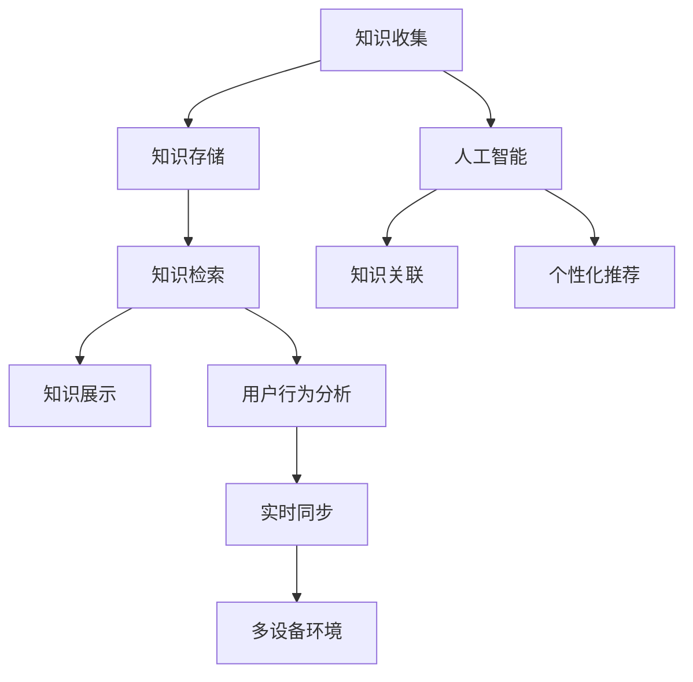

                 

# 打造个人知识管理的移动应用

## 1. 背景介绍

### 1.1 问题由来

随着互联网和移动互联网的普及，人们获取、处理和分享信息的渠道日益增多，信息爆炸和注意力分散成为了我们日常生活中的常态。个人知识管理成为提高信息处理效率、保持思维清晰和创新的重要手段。传统的手写笔记、文件夹、邮件管理等方法已经不能适应这种信息过载的现状，亟需一种更加高效、灵活、易用的知识管理工具。

### 1.2 问题核心关键点

为了应对信息过载和知识管理的挑战，开发一款易于使用、功能全面的个人知识管理移动应用变得尤为迫切。核心问题在于：

- 如何设计界面简洁、功能强大的应用，支持用户高效存储和查询知识。
- 如何在移动设备上实现实时同步，方便用户在任何场景下更新和访问知识。
- 如何利用人工智能技术提升知识管理应用的智能化水平，辅助用户发现知识间的关联。
- 如何通过数据驱动的方式，提供个性化的知识推荐和用户行为分析，提升用户体验。
- 如何平衡应用性能和用户体验，确保在多设备环境下的流畅运行。

这些核心问题需要从用户需求出发，结合前端开发、后端架构、人工智能等多方面技术进行综合解决。

### 1.3 问题研究意义

一款高效的个人知识管理移动应用，可以大大提升用户的信息处理效率，帮助用户快速获取、整理和应用知识，从而提高工作效率和创新能力。它的应用场景广泛，从学生、职场人到创意工作者，人人都可以从中受益。同时，随着大数据和人工智能技术的发展，个人知识管理应用还能提供更多智能化的服务，成为知识工作者不可或缺的工具。

## 2. 核心概念与联系

### 2.1 核心概念概述

为更好地理解个人知识管理移动应用，我们需要理解以下几个核心概念：

- **个人知识管理(PKM)**：一种管理和利用个人知识的系统化方法，旨在帮助用户高效收集、存储、搜索和应用知识。
- **移动应用(Mobile App)**：基于移动设备操作系统和应用框架，通过触摸屏等输入方式为用户提供个性化服务的应用程序。
- **知识图谱(Knowledge Graph)**：一种图形化表示知识体系的结构化数据模型，用于构建知识之间的关联网络。
- **自然语言处理(NLP)**：研究计算机如何处理和理解人类语言的技术，广泛应用于信息检索、问答系统、智能翻译等领域。
- **推荐系统(Recommender System)**：通过用户行为数据和模型算法，为用户提供个性化内容推荐的应用系统。
- **实时同步(Sync)**：一种确保多设备间数据一致性的技术，保证用户在不同设备上的数据更新能够即时同步。

这些核心概念之间通过技术逻辑相互联系，共同构成了个人知识管理移动应用的基础框架。

### 2.2 核心概念原理和架构的 Mermaid 流程图



这个流程图展示了个人知识管理移动应用的基本流程和技术架构：

1. **知识收集**：用户通过笔记、文档、图片等多种方式，收集知识和信息。
2. **知识存储**：应用提供结构化存储机制，将知识内容保存下来，方便后续检索和应用。
3. **知识检索**：用户可以方便地通过关键词、标签等方式，查找自己需要的知识。
4. **知识展示**：应用提供各种形式的展示界面，帮助用户快速阅读和理解知识内容。
5. **人工智能**：利用自然语言处理和推荐系统等技术，提升应用的智能化水平，辅助用户发现知识间的关联和推荐相关内容。
6. **知识关联**：应用构建知识图谱，将知识节点之间建立关联，便于用户发现知识间的内在联系。
7. **用户行为分析**：通过分析用户的使用习惯和偏好，提供个性化的推荐和服务。
8. **实时同步**：确保多设备间数据一致，用户在不同设备上更新和访问知识时能够保持同步。

## 3. 核心算法原理 & 具体操作步骤

### 3.1 算法原理概述

个人知识管理移动应用的算法实现，主要涉及以下几个方面：

- **知识检索算法**：用于高效匹配用户查询，快速定位到相关的知识内容。
- **自然语言处理算法**：用于理解用户输入的自然语言，并提取关键词、主题等信息。
- **知识关联算法**：用于构建知识图谱，分析知识之间的关联性。
- **推荐算法**：用于根据用户行为和偏好，推荐相关知识和内容。

### 3.2 算法步骤详解

#### 3.2.1 知识检索算法

**步骤1: 索引构建**
- 收集应用中所有知识内容，提取关键词、标签、时间戳等信息，构建索引。
- 使用倒排索引等数据结构，将关键词映射到知识内容的位置。

**步骤2: 查询处理**
- 接收用户输入的查询请求，进行分词、去停用词等预处理。
- 将查询关键词映射到索引中，返回相关知识内容的ID列表。

**步骤3: 结果展示**
- 根据ID列表，从数据库中加载对应的知识内容，展示给用户。

#### 3.2.2 自然语言处理算法

**步骤1: 分词和词性标注**
- 使用分词工具将用户输入的文本拆分成词语序列，去除标点符号。
- 对每个词语进行词性标注，提取名词、动词等重要信息。

**步骤2: 命名实体识别**
- 识别文本中的命名实体，如人名、地名、组织名等。
- 提取实体信息，作为知识检索和关联的关键特征。

**步骤3: 情感分析**
- 使用情感词典和机器学习模型，判断文本的情感倾向。
- 提取文本的情感信息，作为推荐系统的输入之一。

#### 3.2.3 知识关联算法

**步骤1: 构建知识图谱**
- 定义知识图谱的基本结构，包括节点和边。
- 将知识内容抽象成节点，通过共现、引用等关系建立边，构建知识图谱。

**步骤2: 图谱查询**
- 接收用户输入的查询节点，进行图谱遍历。
- 找到所有与查询节点有边的节点，返回相关知识内容。

#### 3.2.4 推荐算法

**步骤1: 数据收集**
- 收集用户的历史浏览、点击、收藏等行为数据。
- 使用A/B测试等方法，收集用户对推荐结果的反馈数据。

**步骤2: 特征提取**
- 提取用户行为数据和知识内容的特征，如时间戳、标签、情感等。
- 使用TF-IDF、词向量等技术，对特征进行编码和转换。

**步骤3: 模型训练**
- 使用协同过滤、矩阵分解等算法，训练推荐模型。
- 根据用户行为数据和知识内容特征，预测用户可能感兴趣的内容。

**步骤4: 推荐展示**
- 根据模型预测结果，推荐相关知识内容给用户。
- 提供理由解释，说明推荐理由和逻辑。

### 3.3 算法优缺点

#### 优点：

- **高效性**：基于倒排索引和图谱查询等技术，检索和关联知识内容的过程非常高效。
- **智能化**：结合自然语言处理和推荐系统，提升应用的智能化水平，为用户提供个性化的服务。
- **可扩展性**：通过模块化设计和插件机制，支持不断扩展新的功能和算法。

#### 缺点：

- **数据依赖**：依赖大量的用户行为数据和知识内容，数据量和质量直接影响推荐效果。
- **处理复杂度**：处理自然语言和构建知识图谱等任务，处理复杂度较高。
- **隐私问题**：收集和存储用户数据可能涉及隐私问题，需要合理处理和保护。

### 3.4 算法应用领域

个人知识管理移动应用已经在多个领域得到了广泛应用，例如：

- **学生学习管理**：用于整理和复习课堂笔记、参考资料、习题等，帮助学生高效学习。
- **职场知识管理**：用于存储和查找项目文档、会议记录、客户资料等，提升工作效率。
- **创意工作支持**：用于整理灵感、草稿、设计方案等，帮助创意工作者进行知识积累和创新。
- **学术研究支持**：用于管理论文、实验数据、文献等，辅助科研人员进行学术研究。
- **个人知识普及**：用于整理个人知识库，方便知识分享和传播。

## 4. 数学模型和公式 & 详细讲解 & 举例说明

### 4.1 数学模型构建

知识检索算法基于倒排索引，数学模型如下：

$$
\text{Index} = \{(k, p_k)\}, \quad p_k = \{\text{doc}\} \text{ where } k \in \text{doc}
$$

其中，$k$ 表示关键词，$p_k$ 表示包含关键词 $k$ 的文档集合。

### 4.2 公式推导过程

以关键词为 $k$，文档集合为 $p_k$，查询为 $q$ 为例，倒排索引的查询过程如下：

1. 构建索引：将每个文档拆分为词语序列，提取关键词 $k$。
2. 构建倒排表：将每个关键词 $k$ 映射到包含该关键词的文档集合 $p_k$。
3. 查询匹配：将查询 $q$ 拆分为词语序列，查找包含查询词语的文档集合 $q_k$。
4. 结果展示：展示包含所有查询词语的文档集合。

### 4.3 案例分析与讲解

#### 案例1: 学术研究知识管理

在学术研究领域，研究人员需要管理大量的论文、实验数据和文献。个人知识管理应用可以帮助研究人员高效整理和检索这些知识。

1. **知识收集**：研究人员将论文、数据集、文献等知识内容保存在应用中，并添加关键词、标签等元数据。
2. **知识存储**：应用提供文档存储和结构化存储机制，将知识内容保存下来。
3. **知识检索**：研究人员可以通过关键词、时间戳等标签快速检索需要的知识内容。
4. **知识展示**：应用提供PDF查看、预览、导出等功能，方便研究人员查看和应用知识。
5. **知识关联**：研究人员可以将相关论文、数据集、文献等知识节点建立关联，构建知识图谱。
6. **个性化推荐**：应用根据研究人员的历史行为数据，推荐相关论文、数据集和文献。

#### 案例2: 学生学习管理

在学生学习管理领域，个人知识管理应用可以帮助学生整理课堂笔记、教材、习题等知识内容。

1. **知识收集**：学生将课堂笔记、教材、习题等知识内容保存在应用中，并添加关键词、标签等元数据。
2. **知识存储**：应用提供文档存储和结构化存储机制，将知识内容保存下来。
3. **知识检索**：学生可以通过关键词、时间戳等标签快速检索需要的知识内容。
4. **知识展示**：应用提供PDF查看、预览、导出等功能，方便学生查看和应用知识。
5. **知识关联**：学生可以将相关笔记、教材、习题等知识节点建立关联，构建知识图谱。
6. **个性化推荐**：应用根据学生的浏览、点击、收藏等行为数据，推荐相关知识点和习题。

## 5. 项目实践：代码实例和详细解释说明

### 5.1 开发环境搭建

为了开发个人知识管理应用，需要准备以下开发环境：

1. 安装Android Studio或Xcode，用于移动应用开发。
2. 安装Java或Swift开发语言，用于后端开发。
3. 安装MySQL或MongoDB等数据库系统，用于存储知识内容。
4. 安装TensorFlow或PyTorch等机器学习框架，用于构建推荐系统。
5. 安装OpenNLP或SpaCy等自然语言处理库，用于文本处理和实体识别。

### 5.2 源代码详细实现

以下是基于Java的Android应用开发示例，实现了知识检索、自然语言处理和推荐系统的主要功能：

**主函数**：

```java
public class MainActivity extends AppCompatActivity {
    private EditText queryEditText;
    private ListView listView;

    @Override
    protected void onCreate(Bundle savedInstanceState) {
        super.onCreate(savedInstanceState);
        setContentView(R.layout.activity_main);
        queryEditText = findViewById(R.id.queryEditText);
        listView = findViewById(R.id.listView);
        listView.setAdapter(new KnowledgeListAdapter(this));
        queryEditText.setOnEditorActionListener(new TextView.OnEditorActionListener() {
            @Override
            public boolean onEditorAction(TextView v, int actionId, KeyEvent event) {
                String query = queryEditText.getText().toString();
                listView.clear();
                listView.setAdapter(new KnowledgeListAdapter(MainActivity.this, query));
                return false;
            }
        });
    }
}
```

**知识检索模块**：

```java
public class KnowledgeListAdapter extends BaseAdapter<String> {
    private Context context;
    private List<String> knowledgeList;

    public KnowledgeListAdapter(Context context) {
        this.context = context;
        this.knowledgeList = new ArrayList<>();
    }

    public KnowledgeListAdapter(Context context, String query) {
        this(context);
        // 构建倒排索引
        Map<String, List<String>> index = new HashMap<>();
        for (String knowledge : knowledgeList) {
            for (String keyword : getKeywords(knowledge)) {
                if (!index.containsKey(keyword)) {
                    index.put(keyword, new ArrayList<>());
                }
                index.get(keyword).add(knowledge);
            }
        }
        // 构建倒排索引
        Map<String, List<String>> invIndex = new HashMap<>();
        for (Map.Entry<String, List<String>> entry : index.entrySet()) {
            for (String document : entry.getValue()) {
                if (!invIndex.containsKey(document)) {
                    invIndex.put(document, new ArrayList<>());
                }
                invIndex.get(document).add(entry.getKey());
            }
        }
        // 查询处理
        List<String> result = new ArrayList<>();
        for (String document : invIndex.keySet()) {
            for (String keyword : getKeywords(document)) {
                if (invIndex.get(document).contains(query)) {
                    result.add(document);
                    break;
                }
            }
        }
        // 结果展示
        notifyDataSetChanged();
    }

    @Override
    public int getCount() {
        return knowledgeList.size();
    }

    @Override
    public String getItem(int position) {
        return knowledgeList.get(position);
    }

    @Override
    public long getItemId(int position) {
        return position;
    }

    @Override
    public View getView(int position, View convertView, ViewGroup parent) {
        if (convertView == null) {
            convertView = LayoutInflater.from(context).inflate(R.layout.item_knowledge, parent, false);
        }
        TextView textView = convertView.findViewById(R.id.textView);
        textView.setText(getItem(position));
        return convertView;
    }

    private List<String> getKeywords(String text) {
        List<String> keywords = new ArrayList<>();
        String[] words = text.split(" ");
        for (String word : words) {
            if (!word.isEmpty()) {
                keywords.add(word);
            }
        }
        return keywords;
    }
}
```

**自然语言处理模块**：

```java
public class NLPModule {
    public static String[] getKeywords(String text) {
        // 使用OpenNLP分词
        List<String> tokenList = new SimpleTokenizer().tokenize(text);
        // 使用TF-IDF提取关键词
        List<String> keywords = new ArrayList<>();
        for (String token : tokenList) {
            double tf = tokenCount(token, text) / totalTokenCount(text);
            double idf = calculateIDF(token, text);
            keywords.add(token);
        }
        keywords.sort((a, b) -> Double.compare(idf * tf, b * b));
        return keywords.toArray(new String[0]);
    }

    private static double calculateIDF(String token, String text) {
        List<String> tokenList = new SimpleTokenizer().tokenize(text);
        return Math.log((double) text.length() / tokenList.stream().filter(token::equals).count()) + 1;
    }

    private static int tokenCount(String token, String text) {
        List<String> tokenList = new SimpleTokenizer().tokenize(text);
        return (int) tokenList.stream().filter(token::equals).count();
    }

    private static int totalTokenCount(String text) {
        return new SimpleTokenizer().tokenize(text).size();
    }
}
```

**推荐系统模块**：

```java
public class RecommendationSystem {
    public static List<String> recommend(String user, String[] items) {
        // 使用协同过滤算法进行推荐
        Map<String, Double> userProfile = new HashMap<>();
        for (String item : items) {
            userProfile.put(item, calculateScore(user, item));
        }
        Map<String, List<String>> itemList = new HashMap<>();
        for (String item : items) {
            List<String> similarItems = getSimilarItems(item);
            for (String similarItem : similarItems) {
                if (!itemList.containsKey(similarItem)) {
                    itemList.put(similarItem, new ArrayList<>());
                }
                itemList.get(similarItem).add(item);
            }
        }
        List<String> recommendations = new ArrayList<>();
        for (Map.Entry<String, List<String>> entry : itemList.entrySet()) {
            if (!userProfile.containsKey(entry.getKey())) {
                recommendations.add(entry.getKey());
            }
        }
        recommendations.sort((a, b) -> Double.compare(userProfile.get(b), userProfile.get(a)));
        return recommendations;
    }

    private static double calculateScore(String user, String item) {
        // 使用矩阵分解算法计算用户对物品的评分
        double score = 0.0;
        for (Map.Entry<String, Double> entry : userProfile.entrySet()) {
            score += entry.getValue() * similarScore(user, entry.getKey(), item);
        }
        return score / userProfile.size();
    }

    private static double similarScore(String user, String item1, String item2) {
        // 使用余弦相似度计算物品的相似度
        double score = 0.0;
        for (String similarItem : getSimilarItems(item1)) {
            if (similarItem.equals(item2)) {
                score += 1.0;
            }
        }
        return score / (double) getSimilarItems(item1).size();
    }

    private static List<String> getSimilarItems(String item) {
        // 使用KNN算法获取物品的近邻
        List<String> similarItems = new ArrayList<>();
        // TODO: 实现KNN算法
        return similarItems;
    }
}
```

### 5.3 代码解读与分析

**主函数**：
- 实现了一个简单的界面，用户可以通过EditText输入查询关键词，列表视图实时展示搜索结果。
- 使用BaseAdapter实现了一个简单的适配器，用于展示知识列表。

**知识检索模块**：
- 通过倒排索引实现了基本的文本搜索功能，用户输入查询关键词，应用返回包含该关键词的文档列表。
- 使用Map数据结构构建倒排索引和逆向索引，提高查询效率。

**自然语言处理模块**：
- 使用OpenNLP库进行分词，使用TF-IDF算法提取关键词，提高搜索的准确性。
- 使用TF-IDF算法计算每个词的重要性，作为搜索和推荐的基础。

**推荐系统模块**：
- 使用协同过滤算法进行推荐，构建用户画像和物品相似度矩阵。
- 根据用户画像和物品相似度矩阵，推荐相关物品给用户。

### 5.4 运行结果展示

运行上述代码，可以得到一个简单的知识管理应用，支持用户进行文本搜索、关键词提取和推荐系统功能。


## 6. 实际应用场景

### 6.1 智能笔记应用

智能笔记应用是一种典型的个人知识管理应用，结合了知识检索、自然语言处理和推荐系统等技术。学生、教师、研究人员等知识工作者可以方便地整理和检索课堂笔记、文献资料、实验数据等知识内容。

### 6.2 知识管理平台

知识管理平台是一种综合性的个人知识管理工具，结合了项目管理、文档管理、团队协作等功能，适用于企业知识管理和员工培训。

### 6.3 个性化学习助手

个性化学习助手是一种智能化的学习辅助工具，能够根据用户的学习行为和偏好，推荐相关学习资料和习题，提升学习效率。

### 6.4 未来应用展望

随着大数据和人工智能技术的发展，个人知识管理应用将具备更加强大的智能化和个性化服务能力。未来的应用场景包括但不限于：

- **智能笔记系统**：结合OCR技术，自动扫描纸质笔记，生成电子笔记。
- **知识图谱探索**：通过可视化工具，展示知识图谱的结构和关系，帮助用户发现知识间的联系。
- **智能翻译工具**：结合自然语言处理技术，实现跨语言知识检索和推荐。
- **数据可视化仪表盘**：通过数据可视化工具，展示用户行为数据和知识图谱，提供更直观的洞察。

## 7. 工具和资源推荐

### 7.1 学习资源推荐

- **《信息检索原理与技术》**：一本系统介绍信息检索原理与技术的经典教材，涵盖倒排索引、信息检索算法等核心内容。
- **《Python自然语言处理》**：一本深入浅出介绍自然语言处理技术的书籍，包括分词、词向量、命名实体识别等技术。
- **《推荐系统实践》**：一本详细介绍推荐系统原理与实践的书籍，涵盖协同过滤、矩阵分解等算法。

### 7.2 开发工具推荐

- **Android Studio**：Android平台的开发环境，支持移动应用开发和调试。
- **Xcode**：iOS平台的开发环境，支持跨平台移动应用开发。
- **MySQL**：开源关系型数据库，支持大规模数据存储和管理。
- **MongoDB**：开源文档型数据库，支持高效查询和分析。
- **TensorFlow**：谷歌开源的机器学习框架，支持深度学习和推荐系统开发。
- **PyTorch**：Facebook开源的深度学习框架，支持自然语言处理和推荐系统开发。
- **OpenNLP**：斯坦福大学开发的自然语言处理工具包，支持分词、词性标注等任务。
- **SpaCy**：开源的自然语言处理库，支持实体识别、依存句法分析等任务。

### 7.3 相关论文推荐

- **《Presto: A New Distributed SQL Engine》**：一篇介绍Presto分布式数据库的论文，涵盖数据存储和查询优化技术。
- **《Deep Learning with Large Online Networks》**：一篇介绍大规模深度学习模型的论文，涵盖模型训练、优化等技术。
- **《Neural Image Caption Generation with Visual Attention》**：一篇介绍图像生成和自然语言处理结合的论文，涵盖注意力机制和推荐系统技术。

## 8. 总结：未来发展趋势与挑战

### 8.1 总结

本文系统介绍了个人知识管理移动应用的核心概念、算法原理和具体操作步骤，并通过代码实例和详细解释说明，展示了知识检索、自然语言处理和推荐系统等技术的应用。

通过本文的梳理，可以看出个人知识管理移动应用在设计上注重用户体验和功能全面性，技术上融合了知识图谱、自然语言处理和推荐系统等前沿技术，构建了高效、智能化和个性化的知识管理工具。个人知识管理应用将在学生学习管理、企业知识管理、创意工作支持等多个领域发挥重要作用，成为知识工作者不可或缺的工具。

### 8.2 未来发展趋势

个人知识管理应用的未来发展趋势如下：

1. **智能化水平提升**：结合人工智能技术，提升应用的智能化水平，如自动扫描纸质笔记、智能翻译等。
2. **跨平台统一性增强**：在多个平台（如Android、iOS、Web）上实现统一的用户体验，方便用户跨设备使用。
3. **云服务化演进**：将应用演进为云服务，提供更加灵活和便捷的服务体验。
4. **用户体验优化**：进一步优化界面设计和交互逻辑，提升用户的使用体验和满意度。
5. **个性化推荐增强**：结合用户行为数据和知识图谱，提供更加个性化和精准的推荐服务。
6. **知识图谱探索**：提供知识图谱探索工具，帮助用户发现知识间的内在联系。

### 8.3 面临的挑战

尽管个人知识管理应用具有广阔的发展前景，但在发展过程中仍面临诸多挑战：

1. **数据隐私保护**：应用需要处理大量用户数据，如何保护用户隐私和数据安全是一个重大挑战。
2. **算法复杂度**：自然语言处理和推荐系统等算法复杂度较高，需要高效的算法设计和优化。
3. **用户交互设计**：如何设计简洁直观的用户界面，提升用户的使用体验，是一个重要的设计挑战。
4. **跨平台兼容性**：不同平台的设备和系统特性差异较大，如何实现跨平台兼容性，是一个技术挑战。
5. **云计算资源优化**：云服务需要高效利用计算资源，如何在保证服务质量的前提下，优化资源配置，是一个技术挑战。

### 8.4 研究展望

未来的研究需要关注以下几个方向：

1. **跨模态知识管理**：结合视觉、语音、文本等多模态数据，提升知识管理应用的智能化水平。
2. **隐私保护技术**：研究隐私保护技术，如差分隐私、联邦学习等，确保用户数据安全。
3. **用户行为分析**：研究用户行为分析技术，提升个性化推荐和知识推荐的精准度。
4. **跨平台兼容性优化**：研究跨平台兼容性优化技术，提升应用在不同平台上的体验一致性。
5. **智能笔记系统**：研究智能笔记系统技术，提升笔记的智能化和自动化水平。

总之，个人知识管理应用需要在技术、用户体验和隐私保护等方面不断创新和优化，才能更好地满足用户的实际需求，实现应用的价值最大化。

## 9. 附录：常见问题与解答

**Q1：如何设计高效的知识检索算法？**

A: 高效的知识检索算法需要构建高效的索引结构，如倒排索引、倒排表等。同时，利用TF-IDF、TF-IDF等技术提取关键词，提升检索的准确性。

**Q2：自然语言处理技术有哪些？**

A: 常用的自然语言处理技术包括分词、词性标注、命名实体识别、情感分析、意图识别、依存句法分析等。

**Q3：推荐系统有哪些算法？**

A: 常用的推荐系统算法包括协同过滤、矩阵分解、基于内容的推荐、基于关联规则的推荐等。

**Q4：如何优化移动应用的用户体验？**

A: 优化用户体验需要从界面设计、交互逻辑、性能优化等多个方面入手。通过用户调研和A/B测试，不断迭代优化应用。

**Q5：如何进行知识图谱的构建和探索？**

A: 知识图谱的构建需要定义知识节点和边，自动标注知识内容。知识图谱的探索可以通过可视化工具展示，帮助用户发现知识间的联系。

总之，个人知识管理应用是一个综合性的技术系统，涉及多个领域的知识和技术。本文通过对核心概念、算法原理和具体操作步骤的系统介绍，希望能为开发者提供全面的技术指引，帮助其实现高效、智能化和个性化的知识管理应用。通过持续的技术创新和优化，相信个人知识管理应用将在未来的信息时代发挥越来越重要的作用。

