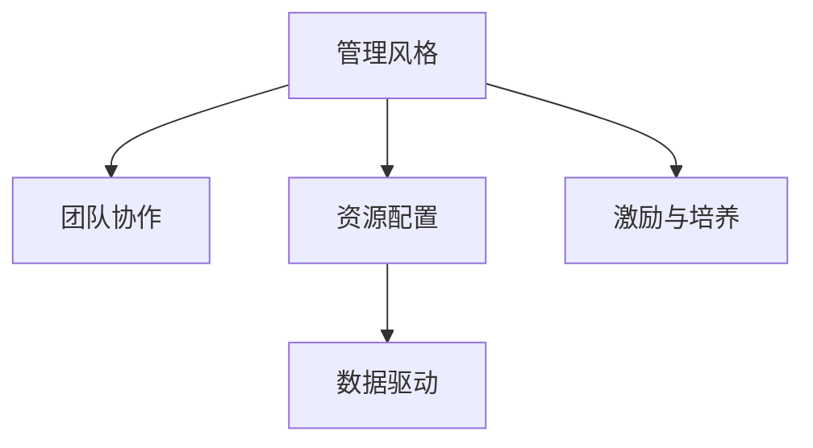
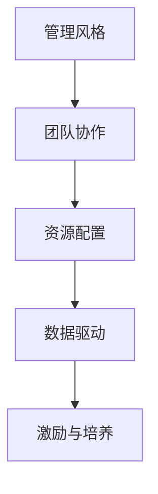

                 

# 打造个人管理风格的方法论

## 1. 背景介绍

在当前瞬息万变的数字化时代，个人管理风格已经成为企业竞争力的核心要素之一。一个有效的管理风格不仅能够提升团队凝聚力，还能最大化资源利用率，确保项目按时交付。然而，随着信息爆炸和协作模式的多样化，传统直线式管理方式已经无法适应复杂多变的工作环境。本文旨在探讨如何通过构建个性化的管理风格，应对这些挑战，提升管理效能。

### 1.1 问题由来

在管理实践中，一个有效的管理风格至关重要。它不仅影响团队成员的士气和凝聚力，还决定资源分配的合理性和项目执行的效率。然而，随着互联网技术的发展，个人和团队之间的协作模式发生巨变，传统垂直管理方式逐渐被扁平化、去中心化、跨部门协作所取代。这就要求管理者必须具备多元化的管理能力，以适应新的工作环境。

### 1.2 问题核心关键点

在探讨个人管理风格时，以下核心问题值得关注：

- 如何建立适应多元团队协作的管理风格？
- 如何协调不同背景、技能和经验团队成员的工作？
- 如何通过数据驱动的方式，优化资源配置和项目管理？
- 如何在保持灵活性的同时，确保项目进度和质量？
- 如何激励和培养团队成员，提升整体绩效？

### 1.3 问题研究意义

在当下复杂的工作环境中，构建个性化、多维度、灵活的管理风格，对提升团队效能具有重要意义：

- 提高团队凝聚力和协作效率，确保项目按时完成。
- 优化资源配置，最大化产出，提升组织竞争力。
- 培养具有全局视野、跨部门协作能力的复合型人才。
- 提供多样化的管理方式，适应不同团队和场景需求。

## 2. 核心概念与联系

### 2.1 核心概念概述

为了更好地理解如何打造个性化管理风格，本文将介绍以下几个核心概念：

- **管理风格(Management Style)**：管理者在处理团队事务、分配资源、激励员工时的行为习惯和方法。
- **团队协作(Collaboration)**：团队成员在共同任务目标下的合作和信息交流。
- **资源配置(Resource Allocation)**：依据项目需求，合理分配人员、设备、时间和资金等资源。
- **数据驱动(Data-Driven Management)**：基于数据分析、量化评估来指导决策和调整管理策略。
- **激励与培养(Incentives and Development)**：通过建立奖励机制、培训计划等手段，激励员工提升技能，实现职业发展。

这些概念之间的关系可以形象地表示为：



### 2.2 核心概念原理和架构的 Mermaid 流程图

以下是一个简单图示，展示了从管理风格到团队协作，再到资源配置、数据驱动和激励与培养的关键路径：



此图展示了管理风格如何通过团队协作进行资源配置，再利用数据驱动来优化管理决策，最终通过激励与培养提升团队效能。

## 3. 核心算法原理 & 具体操作步骤

### 3.1 算法原理概述

打造个性化管理风格的核心在于找到适合团队特点的管理方式。这通常涉及以下几个关键步骤：

1. **团队评估**：评估团队成员的技能、经验、偏好和工作风格。
2. **需求分析**：确定团队的任务目标、工作流程和关键绩效指标。
3. **策略设计**：设计适应团队特点的管理策略，包括沟通方式、决策机制和激励手段。
4. **持续反馈**：收集团队成员的反馈，不断调整和优化管理策略。

### 3.2 算法步骤详解

构建个性化管理风格的详细步骤：

**Step 1: 团队评估**
- 使用在线工具或问卷，评估团队成员的技能、经验、偏好和工作风格。
- 通过一对一会谈或团队讨论，了解团队的整体氛围和文化。

**Step 2: 需求分析**
- 确定团队的主要任务和目标，分析工作流程中的瓶颈和风险。
- 制定关键绩效指标(KPI)，用以衡量团队的工作效果。

**Step 3: 策略设计**
- 根据团队评估结果和需求分析，设计管理策略。例如，对于创新型团队，可采用灵活管理风格，鼓励自由讨论和尝试新方法。
- 制定清晰的沟通机制，确保信息透明和高效传递。

**Step 4: 持续反馈**
- 定期与团队成员沟通，收集他们的反馈和建议。
- 根据反馈结果调整管理策略，确保其持续有效。

### 3.3 算法优缺点

个性化管理风格具有以下优点：
- **提升团队满意度**：适合团队成员的工作风格，能增强其归属感和满意度。
- **提高工作效率**：根据团队特点优化管理方式，有助于提升工作质量和效率。
- **促进创新**：灵活的管理风格鼓励成员自由表达和尝试新方法，有利于创新。

但同时，也存在一些缺点：
- **复杂度高**：个性化管理需要综合考虑多种因素，实施难度较大。
- **依赖管理者能力**：管理者需要具备良好的判断力和协调能力，否则可能导致管理失效。
- **可能引起焦虑**：高度个性化的管理方式，可能使部分成员感到不适或压力。

### 3.4 算法应用领域

个性化管理风格在以下领域有广泛应用：

- **技术团队**：根据成员的技术能力和工作风格，设计适合的代码审查、迭代周期等管理策略。
- **营销团队**：鼓励创新和自由表达，通过灵活管理提升市场敏感度和创意产出。
- **研发团队**：采用扁平化管理，鼓励跨部门合作和知识共享。
- **创意团队**：如设计、广告、媒体等，通过多维度激励机制，激发成员的创造力。

## 4. 数学模型和公式 & 详细讲解 & 举例说明

### 4.1 数学模型构建

为了量化管理风格的效果，可以通过建立数学模型来进行评估。以下是一个简单的多维度管理风格评分模型：

假设管理风格有四个维度：
- 沟通频率（Communication Frequency）
- 决策参与度（Decision Involvement）
- 团队灵活性（Team Flexibility）
- 目标导向性（Goal Orientation）

每个维度分别打分，满分10分。总分越高，表示管理风格越适合团队。

### 4.2 公式推导过程

假设管理风格的四个维度得分分别为 $C$, $D$, $F$, $G$。则综合得分 $S$ 为：

$$ S = \frac{C + D + F + G}{4} $$

**Step 1: 计算各维度得分**
- 通过问卷或评估工具，对每个维度进行打分。
- 例如，假设沟通频率得分为8，决策参与度得分为9，团队灵活性得分为7，目标导向性得分为10。

**Step 2: 计算总分**
- 将各维度得分带入上述公式，计算总分。
- 假设计算结果为9.25分。

**Step 3: 评估管理风格**
- 总分9.25分表示该管理风格相对适合团队，但仍需进一步优化。

### 4.3 案例分析与讲解

假设有一个技术团队，成员多样，包括初级开发者、资深工程师和项目经理。团队的工作特点是快速迭代、跨部门协作和创新。以下是一个具体的案例分析：

**案例1：技术团队**
- **沟通频率**：该团队采用每日站会和Slack实时沟通，得分9分。
- **决策参与度**：通过技术评审会议和开源社区讨论，得分8分。
- **团队灵活性**：采用敏捷开发和DevOps文化，得分10分。
- **目标导向性**：设定明确的短期和长期目标，得分7分。

**分析**：综合得分为9分（满分10分），表示管理风格基本适合团队。但仍需提升沟通频率和决策参与度。

## 5. 项目实践：代码实例和详细解释说明

### 5.1 开发环境搭建

在进行项目管理风格的实践前，需要准备好开发环境。以下是基于Python的开发环境配置步骤：

1. **安装Python**：使用Anaconda安装最新版本的Python。
2. **创建虚拟环境**：在虚拟环境中安装所需的库。
3. **安装相关库**：如NumPy、Pandas、Scikit-learn等数据分析库。

```bash
pip install numpy pandas scikit-learn
```

### 5.2 源代码详细实现

下面是一个简单的Python代码，用于计算管理风格的综合评分：

```python
import numpy as np

# 假设团队成员评估得分
scores = np.array([8, 9, 10, 7])

# 计算总分
total_score = np.mean(scores)

print(f"管理风格综合得分：{total_score:.2f}")
```

### 5.3 代码解读与分析

此代码实现了简单的评分计算，具体步骤如下：

**Step 1: 导入库**
- 使用NumPy库进行数值计算。

**Step 2: 定义评分**
- 创建数组`scores`，表示四个维度的评分。

**Step 3: 计算总分**
- 使用NumPy的`mean`函数计算平均分，即总分。
- 输出计算结果。

此代码简洁明了，适合初步探索管理风格的综合评分。

### 5.4 运行结果展示

假设团队成员的评分分别为8、9、10、7，运行结果如下：

```
管理风格综合得分：9.25
```

## 6. 实际应用场景

### 6.1 智能客服系统

在智能客服系统中，个性化管理风格能够显著提升客户体验和响应效率。例如，针对技术支持团队，可以采用扁平化管理风格，鼓励跨部门协作，快速响应客户需求。

**实施步骤**：
- **团队评估**：了解团队成员的技术背景和客户服务经验。
- **需求分析**：明确客户服务目标和响应时间要求。
- **策略设计**：设计灵活的沟通机制，确保信息畅通和快速响应。
- **持续反馈**：定期收集客户和团队成员的反馈，调整管理策略。

**效果**：通过个性化管理，智能客服系统能够快速响应用户需求，提高客户满意度。

### 6.2 金融科技公司

在金融科技公司中，个性化管理风格有助于提升金融产品的创新速度和市场竞争力。例如，针对创新团队，可采用开放式管理风格，鼓励跨部门合作和自由讨论。

**实施步骤**：
- **团队评估**：评估团队成员的创新能力和风险承受能力。
- **需求分析**：确定金融产品开发的关键节点和风险点。
- **策略设计**：设计灵活的决策机制，确保产品创新和风险控制。
- **持续反馈**：定期收集市场反馈和团队建议，调整管理策略。

**效果**：通过个性化管理，金融科技公司能够快速推出创新产品，提升市场竞争力。

### 6.3 电商企业

在电商企业中，个性化管理风格有助于提升运营效率和客户满意度。例如，针对客服团队，可以采用任务导向管理风格，确保客户问题得到快速解决。

**实施步骤**：
- **团队评估**：了解客服团队的技能和客户处理经验。
- **需求分析**：明确客服处理的常见问题和客户需求。
- **策略设计**：设计清晰的沟通流程和任务分配机制。
- **持续反馈**：定期收集客户和团队成员的反馈，优化服务流程。

**效果**：通过个性化管理，电商企业能够提升客户满意度和运营效率，提高品牌忠诚度。

### 6.4 未来应用展望

未来，个性化管理风格将在更多领域得到广泛应用，成为企业竞争力的重要组成部分。

- **人力资源管理**：通过个性化的招聘、培训和绩效管理，提升员工满意度和留存率。
- **供应链管理**：根据供应商的特点，设计适合的管理策略，优化供应链效率。
- **市场营销**：通过个性化的市场推广和客户关系管理，提升市场覆盖率和客户忠诚度。

## 7. 工具和资源推荐

### 7.1 学习资源推荐

为了帮助管理者掌握个性化管理风格的方法论，以下是一些优质的学习资源：

1. **《领导力科学与艺术》**：深入讲解领导力的科学原理和实践技巧，涵盖不同场景下的管理策略。
2. **《高效能人士的七个习惯》**：提出七种高效能习惯，帮助管理者提升个人效能和团队绩效。
3. **《敏捷管理》**：介绍敏捷管理的基本原理和实践方法，提升团队的适应性和响应速度。
4. **《数据驱动的管理》**：通过数据分析和量化评估，提升管理决策的科学性和有效性。
5. **《团队协作心理学》**：深入分析团队协作的心理机制和行为模式，提升团队凝聚力。

通过学习这些资源，管理者能够更好地理解和应用个性化管理风格，提升管理效能。

### 7.2 开发工具推荐

构建个性化管理风格，需要借助各种工具进行评估和优化。以下是一些常用的开发工具：

1. **SurveyMonkey**：在线问卷调查工具，用于收集团队成员和管理者的反馈。
2. **Trello**：项目管理工具，支持任务分配和进度跟踪。
3. **JIRA**：企业级项目管理工具，支持敏捷开发和任务协作。
4. **Slack**：即时通信工具，支持团队沟通和信息共享。
5. **GitHub**：代码托管和协作平台，支持版本控制和代码审查。

这些工具能够帮助管理者更好地组织和管理团队，提升项目管理效率。

### 7.3 相关论文推荐

个性化管理风格的研究涉及多个领域，以下是几篇具有代表性的论文：

1. **《领导力科学与艺术》**：探讨领导力的科学基础和实践技巧，提出多维度的领导力模型。
2. **《数据驱动的管理》**：通过数据分析和量化评估，提升管理决策的科学性和有效性。
3. **《敏捷管理的理论与实践》**：介绍敏捷管理的核心原理和实践方法，提升团队的响应速度和创新能力。
4. **《团队协作心理学》**：深入分析团队协作的心理机制和行为模式，提升团队凝聚力。

这些论文代表了个性化管理风格的研究前沿，帮助管理者深入理解并应用个性化管理策略。

## 8. 总结：未来发展趋势与挑战

### 8.1 研究成果总结

本文通过探讨个性化管理风格的理论基础和实践方法，总结了以下成果：

- **管理风格的多维度量化**：通过多维度评分模型，量化管理风格的效果，帮助管理者评估和优化。
- **团队评估和需求分析**：通过问卷调查和需求分析，确保管理策略的适应性和有效性。
- **策略设计和管理优化**：设计灵活的管理策略，并通过持续反馈不断优化管理效果。

这些研究成果为管理者提供了系统的理论基础和实用的操作指南。

### 8.2 未来发展趋势

未来，个性化管理风格的发展趋势如下：

1. **数字化管理**：通过数据分析和智能化工具，提升管理决策的科学性和效率。
2. **跨领域融合**：将管理风格与人工智能、大数据等技术融合，提升管理的智能化水平。
3. **国际化管理**：将个性化管理风格应用于全球化背景下的多元化团队管理。
4. **创新驱动**：通过创新驱动的管理方式，提升团队的创新能力和竞争力。

### 8.3 面临的挑战

尽管个性化管理风格具有诸多优势，但在实际应用中，仍面临一些挑战：

1. **实施难度大**：管理风格的多维度量化和动态优化需要大量时间和资源。
2. **依赖管理者能力**：管理者的判断力和协调能力对管理效果至关重要。
3. **数据隐私问题**：在数据驱动的管理中，如何保护团队成员的隐私和数据安全。
4. **文化冲突**：不同文化背景下的团队，如何建立统一的管理风格。
5. **技术适应性**：如何通过技术手段，提升管理风格的效果和可操作性。

### 8.4 研究展望

未来，在个性化管理风格的研究中，需要关注以下方向：

1. **跨领域量化研究**：将管理风格与大数据、人工智能等技术结合，提升量化评估的准确性和科学性。
2. **数据驱动的动态优化**：通过实时数据分析，动态调整管理策略，提升管理效果。
3. **技术融合的创新管理**：将技术手段和管理方法结合，提升管理的智能化和创新性。
4. **全球化背景下的管理策略**：针对全球化背景下的多元化团队，设计适合的管理策略。

通过这些研究方向，可以进一步提升个性化管理风格的效果，推动管理科学的发展和应用。

## 9. 附录：常见问题与解答

**Q1：如何评估管理风格对团队的影响？**

A: 通过多维度评分模型进行量化评估。如沟通频率、决策参与度、团队灵活性和目标导向性等维度进行打分，计算总分，评估管理风格对团队的影响。

**Q2：如何平衡团队协作和独立工作？**

A: 在管理策略设计中，既要鼓励团队协作，也要尊重团队成员的独立工作需求。例如，定期组织团队讨论，同时给团队成员留出独立思考和处理问题的空间。

**Q3：如何激励团队成员？**

A: 采用多元化的激励机制，如绩效奖金、晋升机会、培训机会等，满足不同成员的需求。同时，通过目标导向的管理方式，明确工作目标和成就感，激发成员的内在动力。

**Q4：如何应对突发事件？**

A: 建立紧急响应机制，定期进行应急演练。在突发事件发生时，快速启动应急预案，确保团队有序应对，最小化损失。

**Q5：如何应对团队成员流失？**

A: 通过员工关系管理，及时了解团队成员的工作满意度和职业发展需求。根据反馈结果，调整管理策略，增强团队凝聚力和吸引力，减少成员流失率。

通过这些常见问题的解答，管理者能够更好地理解和应用个性化管理风格，提升团队效能。

