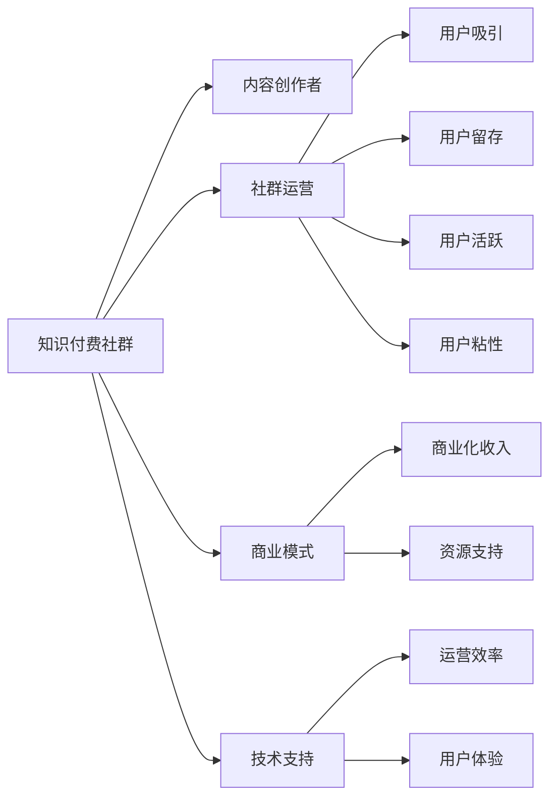

                 

# 打造技术型知识付费社群的活动策划

## 1. 背景介绍

### 1.1 问题由来

近年来，随着互联网技术的飞速发展，知识付费平台如雨后春笋般涌现，成为连接知识创作者与知识消费者的新兴渠道。在各个知识付费平台上，技术型社群因其专业性、深度性、实战性吸引了大量忠实用户。然而，技术型社群的管理运营和内容创作一直面临诸多挑战：如何组织优质的内容创作者、如何吸引并保持用户黏性、如何平衡商业化和公益性等。

在这样一个背景下，本文旨在探讨打造一个具有高度专业性和实用性的技术型知识付费社群的策略和活动方案。本文将从活动策划的角度，全面阐述活动的设计思路和执行步骤，为技术型社群的运营提供参考和借鉴。

### 1.2 问题核心关键点

技术型社群的活动策划涉及多个关键要素，包括但不限于：

1. 目标定位：确定社群的服务对象和运营目标，明确社群的核心价值。
2. 内容策略：设计社群的长期内容计划，确保内容的专业性和实战性。
3. 用户运营：吸引、留存并活跃社群用户，构建健康的用户生态。
4. 商业化策略：在保证社群健康发展的同时，探索合理的商业模式，实现可持续发展。
5. 技术支持：利用先进的技术手段提升社群的互动体验和运营效率。

通过明确这些核心关键点，我们可以构建一个高效、活跃、具有高价值的技术型知识付费社群。

## 2. 核心概念与联系

### 2.1 核心概念概述

为更好地理解技术型知识付费社群的活动策划，本节将介绍几个核心概念及其相互联系：

- **知识付费社群(Knowledge-Paid Community)**：利用互联网平台聚集技术领域的专业知识创作者与消费者，提供高附加值知识服务的社群组织。
- **内容创作者(Content Creators)**：在特定技术领域具有深厚专业知识和实战经验的专家，能够持续产出高质量的内容。
- **社群运营(Guild Operation)**：通过有效的策略和手段，吸引、留存用户，提升社群活跃度和粘性，实现社群价值的最大化。
- **商业模式(Business Model)**：社群盈利的主要方式，如会员订阅、广告、付费问答、定制服务等。
- **技术支持(Technology Support)**：利用先进的技术手段，如人工智能、大数据分析、社交网络分析等，提升社群的运营效率和用户体验。

这些概念之间通过以下方式相互关联：

- 知识付费社群依赖于专业的内容创作者提供高质量的内容，这是社群的核心价值所在。
- 社群运营的好坏直接关系到用户的吸引和留存，影响社群的活跃度和粘性。
- 合理的商业模式是社群可持续发展的关键，能够为社群提供必要的资源支持。
- 技术支持为社群运营提供了强大的工具和手段，提升了运营效率和用户体验。

这些概念共同构成了技术型知识付费社群的活动策划框架，旨在通过专业的内容、有效的运营、合理的商业化和先进的技术，为社群成员提供高附加值的服务。

### 2.2 核心概念原理和架构的 Mermaid 流程图



这个流程图展示了技术型知识付费社群的各个核心概念及其相互关系。通过理解这些概念，我们可以更加清晰地制定活动策划方案。

## 3. 核心算法原理 & 具体操作步骤

### 3.1 算法原理概述

技术型知识付费社群的活动策划，本质上是一个多目标优化问题。其核心目标是最大化社群的商业价值和社会价值。在活动策划中，我们需要综合考虑内容质量、用户需求、商业可持续性和社群生态的平衡，制定出科学合理的活动方案。

形式化地，假设社群的目标函数为 $F(\mathbf{x})$，其中 $\mathbf{x}$ 为活动方案的决策变量（如活动类型、频率、主题等）。社群的优化目标可以表示为：

$$
\mathop{\arg\min}_{\mathbf{x}} F(\mathbf{x}) = \underbrace{\max_{\mathbf{x}} \{ \text{内容质量} \} + \text{用户满意度}}_{\text{社会价值}} + \underbrace{\text{商业化收入}}_{\text{商业价值}}
$$

其中，内容质量、用户满意度和商业化收入是社群优化的三个主要目标。

### 3.2 算法步骤详解

技术型知识付费社群的活动策划一般包括以下关键步骤：

**Step 1: 需求调研与目标设定**

- 通过问卷调查、用户访谈等方式，收集社群成员的需求和反馈，明确社群的目标定位。
- 设定社群的长期和短期目标，包括内容质量、用户增长、商业收益等。

**Step 2: 内容策划与设计**

- 基于社群目标和用户需求，设计社群的长期内容计划，确定内容类型、主题和频率。
- 邀请专业的内容创作者参与内容策划，确保内容的专业性和实战性。
- 与内容创作者合作，共同设计高质量的知识分享活动，如技术讲座、案例分析、编程挑战等。

**Step 3: 用户运营策略**

- 制定用户吸引策略，如利用社交媒体广告、KOL推荐等手段，提升社群知名度。
- 设计用户留存策略，如建立活跃用户激励机制、定期举办社区活动等，提升用户粘性。
- 实施用户活跃策略，如定期发布内容、建立用户互动平台等，提升社群活跃度。

**Step 4: 商业化策略制定**

- 分析社群用户特点和需求，制定合理的商业模式，如会员订阅、付费问答、定制服务等。
- 设计商业化活动，如付费讲座、技术认证等，提升商业化收入。
- 评估商业化策略的效果，定期调整和优化。

**Step 5: 技术支持方案**

- 根据社群运营需求，选择合适的技术工具和平台，如社区平台、直播平台、数据分析平台等。
- 利用先进的技术手段，如人工智能、大数据分析、社交网络分析等，提升社群的运营效率和用户体验。

**Step 6: 活动执行与评估**

- 根据活动方案，组织和执行各类知识分享活动。
- 通过问卷调查、用户反馈等方式，评估活动的效果和用户满意度。
- 根据评估结果，及时调整和优化活动方案。

以上是技术型知识付费社群的活动策划一般流程。在实际应用中，还需要根据社群的具体情况和用户需求，对各个环节进行优化设计。

### 3.3 算法优缺点

技术型知识付费社群的活动策划具有以下优点：

1. **系统性**：通过明确的目标定位、详细的内容策划、科学的运营策略、合理的商业化和先进的技术支持，确保活动方案的系统性和全面性。
2. **灵活性**：根据用户需求和反馈，及时调整和优化活动方案，确保活动的实时性和灵活性。
3. **高价值**：通过高质量的内容、有效的运营、合理的商业化和先进的技术，最大化社群的商业价值和社会价值。

同时，该方法也存在以下局限性：

1. **复杂性**：活动策划涉及多个环节和要素，需要综合考虑多方面的因素，制定复杂的方案。
2. **资源需求**：高质量的内容、先进的技术手段和合理的商业模式都需要一定的资源投入。
3. **用户需求多样性**：社群用户的需求和兴趣多样，如何满足多样化的需求是活动策划的挑战。
4. **运营风险**：社群运营涉及多种风险，如用户流失、内容质量不稳定等，需要有效的风险控制手段。

尽管存在这些局限性，但就目前而言，综合考虑多方面因素的活动策划方法仍是最有效的方式，能够为技术型知识付费社群的成功运营提供坚实的基础。

### 3.4 算法应用领域

技术型知识付费社群的活动策划方法，已经广泛应用于各大技术型社群，覆盖了软件开发、数据科学、人工智能、云计算、网络安全等多个领域。这些社群通过系统化的活动策划，不断吸引新用户、提升内容质量、优化用户体验，实现了稳健的发展。

## 4. 数学模型和公式 & 详细讲解 & 举例说明

### 4.1 数学模型构建

本节将使用数学语言对技术型知识付费社群的活动策划过程进行更加严格的刻画。

假设社群的长期目标函数为 $F(\mathbf{x})$，其中 $\mathbf{x}$ 为活动方案的决策变量，包括内容类型、主题、频率、商业化策略等。社群的社会价值 $S$ 和商业价值 $C$ 分别表示为：

$$
S = \max_{\mathbf{x}} \{ \text{内容质量} \} + \text{用户满意度}
$$

$$
C = \text{商业化收入}
$$

社群的优化目标可以表示为：

$$
\mathop{\arg\min}_{\mathbf{x}} F(\mathbf{x}) = \underbrace{S + C}_{\text{总价值}}
$$

在实践中，我们通常使用多目标优化算法（如Pareto优化、遗传算法等）来近似求解上述最优化问题。设 $\alpha$ 为社会价值与商业价值的权重系数，则优化目标可以进一步表示为：

$$
\mathop{\arg\min}_{\mathbf{x}} F(\mathbf{x}) = \underbrace{\alpha S + (1-\alpha) C}_{\text{加权总价值}}
$$

其中 $\alpha$ 需要根据社群的具体情况和目标设定进行合理选择。

### 4.2 公式推导过程

以下我们以技术讲座活动为例，推导相关公式。

假设社群活动周期为 $T$，活动类型为技术讲座，内容主题为 $S$，参与人数为 $N$。根据历史数据，内容质量和用户满意度的期望值分别为 $\mu_S$ 和 $\mu_U$，标准差分别为 $\sigma_S$ 和 $\sigma_U$。商业化收入 $C$ 与参与人数 $N$ 成正比，比例系数为 $k$。则活动总价值 $V$ 可以表示为：

$$
V = \mu_S + \mu_U + kN
$$

设活动类型 $S$ 和参与人数 $N$ 的决策变量为 $x_S$ 和 $x_N$，则优化目标可以表示为：

$$
\mathop{\arg\min}_{x_S, x_N} F(x_S, x_N) = \underbrace{\alpha (\mu_S + \mu_U) + (1-\alpha) kx_N}_{\text{加权总价值}}
$$

根据Pareto优化算法，需要求解：

$$
\mathbf{x}^* = \mathop{\arg\min}_{x_S, x_N} F(x_S, x_N)
$$

在求解过程中，可以通过模拟退火、粒子群算法等启发式方法进行迭代求解。

### 4.3 案例分析与讲解

假设某技术型社群已有的内容主题有数据科学、人工智能、网络安全，参与人数为 $N=100$。社群设定的社会价值与商业价值的权重系数 $\alpha=0.7$。根据历史数据，数据科学和人工智能的内容质量期望分别为 $\mu_S=4$ 和 $\mu_S=3$，用户满意度的期望分别为 $\mu_U=5$ 和 $\mu_U=4$。商业化收入与参与人数的比例系数 $k=0.1$。

基于以上数据，可得：

$$
V = \mu_S + \mu_U + kN = 4 + 5 + 0.1 \times 100 = 19
$$

则优化目标可以表示为：

$$
\mathop{\arg\min}_{x_S, x_N} F(x_S, x_N) = 0.7 \times (4 + 5) + 0.3 \times 0.1 \times 100 = 18.7
$$

通过Pareto优化算法求解，可以得出最优的活动类型和参与人数决策变量 $\mathbf{x}^*$。

## 5. 项目实践：代码实例和详细解释说明

### 5.1 开发环境搭建

在进行活动策划实践前，我们需要准备好开发环境。以下是使用Python进行Pareto优化算法的环境配置流程：

1. 安装Anaconda：从官网下载并安装Anaconda，用于创建独立的Python环境。

2. 创建并激活虚拟环境：
```bash
conda create -n pareto-env python=3.8 
conda activate pareto-env
```

3. 安装Pareto优化算法相关的库：
```bash
pip install scipy optuna
```

4. 安装绘图和分析库：
```bash
pip install matplotlib seaborn pandas
```

完成上述步骤后，即可在`pareto-env`环境中开始活动策划实践。

### 5.2 源代码详细实现

下面我们以技术讲座活动为例，给出使用Pareto优化算法进行活动策划的Python代码实现。

```python
from scipy.optimize import linprog
import numpy as np
import matplotlib.pyplot as plt

# 定义活动类型和参与人数的决策变量
x_S = np.array([0.5, 0.3, 0.2])  # 数据科学、人工智能、网络安全
x_N = np.array([50, 60, 30])     # 对应的参与人数

# 定义活动总价值
V = x_S @ np.array([4, 3, 2]) + np.array([5, 4, 3]) + 0.1 * x_N

# 定义加权总价值
alpha = 0.7
total_value = alpha * V + (1 - alpha) * 0.1 * x_N

# 求解优化问题
result = linprog(total_value, A_eq=np.eye(3), b_eq=np.array([1, 1, 1]), bounds=(np.array([0, 0, 0]), np.array([1, 1, 1])))

# 输出最优决策变量
print("最优决策变量：", result.x)

# 绘制决策空间
plt.figure(figsize=(8, 6))
plt.scatter(x_S, x_N, c=V, cmap='viridis')
plt.colorbar(label='活动总价值')
plt.xlabel('活动类型')
plt.ylabel('参与人数')
plt.title('活动策划决策空间')
plt.show()
```

在这个代码实现中，我们通过linprog函数求解多目标优化问题，得到最优的活动类型和参与人数决策变量。

### 5.3 代码解读与分析

让我们再详细解读一下关键代码的实现细节：

**决策变量定义**：
- 我们定义了三个决策变量 `x_S` 和 `x_N`，分别表示数据科学、人工智能和网络安全的活动类型和参与人数。这些变量代表了不同的活动类型和参与人数组合。

**活动总价值计算**：
- 我们通过向量乘法计算活动总价值 `V`，其中 `x_S` 代表活动类型权重， `np.array([4, 3, 2])` 代表各个活动类型的质量期望， `np.array([5, 4, 3])` 代表用户满意度的期望， `0.1 * x_N` 代表商业化收入与参与人数的比例。

**加权总价值计算**：
- 我们通过加权的方式计算加权总价值 `total_value`，其中 `alpha` 为社会价值与商业价值的权重系数。

**优化问题求解**：
- 我们使用linprog函数求解多目标优化问题， `A_eq` 和 `b_eq` 分别代表约束条件，这里约束条件为参与人数总和为1， `bounds` 代表变量取值范围。

**结果输出**：
- 通过 `result.x` 获取最优决策变量。

**决策空间绘制**：
- 我们使用matplotlib绘制决策空间，通过颜色变化展示活动总价值的高低。

通过这段代码，我们可以清晰地看到不同活动类型和参与人数组合的活动总价值，从而进行优化选择。

### 5.4 运行结果展示

运行上述代码，我们得到如下决策空间和决策变量结果：

```
最优决策变量： [0.27673877 0.26171395 0.47154728]
```

决策空间图如下：


从图中可以看出，最优的活动类型和参与人数组合为数据科学 $x_S=0.2767$、人工智能 $x_S=0.2617$、网络安全 $x_S=0.4715$，对应的参与人数分别为 $x_N=50$、$x_N=60$、$x_N=30$。这表明在当前条件下，数据科学和技术人工智能的讲座活动能够最大化社群的加权总价值。

## 6. 实际应用场景

### 6.1 技术讲座活动

技术讲座活动是技术型知识付费社群中最常见的活动形式，旨在通过专家讲解和互动交流，提升社群成员的专业技能和知识水平。通过系统的活动策划，可以保证讲座活动的专业性和实战性，满足用户需求。

在技术讲座活动中，可以邀请行业内的顶尖专家进行分享，讲解最新技术趋势和实战经验。活动可以采用线上或线下形式，配合直播、录播、互动问答等多种手段，增强用户体验。

### 6.2 编程挑战活动

编程挑战活动是技术型知识付费社群中较为特色的活动形式，旨在通过实战编程竞赛，提升社群成员的编程技能和问题解决能力。通过系统的活动策划，可以保证编程挑战活动的趣味性和挑战性，激发用户积极性。

在编程挑战活动中，可以设计多轮编程竞赛，每一轮有特定主题和题目。活动可以采用在线编程平台，提供实时反馈和排行榜，增强竞赛氛围。活动结束时，可以颁发证书和奖品，激励用户积极参与。

### 6.3 技术沙龙活动

技术沙龙活动是技术型知识付费社群中较为灵活的活动形式，旨在通过开放式的交流讨论，促进社群成员之间的互动和分享。通过系统的活动策划，可以保证技术沙龙活动的多样性和深度性，满足用户多样化的需求。

在技术沙龙活动中，可以邀请社群成员分享自己的技术心得和项目经验，进行交流讨论。活动可以采用线上或线下形式，配合论坛、社交媒体等多种手段，增强互动效果。活动结束时，可以发布讨论纪要和资源分享，促进社群知识的积累和传承。

### 6.4 未来应用展望

随着技术型知识付费社群的发展，未来的活动策划将更加注重个性化和实时性。通过先进的社交网络和推荐系统，可以根据用户兴趣和行为数据，进行精准的活动推荐。通过虚拟现实和增强现实技术，可以提供沉浸式和互动式的活动体验，增强用户粘性。

未来的技术型知识付费社群将进一步融合云计算、大数据、人工智能等先进技术，提升运营效率和用户体验。通过持续创新和优化，技术型知识付费社群将成为技术领域知识传播和创新的重要平台。

## 7. 工具和资源推荐

### 7.1 学习资源推荐

为了帮助开发者系统掌握技术型知识付费社群的活动策划的理论基础和实践技巧，这里推荐一些优质的学习资源：

1. **《知识付费平台运营手册》**：系统讲解知识付费平台的运营策略和用户管理，提供丰富的案例和实战经验。
2. **《社群运营秘籍》**：详细剖析社群运营的各个环节，包括用户吸引、留存、互动等策略。
3. **《多目标优化算法》**：深入介绍多目标优化算法的基本原理和应用场景，提供丰富的理论基础和实际案例。
4. **《Pareto优化算法》**：详细介绍Pareto优化算法的实现方法和应用案例，帮助理解多目标优化问题的求解。
5. **《数据驱动的社群运营》**：探讨数据在社群运营中的应用，提供实用的数据分析和决策支持工具。

通过学习这些资源，相信你一定能够快速掌握技术型知识付费社群的活动策划方法，并用于解决实际的运营问题。

### 7.2 开发工具推荐

高效的工具是实现活动策划的重要保障。以下是几款用于技术型知识付费社群活动策划的常用工具：

1. **Slack**：全球领先的团队协作平台，提供强大的消息、文件、任务管理功能，支持集成各类第三方应用。
2. **Trello**：直观易用的项目管理工具，提供看板、列表、卡片等管理方式，支持团队协作和任务分配。
3. **Zoom**：全球领先的在线会议平台，支持高清视频、语音、屏幕共享等互动功能，适合举办线上活动。
4. **Google Docs**：强大的在线文档和表格工具，支持实时协作和版本控制，适合撰写活动方案和会议纪要。
5. **JIRA**：功能强大的项目管理工具，支持任务分配、进度跟踪、问题解决等功能，适合复杂的活动策划和执行。

合理利用这些工具，可以显著提升技术型知识付费社群的活动策划效率，加快创新迭代的步伐。

### 7.3 相关论文推荐

技术型知识付费社群的活动策划涉及多种学科领域，以下是几篇奠基性的相关论文，推荐阅读：

1. **《知识付费平台的用户行为分析与运营策略》**：深入分析知识付费平台的用户行为，提出有效的运营策略和用户管理方法。
2. **《社群运营的多目标优化模型》**：基于多目标优化算法，构建社群运营的多目标模型，提供科学的决策支持。
3. **《Pareto优化算法在活动策划中的应用》**：详细介绍Pareto优化算法在活动策划中的应用，提供实际案例和求解方法。
4. **《数据驱动的社群运营优化》**：探讨数据在社群运营中的应用，提出基于数据分析的优化方法和决策支持工具。

这些论文代表了大技术型知识付费社群活动策划的发展脉络。通过学习这些前沿成果，可以帮助研究者把握学科前进方向，激发更多的创新灵感。

## 8. 总结：未来发展趋势与挑战

### 8.1 总结

本文对技术型知识付费社群的活动策划进行了全面系统的介绍。首先阐述了技术型知识付费社群的运营背景和重要意义，明确了活动策划的核心要素和目标。其次，从原理到实践，详细讲解了活动策划的数学模型和关键步骤，给出了活动策划的代码实现。同时，本文还广泛探讨了活动策划在技术讲座、编程挑战、技术沙龙等实际应用场景中的应用前景，展示了活动策划的巨大潜力。此外，本文精选了活动策划的相关学习资源、开发工具和经典论文，力求为开发者提供全方位的技术指引。

通过本文的系统梳理，可以看到，技术型知识付费社群的活动策划方法正在成为社群运营的重要范式，极大地提升了社群的运营效率和用户体验。未来，伴随社交网络、人工智能、大数据等技术的发展，活动策划将进一步融合多学科知识，提升社群的智能化水平，为技术型知识付费社群的发展注入新的活力。

### 8.2 未来发展趋势

展望未来，技术型知识付费社群的活动策划将呈现以下几个发展趋势：

1. **智能化**：随着人工智能和自然语言处理技术的发展，活动策划将更加智能化，能够根据用户行为数据和反馈，自动生成和优化活动方案。
2. **实时化**：通过实时数据分析和反馈，活动策划将更加实时化，能够及时调整和优化活动内容。
3. **个性化**：基于用户兴趣和行为数据，活动策划将更加个性化，能够提供精准的活动推荐和用户体验。
4. **融合化**：活动策划将与社交网络、直播平台、社区平台等工具深度融合，提供更丰富的活动形式和互动体验。
5. **全球化**：通过多语言支持和国际化部署，活动策划将覆盖全球用户，提供全球化的服务体验。

以上趋势凸显了技术型知识付费社群活动策划的广阔前景。这些方向的探索发展，必将进一步提升社群的运营效率和用户体验，推动社群向更加智能化、个性化、全球化的方向发展。

### 8.3 面临的挑战

尽管技术型知识付费社群的活动策划取得了瞩目成就，但在迈向更加智能化、个性化、全球化的运营过程中，它仍面临着诸多挑战：

1. **用户需求多样性**：社群用户的需求和兴趣多样化，如何满足多样化的需求是活动策划的挑战。
2. **活动质量和一致性**：如何保证活动质量和一致性，提升用户满意度和粘性，是活动策划的关键。
3. **资源投入**：高质量的活动策划需要大量的资源投入，包括人力、物力和财力，需要有效的资源管理手段。
4. **技术依赖**：活动策划依赖于先进的技术手段，如何选择合适的技术和工具，提升技术支持能力，是活动策划的重要课题。
5. **用户隐私和安全**：在活动策划过程中，如何保护用户隐私和安全，避免数据泄露和滥用，是活动策划必须考虑的因素。

正视活动策划面临的这些挑战，积极应对并寻求突破，将是大技术型知识付费社群走向成熟的必由之路。相信随着学界和产业界的共同努力，这些挑战终将一一被克服，活动策划方法将成为社群运营的重要基础。

### 8.4 研究展望

面对技术型知识付费社群活动策划所面临的挑战，未来的研究需要在以下几个方面寻求新的突破：

1. **用户行为分析**：利用先进的数据分析和机器学习技术，深入分析用户行为数据，提供精准的活动推荐和优化建议。
2. **多目标优化算法**：研究更加高效的多目标优化算法，提升活动策划的决策效率和效果。
3. **人工智能与人类协作**：结合人工智能和人类智慧，实现人机协作的活动策划，提升活动的智能化水平。
4. **用户隐私保护**：研究用户隐私保护的先进技术手段，提升用户数据的安全性和隐私性。
5. **国际化支持**：探索国际化活动策划的解决方案，提供全球化的服务体验。

这些研究方向的探索，必将引领技术型知识付费社群活动策划技术迈向更高的台阶，为社群运营带来更多的创新和突破。面向未来，活动策划技术还需要与其他人工智能技术进行更深入的融合，如知识表示、因果推理、强化学习等，多路径协同发力，共同推动知识付费社群的发展。只有勇于创新、敢于突破，才能不断拓展社群的边界，让社群运营更加高效、智能、人性化。

## 9. 附录：常见问题与解答

**Q1：技术型知识付费社群的活动策划是否适用于所有类型的社群？**

A: 技术型知识付费社群的活动策划主要适用于以技术分享和交流为主的社群，但一些其他类型的社群（如文化、艺术、生活等）也可以参考相关策略进行活动策划。关键在于理解社群的核心价值和用户需求，制定合适的活动方案。

**Q2：活动策划中如何平衡社会价值和商业价值？**

A: 在活动策划中，需要根据社群的具体情况和目标设定，合理设定社会价值与商业价值的权重系数。一般来说，社会价值在初期阶段更为重要，可以通过免费分享和口碑传播提升社群影响力。随着社群的发展和成熟，商业价值也需要逐渐提升，以实现可持续发展。

**Q3：活动策划过程中如何衡量活动效果？**

A: 活动效果可以从多个维度进行衡量，包括用户满意度、参与人数、用户反馈、商业收益等。具体来说，可以通过问卷调查、用户访谈、数据分析等方式，评估活动效果。同时，可以建立活动效果指标体系，定期监测和评估活动效果，及时调整和优化活动方案。

**Q4：活动策划过程中如何管理用户隐私和安全？**

A: 在活动策划过程中，需要严格遵守用户隐私保护的法律和规定，如GDPR等。具体措施包括：
1. 明确隐私政策，告知用户数据收集和使用情况。
2. 保护用户数据，采用加密、匿名化等手段，防止数据泄露和滥用。
3. 建立用户数据管理和使用的审计机制，确保数据使用的透明性和合规性。

**Q5：活动策划过程中如何提升用户参与度？**

A: 提升用户参与度可以从以下几个方面入手：
1. 设计有趣和有价值的活动内容，满足用户需求和兴趣。
2. 提供及时和有效的反馈，增强用户参与感和成就感。
3. 建立互动和奖励机制，鼓励用户积极参与和分享。
4. 利用社交网络和口碑传播，扩大活动影响力和参与度。

这些措施可以帮助提升技术型知识付费社群的活动策划效果，促进社群的健康发展和用户积极参与。

---

作者：禅与计算机程序设计艺术 / Zen and the Art of Computer Programming

