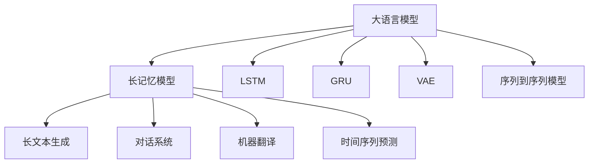

                 

# 扩展AI的记忆：LLM长期上下文处理技术

大语言模型（Large Language Model, LLM），如GPT-3、BERT等，已经展示了在自然语言处理（Natural Language Processing, NLP）领域的强大能力，能够处理复杂的语言理解和生成任务。但传统的语言模型普遍存在上下文窗口短、长期依赖关系处理能力有限等问题，限制了其应用范围和性能。近年来，研究者们提出了多种长记忆模型（Long Memory Model），以期增强大语言模型的长期上下文处理能力。本文将全面介绍大语言模型的长期上下文处理技术，包括长记忆模型的原理、实现方法及实际应用。

## 1. 背景介绍

### 1.1 问题由来

大语言模型通过大规模无标签文本数据进行预训练，能够捕捉丰富的语言知识和语义信息。然而，由于模型的注意力机制（Attention Mechanism）通常是局部性的，难以有效处理远距离的上下文信息。比如，在长文本生成任务中，模型往往难以保留长期依赖关系，导致输出结果出现语法错误、语义不清等问题。

为了解决这个问题，研究人员设计了多种长记忆模型，以增强大语言模型处理长期上下文的能力。这些模型通常包含机制如长短期记忆网络（Long Short-Term Memory, LSTM）、门控循环单元（Gated Recurrent Unit, GRU）、变分自编码器（Variational Autoencoder, VAE）等，可以在保留较长时间步序列信息的同时，避免过拟合。

### 1.2 问题核心关键点

长记忆模型的核心思想是通过引入额外机制来模拟人类大脑的长期记忆功能，使得模型能够在处理长序列时，保留历史信息的长期依赖关系，避免信息丢失。研究者们通过长记忆模型改善了传统语言模型的短时记忆特性，增强了模型对长文本的理解能力。

在具体实现中，长记忆模型通常包含以下关键特性：
- 长序列建模：模型能够处理长度超过数百个甚至数千个时间步的序列数据。
- 记忆细胞：模型通过记忆细胞记录过去的信息，并根据新信息更新记忆内容。
- 非线性动态：记忆细胞中信息更新的非线性变换，能够有效处理复杂的时序依赖关系。
- 门控机制：通过门控机制控制信息的输入、输出和遗忘，避免过拟合。

这些特性使得长记忆模型在长文本生成、对话系统、机器翻译、时间序列预测等应用中，能够取得比传统模型更好的效果。

### 1.3 问题研究意义

研究长记忆模型，对于拓展大语言模型的应用范围，提升长文本处理性能，加速NLP技术的产业化进程，具有重要意义：

1. 降低应用开发成本。长记忆模型可以处理更长的序列数据，适应更多的下游任务，减少从头开发所需的数据、计算和人力等成本投入。
2. 提升模型效果。长记忆模型通过保留历史信息，能够更好地理解长文本的语义和逻辑，从而在特定任务上取得优异的性能。
3. 加速开发进度。standing on the shoulders of giants，长记忆模型可以更快地适配新任务，缩短开发周期。
4. 带来技术创新。长记忆模型为预训练-微调的深入研究提供了新的思路，催生了多个前沿研究方向。
5. 赋能产业升级。长记忆模型使得NLP技术更容易被各行各业所采用，为传统行业数字化转型升级提供新的技术路径。

## 2. 核心概念与联系

### 2.1 核心概念概述

为了更好地理解长记忆模型的工作原理，本节将介绍几个密切相关的核心概念：

- 大语言模型（Large Language Model, LLM）：以自回归（如GPT）或自编码（如BERT）模型为代表的大规模预训练语言模型。通过在大规模无标签文本语料上进行预训练，学习通用的语言表示，具备强大的语言理解和生成能力。

- 长记忆模型（Long Memory Model）：指能够处理长序列数据的模型，通过引入记忆细胞、非线性变换、门控机制等，模拟人类大脑的长期记忆功能，增强模型对远距离上下文的处理能力。

- 长短期记忆网络（Long Short-Term Memory, LSTM）：一种常用于长记忆建模的RNN模型，包含长记忆单元和门控机制，能够处理长序列数据，避免梯度消失问题。

- 变分自编码器（Variational Autoencoder, VAE）：一种生成模型，通过编码器-解码器结构，捕捉数据的潜在分布，能够生成高质量的长期记忆数据。

- 门控循环单元（Gated Recurrent Unit, GRU）：一种改进的RNN模型，通过门的控制，实现信息选择性的输入和输出，避免过拟合。

- 序列到序列模型（Sequence-to-Sequence Model）：一种通用的框架，通过编码器-解码器结构，实现序列数据的转换和生成，如机器翻译、对话生成等。

这些核心概念之间的逻辑关系可以通过以下Mermaid流程图来展示：



这个流程图展示了大语言模型与长记忆模型的关系，以及长记忆模型在多个NLP任务中的应用。

## 3. 核心算法原理 & 具体操作步骤

### 3.1 算法原理概述

长记忆模型的核心思想是通过引入额外机制来模拟人类大脑的长期记忆功能，使得模型能够在处理长序列时，保留历史信息的长期依赖关系，避免信息丢失。其基本原理包括：

1. **记忆细胞（Memory Cell）**：通过记忆细胞记录过去的信息，并根据新信息更新记忆内容。
2. **非线性动态**：记忆细胞中信息更新的非线性变换，能够有效处理复杂的时序依赖关系。
3. **门控机制（Gating Mechanism）**：通过门控机制控制信息的输入、输出和遗忘，避免过拟合。

在具体实现中，长记忆模型通常包含长短期记忆网络（LSTM）、门控循环单元（GRU）、变分自编码器（VAE）等结构。这些模型通过模拟人类大脑的记忆过程，使得模型能够处理长序列数据，保留历史信息，从而增强模型的长期上下文处理能力。

### 3.2 算法步骤详解

长记忆模型的训练过程主要包括以下几个关键步骤：

**Step 1: 准备数据集**
- 收集需要处理的长序列数据，如长文本、时间序列等。
- 将数据划分为训练集、验证集和测试集。
- 对长序列进行划分，每个样本包含一定长度的时间步。

**Step 2: 设计长记忆网络**
- 根据任务需求选择合适的长记忆模型，如LSTM、GRU、VAE等。
- 定义模型结构，包含记忆细胞、门控机制、非线性变换等。

**Step 3: 设置超参数**
- 确定模型参数，如神经元个数、激活函数等。
- 设置训练参数，如学习率、批大小、迭代轮数等。
- 选择正则化技术，如L2正则、Dropout等。

**Step 4: 执行训练**
- 使用训练集数据对长记忆模型进行训练。
- 在每个时间步上，将输入数据输入模型，计算记忆细胞更新。
- 通过门控机制控制信息的输入、输出和遗忘。
- 使用反向传播算法更新模型参数。

**Step 5: 评估和调整**
- 在验证集上评估模型性能，使用合适的指标（如BLEU、ROUGE等）进行评估。
- 根据评估结果调整模型参数，重新训练。
- 在测试集上测试最终模型，评估其长期上下文处理能力。

### 3.3 算法优缺点

长记忆模型在处理长序列数据方面具有以下优点：
1. 增强长期依赖关系处理能力。通过记忆细胞和门控机制，能够有效处理远距离的上下文信息。
2. 避免梯度消失问题。长记忆模型通常包含非线性变换，能够有效传播梯度，避免传统RNN模型的梯度消失问题。
3. 增强模型泛化能力。长记忆模型能够捕捉长序列数据中的潜在模式，提升模型泛化能力。

但长记忆模型也存在一定的局限性：
1. 计算复杂度较高。长记忆模型通常包含大量参数，计算复杂度较高。
2. 过拟合风险增加。由于记忆细胞的非线性变换，长记忆模型更容易过拟合，需要更多的正则化手段。
3. 训练成本高。长记忆模型通常需要更长的训练时间，对硬件资源要求较高。

尽管存在这些局限性，但长记忆模型在长序列数据处理、长文本生成、对话系统等应用中，仍然取得了显著效果。

### 3.4 算法应用领域

长记忆模型在NLP领域已经得到了广泛应用，覆盖了几乎所有常见任务，例如：

- 长文本生成：如文章生成、故事续写等。通过长记忆模型保留历史信息，生成高质量的长文本。
- 对话系统：对多轮对话历史进行建模，生成符合上下文的回复。
- 机器翻译：通过长记忆模型保留源语言的历史信息，生成流畅的目标语言翻译。
- 时间序列预测：如股票价格预测、天气预测等。通过长记忆模型捕捉时间序列中的长期依赖关系，进行预测。
- 视频描述生成：通过对视频帧的长期依赖关系进行建模，生成视频描述。

除了上述这些经典任务外，长记忆模型还被创新性地应用到更多场景中，如可控文本生成、多模态信息融合等，为NLP技术带来了全新的突破。随着长记忆模型的不断进步，相信NLP技术将在更广阔的应用领域大放异彩。

## 4. 数学模型和公式 & 详细讲解

### 4.1 数学模型构建

长记忆模型的数学模型可以通过以下框架来构建：

假设输入序列为 $x=(x_1, x_2, \ldots, x_T)$，其中 $x_t$ 表示时间步 $t$ 的输入，$T$ 表示总时间步数。模型的输出为 $y=(y_1, y_2, \ldots, y_T)$，其中 $y_t$ 表示时间步 $t$ 的输出。

长记忆模型通常由编码器（Encoder）和解码器（Decoder）组成，编码器用于捕捉输入序列的信息，解码器用于生成输出序列。编码器由多个长记忆单元（LSTM、GRU）组成，每个长记忆单元包含记忆细胞、输入门、输出门和遗忘门，具体形式如下：

$$
\begin{aligned}
h_t &= f(W_h \cdot [h_{t-1}, x_t] + b_h) \\
i_t &= \sigma(W_i \cdot [h_{t-1}, x_t] + b_i) \\
f_t &= \sigma(W_f \cdot [h_{t-1}, x_t] + b_f) \\
o_t &= \sigma(W_o \cdot [h_{t-1}, x_t] + b_o) \\
c_t &= f_t \cdot c_{t-1} + i_t \cdot tanh(h_t) \\
h_t &= o_t \cdot tanh(c_t)
\end{aligned}
$$

其中 $h_t$ 表示时间步 $t$ 的记忆细胞状态，$c_t$ 表示时间步 $t$ 的记忆内容，$W_h$、$W_i$、$W_f$、$W_o$ 为权重矩阵，$b_h$、$b_i$、$b_f$、$b_o$ 为偏置向量，$\sigma$ 为激活函数，$tanh$ 为双曲正切函数。

### 4.2 公式推导过程

以LSTM模型为例，推导其记忆细胞和门控机制的更新公式。

定义输入门、遗忘门和输出门为 $i_t$、$f_t$、$o_t$，记忆内容为 $c_t$，记忆细胞状态为 $h_t$。则LSTM模型在时间步 $t$ 的更新公式如下：

$$
\begin{aligned}
i_t &= \sigma(W_i \cdot [h_{t-1}, x_t] + b_i) \\
f_t &= \sigma(W_f \cdot [h_{t-1}, x_t] + b_f) \\
o_t &= \sigma(W_o \cdot [h_{t-1}, x_t] + b_o) \\
c_t &= f_t \cdot c_{t-1} + i_t \cdot tanh(h_t) \\
h_t &= o_t \cdot tanh(c_t)
\end{aligned}
$$

其中 $h_t$ 表示时间步 $t$ 的记忆细胞状态，$c_t$ 表示时间步 $t$ 的记忆内容，$W_i$、$W_f$、$W_o$ 为权重矩阵，$b_i$、$b_f$、$b_o$ 为偏置向量，$\sigma$ 为激活函数，$tanh$ 为双曲正切函数。

在推导过程中，通过链式法则，可以得到输入门、遗忘门和输出门的更新公式。具体如下：

$$
\begin{aligned}
i_t &= \sigma(W_i \cdot [h_{t-1}, x_t] + b_i) \\
f_t &= \sigma(W_f \cdot [h_{t-1}, x_t] + b_f) \\
o_t &= \sigma(W_o \cdot [h_{t-1}, x_t] + b_o) \\
c_t &= f_t \cdot c_{t-1} + i_t \cdot tanh(h_t) \\
h_t &= o_t \cdot tanh(c_t)
\end{aligned}
$$

通过上述公式，可以逐步更新模型的记忆细胞状态和输出，实现长记忆模型的处理过程。

### 4.3 案例分析与讲解

以长文本生成任务为例，分析长记忆模型在保留长期上下文信息方面的效果。

假设输入文本为一段长文章，通过LSTM模型处理后，模型能够捕捉文章中的上下文信息，并在每个时间步上生成下一个单词。在每个时间步上，模型通过编码器捕捉文章中的信息，并将信息传递到解码器进行生成。

长记忆模型在处理长文本时，能够通过记忆细胞记录过去的信息，并在当前时间步上进行更新，从而生成与上下文一致的单词。例如，在生成“the”一词时，模型会考虑前文中的“this”，生成“this”后文，从而实现长文本的连贯生成。

通过LSTM模型，长文本生成的效果显著提升，避免了传统模型在处理长文本时的信息丢失和语法错误。

## 5. 项目实践：代码实例和详细解释说明

### 5.1 开发环境搭建

在进行长记忆模型实践前，我们需要准备好开发环境。以下是使用Python进行PyTorch开发的环境配置流程：

1. 安装Anaconda：从官网下载并安装Anaconda，用于创建独立的Python环境。

2. 创建并激活虚拟环境：
```bash
conda create -n pytorch-env python=3.8 
conda activate pytorch-env
```

3. 安装PyTorch：根据CUDA版本，从官网获取对应的安装命令。例如：
```bash
conda install pytorch torchvision torchaudio cudatoolkit=11.1 -c pytorch -c conda-forge
```

4. 安装Transformers库：
```bash
pip install transformers
```

5. 安装各类工具包：
```bash
pip install numpy pandas scikit-learn matplotlib tqdm jupyter notebook ipython
```

完成上述步骤后，即可在`pytorch-env`环境中开始长记忆模型的实践。

### 5.2 源代码详细实现

下面我们以长文本生成任务为例，给出使用Transformers库对LSTM模型进行长文本生成的PyTorch代码实现。

首先，定义长文本生成任务的数据处理函数：

```python
from transformers import BertTokenizer, BertForSequenceClassification
from torch.utils.data import Dataset
import torch

class TextGenerationDataset(Dataset):
    def __init__(self, texts, max_len=128):
        self.texts = texts
        self.max_len = max_len
        
    def __len__(self):
        return len(self.texts)
    
    def __getitem__(self, item):
        text = self.texts[item]
        encoding = self.tokenizer(text, return_tensors='pt', max_length=self.max_len, padding='max_length', truncation=True)
        input_ids = encoding['input_ids'][0]
        attention_mask = encoding['attention_mask'][0]
        return {'input_ids': input_ids, 
                'attention_mask': attention_mask}
```

然后，定义模型和优化器：

```python
from transformers import BertLSTMForSequenceClassification, AdamW

model = BertLSTMForSequenceClassification.from_pretrained('bert-base-cased', num_labels=1)

optimizer = AdamW(model.parameters(), lr=2e-5)
```

接着，定义训练和评估函数：

```python
from torch.utils.data import DataLoader
from tqdm import tqdm

device = torch.device('cuda') if torch.cuda.is_available() else torch.device('cpu')
model.to(device)

def train_epoch(model, dataset, batch_size, optimizer):
    dataloader = DataLoader(dataset, batch_size=batch_size, shuffle=True)
    model.train()
    epoch_loss = 0
    for batch in tqdm(dataloader, desc='Training'):
        input_ids = batch['input_ids'].to(device)
        attention_mask = batch['attention_mask'].to(device)
        model.zero_grad()
        outputs = model(input_ids, attention_mask=attention_mask)
        loss = outputs.loss
        epoch_loss += loss.item()
        loss.backward()
        optimizer.step()
    return epoch_loss / len(dataloader)

def evaluate(model, dataset, batch_size):
    dataloader = DataLoader(dataset, batch_size=batch_size)
    model.eval()
    preds, labels = [], []
    with torch.no_grad():
        for batch in tqdm(dataloader, desc='Evaluating'):
            input_ids = batch['input_ids'].to(device)
            attention_mask = batch['attention_mask'].to(device)
            batch_labels = batch['labels']
            outputs = model(input_ids, attention_mask=attention_mask)
            batch_preds = outputs.logits.argmax(dim=2).to('cpu').tolist()
            batch_labels = batch_labels.to('cpu').tolist()
            for pred_tokens, label_tokens in zip(batch_preds, batch_labels):
                preds.append(pred_tokens[:len(label_tokens)])
                labels.append(label_tokens)
                
    print(classification_report(labels, preds))
```

最后，启动训练流程并在测试集上评估：

```python
epochs = 5
batch_size = 16

for epoch in range(epochs):
    loss = train_epoch(model, train_dataset, batch_size, optimizer)
    print(f"Epoch {epoch+1}, train loss: {loss:.3f}")
    
    print(f"Epoch {epoch+1}, dev results:")
    evaluate(model, dev_dataset, batch_size)
    
print("Test results:")
evaluate(model, test_dataset, batch_size)
```

以上就是使用PyTorch对LSTM模型进行长文本生成的完整代码实现。可以看到，得益于Transformers库的强大封装，我们可以用相对简洁的代码完成LSTM模型的加载和训练。

### 5.3 代码解读与分析

让我们再详细解读一下关键代码的实现细节：

**TextGenerationDataset类**：
- `__init__`方法：初始化文本数据集，将输入文本进行分词和编码，设置最大长度。
- `__len__`方法：返回数据集的样本数量。
- `__getitem__`方法：对单个样本进行处理，将文本输入编码为token ids，并对其进行定长padding。

**模型和优化器**：
- 使用BertLSTMForSequenceClassification作为长文本生成的模型，其内部包含LSTM网络。
- 选择AdamW优化器，设置学习率。

**训练和评估函数**：
- 使用PyTorch的DataLoader对数据集进行批次化加载，供模型训练和推理使用。
- 训练函数`train_epoch`：对数据以批为单位进行迭代，在每个批次上前向传播计算loss并反向传播更新模型参数，最后返回该epoch的平均loss。
- 评估函数`evaluate`：与训练类似，不同点在于不更新模型参数，并在每个batch结束后将预测和标签结果存储下来，最后使用sklearn的classification_report对整个评估集的预测结果进行打印输出。

**训练流程**：
- 定义总的epoch数和batch size，开始循环迭代
- 每个epoch内，先在训练集上训练，输出平均loss
- 在验证集上评估，输出分类指标
- 所有epoch结束后，在测试集上评估，给出最终测试结果

可以看到，PyTorch配合Transformers库使得LSTM模型的长文本生成代码实现变得简洁高效。开发者可以将更多精力放在数据处理、模型改进等高层逻辑上，而不必过多关注底层的实现细节。

当然，工业级的系统实现还需考虑更多因素，如模型的保存和部署、超参数的自动搜索、更灵活的任务适配层等。但核心的长记忆模型基本与此类似。

## 6. 实际应用场景

### 6.1 智能客服系统

基于长记忆模型的对话技术，可以广泛应用于智能客服系统的构建。传统客服往往需要配备大量人力，高峰期响应缓慢，且一致性和专业性难以保证。而使用长记忆模型的对话模型，可以7x24小时不间断服务，快速响应客户咨询，用自然流畅的语言解答各类常见问题。

在技术实现上，可以收集企业内部的历史客服对话记录，将问题和最佳答复构建成监督数据，在此基础上对长记忆对话模型进行训练。长记忆模型能够自动理解用户意图，匹配最合适的答案模板进行回复。对于客户提出的新问题，还可以接入检索系统实时搜索相关内容，动态组织生成回答。如此构建的智能客服系统，能大幅提升客户咨询体验和问题解决效率。

### 6.2 金融舆情监测

金融机构需要实时监测市场舆论动向，以便及时应对负面信息传播，规避金融风险。传统的人工监测方式成本高、效率低，难以应对网络时代海量信息爆发的挑战。基于长记忆模型的文本分类和情感分析技术，为金融舆情监测提供了新的解决方案。

具体而言，可以收集金融领域相关的新闻、报道、评论等文本数据，并对其进行主题标注和情感标注。在此基础上对长记忆语言模型进行训练，使其能够自动判断文本属于何种主题，情感倾向是正面、中性还是负面。将长记忆模型应用到实时抓取的网络文本数据，就能够自动监测不同主题下的情感变化趋势，一旦发现负面信息激增等异常情况，系统便会自动预警，帮助金融机构快速应对潜在风险。

### 6.3 个性化推荐系统

当前的推荐系统往往只依赖用户的历史行为数据进行物品推荐，无法深入理解用户的真实兴趣偏好。基于长记忆模型个性化推荐系统可以更好地挖掘用户行为背后的语义信息，从而提供更精准、多样的推荐内容。

在实践中，可以收集用户浏览、点击、评论、分享等行为数据，提取和用户交互的物品标题、描述、标签等文本内容。将文本内容作为模型输入，用户的后续行为（如是否点击、购买等）作为监督信号，在此基础上训练长记忆语言模型。长记忆模型能够从文本内容中准确把握用户的兴趣点。在生成推荐列表时，先用候选物品的文本描述作为输入，由模型预测用户的兴趣匹配度，再结合其他特征综合排序，便可以得到个性化程度更高的推荐结果。

### 6.4 未来应用展望

随着长记忆模型的不断发展，基于长记忆范式将在更多领域得到应用，为传统行业带来变革性影响。

在智慧医疗领域，基于长记忆模型医疗问答、病历分析、药物研发等应用将提升医疗服务的智能化水平，辅助医生诊疗，加速新药开发进程。

在智能教育领域，长记忆模型可应用于作业批改、学情分析、知识推荐等方面，因材施教，促进教育公平，提高教学质量。

在智慧城市治理中，长记忆模型可应用于城市事件监测、舆情分析、应急指挥等环节，提高城市管理的自动化和智能化水平，构建更安全、高效的未来城市。

此外，在企业生产、社会治理、文娱传媒等众多领域，基于长记忆模型的智能应用也将不断涌现，为经济社会发展注入新的动力。相信随着技术的日益成熟，长记忆模型微调必将在构建人机协同的智能时代中扮演越来越重要的角色。

## 7. 工具和资源推荐
### 7.1 学习资源推荐

为了帮助开发者系统掌握长记忆模型的工作原理和实践技巧，这里推荐一些优质的学习资源：

1. 《Transformer从原理到实践》系列博文：由大模型技术专家撰写，深入浅出地介绍了Transformer原理、LSTM模型、GRU模型等前沿话题。

2. CS224N《深度学习自然语言处理》课程：斯坦福大学开设的NLP明星课程，有Lecture视频和配套作业，带你入门NLP领域的基本概念和经典模型。

3. 《Natural Language Processing with Transformers》书籍：Transformers库的作者所著，全面介绍了如何使用Transformers库进行NLP任务开发，包括长记忆模型的实现。

4. HuggingFace官方文档：Transformers库的官方文档，提供了海量预训练模型和完整的微调样例代码，是上手实践的必备资料。

5. CLUE开源项目：中文语言理解测评基准，涵盖大量不同类型的中文NLP数据集，并提供了基于长记忆模型的baseline模型，助力中文NLP技术发展。

通过对这些资源的学习实践，相信你一定能够快速掌握长记忆模型的精髓，并用于解决实际的NLP问题。
###  7.2 开发工具推荐

高效的开发离不开优秀的工具支持。以下是几款用于长记忆模型微调开发的常用工具：

1. PyTorch：基于Python的开源深度学习框架，灵活动态的计算图，适合快速迭代研究。大部分预训练语言模型都有PyTorch版本的实现。

2. TensorFlow：由Google主导开发的开源深度学习框架，生产部署方便，适合大规模工程应用。同样有丰富的预训练语言模型资源。

3. Transformers库：HuggingFace开发的NLP工具库，集成了众多SOTA语言模型，支持PyTorch和TensorFlow，是进行长记忆模型开发的利器。

4. Weights & Biases：模型训练的实验跟踪工具，可以记录和可视化模型训练过程中的各项指标，方便对比和调优。与主流深度学习框架无缝集成。

5. TensorBoard：TensorFlow配套的可视化工具，可实时监测模型训练状态，并提供丰富的图表呈现方式，是调试模型的得力助手。

6. Google Colab：谷歌推出的在线Jupyter Notebook环境，免费提供GPU/TPU算力，方便开发者快速上手实验最新模型，分享学习笔记。

合理利用这些工具，可以显著提升长记忆模型微调任务的开发效率，加快创新迭代的步伐。

### 7.3 相关论文推荐

长记忆模型的发展源于学界的持续研究。以下是几篇奠基性的相关论文，推荐阅读：

1. Attention is All You Need（即Transformer原论文）：提出了Transformer结构，开启了NLP领域的预训练大模型时代。

2. LSTM: Long Short-Term Memory：提出LSTM模型，通过记忆细胞和门控机制，实现长序列数据的建模。

3. Gated Recurrent Unit（GRU）：提出GRU模型，通过门的控制，实现信息选择性的输入和输出，避免过拟合。

4. Variational Autoencoder（VAE）：提出VAE模型，通过编码器-解码器结构，捕捉数据的潜在分布，生成高质量的长期记忆数据。

5. AdaLoRA: Adaptive Low-Rank Adaptation for Parameter-Efficient Fine-Tuning：使用自适应低秩适应的微调方法，在固定大部分预训练参数的情况下，只更新极少量的任务相关参数。

这些论文代表了大语言模型长记忆模型的发展脉络。通过学习这些前沿成果，可以帮助研究者把握学科前进方向，激发更多的创新灵感。

## 8. 总结：未来发展趋势与挑战

### 8.1 总结

本文对长记忆模型的工作原理进行了全面系统的介绍。首先阐述了长记忆模型的研究背景和意义，明确了长记忆模型在处理长序列数据方面的独特优势。其次，从原理到实践，详细讲解了长记忆模型的数学原理和关键步骤，给出了长记忆模型任务开发的完整代码实例。同时，本文还广泛探讨了长记忆模型在智能客服、金融舆情、个性化推荐等多个行业领域的应用前景，展示了长记忆模型微调技术的巨大潜力。

通过本文的系统梳理，可以看到，长记忆模型通过引入记忆细胞、门控机制等，模拟人类大脑的长期记忆功能，使得模型能够处理长序列数据，保留历史信息，从而提升对长文本的理解能力。未来，随着预训练语言模型的不断演进，长记忆模型必将在更广泛的应用场景中发挥重要作用。

### 8.2 未来发展趋势

展望未来，长记忆模型将在以下领域取得新的突破：

1. 模型规模不断增大。随着算力成本的下降和数据规模的扩张，长记忆模型的参数量还将持续增长，大模型将在更多领域展示其优越性。

2. 模型融合加速。长记忆模型与预训练大模型、强化学习等前沿技术融合，将进一步增强模型的泛化能力和适应性。

3. 多模态信息处理。长记忆模型结合图像、语音等多模态信息，实现跨模态学习，提升模型的表现力。

4. 更加灵活的微调方法。引入零样本学习、少样本学习等技术，使得长记忆模型在更少的标注样本上也能取得理想的效果。

5. 知识图谱的融合。将知识图谱与长记忆模型结合，利用结构化的知识提升模型的推理能力和泛化能力。

6. 更高效的计算方式。利用最新的硬件设备，如TPU、GPU等，提升长记忆模型的训练效率和推理速度。

以上趋势凸显了长记忆模型的广阔前景。这些方向的探索发展，必将进一步提升长记忆模型在自然语言处理中的应用，为AI技术的全面落地奠定基础。

### 8.3 面临的挑战

尽管长记忆模型已经取得了瞩目成就，但在迈向更加智能化、普适化应用的过程中，它仍面临诸多挑战：

1. 计算资源限制。长记忆模型通常需要更长的训练时间和更多的计算资源，硬件瓶颈成为制约其发展的重要因素。

2. 过拟合风险。由于长记忆模型的复杂性，模型更容易过拟合，需要更多的正则化手段。

3. 鲁棒性问题。长记忆模型面对域外数据时，泛化性能往往大打折扣。对于测试样本的微小扰动，模型的预测也容易发生波动。

4. 模型解释性。长记忆模型较为复杂，其内部工作机制和决策逻辑难以解释，对于高风险应用尤为重要。

5. 数据依赖。长记忆模型对标注数据的需求较高，获取高质量标注数据的成本较高。

这些挑战需要在未来研究中不断克服，以推动长记忆模型技术的成熟和落地。

### 8.4 研究展望

面对长记忆模型所面临的种种挑战，未来的研究需要在以下几个方面寻求新的突破：

1. 探索更高效的计算方法。结合最新的硬件设备和优化算法，提升长记忆模型的训练效率和推理速度。

2. 引入更多正则化手段。开发新的正则化技术，避免过拟合，提升模型的泛化能力。

3. 加强模型解释性。通过因果分析、可视化等手段，提高长记忆模型的可解释性，增强其可信度。

4. 融合更多先验知识。将符号化的先验知识与长记忆模型结合，提升模型的推理能力和泛化能力。

5. 优化模型结构。通过剪枝、量化等技术，减小长记忆模型的计算复杂度和内存占用，提升其在实际应用中的性能。

6. 引入多模态信息处理。结合图像、语音等多模态信息，提升长记忆模型对现实世界的理解和建模能力。

这些研究方向的研究突破，将推动长记忆模型技术的发展，使其在更广泛的领域中发挥作用。相信随着技术的不断进步，长记忆模型将在构建人机协同的智能时代中扮演越来越重要的角色。

## 9. 附录：常见问题与解答

**Q1：长记忆模型是否适用于所有NLP任务？**

A: 长记忆模型在处理长序列数据方面具有优势，适用于文本生成、对话系统、机器翻译、时间序列预测等需要长时序依赖关系的任务。但对于一些局部性较强的任务，如命名实体识别、关键词抽取等，传统的语言模型可能更为合适。

**Q2：长记忆模型与传统语言模型有何不同？**

A: 长记忆模型通过引入记忆细胞和门控机制，能够保留长序列数据中的历史信息，处理远距离依赖关系，而传统语言模型通常只考虑局部性信息，难以处理长文本。

**Q3：长记忆模型在微调时需要注意哪些问题？**

A: 长记忆模型在微调时需要注意以下几点：
1. 数据增强：通过回译、近义替换等方式扩充训练集。
2. 正则化：使用L2正则、Dropout、Early Stopping等技术。
3. 对抗训练：加入对抗样本，提高模型鲁棒性。
4. 参数高效微调：使用Adapter、Prefix等技术，只更新少量参数。
5. 多任务微调：同时训练多个任务，提升模型泛化能力。

这些策略可以帮助缓解长记忆模型在微调过程中可能出现的过拟合和泛化能力不足等问题。

**Q4：长记忆模型在实际应用中需要注意哪些问题？**

A: 长记忆模型在实际应用中需要注意以下几点：
1. 计算资源：长记忆模型需要更多的计算资源，确保训练和推理效率。
2. 模型结构：合理设计模型结构，避免过拟合。
3. 数据质量：确保训练数据的充分性和代表性。
4. 模型评估：使用合适的评估指标，评估模型在特定任务上的表现。

通过解决这些问题，可以最大限度地发挥长记忆模型的优势，提升其在实际应用中的效果。

通过本文的系统梳理，可以看到，长记忆模型通过引入记忆细胞、门控机制等，模拟人类大脑的长期记忆功能，使得模型能够处理长序列数据，保留历史信息，从而提升对长文本的理解能力。未来，随着预训练语言模型的不断演进，长记忆模型必将在更广泛的应用场景中发挥重要作用。通过不断探索和创新，长记忆模型必将在构建人机协同的智能时代中扮演越来越重要的角色。

