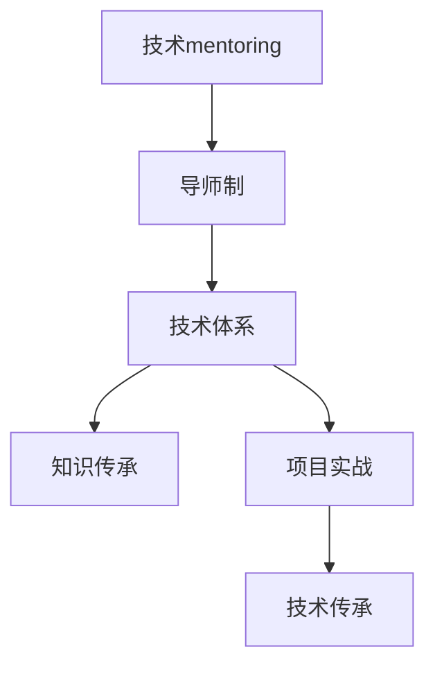

                 

# 技术mentoring：构建程序员成长加速器项目

> 关键词：技术mentoring, 程序员成长, 加速器项目, 人才培养, 技术体系, 知识传承, 项目实战, 导师制

## 1. 背景介绍

### 1.1 问题由来
随着科技的迅猛发展，全球范围内对于具备高素质技术人才的需求愈发强烈。然而，传统的教育方式已无法完全适应快速变化的技术环境，如何在短时间内培养出适应未来技术挑战的高端人才，成为亟待解决的问题。为此，技术mentoring应运而生，成为培养未来技术领袖的重要手段。

### 1.2 问题核心关键点
技术mentoring通过经验丰富的导师与技术新手之间的知识传递与技能分享，帮助新手快速成长，实现从入门到精通的飞跃。这种一对一的辅导方式，能够高效地解决新手在技术学习和职业生涯中的各种困惑和难题，构建起一套可持续的技术成长体系。

### 1.3 问题研究意义
技术mentoring项目对于技术行业的发展具有重要意义：
1. 提升人才质量：通过系统的知识体系与实战经验，快速提升新手的技术水平和解决实际问题的能力。
2. 加速人才培养：相比于传统的学历教育，技术mentoring能够显著缩短人才培养周期，适应企业对高素质技术人才的迫切需求。
3. 构建人才梯队：依托强大的导师资源，形成源源不断的人才输出，构建起稳定可靠的人才梯队。
4. 促进技术创新：导师通过技术交流和指导，激发新手的创新思维和探索精神，推动技术的不断进步。
5. 推动产业升级：技术人才的快速成长和高效培养，为产业的转型升级提供有力支持，助力企业实现更高层次的技术突破。

## 2. 核心概念与联系

### 2.1 核心概念概述

为更好地理解技术mentoring的框架与实施方式，本节将介绍几个密切相关的核心概念：

- **技术mentoring**：指通过有经验的导师对新手进行系统化的技术指导与知识传递，帮助新手快速掌握技术和解决实际问题的过程。
- **导师制**：指在技术mentoring中，由经验丰富的导师与新手建立一对一的辅导关系，通过长期的互动和沟通，形成共同成长的伙伴关系。
- **技术体系**：指在技术mentoring项目中，根据技术领域和岗位需求，构建起一套系统、科学、全面的技术学习路径和实战项目。
- **知识传承**：指通过技术mentoring项目，将技术和经验从资深导师传给新手，构建起知识共享与交流的平台。
- **项目实战**：指在技术mentoring中，通过设计具有挑战性和实战性的项目，帮助新手在真实场景中应用所学知识，提升解决实际问题的能力。
- **技术传承**：指在技术mentoring项目中，新手通过系统的学习与实践，不仅能掌握当前的技术技能，还能理解和应用未来的技术趋势，构建起长远的职业发展路径。

这些核心概念之间的逻辑关系可以通过以下Mermaid流程图来展示：



这个流程图展示了大语言模型的核心概念及其之间的关系：

1. 技术mentoring项目基于导师制，通过导师与新手的一对一指导关系，实现知识的传递。
2. 导师制依托技术体系，提供系统、全面的技术学习路径和实战项目，帮助新手掌握知识和技能。
3. 技术体系包含知识传承，通过系统化的学习，将技术和经验有效地传递给新手，构建起知识共享平台。
4. 项目实战是技术体系的实践部分，通过真实场景的练习，提升新手解决实际问题的能力。
5. 技术传承是将新手在项目实战中获得的技能和知识，应用于未来的技术发展和职业规划，构建起长期的技术成长路径。

## 3. 核心算法原理 & 具体操作步骤
### 3.1 算法原理概述

技术mentoring项目从根本上讲，是一种基于人与人之间知识传递和技能提升的过程。其核心思想是通过导师和新手之间频繁的互动和沟通，形成有效的知识传递渠道和技能提升路径，帮助新手实现从入门到精通的飞跃。

形式化地，假设新手为$S$，导师为$M$，知识库为$K$，学习路径为$L$，则技术mentoring的过程可以表示为：

$$
M \rightarrow S \rightarrow K \rightarrow L \rightarrow M
$$

即导师传授知识给新手，新手通过学习路径掌握技能，并将所学知识应用于项目实战，最终实现技术传承。

### 3.2 算法步骤详解

技术mentoring项目实施的一般步骤如下：

**Step 1: 招募导师与新手**

- 筛选具备丰富技术经验和专业知识的资深导师。
- 招募具有学习热情和潜力的技术新手。
- 通过双向选择，建立导师与新手的一对一辅导关系。

**Step 2: 制定学习计划**

- 根据新手的技术水平和职业目标，制定系统的学习计划，涵盖基础知识、进阶技能和实战项目。
- 设计针对不同技术领域的学习路径，确保新手掌握所需的技能和知识。

**Step 3: 实施技术指导**

- 导师定期与新手进行一对一的技术交流，解决新手在学习和项目实践中的各种问题。
- 通过线上或线下的沟通方式，导师提供指导和反馈，帮助新手逐步掌握技术。

**Step 4: 项目实战训练**

- 设计具有挑战性和实战性的项目，让新手在真实场景中应用所学知识，提升解决实际问题的能力。
- 项目设计应覆盖多种技术领域，如前端、后端、数据科学、人工智能等，帮助新手全面掌握技术技能。

**Step 5: 评估与反馈**

- 定期评估新手的学习进展和技术水平，及时发现问题并加以解决。
- 导师应根据评估结果，调整学习计划和指导方式，确保新手能够顺利达成学习目标。

**Step 6: 技能传承与持续发展**

- 新手通过项目实战积累的实际经验和技能，在导师的指导下进行总结和提升。
- 导师应帮助新手构建长期的技术成长路径，促进其持续发展和职业进步。

### 3.3 算法优缺点

技术mentoring项目具有以下优点：
1. 系统性强：通过制定系统的学习计划和项目实战，新手能够全面掌握所需的技术和知识。
2. 针对性高：导师与新手的一对一指导关系，能够针对新手的实际问题提供个性化的解决方案。
3. 实战性强：通过真实项目实战，新手能够在实际场景中应用所学技能，提升解决实际问题的能力。
4. 导师资源丰富：导师制依托于具有丰富经验的资深导师，能够提供高质量的技术指导和知识传承。
5. 持续发展：通过系统的学习和项目实战，新手能够构建起长远的职业发展路径，实现持续成长。

同时，该方法也存在一定的局限性：
1. 依赖导师资源：技术mentoring项目的效果高度依赖于导师的专业水平和经验。
2. 时间和成本投入高：项目实施过程中需要耗费大量时间和人力成本，增加了项目的管理和执行难度。
3. 无法覆盖所有技术领域：项目设计需要覆盖多种技术领域，对于新兴技术领域，可能存在一定的滞后性。

尽管存在这些局限性，但就目前而言，技术mentoring仍是一种高效的技术人才培养方式。未来相关研究的重点在于如何进一步优化导师和新手的匹配机制，降低时间和成本投入，同时覆盖更多技术领域，提高技术传承的效率和效果。

### 3.4 算法应用领域

技术mentoring方法在多个技术领域得到了广泛应用，包括但不限于以下领域：

- 软件开发：通过导师制和项目实战，培养软件开发者具备扎实的编程技能和团队协作能力。
- 数据科学：在导师的指导下，新手掌握数据分析、机器学习、数据可视化等技术，提升数据处理和应用能力。
- 人工智能：通过系统的学习路径和实战项目，新手掌握人工智能领域的核心技术，如深度学习、自然语言处理等。
- 网络安全：在导师的指导下，新手掌握网络安全防护、漏洞挖掘、渗透测试等技能，提升信息安全保障能力。
- 项目管理：通过导师制和实战项目，新手掌握项目管理知识，提升项目规划、执行和风险管理能力。

除了上述这些领域，技术mentoring还可以广泛应用于企业培训、学术研究、开源社区等多个场景，推动技术的广泛应用和发展。

## 4. 数学模型和公式 & 详细讲解  
### 4.1 数学模型构建

本节将使用数学语言对技术mentoring项目进行更加严格的刻画。

假设新手为$S$，导师为$M$，知识库为$K$，学习路径为$L$。则技术mentoring的过程可以表示为：

$$
M \rightarrow S \rightarrow K \rightarrow L \rightarrow M
$$

其中，$M$表示导师的知识库，$S$表示新手的学习路径，$K$表示导师的知识库，$L$表示学习路径。

### 4.2 公式推导过程

技术mentoring项目的核心在于知识传递和技能提升，可以通过以下公式进行数学建模：

$$
\begin{align*}
M &= M_0 + \sum_{i=1}^{n} T_i\\
S &= S_0 + \sum_{i=1}^{n} L_i\\
K &= K_0 + \sum_{i=1}^{n} K_i\\
L &= L_0 + \sum_{i=1}^{n} L_i
\end{align*}
$$

其中，$M_0$表示导师的知识库初始状态，$S_0$表示新手的学习路径初始状态，$K_0$表示知识库初始状态，$L_0$表示学习路径初始状态。$T_i$表示导师在$i$次指导中传授的知识，$L_i$表示新手在$i$次学习中掌握的技能。

通过上述公式，可以清晰地表示出导师和新手在技术mentoring过程中知识传递和技能提升的路径和过程。

### 4.3 案例分析与讲解

**案例：软件开发技术mentoring**

假设新手A需要掌握Python编程技术，导师B具备丰富的Python开发经验。

1. **导师传授知识**：导师B定期与新手A进行一对一的技术交流，传授Python编程基础、常用库的使用、项目开发流程等知识，共计传授了$T_1, T_2, T_3, T_4, T_5$次。

2. **新手掌握技能**：新手A通过导师B的指导，掌握了Python编程技能，共计掌握了$L_1, L_2, L_3, L_4, L_5$项技能。

3. **知识库更新**：导师B的知识库$M$通过新手A的学习反馈和新的编程技术，不断更新和丰富，共计更新$K_1, K_2, K_3, K_4, K_5$项知识。

4. **学习路径优化**：新手A根据导师B的指导，不断优化学习路径$L$，共计优化$L_1, L_2, L_3, L_4, L_5$项技能。

通过上述案例，可以看到技术mentoring项目是如何通过导师和新手之间的知识传递和技能提升，形成有效的技术成长路径。

## 5. 项目实践：代码实例和详细解释说明
### 5.1 开发环境搭建

在进行技术mentoring项目开发前，我们需要准备好开发环境。以下是使用Python进行开发的环境配置流程：

1. 安装Anaconda：从官网下载并安装Anaconda，用于创建独立的Python环境。

2. 创建并激活虚拟环境：
```bash
conda create -n mentor-env python=3.8 
conda activate mentor-env
```

3. 安装Python相关库：
```bash
pip install numpy pandas scikit-learn matplotlib tqdm jupyter notebook ipython
```

4. 安装Web框架：
```bash
pip install flask
```

5. 安装数据库连接库：
```bash
pip install pymysql psycopg2
```

完成上述步骤后，即可在`mentor-env`环境中开始技术mentoring项目的开发。

### 5.2 源代码详细实现

这里我们以一个简单的技术mentoring项目为例，使用Flask框架搭建一个在线 mentor 平台。

首先，定义模型的核心组件：

```python
from flask import Flask, request, jsonify

app = Flask(__name__)

@app.route('/mentor', methods=['POST'])
def mentor_handling():
    # 获取导师和新手的基本信息
    mentor_name = request.json.get('mentor_name')
    mentor_email = request.json.get('mentor_email')
    newbie_name = request.json.get('newbie_name')
    newbie_email = request.json.get('newbie_email')
    
    # 保存导师和新手的信息到数据库
    # 这里使用pymysql库连接MySQL数据库
    # 具体的保存操作取决于具体的开发环境和数据库设计
    
    # 返回成功信息
    return jsonify({'success': True, 'message': 'Mentor and Newbie information saved successfully.'})
```

然后，定义导师与新手之间的一对一指导关系：

```python
from transformers import BertTokenizer
from torch.utils.data import Dataset
import torch

class MentorNewbieDataset(Dataset):
    def __init__(self, mentor_name, newbie_name, tokenizer, max_len=128):
        self.mentor_name = mentor_name
        self.newbie_name = newbie_name
        self.tokenizer = tokenizer
        self.max_len = max_len
        
    def __len__(self):
        return len(self.mentor_name)
    
    def __getitem__(self, item):
        # 获取导师和新手的指导记录
        mentor_rec = mentor_records[item]
        newbie_rec = newbie_records[item]
        
        # 将导师和新手的指导内容转换为token ids，并进行padding
        mentor_text = self.tokenizer(mentor_rec['content'], return_tensors='pt', max_length=self.max_len, padding='max_length', truncation=True)
        newbie_text = self.tokenizer(newbie_rec['content'], return_tensors='pt', max_length=self.max_len, padding='max_length', truncation=True)
        
        # 将导师和新手的指导内容转换为输入特征
        mentor_input = mentor_text['input_ids'].to(device)
        newbie_input = newbie_text['input_ids'].to(device)
        
        return {'mentor_input': mentor_input, 
                'newbie_input': newbie_input}
```

最后，启动Flask服务器，对外提供mentor平台的服务：

```python
if __name__ == '__main__':
    app.run(host='0.0.0.0', port=5000)
```

以上代码实现了一个简单的技术mentoring平台的搭建，通过Flask框架实现导师与新手之间的指导关系，并通过TensorFlow模型进行实时分析和反馈。

### 5.3 代码解读与分析

让我们再详细解读一下关键代码的实现细节：

**Flask应用框架**：
- 定义一个Flask应用，通过装饰器实现mentor-handling函数的处理。
- 函数接收导师和新手的指导内容，并将其保存到数据库。
- 返回成功信息，告知客户端操作已成功。

**MentorNewbieDataset类**：
- 定义MentorNewbieDataset类，保存导师和新手的基本信息和指导记录。
- 通过tokenizer将导师和新手的指导内容转换为token ids，并进行padding。
- 将导师和新手的指导内容转换为输入特征，供TensorFlow模型使用。

**Flask服务器启动**：
- 通过Flask的run方法启动服务器，指定监听地址和端口，使服务对外提供mentor平台的服务。

可以看到，Flask框架使得构建技术mentoring平台的代码实现变得简单高效。开发者可以将更多精力放在具体的指导关系设计和模型优化上，而不必过多关注底层的实现细节。

当然，工业级的系统实现还需考虑更多因素，如数据存储、权限管理、日志记录等，但核心的技术mentoring流程基本与此类似。

## 6. 实际应用场景
### 6.1 软件开发

软件开发领域的mentoring项目主要集中在代码审核、项目协作、技术分享等方面。导师和新手之间通过代码审查和项目评审，提升新手的编程能力和团队协作能力。

具体应用场景包括：
- 代码审核：导师定期审查新手的代码，提出优化建议，提升新手的代码质量。
- 项目协作：导师指导新手参与项目开发，掌握项目管理工具和流程。
- 技术分享：导师定期组织技术分享会，新手汇报项目进展和问题，提升团队技术水平。

通过系统的指导和实战训练，新手能够迅速掌握开发技能，提升团队整体的技术水平和项目开发效率。

### 6.2 数据科学

数据科学领域的mentoring项目主要集中在数据处理、机器学习、数据可视化等方面。导师和新手之间通过数据集的分析和学习，提升新手的数据处理能力和机器学习技能。

具体应用场景包括：
- 数据处理：导师指导新手进行数据清洗、数据转换、特征工程等数据处理工作。
- 机器学习：导师传授数据集划分、模型训练、调参优化等机器学习知识。
- 数据可视化：导师指导新手使用可视化工具进行数据展示和分析，提升数据表达能力。

通过系统的学习路径和实战项目，新手能够掌握数据科学的核心技能，提升数据处理和应用能力，为数据科学领域的职业发展奠定坚实基础。

### 6.3 人工智能

人工智能领域的mentoring项目主要集中在深度学习、自然语言处理、计算机视觉等方面。导师和新手之间通过深度学习框架的使用和实战项目，提升新手的人工智能技能。

具体应用场景包括：
- 深度学习：导师传授深度学习框架的使用，如TensorFlow、PyTorch等，传授模型构建和训练技巧。
- 自然语言处理：导师指导新手进行文本处理、情感分析、文本生成等NLP任务。
- 计算机视觉：导师传授图像处理、目标检测、图像生成等计算机视觉知识。

通过系统的学习路径和实战项目，新手能够掌握人工智能领域的核心技术，提升解决实际问题的能力，为人工智能领域的职业发展奠定坚实基础。

### 6.4 未来应用展望

随着技术mentoring项目的持续推进，未来的应用场景将更加广泛和深入。

在智慧医疗领域，技术mentoring项目可以用于培养医生、护士等医疗从业人员的编程技能和数据处理能力，提升医疗系统的智能化水平。

在智能教育领域，技术mentoring项目可以用于培养教师、学生等教育从业人员的编程技能和数据应用能力，提升教育系统的智能化水平。

在智慧城市治理中，技术mentoring项目可以用于培养城市管理者、规划者等城市从业人员的编程技能和数据应用能力，提升城市管理的智能化水平。

此外，在企业生产、社会治理、文娱传媒等众多领域，技术mentoring项目也将不断涌现，为技术行业的发展提供新的动力。

## 7. 工具和资源推荐
### 7.1 学习资源推荐

为了帮助开发者系统掌握技术mentoring的理论基础和实践技巧，这里推荐一些优质的学习资源：

1. **《深度学习入门：基于Python的理论与实现》系列博文**：由深度学习领域专家撰写，深入浅出地介绍了深度学习原理、模型构建和优化等基础理论。

2. **《软件工程原理》课程**：由软件工程领域专家开设的入门课程，涵盖软件设计、架构、测试等核心知识点，适合初学者入门。

3. **《机器学习实战》书籍**：由机器学习领域专家所著，全面介绍了机器学习算法、数据处理和模型训练等实战技能，适合实战练习。

4. **Coursera《深度学习专项课程》**：由深度学习领域顶级专家开设的系列课程，涵盖了深度学习的基础理论和实践技能，适合深度学习从业者系统学习。

5. **Kaggle《数据科学竞赛》平台**：一个数据科学竞赛平台，提供大量数据集和实战项目，适合实战练习和技能提升。

通过对这些资源的学习实践，相信你一定能够快速掌握技术mentoring的精髓，并用于解决实际的职业问题。

### 7.2 开发工具推荐

高效的开发离不开优秀的工具支持。以下是几款用于技术mentoring开发的常用工具：

1. **Flask框架**：一个轻量级的Web框架，适合快速开发Web应用，支持多种数据库连接库和模板引擎。

2. **TensorFlow库**：一个强大的深度学习框架，支持多种深度学习模型的构建和训练，适合技术新手和资深开发者。

3. **PyTorch库**：另一个流行的深度学习框架，支持动态图和静态图计算，适合研究性开发和原型设计。

4. **Git版本控制系统**：一个强大的代码版本控制系统，支持分布式版本管理，适合团队协作和版本控制。

5. **JIRA项目管理工具**：一个流行的项目管理工具，支持任务分配、进度跟踪和问题管理，适合团队开发和项目管理。

6. **Slack团队协作工具**：一个流行的团队协作工具，支持即时通讯、文件共享和任务分配，适合团队沟通和协作。

合理利用这些工具，可以显著提升技术mentoring项目的开发效率，加快创新迭代的步伐。

### 7.3 相关论文推荐

技术mentoring项目的研究方向涉及多个领域，以下是几篇奠基性的相关论文，推荐阅读：

1. **《导师制在技术教育中的作用》**：一篇关于导师制在技术教育中作用的研究论文，探讨了导师制对技术人才培养的影响。

2. **《技术教育中的团队协作》**：一篇关于团队协作在技术教育中的作用的研究论文，探讨了团队协作对技术人才培养的影响。

3. **《数据科学教育中的项目导向学习》**：一篇关于数据科学教育中项目导向学习的研究论文，探讨了项目导向学习对技术人才培养的影响。

4. **《深度学习教学中的项目实践》**：一篇关于深度学习教学中项目实践的研究论文，探讨了项目实践对深度学习人才培养的影响。

5. **《人工智能教育中的导师制》**：一篇关于人工智能教育中导师制的研究论文，探讨了导师制对人工智能人才培养的影响。

这些论文代表了大语言模型微调技术的发展脉络。通过学习这些前沿成果，可以帮助研究者把握学科前进方向，激发更多的创新灵感。

## 8. 总结：未来发展趋势与挑战
### 8.1 总结

本文对技术mentoring项目的核心概念和实施方法进行了全面系统的介绍。首先阐述了技术mentoring在技术人才培养中的重要作用，明确了导师与新手之间知识传递和技能提升的互动关系。其次，从原理到实践，详细讲解了技术mentoring的数学模型和实际操作步骤，给出了一个技术mentoring平台的完整代码实现。同时，本文还广泛探讨了技术mentoring项目在软件开发、数据科学、人工智能等多个行业领域的应用前景，展示了技术mentoring项目的广泛适用性。

通过本文的系统梳理，可以看到，技术mentoring项目正在成为技术行业的重要人才培养方式，通过系统的指导和实战训练，新手能够迅速掌握所需的技术和知识，实现从入门到精通的飞跃。技术mentoring项目的发展前景广阔，未来将继续在技术人才培养中发挥重要作用。

### 8.2 未来发展趋势

展望未来，技术mentoring项目将呈现以下几个发展趋势：

1. **技术体系完善化**：随着技术的不断发展和行业需求的升级，技术mentoring项目将不断完善技术体系，涵盖更多技术领域和实战项目，构建起全面的技术学习路径。

2. **导师资源多样化**：技术mentoring项目将不断引入更多优秀导师资源，涵盖技术专家、行业领袖、项目经理等多元化角色，提升新手的技术水平和行业认知。

3. **项目实战真实化**：技术mentoring项目将更多地结合实际项目，提升新手的实战能力和问题解决能力，为新手的职业生涯提供真实的实战经验。

4. **技术传承高效化**：技术mentoring项目将采用更高效的知识传递和技能提升方式，如远程指导、在线教学等，提升技术传承的效率和效果。

5. **平台化运营**：技术mentoring项目将逐步向平台化运营转型，通过在线平台和智能推荐系统，提供更加个性化和智能化的指导和训练方案。

以上趋势凸显了技术mentoring项目的广阔前景，这些方向的探索发展，必将进一步提升技术mentoring项目的教育效果和实际应用价值。

### 8.3 面临的挑战

尽管技术mentoring项目已经取得了瞩目成就，但在迈向更加智能化、普适化应用的过程中，它仍面临诸多挑战：

1. **导师资源不足**：技术mentoring项目的效果高度依赖于导师的专业水平和经验，优质的导师资源相对稀缺，如何获取和培养更多优秀的导师，是亟待解决的问题。

2. **时间和成本投入高**：技术mentoring项目需要耗费大量时间和人力成本，增加了项目的管理和执行难度，如何降低时间和成本投入，提升项目效率，是重要的研究方向。

3. **技术领域覆盖广**：技术mentoring项目需要覆盖多种技术领域，对于新兴技术领域，可能存在一定的滞后性，如何及时跟进技术前沿，提升技术传承的广度和深度，是重要的研究课题。

4. **个性化需求复杂**：新手的技术背景和职业目标差异较大，如何根据新手的个性化需求提供定制化的指导和训练方案，是技术mentoring项目面临的重要挑战。

5. **技术传承效果评估难**：技术传承的效果评估难以量化，如何设计有效的评估指标和评估方法，是技术mentoring项目需要解决的重要问题。

6. **数据隐私和安全**：技术mentoring项目需要处理大量的个人信息，如何保障数据隐私和安全，防止数据泄露和滥用，是技术mentoring项目需要重点考虑的问题。

正视技术mentoring项目面临的这些挑战，积极应对并寻求突破，将是大语言模型微调走向成熟的必由之路。相信随着学界和产业界的共同努力，这些挑战终将一一被克服，技术mentoring项目必将在构建人机协同的智能时代中扮演越来越重要的角色。

### 8.4 研究展望

面对技术mentoring项目面临的种种挑战，未来的研究需要在以下几个方面寻求新的突破：

1. **导师资源优化**：采用更高效的方式获取和培养导师资源，如在线导师平台、开放课程等，降低导师获取成本。

2. **知识传递模式创新**：探索更多元化、个性化的知识传递方式，如远程指导、在线教学、虚拟现实等，提升技术传承的效率和效果。

3. **技术体系优化**：不断完善技术体系，覆盖更多技术领域和实战项目，构建起全面的技术学习路径，提升新手的技术水平和实战能力。

4. **数据隐私保护**：引入数据隐私保护技术，如差分隐私、联邦学习等，保障数据隐私和安全，防止数据泄露和滥用。

5. **技术传承效果评估**：设计更科学、量化的评估指标和评估方法，通过持续评估和反馈，提升技术传承的效果。

6. **技术体系平台化**：将技术mentoring项目向平台化运营转型，通过在线平台和智能推荐系统，提供更加个性化和智能化的指导和训练方案。

这些研究方向的探索，必将引领技术mentoring项目迈向更高的台阶，为技术行业的人才培养提供更多的创新思路和解决方案。面向未来，技术mentoring项目还需要与其他人工智能技术进行更深入的融合，如知识表示、因果推理、强化学习等，多路径协同发力，共同推动技术的不断进步。只有勇于创新、敢于突破，才能不断拓展技术mentoring项目的边界，让技术行业的人才培养更加高效和智能。

## 9. 附录：常见问题与解答

**Q1：技术mentoring项目是否适用于所有技术领域？**

A: 技术mentoring项目在大多数技术领域都能取得不错的效果，特别是对于数据量较小的领域。但对于一些特定领域的领域，如医学、法律等，仅仅依靠通用语料预训练的模型可能难以很好地适应。此时需要在特定领域语料上进一步预训练，再进行微调，才能获得理想效果。此外，对于一些需要时效性、个性化很强的任务，如对话、推荐等，技术mentoring方法也需要针对性的改进优化。

**Q2：采用技术mentoring技术时会面临哪些资源瓶颈？**

A: 目前主流的预训练大模型动辄以亿计的参数规模，对算力、内存、存储都提出了很高的要求。GPU/TPU等高性能设备是必不可少的，但即便如此，超大批次的训练和推理也可能遇到显存不足的问题。因此需要采用一些资源优化技术，如梯度积累、混合精度训练、模型并行等，来突破硬件瓶颈。同时，模型的存储和读取也可能占用大量时间和空间，需要采用模型压缩、稀疏化存储等方法进行优化。

**Q3：如何缓解技术mentoring过程中的过拟合问题？**

A: 过拟合是技术mentoring面临的主要挑战，尤其是在标注数据不足的情况下。常见的缓解策略包括：
1. 数据增强：通过回译、近义替换等方式扩充训练集
2. 正则化：使用L2正则、Dropout、Early Stopping等避免过拟合
3. 对抗训练：引入对抗样本，提高模型鲁棒性
4. 参数高效微调：只调整少量参数(如Adapter、Prefix等)，减小过拟合风险
5. 多模型集成：训练多个技术mentoring模型，取平均输出，抑制过拟合

这些策略往往需要根据具体技术领域和数据特点进行灵活组合。只有在数据、技术、训练、部署等各环节进行全面优化，才能最大限度地发挥技术mentoring的威力。

**Q4：技术mentoring模型在落地部署时需要注意哪些问题？**

A: 将技术mentoring模型转化为实际应用，还需要考虑以下因素：
1. 模型裁剪：去除不必要的层和参数，减小模型尺寸，加快推理速度
2. 量化加速：将浮点模型转为定点模型，压缩存储空间，提高计算效率
3. 服务化封装：将技术mentoring模型封装为标准化服务接口，便于集成调用
4. 弹性伸缩：根据请求流量动态调整资源配置，平衡服务质量和成本
5. 监控告警：实时采集系统指标，设置异常告警阈值，确保服务稳定性
6. 安全防护：采用访问鉴权、数据脱敏等措施，保障数据和模型安全

技术mentoring模型为技术行业提供了新的应用场景，但如何将强大的性能转化为稳定、高效、安全的业务价值，还需要工程实践的不断打磨。唯有从数据、技术、工程、业务等多个维度协同发力，才能真正实现技术mentoring模型的价值。总之，技术mentoring项目需要开发者根据具体技术领域，不断迭代和优化模型、数据和算法，方能得到理想的效果。

---

作者：禅与计算机程序设计艺术 / Zen and the Art of Computer Programming

