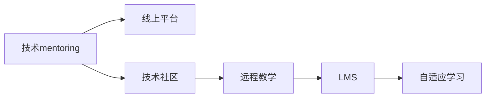

                 

# 技术mentoring：线上 的平台搭建与运营

> 关键词：技术mentoring, 平台搭建, 在线运营, 程序员培训, 远程教学

## 1. 背景介绍

### 1.1 问题由来

随着互联网技术的快速发展和人工智能(AI)的兴起，许多企业和组织开始重视技术人才的培养和开发，而技术mentoring（技术导师指导）成为其中一种重要方式。在人工智能领域，特别是在数据科学、机器学习和深度学习等技术密集型职业中，高质量的技术指导对于培养新手和提升专家技能至关重要。然而，传统的面对面mentoring方式因时空限制而难以大规模推广。

### 1.2 问题核心关键点

技术mentoring的核心在于建立有效的知识传递和技能提升机制，其关键点包括：

1. **知识传承**：将先进的知识、最佳实践和成功经验传授给技术新手，使其快速成长。
2. **技能提升**：通过持续的指导和实践，使技术专家不断深化专业知识，保持技术领先性。
3. **社区建设**：建立开放、共享和互动的技术社区，促进知识和经验的交流与创新。
4. **技术支持**：提供全方位的技术支持和资源，包括在线文档、代码库、工具和框架等。

为了解决传统mentoring方式的不足，线上技术mentoring平台应运而生。这些平台通过互联网技术，打破了时间和空间的限制，为全球的技术人员提供了便捷、高效的学习和交流途径。

### 1.3 问题研究意义

开发一个成功的线上技术mentoring平台，不仅能显著提升技术人才的培养效率，还能促进技术知识和经验的广泛传播。其研究意义在于：

1. **提升技术能力**：帮助技术新手快速掌握复杂技术，提升其解决实际问题的能力。
2. **加速知识共享**：促进全球技术社区的交流与合作，加速知识的传播和创新。
3. **支持远程工作**：适应远程工作模式的兴起，为企业和组织提供灵活、高效的人才培养方案。
4. **优化资源配置**：合理分配技术资源，降低培训成本，提高企业投资回报率。
5. **推动技术进步**：通过持续的技术交流和创新，推动整个行业的发展和技术突破。

## 2. 核心概念与联系

### 2.1 核心概念概述

为更好地理解线上技术mentoring平台的搭建与运营，本节将介绍几个核心概念：

- **技术mentoring**：一种通过导师指导和技能传递的方式，提升技术新手能力的方法。
- **线上平台**：基于互联网技术，实现远程知识传递和互动的在线系统。
- **技术社区**：以技术分享和交流为目标的在线社群，通常包含论坛、博客、代码库等功能。
- **远程教学**：通过网络技术实现的教学形式，支持视频、文本、代码等多种交互方式。
- **学习管理系统(LMS)**：一种帮助教育者和学习者组织、实施和管理学习过程的在线工具。
- **自适应学习**：根据学习者的个性化需求，动态调整学习内容和学习路径的技术。

这些核心概念之间通过互联网技术相连接，构成了线上技术mentoring平台的基础架构。

### 2.2 核心概念原理和架构的 Mermaid 流程图



这个流程图展示了技术mentoring、线上平台、技术社区、远程教学、学习管理系统和自适应学习之间的联系。线上平台作为技术知识传递的媒介，技术社区提供了交流互动的场所，远程教学支持多种交互形式，学习管理系统帮助组织学习过程，自适应学习根据学习者需求动态调整内容。

## 3. 核心算法原理 & 具体操作步骤

### 3.1 算法原理概述

线上技术mentoring平台的搭建与运营，涉及到多个核心技术的集成和应用。其核心算法原理包括但不限于以下几个方面：

1. **视频会议系统**：利用WebRTC、RTMP等技术，实现导师和学员之间的实时视频通信。
2. **代码协作平台**：使用Git、GitHub等版本控制工具，支持代码的共享、修改和版本管理。
3. **在线讨论和协作工具**：如Slack、Discord等，支持文字、语音、图片等多种形式的交流。
4. **学习管理系统(LMS)**：如Moodle、Canvas等，管理学习资源、作业、考试等。
5. **自适应学习算法**：如KNN（近邻算法）、协同过滤、推荐系统等，根据学习者的学习行为和反馈，动态调整学习内容和路径。

### 3.2 算法步骤详解

以下是一个线上技术mentoring平台的搭建步骤：

1. **需求分析和设计**：明确平台的目标用户、功能需求、技术架构和用户体验。
2. **技术选型**：选择合适的技术栈和工具，如前端框架React、Vue，后端语言Python、Node.js，数据库MySQL、PostgreSQL等。
3. **系统架构设计**：构建系统的技术架构图，包括前端、后端、数据库、API等组件的分布和通信方式。
4. **功能实现**：开发核心功能模块，如视频会议、代码协作、在线讨论等。
5. **性能优化**：对系统进行负载测试和性能优化，确保平台的高可用性和稳定性。
6. **安全性保障**：实施数据加密、访问控制、日志记录等安全措施，保护用户隐私和数据安全。
7. **用户体验设计**：优化界面设计和交互流程，提升用户的使用体验。

### 3.3 算法优缺点

线上技术mentoring平台有以下优点：

1. **灵活便捷**：打破了时间和空间的限制，用户可以随时随地上线学习。
2. **成本低廉**：相比于传统的线下培训，线上平台运营成本更低。
3. **知识共享**：通过开放的技术社区，促进知识共享和创新。
4. **可扩展性强**：可以迅速扩展至全球范围，满足不同地区和技术水平的用户需求。

同时，平台也存在一些缺点：

1. **缺乏即时反馈**：导师和学员之间的互动主要通过文字和视频，缺乏面对面的即时反馈。
2. **技术支持不足**：用户在使用过程中可能遇到技术问题，需要额外的技术支持。
3. **个性化不足**：标准化的学习内容可能难以满足个别用户的需求。

### 3.4 算法应用领域

线上技术mentoring平台广泛应用于以下几个领域：

1. **企业培训**：企业内部技术人员的培训和技能提升。
2. **技术社区**：如Stack Overflow、GitHub等，通过线上平台促进技术交流和知识共享。
3. **在线教育**：提供高质量的在线课程和培训，支持远程学习。
4. **开源项目**：支持开源社区的代码贡献和技术交流。
5. **技术会议和峰会**：通过线上平台，组织和参与技术会议和峰会。

## 4. 数学模型和公式 & 详细讲解 & 举例说明

### 4.1 数学模型构建

在本节中，我们将介绍一个简单的数学模型，用于说明线上技术mentoring平台的学习效果评估。

假设我们有一个学习平台，其核心功能包括视频课程、在线练习和导师答疑。平台的评估模型可以表示为：

$$ \text{评估分数} = \alpha \times \text{课程完成度} + \beta \times \text{练习成绩} + \gamma \times \text{答疑反馈} $$

其中：
- $\alpha, \beta, \gamma$ 是权重系数，根据平台的教学策略和目标，调整各部分的重要程度。
- 课程完成度表示学员完成视频课程的比例。
- 练习成绩表示学员在在线练习中的表现，通常用正确率或得分表示。
- 答疑反馈表示导师和学员的互动质量，可以通过评分系统或反馈问卷获取。

### 4.2 公式推导过程

接下来，我们将对上述模型进行推导：

1. **课程完成度**：
   - 设课程总时长为$T$，学员学习时间为$t$，则课程完成度为：
   $$
   \text{课程完成度} = \frac{t}{T}
   $$

2. **练习成绩**：
   - 设练习题总数为$N$，学员答对题目数为$n$，则练习成绩为：
   $$
   \text{练习成绩} = \frac{n}{N}
   $$

3. **答疑反馈**：
   - 设答疑反馈总分为$S$，导师和学员的评分之和为$s$，则答疑反馈为：
   $$
   \text{答疑反馈} = \frac{s}{S}
   $$

将这些公式代入评估模型，得到：

$$
\text{评估分数} = \alpha \times \frac{t}{T} + \beta \times \frac{n}{N} + \gamma \times \frac{s}{S}
$$

### 4.3 案例分析与讲解

假设我们在一个在线编程学习平台上评估一个学员的学习效果。学员完成了一个时长为4小时的Python课程，并通过了所有练习题，导师给的反馈分数为4分（满分5分）。根据上述模型，计算学员的评估分数：

- 课程完成度：$\frac{4}{4} = 1$
- 练习成绩：$\frac{N}{N} = 1$
- 答疑反馈：$\frac{4}{5} = 0.8$

代入公式，得到：

$$
\text{评估分数} = \alpha \times 1 + \beta \times 1 + \gamma \times 0.8
$$

其中 $\alpha = 0.5$，$\beta = 0.3$，$\gamma = 0.2$，则：

$$
\text{评估分数} = 0.5 + 0.3 + 0.2 \times 0.8 = 1.2
$$

学员的评估分数为1.2分（满分1.5分），说明其学习效果较好，但仍需进一步提升。

## 5. 项目实践：代码实例和详细解释说明

### 5.1 开发环境搭建

以下是使用Python和Django框架搭建线上技术mentoring平台的环境配置流程：

1. 安装Anaconda：从官网下载并安装Anaconda，用于创建独立的Python环境。
2. 创建并激活虚拟环境：
```bash
conda create -n mentoring-env python=3.8 
conda activate mentoring-env
```
3. 安装Django：
```bash
pip install django
```
4. 创建Django项目和应用：
```bash
django-admin startproject mentoring_project
cd mentoring_project
python manage.py startapp mentorship
```
5. 安装第三方库：
```bash
pip install django-cors-headers django-axes django-compressor django-nose django-simple-history django-imagefield-filestorage
```
6. 运行开发服务器：
```bash
python manage.py runserver
```

### 5.2 源代码详细实现

以下是一个简化的技术mentoring平台示例代码，实现视频课程、在线练习和导师答疑等功能。

```python
# models.py
from django.db import models

class Video(models.Model):
    name = models.CharField(max_length=200)
    duration = models.DurationField()
    description = models.TextField()

class Practice(models.Model):
    name = models.CharField(max_length=200)
    correct_count = models.IntegerField()
    total_count = models.IntegerField()

class Feedback(models.Model):
    score = models.FloatField()
    description = models.TextField()

# views.py
from django.shortcuts import render, redirect
from django.http import HttpResponse
from django.views.decorators.csrf import csrf_exempt

@csrf_exempt
def video(request):
    if request.method == 'POST':
        video_name = request.POST.get('video_name')
        duration = request.POST.get('duration')
        description = request.POST.get('description')
        Video.objects.create(name=video_name, duration=duration, description=description)
        return HttpResponse('Video created successfully')
    else:
        videos = Video.objects.all()
        return render(request, 'video.html', {'videos': videos})

@csrf_exempt
def practice(request):
    if request.method == 'POST':
        practice_name = request.POST.get('practice_name')
        correct_count = request.POST.get('correct_count')
        total_count = request.POST.get('total_count')
        Practice.objects.create(name=practice_name, correct_count=correct_count, total_count=total_count)
        return HttpResponse('Practice created successfully')
    else:
        practices = Practice.objects.all()
        return render(request, 'practice.html', {'practices': practices})

@csrf_exempt
def feedback(request):
    if request.method == 'POST':
        score = request.POST.get('score')
        description = request.POST.get('description')
        Feedback.objects.create(score=score, description=description)
        return HttpResponse('Feedback submitted successfully')
    else:
        feedbacks = Feedback.objects.all()
        return render(request, 'feedback.html', {'feedbacks': feedbacks})
```

### 5.3 代码解读与分析

让我们再详细解读一下关键代码的实现细节：

**Video模型**：
- 定义了视频的信息字段，包括视频名称、时长和描述。

**Practice模型**：
- 定义了在线练习的信息字段，包括练习名称、正确答案数和总题数。

**Feedback模型**：
- 定义了导师答疑的信息字段，包括评分和描述。

**video视图函数**：
- 处理视频课程的创建和展示逻辑。
- 使用Django的模板系统渲染视频列表页面。

**practice视图函数**：
- 处理在线练习的创建和展示逻辑。
- 使用Django的模板系统渲染练习列表页面。

**feedback视图函数**：
- 处理导师答疑的创建和展示逻辑。
- 使用Django的模板系统渲染答疑列表页面。

### 5.4 运行结果展示

运行上述代码后，访问http://localhost:8000/video/，可看到视频课程列表页面。用户可以在该页面上创建新视频课程，查看已有课程信息。类似地，用户可以在在线练习和导师答疑页面上创建新练习和提交反馈。

## 6. 实际应用场景

### 6.1 智能客服系统

线上技术mentoring平台可以应用于智能客服系统的构建。传统客服往往需要配备大量人力，高峰期响应缓慢，且一致性和专业性难以保证。而使用线上技术mentoring平台进行智能客服系统的培训，可以显著减少人力成本，提升客服系统的一致性和专业性。

在技术实现上，可以收集企业内部的历史客服对话记录，将问题和最佳答复构建成监督数据，在此基础上对智能客服系统进行微调。微调后的智能客服系统能够自动理解用户意图，匹配最合适的答复模板进行回复。对于客户提出的新问题，还可以接入检索系统实时搜索相关内容，动态组织生成回答。

### 6.2 金融舆情监测

金融机构需要实时监测市场舆论动向，以便及时应对负面信息传播，规避金融风险。传统的人工监测方式成本高、效率低，难以应对网络时代海量信息爆发的挑战。线上技术mentoring平台可以应用于金融舆情监测，通过收集和分析金融领域相关的新闻、报道、评论等文本数据，训练模型进行情感分析和主题分类，实时监测市场舆情。

### 6.3 个性化推荐系统

当前的推荐系统往往只依赖用户的历史行为数据进行物品推荐，无法深入理解用户的真实兴趣偏好。线上技术mentoring平台可以应用于个性化推荐系统的构建，通过收集用户浏览、点击、评论、分享等行为数据，提取和用户交互的物品标题、描述、标签等文本内容，训练模型进行文本分类和情感分析，从而生成个性化推荐列表。

### 6.4 未来应用展望

随着线上技术mentoring平台的不断发展，其在更多领域的应用前景将进一步拓展，为传统行业带来变革性影响。

在智慧医疗领域，基于线上技术mentoring平台的医疗问答、病历分析、药物研发等应用将提升医疗服务的智能化水平，辅助医生诊疗，加速新药开发进程。

在智能教育领域，线上技术mentoring平台可应用于作业批改、学情分析、知识推荐等方面，因材施教，促进教育公平，提高教学质量。

在智慧城市治理中，线上技术mentoring平台可应用于城市事件监测、舆情分析、应急指挥等环节，提高城市管理的自动化和智能化水平，构建更安全、高效的未来城市。

此外，在企业生产、社会治理、文娱传媒等众多领域，线上技术mentoring平台也将不断涌现，为经济社会发展注入新的动力。

## 7. 工具和资源推荐

### 7.1 学习资源推荐

为了帮助开发者系统掌握线上技术mentoring平台的技术基础和实践技巧，这里推荐一些优质的学习资源：

1. **《Python Web开发》**系列博文：由大前端技术专家撰写，深入浅出地介绍了Django、Flask等框架，适合初学者上手。
2. **《Django官方文档》**：详细的Django框架文档，包含丰富的API文档和实例代码，是学习Django的首选资料。
3. **《Web开发实战》**系列书籍：由知名Web开发专家撰写，涵盖Web开发的全栈技术，从基础到高级，适合进阶学习。
4. **《线上教育平台设计与开发》**课程：斯坦福大学开设的在线课程，涵盖线上教育平台的设计和开发技巧，适合系统学习。
5. **Coursera、Udemy等在线学习平台**：提供大量的在线课程，涵盖Web开发、前端技术、后端技术等多个方面，适合自学和提升。

通过对这些资源的学习实践，相信你一定能够快速掌握线上技术mentoring平台的技术细节，并用于解决实际的NLP问题。

### 7.2 开发工具推荐

高效的开发离不开优秀的工具支持。以下是几款用于线上技术mentoring平台开发的常用工具：

1. **Visual Studio Code**：免费的开源代码编辑器，支持多种编程语言和框架，插件丰富，非常适合Web开发。
2. **Git**：版本控制工具，支持多人协作和代码管理，适合开发团队使用。
3. **Postman**：API测试工具，支持模拟请求和测试API接口，适合调试API接口。
4. **PyCharm**：Python开发工具，功能强大，支持Django框架的开发和调试，适合Web开发。
5. **JIRA**：项目管理工具，支持任务分配、进度跟踪等功能，适合团队协作。

合理利用这些工具，可以显著提升线上技术mentoring平台的开发效率，加快创新迭代的步伐。

### 7.3 相关论文推荐

线上技术mentoring平台的发展源于学界的持续研究。以下是几篇奠基性的相关论文，推荐阅读：

1. **《A Survey of Online Learning》**：一篇综述论文，介绍了在线学习的各种方法和技术，适合全面了解在线教育的发展现状。
2. **《An Overview of Online Learning in Higher Education》**：一篇综述论文，介绍了在线学习在高等教育中的应用和效果，适合了解在线教育的实践应用。
3. **《Building a Web-Based Learning Platform for Distance Education》**：一篇技术论文，介绍了设计和实现一个在线学习平台的实践经验，适合系统学习在线教育平台的设计和开发。
4. **《Adaptive Learning Algorithms in Online Education》**：一篇技术论文，介绍了自适应学习算法在在线教育中的应用，适合了解在线教育的个性化需求。
5. **《Design and Development of an Online Learning Management System》**：一篇技术论文，介绍了设计和实现一个在线学习管理系统的实践经验，适合系统学习在线教育系统的开发。

这些论文代表了大规模在线教育平台的开发思路和技术框架，可以为在线教育平台的设计和开发提供参考。

## 8. 总结：未来发展趋势与挑战

### 8.1 总结

本文对线上技术mentoring平台进行了全面系统的介绍。首先阐述了线上技术mentoring平台的发展背景和研究意义，明确了平台在技术人才培训中的独特价值。其次，从原理到实践，详细讲解了平台的核心算法和具体操作步骤，给出了具体的代码实例。同时，本文还探讨了平台在多个行业领域的应用前景，展示了线上技术mentoring平台的广阔发展空间。

通过本文的系统梳理，可以看到，线上技术mentoring平台已经在大规模人才培养中发挥了重要作用，成为企业培训和远程学习的重要工具。未来，伴随技术的不断演进和应用的深入拓展，线上技术mentoring平台必将进一步提升培训效果，加速知识的传播和创新，推动技术教育的普及和发展。

### 8.2 未来发展趋势

展望未来，线上技术mentoring平台将呈现以下几个发展趋势：

1. **技术持续演进**：随着AI和机器学习技术的不断进步，线上平台将融合更多的智能技术，如自适应学习、推荐系统、情感分析等，提升学习效果和用户体验。
2. **个性化需求满足**：平台将更加注重个性化学习需求，根据用户的学习行为和反馈，动态调整学习内容和路径，提供更加个性化的学习方案。
3. **多模态融合**：平台将支持多种学习形式，如视频、文字、图片、音频等，实现多模态融合，增强学习体验。
4. **移动化发展**：随着移动设备的普及，线上平台将更多地向移动端延伸，支持移动学习和随时随地学习。
5. **全球化拓展**：平台将面向全球用户开放，实现跨国界、跨文化的知识共享和交流。
6. **社会化学习**：平台将引入社交网络元素，支持学习者之间的互动和协作，增强社区感。

### 8.3 面临的挑战

尽管线上技术mentoring平台已经取得了显著成果，但在其发展和应用过程中仍面临诸多挑战：

1. **技术瓶颈**：平台需要处理大规模数据和高并发请求，对技术架构和性能要求较高。如何提升平台的高可用性和扩展性，仍然是一个重要问题。
2. **内容质量**：高质量的教学内容是平台的核心竞争力，如何吸引和激励优秀的教师和内容创作者，保证内容质量，仍然是一个挑战。
3. **用户体验**：平台需要提供友好的用户界面和流畅的使用体验，如何提升用户的使用体验，提高用户粘性，仍然是一个难题。
4. **数据隐私**：平台需要处理大量用户数据，如何保护用户隐私和数据安全，仍然是一个重要问题。
5. **市场竞争**：平台面临来自其他在线教育平台和社交媒体的竞争，如何保持市场竞争力，仍然是一个挑战。

### 8.4 研究展望

面对线上技术mentoring平台面临的挑战，未来的研究需要在以下几个方面寻求新的突破：

1. **技术创新**：开发更加高效、稳定、可扩展的平台架构，提升平台的性能和用户体验。
2. **内容优化**：引入更多的优质教学资源，建立激励机制，吸引更多的教师和内容创作者。
3. **用户导向**：深入研究用户需求和行为，提供个性化的学习方案，提升用户粘性。
4. **数据保护**：加强数据隐私和安全保护，建立完善的数据治理机制。
5. **市场拓展**：开发新的市场策略，扩大用户基础，提升平台的市场竞争力。

这些研究方向的探索，必将引领线上技术mentoring平台走向更加成熟和高效，为全球技术人才的培养和知识传播提供更强大的支持。

## 9. 附录：常见问题与解答

**Q1：如何保证线上技术mentoring平台的安全性？**

A: 线上技术mentoring平台的安全性可以通过以下几个方面保障：

1. **数据加密**：使用SSL/TLS协议加密数据传输，保护用户隐私和数据安全。
2. **访问控制**：设置严格的访问权限，限制非授权用户访问敏感数据。
3. **安全审计**：定期进行安全审计，及时发现和修复安全漏洞。
4. **数据备份**：定期备份数据，防止数据丢失和损坏。
5. **合规性**：遵守相关法律法规和行业标准，如GDPR、ISO 27001等，保护用户隐私和数据安全。

通过上述措施，可以有效保障线上技术mentoring平台的安全性，增强用户信任和平台可靠性。

**Q2：如何提升线上技术mentoring平台的用户体验？**

A: 提升线上技术mentoring平台的用户体验，可以从以下几个方面入手：

1. **界面设计**：优化界面设计，提升用户的视觉体验，简化操作步骤。
2. **交互流畅**：提升系统响应速度，减少加载时间和卡顿现象，提高用户的交互流畅度。
3. **功能丰富**：增加更多的功能模块，满足用户的个性化需求。
4. **用户反馈**：建立用户反馈机制，及时收集和处理用户的反馈意见，不断优化用户体验。
5. **技术支持**：提供完善的技术支持，帮助用户解决使用过程中遇到的问题。

通过不断优化用户体验，可以有效提升用户的使用满意度，增加用户粘性和平台吸引力。

**Q3：如何吸引更多的教师和内容创作者？**

A: 吸引更多的教师和内容创作者，可以通过以下几个方面：

1. **激励机制**：建立合理的激励机制，如分成、版权、荣誉等，吸引优秀的教师和内容创作者加入平台。
2. **平台曝光**：通过各种渠道宣传平台，提高平台的知名度和影响力。
3. **社区建设**：建立开放、共享和互动的技术社区，促进教师和内容创作者之间的交流和合作。
4. **内容质量**：重视内容的创新和质量，提供优质的课程和学习资源，提升用户的学习效果。
5. **技术支持**：提供完善的技术支持，帮助教师和内容创作者解决技术问题。

通过上述措施，可以有效吸引更多的教师和内容创作者，提升平台的内容质量和多样性。

---

作者：禅与计算机程序设计艺术 / Zen and the Art of Computer Programming

