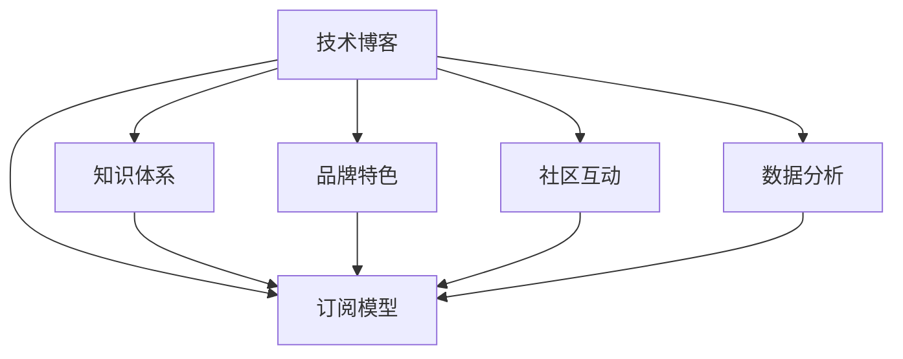

                 

# 技术写作：打造百万订阅的技术博客

## 1. 背景介绍

### 1.1 问题由来

在信息爆炸的互联网时代，技术博客和视频教程成为了获取知识、学习技能的重要渠道。然而，随着内容生产力的指数级增长，用户筛选优质内容变得愈加困难，高质量内容日益稀缺。为满足广大读者对技术知识的渴求，打造具有持续订阅能力的技术博客变得尤为重要。

### 1.2 问题核心关键点

要想打造出百万订阅的技术博客，核心在于产出高质量、高价值、高吸引力的原创内容，同时形成自己的知识体系和品牌特色。这要求作者对某一技术领域有深入的理解和实践，能够通过清晰、准确、生动的文字，将复杂的技术问题深入浅出地呈现给读者，并建立长期稳定的读者群体。

### 1.3 问题研究意义

高订阅量的技术博客不仅能为读者提供优质的学习资源，也能为作者带来广泛的知名度和商业机会。技术博客的百万订阅，代表着作者在某一技术领域的权威性和影响力，同时为技术知识的传播、创新和产业化提供了新平台。

## 2. 核心概念与联系

### 2.1 核心概念概述

为更好地理解打造百万订阅技术博客的方法，本节将介绍几个密切相关的核心概念：

- **技术博客**：通过撰写技术文章、教程、指南等形式，分享个人或团队的技术见解、经验总结和实战案例的在线平台。
- **订阅模型**：博客读者通过付费订阅，获取文章推送、优先阅读权限、独家内容等优质资源的订阅模式。
- **知识体系**：作者对某一技术领域的系统化认知和研究，包括基础知识、前沿技术、实战案例等内容的整合。
- **品牌特色**：博客作者或团队通过持续输出高质量内容，逐步树立的独特风格、观点和价值主张。
- **社区互动**：通过建立读者评论、讨论、问答等互动机制，增强读者黏性，提高社区活跃度。
- **数据分析**：利用技术博客平台提供的数据分析工具，跟踪读者行为、内容表现等，指导后续内容策略。

这些概念之间的逻辑关系可以通过以下Mermaid流程图来展示：



这个流程图展示了一些核心概念及其之间的关系：

1. 技术博客通过提供高质量的内容，吸引并维护订阅用户。
2. 订阅模型为用户提供了持续获得优质内容的服务。
3. 知识体系和品牌特色是博客内容的核心竞争力。
4. 社区互动能够增强用户黏性，提升阅读体验。
5. 数据分析为内容策略优化提供了数据支持。

## 3. 核心算法原理 & 具体操作步骤

### 3.1 算法原理概述

打造百万订阅的技术博客，本质上是一个以内容为核心的市场化运营过程。其核心思想是：通过输出高质量、高价值、高吸引力的大众化技术文章，吸引并稳定特定领域的读者群体，从而实现订阅增长。

形式化地，假设技术博客的订阅用户数量为 $U$，博客发布的文章数量为 $C$，文章的平均阅读时间为 $T$，单位时间订阅费用为 $P$，则博客的订阅收入 $R$ 可以表示为：

$$
R = U \times P \times T \times C
$$

通过优化上述四个变量，最大化订阅收入 $R$，可以实现百万订阅的目标。

### 3.2 算法步骤详解

打造百万订阅技术博客一般包括以下几个关键步骤：

**Step 1: 建立专业背景和知识体系**

- **基础学习**：全面掌握某一技术领域的知识，包括基础知识、核心概念、常用技术和实际应用等。
- **实战经验**：通过实际项目或案例，积累丰富的实践经验和问题解决能力。
- **体系化整理**：将掌握的知识系统化整理，形成结构清晰的知识体系，便于读者学习和理解。

**Step 2: 确定博客主题和风格**

- **主题选择**：基于自己的专业背景和兴趣点，确定博客的主题和方向，形成独特的价值主张。
- **风格设计**：选择符合自身特点的写作风格，如技术描述、实战案例、个人感悟等，吸引目标读者。
- **互动机制**：设计合适的读者互动机制，如评论、问答、讨论等，增强读者黏性。

**Step 3: 创建和发布内容**

- **内容创作**：依据知识体系，撰写高质量的博客文章、教程、指南等，注重实用性、可读性和创新性。
- **编辑排版**：采用专业的排版工具，如Markdown、GitHub Pages等，优化文章的视觉和易读性。
- **内容发布**：选择适合的博客平台，定期发布内容，保持持续性。

**Step 4: 运营和推广**

- **营销推广**：利用社交媒体、技术社区、邮件列表等渠道，推广博客内容，吸引新读者。
- **互动反馈**：积极回应读者评论，开展社区互动，收集反馈优化内容。
- **数据分析**：利用平台提供的数据分析工具，跟踪读者行为，优化内容策略。

**Step 5: 增长和扩展**

- **内容扩展**：根据读者反馈和数据分析，不断扩充和优化内容，保持订阅用户的兴趣和黏性。
- **品牌建设**：通过持续输出高质量内容，逐步建立个人或团队的品牌特色和声誉。
- **多样化运营**：探索多元化的盈利模式，如出版书籍、开设线下活动、合作商业广告等。

### 3.3 算法优缺点

打造百万订阅技术博客具有以下优点：
1. 高质量内容：通过系统学习、实践积累和体系化整理，确保博客内容的权威性和实用性。
2. 长期用户关系：通过优质的互动和反馈机制，建立长期稳定的读者群体。
3. 品牌影响力：持续输出的高质量内容，逐步树立品牌特色和声誉，获得广泛认可。
4. 多元化盈利：多样化的盈利模式，拓宽收入来源，增强可持续性。

同时，该方法也存在一定的局限性：
1. 内容更新难度：持续输出高质量内容需要较高的技术投入和精力。
2. 市场竞争激烈：技术博客市场竞争激烈，如何保持内容和读者的长期稳定是一个挑战。
3. 数据依赖度高：订阅收入高度依赖于读者的质量和活跃度，难以直接控制。

尽管存在这些局限性，但就目前而言，通过高质量内容驱动订阅增长，仍是大幅提升技术博客订阅量的有效方法。未来相关研究的重点在于如何进一步提高内容质量和用户黏性，降低内容创作的难度，同时兼顾内容的商业价值和社会影响。

### 3.4 算法应用领域

打造百万订阅的技术博客不仅适用于软件开发、人工智能、机器学习等领域，同样适用于各类技术应用的推广和普及，如大数据、云计算、区块链等。技术博客的影响力在于其高度的技术性和实用性，能够帮助读者快速掌握关键技术，解决实际问题。

## 4. 数学模型和公式 & 详细讲解  
### 4.1 数学模型构建

本节将使用数学语言对打造百万订阅技术博客的运营过程进行更加严格的刻画。

记技术博客的订阅用户数量为 $U$，博客发布的文章数量为 $C$，文章的平均阅读时间为 $T$，单位时间订阅费用为 $P$，则博客的订阅收入 $R$ 可以表示为：

$$
R = U \times P \times T \times C
$$

博客的订阅用户数量 $U$ 可以通过下面的公式来计算：

$$
U = \frac{R}{P \times T \times C}
$$

其中，$R$ 为订阅收入，$P$ 为单位时间订阅费用，$T$ 为平均阅读时间，$C$ 为博客发布的文章数量。

通过优化上述公式中的各个变量，最大化订阅收入 $R$，可以实现百万订阅的目标。

### 4.2 公式推导过程

在实际操作中，订阅用户数量 $U$ 的计算涉及多个变量，每个变量都会影响订阅收入 $R$ 的最终结果。下面以订阅费用 $P$ 的优化为例进行推导。

假设读者订阅后，每篇文章的平均阅读时间为 $T$，一个月内订阅用户访问了 $n$ 篇文章。则一个月内博客获得的订阅收入为：

$$
R = U \times P \times T \times n
$$

由于一个月内访问文章的数量 $n$ 与博客发布的文章数量 $C$ 和订阅用户数量 $U$ 有关，可以表示为：

$$
n = C \times U
$$

将 $n$ 的表达式代入订阅收入公式，得：

$$
R = U \times P \times T \times C \times U
$$

进一步简化得：

$$
R = U^2 \times P \times T \times C
$$

为了实现百万订阅的目标，即 $R = 10^6$，需要优化 $U$、$P$、$T$、$C$ 等变量。一般情况下，作者和平台无法直接控制 $P$ 和 $T$，但可以通过内容质量和运营策略来影响 $U$ 和 $C$。

### 4.3 案例分析与讲解

以下以一个实际案例来说明如何通过优化各个变量，实现百万订阅的目标：

**案例背景**：
某技术博客作者通过深入学习机器学习领域，积累了丰富的实践经验。为了打造百万订阅的技术博客，作者选择了机器学习主题，创建了专业化的知识体系，并确定了独特的写作风格。

**优化策略**：
1. **内容质量**：作者注重内容的实用性、创新性和可读性，确保每篇文章都有独立的研究价值和实际应用案例。
2. **发布频率**：每月定期发布高质量文章，保持读者的持续关注。
3. **互动反馈**：积极回应读者评论，开展社区互动，收集反馈优化内容。
4. **数据驱动**：利用平台提供的数据分析工具，跟踪读者行为，优化内容策略。

**结果分析**：
经过一年的运营，作者的博客订阅用户数量稳步增长，月收入达到了数万美元。通过不断优化内容质量和互动机制，作者逐步建立了品牌特色和声誉，获得了广泛认可。

## 5. 项目实践：代码实例和详细解释说明
### 5.1 开发环境搭建

在进行技术博客运营之前，我们需要准备好开发环境。以下是使用Python进行技术博客开发的常见环境配置流程：

1. 安装Anaconda：从官网下载并安装Anaconda，用于创建独立的Python环境。

2. 创建并激活虚拟环境：
```bash
conda create -n blog-env python=3.8 
conda activate blog-env
```

3. 安装相关库：
```bash
pip install jupyter notebook
pip install markdown
```

4. 创建博客页面：
```bash
jupyter new blog_page.ipynb
```

完成上述步骤后，即可在`blog_page.ipynb`中开始技术博客的编写和发布。

### 5.2 源代码详细实现

下面我们以GitHub Pages为例，展示如何搭建和发布技术博客。

**Step 1: 创建博客仓库**

1. 在GitHub上创建新的仓库。
2. 在仓库中创建一个 `CNAME` 文件，指定博客域名。
3. 在仓库中添加Markdown文件和图片，用于撰写博客内容。

**Step 2: 搭建博客**

1. 在仓库中添加 `Jupyter Notebook` 配置文件 `hubconf.yml`。
2. 配置 `nbrender` 工具，用于将Markdown文件转换为HTML页面。
3. 在 `Makefile` 文件中添加编译和部署命令。

**Step 3: 发布博客**

1. 通过 `git` 提交代码到GitHub仓库。
2. 利用 GitHub Actions 或 Travis CI 自动部署博客到服务器。
3. 测试并确保博客内容在服务器上正确展示。

### 5.3 代码解读与分析

让我们再详细解读一下关键代码的实现细节：

**CNAME文件**：
- 在仓库根目录下创建一个名为 `CNAME` 的文件，指定博客域名，例如 `blog.example.com`。

**hubconf.yml配置文件**：
- 在仓库根目录下创建一个名为 `hubconf.yml` 的文件，配置 `nbrender` 工具，指定渲染的输出路径和格式。

**Makefile编译和部署命令**：
- 在仓库根目录下创建一个名为 `Makefile` 的文件，添加编译和部署的命令，例如：
  ```makefile
  Makefile:
  render: # 将Markdown文件转换为HTML页面
    $(nbrender) --out-dir=output --default-style=github -p blog_page.ipynb
  deploy: # 部署HTML页面到服务器
    gh-pages -m "Deploy blog content" -d output
  ```

通过上述步骤，即可在GitHub Pages上搭建和发布技术博客。代码实现简单，易于上手，适用于各类技术博客的发布。

## 6. 实际应用场景
### 6.1 智能教育平台

技术博客在智能教育平台的应用中，通过知识体系的系统整理和实践经验的分享，可以极大提升教育质量和效果。技术博客不仅能够提供丰富的学习资源，还能激发学生的学习兴趣和创新能力。

在实际操作中，可以邀请各领域的专家和教师，撰写技术文章、教程和实战案例，通过博客平台传播给广大学生和家长。通过定期的社区互动，收集反馈和建议，优化课程内容，提升教育质量。

### 6.2 技术咨询公司

技术博客在技术咨询公司的应用中，可以通过提供高质量的技术文章和解决方案，提升公司的品牌影响力和市场竞争力。博客内容不仅能吸引潜在客户，还能通过知识分享，提高公司的技术水平和市场地位。

技术咨询公司可以组建专业的技术团队，撰写各类技术文章、案例分析和实战经验，定期发布在博客平台上。通过平台的数据分析工具，跟踪读者行为和反馈，优化内容策略，提升咨询服务的质量和效果。

### 6.3 开源社区

技术博客在开源社区的应用中，通过分享技术经验、发布项目进展和展示项目成果，可以促进社区内外的交流合作，推动开源项目的快速发展和成熟。博客内容不仅能提升项目的知名度，还能吸引更多开发者贡献代码和资源。

开源社区可以鼓励项目维护者和贡献者，撰写技术博客，分享项目开发经验和实践案例。通过平台的数据分析工具，跟踪社区活跃度，优化博客内容，吸引更多开发者加入，推动项目的持续发展和成熟。

### 6.4 未来应用展望

随着技术博客的广泛应用，未来将呈现以下几个发展趋势：

1. **多平台分发**：技术博客将不再局限于单一平台，通过跨平台分发，覆盖更多用户群体。
2. **社区化运营**：技术博客将逐步社区化，通过读者互动和内容反馈，形成稳定且活跃的社区生态。
3. **内容多样化**：技术博客的内容将更加多样化，不仅包括技术文章和教程，还涉及教育、娱乐、科普等多领域。
4. **视频化表达**：技术博客将引入视频表达方式，通过视频讲解和实时互动，提升用户的阅读体验。
5. **智能化推荐**：通过大数据和人工智能技术，对博客内容进行智能推荐，引导用户发现感兴趣的内容。

这些趋势展示了技术博客在未来的广阔应用前景，通过不断优化内容形式和运营策略，技术博客必将在更多领域发挥重要作用。

## 7. 工具和资源推荐
### 7.1 学习资源推荐

为了帮助开发者系统掌握打造百万订阅技术博客的理论基础和实践技巧，这里推荐一些优质的学习资源：

1. **《技术写作与SEO优化》系列博文**：深入浅出地介绍了如何通过技术写作提升博客的SEO排名，吸引更多读者。
2. **《博客优化与数据分析》书籍**：系统讲解了如何通过优化博客内容和运营策略，提升读者的订阅和留存率。
3. **《内容营销与社群运营》课程**：讲解了如何通过内容营销和社区运营，建立稳定且活跃的读者群体。
4. **GitHub Pages官方文档**：提供了详细的部署和使用指南，帮助开发者快速搭建自己的技术博客。
5. **Medium博客平台**：一个广泛的技术社区，提供丰富的技术文章和社区互动机制，适合开发者发布和分享技术博客。

通过这些资源的学习实践，相信你一定能够系统掌握打造百万订阅技术博客的技巧，提升博客的质量和影响力。

### 7.2 开发工具推荐

高效的开发离不开优秀的工具支持。以下是几款用于技术博客开发和运营的常用工具：

1. **Jupyter Notebook**：一个基于Web的交互式笔记本，支持多种编程语言和数据格式，适合撰写和发布技术文章。
2. **GitHub Pages**：一个静态网站托管服务，适合部署技术博客，提供丰富的插件和主题，支持跨平台分发。
3. **Hubconf**：一个开源博客工具，支持Markdown和GitHub Pages集成，方便博客内容的发布和管理。
4. **Markdown**：一种轻量级的文本标记语言，适合撰写格式规范的技术文章和博客内容。
5. **Hugo**：一个快速、灵活的博客框架，支持静态和动态博客，提供丰富的插件和主题。
6. **Travis CI**：一个开源的持续集成工具，支持博客内容的自动化部署和测试，提升博客的可靠性和稳定性。

合理利用这些工具，可以显著提升技术博客的开发和运营效率，提高内容的质量和可读性。

### 7.3 相关论文推荐

技术博客和内容营销的研究源于学界的持续研究。以下是几篇奠基性的相关论文，推荐阅读：

1. **《博客内容传播与读者行为研究》**：研究了博客内容传播的机制和读者行为规律，提出内容优化策略。
2. **《社交媒体对博客订阅的影响》**：分析了社交媒体对博客订阅和互动的影响，提出了社区互动机制的改进建议。
3. **《内容推荐系统的设计与实现》**：介绍了一种基于协同过滤的内容推荐系统，应用于技术博客的智能推荐。

这些论文代表了大规模技术博客运营的研究方向，通过学习这些前沿成果，可以帮助研究者把握学科前进方向，激发更多的创新灵感。

## 8. 总结：未来发展趋势与挑战
### 8.1 总结

本文对打造百万订阅技术博客的方法进行了全面系统的介绍。首先阐述了打造技术博客的背景和意义，明确了订阅增长的核心在于高质量内容的输出。其次，从原理到实践，详细讲解了运营技术的核心步骤，给出了具体的实现策略和工具推荐。同时，本文还广泛探讨了技术博客在智能教育、技术咨询、开源社区等多个领域的应用前景，展示了其巨大的潜力和价值。

通过本文的系统梳理，可以看到，打造百万订阅技术博客不仅要输出高质量的内容，还需结合平台和读者反馈，不断优化运营策略。唯有持续创新、积极应对，才能实现技术博客的持续发展和成功。

### 8.2 未来发展趋势

展望未来，打造百万订阅技术博客将呈现以下几个发展趋势：

1. **内容形式多样化**：技术博客将引入视频、直播等多种形式，提升用户的阅读体验。
2. **社区互动增强**：技术博客将更加注重社区互动和用户反馈，形成稳定且活跃的社区生态。
3. **个性化推荐普及**：通过大数据和人工智能技术，对博客内容进行个性化推荐，提升读者的订阅和留存率。
4. **跨平台分发**：技术博客将覆盖更多平台，如微信公众号、知乎等，提升内容的覆盖面和影响力。
5. **多元化盈利模式**：通过广告、付费会员、技术咨询等多种盈利方式，提升博客的经济价值。

这些趋势展示了技术博客在未来的广阔应用前景，通过不断优化内容形式和运营策略，技术博客必将在更多领域发挥重要作用。

### 8.3 面临的挑战

尽管技术博客运营取得了显著成效，但在迈向长期发展过程中，仍面临诸多挑战：

1. **内容创作难度**：持续输出高质量内容需要较高的技术投入和精力，难以保持长期的创作热情。
2. **市场竞争激烈**：技术博客市场竞争激烈，如何保持内容的持续更新和高质量是一个挑战。
3. **数据依赖度高**：订阅收入高度依赖于读者的质量和活跃度，难以直接控制。
4. **平台限制多**：不同的博客平台有不同的限制和规则，需要不断适应和优化。
5. **技术门槛高**：技术博客需要具备较高的技术水平和运营经验，对新入门的开发者是一个挑战。

尽管存在这些挑战，但通过不断优化内容策略和运营模式，技术博客的订阅量仍有很大的提升空间。未来相关研究的重点在于如何进一步提高内容质量和用户黏性，降低内容创作的难度，同时兼顾内容的商业价值和社会影响。

### 8.4 研究展望

面对技术博客运营所面临的挑战，未来的研究需要在以下几个方面寻求新的突破：

1. **内容创作的自动化**：通过AI技术自动生成和优化内容，降低创作难度和成本。
2. **社区互动的智能化**：引入智能推荐和反馈机制，提升社区互动的效率和质量。
3. **多平台运营的统一**：开发统一的博客管理系统，简化多平台运营的复杂性。
4. **内容盈利的多元化**：探索更多元化的盈利模式，提升博客的经济价值。
5. **知识体系的标准化**：建立系统化的知识体系，提高内容的权威性和可信度。

这些研究方向的探索，必将引领技术博客运营走向更高的台阶，为技术知识的传播和创新提供新平台。面向未来，技术博客需要与其他技术平台和社交媒体进行更深入的融合，多路径协同发力，共同推动技术知识的普及和应用。只有勇于创新、敢于突破，才能不断拓展技术博客的边界，让技术知识更好地造福人类社会。

## 9. 附录：常见问题与解答

**Q1：如何提高技术博客的订阅量？**

A: 提高技术博客订阅量需要多方面的努力，以下是几个关键策略：
1. **内容质量**：输出高质量、高价值、高吸引力的技术文章，满足读者的学习需求。
2. **互动机制**：通过评论、问答、讨论等机制，增强读者的参与感和黏性。
3. **数据驱动**：利用数据分析工具，跟踪读者行为，优化内容策略，提升订阅量。
4. **多平台分发**：通过跨平台分发，覆盖更多用户群体，提升博客的覆盖面和影响力。
5. **多元化盈利**：探索多种盈利模式，如广告、付费会员、技术咨询等，提升博客的经济价值。

**Q2：技术博客如何吸引更多高质量的读者？**

A: 吸引高质量的读者需要多维度的策略：
1. **知识体系**：建立系统化的知识体系，提供权威、实用的技术文章。
2. **读者互动**：通过评论、问答、讨论等机制，与读者建立良好的互动关系。
3. **社区运营**：建立稳定的社区生态，吸引更多有价值的读者参与。
4. **数据分析**：利用数据分析工具，了解读者需求，优化内容策略。
5. **平台推广**：利用博客平台和社交媒体，推广博客内容，吸引更多读者。

**Q3：如何处理技术博客的内容创作难度？**

A: 处理技术博客内容创作难度的方法包括：
1. **自动化工具**：使用自动化工具，如AI生成技术、自动排版工具等，提高创作效率。
2. **团队合作**：组建专业团队，分工合作，提升创作效率和质量。
3. **内容外包**：与内容创作者合作，获取高质量的技术文章。
4. **内容复用**：对已发布的内容进行复用，提高创作效率。
5. **内容多样化**：引入视频、直播等多种形式，提升内容的多样性和吸引力。

通过这些策略，可以有效降低技术博客内容创作的难度，确保高质量内容的持续输出。

**Q4：技术博客如何实现跨平台分发？**

A: 实现跨平台分发需要考虑以下几点：
1. **博客平台**：选择合适的博客平台，如GitHub Pages、Medium等，支持跨平台分发。
2. **社交媒体**：利用社交媒体平台，如微信公众号、知乎等，推广博客内容。
3. **搜索引擎优化**：优化博客内容，提升在搜索引擎中的排名，增加曝光率。
4. **邮件列表**：建立邮件列表，定期推送高质量内容，吸引读者订阅。
5. **多种格式**：提供多种格式的内容，如PDF、视频等，适应不同平台的阅读需求。

通过这些策略，可以有效实现技术博客的跨平台分发，覆盖更多用户群体，提升博客的影响力。

**Q5：技术博客如何实现商业化？**

A: 技术博客的商业化需要多方面的探索，以下是几个关键策略：
1. **广告合作**：与广告平台合作，获取广告收入。
2. **付费会员**：设立付费会员制度，提供专属内容和权益。
3. **技术咨询**：提供技术咨询和咨询服务，获得技术费用。
4. **产品推广**：推广技术产品或服务，获得销售收益。
5. **众筹平台**：通过众筹平台，获取用户支持和技术反馈。

通过这些策略，可以有效实现技术博客的商业化，提升博客的经济价值和社会影响力。

---

作者：禅与计算机程序设计艺术 / Zen and the Art of Computer Programming

