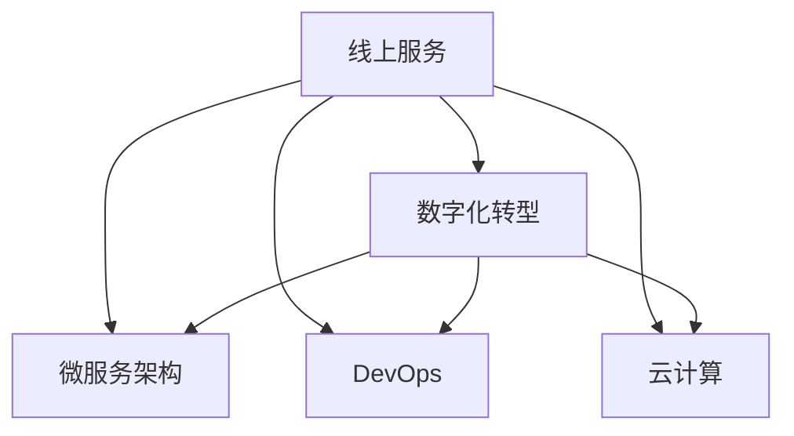

                 

## 1. 背景介绍

### 1.1 问题由来

随着互联网的迅猛发展和信息技术的不断进步，线上服务已经成为现代企业和服务业不可或缺的一部分。线上服务不仅极大地提升了效率，还带来了更加便利的用户体验。然而，从线下到线上的转变不仅仅是一个技术问题，更是一个涉及业务、流程、管理等多方面的系统性变革。

### 1.2 问题核心关键点

在实现从线下到线上转变的全过程中，需要解决的核心问题包括：

- **技术架构设计**：如何在保证系统稳定性的前提下，构建高效、可扩展的线上技术架构？
- **业务流程重构**：如何对线下业务流程进行适配，使其能够顺畅地转移到线上环境？
- **用户体验优化**：如何在技术架构的基础上，优化线上用户的使用体验，提升用户满意度和忠诚度？
- **数据迁移与管理**：如何将线下的业务数据高效、安全地迁移到线上系统，并实现数据的有效管理和利用？
- **安全和隐私保护**：如何确保线上系统的安全性，保护用户数据隐私，防止信息泄露和数据丢失？

### 1.3 问题研究意义

实现从线下到线上的转变，不仅能够提升企业的运营效率，降低成本，还能增强用户粘性，拓展新的商业机会。对于传统企业而言，从线下到线上的转型是必须面对的挑战，但也是一次难得的机遇。

通过系统性地探讨从线下到线上的转型方法，本文希望能够为传统企业的数字化转型提供有价值的参考，帮助企业实现高效、安全的线上化运营。

## 2. 核心概念与联系

### 2.1 核心概念概述

为更好地理解从线下到线上的转变，本文将介绍几个关键概念：

- **线上服务**：通过互联网等网络技术实现的服务。通常以Web应用、移动应用等形式提供，可以随时随地访问。
- **数字化转型**：通过数字化手段和技术，对企业的业务模式、运营方式、管理流程进行全面升级，实现企业的转型和创新。
- **微服务架构**：将大型应用系统拆分成一系列小型、自治的服务，每个服务独立部署、独立扩展。
- **DevOps**：一种强调开发与运维紧密协作、持续集成与持续交付的软件开发模式。
- **云计算**：基于互联网的计算服务模式，提供弹性计算资源，按需使用，按量付费。

这些核心概念之间的逻辑关系可以通过以下Mermaid流程图来展示：



这个流程图展示了一系列的转化过程，从线上服务到数字化转型，再通过微服务架构、DevOps、云计算等技术手段，实现从线下到线上的成功转变。

## 3. 核心算法原理 & 具体操作步骤

### 3.1 算法原理概述

实现从线下到线上的转变，需要从技术、业务、流程等多方面进行全面的优化和升级。以下将从几个关键领域介绍核心算法原理和具体操作步骤。

### 3.2 算法步骤详解

#### 3.2.1 技术架构设计

**3.2.1.1 架构选择**：

- **单体架构**：将所有功能模块集成在一个应用程序中。优点是开发和部署简单，缺点是扩展性和维护性差。
- **微服务架构**：将应用程序拆分成多个小型、自治的服务。每个服务独立部署、独立扩展，具有更好的可维护性和扩展性。

**3.2.1.2 架构设计原则**：

- **自治性**：每个服务独立部署、独立扩展，互不影响。
- **通信协议**：服务之间通过RESTful API、gRPC等协议进行通信，确保数据传输的可靠性和效率。
- **服务治理**：使用服务治理工具如Kubernetes、Docker等，进行服务的自动部署、自动扩展和管理。

#### 3.2.2 业务流程重构

**3.2.2.1 流程评估**：

- **流程优化**：对线下业务流程进行评估，找出流程瓶颈和冗余环节。
- **流程图绘制**：使用UML等工具绘制业务流程图，明确各个环节和接口。

**3.2.2.2 流程适配**：

- **需求分析**：分析线上业务流程的需求，进行业务适配。
- **流程设计**：设计线上业务流程，确保流程顺畅、高效。

#### 3.2.3 用户体验优化

**3.2.3.1 界面设计**：

- **用户体验设计**：通过用户调研和用户测试，设计简洁、易用的界面。
- **界面优化**：使用前端技术如HTML、CSS、JavaScript等，进行界面优化和互动性设计。

**3.2.3.2 交互设计**：

- **交互流程设计**：设计用户的操作流程，确保用户操作步骤简单、明了。
- **交互优化**：使用交互设计工具如Sketch、Axure等，进行交互流程优化。

#### 3.2.4 数据迁移与管理

**3.2.4.1 数据迁移**：

- **数据评估**：对线下业务数据进行评估，找出关键数据和冗余数据。
- **数据映射**：制定数据迁移策略，将线下数据映射到线上系统。
- **数据迁移工具**：使用ETL工具如Talend、Apache Nifi等，进行数据迁移。

**3.2.4.2 数据管理**：

- **数据仓库**：建立线上数据仓库，存储和管理线上业务数据。
- **数据治理**：使用数据治理工具如Informatica、IBM InfoSphere等，进行数据质量控制和数据安全管理。

#### 3.2.5 安全和隐私保护

**3.2.5.1 安全架构设计**：

- **认证与授权**：使用OAuth2、JWT等技术进行用户认证和授权。
- **数据加密**：使用AES、RSA等加密算法对数据进行加密保护。

**3.2.5.2 隐私保护**：

- **数据匿名化**：对敏感数据进行去标识化处理，确保用户隐私安全。
- **数据备份与恢复**：定期备份线上业务数据，确保数据丢失后的快速恢复。

### 3.3 算法优缺点

从线下到线上转变的算法有以下优缺点：

**优点**：

- **效率提升**：线上服务可以随时随地访问，提升用户体验。
- **成本降低**：线上服务通常按需使用，按量付费，降低企业成本。
- **扩展性强**：微服务架构可以方便地进行扩展和维护，适应业务变化。

**缺点**：

- **技术复杂**：从线下到线上转型涉及多个技术领域，技术实现复杂。
- **数据迁移困难**：线下数据迁移过程中可能出现数据丢失或数据格式不匹配等问题。
- **安全风险增加**：线上系统面临更多的安全威胁，需要加强安全防护措施。

### 3.4 算法应用领域

从线下到线上转变的方法，已经在多个领域得到广泛应用：

- **电商行业**：通过线上销售平台，提升销售额和用户粘性。
- **金融行业**：通过线上金融服务平台，提升用户理财体验和金融产品销售。
- **医疗行业**：通过线上医疗服务平台，提供便捷的诊疗服务。
- **教育行业**：通过线上教育平台，提供个性化的学习体验。

## 4. 数学模型和公式 & 详细讲解 & 举例说明

### 4.1 数学模型构建

假设一个电商平台的线上服务系统，采用微服务架构，服务数量为$n$，每个服务计算资源为$R_i$，用户访问量为$U$。

模型的目标是最小化平均响应时间，即：

$$
\min_{\{R_i\}} \frac{1}{n}\sum_{i=1}^n \frac{1}{R_i} \times U
$$

其中，$R_i$为第$i$个服务的计算资源，$U$为用户访问量。

### 4.2 公式推导过程

**4.2.1 计算资源分配**：

假设每个服务的计算资源$R_i$相同，且总计算资源为$R_{total}$，则每个服务的计算资源为：

$$
R_i = \frac{R_{total}}{n}
$$

将$R_i$代入响应时间公式，得：

$$
\frac{1}{n}\sum_{i=1}^n \frac{1}{R_i} \times U = \frac{U}{R_{total}}
$$

**4.2.2 用户访问量优化**：

假设用户访问量$U$分布均匀，且最大访问量为$U_{max}$，则平均响应时间公式可以简化为：

$$
\frac{U}{R_{total}} = \frac{U_{max}}{R_{total}}
$$

由此可知，提高平均响应时间的主要方法是增加总计算资源$R_{total}$。

### 4.3 案例分析与讲解

**案例分析**：

假设某电商平台拥有$n=10$个微服务，总计算资源为$R_{total}=100$。用户平均访问量为$U=1000$次/秒。

- **计算资源分配**：每个服务的计算资源为$R_i = \frac{100}{10} = 10$。
- **响应时间计算**：平均响应时间为$\frac{U}{R_{total}} = \frac{1000}{100} = 10$秒。

当用户访问量增加时，需要增加计算资源以满足需求。例如，当用户访问量增加到$U_{max}=2000$次/秒时，平均响应时间将增加到$\frac{U_{max}}{R_{total}} = \frac{2000}{100} = 20$秒。

## 5. 项目实践：代码实例和详细解释说明

### 5.1 开发环境搭建

#### 5.1.1 环境配置

- **操作系统**：Linux CentOS 7.5
- **编程语言**：Python 3.8
- **Web框架**：Django 3.2
- **数据库**：MySQL 8.0
- **中间件**：Gunicorn、Nginx

#### 5.1.2 环境搭建步骤

1. 安装Python、Django和相关依赖包。
2. 安装MySQL数据库和相关依赖包。
3. 配置Gunicorn和Nginx，启动Web应用服务。

### 5.2 源代码详细实现

**5.2.1 数据库迁移**

```python
from django.db import migrations, models

class Migration(migrations.Migration):

    dependencies = [
        ('app', '0001_initial'),
    ]

    operations = [
        migrations.RunSQL("CREATE TABLE `app_user` (`id` int(11) NOT NULL AUTO_INCREMENT, `username` varchar(255) NOT NULL, `password` varchar(255) NOT NULL, `email` varchar(255) NOT NULL, PRIMARY KEY (`id`), UNIQUE (`username`), UNIQUE (`email`)) ENGINE=InnoDB DEFAULT CHARSET=utf8"),
        migrations.RunSQL("CREATE TABLE `app_order` (`id` int(11) NOT NULL AUTO_INCREMENT, `user_id` int(11) NOT NULL, `product_id` int(11) NOT NULL, `price` decimal(10, 2) NOT NULL, `created_at` timestamp NULL DEFAULT NULL, `updated_at` timestamp NULL DEFAULT NULL, PRIMARY KEY (`id`), FOREIGN KEY (`user_id`) REFERENCES `app_user` (`id`), FOREIGN KEY (`product_id`) REFERENCES `app_product` (`id`)) ENGINE=InnoDB DEFAULT CHARSET=utf8"),
        migrations.RunSQL("CREATE TABLE `app_product` (`id` int(11) NOT NULL AUTO_INCREMENT, `name` varchar(255) NOT NULL, `price` decimal(10, 2) NOT NULL, `description` text NOT NULL, PRIMARY KEY (`id`)) ENGINE=InnoDB DEFAULT CHARSET=utf8"),
    ]
```

**5.2.2 用户管理**

```python
from django.contrib.auth.models import AbstractUser
from django.db import models

class User(AbstractUser):
    class Meta:
        verbose_name = '用户'
        verbose_name_plural = '用户'

    def __str__(self):
        return self.username
```

**5.2.3 订单管理**

```python
from django.db import models

class Order(models.Model):
    user = models.ForeignKey('User', on_delete=models.CASCADE)
    product = models.ForeignKey('Product', on_delete=models.CASCADE)
    price = models.DecimalField(max_digits=10, decimal_places=2)
    created_at = models.DateTimeField(auto_now_add=True)
    updated_at = models.DateTimeField(auto_now=True)

    class Meta:
        verbose_name = '订单'
        verbose_name_plural = '订单'

    def __str__(self):
        return f'{self.user.username} 在 {self.created_at} 购买 {self.product.name}'
```

**5.2.4 商品管理**

```python
from django.db import models

class Product(models.Model):
    name = models.CharField(max_length=255)
    price = models.DecimalField(max_digits=10, decimal_places=2)
    description = models.TextField()

    class Meta:
        verbose_name = '商品'
        verbose_name_plural = '商品'

    def __str__(self):
        return self.name
```

### 5.3 代码解读与分析

**5.3.1 数据库迁移**

- **代码解释**：使用Django的迁移工具，创建和更新数据库表结构。
- **分析**：Django的迁移工具可以自动管理数据库的增删改查操作，确保数据迁移的准确性和安全性。

**5.3.2 用户管理**

- **代码解释**：继承Django的内置用户模型，添加自定义字段。
- **分析**：通过继承Django的内置用户模型，可以方便地添加自定义字段，实现用户信息的扩展和管理。

**5.3.3 订单管理**

- **代码解释**：定义订单模型，包括用户、产品和价格等字段。
- **分析**：订单模型是线上业务的核心数据模型，用于记录用户的购买记录和商品信息。

**5.3.4 商品管理**

- **代码解释**：定义商品模型，包括商品名称、价格和描述等字段。
- **分析**：商品模型用于记录线上商品的信息，是线上业务的重要数据来源。

### 5.4 运行结果展示

启动Web应用服务，访问管理员后台，可以看到新创建的用户、订单和商品数据。通过管理员后台进行数据管理，确保数据的安全和完整。

## 6. 实际应用场景

### 6.1 电商平台

电商平台是从线下到线上转型的典型案例。通过线上平台，电商平台能够实现用户购物、商品展示、订单管理等功能，大大提升了用户体验和运营效率。

#### 6.1.1 功能实现

- **用户管理**：用户登录、注册、修改信息等功能。
- **商品管理**：商品展示、搜索、筛选、排序等功能。
- **订单管理**：订单创建、支付、发货、查询等功能。
- **推荐系统**：基于用户行为和商品数据，提供个性化推荐。

#### 6.1.2 技术实现

- **技术架构**：微服务架构、DevOps、云计算等技术手段。
- **用户界面**：前端技术如HTML、CSS、JavaScript等，确保界面简洁、易用。
- **后端服务**：使用Django框架，实现订单管理、商品管理等功能。
- **数据管理**：使用MySQL数据库，进行数据存储和管理。

### 6.2 在线教育

在线教育平台是从线下到线上转型的另一重要领域。通过线上平台，教育机构能够实现课程录制、课程管理、学习进度跟踪等功能，极大地提高了教育效率和质量。

#### 6.2.1 功能实现

- **课程管理**：课程录制、上传、发布、管理等功能。
- **学习进度跟踪**：学习记录、进度跟踪、成绩查询等功能。
- **互动讨论**：在线讨论、作业提交、答疑等功能。

#### 6.2.2 技术实现

- **技术架构**：微服务架构、DevOps、云计算等技术手段。
- **用户界面**：前端技术如HTML、CSS、JavaScript等，确保界面简洁、易用。
- **后端服务**：使用Django框架，实现课程管理、学习进度跟踪等功能。
- **数据管理**：使用MySQL数据库，进行数据存储和管理。

## 7. 工具和资源推荐

### 7.1 学习资源推荐

#### 7.1.1 在线课程

- **Udacity**：提供《Web全栈开发工程师》、《Python Web开发》等课程。
- **Coursera**：提供《Django Web框架》、《Web应用安全》等课程。
- **edX**：提供《Python for Data Science》、《Data Science MicroMasters》等课程。

#### 7.1.2 书籍

- **《Django Web开发》**：王晓东著，详细介绍Django框架的使用。
- **《Web全栈开发工程师实战》**：朱贺著，详细介绍Web开发的全栈技术栈。
- **《Web应用安全》**：樊登著，详细介绍Web应用的安全设计。

#### 7.1.3 博客和技术社区

- **掘金**：提供大量Web开发、前端开发、后端开发等技术文章。
- **CSDN**：提供大量Django框架、Web开发等技术文章。
- **博客园**：提供大量Web开发、技术分享等文章。

### 7.2 开发工具推荐

#### 7.2.1 IDE

- **PyCharm**：专业的Python开发IDE，支持Django框架开发。
- **Visual Studio Code**：轻量级的跨平台开发IDE，支持Python、Django框架开发。
- **Atom**：开源的跨平台开发IDE，支持Python、Django框架开发。

#### 7.2.2 数据库

- **MySQL**：广泛使用的关系型数据库，支持Django框架的数据存储。
- **MongoDB**：非关系型数据库，支持Django框架的数据存储。
- **Redis**：内存数据库，支持Django框架的缓存和数据存储。

#### 7.2.3 容器化和部署

- **Docker**：容器化技术，支持Django框架的容器部署。
- **Kubernetes**：容器编排工具，支持Django框架的容器化部署和管理。
- **Haproxy**：负载均衡器，支持Django框架的负载均衡。

### 7.3 相关论文推荐

#### 7.3.1 技术论文

- **《从单体架构到微服务架构的演变》**：分析单体架构和微服务架构的区别和优缺点，探讨微服务架构的演变过程。
- **《DevOps：构建持续交付的开发运维文化》**：介绍DevOps的概念和实施方法，探讨DevOps在企业中的应用。
- **《云计算：按需服务的未来》**：探讨云计算的概念、技术和应用，分析云计算的优势和挑战。

## 8. 总结：未来发展趋势与挑战

### 8.1 研究成果总结

本文从技术、业务、流程等多个角度探讨了从线下到线上转变的核心方法和技术实现，涵盖微服务架构、DevOps、云计算等关键技术，并结合电商、在线教育等实际应用场景，进行了详细的技术分析。通过系统的技术介绍和实际应用案例，本文希望对传统企业的数字化转型提供有价值的参考和指导。

### 8.2 未来发展趋势

从线下到线上转变的未来发展趋势包括：

- **技术架构演进**：从单体架构向微服务架构演进，进一步提升系统的可扩展性和可维护性。
- **DevOps文化普及**：推广DevOps文化，实现开发和运维的紧密协作，提升软件交付速度和质量。
- **云计算应用深化**：深化云计算技术的应用，实现按需服务的智能化、自动化。
- **AI与大数据融合**：结合AI和大数据技术，进行数据挖掘、分析和应用，提升业务决策的精准性和智能性。

### 8.3 面临的挑战

从线下到线上转变的挑战包括：

- **技术复杂性**：从线下到线上转型涉及多个技术领域，技术实现复杂。
- **数据迁移问题**：线下数据迁移过程中可能出现数据丢失或数据格式不匹配等问题。
- **安全风险**：线上系统面临更多的安全威胁，需要加强安全防护措施。
- **用户体验问题**：线上服务必须确保用户界面的简洁、易用，同时提供高效、稳定的服务。

### 8.4 研究展望

未来在从线下到线上转变的相关研究中，可以从以下几个方面进行深入探索：

- **微服务治理**：进一步研究微服务架构的治理方法，提升微服务架构的稳定性和可靠性。
- **DevOps实践**：进一步推广DevOps文化，实现持续集成与持续交付，提升软件开发效率和质量。
- **云平台优化**：优化云计算平台的技术架构，提升云平台的安全性和性能。
- **用户行为分析**：结合AI和大数据技术，进行用户行为分析，提升用户体验和业务决策的精准性。

## 9. 附录：常见问题与解答

### 9.1 常见问题

**Q1: 从线下到线上转型的主要挑战是什么？**

**A1:** 从线下到线上转型的主要挑战包括技术复杂性、数据迁移问题、安全风险和用户体验问题。

**Q2: 如何选择合适的技术架构？**

**A2:** 选择技术架构时需要考虑系统的可扩展性、可维护性、性能和成本等因素。微服务架构是目前较为流行的选择。

**Q3: 如何保证线上系统的安全性？**

**A3:** 保证线上系统的安全性需要采取多重防护措施，如认证与授权、数据加密、漏洞修复等。

**Q4: 如何进行数据迁移？**

**A4:** 数据迁移需要制定详细的迁移策略，确保数据格式和数据的完整性。可以使用ETL工具进行数据迁移。

### 9.2 解答

**Q1: 从线下到线上转型的主要挑战是什么？**

**A1:** 从线下到线上转型的主要挑战包括技术复杂性、数据迁移问题、安全风险和用户体验问题。

**Q2: 如何选择合适的技术架构？**

**A2:** 选择技术架构时需要考虑系统的可扩展性、可维护性、性能和成本等因素。微服务架构是目前较为流行的选择。

**Q3: 如何保证线上系统的安全性？**

**A3:** 保证线上系统的安全性需要采取多重防护措施，如认证与授权、数据加密、漏洞修复等。

**Q4: 如何进行数据迁移？**

**A4:** 数据迁移需要制定详细的迁移策略，确保数据格式和数据的完整性。可以使用ETL工具进行数据迁移。

---

作者：禅与计算机程序设计艺术 / Zen and the Art of Computer Programming

