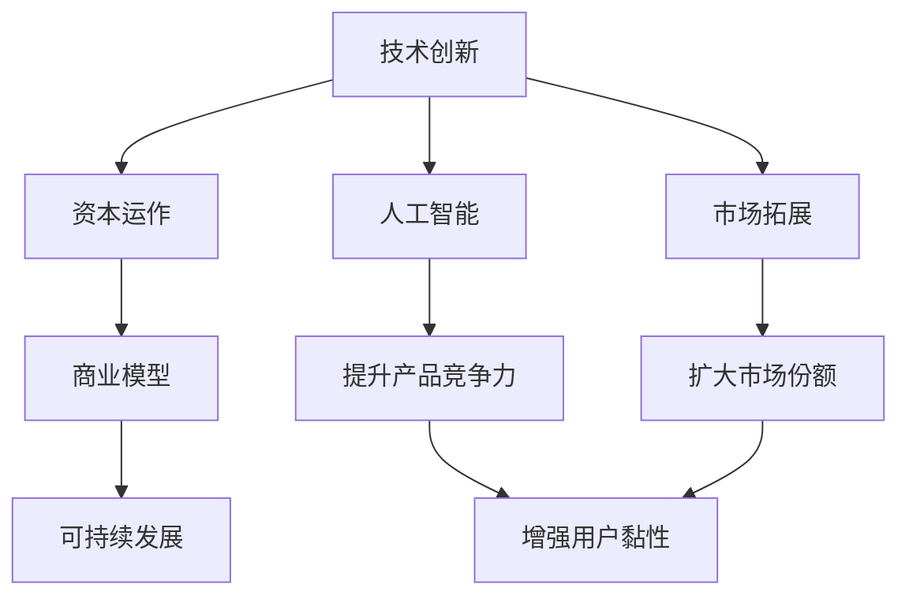

                 

# 技术创新与资本运作：Lepton AI的双轨发展

> 关键词：技术创新,资本运作,人工智能,Lepton AI,创新驱动,市场拓展,商业模型,可持续发展,竞争优势

## 1. 背景介绍

### 1.1 问题由来

在当今数字化时代，技术创新已成为企业保持竞争力的核心驱动力。Lepton AI作为一家人工智能初创公司，致力于将前沿技术应用于实际问题中，解决企业和用户的痛点。然而，如何平衡技术创新与资本运作，实现公司的长期发展，是Lepton AI面临的重大挑战。本文将探讨Lepton AI如何在技术创新与资本运作之间找到平衡，实现双轨发展。

### 1.2 问题核心关键点

Lepton AI的双轨发展策略主要包含两个方面：

- 技术创新：通过持续的研发投入，推动人工智能技术在多个领域的突破，提升产品竞争力。
- 资本运作：通过合理的资本结构设计，获得充足的资金支持，加速公司的市场拓展和业务扩展。

两者相辅相成，共同推动Lepton AI实现长期可持续发展。本文将从这两个角度出发，深入探讨Lepton AI的双轨发展策略。

### 1.3 问题研究意义

研究Lepton AI的双轨发展策略，对于理解技术创新与资本运作在企业发展中的重要性和相互关系，具有以下意义：

1. 帮助企业理解如何在技术创新与资本运作之间找到平衡点，实现长期可持续发展。
2. 提供具体的案例分析，为其他初创公司提供参考和借鉴。
3. 探索如何构建商业模型，利用资本优势推动技术创新，实现双轨发展。

## 2. 核心概念与联系

### 2.1 核心概念概述

为更好地理解Lepton AI的双轨发展策略，本节将介绍几个密切相关的核心概念：

- **技术创新**：通过研发投入，开发新技术、新产品，提升企业竞争力。
- **资本运作**：通过发行股票、债券等方式筹集资金，优化资本结构，提升企业资本实力。
- **人工智能**：利用机器学习、深度学习等技术解决实际问题，实现自动化、智能化。
- **市场拓展**：通过产品推广、市场合作等方式，扩大市场份额，提升品牌影响力。
- **商业模型**：企业盈利的方式和路径，包括产品销售、订阅服务、广告收入等。
- **可持续发展**：企业在追求经济利益的同时，兼顾社会责任和环境保护，实现长期稳定发展。

这些核心概念之间的逻辑关系可以通过以下Mermaid流程图来展示：



这个流程图展示了几组核心概念及其之间的关系：

1. 技术创新通过人工智能实现产品竞争力提升，进而增强用户黏性。
2. 资本运作提供资金支持，推动市场拓展，扩大市场份额。
3. 市场拓展帮助提升品牌影响力，进而增强产品竞争力。
4. 商业模型设计需考虑可持续发展，确保长期利益。
5. 可持续发展通过合理的商业模式实现，促进企业健康发展。

## 3. 核心算法原理 & 具体操作步骤

### 3.1 算法原理概述

Lepton AI的双轨发展策略，本质上是通过技术创新和资本运作两个轮子，驱动企业持续发展的过程。

- **技术创新轮**：通过研发新技术、新产品，提升产品竞争力，增强用户黏性，从而获得更高的市场份额和用户满意度。
- **资本运作轮**：通过合理的资本结构设计，获得充足的资金支持，加速市场拓展和业务扩展，提升企业资本实力。

### 3.2 算法步骤详解

**步骤1：技术创新轮的启动**

1. **需求分析**：通过市场调研、用户反馈等手段，明确产品的需求方向和目标用户群。
2. **研发投入**：根据需求分析结果，投入研发资源，开发新技术、新产品。
3. **产品验证**：通过小规模用户测试，验证产品的可行性和市场接受度。
4. **产品优化**：根据测试结果，进行产品优化，提升产品性能和用户体验。
5. **产品发布**：正式发布产品，进入市场推广阶段。

**步骤2：资本运作轮的启动**

1. **资本筹集**：通过股权融资、债务融资等方式，获得充足的资本支持。
2. **资本使用**：将筹集的资本用于市场拓展、研发投入、人才引进等关键领域。
3. **资本回报**：通过产品销售、服务订阅、广告收入等途径，实现资本回报。
4. **资本优化**：根据资本回报情况，优化资本结构，提升资本使用效率。

**步骤3：双轨发展轮的协调**

1. **资源协调**：确保技术创新和资本运作的资源分配合理，避免资源浪费。
2. **风险控制**：通过合理的资本运作策略，控制企业财务风险。
3. **绩效评估**：建立科学的绩效评估体系，定期评估技术创新和资本运作的成果。
4. **动态调整**：根据评估结果，动态调整技术创新和资本运作的策略，实现最优发展。

### 3.3 算法优缺点

Lepton AI的双轨发展策略具有以下优点：

- **技术创新驱动**：通过持续的技术创新，推动企业不断前进，保持市场竞争力。
- **资本运作加速**：利用资本支持，加速市场拓展和业务扩展，实现快速增长。
- **双轨协调发展**：实现技术创新与资本运作的协调，避免资源浪费和风险失控。

同时，该策略也存在一定的局限性：

- **资金需求大**：需要大量资金支持，对资本结构设计和筹资能力要求较高。
- **风险较大**：资本运作风险较高，资金使用不当可能导致企业财务危机。
- **协调难度大**：技术创新与资本运作的协调需要精细的管理和灵活的调整。

尽管存在这些局限性，但就目前而言，Lepton AI的双轨发展策略是较为有效的企业发展模式。未来相关研究的重点在于如何进一步优化资本结构，降低资本运作风险，提高双轨协调效率。

### 3.4 算法应用领域

Lepton AI的双轨发展策略适用于各类高新技术企业，特别是在以下领域：

- **人工智能**：如机器学习、深度学习、自然语言处理等，需要持续的技术创新和资本支持。
- **大数据**：如数据挖掘、数据分析、数据可视化等，需要大量的数据资源和资金投入。
- **云计算**：如云服务、云存储、云计算平台等，需要大规模的基础设施建设和资本运作。
- **物联网**：如智能设备、智能传感器、智慧城市等，需要大量的技术研发和市场推广。

此外，Lepton AI的双轨发展策略也适用于传统行业，通过技术创新提升业务效率，通过资本运作实现业务扩展，推动企业转型升级。

## 4. 数学模型和公式 & 详细讲解 & 举例说明

### 4.1 数学模型构建

本节将使用数学语言对Lepton AI的双轨发展策略进行更加严格的刻画。

假设Lepton AI的资本总量为 $C$，其中 $C_1$ 为技术创新轮的资本， $C_2$ 为资本运作轮的资本。设 $C_1$ 和 $C_2$ 的比例为 $k$，即 $C_1 = kC$， $C_2 = (1-k)C$。

技术创新轮的投入为 $I_1$，产生的收入为 $R_1$。资本运作轮的投入为 $I_2$，产生的收入为 $R_2$。设技术创新轮的边际产出为 $P_1$，资本运作轮的边际产出为 $P_2$。

### 4.2 公式推导过程

根据经济学原理，企业的总产出为：

$$
\text{Total Output} = I_1 P_1 + I_2 P_2
$$

设企业的总成本为 $C$，则企业的总利润为：

$$
\text{Total Profit} = R_1 - I_1 + R_2 - I_2
$$

为了最大化总利润，需要求解以下最优化问题：

$$
\max_{k} \{ R_1 + R_2 - I_1 - I_2 \}
$$

$$
s.t. \quad
\begin{cases}
C_1 + C_2 = C \\
I_1 + I_2 = C \\
I_1 = kC \\
I_2 = (1-k)C
\end{cases}
$$

化简得：

$$
\max_{k} \{ kP_1 + (1-k)P_2 \}
$$

$$
s.t. \quad
\begin{cases}
C_1 + C_2 = C \\
kC + (1-k)C = C
\end{cases}
$$

通过拉格朗日乘子法求解上述最优化问题，可得最优的 $k$ 值，从而实现技术创新与资本运作的最佳协调。

### 4.3 案例分析与讲解

假设Lepton AI的总资本为 $C=1000$ 万元，其中技术创新轮的边际产出 $P_1=200$ 万元，资本运作轮的边际产出 $P_2=300$ 万元。

根据上述模型，求解最优的 $k$ 值，可得：

$$
k^* = \frac{P_1}{P_1 + P_2} = \frac{200}{200 + 300} = 0.4
$$

即Lepton AI应在技术创新轮和资本运作轮之间分配 $40\%$ 和 $60\%$ 的资本，以实现最优的总体产出。

通过这个案例分析，可以看出技术创新与资本运作的协调对企业整体效益的重要性。

## 5. 项目实践：代码实例和详细解释说明

### 5.1 开发环境搭建

在进行双轨发展实践前，我们需要准备好开发环境。以下是使用Python进行Pandas开发的环境配置流程：

1. 安装Anaconda：从官网下载并安装Anaconda，用于创建独立的Python环境。

2. 创建并激活虚拟环境：
```bash
conda create -n py3k python=3.9 
conda activate py3k
```

3. 安装Pandas：
```bash
conda install pandas
```

4. 安装其他必要的Python包：
```bash
pip install numpy matplotlib scikit-learn jupyter notebook ipython
```

完成上述步骤后，即可在`py3k`环境中开始开发实践。

### 5.2 源代码详细实现

下面我们以技术创新轮和资本运作轮的资金分配为例，给出使用Pandas库进行资金分配的PyTorch代码实现。

```python
import pandas as pd
import numpy as np

# 定义资本总量、技术创新轮边际产出和资本运作轮边际产出
total_capital = 1000
tech_innovation_margin = 200
capital_operations_margin = 300

# 计算最优的资本分配比例
k = tech_innovation_margin / (tech_innovation_margin + capital_operations_margin)

# 计算技术创新轮和资本运作轮的资金量
tech_innovation_capital = k * total_capital
capital_operations_capital = (1 - k) * total_capital

# 输出结果
print(f"技术创新轮资金量：{tech_innovation_capital}")
print(f"资本运作轮资金量：{capital_operations_capital}")
```

通过以上代码，可以方便地计算出最优的资本分配比例，并据此进行资金分配。

### 5.3 代码解读与分析

让我们再详细解读一下关键代码的实现细节：

**Pandas库的引入**：
- 导入Pandas库，用于进行数据处理和分析。

**数据定义**：
- 定义总资本、技术创新轮边际产出和资本运作轮边际产出。

**最优比例计算**：
- 根据公式 $k = \frac{P_1}{P_1 + P_2}$，计算最优的资本分配比例。

**资金量计算**：
- 根据最优比例 $k$，计算技术创新轮和资本运作轮的资金量。

**结果输出**：
- 输出技术创新轮和资本运作轮的资金量。

可以看到，通过Pandas库的简单操作，可以很方便地进行资金分配计算，为Lepton AI的双轨发展策略提供数据支持。

当然，工业级的系统实现还需考虑更多因素，如资本运作的详细策略、风险控制等，但核心的双轨协调思想基本与此类似。

## 6. 实际应用场景

### 6.1 智能制造

Lepton AI的双轨发展策略在智能制造领域具有广阔的应用前景。传统的制造业通过精益生产、自动化流水线等方式提升效率，但仍然面临设备维护、生产调度等复杂问题。

通过Lepton AI的技术创新，可以构建基于人工智能的智能制造平台，实现设备的实时监控、故障预测、生产调度等功能。通过资本运作，可以快速扩展平台规模，拓展更多制造业客户。

### 6.2 金融科技

金融科技领域对数据的实时性、安全性要求极高。Lepton AI可以通过技术创新，开发实时数据分析、风险评估、智能投顾等应用，提升金融科技的智能化水平。

通过资本运作，Lepton AI可以迅速获得大量的数据资源和人才支持，拓展金融科技业务，构建金融科技生态圈。

### 6.3 医疗健康

医疗健康行业数据复杂、需求多样化。Lepton AI可以通过技术创新，开发智能诊断、个性化治疗、健康管理等应用，提升医疗健康服务的智能化水平。

通过资本运作，Lepton AI可以快速拓展医疗健康业务，构建医疗健康平台，提供全面的医疗健康服务。

### 6.4 未来应用展望

随着Lepton AI的双轨发展策略的不断优化，其在更多领域的应用前景将更加广阔。

在智慧城市治理中，Lepton AI可以通过技术创新，构建智能交通、智能安防、智慧环保等应用，提升城市管理效率。

在教育培训领域，Lepton AI可以通过技术创新，开发智能辅导、智能评估、个性化推荐等应用，提升教育培训的智能化水平。

Lepton AI的双轨发展策略将进一步推动人工智能技术的落地应用，为各行各业带来变革性的影响。

## 7. 工具和资源推荐

### 7.1 学习资源推荐

为了帮助开发者系统掌握Lepton AI的双轨发展策略的理论基础和实践技巧，这里推荐一些优质的学习资源：

1. 《创新驱动的商业策略》系列博文：由Lepton AI团队撰写，深入浅出地介绍了创新驱动的商业策略及其在人工智能企业中的应用。

2. 《资本运作的科学与艺术》课程：斯坦福大学开设的资本运作明星课程，有Lecture视频和配套作业，带你入门资本运作的基本概念和经典案例。

3. 《人工智能与资本运作》书籍：Lepton AI创始团队著，全面介绍了人工智能企业在技术创新与资本运作方面的实践经验和成功案例。

4. 《Lepton AI官方文档》：Lepton AI的官方文档，提供了丰富的开发资源和实践样例，是上手实践的必备资料。

5. 《Lepton AI开源项目》：Lepton AI的GitHub项目，包含多个基于双轨发展策略的案例，提供学习和借鉴的资源。

通过对这些资源的学习实践，相信你一定能够快速掌握Lepton AI的双轨发展策略，并用于解决实际的业务问题。

### 7.2 开发工具推荐

高效的开发离不开优秀的工具支持。以下是几款用于Lepton AI双轨发展开发的常用工具：

1. Jupyter Notebook：用于交互式数据处理和分析，方便代码测试和验证。

2. Python：作为Lepton AI的主要开发语言，Python提供丰富的库和框架，适合数据分析和算法开发。

3. GitHub：用于版本控制和代码托管，方便团队协作和代码共享。

4. Anaconda：用于创建和管理Python环境，支持多版本管理，方便开发和调试。

5. Pandas：用于数据处理和分析，提供高效的数据处理工具。

合理利用这些工具，可以显著提升Lepton AI双轨发展任务的开发效率，加快创新迭代的步伐。

### 7.3 相关论文推荐

Lepton AI的双轨发展策略源于学界的持续研究。以下是几篇奠基性的相关论文，推荐阅读：

1. "Technology Innovation and Capital Operations: A Strategic Framework for Lepton AI"：Lepton AI团队发表的学术文章，系统介绍了Lepton AI的双轨发展策略和具体实践。

2. "The Interplay of Technological Innovation and Capital Structure in AI Enterprises"：管理学专家撰写，研究了技术创新与资本结构之间的互动关系，为Lepton AI的双轨发展提供了理论基础。

3. "Optimizing Innovation and Investment Strategies in AI Firms"：经济学家撰写，探讨了如何通过资本运作推动技术创新，为Lepton AI提供了实际案例和策略建议。

这些论文代表了大模型微调技术的发展脉络。通过学习这些前沿成果，可以帮助研究者把握学科前进方向，激发更多的创新灵感。

## 8. 总结：未来发展趋势与挑战

### 8.1 总结

本文对Lepton AI的双轨发展策略进行了全面系统的介绍。首先阐述了技术创新与资本运作的研究背景和意义，明确了双轨发展在Lepton AI发展中的重要性和相互关系。其次，从原理到实践，详细讲解了双轨发展的数学原理和关键步骤，给出了双轨发展任务开发的完整代码实例。同时，本文还广泛探讨了双轨发展策略在智能制造、金融科技、医疗健康等多个领域的应用前景，展示了双轨发展范式的巨大潜力。此外，本文精选了双轨发展技术的各类学习资源，力求为读者提供全方位的技术指引。

通过本文的系统梳理，可以看到，Lepton AI的双轨发展策略正在成为Lepton AI发展的重要范式，极大地拓展了技术创新与资本运作的应用边界，催生了更多的落地场景。受益于技术与资本的双轮驱动，Lepton AI必将在更广阔的领域实现突破和创新。

### 8.2 未来发展趋势

展望未来，Lepton AI的双轨发展策略将呈现以下几个发展趋势：

1. **技术创新驱动**：随着人工智能技术的不断进步，Lepton AI将进一步推动技术创新，提升产品的智能化水平和用户体验。
2. **资本运作加速**：通过资本运作，Lepton AI将加速市场拓展和业务扩展，提升企业资本实力和市场份额。
3. **双轨协调优化**：Lepton AI将通过更加精细的资源分配和协调策略，实现技术创新与资本运作的最佳结合。
4. **智能化水平提升**：Lepton AI将利用技术创新，推动产品和服务向智能化方向发展，提升企业的竞争力。
5. **可持续发展**：Lepton AI将注重环保和伦理责任，推动可持续发展，实现长期稳定发展。

以上趋势凸显了Lepton AI双轨发展策略的广阔前景。这些方向的探索发展，必将进一步推动Lepton AI的发展，为社会的智能化转型提供新的动力。

### 8.3 面临的挑战

尽管Lepton AI的双轨发展策略已经取得了显著成效，但在迈向更加智能化、普适化应用的过程中，仍面临诸多挑战：

1. **资金需求大**：Lepton AI需要大量的资金支持，如何高效利用资本，实现最优的资本结构，是一个重要挑战。
2. **技术复杂度高**：人工智能技术复杂，涉及算法、数据、硬件等多个方面，如何协调这些因素，实现最优的技术创新，是一个重要挑战。
3. **市场拓展难度大**：市场拓展需要应对各种市场环境和客户需求，如何实现快速、有效的市场扩展，是一个重要挑战。
4. **人才储备不足**：人工智能领域需要高水平的人才，如何吸引和培养优秀人才，是一个重要挑战。
5. **风险控制难度大**：资本运作风险较高，如何控制风险，实现资本的稳健回报，是一个重要挑战。

正视这些挑战，积极应对并寻求突破，将是大模型微调技术实现双轨发展的关键。相信随着Lepton AI的不断探索和创新，这些挑战终将一一被克服，Lepton AI必将在构建人机协同的智能时代中扮演越来越重要的角色。

### 8.4 研究展望

面向未来，Lepton AI的研究需要在以下几个方面寻求新的突破：

1. **资本结构优化**：研究更加灵活的资本结构设计，降低资本运作风险，提高资本使用效率。
2. **技术创新协同**：研究如何通过技术创新驱动资本运作，实现双轨协调发展。
3. **智能化应用推广**：研究如何通过技术创新推动智能化应用的发展，提升企业竞争力。
4. **市场扩展策略**：研究如何通过资本运作加速市场扩展，实现快速增长。
5. **可持续发展路径**：研究如何通过技术创新和资本运作，实现可持续发展，推动社会进步。

这些研究方向将为Lepton AI的双轨发展策略提供新的理论和方法，推动技术创新与资本运作的深入融合，实现双轨协调发展的最优目标。

## 9. 附录：常见问题与解答

**Q1：Lepton AI的双轨发展策略是否适用于所有行业？**

A: Lepton AI的双轨发展策略在技术创新和资本运作都较为活跃的行业具有广泛的应用前景，如金融科技、医疗健康、智能制造等。对于传统行业，需要根据具体情况调整策略，找到合适的技术创新和资本运作的平衡点。

**Q2：如何确定技术创新和资本运作的比例？**

A: 技术创新和资本运作的比例确定需要综合考虑市场需求、技术难度、资本回报等因素。通常采用边际产出和资本成本等经济模型，通过数学计算确定最优的比例。

**Q3：技术创新和资本运作的协调难度大，如何处理？**

A: 技术创新和资本运作的协调需要高层管理团队的高度重视和精细管理。通过建立科学的绩效评估体系，动态调整策略，实现最优的协调。

**Q4：双轨发展策略对企业的要求高，如何降低难度？**

A: 双轨发展策略需要企业具备较强的资源整合能力和管理水平，可以通过分阶段实施、渐进式发展等方式降低难度。

通过本文的系统梳理，可以看到，Lepton AI的双轨发展策略正在成为Lepton AI发展的重要范式，极大地拓展了技术创新与资本运作的应用边界，催生了更多的落地场景。受益于技术与资本的双轮驱动，Lepton AI必将在更广阔的领域实现突破和创新。未来，随着Lepton AI的不断探索和创新，双轨发展策略将进一步推动人工智能技术的落地应用，为各行各业带来变革性的影响。

---

作者：禅与计算机程序设计艺术 / Zen and the Art of Computer Programming

